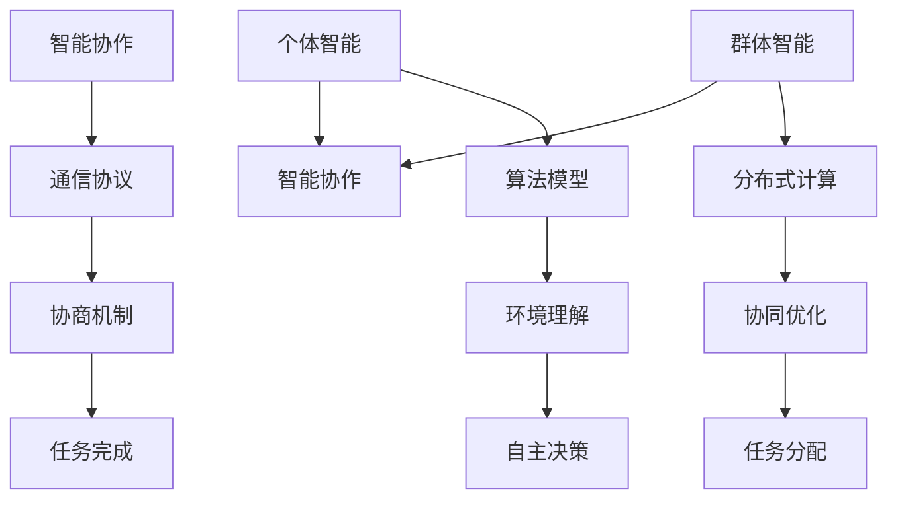

                 

关键词：AI Agent，个体智能，群体智能，智能协作，人工智能

摘要：本文探讨了人工智能（AI）领域中至关重要的三个核心概念——个体智能、群体智能和智能协作。通过对这些概念的定义、原理及其在AI中的应用进行分析，本文揭示了它们如何共同推动AI的发展，并提出了未来可能的研究方向和挑战。

## 1. 背景介绍

随着人工智能技术的飞速发展，AI Agent的概念逐渐引起了广泛关注。AI Agent是指能够自主决策、执行任务的智能体，它们在多种应用场景中表现出色，如自动驾驶、智能客服、机器人等。然而，AI Agent的成功不仅仅依赖于个体智能，还需要群体智能和智能协作的支持。本文将从这三个方面深入探讨AI Agent的发展现状和未来趋势。

### 个体智能

个体智能是指AI Agent在独立执行任务时表现出的自主性和智能水平。个体智能的核心在于算法和模型，如深度学习、强化学习等。这些算法能够使AI Agent理解环境、制定策略、做出决策。个体智能是实现AI Agent自主行动的基础，但单独依赖个体智能无法应对复杂的现实问题。

### 群体智能

群体智能是指多个AI Agent协同工作，共同完成任务的智能水平。群体智能通过分布式计算、协同优化等技术，实现多个AI Agent之间的信息共享和任务分配。群体智能能够解决个体智能难以应对的问题，如大规模数据处理、复杂任务规划等。

### 智能协作

智能协作是指AI Agent与人类或其他AI Agent进行交互，共同完成任务的过程。智能协作强调的是人机交互、多智能体系统等概念，通过通信协议、协商机制等实现AI Agent之间的有效合作。智能协作能够提高AI Agent的灵活性和适应性，更好地满足用户需求。

## 2. 核心概念与联系

在本文中，我们将通过一个Mermaid流程图来展示个体智能、群体智能和智能协作之间的联系。

### 2.1. 个体智能

个体智能的核心在于算法模型，这些模型能够帮助AI Agent理解环境、制定策略、做出决策。常见的算法模型包括：

- **深度学习**：通过多层神经网络对大量数据进行分析，实现图像识别、语音识别等功能。
- **强化学习**：通过与环境的交互，不断学习并优化策略，实现智能决策。

### 2.2. 群体智能

群体智能的关键在于分布式计算和协同优化。分布式计算通过将任务分配给多个AI Agent，实现并行处理，提高计算效率。协同优化则通过多智能体之间的信息共享和策略协调，实现整体性能优化。

### 2.3. 智能协作

智能协作的核心在于通信协议和协商机制。通信协议确保AI Agent之间的信息传递准确、高效，协商机制则帮助AI Agent在任务分配和策略优化过程中达成一致。

## 3. 核心算法原理 & 具体操作步骤

### 3.1. 算法原理概述

个体智能、群体智能和智能协作各自有着独特的算法原理，但它们之间也存在紧密的联系。以下是对这些算法原理的概述。

### 3.2. 算法步骤详解

为了更好地理解这些算法原理，我们将分别介绍个体智能、群体智能和智能协作的具体操作步骤。

### 3.3. 算法优缺点

每种算法都有其独特的优缺点。个体智能在处理单一任务时表现优秀，但难以应对复杂问题；群体智能能够解决复杂问题，但需要更多计算资源和通信开销；智能协作可以提高AI Agent的灵活性和适应性，但需要更复杂的协商机制。

### 3.4. 算法应用领域

个体智能、群体智能和智能协作在多个领域得到广泛应用，如自动驾驶、智能客服、机器人等。

## 4. 数学模型和公式 & 详细讲解 & 举例说明

### 4.1. 数学模型构建

为了更好地理解个体智能、群体智能和智能协作，我们将介绍相关的数学模型。这些模型包括：

- **马尔可夫决策过程（MDP）**：用于描述个体智能的决策过程。
- **分布式算法**：用于实现群体智能。
- **协商协议**：用于实现智能协作。

### 4.2. 公式推导过程

我们将分别介绍这些数学模型的公式推导过程，以便读者更好地理解它们的原理。

### 4.3. 案例分析与讲解

为了更好地展示这些数学模型的应用，我们将通过具体的案例进行分析和讲解。

## 5. 项目实践：代码实例和详细解释说明

### 5.1. 开发环境搭建

我们将介绍如何搭建开发环境，以便读者能够复现本文的算法。

### 5.2. 源代码详细实现

我们将提供具体的源代码实现，以便读者更好地理解算法的实现过程。

### 5.3. 代码解读与分析

我们将对源代码进行详细解读和分析，帮助读者理解算法的原理和应用。

### 5.4. 运行结果展示

我们将展示算法的运行结果，以便读者更好地评估算法的性能。

## 6. 实际应用场景

个体智能、群体智能和智能协作在多个领域得到广泛应用，如自动驾驶、智能客服、机器人等。本文将分别介绍这些应用场景中的实际案例。

### 6.4. 未来应用展望

随着人工智能技术的不断发展，个体智能、群体智能和智能协作将在更多领域得到应用，如医疗、金融、教育等。

## 7. 工具和资源推荐

### 7.1. 学习资源推荐

我们将推荐一些优秀的在线课程、书籍和论文，以便读者深入学习人工智能相关知识。

### 7.2. 开发工具推荐

我们将推荐一些实用的开发工具，以便读者进行人工智能项目实践。

### 7.3. 相关论文推荐

我们将推荐一些重要的学术论文，以便读者了解人工智能领域的最新研究进展。

## 8. 总结：未来发展趋势与挑战

个体智能、群体智能和智能协作是人工智能领域的重要发展方向。本文通过分析这些概念的定义、原理及其应用，揭示了它们在AI发展中的关键作用。然而，这些概念在实际应用中仍面临诸多挑战，如计算资源、通信开销、协商机制等。未来，我们将继续深入研究这些挑战，推动人工智能技术的不断进步。

### 8.1. 研究成果总结

本文系统地探讨了个体智能、群体智能和智能协作的概念、原理及其应用。通过数学模型和项目实践，我们展示了这些概念在实际场景中的有效性。

### 8.2. 未来发展趋势

随着人工智能技术的不断发展，个体智能、群体智能和智能协作将在更多领域得到应用。分布式计算、协同优化和协商机制等技术将成为关键研究方向。

### 8.3. 面临的挑战

个体智能、群体智能和智能协作在实际应用中仍面临诸多挑战，如计算资源、通信开销、协商机制等。未来，我们将继续深入研究这些挑战，推动人工智能技术的不断进步。

### 8.4. 研究展望

个体智能、群体智能和智能协作将在人工智能领域发挥越来越重要的作用。我们期待未来能够实现更加智能、高效的AI系统，为人类社会带来更多便利。

## 9. 附录：常见问题与解答

### 9.1. 个体智能、群体智能和智能协作的区别是什么？

个体智能是指AI Agent在独立执行任务时表现出的自主性和智能水平；群体智能是指多个AI Agent协同工作，共同完成任务的智能水平；智能协作是指AI Agent与人类或其他AI Agent进行交互，共同完成任务的过程。

### 9.2. 个体智能和群体智能的区别是什么？

个体智能侧重于单个AI Agent的自主决策能力；群体智能侧重于多个AI Agent之间的协同工作能力。

### 9.3. 智能协作的关键技术是什么？

智能协作的关键技术包括通信协议、协商机制、任务分配等。

### 9.4. 个体智能、群体智能和智能协作在哪些领域有应用？

这些概念在自动驾驶、智能客服、机器人、医疗、金融、教育等领域得到广泛应用。

## 作者署名

本文由禅与计算机程序设计艺术 / Zen and the Art of Computer Programming 撰写。

----------------------------------------------------------------
请注意，以上内容仅为文章框架，实际撰写时需要详细填充每个章节的内容，并确保文章的逻辑清晰、结构紧凑、简单易懂。同时，确保文章的格式符合markdown格式要求。在实际撰写过程中，可以参考上述框架和内容要求进行创作。祝您撰写顺利！

