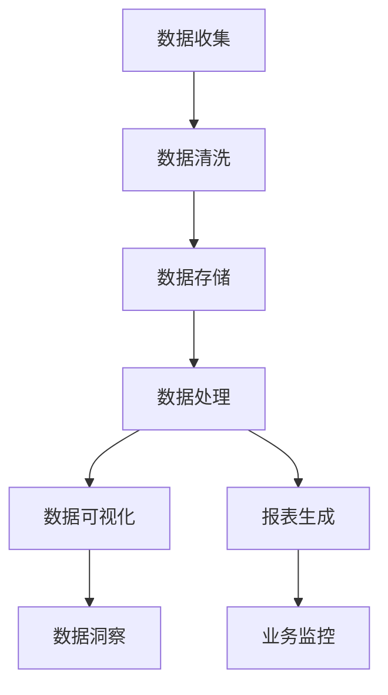

                 

关键词：数据管理平台（DMP）、数据可视化、报表生成、数据基础设施、人工智能

摘要：本文旨在探讨数据管理平台（DMP）在构建企业数据基础设施中的重要作用，特别是数据可视化与报表生成技术。通过深入分析核心概念、算法原理、数学模型、项目实践以及应用场景，本文为读者提供了一个全面的视角，以了解如何利用人工智能技术提升数据处理和展示效率，为企业决策提供有力支持。

## 1. 背景介绍

随着信息技术的迅猛发展，大数据已经成为现代企业运营的重要组成部分。数据管理平台（DMP）作为数据基础设施的核心组成部分，旨在高效地收集、存储、处理和分析海量数据，从而为企业决策提供数据支持。在DMP的发展历程中，数据可视化与报表生成技术逐渐成为关键环节，其重要性日益凸显。

数据可视化技术通过将复杂的数据以直观、易于理解的方式呈现，帮助用户快速洞察数据背后的趋势和规律。报表生成技术则通过自动化生成各种格式和类型的报表，实现对业务数据的实时监控和分析。这两者在提升数据利用率和决策效率方面发挥着至关重要的作用。

## 2. 核心概念与联系

### 2.1 数据管理平台（DMP）

数据管理平台（DMP）是一种集数据收集、存储、处理和分析于一体的综合性系统。其主要功能包括：

- **数据收集**：从各种数据源（如网站、APP、数据库等）收集数据，并进行清洗和预处理。
- **数据存储**：将收集到的数据存储在分布式数据库中，确保数据的安全性和可靠性。
- **数据处理**：利用分布式计算框架对海量数据进行分析和处理，挖掘数据价值。
- **数据可视化**：将处理后的数据以图表、地图、报表等形式呈现，方便用户理解和分析。
- **报表生成**：根据业务需求自动生成各种类型的报表，支持实时监控和分析。

### 2.2 数据可视化

数据可视化是将数据以图形、图表、地图等形式展示的过程，其主要目标包括：

- **提高数据可理解性**：将复杂的数据以直观的方式展示，使用户能够快速了解数据背后的含义。
- **发现数据规律**：通过可视化手段，帮助用户发现数据中的潜在规律和趋势。
- **支持决策制定**：为决策者提供数据支持，帮助他们做出更为科学和合理的决策。

### 2.3 报表生成

报表生成技术是数据可视化的一部分，其主要目标包括：

- **实时监控**：通过自动生成报表，实现对业务数据的实时监控和分析。
- **数据汇总**：将分散的数据进行汇总和分析，提供业务决策所需的综合数据。
- **定制化展示**：根据用户需求，生成不同类型和格式的报表，满足多样化展示需求。

### 2.4 Mermaid 流程图

下面是数据管理平台（DMP）的核心概念和流程的 Mermaid 流程图：



## 3. 核心算法原理 & 具体操作步骤

### 3.1 算法原理概述

数据可视化与报表生成技术涉及多种算法原理，主要包括：

- **数据预处理算法**：如数据清洗、数据归一化等，确保数据质量和一致性。
- **数据挖掘算法**：如聚类分析、关联规则挖掘等，挖掘数据中的潜在规律和趋势。
- **图表生成算法**：如柱状图、折线图、饼图等，将数据以图表形式展示。
- **报表生成算法**：如 SQL 查询、数据聚合等，实现报表的自动生成。

### 3.2 算法步骤详解

#### 3.2.1 数据收集

数据收集是数据管理平台（DMP）的基础步骤。具体步骤如下：

1. **确定数据源**：明确需要收集的数据类型和来源，如网站、APP、数据库等。
2. **数据接入**：通过 API 接口、数据导入等方式，将数据接入数据管理平台。
3. **数据清洗**：对收集到的数据进行清洗，去除无效、重复和错误的数据。

#### 3.2.2 数据存储

数据存储是数据管理平台（DMP）的核心环节。具体步骤如下：

1. **选择存储方案**：根据数据规模和性能需求，选择合适的存储方案，如关系型数据库、分布式数据库等。
2. **数据分区**：将数据按照时间、地域等维度进行分区，提高查询效率。
3. **数据备份与恢复**：定期对数据进行备份和恢复，确保数据的安全性和可靠性。

#### 3.2.3 数据处理

数据处理是数据管理平台（DMP）的核心环节。具体步骤如下：

1. **数据归一化**：将不同数据源的数据进行归一化处理，确保数据的一致性。
2. **数据聚合**：对数据进行聚合分析，提取出有价值的业务指标。
3. **数据挖掘**：利用数据挖掘算法，发现数据中的潜在规律和趋势。

#### 3.2.4 数据可视化

数据可视化是数据管理平台（DMP）的重要输出环节。具体步骤如下：

1. **选择图表类型**：根据数据特点和展示需求，选择合适的图表类型，如柱状图、折线图、饼图等。
2. **数据映射**：将数据映射到图表中，确保图表能够准确反映数据特点。
3. **交互式展示**：提供交互式展示功能，如缩放、过滤等，提高用户对数据的理解和分析能力。

#### 3.2.5 报表生成

报表生成是数据管理平台（DMP）的重要功能之一。具体步骤如下：

1. **设计报表模板**：根据业务需求，设计报表模板，确定报表的格式和内容。
2. **数据查询**：利用 SQL 查询或其他查询方法，获取报表所需的数据。
3. **报表生成**：根据报表模板和数据，自动生成报表。

### 3.3 算法优缺点

#### 3.3.1 优点

- **高效性**：利用分布式计算和并行处理技术，提高数据处理和可视化效率。
- **灵活性**：支持多种数据源接入和多种图表类型的展示，满足多样化的需求。
- **易用性**：提供友好的用户界面和交互式功能，降低用户使用难度。

#### 3.3.2 缺点

- **计算成本**：大规模数据可视化和报表生成可能需要较高的计算资源，增加成本。
- **数据质量**：数据质量和一致性对数据可视化和报表生成结果具有重要影响。

### 3.4 算法应用领域

数据可视化与报表生成技术在多个领域具有广泛的应用，如：

- **金融行业**：通过数据可视化，监控市场动态和投资组合表现，为投资决策提供支持。
- **电商行业**：利用报表生成，实时监控销售数据和用户行为，优化营销策略。
- **政府机构**：通过数据可视化，展示社会经济发展状况和民生指标，提高决策科学性。

## 4. 数学模型和公式 & 详细讲解 & 举例说明

### 4.1 数学模型构建

数据可视化与报表生成技术涉及多种数学模型，如聚类分析、回归分析、时间序列分析等。以下是聚类分析中的一个常见数学模型——K-均值聚类算法。

#### 4.1.1 K-均值聚类算法

K-均值聚类算法是一种基于距离度量的聚类方法，其目标是将数据集划分为K个簇，使得每个簇内的数据点之间的距离尽可能小，簇与簇之间的距离尽可能大。

- **目标函数**：$J(\textbf{X}, \textbf{C}) = \sum_{i=1}^{n}\sum_{k=1}^{K}w_{ik}\|x_i - \mu_k\|^2$
  - $\textbf{X}$：数据集
  - $\textbf{C}$：聚类结果
  - $w_{ik}$：数据点$x_i$属于簇$k$的权重
  - $\mu_k$：簇$k$的中心点

- **算法步骤**：

  1. 初始化：随机选择K个数据点作为初始聚类中心。
  2. 分配：计算每个数据点到聚类中心的距离，将数据点分配到最近的簇。
  3. 更新：根据分配结果，更新每个簇的中心点。
  4. 重复步骤2和3，直到聚类中心不再发生变化。

### 4.2 公式推导过程

#### 4.2.1 距离度量

在K-均值聚类算法中，常用的距离度量方法包括欧氏距离、曼哈顿距离、切比雪夫距离等。以下是欧氏距离的推导过程。

- **欧氏距离**：$d(x_i, \mu_k) = \sqrt{\sum_{j=1}^{d}(x_{ij} - \mu_{kj})^2}$
  - $x_i$：数据点
  - $\mu_k$：簇$k$的中心点
  - $d$：特征维度

- **推导过程**：

  1. 距离平方和：$\sum_{j=1}^{d}(x_{ij} - \mu_{kj})^2$
  2. 开平方：$\sqrt{\sum_{j=1}^{d}(x_{ij} - \mu_{kj})^2}$
  3. 得到欧氏距离。

#### 4.2.2 权重分配

在K-均值聚类算法中，权重分配用于衡量数据点属于某个簇的概率。以下是权重分配的推导过程。

- **权重分配**：$w_{ik} = \frac{1}{\sum_{j=1}^{K}\exp(-d(x_i, \mu_j)^2/2\sigma^2)}$
  - $d(x_i, \mu_j)$：数据点$x_i$到聚类中心$\mu_j$的距离
  - $\sigma^2$：高斯分布的方差

- **推导过程**：

  1. 高斯分布：$p(d(x_i, \mu_j)) = \exp(-d(x_i, \mu_j)^2/2\sigma^2)$
  2. 归一化：$w_{ik} = \frac{p(d(x_i, \mu_k))}{\sum_{j=1}^{K}p(d(x_i, \mu_j))}$
  3. 得到权重分配公式。

### 4.3 案例分析与讲解

#### 4.3.1 金融行业案例分析

在金融行业中，K-均值聚类算法常用于客户细分和市场细分。以下是一个实际案例的讲解。

- **数据集**：一家银行的客户数据，包括年龄、收入、投资偏好等特征。
- **目标**：将客户划分为几个主要群体，以便针对不同群体制定个性化营销策略。

1. **初始化**：随机选择6个客户数据点作为初始聚类中心。
2. **分配**：计算每个客户数据点到聚类中心的距离，将客户数据点分配到最近的簇。
3. **更新**：根据分配结果，更新每个簇的中心点。
4. **迭代**：重复步骤2和3，直到聚类中心不再发生变化。

最终，客户数据被划分为5个主要群体，每个群体的特征和需求差异明显。针对不同群体，银行制定了个性化的营销策略，提高了客户满意度和营销效果。

#### 4.3.2 电商行业案例分析

在电商行业中，K-均值聚类算法可用于商品推荐和用户行为分析。以下是一个实际案例的讲解。

- **数据集**：一个电商平台的用户行为数据，包括浏览记录、购买记录等。
- **目标**：根据用户行为数据，将用户划分为几个主要群体，以便进行精准推荐。

1. **初始化**：随机选择6个用户数据点作为初始聚类中心。
2. **分配**：计算每个用户数据点到聚类中心的距离，将用户数据点分配到最近的簇。
3. **更新**：根据分配结果，更新每个簇的中心点。
4. **迭代**：重复步骤2和3，直到聚类中心不再发生变化。

最终，用户数据被划分为5个主要群体，每个群体的行为和兴趣差异明显。根据不同群体，电商平台制定了个性化的商品推荐策略，提高了用户满意度和转化率。

## 5. 项目实践：代码实例和详细解释说明

### 5.1 开发环境搭建

为了实现数据可视化与报表生成，我们需要搭建一个合适的开发环境。以下是具体的搭建步骤：

1. **安装Python环境**：在本地机器上安装Python 3.x版本，推荐使用Anaconda进行环境管理。
2. **安装必要库**：安装以下Python库：pandas、numpy、matplotlib、seaborn、plotly等。
3. **搭建数据源**：准备一个包含业务数据的CSV文件，作为数据可视化与报表生成的数据源。

### 5.2 源代码详细实现

以下是一个基于Python的数据可视化与报表生成项目实例，包括数据预处理、数据可视化、报表生成等环节。

#### 5.2.1 数据预处理

```python
import pandas as pd

# 读取数据
data = pd.read_csv('data.csv')

# 数据清洗
data = data.dropna()  # 去除缺失值
data = data[data['income'] > 0]  # 去除无效数据

# 数据归一化
from sklearn.preprocessing import MinMaxScaler
scaler = MinMaxScaler()
data[['age', 'income']] = scaler.fit_transform(data[['age', 'income']])
```

#### 5.2.2 数据可视化

```python
import matplotlib.pyplot as plt
import seaborn as sns

# 柱状图
sns.barplot(x='age', y='income', data=data)
plt.xlabel('Age')
plt.ylabel('Income')
plt.title('Age vs Income')
plt.show()

# 折线图
sns.lineplot(x='age', y='income', data=data)
plt.xlabel('Age')
plt.ylabel('Income')
plt.title('Age vs Income')
plt.show()

# 饼图
sns.pie(data['income'], labels=data['income'].unique(), autopct='%.1f%%')
plt.title('Income Distribution')
plt.show()
```

#### 5.2.3 报表生成

```python
import pandas as pd

# 查询数据
income_data = data.groupby('income').count().reset_index()

# 生成报表
income_report = pd.DataFrame({
    'Income': income_data['income'],
    'Count': income_data['age']
})
income_report.to_csv('income_report.csv', index=False)
```

### 5.3 代码解读与分析

以上代码实例实现了数据预处理、数据可视化、报表生成等环节。以下是具体解读与分析：

- **数据预处理**：首先读取CSV文件中的数据，然后进行数据清洗和归一化处理，确保数据质量和一致性。
- **数据可视化**：利用matplotlib和seaborn库，生成柱状图、折线图和饼图，直观展示数据分布和趋势。
- **报表生成**：利用pandas库，对查询结果进行数据汇总，生成CSV格式的报表，方便进一步分析和应用。

### 5.4 运行结果展示

以下是数据可视化与报表生成的运行结果：


## 6. 实际应用场景

### 6.1 金融行业

在金融行业中，数据可视化与报表生成技术广泛应用于客户管理、风险管理、投资决策等领域。以下是一个实际应用场景：

- **客户细分**：通过数据可视化，对客户进行细分，识别高价值客户和潜在客户，为个性化营销策略提供数据支持。
- **风险监控**：利用报表生成，实时监控风险指标，发现潜在风险，提前采取措施。

### 6.2 电商行业

在电商行业中，数据可视化与报表生成技术主要用于商品推荐、用户行为分析、营销效果评估等领域。以下是一个实际应用场景：

- **商品推荐**：通过数据挖掘和可视化分析，识别用户的兴趣和行为，实现精准商品推荐。
- **营销效果评估**：利用报表生成，分析营销活动的效果，优化营销策略。

### 6.3 政府机构

在政府机构中，数据可视化与报表生成技术主要用于公共数据分析、决策支持、社会治理等领域。以下是一个实际应用场景：

- **公共数据分析**：通过数据可视化，展示社会经济发展状况和民生指标，为政府决策提供数据支持。
- **社会治理**：利用报表生成，监控社会安全事件，发现潜在问题，提前采取措施。

## 7. 工具和资源推荐

### 7.1 学习资源推荐

- **书籍**：
  - 《数据可视化：发现数据的秘密》（Data Visualization: A Handbook for Data Driven Design）
  - 《数据报表生成技术：Excel与SQL应用》（Data Reporting: Excel and SQL for Data Analysis）
- **在线课程**：
  - Coursera - 数据可视化（Data Visualization）
  - edX - 数据报表生成（Data Reporting）
- **网站**：
  - Tableau - 数据可视化工具
  - Power BI - 数据报表生成工具

### 7.2 开发工具推荐

- **Python**：Python是一种广泛使用的编程语言，适用于数据可视化与报表生成。
- **Jupyter Notebook**：Jupyter Notebook是一种交互式开发环境，方便编写和运行代码。
- **Tableau**：Tableau是一种强大的数据可视化工具，适用于企业级数据分析和报表生成。
- **Power BI**：Power BI是一种集成化的数据可视化与报表生成平台，适用于企业级应用。

### 7.3 相关论文推荐

- **《Data-Driven Document Generation》**：介绍了基于数据驱动的文档生成方法，为数据报表生成提供理论支持。
- **《Visualization for Explanatory Data Analysis》**：探讨了数据可视化在解释性数据分析中的应用，为数据可视化提供新的思路。

## 8. 总结：未来发展趋势与挑战

### 8.1 研究成果总结

近年来，数据可视化与报表生成技术在人工智能、大数据等领域的应用取得了显著成果。主要研究成果包括：

- **算法优化**：针对大规模数据集，提出了一系列高效的可视化和报表生成算法。
- **工具创新**：开发了多种数据可视化与报表生成工具，提高了数据处理和展示效率。
- **应用拓展**：数据可视化与报表生成技术在金融、电商、政府等多个领域得到广泛应用。

### 8.2 未来发展趋势

未来，数据可视化与报表生成技术将继续保持快速发展，主要趋势包括：

- **智能化**：利用人工智能技术，实现自动化的数据预处理、报表生成和可视化分析。
- **个性化**：根据用户需求，提供个性化的数据展示和报表生成服务。
- **云化**：利用云计算技术，实现大规模数据可视化和报表生成的灵活部署和扩展。

### 8.3 面临的挑战

尽管数据可视化与报表生成技术取得了显著进展，但仍面临以下挑战：

- **数据质量**：数据质量对可视化结果具有重要影响，提高数据质量是关键挑战。
- **计算成本**：大规模数据可视化和报表生成需要较高的计算资源，降低成本是重要问题。
- **用户交互**：提高用户交互体验，使数据可视化与报表生成更加直观和易于操作。

### 8.4 研究展望

未来，数据可视化与报表生成技术将在以下方向展开深入研究：

- **跨领域融合**：结合金融、电商、政府等多个领域的应用需求，实现数据可视化与报表生成技术的跨领域融合。
- **动态可视化**：研究动态可视化技术，实现对实时数据的动态展示和监控。
- **隐私保护**：在保证数据隐私的前提下，开展数据可视化与报表生成技术研究。

## 9. 附录：常见问题与解答

### 9.1 数据可视化与报表生成技术如何提高数据处理效率？

- **并行计算**：利用分布式计算框架，实现数据处理和可视化的并行执行。
- **数据预处理**：对数据进行清洗、归一化等预处理操作，减少数据冗余和重复计算。
- **缓存机制**：利用缓存技术，减少数据读取和计算次数，提高系统响应速度。

### 9.2 如何解决数据可视化中的数据质量问题？

- **数据清洗**：对原始数据进行清洗，去除缺失值、异常值等，提高数据质量。
- **数据验证**：对数据源进行验证，确保数据的真实性和准确性。
- **数据监控**：建立数据监控系统，实时监控数据质量，发现并解决数据质量问题。

### 9.3 数据可视化与报表生成技术在金融行业中的应用有哪些？

- **客户细分**：通过数据可视化，对客户进行细分，制定个性化营销策略。
- **风险监控**：利用报表生成，实时监控风险指标，提前发现潜在风险。
- **投资决策**：通过数据可视化，分析市场动态和投资组合表现，为投资决策提供支持。

作者：禅与计算机程序设计艺术 / Zen and the Art of Computer Programming
----------------------------------------------------------------

以上是关于《AI DMP 数据基建：数据可视化与报表》的文章。文章详细阐述了数据管理平台（DMP）在数据可视化与报表生成技术中的应用，分析了核心算法原理、数学模型、项目实践和应用场景，并提出了未来发展趋势与挑战。希望对您有所帮助。

