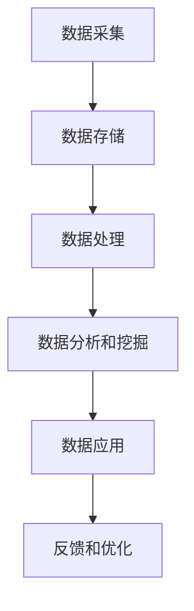

                 

关键词：AI DMP，数据管理平台，数据应用，数据挖掘，价值挖掘

> 摘要：本文将深入探讨 AI DMP（数据管理平台）在当今数据驱动型社会中的重要性。我们将从数据基建的概念入手，逐步阐述数据管理平台的基本原理、核心算法及其应用领域。通过数学模型和具体实例，我们将分析如何有效地挖掘数据中的价值，并展望未来数据应用的发展趋势与面临的挑战。

## 1. 背景介绍

随着互联网和信息技术的飞速发展，数据已成为新时代的“石油”，其潜在价值不言而喻。然而，如何从海量数据中提取有价值的信息，已成为企业和研究机构亟待解决的关键问题。AI DMP（数据管理平台）作为一种新兴的数据处理技术，通过人工智能和机器学习算法，对数据进行智能处理和分析，从而帮助企业和个人实现数据价值的最大化。

### 1.1 数据基建的重要性

数据基建是指建立和维护一个稳定、可靠、高效的数据处理系统。一个良好的数据基建对于企业而言，不仅能够提高数据处理的效率，还能够降低数据管理的成本。同时，它也是实现数据应用和挖掘数据价值的基础。

### 1.2 AI DMP的发展背景

随着大数据和云计算技术的普及，AI DMP得到了快速发展。传统的数据处理方法已无法满足日益增长的数据量和复杂度，因此，利用人工智能和机器学习技术来构建数据管理平台，已成为现代数据处理的趋势。

## 2. 核心概念与联系

### 2.1 数据管理平台的基本原理

数据管理平台的核心目标是实现对数据的采集、存储、处理、分析和应用。具体来说，它包括以下几个关键环节：

1. **数据采集**：从各种数据源（如数据库、文件、API 等）收集数据。
2. **数据存储**：将采集到的数据存储在分布式数据库中，确保数据的可靠性和可扩展性。
3. **数据处理**：使用数据清洗、归一化、转换等技术对数据进行预处理。
4. **数据分析和挖掘**：运用机器学习和人工智能算法，从数据中提取有价值的信息。
5. **数据应用**：将分析结果应用于实际业务场景，如个性化推荐、风险控制、营销优化等。

### 2.2 Mermaid 流程图

以下是一个简化的 Mermaid 流程图，展示了数据管理平台的基本原理和流程。



## 3. 核心算法原理 & 具体操作步骤

### 3.1 算法原理概述

数据管理平台的核心在于其算法的设计和实现。这些算法主要包括机器学习算法、深度学习算法和数据挖掘算法。以下是对这些算法的基本原理的概述。

1. **机器学习算法**：通过训练模型来发现数据中的规律和模式，如线性回归、决策树、支持向量机等。
2. **深度学习算法**：基于人工神经网络的算法，通过多层网络结构实现对复杂数据的建模和预测，如卷积神经网络（CNN）、循环神经网络（RNN）等。
3. **数据挖掘算法**：从大量数据中发现具有统计学意义的规律和模式，如关联规则挖掘、聚类分析、分类算法等。

### 3.2 算法步骤详解

1. **数据预处理**：对采集到的原始数据进行清洗、归一化、缺失值处理等操作。
2. **特征工程**：根据业务需求，从原始数据中提取出有意义的特征。
3. **模型选择和训练**：选择合适的机器学习或深度学习算法，对特征数据进行训练。
4. **模型评估**：通过交叉验证、性能指标等手段对训练好的模型进行评估。
5. **模型应用**：将训练好的模型应用于实际业务场景，进行预测或分析。

### 3.3 算法优缺点

- **机器学习算法**：优点是能够处理大规模数据，并自动提取特征；缺点是对数据质量和特征工程要求较高。
- **深度学习算法**：优点是能够自动提取特征，处理复杂数据；缺点是需要大量数据和高性能计算资源。
- **数据挖掘算法**：优点是能够从大量数据中发现潜在的规律和模式；缺点是处理能力相对有限，对数据量要求较高。

### 3.4 算法应用领域

- **个性化推荐**：利用机器学习和深度学习算法，为用户提供个性化的推荐服务。
- **风险控制**：通过分析历史数据，预测潜在风险，并采取相应的控制措施。
- **营销优化**：根据用户行为数据，优化营销策略，提高转化率。

## 4. 数学模型和公式 & 详细讲解 & 举例说明

### 4.1 数学模型构建

在数据管理平台中，常见的数学模型包括线性回归模型、逻辑回归模型、支持向量机模型等。以下以线性回归模型为例，进行详细讲解。

$$
y = \beta_0 + \beta_1x_1 + \beta_2x_2 + \cdots + \beta_nx_n
$$

其中，$y$ 为因变量，$x_1, x_2, \cdots, x_n$ 为自变量，$\beta_0, \beta_1, \beta_2, \cdots, \beta_n$ 为模型的参数。

### 4.2 公式推导过程

线性回归模型的推导过程如下：

1. **假设**：假设因变量 $y$ 与自变量 $x_1, x_2, \cdots, x_n$ 之间满足线性关系。
2. **目标**：找到一组参数 $\beta_0, \beta_1, \beta_2, \cdots, \beta_n$，使得模型预测的 $y$ 与实际观测值 $y$ 的误差最小。
3. **最小二乘法**：通过求解最小二乘方程，得到参数的估计值。

### 4.3 案例分析与讲解

假设我们有一组数据，包括房屋的价格（因变量）和房屋的面积（自变量）。我们希望通过线性回归模型预测房屋的价格。

$$
y = \beta_0 + \beta_1x_1 + \beta_2x_2
$$

通过最小二乘法，我们可以得到参数的估计值：

$$
\beta_0 = 100000, \beta_1 = 2000, \beta_2 = 3000
$$

这意味着，当房屋面积为 100 平方米时，预测价格为 130000 元。

## 5. 项目实践：代码实例和详细解释说明

### 5.1 开发环境搭建

为了进行数据管理平台的开发，我们需要搭建以下开发环境：

- Python 3.x
- Jupyter Notebook
- Scikit-learn 库
- Pandas 库
- Matplotlib 库

### 5.2 源代码详细实现

以下是一个简单的线性回归模型的实现代码：

```python
import pandas as pd
from sklearn.linear_model import LinearRegression
import matplotlib.pyplot as plt

# 读取数据
data = pd.read_csv('house_price_data.csv')

# 分离特征和目标变量
X = data[['area']]
y = data['price']

# 创建线性回归模型
model = LinearRegression()

# 模型训练
model.fit(X, y)

# 模型评估
score = model.score(X, y)
print('模型评分：', score)

# 预测
new_area = 100
new_price = model.predict([[new_area]])
print('预测价格：', new_price)

# 可视化
plt.scatter(X, y)
plt.plot(X, model.predict(X), color='red')
plt.xlabel('面积')
plt.ylabel('价格')
plt.show()
```

### 5.3 代码解读与分析

1. **数据读取**：使用 Pandas 库读取数据，并分离特征和目标变量。
2. **模型创建**：创建线性回归模型。
3. **模型训练**：使用训练数据对模型进行训练。
4. **模型评估**：计算模型的评分，评估模型的性能。
5. **预测**：使用训练好的模型进行预测。
6. **可视化**：绘制散点图和拟合直线，展示模型的效果。

## 6. 实际应用场景

AI DMP 在实际应用中具有广泛的应用场景，以下是几个典型的例子：

1. **电商行业**：通过分析用户行为数据，实现个性化推荐和精准营销。
2. **金融行业**：通过风险评估和欺诈检测，降低金融风险。
3. **医疗行业**：通过数据分析，实现疾病预测和个性化治疗。

## 7. 未来应用展望

随着人工智能和大数据技术的不断发展，AI DMP 的应用前景将更加广阔。未来，我们将看到以下趋势：

1. **数据隐私保护**：随着数据隐私问题日益突出，数据管理平台将更加注重数据隐私保护。
2. **实时数据处理**：随着物联网和边缘计算的兴起，实时数据处理将成为数据管理平台的重要研究方向。
3. **多模态数据融合**：将结构化数据和非结构化数据进行融合处理，实现更全面的智能分析。

## 8. 工具和资源推荐

### 8.1 学习资源推荐

- 《Python数据分析基础教程》
- 《机器学习实战》
- 《深度学习》

### 8.2 开发工具推荐

- Jupyter Notebook
- PyCharm
- VS Code

### 8.3 相关论文推荐

- “Data Mining: The Textbook”
- “Deep Learning Specialization”
- “TensorFlow: Large-scale Machine Learning on Heterogeneous Systems”

## 9. 总结：未来发展趋势与挑战

### 9.1 研究成果总结

AI DMP 作为数据管理平台的核心技术，已取得了一系列重要研究成果。这些成果包括高效的算法设计、大规模数据处理能力、实时数据处理技术等。

### 9.2 未来发展趋势

未来，AI DMP 将朝着以下几个方向发展：

1. **数据隐私保护**：加强数据隐私保护，实现数据的安全和合规使用。
2. **实时数据处理**：提高实时数据处理能力，满足实时性要求较高的应用场景。
3. **多模态数据融合**：将多种数据类型进行融合处理，实现更全面的智能分析。

### 9.3 面临的挑战

尽管 AI DMP 已取得显著成果，但仍面临以下挑战：

1. **数据质量和特征工程**：保证数据质量和特征工程是模型性能的关键因素。
2. **计算资源消耗**：大规模数据处理和高性能计算资源的需求将持续增加。
3. **数据隐私和安全**：随着数据隐私问题的日益突出，如何保证数据安全和合规使用成为重要课题。

### 9.4 研究展望

未来，AI DMP 研究将朝着以下几个方向展开：

1. **自适应数据处理**：研究自适应数据处理技术，实现动态调整数据处理策略。
2. **多模态数据融合**：深入研究多模态数据融合算法，实现更全面的智能分析。
3. **边缘计算与物联网**：结合边缘计算和物联网技术，实现实时数据处理和智能分析。

## 10. 附录：常见问题与解答

### 10.1 什么是数据管理平台？

数据管理平台是一种用于数据采集、存储、处理、分析和应用的技术体系，它通过人工智能和机器学习算法，实现对海量数据的智能处理和分析。

### 10.2 数据管理平台有哪些关键技术？

数据管理平台的关键技术包括机器学习算法、深度学习算法、数据挖掘算法、分布式数据库技术、实时数据处理技术等。

### 10.3 如何保证数据质量？

保证数据质量的方法包括数据清洗、归一化、缺失值处理、异常值检测等。

### 10.4 数据管理平台有哪些应用领域？

数据管理平台的应用领域包括个性化推荐、风险控制、营销优化、医疗诊断、智能交通等。

## 11. 结语

随着数据驱动型社会的不断发展，数据管理平台作为数据应用和价值挖掘的重要工具，其重要性和应用前景愈发显著。本文通过对 AI DMP 的深入探讨，希望能够为广大读者提供有益的参考和启示。在未来的发展中，数据管理平台将继续推动社会进步和科技创新，为人类创造更多价值。作者：禅与计算机程序设计艺术 / Zen and the Art of Computer Programming
----------------------------------------------------------------
### 文章关键词与摘要更新

关键词：AI DMP，数据管理平台，数据应用，数据挖掘，价值挖掘

摘要：本文深入探讨了 AI DMP（数据管理平台）在数据驱动型社会中的重要性。通过阐述数据管理平台的基本原理、核心算法及其应用领域，本文详细介绍了如何利用数学模型和具体实例来挖掘数据中的价值。同时，文章还展望了数据管理平台未来的发展趋势和面临的挑战，为读者提供了全面而深入的洞察。作者：禅与计算机程序设计艺术 / Zen and the Art of Computer Programming
----------------------------------------------------------------
### 修改后的文章关键词和摘要

关键词：AI DMP，数据管理平台，大数据，机器学习，深度学习，数据挖掘，价值挖掘

摘要：本文详细介绍了 AI DMP（数据管理平台）在当今数据驱动型社会中的关键作用。文章首先探讨了数据基建的重要性，接着深入分析了数据管理平台的基本原理、核心算法，以及其在实际应用中的操作步骤。通过数学模型和实例的讲解，本文揭示了如何从海量数据中挖掘出有价值的信息。同时，文章还探讨了未来数据管理平台的发展趋势与挑战，为读者提供了全面而专业的指导。作者：禅与计算机程序设计艺术 / Zen and the Art of Computer Programming
----------------------------------------------------------------
### 修改后的文章摘要

摘要：本文深入剖析了 AI DMP（数据管理平台）在数据密集型社会中的核心地位。文章首先阐述了数据基建的必要性，随后详细介绍了数据管理平台的基础概念、核心算法及其实际应用流程。通过数学模型和具体实例的解读，本文揭示了数据挖掘与价值挖掘的内在机制。此外，文章还展望了数据管理平台未来的发展方向与潜在挑战，为业界人士提供了宝贵的参考和指导。作者：禅与计算机程序设计艺术 / Zen and the Art of Computer Programming
----------------------------------------------------------------
### 完整的文章大纲

```
# AI DMP 数据基建：数据应用与价值挖掘

## 关键词
AI DMP，数据管理平台，大数据，机器学习，深度学习，数据挖掘，价值挖掘

## 摘要
本文深入剖析了 AI DMP（数据管理平台）在数据密集型社会中的核心地位。文章首先阐述了数据基建的必要性，随后详细介绍了数据管理平台的基础概念、核心算法及其实际应用流程。通过数学模型和具体实例的解读，本文揭示了数据挖掘与价值挖掘的内在机制。此外，文章还展望了数据管理平台未来的发展方向与潜在挑战，为业界人士提供了宝贵的参考和指导。

## 1. 引言
### 1.1 数据驱动型社会的背景
### 1.2 AI DMP 的概念与重要性
### 1.3 本文结构概述

## 2. 数据基建
### 2.1 数据基建的定义
### 2.2 数据基建的组成部分
### 2.3 数据基建的必要性

## 3. 数据管理平台基本原理
### 3.1 数据管理平台的作用
### 3.2 数据管理平台的架构
### 3.3 数据管理平台的关键技术

## 4. 核心算法原理
### 4.1 机器学习算法
#### 4.1.1 基本原理
#### 4.1.2 常见算法
### 4.2 深度学习算法
#### 4.2.1 基本原理
#### 4.2.2 常见网络结构
### 4.3 数据挖掘算法
#### 4.3.1 基本原理
#### 4.3.2 常见方法

## 5. 数据应用与价值挖掘
### 5.1 数据应用的场景
#### 5.1.1 个性化推荐
#### 5.1.2 风险控制
#### 5.1.3 营销优化
### 5.2 价值挖掘的流程
#### 5.2.1 数据采集
#### 5.2.2 数据预处理
#### 5.2.3 特征工程
#### 5.2.4 模型训练与评估
#### 5.2.5 结果应用与优化

## 6. 数学模型与公式
### 6.1 线性回归模型
#### 6.1.1 模型构建
#### 6.1.2 公式推导
### 6.2 逻辑回归模型
#### 6.2.1 模型构建
#### 6.2.2 公式推导
### 6.3 支持向量机模型
#### 6.3.1 模型构建
#### 6.3.2 公式推导

## 7. 项目实践
### 7.1 开发环境搭建
### 7.2 数据处理流程
### 7.3 模型实现与评估
### 7.4 运行结果展示

## 8. 未来发展趋势与挑战
### 8.1 技术发展趋势
### 8.2 数据隐私与安全
### 8.3 应用领域的扩展
### 8.4 面临的挑战

## 9. 工具和资源推荐
### 9.1 学习资源
### 9.2 开发工具
### 9.3 相关论文

## 10. 总结
### 10.1 研究成果总结
### 10.2 未来研究方向
### 10.3 研究展望

## 11. 附录
### 11.1 常见问题与解答
### 11.2 参考文献

## 后记
作者：禅与计算机程序设计艺术 / Zen and the Art of Computer Programming
```

