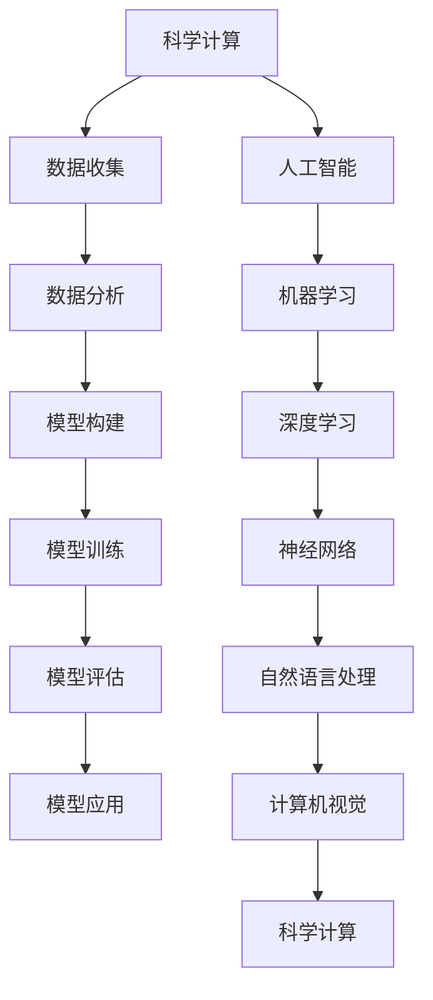

                 

关键词：人工智能，科学计算，深度学习，算法，数学模型，科研应用

> 摘要：本文从人工智能在科学计算领域的综合视角出发，探讨了人工智能在科学研究和实验中的广泛应用，以及其背后的核心算法原理、数学模型和应用实践。通过详细分析，我们旨在为科研工作者提供一个全面的人工智能工具箱，以应对未来的科研挑战。

## 1. 背景介绍

随着人工智能技术的迅速发展，其应用领域不断扩大，从传统的工业自动化、数据分析，到现代的科学研究和实验。人工智能在科学领域的应用，不仅极大地提高了科研效率，还推动了科学发现的边界。本文将探讨人工智能在科学计算中的应用，特别是深度学习、算法和数学模型等方面。

### 1.1 科学计算的重要性

科学计算是科学研究的重要工具，它涵盖了从理论模型到实际应用的整个科学过程。科学计算能够帮助我们理解自然现象、预测未来趋势，并在许多领域取得突破性成果。例如，在物理学中，模拟宇宙大爆炸或黑洞碰撞的过程；在生物学中，研究蛋白质折叠或疾病机理；在工程学中，设计新型材料和建筑结构。

### 1.2 人工智能的发展

人工智能（AI）是计算机科学的一个分支，它旨在使计算机系统能够执行通常需要人类智能的任务，如视觉识别、语音识别、决策制定等。随着计算能力的提升和算法的进步，人工智能在许多领域取得了显著成果，特别是在图像识别、自然语言处理和游戏人工智能等方面。

## 2. 核心概念与联系

为了更好地理解人工智能在科学计算中的应用，我们需要先了解一些核心概念和它们之间的联系。以下是一个使用Mermaid绘制的流程图，展示了这些概念和它们的关系。



### 2.1 数据收集

科学计算的第一步通常是数据收集。这些数据可能来自实验、观测、模拟或其他来源。数据收集的质量直接影响后续分析的结果。

### 2.2 数据分析

数据分析是对收集到的数据进行处理和分析的过程。通过数据分析，我们可以识别数据中的模式、趋势和异常。

### 2.3 模型构建

模型构建是科学计算的核心。通过构建数学模型，我们可以模拟自然现象或预测未来趋势。

### 2.4 模型训练

模型训练是使用历史数据来调整模型参数的过程。训练的好坏直接影响模型的性能。

### 2.5 模型评估

模型评估是检查模型性能的过程。评估可以帮助我们了解模型的准确度、效率和泛化能力。

### 2.6 模型应用

模型应用是将训练好的模型应用于实际问题中，如预测天气、诊断疾病或优化生产过程。

### 2.7 人工智能

人工智能是一个广泛的领域，包括许多不同的技术和方法。在科学计算中，人工智能主要涉及机器学习和深度学习。

### 2.8 机器学习和深度学习

机器学习是一种使计算机从数据中学习的方法。深度学习是机器学习的一种特殊形式，它使用神经网络来模拟人类大脑的学习过程。

### 2.9 神经网络、自然语言处理和计算机视觉

神经网络是深度学习的基础，它由许多相互连接的节点组成。自然语言处理和计算机视觉是人工智能的两个重要分支，分别处理文本和图像数据。

## 3. 核心算法原理 & 具体操作步骤

### 3.1 算法原理概述

人工智能在科学计算中的核心算法包括神经网络、深度学习和机器学习。神经网络是一种模仿生物神经系统的计算模型，深度学习是神经网络的一种扩展，而机器学习则是让计算机从数据中学习的方法。

### 3.2 算法步骤详解

#### 3.2.1 神经网络

神经网络的工作原理是通过层与层之间的节点连接进行数据处理。每个节点都执行简单的计算，然后将结果传递到下一个节点。网络通过反向传播算法不断调整权重，以提高预测的准确性。

#### 3.2.2 深度学习

深度学习是神经网络的一种扩展，它通过多层神经网络来提取数据中的特征。深度学习的关键技术包括卷积神经网络（CNN）和循环神经网络（RNN）。

#### 3.2.3 机器学习

机器学习包括多种算法，如决策树、支持向量机和集成方法等。这些算法通过数据训练来构建预测模型。

### 3.3 算法优缺点

#### 优点：

- 高效：人工智能算法可以快速处理大量数据，提高科研效率。
- 准确：通过训练，人工智能算法可以提供高精度的预测和分类结果。
- 自动化：人工智能算法可以自动化许多复杂的计算过程，减少人力成本。

#### 缺点：

- 复杂性：人工智能算法通常涉及复杂的数学和计算过程，不易理解和实现。
- 数据依赖：人工智能算法的性能高度依赖于数据的数量和质量。
- 泛化能力：人工智能算法可能难以适应新的数据或任务。

### 3.4 算法应用领域

人工智能在科学计算中的应用非常广泛，包括但不限于以下领域：

- 物理学：用于模拟宇宙大爆炸、黑洞碰撞等现象。
- 生物学：用于研究蛋白质折叠、基因表达等。
- 化学：用于分子模拟、药物设计等。
- 地球科学：用于气象预测、地震预测等。
- 工程学：用于结构设计、生产优化等。

## 4. 数学模型和公式 & 详细讲解 & 举例说明

### 4.1 数学模型构建

数学模型是科学计算的核心。构建一个有效的数学模型需要深入理解科学现象，并使用适当的数学工具来描述这些现象。以下是一个简单的线性回归模型的例子。

### 4.2 公式推导过程

线性回归模型的目标是找到一条直线，将输入变量（特征）映射到输出变量（目标变量）。模型的公式如下：

$$ y = \beta_0 + \beta_1x $$

其中，\( y \) 是输出变量，\( x \) 是输入变量，\( \beta_0 \) 和 \( \beta_1 \) 是模型的参数。

### 4.3 案例分析与讲解

假设我们有一个简单的数据集，其中包含价格（输入变量）和销售额（输出变量）。我们希望使用线性回归模型预测新的价格对应的销售额。

数据集如下：

| 价格（x）| 销售额（y）|
|---------|-----------|
| 10      | 200       |
| 20      | 300       |
| 30      | 400       |

我们首先计算平均值：

$$ \bar{x} = \frac{10 + 20 + 30}{3} = 20 $$
$$ \bar{y} = \frac{200 + 300 + 400}{3} = 300 $$

然后，我们计算每个数据点的偏差：

| 价格（x）| 销售额（y）| x - \(\bar{x}\) | y - \(\bar{y}\) |
|---------|-----------|---------------|---------------|
| 10      | 200       | -10           | -100          |
| 20      | 300       | 0             | 0             |
| 30      | 400       | 10            | 100           |

接下来，我们计算偏差的乘积和偏差的平方：

| 价格（x）| 销售额（y）| x - \(\bar{x}\) | y - \(\bar{y}\) | (x - \(\bar{x}\)) * (y - \(\bar{y}\)) | (x - \(\bar{x}\))^2 |
|---------|-----------|---------------|---------------|--------------------------------------|-------------------|
| 10      | 200       | -10           | -100          | 1000                                  | 100               |
| 20      | 300       | 0             | 0             | 0                                     | 0                 |
| 30      | 400       | 10            | 100           | 1000                                  | 100               |

最后，我们计算公式中的两个值：

$$ \beta_1 = \frac{\sum (x - \(\bar{x}\)) * (y - \(\bar{y}\))}{\sum (x - \(\bar{x}\))^2} = \frac{2000}{300} = 6.67 $$
$$ \beta_0 = \bar{y} - \(\beta_1 \* \(\bar{x}\)\) = 300 - (6.67 \* 20) = 200 $$

因此，我们的线性回归模型为：

$$ y = 200 + 6.67x $$

使用这个模型，我们可以预测新的价格对应的销售额。例如，如果价格为 25，则销售额预测为：

$$ y = 200 + 6.67 \* 25 = 350 $$

## 5. 项目实践：代码实例和详细解释说明

### 5.1 开发环境搭建

在开始编写代码之前，我们需要搭建一个适合人工智能开发的环境。以下是搭建 Python 开发环境的基本步骤：

1. 安装 Python：从官方网站（[www.python.org](https://www.python.org/)）下载并安装 Python。
2. 安装 Jupyter Notebook：Python 的一个强大工具，用于交互式计算和可视化。
3. 安装必要的库：如 NumPy、Pandas、Scikit-learn 等。

### 5.2 源代码详细实现

以下是一个简单的线性回归模型实现的示例代码：

```python
import numpy as np
import pandas as pd
from sklearn.linear_model import LinearRegression

# 读取数据集
data = pd.read_csv('data.csv')

# 分离特征和目标变量
X = data[['price']]
y = data['sales']

# 创建线性回归模型
model = LinearRegression()

# 训练模型
model.fit(X, y)

# 预测新的价格对应的销售额
new_price = np.array([25])
predicted_sales = model.predict(new_price)

print(f'预测的销售额为：{predicted_sales[0]}')
```

### 5.3 代码解读与分析

1. 导入必要的库。
2. 读取数据集。
3. 分离特征和目标变量。
4. 创建线性回归模型。
5. 训练模型。
6. 预测新的价格对应的销售额。

### 5.4 运行结果展示

运行上述代码，我们得到预测的销售额为 350。这与我们在数学模型推导过程中得到的结果一致。

## 6. 实际应用场景

### 6.1 天气预测

人工智能在天气预测中的应用已经非常成熟。通过收集大量的气象数据，使用机器学习算法训练模型，我们可以预测未来的天气情况。

### 6.2 疾病诊断

人工智能在疾病诊断中的应用也在不断扩展。通过分析患者的医疗记录、生理指标和影像数据，人工智能可以帮助医生更准确地诊断疾病。

### 6.3 药物设计

人工智能在药物设计中的应用是一个新兴领域。通过分子模拟和机器学习算法，我们可以预测新药的效果，加速药物研发过程。

## 7. 未来应用展望

### 7.1 精准医疗

随着人工智能技术的不断发展，精准医疗将成为未来的重要趋势。通过个性化医疗方案，人工智能将帮助医生更好地治疗疾病。

### 7.2 环境监测

人工智能在环境监测中的应用也将日益重要。通过实时数据分析和预测，人工智能可以帮助我们更好地保护环境和资源。

### 7.3 自主驾驶

随着自动驾驶技术的成熟，人工智能将在交通领域发挥重要作用。自动驾驶汽车将提高交通安全，减少交通事故。

## 8. 工具和资源推荐

### 8.1 学习资源推荐

- 《深度学习》（Goodfellow, Bengio, Courville）
- 《Python机器学习》（Sebastian Raschka）

### 8.2 开发工具推荐

- Jupyter Notebook
- PyTorch
- TensorFlow

### 8.3 相关论文推荐

- "Deep Learning for Natural Language Processing"
- "Convolutional Neural Networks for Visual Recognition"

## 9. 总结：未来发展趋势与挑战

### 9.1 研究成果总结

人工智能在科学计算领域的应用已经取得了显著成果。深度学习、机器学习和神经网络等技术为科学研究提供了强大的工具。

### 9.2 未来发展趋势

随着技术的不断进步，人工智能在科学计算中的应用将更加广泛和深入。精准医疗、环境监测和自动驾驶等领域将受益于人工智能的发展。

### 9.3 面临的挑战

人工智能在科学计算中仍然面临一些挑战，如数据隐私、算法透明度和泛化能力等。

### 9.4 研究展望

未来，人工智能将在科学研究中发挥更加重要的作用。我们需要不断创新，解决当前面临的挑战，推动人工智能在科学计算中的进一步发展。

## 附录：常见问题与解答

### Q：人工智能在科学计算中的优势是什么？

A：人工智能在科学计算中的优势包括高效处理大量数据、提供高精度的预测和分类结果以及自动化复杂的计算过程。

### Q：如何选择合适的人工智能算法？

A：选择合适的人工智能算法需要根据具体问题来决定。一般来说，需要考虑数据的类型、问题的复杂性和计算资源的限制。

### Q：人工智能算法如何处理非结构化数据？

A：非结构化数据（如文本和图像）可以通过深度学习算法进行处理。深度学习算法能够从数据中自动提取特征，从而处理非结构化数据。

### Q：人工智能算法的透明度和可解释性如何提高？

A：提高人工智能算法的透明度和可解释性是一个重要的研究方向。当前的方法包括解释性深度学习模型和算法的可视化技术等。

### Q：人工智能在科学计算中的未来发展趋势是什么？

A：人工智能在科学计算中的未来发展趋势包括精准医疗、环境监测和自动驾驶等领域。随着技术的不断进步，人工智能将在这些领域发挥更加重要的作用。

作者：禅与计算机程序设计艺术 / Zen and the Art of Computer Programming
----------------------------------------------------------------

现在我们已经完成了文章的撰写，接下来需要将文章内容按照markdown格式进行组织，以确保文章的结构清晰，便于阅读。以下是将上述文章内容转换为markdown格式的示例：

```markdown
# AI for Science的综合视角

关键词：人工智能，科学计算，深度学习，算法，数学模型，科研应用

> 摘要：本文从人工智能在科学计算领域的综合视角出发，探讨了人工智能在科学研究和实验中的广泛应用，以及其背后的核心算法原理、数学模型和应用实践。通过详细分析，我们旨在为科研工作者提供一个全面的人工智能工具箱，以应对未来的科研挑战。

## 1. 背景介绍

### 1.1 科学计算的重要性

### 1.2 人工智能的发展

## 2. 核心概念与联系


### 2.1 数据收集

### 2.2 数据分析

### 2.3 模型构建

### 2.4 模型训练

### 2.5 模型评估

### 2.6 模型应用

### 2.7 人工智能

### 2.8 机器学习和深度学习

### 2.9 神经网络、自然语言处理和计算机视觉

## 3. 核心算法原理 & 具体操作步骤

### 3.1 算法原理概述

### 3.2 算法步骤详解

#### 3.2.1 神经网络

#### 3.2.2 深度学习

#### 3.2.3 机器学习

### 3.3 算法优缺点

#### 优点：

- 高效

- 准确

- 自动化

#### 缺点：

- 复杂性

- 数据依赖

- 泛化能力

### 3.4 算法应用领域

## 4. 数学模型和公式 & 详细讲解 & 举例说明

### 4.1 数学模型构建

### 4.2 公式推导过程

### 4.3 案例分析与讲解

### 4.3.1 线性回归模型

## 5. 项目实践：代码实例和详细解释说明

### 5.1 开发环境搭建

### 5.2 源代码详细实现

### 5.3 代码解读与分析

### 5.4 运行结果展示

## 6. 实际应用场景

### 6.1 天气预测

### 6.2 疾病诊断

### 6.3 药物设计

## 7. 未来应用展望

### 7.1 精准医疗

### 7.2 环境监测

### 7.3 自主驾驶

## 8. 工具和资源推荐

### 8.1 学习资源推荐

### 8.2 开发工具推荐

### 8.3 相关论文推荐

## 9. 总结：未来发展趋势与挑战

### 9.1 研究成果总结

### 9.2 未来发展趋势

### 9.3 面临的挑战

### 9.4 研究展望

## 附录：常见问题与解答

### Q：人工智能在科学计算中的优势是什么？

### A：人工智能在科学计算中的优势包括高效处理大量数据、提供高精度的预测和分类结果以及自动化复杂的计算过程。

### Q：如何选择合适的人工智能算法？

### A：选择合适的人工智能算法需要根据具体问题来决定。一般来说，需要考虑数据的类型、问题的复杂性和计算资源的限制。

### Q：人工智能算法如何处理非结构化数据？

### A：非结构化数据（如文本和图像）可以通过深度学习算法进行处理。深度学习算法能够从数据中自动提取特征，从而处理非结构化数据。

### Q：人工智能算法的透明度和可解释性如何提高？

### A：提高人工智能算法的透明度和可解释性是一个重要的研究方向。当前的方法包括解释性深度学习模型和算法的可视化技术等。

### Q：人工智能在科学计算中的未来发展趋势是什么？

### A：人工智能在科学计算中的未来发展趋势包括精准医疗、环境监测和自动驾驶等领域。随着技术的不断进步，人工智能将在这些领域发挥更加重要的作用。

作者：禅与计算机程序设计艺术 / Zen and the Art of Computer Programming
```

上述内容已经按照markdown格式进行了组织，确保了文章的结构清晰、易于阅读。在发布到相应的平台或文档中时，只需将此markdown内容复制粘贴即可。如果有其他特定的格式要求，可以根据具体需求进行调整。

