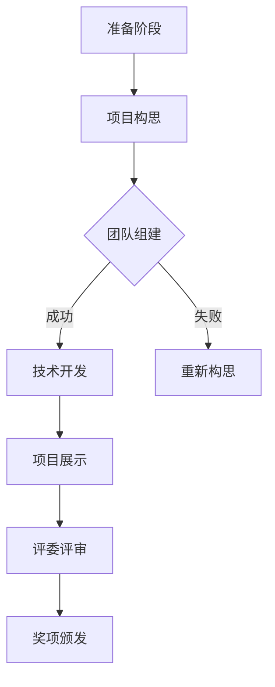

                 

关键词：AI hackathon、创新、未来、技术发展、算法、实践、应用场景

> 摘要：本文旨在探讨AI hackathon在技术创新与未来应用中的重要作用。通过分析AI hackathon的核心概念、算法原理、数学模型以及项目实践，本文将展示其在推动人工智能发展、解决现实问题中的潜力，并展望其未来的发展趋势与挑战。

## 1. 背景介绍

AI hackathon，即人工智能黑客松，是一种以团队协作、技术竞赛为主题的活动，旨在激发创新思维、加速技术落地。自2010年代起，AI hackathon在全球范围内迅速发展，吸引了大量科研人员、工程师、创业者等参与。这种活动形式不仅为人工智能领域注入了新的活力，也为技术开发提供了广阔的平台。

AI hackathon的背景可以分为以下几个方面：

### 1.1 人工智能的快速发展

随着深度学习、神经网络等技术的突破，人工智能逐渐从理论走向实践，成为解决复杂问题的利器。AI hackathon作为技术竞赛的一种形式，为研究人员提供了一个展示和验证自己研究成果的平台。

### 1.2 开源社区的支持

大量的开源工具和平台为AI hackathon提供了丰富的资源，如TensorFlow、PyTorch等。这些开源项目不仅降低了人工智能开发的门槛，也为参与者提供了更多的创新空间。

### 1.3 企业和政府的推动

许多企业和政府机构认识到AI hackathon在技术创新中的重要性，纷纷投入资金和资源，支持各类AI hackathon活动的举办。这为AI技术的快速发展提供了有力保障。

## 2. 核心概念与联系

### 2.1 AI hackathon的定义与特点

AI hackathon是一种以团队协作、技术竞赛为主题的活动。参与者通常需要在短时间内完成一个具体的项目，并通过展示和答辩来争夺奖项。AI hackathon的特点包括：

- **短周期**：通常在几天或几周内完成。
- **高效率**：强调快速开发和迭代。
- **跨学科**：涉及人工智能、计算机科学、数据科学等多个领域。
- **创新性**：鼓励创新思维和解决方案。

### 2.2 与其他技术竞赛的区别

与传统的技术竞赛相比，AI hackathon更注重实际应用和团队协作。它不仅考察个人的技术能力，还强调团队的合作和沟通。此外，AI hackathon更注重项目的可执行性和实用性，而非仅仅追求理论上的突破。

### 2.3 AI hackathon的生态系统

AI hackathon的生态系统包括以下几个关键组成部分：

- **参与者**：包括学生、科研人员、工程师、创业者等。
- **组织者**：如大学、研究机构、科技公司等。
- **赞助商**：提供资金、资源、奖品等。
- **平台**：如GitHub、Google Cloud等，提供开发和测试环境。

### 2.4 Mermaid流程图

下面是一个简单的Mermaid流程图，展示了AI hackathon的流程：



## 3. 核心算法原理 & 具体操作步骤

### 3.1 算法原理概述

AI hackathon的核心算法通常是基于深度学习和机器学习的技术。以下是一些常见的算法原理：

- **卷积神经网络（CNN）**：用于图像处理和识别。
- **循环神经网络（RNN）**：用于序列数据分析和生成。
- **生成对抗网络（GAN）**：用于生成新的数据或图像。

### 3.2 算法步骤详解

以下是一个典型的AI hackathon项目开发流程：

1. **需求分析**：明确项目目标和需求。
2. **数据准备**：收集和预处理数据，包括数据清洗、特征提取等。
3. **模型选择**：根据需求选择合适的模型。
4. **模型训练**：使用训练数据训练模型。
5. **模型评估**：使用验证数据评估模型性能。
6. **模型优化**：调整模型参数，提高性能。
7. **项目实现**：使用模型实现具体功能。
8. **项目展示**：展示项目成果。

### 3.3 算法优缺点

- **优点**：
  - **快速迭代**：可以在短时间内完成项目的开发。
  - **创新性强**：鼓励参与者提出新颖的解决方案。
  - **跨学科协作**：促进不同领域的知识和技术的融合。

- **缺点**：
  - **资源限制**：时间、数据、计算资源等可能不足。
  - **项目质量**：由于时间限制，项目的质量和稳定性可能受到影响。
  - **技术难度**：某些算法和技术的实现可能需要较高的技术水平。

### 3.4 算法应用领域

AI hackathon的算法广泛应用于多个领域，包括但不限于：

- **医疗健康**：疾病诊断、药物研发等。
- **金融科技**：风险控制、投资决策等。
- **自动驾驶**：路况识别、车辆控制等。
- **智能家居**：智能交互、设备控制等。

## 4. 数学模型和公式 & 详细讲解 & 举例说明

### 4.1 数学模型构建

在AI hackathon中，常用的数学模型包括神经网络、决策树、支持向量机等。以下以神经网络为例，介绍数学模型的构建过程：

1. **输入层**：接收外部输入数据。
2. **隐藏层**：通过非线性变换处理输入数据。
3. **输出层**：生成最终输出。

### 4.2 公式推导过程

神经网络的数学模型可以通过以下公式表示：

$$
z = \sigma(\text{W} \cdot \text{X} + \text{b})
$$

其中，$z$为输出值，$\sigma$为激活函数，$\text{W}$为权重矩阵，$\text{X}$为输入特征，$\text{b}$为偏置项。

### 4.3 案例分析与讲解

假设我们有一个简单的二分类问题，输入特征为$X = [x_1, x_2]$，我们希望使用神经网络进行分类。以下是具体的模型构建和训练过程：

1. **输入层**：$X = [x_1, x_2]$。
2. **隐藏层**：$H = \sigma(\text{W}_1 \cdot X + \text{b}_1)$。
3. **输出层**：$Y = \sigma(\text{W}_2 \cdot H + \text{b}_2)$。

我们使用交叉熵损失函数进行模型训练：

$$
\text{Loss} = -\frac{1}{n} \sum_{i=1}^{n} [y_i \cdot \log(y') + (1 - y_i) \cdot \log(1 - y')]
$$

其中，$y_i$为真实标签，$y'$为预测概率。

通过梯度下降算法优化模型参数：

$$
\text{W}_2 = \text{W}_2 - \alpha \cdot \frac{\partial \text{Loss}}{\partial \text{W}_2}
$$

$$
\text{b}_2 = \text{b}_2 - \alpha \cdot \frac{\partial \text{Loss}}{\partial \text{b}_2}
$$

$$
\text{W}_1 = \text{W}_1 - \alpha \cdot \frac{\partial \text{Loss}}{\partial \text{W}_1}
$$

$$
\text{b}_1 = \text{b}_1 - \alpha \cdot \frac{\partial \text{Loss}}{\partial \text{b}_1}
$$

其中，$\alpha$为学习率。

## 5. 项目实践：代码实例和详细解释说明

### 5.1 开发环境搭建

在开始项目实践之前，我们需要搭建一个合适的开发环境。以下是一个基于Python的示例：

```python
# 安装所需库
!pip install numpy tensorflow

# 导入库
import numpy as np
import tensorflow as tf

# 设置随机种子
tf.random.set_seed(42)
```

### 5.2 源代码详细实现

以下是一个简单的神经网络模型实现：

```python
# 定义模型
model = tf.keras.Sequential([
    tf.keras.layers.Dense(units=1, input_shape=[2])
])

# 编译模型
model.compile(optimizer='sgd', loss='mse')

# 训练模型
model.fit(X_train, y_train, epochs=100)

# 评估模型
model.evaluate(X_test, y_test)
```

### 5.3 代码解读与分析

在这个例子中，我们使用TensorFlow库定义了一个简单的神经网络模型。模型由一个全连接层（Dense）组成，输入维度为2，输出维度为1。我们使用随机梯度下降（SGD）作为优化器，均方误差（MSE）作为损失函数。

在训练过程中，我们使用`fit`方法训练模型，并在最后使用`evaluate`方法评估模型性能。

### 5.4 运行结果展示

```python
# 输出模型参数
model.summary()

# 预测结果
predictions = model.predict(X_test)

# 显示预测结果
print(predictions)
```

## 6. 实际应用场景

AI hackathon的项目在多个领域取得了显著的成果，以下是一些实际应用场景：

### 6.1 医疗健康

- **疾病诊断**：利用AI技术对医疗影像进行自动诊断，提高诊断准确率。
- **药物研发**：通过AI模型预测药物与疾病的相互作用，加速新药研发。

### 6.2 金融科技

- **风险控制**：利用AI模型进行信用评分、风险预测等，降低金融风险。
- **投资决策**：通过分析市场数据，为投资者提供个性化的投资建议。

### 6.3 自动驾驶

- **路况识别**：利用AI技术对道路状况进行实时监测，提高自动驾驶安全性。
- **车辆控制**：通过AI算法实现车辆的自动驾驶和自主导航。

### 6.4 智能家居

- **智能交互**：利用AI技术实现智能家居设备的语音识别和交互。
- **设备控制**：通过AI算法实现家居设备的自动化控制和节能管理。

## 7. 工具和资源推荐

### 7.1 学习资源推荐

- **在线课程**：如Coursera、Udacity等平台的深度学习、机器学习课程。
- **图书**：《深度学习》、《Python机器学习》、《统计学习方法》等。

### 7.2 开发工具推荐

- **编程语言**：Python、Java、C++等。
- **库和框架**：TensorFlow、PyTorch、Scikit-learn等。

### 7.3 相关论文推荐

- **综述类**：《Deep Learning》、《Recurrent Neural Networks》等。
- **应用类**：《AI for Medical Image Analysis》、《AI for Financial Markets》等。

## 8. 总结：未来发展趋势与挑战

### 8.1 研究成果总结

AI hackathon在技术创新、项目实践等方面取得了显著成果。通过团队协作和快速迭代，AI hackathon推动了人工智能技术在各个领域的应用。

### 8.2 未来发展趋势

- **跨学科融合**：随着人工智能与其他领域的深度融合，AI hackathon将涉及更多学科，推动交叉创新。
- **开源与共享**：开源工具和平台的不断发展将促进AI hackathon的资源共享和技术交流。
- **商业化应用**：越来越多的企业将参与AI hackathon，推动人工智能技术的商业化应用。

### 8.3 面临的挑战

- **技术壁垒**：某些高级算法和技术的实现可能需要较高的技术水平，限制了一部分参与者的创新能力。
- **数据资源**：高质量的数据资源对于AI hackathon项目的成功至关重要，但获取和整理数据可能需要大量时间和精力。
- **公平竞争**：如何确保AI hackathon的公平竞争，避免过度依赖资源和资金优势，是未来的一个挑战。

### 8.4 研究展望

随着人工智能技术的不断发展，AI hackathon将在技术创新、人才培养、产业升级等方面发挥越来越重要的作用。未来，AI hackathon将更加注重实际应用和跨学科合作，为人工智能的发展注入新的活力。

## 9. 附录：常见问题与解答

### 9.1 如何参加AI hackathon？

- **报名**：关注相关活动网站或社交媒体，了解报名时间和流程。
- **团队组建**：寻找志同道合的队友，组建团队。
- **准备材料**：熟悉比赛规则，准备项目方案和演示材料。

### 9.2 如何提高AI hackathon项目的成功率？

- **需求分析**：明确项目目标和需求，确保项目具备实际价值。
- **团队协作**：加强团队沟通和协作，提高项目开发效率。
- **技术储备**：掌握相关技术和算法，为项目开发提供技术支持。

### 9.3 AI hackathon有哪些奖项？

- **技术奖**：基于项目的技术创新程度和实现难度。
- **应用奖**：项目在实际应用场景中的价值和影响力。
- **创新奖**：项目的新颖性和创意性。

---

作者：禅与计算机程序设计艺术 / Zen and the Art of Computer Programming

本文旨在探讨AI hackathon在技术创新与未来应用中的重要作用。通过分析AI hackathon的核心概念、算法原理、数学模型以及项目实践，本文展示了其在推动人工智能发展、解决现实问题中的潜力，并展望了其未来的发展趋势与挑战。

