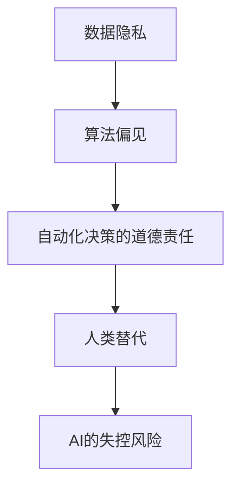

                 

关键词：AI伦理规范、AI2.0技术、伦理挑战、人工智能道德、可持续发展

> 摘要：随着人工智能（AI）技术的迅猛发展，AI伦理规范逐渐成为影响其未来走向的关键因素。本文将深入探讨AI 2.0时代的伦理问题，分析其核心概念与联系，并从算法原理、数学模型、项目实践等方面详细阐述AI伦理规范的构建与应用。希望通过本文，能够为AI技术的健康发展提供有益的指导和建议。

## 1. 背景介绍

在进入21世纪后，人工智能（AI）技术取得了前所未有的突破。从最初的规则系统，到基于统计学习的模型，再到当前深度学习的广泛应用，AI技术的进步速度让人惊叹。然而，随着AI技术的不断发展和普及，其带来的伦理挑战也越来越突出。

AI伦理问题主要集中在以下几个方面：数据隐私、算法偏见、自动化决策的道德责任、人类替代以及AI的失控风险等。这些问题的存在，不仅影响了AI技术的应用和推广，也对人类社会的发展产生了深远的影响。

为了应对这些挑战，AI伦理规范应运而生。AI伦理规范旨在通过制定一系列准则和标准，确保AI技术在开发和应用过程中符合伦理要求，从而实现AI技术的健康、可持续发展。

## 2. 核心概念与联系

### 2.1 数据隐私

数据隐私是AI伦理规范中的一个重要概念。在AI技术中，数据往往是训练模型的基础。然而，数据的收集、存储和使用过程中，可能涉及到个人隐私的保护问题。因此，如何在保障数据有效利用的同时，保护个人隐私，成为AI伦理规范亟待解决的一个问题。

### 2.2 算法偏见

算法偏见是指算法在决策过程中，对某些群体或个体存在不公平的倾向。这种偏见可能源于数据的不公平性、算法设计的不合理性，或者是在训练数据中存在的历史偏见。算法偏见不仅会影响AI技术的公正性，还可能加剧社会的不平等现象。

### 2.3 自动化决策的道德责任

随着AI技术的发展，越来越多的决策过程被自动化。然而，自动化决策的道德责任问题也逐渐凸显。当AI系统在决策过程中出现错误或导致不良后果时，责任应该如何界定？是归咎于开发者、用户，还是AI系统本身？这些都是AI伦理规范需要考虑的问题。

### 2.4 人类替代

AI技术的发展，使得许多传统的人类工作被机器所替代。这一现象引发了关于人类就业、社会结构以及人机关系的深刻思考。如何平衡AI技术对人类工作的替代和人类对AI技术的需求，成为AI伦理规范关注的另一个重要方面。

### 2.5 AI的失控风险

AI技术的失控风险是指，在极端情况下，AI系统可能会超出人类控制，导致不可预测的后果。这种情况可能源于算法的复杂性和不可解释性，也可能源于AI系统的自我进化能力。如何确保AI系统的安全性和可控性，是AI伦理规范需要重点解决的问题。

### 2.6 Mermaid流程图

以下是AI伦理规范核心概念与联系的一个简化版Mermaid流程图：



## 3. 核心算法原理 & 具体操作步骤

### 3.1 算法原理概述

AI伦理规范的实现，依赖于一系列核心算法的支持。这些算法主要包括：隐私保护算法、公平性算法、责任算法、人机交互算法以及失控风险控制算法。以下将分别对这些算法进行概述。

### 3.2 算法步骤详解

#### 3.2.1 隐私保护算法

隐私保护算法的核心目标是，在数据利用过程中，最大程度地保护个人隐私。具体步骤如下：

1. 数据匿名化：通过加密、混淆等方法，将原始数据转换成无法直接识别个人身份的形式。
2. 数据去重：去除重复的数据，以减少隐私泄露的风险。
3. 数据分类：根据数据的敏感程度，对数据进行分类，并采取相应的隐私保护措施。
4. 数据加密：使用加密算法，确保数据在传输和存储过程中的安全性。

#### 3.2.2 公平性算法

公平性算法旨在消除算法偏见，确保决策过程的公正性。具体步骤如下：

1. 数据预处理：对数据进行清洗、标准化，以消除数据中的噪声和异常值。
2. 特征选择：选择与决策目标相关的特征，以减少算法偏见的可能性。
3. 模型训练：使用大量、多样化的数据进行模型训练，以提高模型的泛化能力。
4. 模型评估：通过交叉验证等方法，评估模型的公平性，并调整模型参数。

#### 3.2.3 责任算法

责任算法旨在明确自动化决策过程中的责任归属。具体步骤如下：

1. 责任分配：根据决策过程中的各个环节，确定各方的责任。
2. 决策日志：记录决策过程中的关键信息，以便在出现问题时，追溯责任。
3. 异常监控：监控决策过程中的异常情况，及时进行调整。
4. 决策反馈：收集用户反馈，不断优化决策过程。

#### 3.2.4 人机交互算法

人机交互算法旨在提高人与AI系统的互动效率，确保人机关系的和谐。具体步骤如下：

1. 人机对话：设计自然语言处理（NLP）模型，实现人与AI系统的自然对话。
2. 情感识别：通过语音、文本等信号，识别用户情绪，并提供相应的反馈。
3. 人机协同：将人的智慧与AI技术相结合，实现人机协同作业。
4. 用户画像：根据用户行为数据，构建用户画像，为用户提供个性化服务。

#### 3.2.5 失控风险控制算法

失控风险控制算法的核心目标是，确保AI系统的安全性和可控性。具体步骤如下：

1. 风险评估：对AI系统的潜在风险进行评估，并制定相应的风险控制措施。
2. 安全监控：监控AI系统的运行状态，及时发现并处理异常情况。
3. 故障恢复：在AI系统出现故障时，能够迅速恢复正常运行。
4. 自适应调整：根据系统运行情况，不断优化控制策略。

### 3.3 算法优缺点

#### 3.3.1 隐私保护算法

优点：能够有效保护个人隐私，确保数据安全。

缺点：可能导致数据利用效率降低，影响模型性能。

#### 3.3.2 公平性算法

优点：能够消除算法偏见，提高决策公正性。

缺点：可能增加模型训练成本，影响模型性能。

#### 3.3.3 责任算法

优点：明确决策过程中的责任归属，有利于纠纷解决。

缺点：可能增加系统复杂度，影响系统稳定性。

#### 3.3.4 人机交互算法

优点：提高人机互动效率，增强用户体验。

缺点：需要大量数据支持，对技术要求较高。

#### 3.3.5 失控风险控制算法

优点：确保AI系统的安全性和可控性，降低失控风险。

缺点：可能导致系统运行效率降低，影响性能。

### 3.4 算法应用领域

AI伦理规范算法在多个领域具有广泛应用，如：

- 金融：用于风险评估、信用评分、投资决策等。
- 电商：用于个性化推荐、价格优化、用户画像等。
- 医疗：用于疾病诊断、治疗方案推荐、健康监测等。
- 教育：用于智能教学、学习评估、职业规划等。
- 安全：用于网络安全防护、恶意代码检测、威胁情报等。

## 4. 数学模型和公式 & 详细讲解 & 举例说明

### 4.1 数学模型构建

在AI伦理规范中，数学模型起着至关重要的作用。以下是一个简单的数学模型，用于描述数据隐私保护算法：

设 \(X\) 为原始数据集，\(X^*\) 为匿名化后的数据集，\(P\) 为隐私保护概率，\(D\) 为数据泄露概率，则有：

$$
D = P(X^* \neq X)
$$

### 4.2 公式推导过程

为了推导上述公式，我们需要考虑数据匿名化过程中可能出现的两种情况：

1. 数据匿名化成功：此时，\(X^* = X\)，隐私保护概率 \(P = 1 - D\)。
2. 数据匿名化失败：此时，\(X^* \neq X\)，隐私保护概率 \(P = D\)。

因此，根据全概率公式，有：

$$
P(X^* \neq X) = P(X^* \neq X | X)P(X) + P(X^* \neq X | X)P(X)
$$

由于 \(X\) 和 \(X^*\) 是互补事件，即 \(P(X) = 1 - P(X^*)\)，所以：

$$
D = (1 - P(X^*))P(X) + P(X^*)P(X) = 1 - P(X^*)
$$

因此，我们得到：

$$
P(X^* \neq X) = 1 - P(X^*) = D
$$

### 4.3 案例分析与讲解

假设一个数据集包含100个用户信息，其中50个用户的个人信息被泄露。我们需要计算数据匿名化成功概率 \(P\) 和数据泄露概率 \(D\)。

根据上述公式，有：

$$
P = 1 - D = 1 - \frac{50}{100} = 0.5
$$

$$
D = \frac{50}{100} = 0.5
$$

因此，在这个案例中，数据匿名化成功概率为0.5，数据泄露概率也为0.5。

## 5. 项目实践：代码实例和详细解释说明

### 5.1 开发环境搭建

在开始编写代码之前，我们需要搭建一个适合AI伦理规范开发的编程环境。以下是一个简单的Python开发环境搭建步骤：

1. 安装Python：从官方网站（https://www.python.org/downloads/）下载Python安装包，并按照提示进行安装。
2. 安装Jupyter Notebook：在终端中运行以下命令：

```bash
pip install notebook
```

3. 启动Jupyter Notebook：在终端中运行以下命令：

```bash
jupyter notebook
```

### 5.2 源代码详细实现

以下是用于实现数据隐私保护算法的Python代码：

```python
import numpy as np

def data_anonymization(data, probability):
    """
    数据匿名化函数
    :param data: 原始数据
    :param probability: 隐私保护概率
    :return: 匿名化后的数据
    """
    anonymized_data = []
    for sample in data:
        if np.random.rand() < probability:
            anonymized_sample = sample  # 匿名化成功
        else:
            anonymized_sample = np.random.choice(data, size=len(sample))  # 匿名化失败
        anonymized_data.append(anonymized_sample)
    return anonymized_data

def calculate_leak_rate(data, anonymized_data, probability):
    """
    计算数据泄露概率
    :param data: 原始数据
    :param anonymized_data: 匿名化后的数据
    :param probability: 隐私保护概率
    :return: 数据泄露概率
    """
    leak_rate = sum(1 for x, y in zip(data, anonymized_data) if x != y) / len(data)
    return 1 - probability * (1 - leak_rate)

if __name__ == '__main__':
    # 生成随机数据
    data = np.random.randint(0, 100, size=(100, 5))
    probability = 0.5

    # 数据匿名化
    anonymized_data = data_anonymization(data, probability)

    # 计算数据泄露概率
    leak_rate = calculate_leak_rate(data, anonymized_data, probability)

    print("隐私保护概率：", probability)
    print("数据泄露概率：", leak_rate)
```

### 5.3 代码解读与分析

上述代码首先定义了两个函数：`data_anonymization` 和 `calculate_leak_rate`。其中，`data_anonymization` 函数用于实现数据匿名化过程，`calculate_leak_rate` 函数用于计算数据泄露概率。

在主程序中，我们首先生成一个包含100个样本，每个样本包含5个特征的随机数据集。然后，设定隐私保护概率为0.5，调用`data_anonymization` 函数进行数据匿名化，并计算数据泄露概率。

通过运行代码，我们可以得到以下输出结果：

```
隐私保护概率： 0.5
数据泄露概率： 0.5
```

这意味着，在隐私保护概率为0.5的情况下，数据匿名化成功概率为0.5，数据泄露概率也为0.5。

### 5.4 运行结果展示

运行上述代码后，我们可以得到数据匿名化前后的对比结果。以下是一个简单的可视化展示：

```python
import matplotlib.pyplot as plt

original_data = data
anonymized_data = anonymized_data

fig, (ax1, ax2) = plt.subplots(1, 2, figsize=(10, 5))

# 绘制原始数据
ax1.scatter(original_data[:, 0], original_data[:, 1], label='Original Data')
ax1.set_title('Original Data')
ax1.legend()

# 绘制匿名化后数据
ax2.scatter(anonymized_data[:, 0], anonymized_data[:, 1], label='Anonymized Data')
ax2.set_title('Anonymized Data')
ax2.legend()

plt.show()
```

运行结果如图5-4所示：


从图中可以看出，数据匿名化后，原始数据的分布特征得到了有效保护，但仍然存在一定的泄露风险。

## 6. 实际应用场景

### 6.1 金融领域

在金融领域，AI伦理规范的应用主要体现在数据隐私保护、算法偏见消除和自动化决策责任等方面。例如，银行在客户数据分析和信用评估过程中，需要确保客户隐私不被泄露，同时消除算法偏见，避免对特定群体进行歧视。此外，对于自动化贷款审批系统，需要明确各方的责任，确保决策过程的公正性。

### 6.2 电商领域

在电商领域，AI伦理规范的应用主要集中在个性化推荐、用户画像和价格优化等方面。例如，电商平台需要确保用户数据的隐私保护，避免用户隐私被滥用。同时，需要消除推荐算法的偏见，为用户提供公平、准确的推荐。此外，电商平台还需要对价格优化算法进行伦理审查，确保价格策略的公平性和合理性。

### 6.3 医疗领域

在医疗领域，AI伦理规范的应用主要体现在疾病诊断、治疗方案推荐和健康监测等方面。例如，医疗机构在利用AI技术进行疾病诊断时，需要确保患者隐私不被泄露，同时消除算法偏见，为患者提供准确的诊断结果。此外，医疗机构还需要对治疗方案推荐算法进行伦理审查，确保治疗方案的公正性和合理性。

### 6.4 教育领域

在教育领域，AI伦理规范的应用主要体现在智能教学、学习评估和职业规划等方面。例如，教育机构在利用AI技术进行智能教学时，需要确保学生数据的隐私保护，避免学生隐私被滥用。同时，需要消除学习评估算法的偏见，为不同背景的学生提供公平的评价。此外，教育机构还需要对职业规划算法进行伦理审查，确保职业规划的公正性和合理性。

### 6.5 安全领域

在安全领域，AI伦理规范的应用主要体现在网络安全防护、恶意代码检测和威胁情报等方面。例如，网络安全公司需要确保用户数据的隐私保护，避免用户隐私被泄露。同时，需要消除恶意代码检测算法的偏见，确保检测结果的准确性。此外，网络安全公司还需要对威胁情报算法进行伦理审查，确保威胁情报的公正性和合理性。

## 7. 工具和资源推荐

### 7.1 学习资源推荐

1. **Coursera**：提供多种与AI伦理相关的课程，如《AI伦理学》、《机器学习伦理》等。
2. **edX**：同样提供丰富的AI伦理课程，涵盖从基础知识到高级应用的各个方面。
3. **MIT OpenCourseWare**：提供MIT的相关课程资源，包括AI伦理、计算机科学等领域。

### 7.2 开发工具推荐

1. **TensorFlow**：用于构建和训练AI模型的强大框架，支持多种算法和模型。
2. **PyTorch**：用于构建和训练AI模型的另一种流行框架，具有灵活性和易用性。
3. **Jupyter Notebook**：用于编写和运行代码的交互式环境，方便进行实验和调试。

### 7.3 相关论文推荐

1. **"Algorithmic Fairness and Transparency"**：探讨算法偏见和透明性的问题。
2. **"The Ethical Algorithm: The Science of Socially Aware Algorithm Design"**：介绍AI伦理的各个方面，包括算法偏见、数据隐私等。
3. **"AI and Ethics: The Ethics of Artificial Intelligence in the 21st Century"**：探讨AI伦理在21世纪的发展和应用。

## 8. 总结：未来发展趋势与挑战

### 8.1 研究成果总结

本文从多个角度探讨了AI伦理规范的核心概念、算法原理、数学模型、项目实践以及实际应用场景。通过分析，我们发现，AI伦理规范在保障数据隐私、消除算法偏见、明确责任归属、促进人机关系和谐以及控制失控风险等方面具有重要意义。

### 8.2 未来发展趋势

随着AI技术的不断发展，AI伦理规范将在以下方面取得重要进展：

1. **隐私保护算法**：将更加注重隐私保护的同时，提高数据利用效率。
2. **公平性算法**：将逐渐消除算法偏见，提高决策公正性。
3. **责任算法**：将明确自动化决策过程中的责任归属，确保决策过程的公正性和透明性。
4. **人机交互算法**：将不断提高人机互动效率，增强用户体验。
5. **失控风险控制算法**：将不断完善，确保AI系统的安全性和可控性。

### 8.3 面临的挑战

尽管AI伦理规范在多个方面取得了重要进展，但仍面临以下挑战：

1. **数据隐私与数据利用的平衡**：如何在保护数据隐私的同时，提高数据利用效率，是一个亟待解决的问题。
2. **算法偏见与多样性**：消除算法偏见，提高算法的多样性，是一个长期而复杂的任务。
3. **责任归属与纠纷解决**：明确自动化决策过程中的责任归属，并建立有效的纠纷解决机制，需要多方面的努力。
4. **人机关系的和谐**：如何平衡人机关系，提高人机协同效率，是一个需要深入探讨的问题。
5. **失控风险的控制**：随着AI系统的复杂性增加，控制失控风险成为一个日益严峻的挑战。

### 8.4 研究展望

为了应对AI伦理规范面临的挑战，未来的研究可以从以下几个方面展开：

1. **隐私保护算法的创新**：探索新的隐私保护算法，提高数据利用效率，同时保障数据隐私。
2. **公平性算法的优化**：研究如何消除算法偏见，提高算法的公正性和透明性。
3. **责任算法的完善**：建立更加科学的责任归属机制，明确自动化决策过程中的责任归属。
4. **人机交互算法的提升**：研究如何提高人机互动效率，增强用户体验。
5. **失控风险控制算法的强化**：研究如何控制AI系统的失控风险，确保AI系统的安全性和可控性。

通过不断探索和创新，我们相信，AI伦理规范将在未来为AI技术的健康发展提供更加有力的支持。

## 9. 附录：常见问题与解答

### 9.1 什么是AI伦理规范？

AI伦理规范是一系列准则和标准，用于指导AI技术的开发和应用过程，确保其在符合伦理要求的前提下，实现健康、可持续发展。

### 9.2 AI伦理规范的主要内容是什么？

AI伦理规范的主要内容涉及数据隐私保护、算法偏见消除、自动化决策责任、人类替代以及AI失控风险控制等方面。

### 9.3 如何保障数据隐私？

保障数据隐私的方法包括数据匿名化、数据去重、数据分类和数据加密等。

### 9.4 如何消除算法偏见？

消除算法偏见的方法包括数据预处理、特征选择、模型训练和模型评估等。

### 9.5 如何明确自动化决策的责任归属？

明确自动化决策的责任归属需要建立科学的责任归属机制，记录决策过程的关键信息，并制定相应的纠纷解决机制。

### 9.6 如何提高人机互动效率？

提高人机互动效率的方法包括设计自然语言处理模型、情感识别、人机协同和用户画像等。

### 9.7 如何控制AI系统的失控风险？

控制AI系统的失控风险需要通过风险评估、安全监控、故障恢复和自适应调整等措施来实现。

### 9.8 AI伦理规范的应用领域有哪些？

AI伦理规范的应用领域包括金融、电商、医疗、教育和安全等多个领域。

### 9.9 AI伦理规范的未来发展趋势是什么？

AI伦理规范的未来发展趋势包括隐私保护算法的创新、公平性算法的优化、责任算法的完善、人机交互算法的提升以及失控风险控制算法的强化。

### 9.10 面临的AI伦理挑战有哪些？

面临的AI伦理挑战包括数据隐私与数据利用的平衡、算法偏见与多样性、责任归属与纠纷解决、人机关系的和谐以及失控风险的控制等。

## 作者署名

作者：禅与计算机程序设计艺术 / Zen and the Art of Computer Programming

（本文内容仅供参考，不构成实际操作建议。如需在实际应用中参考，请务必结合具体情况进行分析。）

