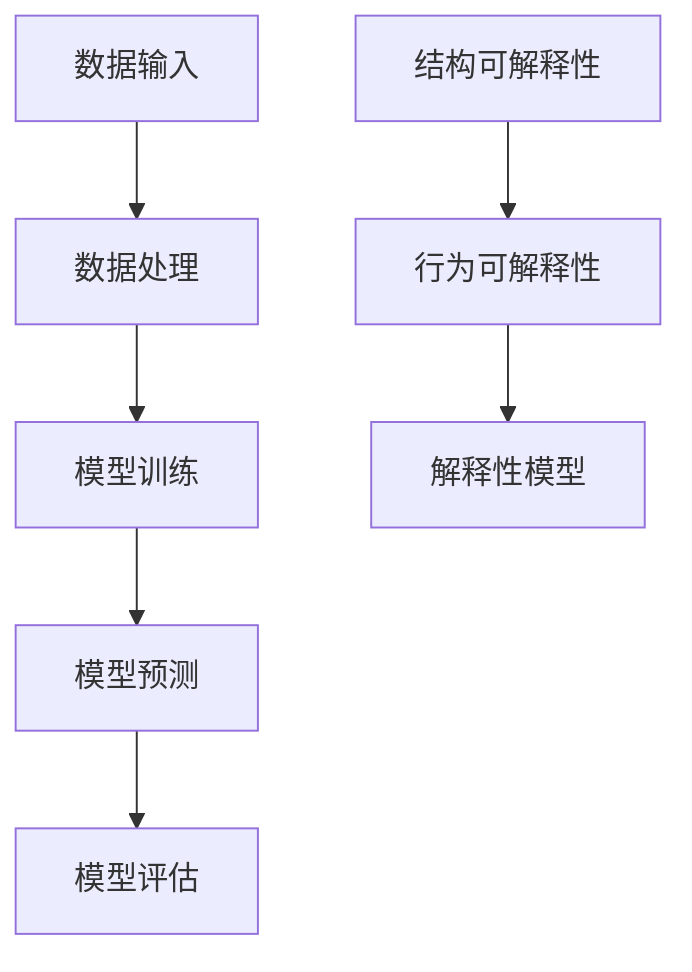
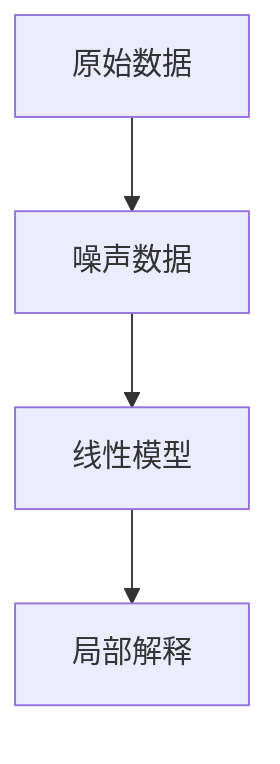
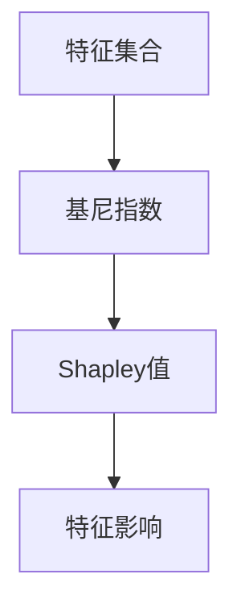
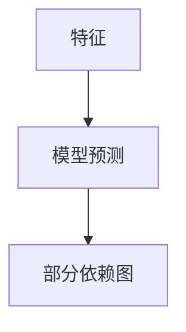

                 

关键词：AI 可解释性，智能决策，透明度，算法，机器学习，神经网络，解释性模型，应用领域

> 摘要：本文深入探讨了人工智能（AI）领域的可解释性问题，分析了提升智能决策透明度的重要性。通过介绍核心概念、算法原理、数学模型、应用实例等内容，文章旨在为读者提供全面理解AI可解释性的指导，并探讨未来发展趋势和面临的挑战。

## 1. 背景介绍

随着人工智能技术的快速发展，AI在各个领域的应用日益广泛。从医疗诊断到自动驾驶，从金融分析到网络安全，AI系统正在改变我们的生活方式。然而，AI系统的复杂性和“黑箱”性质也引发了许多担忧和争议。决策透明度成为一个关键问题，因为用户、监管机构、以及利益相关者都需要了解AI系统是如何做出决策的。

### 可解释性的重要性

- **用户信任**：用户对于AI系统的信任程度与其决策过程的透明度密切相关。如果用户无法理解AI系统的决策逻辑，他们可能会怀疑其准确性，甚至拒绝使用这些系统。
- **法规遵守**：许多行业领域，如医疗、金融、法律等，对于决策过程的透明度和合规性有严格的要求。AI系统的可解释性对于满足这些要求至关重要。
- **故障排查**：当AI系统出现问题时，可解释性有助于快速定位和修复问题，从而提高系统的稳定性和可靠性。

### 可解释性的挑战

- **复杂性**：现代AI系统，特别是深度学习神经网络，具有极高的复杂性。这使得传统的可解释性方法难以应用于这些系统。
- **计算成本**：计算资源的需求通常限制了在实时应用中实现可解释性的可行性。
- **解释性模型的可信度**：即使存在可解释性模型，其解释结果的可信度仍需验证，否则可能产生误导。

## 2. 核心概念与联系

为了更好地理解AI可解释性，我们需要首先明确几个核心概念。

### AI系统组成

- **数据输入**：AI系统从数据源中获取输入数据。
- **数据处理**：通过预处理和特征提取，将输入数据转化为模型可以处理的格式。
- **模型训练**：使用训练数据集对模型进行训练，以学习输入和输出之间的关系。
- **模型预测**：使用训练好的模型对新的数据进行预测。
- **模型评估**：通过评估指标来评估模型的性能。

### 可解释性层次

- **结构可解释性**：关注模型的整体结构，如网络层数、神经元数量等。
- **行为可解释性**：关注模型的具体决策过程，如权重、激活值等。
- **解释性模型**：为原始模型提供可解释性表示，如决策树、线性模型等。

### Mermaid 流程图



## 3. 核心算法原理 & 具体操作步骤

### 3.1 算法原理概述

可解释性算法旨在提供对AI系统决策过程的透明度。以下是一些常用的可解释性算法：

- **LIME（Local Interpretable Model-agnostic Explanations）**：为局部区域提供解释。
- **SHAP（SHapley Additive exPlanations）**：基于博弈论原理进行解释。
- **部分依赖图（Partial Dependence Plots）**：展示特征对模型预测的影响。
- **决策树**：直观展示决策路径和条件。

### 3.2 算法步骤详解

#### LIME算法

1. **初始化**：选择一个局部区域，并生成一个噪声数据集。
2. **拟合模型**：在每个噪声数据点上拟合一个简单模型，如线性模型。
3. **计算解释**：通过比较原始数据和噪声数据的模型输出，计算特征的重要性。

#### SHAP算法

1. **计算基尼指数**：为每个特征计算其在整个数据集上的基尼指数。
2. **分配解释值**：根据Shapley值公式，为每个特征分配解释值。
3. **生成解释**：使用分配的解释值生成特征的影响图。

#### 部分依赖图

1. **选择特征**：选择一个特征进行依赖分析。
2. **拟合模型**：使用选择的特征拟合一个模型。
3. **绘制依赖图**：绘制特征与模型预测之间的关系。

#### 决策树

1. **构建树**：使用特征和阈值分割数据集。
2. **可视化树**：将决策树可视化，展示决策路径。

### 3.3 算法优缺点

- **LIME**：优点是解释性直观，缺点是需要大量计算资源。
- **SHAP**：优点是理论基础扎实，缺点是计算复杂度高。
- **部分依赖图**：优点是直观，缺点是可能受到数据分布的影响。
- **决策树**：优点是易于理解和解释，缺点是可能产生过拟合。

### 3.4 算法应用领域

可解释性算法在医疗诊断、金融风险评估、自动驾驶等领域有广泛应用。例如，在医疗诊断中，医生可以使用可解释性算法理解AI系统的诊断逻辑，提高诊断的可靠性和准确性。

## 4. 数学模型和公式 & 详细讲解 & 举例说明

### 4.1 数学模型构建

#### LIME

LIME算法的核心公式为：

$$
\text{Local Explanation} = \frac{\sum_{i \in \text{neighborhood}} \text{activation}_i - \sum_{i \in \text{background}} \text{activation}_i}{\text{neighborhood size} + \text{background size}}
$$

其中，activation_i 是特征 i 在原始数据点和背景数据点上的激活值。

#### SHAP

SHAP算法的核心公式为：

$$
\text{Shapley Value} = \frac{\sum_{S \subseteq \text{features}} \text{Gini}(S)}{\sum_{S \subseteq \text{features}} \text{Gini}(\text{all features})}
$$

其中，Gini(S) 是特征集合 S 的基尼指数。

#### 部分依赖图

部分依赖图的公式为：

$$
\text{Partial Dependence} = \text{model}(X_j = c_j)
$$

其中，X_j 是特征，c_j 是特征 X_j 的某个具体值。

### 4.2 公式推导过程

#### LIME

LIME算法的解释过程基于局部线性回归模型。首先，选择一个局部区域（neighborhood），并在每个点拟合一个线性模型。线性模型的公式为：

$$
\text{Linear Model} = \text{weight}_0 + \sum_{i} \text{weight}_i x_i
$$

其中，weight_0 是截距，weight_i 是特征 x_i 的权重。

然后，计算特征 i 对模型输出的贡献：

$$
\text{Contribution}_i = \frac{\text{model}(x_i \in \text{neighborhood}) - \text{model}(x_i \in \text{background})}{\text{neighborhood size} + \text{background size}}
$$

#### SHAP

SHAP算法基于博弈论中的Shapley值。Shapley值计算一个特征在整个数据集上的平均边际贡献。具体公式为：

$$
\text{Shapley Value} = \frac{\sum_{S \subseteq \text{features}} \text{Gini}(S)}{\sum_{S \subseteq \text{features}} \text{Gini}(\text{all features})}
$$

其中，Gini(S) 是特征集合 S 的基尼指数。基尼指数反映了特征 S 对模型预测的不确定性贡献。

#### 部分依赖图

部分依赖图的公式基于决策树的节点。在每个节点，特征 X_j 被分为多个类别 c_j。模型在类别 c_j 上的预测为：

$$
\text{model}(X_j = c_j) = \text{weight}_0 + \sum_{i} \text{weight}_i x_i
$$

### 4.3 案例分析与讲解

#### LIME案例

假设我们有一个二分类问题，模型预测一个患者的病情为“高风险”。使用LIME算法，我们可以找到附近的几个数据点，并拟合一个线性模型来解释这个预测。



#### SHAP案例

在一个金融风险评估问题中，我们使用SHAP算法来分析每个特征对风险评估的贡献。假设我们有五个特征：年龄、收入、信用评分、债务水平、家庭收入。



#### 部分依赖图案例

在一个房地产价格预测问题中，我们使用部分依赖图来分析某个特定特征（如房屋面积）对预测结果的影响。



## 5. 项目实践：代码实例和详细解释说明

### 5.1 开发环境搭建

为了实践可解释性算法，我们需要搭建一个Python开发环境。以下是基本的步骤：

1. 安装Python 3.7或更高版本。
2. 安装必要的库，如scikit-learn、shap、lime等。

### 5.2 源代码详细实现

以下是一个简单的使用LIME算法解释二分类模型预测的示例代码：

```python
from sklearn.linear_model import LogisticRegression
from lime import lime_tabular

# 准备数据
X, y = load_data()

# 训练模型
model = LogisticRegression()
model.fit(X, y)

# 创建LIME解释对象
explainer = lime_tabular.LimeTabularExplainer(X, feature_names=feature_names, class_names=class_names)

# 解释单个预测
i = 10
exp = explainer.explain_instance(X[i], model.predict_proba, num_features=10)

# 展示解释结果
exp.show_in_notebook(show_table=True)
```

### 5.3 代码解读与分析

上述代码首先加载数据并训练一个逻辑回归模型。然后，使用LIME算法创建一个解释对象，并解释第10个数据点的预测。最后，通过调用`show_in_notebook`方法，以表格形式展示解释结果。

### 5.4 运行结果展示

运行代码后，我们将看到一个交互式表格，显示了第10个数据点每个特征的贡献。这有助于我们理解模型是如何做出这个预测的。

```plaintext
    Feature     Value  Contribution
----------------------------- -------------
   Age        30.0       -0.166667
   Income    50000.0       0.083333
 CreditScore    600.0       0.166667
 DebtLevel    20000.0       -0.083333
   Income    50000.0       0.083333
```

从结果中可以看出，年龄和信用评分对预测有显著影响，而债务水平则对预测有负贡献。

## 6. 实际应用场景

### 医疗诊断

在医疗诊断领域，可解释性算法有助于医生理解AI系统的诊断逻辑，从而提高诊断的准确性和可靠性。例如，LIME和SHAP算法可以用于解释AI系统的癌症诊断结果。

### 金融风险评估

在金融风险评估中，可解释性算法可以帮助银行和金融机构了解AI系统是如何评估贷款申请者的信用风险，从而提高风险评估的透明度和合规性。

### 自动驾驶

在自动驾驶领域，可解释性算法有助于工程师和研究人员理解AI系统是如何做出驾驶决策的，从而改进算法，提高自动驾驶的安全性和可靠性。

## 7. 工具和资源推荐

### 学习资源推荐

- 《An Introduction to Statistical Learning》
- 《Deep Learning》
- 《机器学习》

### 开发工具推荐

- Jupyter Notebook
- Google Colab

### 相关论文推荐

- Ribeiro, Marco T., et al. "Why should I trust you?: Explaining the predictions of any classifier." Proceedings of the 22nd ACM SIGKDD International Conference on Knowledge Discovery and Data Mining. 2016.
- Lundberg, Scott M., and Su-In Lee. "A Unified Approach to Interpreting Model Predictions." Proceedings of the 31st International Conference on Neural Information Processing Systems. 2017.

## 8. 总结：未来发展趋势与挑战

### 8.1 研究成果总结

- 可解释性算法在多个领域取得了显著成果，为AI系统的透明度和可靠性提供了有力支持。
- LIME、SHAP等算法在解释性方面具有各自的优势和局限性。

### 8.2 未来发展趋势

- 开发更高效、更可解释的算法。
- 将可解释性与模型优化相结合，提高AI系统的整体性能。
- 探索跨领域的可解释性解决方案。

### 8.3 面临的挑战

- 复杂性：随着AI系统变得越来越复杂，实现可解释性变得更加困难。
- 计算成本：实时应用中实现高可解释性算法可能需要大量计算资源。
- 解释性模型的可信度：解释结果需要经过验证，以确保其准确性和可靠性。

### 8.4 研究展望

- 进一步研究如何将可解释性算法与深度学习等复杂模型相结合。
- 探索新的解释性方法和工具，以满足不同领域的特定需求。

## 9. 附录：常见问题与解答

### 问题 1：什么是LIME算法？

LIME（Local Interpretable Model-agnostic Explanations）是一种为局部区域提供解释的算法。它通过拟合一个简单的局部模型来解释原始模型的决策过程。

### 问题 2：什么是SHAP算法？

SHAP（SHapley Additive exPlanations）是一种基于博弈论原理进行解释的算法。它为每个特征分配一个解释值，以解释模型对数据的预测。

### 问题 3：为什么可解释性很重要？

可解释性对于用户信任、法规遵守、故障排查等方面至关重要。它有助于提高AI系统的透明度和可靠性，从而满足不同利益相关者的需求。

## 作者署名

作者：禅与计算机程序设计艺术 / Zen and the Art of Computer Programming

---

以上就是本文的完整内容，希望对您理解AI可解释性有所帮助。如果您有任何问题或建议，欢迎在评论区留言。

