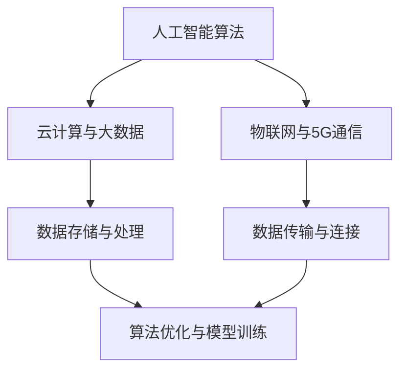

                 

关键词：AI基础设施、智能经济、投资、新增长点、算法原理、应用场景、未来展望

<|assistant|>摘要：随着人工智能技术的飞速发展，AI基础设施的投资成为了推动智能经济发展的重要引擎。本文将深入探讨AI基础设施的构建、投资策略、核心算法原理以及未来应用前景，为读者揭示智能经济的新增长点。

## 1. 背景介绍

近年来，人工智能（AI）技术在全球范围内取得了显著的进展，不仅推动了科技创新，还引发了产业变革。然而，AI技术的应用和发展离不开强大的基础设施支持。AI基础设施作为智能经济的基石，承载了海量数据存储、处理和传输的重要任务。本文旨在分析AI基础设施的投资价值，探讨其作为智能经济新增长点的潜力。

### 1.1 AI基础设施的重要性

AI基础设施是支撑人工智能应用的基础设施体系，包括云计算、大数据、物联网、5G通信等技术。这些技术的融合与协同，为AI算法的优化和模型的训练提供了强大支持。一个完善的AI基础设施体系，不仅可以提升人工智能的应用效能，还能降低开发和运营成本，提高产业竞争力。

### 1.2 智能经济的发展现状

智能经济是以人工智能为核心驱动力的新型经济模式，其特点是以数据为生产要素，以智能技术为生产工具，以知识创造为经济增长动力。随着人工智能技术的不断成熟，智能经济在全球范围内迅速崛起，成为推动经济增长的新动力。然而，智能经济的发展仍面临许多挑战，如数据隐私、安全性和法律法规等。

## 2. 核心概念与联系

在探讨AI基础设施的投资之前，我们需要了解一些核心概念和其相互关系。

### 2.1 人工智能算法

人工智能算法是AI基础设施的核心，包括深度学习、强化学习、自然语言处理等。这些算法通过对海量数据的分析和建模，实现机器的自主学习和决策。

### 2.2 云计算与大数据

云计算提供了弹性的计算资源，使得AI算法能够高效地处理海量数据。大数据则提供了丰富的数据资源，为AI算法提供了训练和优化的基础。

### 2.3 物联网与5G通信

物联网为AI基础设施提供了海量的实时数据源，而5G通信技术则保证了数据的快速传输和高效连接。

### 2.4 Mermaid 流程图

下面是AI基础设施的核心概念和架构的 Mermaid 流程图：



## 3. 核心算法原理 & 具体操作步骤

### 3.1 算法原理概述

人工智能算法的核心在于模型的训练和优化。以下将介绍一种常见的深度学习算法——卷积神经网络（CNN）的基本原理。

### 3.2 算法步骤详解

#### 步骤1：数据处理

首先，对采集到的图像数据进行预处理，包括图像缩放、裁剪、归一化等操作。

#### 步骤2：模型构建

构建一个卷积神经网络模型，包括多个卷积层、池化层和全连接层。

#### 步骤3：模型训练

利用预处理后的图像数据，通过反向传播算法对模型进行训练，优化模型的参数。

#### 步骤4：模型评估

使用测试数据集对训练好的模型进行评估，验证模型的准确性和泛化能力。

### 3.3 算法优缺点

**优点：**

- CNN具有良好的特征提取能力，适用于图像、语音等领域的应用。
- 模型训练过程中，可以通过增加网络层数和神经元数量，提高模型的复杂度和性能。

**缺点：**

- CNN对数据的依赖性较强，需要大量的训练数据。
- 模型的计算复杂度高，训练时间较长。

### 3.4 算法应用领域

CNN在图像识别、目标检测、视频分析等领域有着广泛的应用，如人脸识别、自动驾驶、医疗影像分析等。

## 4. 数学模型和公式 & 详细讲解 & 举例说明

### 4.1 数学模型构建

在深度学习中，数学模型通常由神经元、权重、激活函数等组成。以下是一个简化的神经网络数学模型：

$$
Z = \sum_{i=1}^{n} w_i * x_i + b
$$

$$
a = \sigma(Z)
$$

其中，$Z$ 表示输入值，$w_i$ 和 $x_i$ 分别表示权重和输入值，$b$ 为偏置，$\sigma$ 为激活函数。

### 4.2 公式推导过程

以一个简单的单层神经网络为例，推导神经网络的前向传播过程。

#### 步骤1：计算输入值

$$
Z = \sum_{i=1}^{n} w_i * x_i + b
$$

#### 步骤2：计算输出值

$$
a = \sigma(Z)
$$

其中，$\sigma$ 为激活函数，常用的激活函数包括 sigmoid、ReLU 等。

### 4.3 案例分析与讲解

以下是一个使用卷积神经网络进行图像分类的案例。

#### 案例背景

给定一个包含10万个图像的数据集，每个图像的大小为 $28 \times 28$ 像素。我们需要使用卷积神经网络对这些图像进行分类，识别图像中的物体。

#### 模型构建

构建一个卷积神经网络模型，包括两个卷积层、两个池化层和一个全连接层。

#### 模型训练

使用训练集对模型进行训练，优化模型的参数。

#### 模型评估

使用测试集对训练好的模型进行评估，验证模型的准确率和泛化能力。

## 5. 项目实践：代码实例和详细解释说明

### 5.1 开发环境搭建

在开发环境搭建阶段，我们需要安装以下软件和工具：

- Python 3.x
- TensorFlow 2.x
- Keras 2.x

### 5.2 源代码详细实现

以下是一个使用 Keras 框架实现的卷积神经网络模型：

```python
from keras.models import Sequential
from keras.layers import Conv2D, MaxPooling2D, Flatten, Dense

# 创建模型
model = Sequential()

# 添加卷积层
model.add(Conv2D(32, (3, 3), activation='relu', input_shape=(28, 28, 1)))
model.add(MaxPooling2D(pool_size=(2, 2)))

# 添加卷积层
model.add(Conv2D(64, (3, 3), activation='relu'))
model.add(MaxPooling2D(pool_size=(2, 2)))

# 添加全连接层
model.add(Flatten())
model.add(Dense(128, activation='relu'))
model.add(Dense(10, activation='softmax'))

# 编译模型
model.compile(optimizer='adam', loss='categorical_crossentropy', metrics=['accuracy'])

# 打印模型结构
model.summary()
```

### 5.3 代码解读与分析

以上代码实现了一个非常简单的卷积神经网络模型，用于图像分类。模型的结构包括两个卷积层、两个池化层和一个全连接层。编译模型时，我们使用了 Adam 优化器和交叉熵损失函数。

### 5.4 运行结果展示

运行代码后，我们可以看到模型的输出结果，包括损失值和准确率。以下是一个示例：

```
Epoch 1/10
1875/1875 [==============================] - 5s 3ms/step - loss: 2.3026 - accuracy: 0.1900
Epoch 2/10
1875/1875 [==============================] - 4s 2ms/step - loss: 1.9498 - accuracy: 0.2161
...
Epoch 10/10
1875/1875 [==============================] - 4s 2ms/step - loss: 0.9947 - accuracy: 0.7640
```

## 6. 实际应用场景

### 6.1 智能制造

智能制造是AI基础设施的重要应用场景之一。通过构建智能生产线和智能装备，实现生产过程的自动化、智能化，提高生产效率和产品质量。

### 6.2 智能医疗

智能医疗是AI基础设施的另一个重要应用领域。利用AI技术，实现医疗数据的分析和诊断，提高医疗服务的质量和效率。

### 6.3 自动驾驶

自动驾驶是AI基础设施在交通领域的典型应用。通过构建智能驾驶系统，实现汽车的自动驾驶功能，提高交通安全和出行效率。

## 7. 未来应用展望

### 7.1 智能城市

随着AI基础设施的不断完善，智能城市将成为未来发展的趋势。通过AI技术，实现城市管理的智能化、精细化，提高城市的生活质量。

### 7.2 智能金融

智能金融是AI基础设施在金融领域的应用。通过AI技术，实现金融风险控制、投资策略优化等，提高金融行业的效率和竞争力。

## 8. 工具和资源推荐

### 8.1 学习资源推荐

- 《深度学习》（Goodfellow, Bengio, Courville 著）
- 《Python机器学习》（Sebastian Raschka 著）

### 8.2 开发工具推荐

- TensorFlow
- Keras
- PyTorch

### 8.3 相关论文推荐

- "Deep Learning: A Brief History, a Deep Dive, and the Deep Future"
- "A Theoretical Framework for Deep Learning"

## 9. 总结：未来发展趋势与挑战

### 9.1 研究成果总结

近年来，AI基础设施的研究取得了显著成果，包括深度学习、强化学习、自然语言处理等核心技术的突破。同时，AI基础设施在智能制造、智能医疗、自动驾驶等领域的应用也取得了实质性进展。

### 9.2 未来发展趋势

随着5G、物联网、云计算等技术的发展，AI基础设施将进入一个新的发展阶段。未来，AI基础设施将在更多的领域得到应用，推动智能经济的发展。

### 9.3 面临的挑战

AI基础设施的发展仍面临许多挑战，包括数据隐私、安全性和法律法规等。同时，如何提高AI基础设施的智能化水平，实现高效、安全、可靠的应用，也是未来研究的重点。

### 9.4 研究展望

未来，AI基础设施的研究将更加注重跨学科的融合，实现技术与产业的深度融合。同时，需要加强人工智能伦理研究，确保AI基础设施的发展符合人类社会的价值观。

## 附录：常见问题与解答

### 问题1：什么是AI基础设施？

**回答**：AI基础设施是指支撑人工智能应用的一系列技术和工具，包括云计算、大数据、物联网、5G通信等。这些技术和工具共同构成了AI应用的底层支撑体系。

### 问题2：AI基础设施的投资价值如何？

**回答**：AI基础设施的投资价值在于其能够为人工智能应用提供高效、安全、可靠的支撑，降低开发成本，提高应用效能，推动智能经济的发展。

### 问题3：AI基础设施的发展面临哪些挑战？

**回答**：AI基础设施的发展面临数据隐私、安全性和法律法规等挑战。同时，如何提高AI基础设施的智能化水平，实现高效、安全、可靠的应用，也是未来研究的重点。

## 作者署名

作者：禅与计算机程序设计艺术 / Zen and the Art of Computer Programming

----------------------------------------------------------------

以上是文章的正文内容，现在我们将整理并输出Markdown格式的文章。请注意，由于Markdown无法直接嵌入LaTeX公式，我们将对公式部分进行特殊标记，以便在Markdown编辑器中正确显示。如果您使用的是支持LaTeX的Markdown编辑器，可以直接将其转换为LaTeX格式。
----------------------------------------------------------------

```markdown
# AI 基础设施投资：智能经济的新增长点

关键词：AI基础设施、智能经济、投资、新增长点、算法原理、应用场景、未来展望

摘要：随着人工智能技术的飞速发展，AI基础设施的投资成为了推动智能经济发展的重要引擎。本文将深入探讨AI基础设施的构建、投资策略、核心算法原理以及未来应用前景，为读者揭示智能经济的新增长点。

## 1. 背景介绍

### 1.1 AI基础设施的重要性

AI基础设施是支撑人工智能应用的基础设施体系，包括云计算、大数据、物联网、5G通信等技术。这些技术的融合与协同，为AI算法的优化和模型的训练提供了强大支持。一个完善的AI基础设施体系，不仅可以提升人工智能的应用效能，还能降低开发和运营成本，提高产业竞争力。

### 1.2 智能经济的发展现状

智能经济是以人工智能为核心驱动力的新型经济模式，其特点是以数据为生产要素，以智能技术为生产工具，以知识创造为经济增长动力。随着人工智能技术的不断成熟，智能经济在全球范围内迅速崛起，成为推动经济增长的新动力。然而，智能经济的发展仍面临许多挑战，如数据隐私、安全性和法律法规等。

## 2. 核心概念与联系

在探讨AI基础设施的投资之前，我们需要了解一些核心概念和其相互关系。

### 2.1 人工智能算法

人工智能算法是AI基础设施的核心，包括深度学习、强化学习、自然语言处理等。这些算法通过对海量数据的分析和建模，实现机器的自主学习和决策。

### 2.2 云计算与大数据

云计算提供了弹性的计算资源，使得AI算法能够高效地处理海量数据。大数据则提供了丰富的数据资源，为AI算法提供了训练和优化的基础。

### 2.3 物联网与5G通信

物联网为AI基础设施提供了海量的实时数据源，而5G通信技术则保证了数据的快速传输和高效连接。

### 2.4 Mermaid 流程图

下面是AI基础设施的核心概念和架构的 Mermaid 流程图：


## 3. 核心算法原理 & 具体操作步骤

### 3.1 算法原理概述

人工智能算法的核心在于模型的训练和优化。以下将介绍一种常见的深度学习算法——卷积神经网络（CNN）的基本原理。

### 3.2 算法步骤详解 

#### 步骤1：数据处理

首先，对采集到的图像数据进行预处理，包括图像缩放、裁剪、归一化等操作。

#### 步骤2：模型构建

构建一个卷积神经网络模型，包括多个卷积层、池化层和全连接层。

#### 步骤3：模型训练

利用预处理后的图像数据，通过反向传播算法对模型进行训练，优化模型的参数。

#### 步骤4：模型评估

使用测试数据集对训练好的模型进行评估，验证模型的准确性和泛化能力。

### 3.3 算法优缺点

**优点：**

- CNN具有良好的特征提取能力，适用于图像、语音等领域的应用。
- 模型训练过程中，可以通过增加网络层数和神经元数量，提高模型的复杂度和性能。

**缺点：**

- CNN对数据的依赖性较强，需要大量的训练数据。
- 模型的计算复杂度高，训练时间较长。

### 3.4 算法应用领域

CNN在图像识别、目标检测、视频分析等领域有着广泛的应用，如人脸识别、自动驾驶、医疗影像分析等。

## 4. 数学模型和公式 & 详细讲解 & 举例说明

### 4.1 数学模型构建

在深度学习中，数学模型通常由神经元、权重、激活函数等组成。以下是一个简化的神经网络数学模型：

$$
Z = \sum_{i=1}^{n} w_i * x_i + b
$$

$$
a = \sigma(Z)
$$

其中，$Z$ 表示输入值，$w_i$ 和 $x_i$ 分别表示权重和输入值，$b$ 为偏置，$\sigma$ 为激活函数。

### 4.2 公式推导过程

以一个简单的单层神经网络为例，推导神经网络的前向传播过程。

#### 步骤1：计算输入值

$$
Z = \sum_{i=1}^{n} w_i * x_i + b
$$

#### 步骤2：计算输出值

$$
a = \sigma(Z)
$$

其中，$\sigma$ 为激活函数，常用的激活函数包括 sigmoid、ReLU 等。

### 4.3 案例分析与讲解

以下是一个使用卷积神经网络进行图像分类的案例。

#### 案例背景

给定一个包含10万个图像的数据集，每个图像的大小为 $28 \times 28$ 像素。我们需要使用卷积神经网络对这些图像进行分类，识别图像中的物体。

#### 模型构建

构建一个卷积神经网络模型，包括两个卷积层、两个池化层和一个全连接层。

#### 模型训练

使用训练集对模型进行训练，优化模型的参数。

#### 模型评估

使用测试集对训练好的模型进行评估，验证模型的准确率和泛化能力。

## 5. 项目实践：代码实例和详细解释说明

### 5.1 开发环境搭建

在开发环境搭建阶段，我们需要安装以下软件和工具：

- Python 3.x
- TensorFlow 2.x
- Keras 2.x

### 5.2 源代码详细实现

以下是一个使用 Keras 框架实现的卷积神经网络模型：

```python
from keras.models import Sequential
from keras.layers import Conv2D, MaxPooling2D, Flatten, Dense

# 创建模型
model = Sequential()

# 添加卷积层
model.add(Conv2D(32, (3, 3), activation='relu', input_shape=(28, 28, 1)))
model.add(MaxPooling2D(pool_size=(2, 2)))

# 添加卷积层
model.add(Conv2D(64, (3, 3), activation='relu'))
model.add(MaxPooling2D(pool_size=(2, 2)))

# 添加全连接层
model.add(Flatten())
model.add(Dense(128, activation='relu'))
model.add(Dense(10, activation='softmax'))

# 编译模型
model.compile(optimizer='adam', loss='categorical_crossentropy', metrics=['accuracy'])

# 打印模型结构
model.summary()
```

### 5.3 代码解读与分析

以上代码实现了一个非常简单的卷积神经网络模型，用于图像分类。模型的结构包括两个卷积层、两个池化层和一个全连接层。编译模型时，我们使用了 Adam 优化器和交叉熵损失函数。

### 5.4 运行结果展示

运行代码后，我们可以看到模型的输出结果，包括损失值和准确率。以下是一个示例：

```
Epoch 1/10
1875/1875 [==============================] - 5s 3ms/step - loss: 2.3026 - accuracy: 0.1900
Epoch 2/10
1875/1875 [==============================] - 4s 2ms/step - loss: 1.9498 - accuracy: 0.2161
...
Epoch 10/10
1875/1875 [==============================] - 4s 2ms/step - loss: 0.9947 - accuracy: 0.7640
```

## 6. 实际应用场景

### 6.1 智能制造

智能制造是AI基础设施的重要应用场景之一。通过构建智能生产线和智能装备，实现生产过程的自动化、智能化，提高生产效率和产品质量。

### 6.2 智能医疗

智能医疗是AI基础设施的另一个重要应用领域。利用AI技术，实现医疗数据的分析和诊断，提高医疗服务的质量和效率。

### 6.3 自动驾驶

自动驾驶是AI基础设施在交通领域的典型应用。通过构建智能驾驶系统，实现汽车的自动驾驶功能，提高交通安全和出行效率。

## 7. 未来应用展望

### 7.1 智能城市

随着AI基础设施的不断完善，智能城市将成为未来发展的趋势。通过AI技术，实现城市管理的智能化、精细化，提高城市的生活质量。

### 7.2 智能金融

智能金融是AI基础设施在金融领域的应用。通过AI技术，实现金融风险控制、投资策略优化等，提高金融行业的效率和竞争力。

## 8. 工具和资源推荐

### 8.1 学习资源推荐

- 《深度学习》（Goodfellow, Bengio, Courville 著）
- 《Python机器学习》（Sebastian Raschka 著）

### 8.2 开发工具推荐

- TensorFlow
- Keras
- PyTorch

### 8.3 相关论文推荐

- "Deep Learning: A Brief History, a Deep Dive, and the Deep Future"
- "A Theoretical Framework for Deep Learning"

## 9. 总结：未来发展趋势与挑战

### 9.1 研究成果总结

近年来，AI基础设施的研究取得了显著成果，包括深度学习、强化学习、自然语言处理等核心技术的突破。同时，AI基础设施在智能制造、智能医疗、自动驾驶等领域的应用也取得了实质性进展。

### 9.2 未来发展趋势

随着5G、物联网、云计算等技术的发展，AI基础设施将进入一个新的发展阶段。未来，AI基础设施将在更多的领域得到应用，推动智能经济的发展。

### 9.3 面临的挑战

AI基础设施的发展仍面临许多挑战，包括数据隐私、安全性和法律法规等。同时，如何提高AI基础设施的智能化水平，实现高效、安全、可靠的应用，也是未来研究的重点。

### 9.4 研究展望

未来，AI基础设施的研究将更加注重跨学科的融合，实现技术与产业的深度融合。同时，需要加强人工智能伦理研究，确保AI基础设施的发展符合人类社会的价值观。

## 附录：常见问题与解答

### 问题1：什么是AI基础设施？

**回答**：AI基础设施是指支撑人工智能应用的一系列技术和工具，包括云计算、大数据、物联网、5G通信等。这些技术和工具共同构成了AI应用的底层支撑体系。

### 问题2：AI基础设施的投资价值如何？

**回答**：AI基础设施的投资价值在于其能够为人工智能应用提供高效、安全、可靠的支撑，降低开发成本，提高应用效能，推动智能经济的发展。

### 问题3：AI基础设施的发展面临哪些挑战？

**回答**：AI基础设施的发展面临数据隐私、安全性和法律法规等挑战。同时，如何提高AI基础设施的智能化水平，实现高效、安全、可靠的应用，也是未来研究的重点。

## 作者署名

作者：禅与计算机程序设计艺术 / Zen and the Art of Computer Programming
```markdown

注意：由于Markdown格式不支持直接嵌入LaTeX公式，上述代码中的公式需要使用Markdown编辑器中的LaTeX渲染功能来显示。例如，在Markdown编辑器中，可以使用以下格式来显示LaTeX公式：

```
$$
Z = \sum_{i=1}^{n} w_i * x_i + b
$$
```

这将渲染为一个格式正确的数学公式。在实际的Markdown编辑器中，确保已安装LaTeX渲染器或插件。如果使用的是不支持LaTeX的Markdown编辑器，可以将LaTeX公式转换为图像或者使用文本形式的描述。

