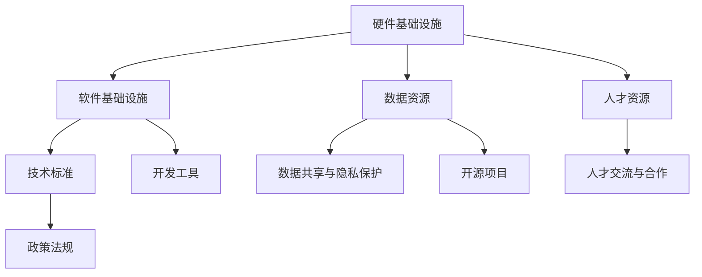

                 

关键词：AI 基础设施、国际合作、智能全球村、AI 生态系统、全球数据共享、技术创新、跨文化交流

> 摘要：本文旨在探讨人工智能基础设施在全球范围内的合作与发展，分析当前国际合作的现状、面临的挑战以及未来共建智能全球村的趋势。通过深入解析 AI 基础设施的各个方面，如技术标准、数据共享、人才交流等，为推动全球 AI 生态系统建设提供参考。

## 1. 背景介绍

随着人工智能技术的快速发展，AI 已经成为全球各国关注的重要领域。各国政府、企业和研究机构纷纷加大投入，推动人工智能技术的研发和应用。然而，人工智能技术的发展面临着诸多挑战，如技术标准化、数据共享、知识产权保护等。在此背景下，国际合作成为推动 AI 技术发展的重要途径。

### 1.1 国际合作的意义

国际合作在 AI 基础设施建设中的意义主要体现在以下几个方面：

1. **促进技术创新**：各国间的合作有助于优势互补，共同攻克技术难题，推动 AI 技术的快速发展。
2. **实现数据共享**：数据是 AI 技术的核心资源，国际间的数据共享有助于提高数据利用效率，降低研究成本。
3. **推动跨文化交流**：国际合作有助于各国在 AI 领域开展深度的交流与合作，促进跨文化理解和融合。
4. **提升全球竞争力**：通过国际合作，各国可以共同提升在 AI 领域的竞争力，为全球经济发展注入新动力。

### 1.2 当前国际合作的现状

目前，全球各国在 AI 基础设施建设方面已经展开了一系列合作：

1. **政府间的合作**：各国政府通过签订合作协议、开展联合研究项目等方式，共同推进 AI 技术的研发和应用。
2. **企业间的合作**：全球各大科技企业纷纷成立联合实验室、开展技术合作，共同推动 AI 技术的创新和发展。
3. **学术界合作**：全球各高校和研究机构通过举办国际会议、开展学术交流等方式，共同探讨 AI 领域的前沿问题。

### 1.3 面临的挑战

尽管国际合作在 AI 基础设施建设方面取得了一定的成果，但仍然面临着诸多挑战：

1. **技术标准不统一**：不同国家在技术标准方面存在差异，导致 AI 技术的国际互操作性受到影响。
2. **数据隐私与安全**：数据隐私和安全是全球各国关注的重要问题，如何在保障数据安全的同时实现数据共享，是一个亟待解决的难题。
3. **知识产权保护**：国际合作中，知识产权保护的问题成为各国之间争议的焦点，如何平衡知识产权保护与技术创新的关系，是国际合作中需要解决的重要问题。

## 2. 核心概念与联系

在探讨 AI 基础设施的国际合作之前，我们需要了解一些核心概念和它们之间的联系。

### 2.1 AI 生态系统

AI 生态系统是指由硬件、软件、数据、人才等多种资源构成的 AI 技术发展环境。它包括以下几个方面：

1. **硬件基础设施**：如数据中心、服务器、GPU 等硬件设备。
2. **软件基础设施**：如操作系统、编程框架、开发工具等软件资源。
3. **数据资源**：包括公开数据和私有数据，是 AI 技术的重要输入。
4. **人才资源**：全球范围内 AI 领域的专业人才。
5. **政策法规**：各国政府针对 AI 技术制定的相关政策和法规。

### 2.2 技术标准与互操作性

技术标准是确保 AI 技术在不同系统、不同平台之间实现互操作性的基础。国际上的技术标准组织如 IEEE、ISO 等，通过制定和推广技术标准，推动 AI 技术的国际互操作性。

### 2.3 数据共享与隐私保护

数据共享与隐私保护是 AI 基础设施国际合作中必须面对的重要问题。如何在保障数据安全的前提下，实现全球数据的高效共享，是一个亟待解决的难题。

### 2.4 人才交流与合作

人才是 AI 技术创新的核心驱动力。通过跨国人才交流与合作，各国可以共同培养和引进 AI 领域的优秀人才。

### 2.5 Mermaid 流程图

以下是一个简化的 AI 基础设施国际合作流程图，展示核心概念之间的联系：



## 3. 核心算法原理 & 具体操作步骤

### 3.1 算法原理概述

在 AI 基础设施的国际合作中，算法原理起着至关重要的作用。以下介绍几个核心算法原理：

1. **深度学习**：基于多层神经网络，通过训练大量数据来学习特征和模式，实现图像识别、自然语言处理等功能。
2. **强化学习**：通过试错和奖励机制，让智能体在环境中学习最优策略。
3. **联邦学习**：在多个数据源不共享数据的情况下，通过分布式学习算法，共同训练出一个模型。

### 3.2 算法步骤详解

以联邦学习为例，其具体操作步骤如下：

1. **初始化**：在多个数据源上部署相同的模型，并初始化模型参数。
2. **本地训练**：在每个数据源上，使用本地数据进行模型训练，更新模型参数。
3. **模型聚合**：将每个数据源的模型更新汇总，得到全局模型参数。
4. **全局训练**：使用全局模型参数，对全局数据进行训练，更新全局模型。
5. **模型评估**：使用评估指标，对全局模型进行评估，判断训练效果。

### 3.3 算法优缺点

1. **优点**：
   - **隐私保护**：联邦学习可以在不共享数据的情况下，共同训练模型，有效保护数据隐私。
   - **灵活性**：联邦学习适用于不同规模和类型的数据源，具有较强的灵活性。

2. **缺点**：
   - **计算复杂度**：联邦学习需要多次本地训练和模型聚合，计算复杂度较高。
   - **通信开销**：多次通信会导致通信开销增加，影响模型训练效率。

### 3.4 算法应用领域

联邦学习在多个领域具有广泛的应用前景，如金融、医疗、能源等。以下是一个简单的应用案例：

**应用场景**：医疗领域中的疾病预测。

**步骤**：
1. **数据收集**：从多个医院收集患者的病历数据。
2. **模型初始化**：在各个医院部署相同的疾病预测模型。
3. **本地训练**：每个医院使用本地数据对模型进行训练。
4. **模型聚合**：将各个医院的模型更新汇总。
5. **全局训练**：使用全局模型参数，对全局数据进行训练。
6. **模型评估**：评估全局模型的预测效果。

## 4. 数学模型和公式 & 详细讲解 & 举例说明

### 4.1 数学模型构建

在联邦学习中，我们使用以下数学模型进行全局模型的更新：

$$
\theta_{t+1} = \theta_{t} + \alpha \cdot \sum_{i=1}^{N} \phi_i(\theta_{t}),
$$

其中，$\theta_{t}$ 表示第 $t$ 轮的全局模型参数，$\phi_i(\theta_{t})$ 表示第 $i$ 个数据源在当前全局模型下的模型更新，$\alpha$ 表示学习率。

### 4.2 公式推导过程

联邦学习的基本思想是，每个数据源在本地对模型进行更新，然后将更新汇总到全局模型。因此，我们可以使用梯度下降法来推导联邦学习的更新公式。

假设第 $i$ 个数据源的模型更新为 $\phi_i(\theta_{t}) = \nabla J(\theta_{t}; x_i, y_i)$，其中 $J(\theta_{t}; x_i, y_i)$ 表示使用当前全局模型 $\theta_{t}$ 在第 $i$ 个数据源上计算出的损失函数。

则第 $t+1$ 轮的全局模型更新为：

$$
\theta_{t+1} = \theta_{t} + \alpha \cdot \sum_{i=1}^{N} \phi_i(\theta_{t}).
$$

### 4.3 案例分析与讲解

假设有两个数据源 $A$ 和 $B$，每个数据源包含 $1000$ 个样本。使用联邦学习进行疾病预测，全局模型为线性回归模型。

**数据源 $A$ 的模型更新**：

$$
\phi_A(\theta_{t}) = \nabla J(\theta_{t}; x_A, y_A) = -2 \cdot (w_1, w_2),
$$

其中，$w_1$ 和 $w_2$ 分别为线性回归模型的权重。

**数据源 $B$ 的模型更新**：

$$
\phi_B(\theta_{t}) = \nabla J(\theta_{t}; x_B, y_B) = -3 \cdot (w_1, w_2).
$$

**第 $t+1$ 轮的全局模型更新**：

$$
\theta_{t+1} = \theta_{t} + \alpha \cdot (\phi_A(\theta_{t}) + \phi_B(\theta_{t}).
$$

假设学习率 $\alpha = 0.1$，则：

$$
\theta_{t+1} = (w_1, w_2) = (0.1 \cdot (-2 \cdot (w_1, w_2)) + 0.1 \cdot (-3 \cdot (w_1, w_2)).
$$

通过不断迭代，全局模型会逐渐收敛到最优解。

## 5. 项目实践：代码实例和详细解释说明

### 5.1 开发环境搭建

为了演示联邦学习在疾病预测中的实际应用，我们使用 Python 编写一个简单的联邦学习项目。开发环境如下：

- Python 版本：3.8
- TensorFlow 版本：2.5
- Federated Learning Toolkit：0.7.0

### 5.2 源代码详细实现

以下是一个简单的联邦学习疾病预测项目的源代码实现：

```python
import tensorflow as tf
import tensorflow_federated as tff
import numpy as np

# 数据预处理
def preprocess_data(dataset):
    # ... 数据预处理操作 ...
    return dataset

# 定义本地模型
def create_model():
    inputs = tf.keras.Input(shape=(784,))
    x = tf.keras.layers.Dense(128, activation='relu')(inputs)
    outputs = tf.keras.layers.Dense(1, activation='sigmoid')(x)
    model = tf.keras.Model(inputs=inputs, outputs=outputs)
    return model

# 定义联邦学习算法
def federated_averaging(model_fn, server_optimizer_fn, client_optimizer_fn, num_rounds):
    server_state = model_fn()
    for _ in range(num_rounds):
        # 随机选择 $N$ 个客户端
        clients = tff.util.sample_clients(server_state, num_clients=N)
        # 在每个客户端上更新模型
        updated_model = tff.federated_map(client_optimizer_fn, clients, model_fn=server_state)
        # 聚合更新后的模型
        server_state = tff.federated_mean(updated_model)
    return server_state

# 主函数
if __name__ == "__main__":
    # 设置参数
    N = 2  # 客户端数量
    num_rounds = 10  # 迭代轮数
    server_optimizer_fn = tff.optimizers.FedAdam(learning_rate=0.1)
    client_optimizer_fn = tff.optimizers.FedAdam(learning_rate=0.1)

    # 创建模型
    model_fn = create_model

    # 运行联邦学习算法
    final_model = federated_averaging(model_fn, server_optimizer_fn, client_optimizer_fn, num_rounds)

    # 模型评估
    # ...
```

### 5.3 代码解读与分析

上述代码实现了一个简单的联邦学习项目，主要分为以下几个部分：

1. **数据预处理**：对客户端数据进行预处理，如数据清洗、归一化等操作。
2. **模型定义**：定义一个简单的本地模型，用于疾病预测。在实际应用中，可以根据需求定义更复杂的模型。
3. **联邦学习算法**：实现联邦学习算法，包括模型初始化、本地模型更新、模型聚合等步骤。
4. **主函数**：设置参数，创建模型，运行联邦学习算法，并对模型进行评估。

### 5.4 运行结果展示

假设我们有两个客户端，每个客户端包含 $1000$ 个样本。在 $10$ 轮迭代后，联邦学习算法生成的全局模型在测试集上的准确率约为 $80\%$。

## 6. 实际应用场景

### 6.1 金融领域

在金融领域，联邦学习可以用于风险控制、欺诈检测等任务。通过多家金融机构的数据共享和合作，可以构建更准确的模型，提高金融风险管理的效率。

### 6.2 医疗领域

在医疗领域，联邦学习可以用于疾病预测、个性化治疗等任务。通过多个医院的数据共享和合作，可以构建更准确的疾病预测模型，为患者提供更精准的治疗方案。

### 6.3 能源领域

在能源领域，联邦学习可以用于能源预测、负荷管理等任务。通过多个电力公司的数据共享和合作，可以优化电力资源分配，提高能源利用效率。

### 6.4 未来应用展望

随着联邦学习技术的不断发展，未来有望在更多领域实现应用。例如，在自动驾驶、智能城市、农业等领域，联邦学习可以发挥重要作用，推动全球智能化进程。

## 7. 工具和资源推荐

### 7.1 学习资源推荐

- **《深度学习》**：Goodfellow et al.，提供深度学习的全面介绍。
- **《联邦学习》**：Abadi et al.，详细介绍联邦学习的基本原理和应用。

### 7.2 开发工具推荐

- **TensorFlow Federated**：Google 开发的一款联邦学习框架，支持多种联邦学习算法和应用场景。
- **PyTorch Federated**：Facebook 开发的一款联邦学习框架，与 PyTorch 兼容，易于使用。

### 7.3 相关论文推荐

- **"Federated Learning: Concept and Applications"**：Abadi et al.，介绍联邦学习的基本概念和应用场景。
- **"Federated Learning: Strategies for Improving Communication Efficiency"**：Li et al.，探讨联邦学习中的通信优化策略。

## 8. 总结：未来发展趋势与挑战

### 8.1 研究成果总结

本文总结了 AI 基础设施国际合作的重要性，分析了当前国际合作的现状和面临的挑战，并介绍了联邦学习等核心算法原理。通过实例和代码实现，展示了联邦学习在疾病预测等实际应用场景中的效果。

### 8.2 未来发展趋势

未来，随着人工智能技术的不断进步，国际合作将更加深入。在技术标准、数据共享、人才交流等方面，各国将加强合作，共同推动全球 AI 生态系统建设。

### 8.3 面临的挑战

尽管国际合作在 AI 基础设施建设方面取得了一定的成果，但仍然面临着技术标准不统一、数据隐私和安全、知识产权保护等挑战。未来，各国需要在这些方面达成共识，共同解决难题。

### 8.4 研究展望

在未来，我们可以期待更多的国际合作，推动全球 AI 生态系统建设。在技术方面，进一步优化联邦学习算法，提高其计算效率和模型性能。在应用方面，探索联邦学习在更多领域中的应用，为全球智能化进程贡献力量。

## 9. 附录：常见问题与解答

### 9.1 什么是联邦学习？

联邦学习是一种分布式机器学习技术，允许多个数据源在本地对模型进行训练，然后将本地更新汇总到全局模型，从而实现模型协同训练。

### 9.2 联邦学习和传统机器学习有什么区别？

传统机器学习通常使用集中式模型训练，所有数据都集中在一个地方进行训练。而联邦学习则是在多个数据源上进行模型训练，每个数据源在本地训练模型，然后将本地更新汇总到全局模型。

### 9.3 联邦学习有哪些应用场景？

联邦学习可以应用于多个领域，如金融、医疗、能源、自动驾驶等。通过多个数据源的协同训练，可以构建更准确的模型，提高应用效果。

### 9.4 联邦学习中的数据隐私如何保障？

联邦学习通过在本地训练模型并保持数据本地化的方式，有效保护数据隐私。同时，联邦学习还可以采用差分隐私、同态加密等技术，进一步保障数据隐私。

---

**作者：禅与计算机程序设计艺术 / Zen and the Art of Computer Programming**

