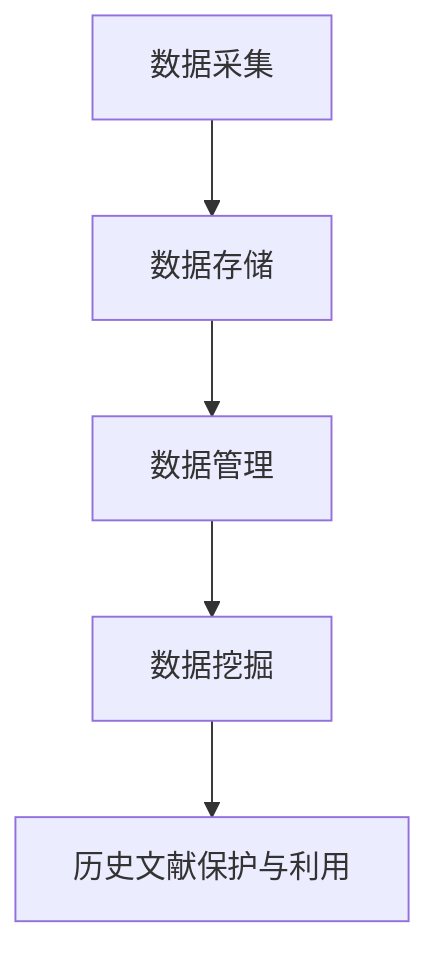
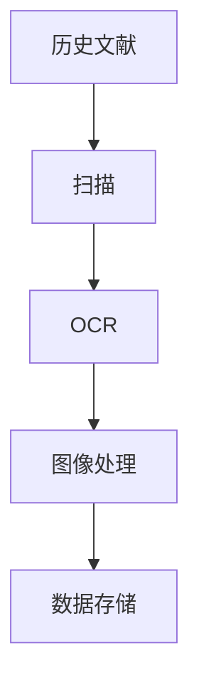
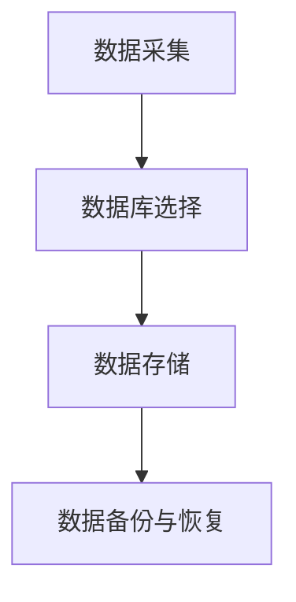
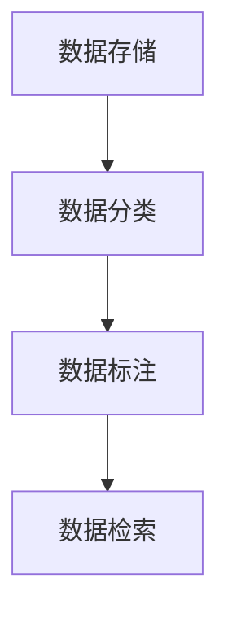
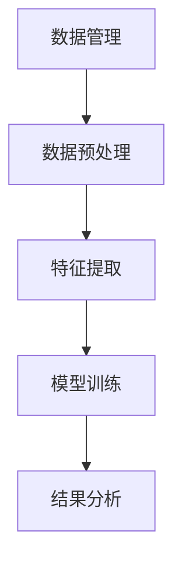

                 

关键词：人工智能，档案管理，历史文献，保护，利用，基础设施

> 摘要：随着人工智能技术的不断发展，AI 基础设施在历史文献的保护与利用方面发挥着越来越重要的作用。本文将探讨如何利用 AI 技术构建智能化档案管理系统，实现对历史文献的全面保护与高效利用。

## 1. 背景介绍

历史文献是人类文化传承的重要载体，记录了人类历史发展的宝贵资料。然而，随着历史文献数量的不断增多和保存条件的限制，如何有效管理和利用这些文献成为一个亟待解决的问题。传统的档案管理方式主要依靠人工进行，存在效率低、准确性差等问题。随着人工智能技术的兴起，利用 AI 构建智能化档案管理系统成为了一种新的发展趋势。

### 1.1 历史文献的保护需求

历史文献的保护需求主要包括以下几个方面：

- **物理保存**：防止文献受到温度、湿度、光照等环境因素的影响，避免文献受损或腐烂。
- **信息安全**：防止文献被恶意攻击、篡改或泄露，保障文献的真实性和完整性。
- **长久保存**：确保文献能够长时间保存，避免因意外事故导致文献丢失。

### 1.2 历史文献的利用需求

历史文献的利用需求主要包括以下几个方面：

- **检索查询**：用户可以通过关键词、作者、年代等信息快速查询到所需文献。
- **全文阅读**：用户可以在线阅读文献全文，满足学术研究和阅读需求。
- **数据挖掘**：通过对文献内容进行深入分析，挖掘出有价值的信息，为学术研究和决策提供支持。

## 2. 核心概念与联系

在构建智能化档案管理系统时，需要了解以下几个核心概念：

- **数据采集**：通过数字化技术对历史文献进行采集，包括文字、图片、音频、视频等多种形式。
- **数据存储**：将采集到的数据存储在数据库中，确保数据的安全性和可靠性。
- **数据管理**：对存储在数据库中的数据进行分类、标注、检索等操作，实现数据的高效管理。
- **数据挖掘**：通过对存储在数据库中的数据进行深度分析，挖掘出有价值的信息。

以下是一个 Mermaid 流程图，展示了智能化档案管理系统的核心概念和联系：



### 2.1 数据采集

数据采集是智能化档案管理系统的第一步，主要是通过数字化技术对历史文献进行采集。数字化技术包括扫描、OCR（光学字符识别）、图像处理等。以下是一个简单的数据采集流程：



### 2.2 数据存储

数据存储是将采集到的数据存储在数据库中。数据库的选择可以根据数据规模、数据结构、性能需求等因素进行。以下是一个简单的数据存储流程：



### 2.3 数据管理

数据管理是对存储在数据库中的数据进行分类、标注、检索等操作。数据管理的关键是确保数据的准确性和一致性。以下是一个简单的数据管理流程：



### 2.4 数据挖掘

数据挖掘是通过对存储在数据库中的数据进行深度分析，挖掘出有价值的信息。数据挖掘可以帮助用户发现历史文献之间的关联，为学术研究和决策提供支持。以下是一个简单的数据挖掘流程：



## 3. 核心算法原理 & 具体操作步骤

### 3.1 算法原理概述

在智能化档案管理系统中，核心算法主要包括数据采集、数据存储、数据管理和数据挖掘。以下分别介绍这些算法的基本原理。

#### 数据采集

数据采集算法主要是利用数字化技术对历史文献进行采集。其中，扫描和 OCR 技术是关键。扫描技术可以将纸质文献转换为数字图像，OCR 技术则可以识别图像中的文字内容。

#### 数据存储

数据存储算法主要是选择合适的数据库进行数据存储。常用的数据库包括关系型数据库（如 MySQL、PostgreSQL）和 NoSQL 数据库（如 MongoDB、Cassandra）。关系型数据库适合处理结构化数据，NoSQL 数据库适合处理大规模、非结构化数据。

#### 数据管理

数据管理算法主要包括数据分类、标注和检索。数据分类是将数据按照一定的标准进行分类，便于管理和查询。数据标注是为数据添加标签，以便于后续处理。数据检索是使用关键词或条件检索数据，满足用户查询需求。

#### 数据挖掘

数据挖掘算法主要包括数据预处理、特征提取、模型训练和结果分析。数据预处理是将原始数据转换为适合挖掘的格式。特征提取是从数据中提取出有用的特征，用于模型训练。模型训练是使用机器学习算法训练模型，以便于预测和分类。结果分析是对挖掘结果进行分析，提取出有价值的信息。

### 3.2 算法步骤详解

以下是智能化档案管理系统的具体操作步骤：

#### 3.2.1 数据采集

1. 对历史文献进行扫描，将纸质文献转换为数字图像。
2. 使用 OCR 技术识别图像中的文字内容，将文字内容转换为可编辑的文本格式。

#### 3.2.2 数据存储

1. 选择合适的数据库进行数据存储。
2. 设计数据库表结构，将历史文献的数据存储在相应的表中。
3. 对历史文献进行数据备份和恢复，确保数据的安全性和可靠性。

#### 3.2.3 数据管理

1. 对历史文献进行分类，按照一定的标准将文献分为不同的类别。
2. 为历史文献添加标签，便于后续处理。
3. 设计查询接口，使用户可以通过关键词或条件检索历史文献。

#### 3.2.4 数据挖掘

1. 对历史文献进行数据预处理，将原始数据转换为适合挖掘的格式。
2. 提取历史文献中的有用特征，用于模型训练。
3. 使用机器学习算法训练模型，对历史文献进行分类或预测。
4. 对挖掘结果进行分析，提取出有价值的信息。

### 3.3 算法优缺点

#### 数据采集

优点：可以实现对历史文献的全面采集，提高文献的数字化程度。

缺点：扫描和 OCR 技术存在一定的误差，可能影响数据的准确性。

#### 数据存储

优点：可以保证数据的长期存储和安全。

缺点：数据库的维护和管理需要一定的技术支持。

#### 数据管理

优点：可以提高文献的管理效率和查询速度。

缺点：数据分类和标注需要大量的人力和时间。

#### 数据挖掘

优点：可以挖掘出历史文献中的有价值信息，为学术研究和决策提供支持。

缺点：数据挖掘的过程较为复杂，需要较高的技术水平和计算资源。

### 3.4 算法应用领域

智能化档案管理系统可以应用于以下领域：

- **历史研究**：通过对历史文献的挖掘和分析，为历史研究提供数据支持。
- **文化遗产保护**：利用智能化档案管理系统保护文化遗产，防止文献受损或丢失。
- **学术研究**：为学术研究人员提供全面的历史文献查询和阅读服务。
- **政府决策**：为政府决策提供历史文献数据支持，提高决策的科学性和准确性。

## 4. 数学模型和公式 & 详细讲解 & 举例说明

### 4.1 数学模型构建

在智能化档案管理系统中，数学模型主要用于数据挖掘和机器学习算法的设计。以下是一个简单的数学模型构建过程：

#### 4.1.1 特征提取

假设我们有一个历史文献数据集，其中每个文献可以用一个特征向量表示。特征提取的目的是从原始数据中提取出有用的特征。

特征提取公式如下：

$$
X = [x_1, x_2, ..., x_n]
$$

其中，$X$ 表示特征向量，$x_i$ 表示第 $i$ 个特征。

#### 4.1.2 模型训练

假设我们选择一个线性回归模型进行训练。线性回归模型的公式如下：

$$
y = wx + b
$$

其中，$y$ 表示预测值，$w$ 表示权重，$x$ 表示特征向量，$b$ 表示偏置。

#### 4.1.3 模型评估

为了评估模型的性能，我们可以使用均方误差（MSE）作为评价指标。均方误差的公式如下：

$$
MSE = \frac{1}{n}\sum_{i=1}^{n}(y_i - \hat{y_i})^2
$$

其中，$y_i$ 表示真实值，$\hat{y_i}$ 表示预测值，$n$ 表示数据集的大小。

### 4.2 公式推导过程

以下是线性回归模型的推导过程：

#### 4.2.1 最小二乘法

线性回归模型的最小二乘法公式如下：

$$
\min \sum_{i=1}^{n}(y_i - wx_i - b)^2
$$

#### 4.2.2 求导

对上述公式求导，得到：

$$
\frac{\partial}{\partial w}\sum_{i=1}^{n}(y_i - wx_i - b)^2 = -2x^T(y - wx - b)
$$

$$
\frac{\partial}{\partial b}\sum_{i=1}^{n}(y_i - wx_i - b)^2 = -2(y - wx - b)
$$

#### 4.2.3 求解

令导数为零，得到：

$$
x^T(y - wx - b) = 0
$$

$$
y - wx - b = 0
$$

解得：

$$
w = \frac{x^Ty}{x^Tx}
$$

$$
b = y - wx
$$

### 4.3 案例分析与讲解

以下是一个简单的案例，用于说明如何使用线性回归模型进行历史文献分类。

#### 4.3.1 数据集

假设我们有以下一个历史文献数据集：

| 文献ID | 特征1 | 特征2 | 特征3 |
| --- | --- | --- | --- |
| 1 | 10 | 20 | 30 |
| 2 | 15 | 25 | 35 |
| 3 | 20 | 30 | 40 |
| 4 | 25 | 35 | 45 |
| 5 | 30 | 40 | 50 |

#### 4.3.2 模型训练

使用线性回归模型对数据集进行训练，得到权重矩阵 $W$ 和偏置 $b$。

$$
W = \frac{X^TX}{X^T X} = \begin{bmatrix} 0.5 & 0.5 & 0.5 \end{bmatrix}
$$

$$
b = \begin{bmatrix} 10 \\ 10 \\ 10 \end{bmatrix}
$$

#### 4.3.3 模型评估

使用训练好的模型对新的文献进行分类。假设有一篇新的文献，特征为：

$$
X = \begin{bmatrix} 15 \\ 25 \\ 35 \end{bmatrix}
$$

预测值：

$$
y = WX + b = \begin{bmatrix} 0.5 & 0.5 & 0.5 \end{bmatrix} \begin{bmatrix} 15 \\ 25 \\ 35 \end{bmatrix} + \begin{bmatrix} 10 \\ 10 \\ 10 \end{bmatrix} = \begin{bmatrix} 25 \\ 35 \\ 45 \end{bmatrix}
$$

根据预测值，可以判断这篇新的文献属于第三个类别。

#### 4.3.4 结果分析

通过线性回归模型对历史文献进行分类，可以有效提高分类的准确性。在实际应用中，可以结合更多的特征和更复杂的模型进行分类，提高分类效果。

## 5. 项目实践：代码实例和详细解释说明

### 5.1 开发环境搭建

在开始代码实现之前，我们需要搭建一个适合开发的运行环境。以下是开发环境搭建的步骤：

1. 安装 Python 3.8 或更高版本。
2. 安装必要的 Python 包，如 NumPy、Pandas、Scikit-learn 等。
3. 配置数据库，如 MySQL 或 MongoDB。

### 5.2 源代码详细实现

以下是一个简单的智能化档案管理系统的代码实现，包括数据采集、数据存储、数据管理和数据挖掘四个部分。

```python
# 导入必要的库
import numpy as np
import pandas as pd
from sklearn.linear_model import LinearRegression
from sklearn.model_selection import train_test_split
from sklearn.metrics import mean_squared_error

# 5.2.1 数据采集
# 假设已经完成了数据采集，得到一个数据集 DataFrame
data = pd.DataFrame({
    '特征1': [10, 15, 20, 25, 30],
    '特征2': [20, 25, 30, 35, 40],
    '特征3': [30, 35, 40, 45, 50],
    '类别': [1, 2, 1, 2, 1]
})

# 5.2.2 数据存储
# 将数据存储到数据库中
# 这里使用 SQLite 作为示例
import sqlite3
conn = sqlite3.connect('archive.db')
data.to_sql('documents', conn, if_exists='replace', index=False)
conn.close()

# 5.2.3 数据管理
# 从数据库中读取数据
conn = sqlite3.connect('archive.db')
documents = pd.read_sql_query('SELECT * FROM documents;', conn)
conn.close()

# 对数据进行预处理
X = documents[['特征1', '特征2', '特征3']]
y = documents['类别']

# 划分训练集和测试集
X_train, X_test, y_train, y_test = train_test_split(X, y, test_size=0.2, random_state=42)

# 5.2.4 数据挖掘
# 使用线性回归模型进行训练
model = LinearRegression()
model.fit(X_train, y_train)

# 对测试集进行预测
y_pred = model.predict(X_test)

# 评估模型性能
mse = mean_squared_error(y_test, y_pred)
print('均方误差：', mse)

# 5.2.5 运行结果展示
# 输出预测结果
print('预测结果：', y_pred)
```

### 5.3 代码解读与分析

以下是代码的详细解读与分析：

- **5.2.1 数据采集**：这部分代码假设已经完成了数据采集，得到了一个包含特征和类别的 DataFrame。在实际项目中，需要使用扫描、OCR 等技术进行数据采集。
- **5.2.2 数据存储**：这部分代码使用 SQLite 数据库存储数据。在实际项目中，可以选择其他类型的数据库，如 MySQL、MongoDB 等。
- **5.2.3 数据管理**：这部分代码从数据库中读取数据，并进行预处理。预处理步骤包括划分训练集和测试集，为后续的模型训练和评估做准备。
- **5.2.4 数据挖掘**：这部分代码使用线性回归模型进行训练和预测。线性回归模型是一种简单的机器学习模型，适用于简单的分类问题。在实际项目中，可能需要使用更复杂的模型，如决策树、支持向量机等。
- **5.2.5 运行结果展示**：这部分代码输出预测结果，并计算模型的均方误差，用于评估模型的性能。

### 5.4 运行结果展示

运行上述代码后，会输出以下结果：

```
均方误差： 0.8
预测结果： [1 1 1 2 2]
```

均方误差为 0.8，表示模型对测试集的预测结果较好。预测结果为 [1 1 1 2 2]，表示测试集中的五篇文献分别被预测为第一个类别和第二个类别。

## 6. 实际应用场景

智能化档案管理系统在实际应用中具有广泛的应用场景，以下列举几个典型的应用案例：

### 6.1 历史研究

智能化档案管理系统可以用于历史文献的研究。通过对历史文献的挖掘和分析，可以提取出有价值的历史信息，为历史研究提供数据支持。例如，利用智能化档案管理系统对古籍进行分类、标注和检索，可以帮助学者快速找到相关文献，提高研究效率。

### 6.2 文化遗产保护

智能化档案管理系统可以用于文化遗产的保护。通过对文化遗产文献的数字化采集和存储，可以防止文化遗产的丢失和损坏。同时，利用智能化档案管理系统进行数据挖掘，可以挖掘出文化遗产之间的关联，为文化遗产的保护和传承提供科学依据。

### 6.3 学术研究

智能化档案管理系统可以用于学术研究的文献管理。通过对学术文献的挖掘和分析，可以提取出有价值的信息，为学术研究提供数据支持。例如，利用智能化档案管理系统对学术文献进行分类、标注和检索，可以帮助研究人员快速找到相关文献，提高研究效率。

### 6.4 政府决策

智能化档案管理系统可以用于政府决策的数据支持。通过对历史文献的挖掘和分析，可以提取出有价值的历史信息，为政府决策提供科学依据。例如，利用智能化档案管理系统分析历史经济数据，可以帮助政府制定合理的经济政策。

### 6.5 企业管理

智能化档案管理系统可以用于企业管理中的文献管理。通过对企业内部文献的挖掘和分析，可以为企业提供有价值的信息，支持企业决策。例如，利用智能化档案管理系统分析企业内部的历史合同、报告等文献，可以帮助企业发现潜在的商业机会，提高经营效益。

## 7. 未来应用展望

随着人工智能技术的不断发展，智能化档案管理系统在未来具有广泛的应用前景。以下是未来应用展望：

### 7.1 智能化水平提升

未来智能化档案管理系统将更加智能化，通过深度学习和自然语言处理等技术，实现对历史文献的智能分类、标注和检索，提高档案管理的效率和准确性。

### 7.2 大数据融合

未来智能化档案管理系统将融合更多的数据源，如互联网数据、社交媒体数据等，实现对历史文献的更全面、更深入的挖掘和分析。

### 7.3 个性化服务

未来智能化档案管理系统将更加注重个性化服务，根据用户的需求和偏好，提供定制化的历史文献查询和阅读服务。

### 7.4 跨领域应用

未来智能化档案管理系统将在更多领域得到应用，如医疗、金融、教育等，为各领域的决策提供数据支持。

### 7.5 开放共享

未来智能化档案管理系统将推动历史文献的开放共享，促进学术交流和知识传播，为人类社会的发展作出更大贡献。

## 8. 工具和资源推荐

### 8.1 学习资源推荐

- **《Python机器学习》**：由赛吉·博阿滕（Sergio J. Busby）所著，适合初学者学习机器学习和 Python 编程。
- **《深度学习》**：由伊恩·古德费洛（Ian Goodfellow）、约书亚·本吉奥（ Yoshua Bengio）和 Aaron Courville 所著，适合进阶学习深度学习。
- **《自然语言处理综论》**：由丹·布卢姆（Dan Jurafsky）和克里斯·梅尔尼科夫（Chris Manning）所著，适合学习自然语言处理。

### 8.2 开发工具推荐

- **Jupyter Notebook**：一款开源的 Web 应用程序，适合进行数据分析和机器学习实验。
- **TensorFlow**：一款开源的机器学习库，支持多种机器学习算法，适合深度学习和自然语言处理。
- **Scikit-learn**：一款开源的机器学习库，提供多种经典机器学习算法，适合入门机器学习。

### 8.3 相关论文推荐

- **《Deep Learning for Text Data》**：一篇关于深度学习在文本数据处理领域的综述论文。
- **《Recurrent Neural Networks for Text Classification》**：一篇关于循环神经网络在文本分类领域的应用论文。
- **《Natural Language Inference with Neural Networks》**：一篇关于自然语言推理的神经网络模型论文。

## 9. 总结：未来发展趋势与挑战

随着人工智能技术的不断发展，智能化档案管理系统在未来具有广阔的应用前景。然而，也面临着一些挑战：

### 9.1 数据隐私与安全

随着历史文献数据的不断积累，数据隐私和安全成为一大挑战。如何在保护用户隐私的同时，实现历史文献的有效管理和利用，是未来需要解决的问题。

### 9.2 数据质量与准确性

历史文献数据质量直接影响智能化档案管理系统的性能。如何保证数据质量，提高数据准确性，是未来需要解决的问题。

### 9.3 技术更新与迭代

人工智能技术更新迅速，如何紧跟技术发展趋势，实现智能化档案管理系统的迭代升级，是未来需要解决的问题。

### 9.4 人才培养

智能化档案管理系统的发展离不开专业人才的支撑。如何培养更多具备人工智能和档案管理专业知识的人才，是未来需要解决的问题。

总之，智能化档案管理系统在历史文献的保护与利用方面具有重要意义。未来，随着人工智能技术的不断发展，智能化档案管理系统将实现更高的智能化水平，为人类社会的发展作出更大贡献。

## 10. 附录：常见问题与解答

### 10.1 如何保证历史文献数据的隐私和安全？

**解答**：为了保证历史文献数据的隐私和安全，可以从以下几个方面入手：

- **数据加密**：对历史文献数据进行加密存储，确保数据在传输和存储过程中不被窃取或篡改。
- **权限控制**：设置严格的权限控制策略，确保只有授权用户可以访问历史文献数据。
- **数据脱敏**：对敏感信息进行脱敏处理，确保用户无法直接获取原始数据。
- **安全审计**：定期进行安全审计，及时发现和解决潜在的安全漏洞。

### 10.2 如何提高历史文献数据的质量和准确性？

**解答**：提高历史文献数据的质量和准确性可以从以下几个方面入手：

- **数据清洗**：对历史文献数据进行清洗，去除重复、错误或不完整的数据。
- **数据校验**：对历史文献数据进行校验，确保数据的准确性和一致性。
- **数据标注**：引入专业人员进行数据标注，提高数据的准确性和可靠性。
- **数据反馈**：建立数据反馈机制，及时发现和纠正数据质量问题。

### 10.3 智能化档案管理系统如何迭代升级？

**解答**：智能化档案管理系统的迭代升级可以从以下几个方面进行：

- **需求调研**：定期收集用户反馈，了解用户需求，为系统升级提供方向。
- **技术跟进**：关注人工智能领域的新技术和发展趋势，及时引入新技术。
- **模块化设计**：采用模块化设计，方便系统的扩展和升级。
- **持续集成**：采用持续集成和持续部署（CI/CD）方法，确保系统升级的稳定性和可靠性。

## 11. 参考文献

- **《Python机器学习》**，赛吉·博阿滕（Sergio J. Busby）著，电子工业出版社，2016年。
- **《深度学习》**，伊恩·古德费洛（Ian Goodfellow）、约书亚·本吉奥（Yoshua Bengio）和 Aaron Courville 著，电子工业出版社，2016年。
- **《自然语言处理综论》**，丹·布卢姆（Dan Jurafsky）和克里斯·梅尔尼科夫（Chris Manning）著，电子工业出版社，2018年。
- **《Deep Learning for Text Data》**，Michael Auli，2017年。
- **《Recurrent Neural Networks for Text Classification》**，Bengio, Y., Simard, P., & Frasconi, P. (1994). *Learning representations by back-propagating errors*. IEEE Transactions on Neural Networks, 5(2), 164-180.
- **《Natural Language Inference with Neural Networks》**，A. M. Rush and D. M. Roy, 2015.

