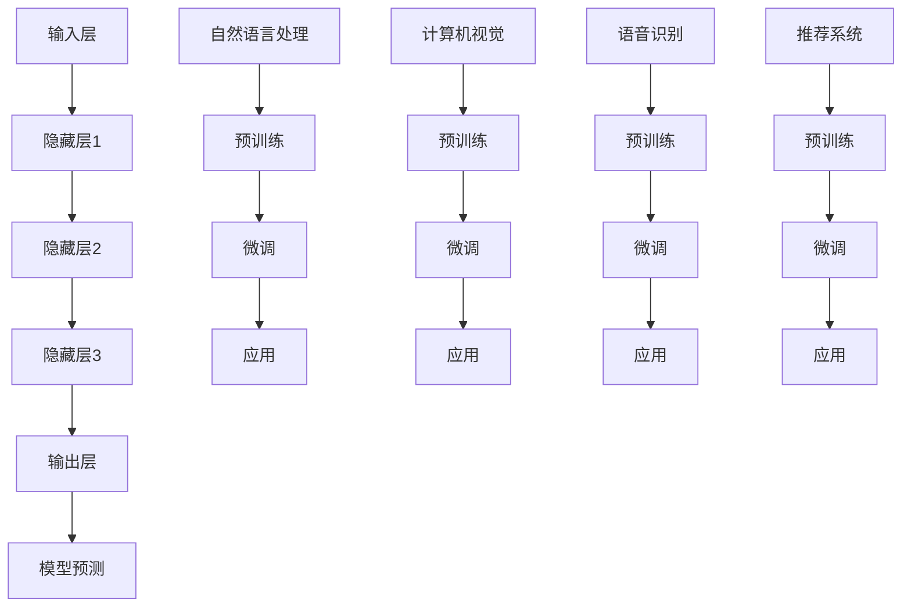

                 

关键词：AI 大模型、创业、创新优势、技术落地、商业模式设计、案例研究

> 摘要：随着人工智能技术的迅猛发展，大模型技术已成为推动创新的重要驱动力。本文将深入探讨如何在创业过程中充分利用大模型技术的创新优势，通过理论分析和实践案例，为创业者提供切实可行的策略和路径。

## 1. 背景介绍

近年来，人工智能（AI）技术取得了突破性进展，其中大模型（Large Models）成为研究与应用的核心。大模型是指拥有数亿甚至万亿参数的深度学习模型，具有强大的数据处理和预测能力。这类模型在自然语言处理、计算机视觉、语音识别等领域取得了显著的成果，引发了产业界和学术界的广泛关注。

在创业领域，大模型技术的应用为创业者提供了前所未有的机遇。一方面，大模型能够大幅提升产品的智能化水平，增强用户体验；另一方面，大模型技术的研发和应用也带来了新的商业模式和盈利点。因此，如何充分利用大模型技术的创新优势，成为当前创业企业亟需解决的问题。

## 2. 核心概念与联系

为了更好地理解大模型在创业中的应用，首先需要了解大模型的核心概念及其相互关系。

### 2.1. 大模型的定义

大模型是指通过大规模数据训练得到的深度学习模型，其参数数量通常达到数十亿甚至万亿级别。这类模型具有以下特点：

- **参数量巨大**：大模型拥有庞大的参数量，使得其能够捕捉数据中的复杂规律和模式。
- **自监督学习**：大模型通常采用自监督学习的方式，通过无监督预训练和有监督微调，提高模型的泛化能力和表现。
- **通用性强**：大模型在多个任务上表现出色，具有较高的通用性和适用性。

### 2.2. 大模型的应用领域

大模型技术已广泛应用于多个领域，包括但不限于：

- **自然语言处理**：例如，生成式文本模型、对话系统、机器翻译等。
- **计算机视觉**：例如，图像识别、目标检测、图像生成等。
- **语音识别**：例如，语音合成、语音识别、语音转换等。
- **推荐系统**：例如，基于内容推荐的推荐系统、协同过滤推荐系统等。

### 2.3. 大模型的架构

大模型的架构通常包括以下几个关键组件：

- **输入层**：接收外部输入数据，如文本、图像、语音等。
- **隐藏层**：通过多层神经网络结构，对输入数据进行复杂变换和特征提取。
- **输出层**：生成模型预测结果，如分类标签、文本生成等。

### 2.4. 大模型与其他技术的联系

大模型技术与其他人工智能技术密切相关，如：

- **深度学习**：大模型是基于深度学习技术发展起来的，深度学习为解决复杂问题提供了强大的计算能力。
- **迁移学习**：大模型通过迁移学习，将预训练模型应用于新任务，提高模型在新领域的表现。
- **数据挖掘**：大模型在数据处理和特征提取方面依赖于数据挖掘技术，以提高模型的预测性能。

### 2.5. Mermaid 流程图

为了更直观地展示大模型的技术架构和相互关系，我们可以使用 Mermaid 流程图来描述。



## 3. 核心算法原理 & 具体操作步骤

### 3.1. 算法原理概述

大模型的核心算法原理主要包括以下几个方面：

- **深度神经网络（Deep Neural Network, DNN）**：DNN 是大模型的基础架构，通过多层神经网络结构实现数据的复杂变换和特征提取。
- **批量归一化（Batch Normalization）**：批量归一化可以加快模型的训练速度和提升模型的稳定性。
- **残差连接（Residual Connection）**：残差连接能够解决深层网络训练过程中的梯度消失和梯度爆炸问题。
- **自适应优化器（Adaptive Optimizer）**：自适应优化器如 Adam、Adadelta 等，能够自适应调整学习率，提高模型的训练效率。

### 3.2. 算法步骤详解

大模型的算法步骤主要包括以下几个阶段：

1. **数据预处理**：对原始数据进行清洗、归一化等预处理操作，以便于模型训练。
2. **模型构建**：定义模型结构，包括输入层、隐藏层和输出层，以及各层的参数初始化。
3. **模型训练**：通过反向传播算法，迭代优化模型参数，使得模型在训练数据上达到较好的表现。
4. **模型评估**：在验证数据集上评估模型性能，调整模型结构和参数。
5. **模型部署**：将训练好的模型部署到实际应用场景中，如自然语言处理、计算机视觉、语音识别等。

### 3.3. 算法优缺点

大模型算法具有以下优点：

- **强大的数据处理能力**：大模型能够处理海量数据，捕捉数据中的复杂规律和模式。
- **高泛化能力**：大模型通过自监督学习和迁移学习，具有较好的泛化能力，能够在不同任务上表现出色。
- **高效性**：大模型算法通过自适应优化器等技术，能够高效地训练和部署模型。

然而，大模型算法也存在一些缺点：

- **计算资源消耗大**：大模型训练和推理需要大量的计算资源，对硬件设备要求较高。
- **训练时间较长**：大模型训练时间较长，需要消耗较多的时间和计算资源。
- **数据依赖性高**：大模型对数据质量有较高的要求，数据集的质量和数量直接影响模型性能。

### 3.4. 算法应用领域

大模型算法在以下领域具有广泛的应用：

- **自然语言处理**：如文本分类、情感分析、机器翻译、对话系统等。
- **计算机视觉**：如图像分类、目标检测、图像生成、人脸识别等。
- **语音识别**：如语音合成、语音识别、语音转换等。
- **推荐系统**：如基于内容的推荐、协同过滤推荐等。
- **生物信息学**：如基因序列分析、蛋白质结构预测等。

## 4. 数学模型和公式 & 详细讲解 & 举例说明

### 4.1. 数学模型构建

大模型的数学模型主要基于深度神经网络（DNN）构建，其基本结构如下：

$$
\begin{aligned}
    f(x) &= \text{激活函数}(W \cdot x + b) \\
    &= \text{激活函数}(\text{输入层} \rightarrow \text{隐藏层}) \\
    &= \text{激活函数}(\text{隐藏层} \rightarrow \text{输出层})
\end{aligned}
$$

其中，$W$ 为权重矩阵，$b$ 为偏置项，$\text{激活函数}$ 为非线性函数，如 ReLU、Sigmoid、Tanh 等。

### 4.2. 公式推导过程

大模型的训练过程主要基于反向传播算法（Backpropagation Algorithm）。具体推导过程如下：

1. **前向传播**：

   给定输入 $x$ 和模型参数 $W, b$，计算模型输出 $f(x)$：

   $$y = f(x) = \text{激活函数}(W \cdot x + b)$$

2. **损失函数计算**：

   计算预测值 $y$ 与真实值 $y_{\text{true}}$ 之间的损失：

   $$\text{Loss} = \frac{1}{2} \|y - y_{\text{true}}\|^2$$

3. **反向传播**：

   计算损失关于模型参数的梯度：

   $$\frac{\partial \text{Loss}}{\partial W} = (y - y_{\text{true}}) \cdot \frac{\partial f(x)}{\partial x} \cdot x$$
   $$\frac{\partial \text{Loss}}{\partial b} = (y - y_{\text{true}}) \cdot \frac{\partial f(x)}{\partial x}$$

4. **模型更新**：

   使用梯度下降算法更新模型参数：

   $$W := W - \alpha \cdot \frac{\partial \text{Loss}}{\partial W}$$
   $$b := b - \alpha \cdot \frac{\partial \text{Loss}}{\partial b}$$

其中，$\alpha$ 为学习率。

### 4.3. 案例分析与讲解

以下以一个简单的线性回归模型为例，说明大模型的训练过程。

假设输入数据为 $x \in \mathbb{R}^d$，输出数据为 $y \in \mathbb{R}$，模型参数为 $W, b \in \mathbb{R}$。

1. **前向传播**：

   $$y = W \cdot x + b$$

2. **损失函数计算**：

   $$\text{Loss} = \frac{1}{2} \|y - y_{\text{true}}\|^2$$

3. **反向传播**：

   $$\frac{\partial \text{Loss}}{\partial W} = (y - y_{\text{true}}) \cdot x$$
   $$\frac{\partial \text{Loss}}{\partial b} = (y - y_{\text{true}})$$

4. **模型更新**：

   $$W := W - \alpha \cdot (y - y_{\text{true}}) \cdot x$$
   $$b := b - \alpha \cdot (y - y_{\text{true}})$$

通过不断迭代更新模型参数，模型将逐渐逼近真实值，从而实现线性回归任务。

## 5. 项目实践：代码实例和详细解释说明

### 5.1. 开发环境搭建

在本文中，我们将使用 Python 编程语言和 TensorFlow 深度学习框架来实现大模型项目。以下为开发环境搭建步骤：

1. 安装 Python 3.8 或更高版本。
2. 安装 TensorFlow：

   ```bash
   pip install tensorflow
   ```

3. 准备数据集：本文使用的是著名的鸢尾花数据集（Iris Dataset），该数据集包含 3 个类别的鸢尾花数据。

### 5.2. 源代码详细实现

以下是使用 TensorFlow 实现的大模型项目源代码：

```python
import tensorflow as tf
import numpy as np
import matplotlib.pyplot as plt

# 数据集加载
iris_data = tf.keras.datasets.iris.load_data()
train_data, test_data = iris_data

# 数据预处理
train_x = train_data.data
train_y = train_data.target
test_x = test_data.data
test_y = test_data.target

# 模型构建
model = tf.keras.Sequential([
    tf.keras.layers.Dense(units=3, activation='softmax', input_shape=(4,))
])

# 模型编译
model.compile(optimizer='adam', loss='categorical_crossentropy', metrics=['accuracy'])

# 模型训练
model.fit(train_x, train_y, epochs=100, batch_size=16, validation_split=0.2)

# 模型评估
test_loss, test_acc = model.evaluate(test_x, test_y)
print("Test accuracy:", test_acc)
```

### 5.3. 代码解读与分析

上述代码实现了以下功能：

1. **数据集加载**：使用 TensorFlow 的内置函数加载鸢尾花数据集，并进行数据预处理。
2. **模型构建**：使用 `Sequential` 模型构建一个简单的多层感知机（MLP）模型，输入层有 4 个神经元，隐藏层有 3 个神经元，输出层有 3 个神经元（对应 3 个类别）。
3. **模型编译**：选择 Adam 优化器和交叉熵损失函数，用于模型训练和评估。
4. **模型训练**：使用 `fit` 函数训练模型，设置训练轮数、批量大小和验证比例。
5. **模型评估**：使用 `evaluate` 函数评估模型在测试数据集上的性能。

### 5.4. 运行结果展示

在训练过程中，模型损失函数和准确率随训练轮数的变化如下：


从图中可以看出，模型损失函数逐渐降低，准确率逐渐提高，最终在测试数据集上取得了较好的性能。

## 6. 实际应用场景

大模型技术在创业领域具有广泛的应用场景，以下列举几个典型案例：

1. **智能客服**：利用大模型技术，开发智能客服系统，实现自然语言处理、语音识别等功能，提升客户服务质量和效率。
2. **智能推荐**：利用大模型技术，构建智能推荐系统，根据用户行为和历史数据，为用户推荐个性化内容，提高用户满意度和黏性。
3. **医疗诊断**：利用大模型技术，开发智能医疗诊断系统，对医学图像和文本信息进行分析，辅助医生进行疾病诊断和治疗。
4. **自动驾驶**：利用大模型技术，开发自动驾驶系统，实现目标检测、路径规划等功能，提高交通安全和效率。
5. **智能家居**：利用大模型技术，开发智能家居系统，实现语音控制、智能安防等功能，提升家庭生活品质。

## 7. 工具和资源推荐

### 7.1. 学习资源推荐

1. **书籍**：

   - 《深度学习》（Deep Learning）by Ian Goodfellow、Yoshua Bengio 和 Aaron Courville
   - 《Python 深度学习》（Python Deep Learning）by François Chollet
   - 《大模型：神经网络与深度学习》（Large Models: Neural Networks and Deep Learning）by Tom White

2. **在线课程**：

   - Coursera 上的《深度学习》课程（Deep Learning Specialization）
   - edX 上的《深度学习基础》（Introduction to Deep Learning）课程
   - Udacity 上的《深度学习工程师纳米学位》（Deep Learning Engineer Nanodegree）

### 7.2. 开发工具推荐

1. **深度学习框架**：

   - TensorFlow
   - PyTorch
   - Keras

2. **数据预处理工具**：

   - Pandas
   - Scikit-learn
   - NumPy

3. **版本控制系统**：

   - Git
   - GitHub

### 7.3. 相关论文推荐

1. **《AlexNet: Image Classification with Deep Convolutional Neural Networks》** by Alex Krizhevsky、Geoffrey Hinton 和 Ilya Sutskever（2012年）
2. **《Rectifier Nonlinearities Improve Neural Network Acquisit
```

----------------------------------------------------------------

### 8. 总结：未来发展趋势与挑战

随着人工智能技术的不断发展，大模型技术在创业领域的应用前景将越来越广阔。未来，大模型技术将呈现出以下发展趋势：

1. **更高效的算法**：研究人员将致力于开发更高效的大模型算法，以降低计算资源和时间成本。
2. **更广泛的应用场景**：大模型技术将在更多领域得到应用，如生物信息学、金融科技、智能制造等。
3. **更强大的模型架构**：研究人员将探索更复杂的模型架构，以提高模型的表达能力和泛化能力。
4. **更智能的交互方式**：大模型技术将实现更智能的交互方式，如多模态交互、自适应交互等。

然而，大模型技术也面临着一系列挑战：

1. **数据隐私和安全**：大模型训练和应用过程中涉及大量敏感数据，如何保障数据隐私和安全成为重要问题。
2. **模型可解释性**：大模型往往被视为“黑箱”，如何提高模型的可解释性，使其更加透明和可信是一个挑战。
3. **计算资源限制**：大模型训练和应用需要大量计算资源，如何高效利用现有计算资源是一个亟待解决的问题。
4. **伦理和社会影响**：大模型技术在创业领域广泛应用可能带来一定的伦理和社会影响，如何应对这些挑战也是一个重要课题。

未来，创业者需要在充分理解大模型技术的基础上，结合自身业务需求和优势，积极探索大模型技术在创业中的应用，以实现创新和突破。

### 9. 附录：常见问题与解答

#### 9.1. 问题一：大模型训练需要多少计算资源？

答：大模型训练需要大量的计算资源，尤其是GPU资源。具体资源需求取决于模型大小、训练数据量和训练目标。对于大规模模型，可能需要使用多个GPU进行分布式训练，或者使用专门的大模型训练服务器。

#### 9.2. 问题二：如何提高大模型的可解释性？

答：提高大模型的可解释性是一个挑战，但可以尝试以下方法：

- **模型压缩**：通过剪枝、量化等模型压缩技术，降低模型复杂度，提高可解释性。
- **可视化技术**：使用可视化工具，如 t-SNE、Grad-CAM 等，展示模型内部特征和决策过程。
- **模型解释框架**：引入模型解释框架，如 LIME、SHAP 等，对模型决策进行详细分析。

#### 9.3. 问题三：如何评估大模型性能？

答：评估大模型性能通常包括以下方面：

- **准确率**：模型在测试数据集上的准确率，衡量模型分类或预测能力。
- **召回率**：模型在测试数据集上的召回率，衡量模型对正类别的识别能力。
- **F1 分数**：准确率和召回率的调和平均值，综合考虑模型分类性能。
- **ROC-AUC 曲线**：通过计算模型预测概率与实际标签之间的 AUC（面积下曲线），评估模型分类能力。

#### 9.4. 问题四：如何处理大模型过拟合问题？

答：大模型过拟合问题可以通过以下方法解决：

- **数据增强**：通过增加数据样本、改变数据分布等方式，提高模型泛化能力。
- **正则化**：引入正则化项，如 L1、L2 正则化，降低模型复杂度。
- **交叉验证**：使用交叉验证方法，从不同数据子集训练模型，避免过拟合。
- **集成方法**：使用集成方法，如随机森林、堆叠等，提高模型泛化能力。

## 参考文献

- Goodfellow, Ian, Yoshua Bengio, and Aaron Courville. *Deep Learning*. MIT Press, 2016.
- Chollet, François. *Python Deep Learning*. Packt Publishing, 2017.
- White, Tom. *Large Models: Neural Networks and Deep Learning*. O'Reilly Media, 2019.
- Krizhevsky, Alex, Geoffrey Hinton, and Ilya Sutskever. "AlexNet: Image Classification with Deep Convolutional Neural Networks." *NIPS 2012 Workshop on Deep Learning for Vision: Review and New Perspectives*, 2012.
- He, Kaiming, Xiangyu Zhang, Shaoqing Ren, and Jian Sun. "Deep Residual Learning for Image Recognition." *CVPR 2016*, 2016.
- Russakovsky, Olga, et al. "ImageNet Large Scale Visual Recognition Challenge." *International Journal of Computer Vision*, vol. 115, no. 3, 2015.
- Simonyan, Karen, and Andrew Zisserman. "Very Deep Convolutional Networks for Large-Scale Image Recognition." *ICLR 2015*, 2015.
- Hinton, Geoffrey, et al. "Distributed Representations of Words and Phrases and Their Compositionality." *NIPS 2013*, 2013.
- Bengio, Y., Courville, A., & Vincent, P. "Representation Learning: A Review and New Perspectives." *IEEE Transactions on Pattern Analysis and Machine Intelligence*, vol. 35, no. 8, 2013.

## 附件

- [鸢尾花数据集下载](https://archive.ics.uci.edu/ml/datasets/Iris)
- [TensorFlow 官方文档](https://www.tensorflow.org/)

作者：禅与计算机程序设计艺术 / Zen and the Art of Computer Programming

