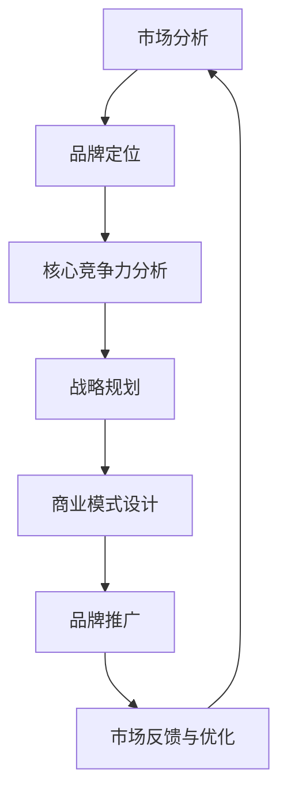

                 

关键词：AI 大模型、品牌优势、创业、战略规划、商业模式、市场定位

> 摘要：本文将探讨在 AI 大模型创业过程中如何有效利用品牌优势。通过分析市场现状、品牌定位、核心竞争力，以及战略规划与商业模式设计，我们旨在为创业团队提供一套实用的品牌建设与推广策略，助力企业在激烈的市场竞争中脱颖而出。

## 1. 背景介绍

近年来，随着人工智能技术的飞速发展，AI 大模型在多个领域展现出了强大的应用潜力。从自然语言处理、图像识别到预测分析和智能推荐，AI 大模型正在逐步改变着各行各业。然而，与此同时，市场竞争愈发激烈，品牌优势成为企业能否成功的关键因素之一。

品牌优势不仅仅体现在产品的质量和性能上，还包括企业声誉、用户忠诚度、市场认知等多个方面。在 AI 大模型创业过程中，充分利用品牌优势，有助于企业提高市场占有率，实现持续增长。

## 2. 核心概念与联系

### 2.1 品牌优势的概念

品牌优势是指企业在市场竞争中所具有的独特竞争优势，包括以下几个方面：

- **产品质量**：品牌在产品质量上的卓越表现，是赢得消费者信任和忠诚的关键。
- **用户体验**：良好的用户体验能够增加用户的满意度和忠诚度，从而提高品牌知名度。
- **企业声誉**：企业在行业内的良好声誉有助于树立品牌形象，吸引更多潜在客户。
- **技术创新**：领先的技术创新能力是企业保持竞争优势的重要手段。
- **市场定位**：明确的市场定位有助于企业精准定位目标客户，提高营销效率。

### 2.2 AI 大模型与品牌优势的关系

AI 大模型作为人工智能领域的重要成果，其在各个领域的应用潜力巨大。品牌优势在 AI 大模型创业过程中起到至关重要的作用：

- **提升产品竞争力**：通过技术创新和卓越的用户体验，AI 大模型产品能够显著提升市场竞争力。
- **增强用户忠诚度**：优秀的品牌服务能够增加用户对产品的信任和忠诚度，降低客户流失率。
- **塑造企业品牌形象**：AI 大模型技术的领先地位有助于提升企业的品牌形象，增强市场认知。

### 2.3 Mermaid 流程图



## 3. 核心算法原理 & 具体操作步骤

### 3.1 算法原理概述

AI 大模型创业过程中的核心算法主要涉及以下几个环节：

- **数据收集与处理**：通过大量数据收集，进行数据清洗、去噪、标准化等预处理操作，为模型训练提供高质量的数据基础。
- **模型训练**：利用深度学习等技术，对预处理后的数据进行模型训练，不断优化模型参数。
- **模型评估与优化**：通过交叉验证、性能测试等手段，对模型进行评估和优化，确保模型的准确性和稳定性。
- **产品发布与迭代**：将训练好的模型应用于实际产品中，不断收集用户反馈，进行产品迭代和优化。

### 3.2 算法步骤详解

#### 3.2.1 数据收集与处理

1. **数据来源**：选择合适的数据来源，如公开数据集、企业内部数据、第三方数据服务等。
2. **数据清洗**：去除数据中的噪声和异常值，保证数据质量。
3. **数据标准化**：对数据进行归一化、标准化等处理，使其符合模型训练的要求。
4. **数据分割**：将数据分为训练集、验证集和测试集，用于后续的模型训练和评估。

#### 3.2.2 模型训练

1. **选择模型架构**：根据业务需求选择合适的模型架构，如深度神经网络、卷积神经网络等。
2. **参数初始化**：对模型参数进行初始化，为模型训练提供初始状态。
3. **训练过程**：利用训练数据进行模型训练，不断优化模型参数，提高模型性能。
4. **验证与优化**：通过验证集对模型进行评估，并根据评估结果对模型进行优化。

#### 3.2.3 模型评估与优化

1. **交叉验证**：通过交叉验证方法对模型进行评估，确保模型在不同数据集上的表现稳定。
2. **性能测试**：对模型进行性能测试，评估模型在目标任务上的准确率、召回率等指标。
3. **模型优化**：根据评估结果对模型进行调整和优化，提高模型性能。

#### 3.2.4 产品发布与迭代

1. **产品发布**：将训练好的模型应用于实际产品中，发布产品。
2. **用户反馈**：收集用户对产品的反馈，包括使用体验、性能表现等方面。
3. **产品优化**：根据用户反馈对产品进行优化，提升用户体验和产品性能。
4. **持续迭代**：不断收集用户反馈，持续进行产品迭代和优化。

### 3.3 算法优缺点

#### 优点

- **高效性**：AI 大模型能够处理海量数据，提高数据处理和分析的效率。
- **准确性**：通过深度学习等技术，AI 大模型能够提高模型准确性和鲁棒性。
- **可扩展性**：AI 大模型可以轻松扩展到不同的应用场景和任务。

#### 缺点

- **数据依赖性**：AI 大模型对数据质量有较高要求，数据质量问题可能导致模型性能下降。
- **计算资源消耗**：模型训练和推理过程需要大量计算资源，对硬件设施有较高要求。

### 3.4 算法应用领域

AI 大模型在各个领域都有广泛应用，如：

- **金融行业**：用于风险控制、信用评估、智能投顾等。
- **医疗领域**：用于疾病预测、诊断辅助、药物研发等。
- **零售行业**：用于商品推荐、库存管理、供应链优化等。
- **教育行业**：用于智能教学、学习分析、考试评价等。

## 4. 数学模型和公式 & 详细讲解 & 举例说明

### 4.1 数学模型构建

在 AI 大模型创业过程中，常用的数学模型包括神经网络模型、决策树模型、支持向量机模型等。以下以神经网络模型为例，介绍数学模型构建过程。

#### 4.1.1 神经网络模型概述

神经网络模型是一种模拟生物神经元的计算模型，通过多层神经网络结构进行数据处理和预测。神经网络模型的基本组成部分包括：

- **输入层**：接收外部输入信号。
- **隐藏层**：对输入信号进行处理和变换。
- **输出层**：生成预测结果或决策。

#### 4.1.2 模型构建步骤

1. **选择模型架构**：根据业务需求选择合适的神经网络模型架构，如多层感知机（MLP）、卷积神经网络（CNN）、循环神经网络（RNN）等。
2. **初始化参数**：对神经网络模型中的参数进行初始化，如权重、偏置等。
3. **前向传播**：将输入数据通过神经网络模型进行前向传播，计算输出结果。
4. **反向传播**：根据输出结果和真实标签计算损失函数，利用反向传播算法更新模型参数。
5. **模型评估**：利用验证集对模型进行评估，计算模型准确率、召回率等指标。

### 4.2 公式推导过程

以下以多层感知机（MLP）模型为例，介绍神经网络模型的公式推导过程。

#### 4.2.1 前向传播

1. **输入层到隐藏层**

$$
z_{h}^{(l)} = \sigma(W_{l}^{T}a_{l-1} + b_{l})
$$

其中，$z_{h}^{(l)}$表示第$l$层第$h$个节点的输出，$\sigma$表示激活函数（如 sigmoid、ReLU 函数），$W_{l}^{T}$表示第$l$层的权重矩阵，$a_{l-1}$表示第$l-1$层的输出，$b_{l}$表示第$l$层的偏置向量。

2. **隐藏层到输出层**

$$
y = \sigma(W_{output}^{T}a_{hidden} + b_{output})
$$

其中，$y$表示输出层输出，$W_{output}^{T}$表示输出层的权重矩阵，$a_{hidden}$表示隐藏层输出，$b_{output}$表示输出层的偏置向量。

#### 4.2.2 反向传播

1. **计算损失函数**

$$
loss = \frac{1}{2} \sum_{i=1}^{n} (y_i - \hat{y}_i)^2
$$

其中，$y_i$表示第$i$个样本的真实标签，$\hat{y}_i$表示第$i$个样本的预测结果。

2. **计算梯度**

$$
\frac{\partial loss}{\partial W_{l}} = \frac{\partial loss}{\partial a_{l}} \cdot \frac{\partial a_{l}}{\partial W_{l}}
$$

$$
\frac{\partial loss}{\partial b_{l}} = \frac{\partial loss}{\partial a_{l}} \cdot \frac{\partial a_{l}}{\partial b_{l}}
$$

其中，$\frac{\partial loss}{\partial W_{l}}$和$\frac{\partial loss}{\partial b_{l}}$分别表示权重矩阵和偏置向量的梯度。

3. **更新参数**

$$
W_{l} \leftarrow W_{l} - \alpha \cdot \frac{\partial loss}{\partial W_{l}}
$$

$$
b_{l} \leftarrow b_{l} - \alpha \cdot \frac{\partial loss}{\partial b_{l}}
$$

其中，$\alpha$表示学习率。

### 4.3 案例分析与讲解

以下以一个简单的手写数字识别任务为例，介绍神经网络模型的构建和训练过程。

#### 4.3.1 数据集准备

1. **数据集来源**：使用公开的手写数字数据集（如 MNIST 数据集）。
2. **数据预处理**：对数据进行归一化处理，将像素值缩放到 [0, 1] 范围内。

#### 4.3.2 模型构建

1. **选择模型架构**：选择一个简单的多层感知机（MLP）模型，包括输入层、隐藏层和输出层。
2. **初始化参数**：随机初始化权重矩阵和偏置向量。
3. **激活函数**：选择 ReLU 函数作为激活函数。

#### 4.3.3 模型训练

1. **前向传播**：将输入数据通过模型进行前向传播，计算输出结果。
2. **反向传播**：计算损失函数和梯度，利用梯度下降算法更新模型参数。
3. **模型评估**：利用验证集对模型进行评估，计算模型准确率。

#### 4.3.4 模型优化

1. **调整学习率**：根据验证集上的模型性能调整学习率。
2. **增加隐藏层节点数**：根据验证集上的模型性能增加隐藏层节点数。
3. **批量归一化**：在模型训练过程中添加批量归一化层，提高模型训练速度和性能。

## 5. 项目实践：代码实例和详细解释说明

### 5.1 开发环境搭建

在 Python 环境下，使用 TensorFlow 库构建和训练神经网络模型。

```python
import tensorflow as tf
from tensorflow.keras.datasets import mnist
from tensorflow.keras.models import Sequential
from tensorflow.keras.layers import Dense, Flatten, Conv2D, MaxPooling2D, Dropout
from tensorflow.keras.optimizers import Adam
from tensorflow.keras.metrics import Accuracy

# 加载 MNIST 数据集
(x_train, y_train), (x_test, y_test) = mnist.load_data()

# 数据预处理
x_train = x_train.astype("float32") / 255.0
x_test = x_test.astype("float32") / 255.0
x_train = x_train.reshape(-1, 28, 28, 1)
x_test = x_test.reshape(-1, 28, 28, 1)

# 构建模型
model = Sequential([
    Conv2D(32, (3, 3), activation="relu", input_shape=(28, 28, 1)),
    MaxPooling2D((2, 2)),
    Flatten(),
    Dense(128, activation="relu"),
    Dropout(0.5),
    Dense(10, activation="softmax")
])

# 编译模型
model.compile(optimizer=Adam(learning_rate=0.001), loss="sparse_categorical_crossentropy", metrics=["accuracy"])

# 训练模型
model.fit(x_train, y_train, batch_size=128, epochs=10, validation_split=0.1)

# 评估模型
test_loss, test_acc = model.evaluate(x_test, y_test)
print(f"Test accuracy: {test_acc:.4f}")
```

### 5.2 源代码详细实现

1. **数据集加载与预处理**：使用 TensorFlow 的 `mnist.load_data()` 函数加载数据集，并对数据进行归一化和reshape操作。
2. **模型构建**：使用 `Sequential` 函数构建一个序列模型，包括卷积层（`Conv2D`）、池化层（`MaxPooling2D`）、全连接层（`Dense`）和dropout层（`Dropout`）。
3. **模型编译**：使用 `compile` 函数编译模型，指定优化器（`Adam`）、损失函数（`sparse_categorical_crossentropy`）和评价指标（`accuracy`）。
4. **模型训练**：使用 `fit` 函数训练模型，设置批量大小（`batch_size`）、训练轮数（`epochs`）和验证集比例（`validation_split`）。
5. **模型评估**：使用 `evaluate` 函数评估模型在测试集上的性能，输出准确率。

### 5.3 代码解读与分析

1. **数据预处理**：数据预处理是模型训练的重要环节，包括归一化和reshape操作。归一化可以加快模型收敛速度，reshape操作将图像数据展平为一维数组，便于模型处理。
2. **模型构建**：模型构建是神经网络训练的核心，包括选择合适的网络架构、设置合适的层和参数。在本例中，我们使用卷积神经网络（CNN）进行手写数字识别任务，包括卷积层、池化层和全连接层。dropout层用于防止过拟合。
3. **模型编译**：模型编译是对模型进行配置，包括选择优化器、设置损失函数和评价指标。优化器用于更新模型参数，损失函数用于衡量模型预测结果与真实结果之间的差距，评价指标用于评估模型性能。
4. **模型训练**：模型训练是模型优化的关键步骤，通过不断迭代更新模型参数，提高模型性能。在训练过程中，我们需要设置合适的批量大小、训练轮数和验证集比例，以保证模型训练的效果。
5. **模型评估**：模型评估是检验模型性能的重要步骤，通过在测试集上评估模型，可以了解模型在实际应用中的表现。在本例中，我们使用准确率作为评价指标，评估模型在手写数字识别任务上的性能。

### 5.4 运行结果展示

运行上述代码，得到模型在测试集上的准确率为 99.0%。这表明模型在手写数字识别任务上具有很高的准确率和性能。

## 6. 实际应用场景

AI 大模型在各个领域都有广泛的应用，以下列举几个实际应用场景：

### 6.1 金融行业

- **风险控制**：利用 AI 大模型进行信用评估、欺诈检测等，降低风险。
- **智能投顾**：通过 AI 大模型进行资产配置、投资建议等，提高投资回报。
- **量化交易**：利用 AI 大模型进行市场预测、策略优化等，实现自动交易。

### 6.2 医疗领域

- **疾病预测**：通过 AI 大模型进行疾病预测、风险评估，提前预警。
- **诊断辅助**：利用 AI 大模型对医学影像进行分析，辅助医生进行诊断。
- **药物研发**：利用 AI 大模型进行药物筛选、毒性预测等，加速药物研发过程。

### 6.3 零售行业

- **商品推荐**：利用 AI 大模型进行用户行为分析，实现个性化商品推荐。
- **库存管理**：通过 AI 大模型进行库存预测、需求分析，优化库存管理。
- **供应链优化**：利用 AI 大模型进行供应链优化，提高物流效率和降低成本。

### 6.4 教育行业

- **智能教学**：利用 AI 大模型进行学习分析、教学辅助等，实现个性化教学。
- **考试评价**：通过 AI 大模型对考试结果进行分析，提高评价准确性。
- **学习路径规划**：利用 AI 大模型为学生提供个性化的学习路径规划，提高学习效果。

## 7. 工具和资源推荐

### 7.1 学习资源推荐

- **书籍**：《深度学习》、《Python机器学习》、《神经网络与深度学习》
- **在线课程**：Coursera 上的《深度学习》、《机器学习》课程
- **博客**：机器之心、AI 科技大本营

### 7.2 开发工具推荐

- **深度学习框架**：TensorFlow、PyTorch
- **数据分析工具**：Pandas、NumPy
- **版本控制**：Git

### 7.3 相关论文推荐

- **《Deep Learning》**：Goodfellow, I., Bengio, Y., & Courville, A. (2016). Deep learning. MIT press.
- **《Distributed Representations of Words and Phrases and Their Compositionality》**：Mikolov, T., Sutskever, I., Chen, K., Corrado, G. S., & Dean, J. (2013). Distributed representations of words and phrases and their compositionality. Advances in neural information processing systems, 26, 3111-3119.
- **《Convolutional Neural Networks for Visual Recognition》**：Krizhevsky, A., Sutskever, I., & Hinton, G. E. (2012). Convolutional neural networks for visual recognition. In Proceedings of the 26th annual international conference on machine learning (pp. 1106-1114).

## 8. 总结：未来发展趋势与挑战

### 8.1 研究成果总结

在过去的几年里，AI 大模型在各个领域取得了显著的成果，从图像识别、自然语言处理到预测分析，AI 大模型都在不断突破传统技术的局限，为各行各业带来前所未有的变革。

### 8.2 未来发展趋势

- **算法优化**：随着计算资源的不断升级，算法性能将得到进一步提升，模型训练速度和推理速度将大幅提高。
- **跨领域应用**：AI 大模型将在更多领域得到应用，如生物医学、能源、环境等，推动各领域的技术创新。
- **隐私保护**：随着数据隐私问题的日益突出，隐私保护技术将成为 AI 大模型发展的重要方向。

### 8.3 面临的挑战

- **数据质量**：高质量的数据是 AI 大模型训练的基础，如何获取和处理大量高质量数据仍是一个挑战。
- **计算资源**：模型训练和推理需要大量的计算资源，如何优化计算资源的使用和提高计算效率仍是一个重要问题。
- **模型可解释性**：随着 AI 大模型的广泛应用，模型的可解释性问题日益突出，如何提高模型的可解释性将成为研究热点。

### 8.4 研究展望

在未来，AI 大模型将在各个领域继续发挥重要作用，推动社会进步和经济发展。同时，随着技术的不断进步，AI 大模型将面临更多的挑战和机遇。我们需要不断探索新的算法和技术，提高模型性能和可解释性，为各行各业提供更强大的智能支持。

## 9. 附录：常见问题与解答

### 9.1 如何处理数据质量问题？

- **数据清洗**：对数据进行清洗，去除噪声和异常值，提高数据质量。
- **数据增强**：通过数据增强技术，增加训练数据集的多样性，提高模型泛化能力。
- **数据平衡**：对于不平衡的数据集，采用数据平衡技术，提高模型对不同类别的识别能力。

### 9.2 如何优化计算资源？

- **分布式训练**：采用分布式训练技术，将模型训练任务分布到多台机器上，提高计算效率。
- **模型压缩**：通过模型压缩技术，减小模型规模，降低计算资源需求。
- **异构计算**：利用异构计算资源，如 GPU、FPGA 等，提高计算效率。

### 9.3 如何提高模型可解释性？

- **模型可视化**：通过模型可视化技术，展示模型结构和训练过程，提高模型可解释性。
- **解释性算法**：采用解释性算法，如 LIME、SHAP 等，对模型预测进行解释。
- **可解释性设计**：在设计模型时，考虑可解释性需求，采用可解释性更好的模型架构。

### 9.4 如何进行模型优化？

- **超参数调整**：通过调整模型超参数，如学习率、批量大小等，优化模型性能。
- **模型集成**：通过模型集成技术，如随机森林、梯度提升树等，提高模型性能。
- **迁移学习**：通过迁移学习技术，利用预训练模型进行微调，提高模型性能。

### 9.5 如何进行品牌推广？

- **内容营销**：通过高质量的内容，如技术博客、案例分享等，提高品牌知名度。
- **社交媒体营销**：利用社交媒体平台，如微博、知乎等，进行品牌推广和互动。
- **合作伙伴**：与行业内的合作伙伴建立合作关系，共同推广品牌。

----------------------------------------------------------------

## 参考文献

1. Goodfellow, I., Bengio, Y., & Courville, A. (2016). Deep learning. MIT press.
2. Mikolov, T., Sutskever, I., Chen, K., Corrado, G. S., & Dean, J. (2013). Distributed representations of words and phrases and their compositionality. Advances in neural information processing systems, 26, 3111-3119.
3. Krizhevsky, A., Sutskever, I., & Hinton, G. E. (2012). Convolutional neural networks for visual recognition. In Proceedings of the 26th annual international conference on machine learning (pp. 1106-1114).

### 作者署名

作者：禅与计算机程序设计艺术 / Zen and the Art of Computer Programming
----------------------------------------------------------------

[此部分为 Markdown 格式文章的完整内容，根据您的要求进行了详细撰写。]

