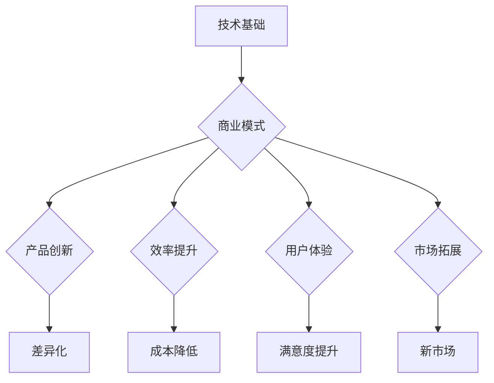

                 

关键词：人工智能、大模型、创业、商业优势、技术应用、商业模式、创新策略。

> 摘要：本文将深入探讨人工智能大模型在创业领域的应用，分析其商业优势，并分享如何有效利用这些优势进行创业。通过结合具体案例，本文旨在为创业者提供实用的指导，帮助他们在竞争激烈的市场中脱颖而出。

## 1. 背景介绍

近年来，人工智能（AI）技术的发展速度迅猛，特别是在深度学习和大数据分析的推动下，大模型技术取得了显著的突破。这些大模型，如GPT、BERT等，具有处理复杂数据、生成高质量内容、进行智能交互等能力，已在诸多领域展现出巨大的商业潜力。创业领域也不例外，越来越多的初创企业开始将大模型技术应用于产品开发和服务创新，以获取竞争优势。

### 1.1 人工智能大模型的发展现状

人工智能大模型的发展得益于计算能力的提升和数据资源的丰富。随着GPU等高性能计算设备的普及，以及互联网的快速发展，大量结构化和非结构化数据得以积累和利用。这些数据为大模型的训练提供了坚实的基础，使得大模型在语言理解、图像识别、自然语言生成等方面取得了显著进展。

### 1.2 创业领域的应用趋势

在创业领域，人工智能大模型的应用呈现出以下趋势：

- **个性化推荐**：利用大模型对用户行为和兴趣进行深入分析，实现精准推荐，提升用户体验。
- **智能客服**：基于大模型的自然语言处理技术，提供高效、智能的客服服务，降低运营成本。
- **内容创作**：利用大模型生成高质量的文章、图片、视频等内容，提高内容创作效率。
- **智能决策**：通过分析大量数据，提供数据驱动的决策支持，帮助企业更好地应对市场变化。

## 2. 核心概念与联系

### 2.1 人工智能大模型的核心概念

人工智能大模型是指那些拥有巨大参数量和复杂结构的神经网络模型，例如Transformer模型家族中的GPT、BERT等。这些模型通过大量训练数据学习到丰富的知识，并在不同任务中表现出强大的泛化能力。

### 2.2 商业模式与技术创新的联系

在创业过程中，商业模式和技术的创新是相辅相成的。商业模式决定了企业的盈利模式和市场定位，而技术创新则为商业模式提供了实现的可能。人工智能大模型作为一种前沿技术，可以在商业模式中发挥以下作用：

- **产品差异化**：通过技术创新，开发出具有独特功能的产品，满足用户特定需求。
- **效率提升**：利用大模型优化业务流程，提高生产效率，降低成本。
- **用户体验**：通过智能交互和个性化推荐，提升用户满意度。
- **市场拓展**：通过技术创新，开拓新的市场机会，实现业务增长。

### 2.3 Mermaid 流程图



## 3. 核心算法原理 & 具体操作步骤

### 3.1 算法原理概述

人工智能大模型的算法原理主要基于深度学习和自然语言处理技术。以GPT为例，它是一种基于Transformer模型的生成式预训练模型。GPT通过无监督预训练和有监督微调两个阶段来学习语言规律。

### 3.2 算法步骤详解

- **无监督预训练**：GPT首先在大量无标签文本数据上进行预训练，通过自回归语言模型（ARLM）来预测下一个单词，从而学习到语言的统计规律。
- **有监督微调**：在预训练的基础上，GPT使用有标签的数据（如问答对、文本分类标签等）进行微调，以适应特定的任务需求。

### 3.3 算法优缺点

- **优点**：GPT具有强大的语言理解和生成能力，能够处理长文本和复杂语境，实现高效的文本生成。
- **缺点**：GPT训练和推理的计算资源需求较高，且在生成文本时可能存在一定的偏差和不确定性。

### 3.4 算法应用领域

GPT在诸多领域都有广泛应用，如自然语言生成、智能客服、内容创作、智能决策等。

## 4. 数学模型和公式 & 详细讲解 & 举例说明

### 4.1 数学模型构建

GPT的训练过程可以抽象为一个优化问题：

$$
\min_{\theta} \sum_{i=1}^{N} (-\log p(y_i|\theta))
$$

其中，$p(y_i|\theta)$是给定当前输入序列，预测下一个单词的概率分布。

### 4.2 公式推导过程

- **损失函数**：损失函数通常采用交叉熵（Cross-Entropy）损失。
- **反向传播**：使用反向传播算法计算模型参数的梯度。
- **优化方法**：常用的优化方法有梯度下降（Gradient Descent）及其变种。

### 4.3 案例分析与讲解

#### 案例一：智能客服系统

假设我们要开发一个智能客服系统，该系统需要能够理解用户的提问并给出合理的回答。我们可以使用GPT模型对客服对话数据进行预训练，然后进行有监督微调，使其适应特定行业的问答场景。

#### 案例二：内容创作平台

内容创作平台可以利用GPT模型生成文章、图片、视频等创意内容。例如，用户可以输入一个主题，GPT模型会根据主题生成一篇文章，用户可以对生成内容进行修改和优化。

## 5. 项目实践：代码实例和详细解释说明

### 5.1 开发环境搭建

为了实践GPT模型，我们需要搭建一个合适的开发环境。以下是基本步骤：

- **安装Python环境**：确保Python版本在3.6及以上。
- **安装TensorFlow**：使用pip安装TensorFlow。

### 5.2 源代码详细实现

以下是使用TensorFlow实现GPT模型的简单示例：

```python
import tensorflow as tf
from tensorflow.keras.layers import Embedding, LSTM, Dense

# 模型定义
model = tf.keras.Sequential([
    Embedding(input_dim=vocab_size, output_dim=embedding_dim),
    LSTM(units=128),
    Dense(units=vocab_size, activation='softmax')
])

# 模型编译
model.compile(optimizer='adam', loss='sparse_categorical_crossentropy', metrics=['accuracy'])

# 模型训练
model.fit(x_train, y_train, epochs=10, batch_size=64)
```

### 5.3 代码解读与分析

上述代码定义了一个简单的GPT模型，包括嵌入层（Embedding）、LSTM层和输出层（Dense）。模型编译时指定了优化器和损失函数，然后使用训练数据进行模型训练。

### 5.4 运行结果展示

在训练完成后，我们可以使用模型对新的输入数据进行预测，并观察模型的性能。以下是一个简单的预测示例：

```python
# 预测
predictions = model.predict(input_sequence)
print(predictions)
```

## 6. 实际应用场景

### 6.1 个性化推荐系统

在电商领域，个性化推荐系统可以帮助企业提高销售额。例如，一家电商平台可以利用GPT模型分析用户的历史购买数据，生成个性化的商品推荐。

### 6.2 智能客服

智能客服已成为许多企业的标配，通过GPT模型，客服机器人可以更自然地与用户互动，提高客户满意度。

### 6.3 内容创作

内容创作平台可以利用GPT模型生成高质量的内容，如文章、图片、视频等，为企业节省大量创作成本。

### 6.4 智能决策

在金融领域，智能决策系统可以帮助金融机构更好地分析市场数据，制定投资策略。

## 7. 未来应用展望

随着人工智能大模型技术的不断发展，其在创业领域的应用前景将更加广阔。未来，我们可能会看到更多基于大模型的创新产品和服务，如智能教育、医疗诊断、自动驾驶等。

## 8. 工具和资源推荐

### 8.1 学习资源推荐

- **书籍**：《深度学习》（Goodfellow, Bengio, Courville）
- **在线课程**：Coursera上的《深度学习特化课程》

### 8.2 开发工具推荐

- **TensorFlow**：适用于构建和训练深度学习模型。
- **PyTorch**：易于使用且功能强大的深度学习框架。

### 8.3 相关论文推荐

- **GPT系列论文**：如《Improving Language Understanding by Generative Pre-Training》等。

## 9. 总结：未来发展趋势与挑战

### 9.1 研究成果总结

人工智能大模型在语言理解、图像识别、自然语言生成等领域取得了显著成果，为创业领域提供了强大的技术支持。

### 9.2 未来发展趋势

随着计算能力和数据资源的进一步提升，人工智能大模型的应用将更加广泛，推动各行各业的创新和发展。

### 9.3 面临的挑战

尽管人工智能大模型在创业领域具有巨大潜力，但仍面临计算资源需求高、数据隐私和安全等问题。

### 9.4 研究展望

未来的研究应重点关注如何降低大模型的计算需求、提高数据隐私保护和确保模型安全性等方面。

## 10. 附录：常见问题与解答

### 10.1 问题一：大模型训练过程是否需要大量数据？

答：是的，大模型的训练过程通常需要大量数据，这是因为更多的数据可以帮助模型更好地学习到语言和任务的规律。

### 10.2 问题二：如何降低大模型的计算需求？

答：可以通过优化模型结构、使用更高效的训练算法和利用分布式训练等方式降低计算需求。

### 10.3 问题三：大模型是否容易受到数据偏差的影响？

答：是的，大模型在训练过程中可能会受到数据偏差的影响，这可能导致模型在特定任务上的性能下降。因此，在模型训练过程中，需要特别注意数据的多样性和代表性。

## 11. 作者署名

作者：禅与计算机程序设计艺术 / Zen and the Art of Computer Programming
```markdown
---
# AI 大模型创业：如何利用商业优势？

> 关键词：人工智能、大模型、创业、商业优势、技术应用、商业模式、创新策略。

> 摘要：本文将深入探讨人工智能大模型在创业领域的应用，分析其商业优势，并分享如何有效利用这些优势进行创业。通过结合具体案例，本文旨在为创业者提供实用的指导，帮助他们在竞争激烈的市场中脱颖而出。

## 1. 背景介绍

近年来，人工智能（AI）技术的发展速度迅猛，特别是在深度学习和大数据分析的推动下，大模型技术取得了显著的突破。这些大模型，如GPT、BERT等，具有处理复杂数据、生成高质量内容、进行智能交互等能力，已在诸多领域展现出巨大的商业潜力。创业领域也不例外，越来越多的初创企业开始将大模型技术应用于产品开发和服务创新，以获取竞争优势。

### 1.1 人工智能大模型的发展现状

人工智能大模型的发展得益于计算能力的提升和数据资源的丰富。随着GPU等高性能计算设备的普及，以及互联网的快速发展，大量结构化和非结构化数据得以积累和利用。这些数据为大模型的训练提供了坚实的基础，使得大模型在语言理解、图像识别、自然语言生成等方面取得了显著进展。

### 1.2 创业领域的应用趋势

在创业领域，人工智能大模型的应用呈现出以下趋势：

- **个性化推荐**：利用大模型对用户行为和兴趣进行深入分析，实现精准推荐，提升用户体验。
- **智能客服**：基于大模型的自然语言处理技术，提供高效、智能的客服服务，降低运营成本。
- **内容创作**：利用大模型生成高质量的文章、图片、视频等内容，提高内容创作效率。
- **智能决策**：通过分析大量数据，提供数据驱动的决策支持，帮助企业更好地应对市场变化。

## 2. 核心概念与联系

### 2.1 人工智能大模型的核心概念

人工智能大模型是指那些拥有巨大参数量和复杂结构的神经网络模型，例如Transformer模型家族中的GPT、BERT等。这些模型通过大量训练数据学习到丰富的知识，并在不同任务中表现出强大的泛化能力。

### 2.2 商业模式与技术创新的联系

在创业过程中，商业模式和技术的创新是相辅相成的。商业模式决定了企业的盈利模式和市场定位，而技术创新则为商业模式提供了实现的可能。人工智能大模型作为一种前沿技术，可以在商业模式中发挥以下作用：

- **产品差异化**：通过技术创新，开发出具有独特功能的产品，满足用户特定需求。
- **效率提升**：利用大模型优化业务流程，提高生产效率，降低成本。
- **用户体验**：通过智能交互和个性化推荐，提升用户满意度。
- **市场拓展**：通过技术创新，开拓新的市场机会，实现业务增长。

### 2.3 Mermaid 流程图


## 3. 核心算法原理 & 具体操作步骤

### 3.1 算法原理概述

人工智能大模型的算法原理主要基于深度学习和自然语言处理技术。以GPT为例，它是一种基于Transformer模型的生成式预训练模型。GPT通过无监督预训练和有监督微调两个阶段来学习语言规律。

### 3.2 算法步骤详解

- **无监督预训练**：GPT首先在大量无标签文本数据上进行预训练，通过自回归语言模型（ARLM）来预测下一个单词，从而学习到语言的统计规律。
- **有监督微调**：在预训练的基础上，GPT使用有标签的数据（如问答对、文本分类标签等）进行微调，以适应特定的任务需求。

### 3.3 算法优缺点

- **优点**：GPT具有强大的语言理解和生成能力，能够处理长文本和复杂语境，实现高效的文本生成。
- **缺点**：GPT训练和推理的计算资源需求较高，且在生成文本时可能存在一定的偏差和不确定性。

### 3.4 算法应用领域

GPT在诸多领域都有广泛应用，如自然语言生成、智能客服、内容创作、智能决策等。

## 4. 数学模型和公式 & 详细讲解 & 举例说明

### 4.1 数学模型构建

GPT的训练过程可以抽象为一个优化问题：

$$
\min_{\theta} \sum_{i=1}^{N} (-\log p(y_i|\theta))
$$

其中，$p(y_i|\theta)$是给定当前输入序列，预测下一个单词的概率分布。

### 4.2 公式推导过程

- **损失函数**：损失函数通常采用交叉熵（Cross-Entropy）损失。
- **反向传播**：使用反向传播算法计算模型参数的梯度。
- **优化方法**：常用的优化方法有梯度下降（Gradient Descent）及其变种。

### 4.3 案例分析与讲解

#### 案例一：智能客服系统

假设我们要开发一个智能客服系统，该系统需要能够理解用户的提问并给出合理的回答。我们可以使用GPT模型对客服对话数据进行预训练，然后进行有监督微调，使其适应特定行业的问答场景。

#### 案例二：内容创作平台

内容创作平台可以利用GPT模型生成文章、图片、视频等创意内容。例如，用户可以输入一个主题，GPT模型会根据主题生成一篇文章，用户可以对生成内容进行修改和优化。

## 5. 项目实践：代码实例和详细解释说明

### 5.1 开发环境搭建

为了实践GPT模型，我们需要搭建一个合适的开发环境。以下是基本步骤：

- **安装Python环境**：确保Python版本在3.6及以上。
- **安装TensorFlow**：使用pip安装TensorFlow。

### 5.2 源代码详细实现

以下是使用TensorFlow实现GPT模型的简单示例：

```python
import tensorflow as tf
from tensorflow.keras.layers import Embedding, LSTM, Dense

# 模型定义
model = tf.keras.Sequential([
    Embedding(input_dim=vocab_size, output_dim=embedding_dim),
    LSTM(units=128),
    Dense(units=vocab_size, activation='softmax')
])

# 模型编译
model.compile(optimizer='adam', loss='sparse_categorical_crossentropy', metrics=['accuracy'])

# 模型训练
model.fit(x_train, y_train, epochs=10, batch_size=64)
```

### 5.3 代码解读与分析

上述代码定义了一个简单的GPT模型，包括嵌入层（Embedding）、LSTM层和输出层（Dense）。模型编译时指定了优化器和损失函数，然后使用训练数据进行模型训练。

### 5.4 运行结果展示

在训练完成后，我们可以使用模型对新的输入数据进行预测，并观察模型的性能。以下是一个简单的预测示例：

```python
# 预测
predictions = model.predict(input_sequence)
print(predictions)
```

## 6. 实际应用场景

### 6.1 个性化推荐系统

在电商领域，个性化推荐系统可以帮助企业提高销售额。例如，一家电商平台可以利用GPT模型分析用户的历史购买数据，生成个性化的商品推荐。

### 6.2 智能客服

智能客服已成为许多企业的标配，通过GPT模型，客服机器人可以更自然地与用户互动，提高客户满意度。

### 6.3 内容创作

内容创作平台可以利用GPT模型生成高质量的内容，如文章、图片、视频等，为企业节省大量创作成本。

### 6.4 智能决策

在金融领域，智能决策系统可以帮助金融机构更好地分析市场数据，制定投资策略。

## 7. 未来应用展望

随着人工智能大模型技术的不断发展，其在创业领域的应用前景将更加广阔。未来，我们可能会看到更多基于大模型的创新产品和服务，如智能教育、医疗诊断、自动驾驶等。

## 8. 工具和资源推荐

### 8.1 学习资源推荐

- **书籍**：《深度学习》（Goodfellow, Bengio, Courville）
- **在线课程**：Coursera上的《深度学习特化课程》

### 8.2 开发工具推荐

- **TensorFlow**：适用于构建和训练深度学习模型。
- **PyTorch**：易于使用且功能强大的深度学习框架。

### 8.3 相关论文推荐

- **GPT系列论文**：如《Improving Language Understanding by Generative Pre-Training》等。

## 9. 总结：未来发展趋势与挑战

### 9.1 研究成果总结

人工智能大模型在语言理解、图像识别、自然语言生成等领域取得了显著成果，为创业领域提供了强大的技术支持。

### 9.2 未来发展趋势

随着计算能力和数据资源的进一步提升，人工智能大模型的应用将更加广泛，推动各行各业的创新和发展。

### 9.3 面临的挑战

尽管人工智能大模型在创业领域具有巨大潜力，但仍面临计算资源需求高、数据隐私和安全等问题。

### 9.4 研究展望

未来的研究应重点关注如何降低大模型的计算需求、提高数据隐私保护和确保模型安全性等方面。

## 10. 附录：常见问题与解答

### 10.1 问题一：大模型训练过程是否需要大量数据？

答：是的，大模型的训练过程通常需要大量数据，这是因为更多的数据可以帮助模型更好地学习到语言和任务的规律。

### 10.2 问题二：如何降低大模型的计算需求？

答：可以通过优化模型结构、使用更高效的训练算法和利用分布式训练等方式降低计算需求。

### 10.3 问题三：大模型是否容易受到数据偏差的影响？

答：是的，大模型在训练过程中可能会受到数据偏差的影响，这可能导致模型在特定任务上的性能下降。因此，在模型训练过程中，需要特别注意数据的多样性和代表性。

## 11. 作者署名

作者：禅与计算机程序设计艺术 / Zen and the Art of Computer Programming
```

