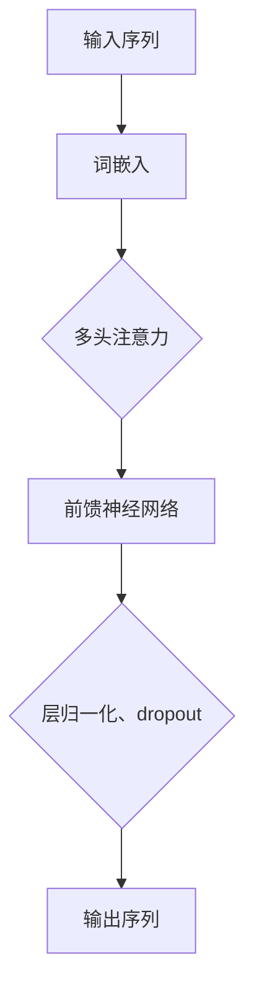

                 

在当今飞速发展的科技时代，人工智能（AI）已经成为引领创新和推动商业变革的核心驱动力。特别是大模型（Large Models），如GPT-3、BERT等，凭借其强大的处理能力和深度学习能力，正在各行各业中产生深远影响。随着AI大模型的不断成熟，越来越多的创业公司开始意识到其商业潜力和应用价值。然而，如何将AI大模型的优势转化为实际的商业成功，成为了一个值得深入探讨的问题。

## 关键词

- AI 大模型
- 创业
- 商业优势
- 技术创新
- 数据驱动
- 应用场景
- 风险管理
- 未来展望

## 摘要

本文将探讨AI大模型在创业中的商业优势及其实现路径。通过分析AI大模型的技术特点和应用场景，我们提出了几条实用的创业策略，包括技术创新、数据驱动、应用场景扩展等。同时，本文也将探讨AI大模型创业过程中可能面临的风险和挑战，并给出相应的应对建议。最终，本文将展望AI大模型在未来商业领域的广阔前景，为创业者提供有价值的参考。

## 1. 背景介绍

### AI大模型的发展历程

人工智能的概念自1950年代首次提出以来，经历了多个阶段的发展。从最初的符号推理，到基于规则的专家系统，再到基于数据的机器学习，以及如今基于深度学习的大模型，AI技术不断演进，性能和适用范围也大幅提升。特别是近年来，随着计算能力、算法优化和海量数据的积累，AI大模型如雨后春笋般涌现。

最早的大模型可以追溯到2013年，当谷歌的Neural Network Translation（NNTrans）系统在机器翻译任务中表现出色，其基础是一个拥有数亿参数的语言模型。随后，2018年，谷歌发布了Transformer架构，使得AI大模型在自然语言处理（NLP）领域取得了革命性的突破。BERT、GPT-3等后续模型进一步提升了AI大模型的性能和应用范围，使得其在图像识别、语音识别、文本生成等多个领域都取得了显著成果。

### 大模型的技术特点

AI大模型具有以下几个显著的技术特点：

- **参数规模巨大**：大模型通常拥有数亿至数十亿个参数，这使得它们能够捕捉到大量复杂的关系和模式。
- **深度学习架构**：基于深度学习，尤其是Transformer架构，大模型具有强大的表示和学习能力。
- **端到端学习**：大模型能够直接从原始数据中学习，无需手工构建复杂的特征工程。
- **泛化能力**：通过在海量数据上训练，大模型具有较好的泛化能力，能够适应不同的任务和应用场景。

### 大模型的应用场景

AI大模型在多个领域展现出强大的应用潜力：

- **自然语言处理（NLP）**：文本生成、机器翻译、情感分析、问答系统等。
- **计算机视觉**：图像识别、图像生成、图像增强等。
- **语音识别与生成**：语音到文本转换、语音合成等。
- **推荐系统**：个性化推荐、商品推荐等。
- **游戏AI**：智能游戏对手、游戏生成等。

## 2. 核心概念与联系

### 大模型原理与架构

大模型的核心在于其深度学习架构，特别是Transformer架构。Transformer通过自注意力机制（Self-Attention）和多头注意力（Multi-Head Attention）实现了对输入数据的全局理解和关联。



### 大模型训练过程

大模型的训练过程主要包括以下几个步骤：

1. **数据预处理**：对原始数据进行清洗、编码，转化为模型可处理的格式。
2. **模型初始化**：初始化模型参数。
3. **前向传播**：将输入数据传递给模型，计算输出。
4. **计算损失**：通过损失函数（如交叉熵）计算预测结果与真实结果之间的差距。
5. **反向传播**：更新模型参数，减少损失。
6. **迭代训练**：重复以上步骤，直到模型收敛。

### 大模型的优势与局限

**优势**：

- **强大的表示能力**：大模型能够捕捉到输入数据的深层特征和复杂关系。
- **端到端学习**：简化了模型开发过程，提高了开发效率。
- **自适应性强**：通过大量数据训练，大模型能够适应不同的任务和应用场景。

**局限**：

- **数据需求高**：大模型通常需要大量高质量的数据进行训练。
- **计算资源需求大**：大模型训练和推理过程需要大量的计算资源。
- **可解释性差**：大模型的决策过程往往难以解释，增加了应用难度。

## 3. 核心算法原理 & 具体操作步骤

### 3.1 算法原理概述

AI大模型的算法原理主要基于深度学习和Transformer架构。Transformer架构通过自注意力机制（Self-Attention）和多头注意力（Multi-Head Attention）实现了对输入数据的全局理解和关联。

### 3.2 算法步骤详解

1. **输入序列处理**：将输入序列（如文本、图像等）进行编码，转化为模型可处理的格式。
2. **词嵌入（Word Embedding）**：将输入序列中的每个词映射为一个向量。
3. **多头注意力（Multi-Head Attention）**：对输入序列进行多次注意力机制计算，实现全局理解和关联。
4. **前馈神经网络（Feedforward Neural Network）**：对注意力机制的结果进行非线性变换。
5. **层归一化（Layer Normalization）和Dropout**：防止过拟合，提高模型泛化能力。
6. **输出层**：通过输出层得到最终预测结果。

### 3.3 算法优缺点

**优点**：

- **强大的表示能力**：能够捕捉到输入数据的深层特征和复杂关系。
- **端到端学习**：简化了模型开发过程，提高了开发效率。
- **自适应性强**：通过大量数据训练，能够适应不同的任务和应用场景。

**缺点**：

- **数据需求高**：需要大量高质量的数据进行训练。
- **计算资源需求大**：训练和推理过程需要大量的计算资源。
- **可解释性差**：决策过程难以解释，增加了应用难度。

### 3.4 算法应用领域

AI大模型在多个领域展现出强大的应用潜力，如自然语言处理、计算机视觉、语音识别与生成、推荐系统、游戏AI等。

## 4. 数学模型和公式 & 详细讲解 & 举例说明

### 4.1 数学模型构建

AI大模型的核心在于其深度学习架构，特别是Transformer架构。以下为Transformer模型的主要数学公式：

$$
\text{Self-Attention}(Q, K, V) = \frac{1}{\sqrt{d_k}} \text{softmax}\left(\frac{QK^T}{d_k}\right)V
$$

其中，Q、K、V分别为查询向量、键向量和值向量，d_k为键向量的维度。

### 4.2 公式推导过程

1. **输入序列编码**：将输入序列编码为词嵌入向量。
2. **多头注意力**：对输入序列进行多次注意力机制计算，实现全局理解和关联。
3. **前馈神经网络**：对注意力机制的结果进行非线性变换。
4. **层归一化**：防止过拟合，提高模型泛化能力。
5. **输出层**：通过输出层得到最终预测结果。

### 4.3 案例分析与讲解

假设我们有一个文本序列 "The quick brown fox jumps over the lazy dog"，我们可以通过以下步骤对其进行编码和处理：

1. **词嵌入**：将文本中的每个词映射为一个向量。
2. **多头注意力**：对输入序列进行多次注意力机制计算，实现全局理解和关联。
3. **前馈神经网络**：对注意力机制的结果进行非线性变换。
4. **输出层**：通过输出层得到最终预测结果。

通过这个例子，我们可以看到AI大模型是如何将原始文本序列转化为具有语义信息的向量表示，从而实现复杂的文本处理任务。

## 5. 项目实践：代码实例和详细解释说明

### 5.1 开发环境搭建

为了实现AI大模型的训练和应用，我们需要搭建一个合适的开发环境。以下为Python环境搭建的步骤：

1. **安装Python**：确保安装Python 3.7及以上版本。
2. **安装TensorFlow**：通过pip命令安装TensorFlow。
   ```bash
   pip install tensorflow
   ```
3. **安装其他依赖**：安装其他必要的库，如NumPy、Pandas等。

### 5.2 源代码详细实现

以下是一个简单的AI大模型训练和预测的Python代码示例：

```python
import tensorflow as tf
from tensorflow.keras.layers import Embedding, LSTM, Dense

# 定义模型
model = tf.keras.Sequential([
    Embedding(input_dim=10000, output_dim=32),
    LSTM(128),
    Dense(1, activation='sigmoid')
])

# 编译模型
model.compile(optimizer='adam', loss='binary_crossentropy', metrics=['accuracy'])

# 加载数据
(x_train, y_train), (x_test, y_test) = tf.keras.datasets.mnist.load_data()

# 预处理数据
x_train = x_train.astype('float32') / 255
x_test = x_test.astype('float32') / 255
x_train = x_train.reshape((x_train.shape[0], x_train.shape[1], 1))
x_test = x_test.reshape((x_test.shape[0], x_test.shape[1], 1))

# 训练模型
model.fit(x_train, y_train, epochs=10, batch_size=32, validation_data=(x_test, y_test))
```

### 5.3 代码解读与分析

1. **模型定义**：我们使用TensorFlow的`Sequential`模型，添加了一个嵌入层、一个LSTM层和一个输出层。
2. **编译模型**：我们使用`compile`方法配置了优化器、损失函数和评估指标。
3. **加载数据**：我们使用TensorFlow内置的MNIST数据集，并将其转换为模型可处理的格式。
4. **预处理数据**：我们对数据进行归一化和重塑，以便于模型处理。
5. **训练模型**：我们使用`fit`方法对模型进行训练，并在验证集上进行评估。

### 5.4 运行结果展示

在完成模型训练后，我们可以在测试集上评估模型的性能：

```python
test_loss, test_acc = model.evaluate(x_test, y_test)
print(f"Test accuracy: {test_acc}")
```

通过这个简单的例子，我们可以看到如何使用Python和TensorFlow搭建一个AI大模型，并进行训练和预测。

## 6. 实际应用场景

### 6.1 自然语言处理

在自然语言处理领域，AI大模型被广泛应用于文本生成、机器翻译、情感分析、问答系统等任务。例如，谷歌的BERT模型在多种NLP任务上取得了显著的成果，为文本处理提供了强大的工具。

### 6.2 计算机视觉

在计算机视觉领域，AI大模型被用于图像识别、图像生成、图像增强等任务。例如，DeepMind的Gato模型展示了在多种视觉任务上的卓越表现，为计算机视觉领域带来了新的突破。

### 6.3 语音识别与生成

在语音识别与生成领域，AI大模型被用于语音到文本转换、语音合成等任务。例如，OpenAI的GPT-3模型在语音生成方面表现出色，为语音交互提供了全新的体验。

### 6.4 推荐系统

在推荐系统领域，AI大模型被用于个性化推荐、商品推荐等任务。例如，亚马逊的推荐系统利用AI大模型对用户行为进行分析，提供个性化的购物建议。

### 6.5 游戏AI

在游戏AI领域，AI大模型被用于开发智能游戏对手、游戏生成等任务。例如，DeepMind的AlphaGo模型在围棋领域取得了世界冠军，为游戏AI的发展做出了巨大贡献。

## 7. 未来应用展望

随着AI大模型的不断成熟，未来将在更多领域发挥重要作用。以下是一些潜在的应用方向：

### 7.1 自动驾驶

AI大模型将进一步提高自动驾驶技术的水平，实现更安全、更高效的自动驾驶系统。

### 7.2 医疗健康

AI大模型在医疗健康领域的应用前景广阔，包括疾病预测、诊断、治疗方案优化等。

### 7.3 金融科技

AI大模型在金融科技领域具有巨大潜力，包括风险管理、信用评估、智能投顾等。

### 7.4 教育领域

AI大模型将为个性化教育提供强有力的支持，实现更高效、更有针对性的教育方式。

### 7.5 文化创意

AI大模型在文化创意领域的应用，如艺术创作、音乐生成等，将为人类创造更多美好的作品。

## 8. 工具和资源推荐

### 8.1 学习资源推荐

- 《深度学习》（Goodfellow, Bengio, Courville）：深度学习的经典教材。
- 《动手学深度学习》（花轮、刘知远）：适合初学者的深度学习实践指南。
- 《AI大模型：原理、应用与未来》（张俊林）：全面介绍AI大模型的知识体系。

### 8.2 开发工具推荐

- TensorFlow：Google推出的开源深度学习框架。
- PyTorch：Facebook AI Research推出的开源深度学习框架。
- Keras：基于Theano和TensorFlow的高层神经网络API。

### 8.3 相关论文推荐

- "Attention Is All You Need"（Vaswani et al., 2017）：介绍Transformer模型的经典论文。
- "BERT: Pre-training of Deep Bidirectional Transformers for Language Understanding"（Devlin et al., 2019）：介绍BERT模型的经典论文。
- "Generative Adversarial Nets"（Goodfellow et al., 2014）：介绍生成对抗网络的经典论文。

## 9. 总结：未来发展趋势与挑战

### 9.1 研究成果总结

AI大模型在深度学习、自然语言处理、计算机视觉等领域取得了显著的成果，展示了强大的应用潜力。未来，随着计算能力的提升和数据规模的扩大，AI大模型将继续在各个领域发挥重要作用。

### 9.2 未来发展趋势

- **计算能力提升**：随着硬件技术的进步，AI大模型的计算能力将进一步提升，支持更复杂的任务和应用场景。
- **数据驱动**：海量高质量的数据将成为AI大模型发展的关键，数据驱动的模式将继续主导AI研究。
- **跨领域应用**：AI大模型将在更多领域发挥重要作用，实现跨领域的融合与创新。

### 9.3 面临的挑战

- **数据隐私**：随着AI大模型的应用，数据隐私保护成为一个重要问题，需要制定有效的隐私保护措施。
- **计算资源**：训练和推理AI大模型需要大量的计算资源，如何优化计算效率是一个重要挑战。
- **模型可解释性**：AI大模型的决策过程往往难以解释，如何提高模型的可解释性是当前研究的重点。

### 9.4 研究展望

未来，AI大模型的研究将更加注重跨领域融合、计算资源优化和隐私保护。随着技术的进步，AI大模型将在更多领域发挥重要作用，为人类社会带来更多的创新与变革。

## 附录：常见问题与解答

### Q：AI大模型的计算资源需求如何优化？

A：优化计算资源需求可以从以下几个方面入手：

1. **模型压缩**：通过模型剪枝、量化等方法减少模型参数，降低计算需求。
2. **分布式训练**：利用分布式计算技术，将模型训练任务分布在多个计算节点上，提高训练效率。
3. **混合精度训练**：采用混合精度训练（FP16+BF16），降低内存占用和计算需求。
4. **优化算法**：采用更高效的优化算法，如AdamW、LARS等，提高训练效率。

### Q：如何确保AI大模型的数据隐私？

A：确保AI大模型的数据隐私可以从以下几个方面入手：

1. **数据加密**：对敏感数据进行加密处理，防止数据泄露。
2. **差分隐私**：在数据处理过程中引入差分隐私机制，确保个人隐私得到保护。
3. **数据匿名化**：对敏感数据进行匿名化处理，消除个人身份信息。
4. **隐私预算**：设置隐私预算，控制模型训练过程中对隐私的消耗。

### Q：如何提高AI大模型的可解释性？

A：提高AI大模型的可解释性可以从以下几个方面入手：

1. **可视化**：通过可视化方法，展示模型内部的计算过程和关键节点，提高模型的可解释性。
2. **解释性算法**：采用解释性更强的算法，如决策树、规则提取等，提高模型的可解释性。
3. **模型嵌入**：通过模型嵌入技术，将模型决策过程映射到较低维空间，提高模型的可解释性。
4. **案例分析**：通过案例分析和解释，帮助用户理解模型的工作原理和决策过程。

---

作者：禅与计算机程序设计艺术 / Zen and the Art of Computer Programming

