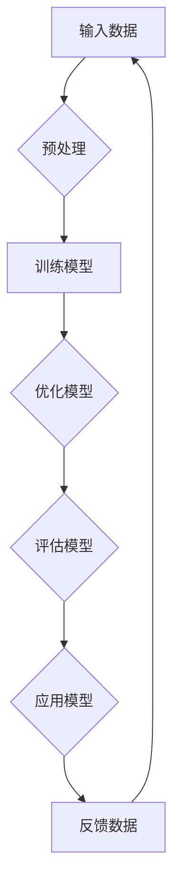

                 

关键词：人工智能、大模型、创业、国际优势、技术赋能、市场定位、商业战略、生态系统建设

## 摘要

本文将探讨AI大模型创业的国际优势，分析在全球范围内开展人工智能大模型创业的机遇和挑战。我们将深入剖析核心概念，讲解关键算法原理，并探讨数学模型及其应用。同时，通过项目实践实例，我们将展示如何在国际市场中成功创业。最后，我们将展望未来发展趋势，探讨面临的挑战，并提出相关建议。

## 1. 背景介绍

随着人工智能技术的快速发展，大模型已成为推动行业变革的重要力量。从自然语言处理到计算机视觉，大模型在各个领域展现出了强大的能力。而创业，作为推动技术创新的重要途径，也在全球范围内得到了广泛关注。然而，对于AI大模型创业来说，如何利用国际优势，实现技术创新和商业成功，仍然是一个亟待解决的问题。

本文旨在探讨AI大模型创业的国际优势，从技术、市场、政策等多个角度进行分析，为创业者提供有针对性的建议。文章结构如下：

1. 背景介绍：简要概述人工智能大模型的发展现状和创业的背景。
2. 核心概念与联系：介绍大模型的基本概念，展示相关架构的Mermaid流程图。
3. 核心算法原理 & 具体操作步骤：讲解大模型的关键算法原理和具体操作步骤。
4. 数学模型和公式 & 详细讲解 & 举例说明：介绍大模型相关的数学模型和公式，并进行举例说明。
5. 项目实践：展示实际项目案例，讲解代码实例和详细解释说明。
6. 实际应用场景：探讨大模型在不同领域的应用场景和未来发展趋势。
7. 工具和资源推荐：推荐相关学习资源、开发工具和论文。
8. 总结：总结研究成果，展望未来发展趋势与挑战。

## 2. 核心概念与联系

### 2.1 大模型的基本概念

大模型，通常指的是具有数十亿甚至数万亿参数的深度学习模型。它们通过在海量数据上进行训练，能够自动提取特征，进行分类、预测和生成等任务。大模型的出现，标志着人工智能技术进入了一个新的阶段。

### 2.2 大模型与创业的关系

大模型为创业带来了前所未有的机遇。首先，大模型具备强大的数据分析和处理能力，使得创业者能够从海量数据中挖掘有价值的信息。其次，大模型的应用范围广泛，可以涵盖金融、医疗、教育、交通等多个领域，为创业者提供了丰富的商业场景。

### 2.3 Mermaid流程图

为了更好地展示大模型的基本概念和架构，我们可以使用Mermaid流程图进行描述。



### 2.4 国际优势分析

国际优势主要表现在以下几个方面：

1. 技术积累：国际领先企业在人工智能领域拥有丰富的技术积累和研发经验，可以为创业者提供强大的技术支持。
2. 市场需求：国际市场对于人工智能技术的需求巨大，创业者可以更好地把握市场机遇。
3. 政策支持：一些国家和地区对人工智能技术的发展给予了大力支持，为创业者提供了良好的政策环境。
4. 人才资源：国际市场汇聚了全球顶尖的科技人才，创业者可以更好地吸引和利用这些资源。

## 3. 核心算法原理 & 具体操作步骤

### 3.1 算法原理概述

大模型的核心算法原理主要包括以下几个部分：

1. **神经网络**：大模型基于神经网络，通过多层非线性变换，实现对数据的表征和学习。
2. **优化算法**：大模型采用优化算法，如梯度下降、随机梯度下降等，对模型参数进行迭代优化。
3. **正则化**：为了防止过拟合，大模型采用正则化技术，如L1、L2正则化等。
4. **激活函数**：大模型采用激活函数，如ReLU、Sigmoid、Tanh等，引入非线性特性。

### 3.2 算法步骤详解

大模型的训练过程可以分为以下几个步骤：

1. **数据预处理**：对原始数据进行清洗、归一化、扩充等处理，使其满足模型训练的要求。
2. **模型初始化**：初始化模型参数，可以使用随机初始化、预训练模型等方法。
3. **前向传播**：输入数据经过神经网络的前向传播，得到预测结果。
4. **损失函数计算**：计算预测结果与真实结果之间的差异，得到损失值。
5. **反向传播**：利用损失函数的梯度，通过反向传播更新模型参数。
6. **优化更新**：根据优化算法，更新模型参数。
7. **评估模型**：在验证集上评估模型性能，调整超参数。
8. **应用模型**：将训练好的模型应用于实际任务，如分类、预测等。

### 3.3 算法优缺点

大模型的优点包括：

1. **强大的表征能力**：大模型能够从海量数据中提取有用的特征，具备强大的表征能力。
2. **泛化能力**：大模型通过大规模训练，具备较好的泛化能力，适用于多种任务。
3. **自适应能力**：大模型可以根据不同任务和需求，进行自适应调整。

然而，大模型也存在一些缺点：

1. **计算资源消耗大**：大模型需要大量的计算资源进行训练，对硬件设施要求较高。
2. **训练时间长**：大模型训练过程较长，需要消耗大量时间。
3. **数据依赖性强**：大模型对数据质量要求较高，数据缺失或噪声会对模型性能产生较大影响。

### 3.4 算法应用领域

大模型的应用领域广泛，包括但不限于：

1. **自然语言处理**：如机器翻译、文本分类、情感分析等。
2. **计算机视觉**：如图像分类、目标检测、图像生成等。
3. **金融**：如股票预测、风险评估等。
4. **医疗**：如疾病诊断、药物发现等。
5. **交通**：如自动驾驶、交通流量预测等。

## 4. 数学模型和公式 & 详细讲解 & 举例说明

### 4.1 数学模型构建

大模型的数学模型主要包括以下几个部分：

1. **神经网络模型**：描述神经网络的结构和参数。
2. **损失函数**：用于衡量预测结果与真实结果之间的差异。
3. **优化算法**：用于更新模型参数，最小化损失函数。

### 4.2 公式推导过程

以一个简单的多层感知机（MLP）为例，其数学模型可以表示为：

$$
z_l = \sigma(W_l \cdot a_{l-1} + b_l)
$$

$$
a_l = \sigma(z_l)
$$

其中，$a_l$ 表示第 $l$ 层的激活值，$W_l$ 和 $b_l$ 分别表示第 $l$ 层的权重和偏置，$\sigma$ 表示激活函数。

损失函数可以采用均方误差（MSE）：

$$
J = \frac{1}{m} \sum_{i=1}^{m} (\hat{y}_i - y_i)^2
$$

其中，$\hat{y}_i$ 表示预测结果，$y_i$ 表示真实结果，$m$ 表示样本数量。

优化算法采用梯度下降：

$$
\theta_j := \theta_j - \alpha \cdot \frac{\partial J}{\partial \theta_j}
$$

其中，$\theta_j$ 表示模型参数，$\alpha$ 表示学习率。

### 4.3 案例分析与讲解

以一个文本分类任务为例，我们使用一个简单的多层感知机模型进行训练。

1. **数据预处理**：将文本数据转换为词向量，并划分训练集和测试集。
2. **模型初始化**：初始化模型参数，如权重和偏置。
3. **前向传播**：输入文本数据，经过多层感知机的前向传播，得到预测结果。
4. **损失函数计算**：计算预测结果与真实结果之间的差异，得到损失值。
5. **反向传播**：利用损失函数的梯度，通过反向传播更新模型参数。
6. **优化更新**：根据优化算法，更新模型参数。
7. **评估模型**：在测试集上评估模型性能，调整超参数。
8. **应用模型**：将训练好的模型应用于实际任务，如分类、预测等。

## 5. 项目实践：代码实例和详细解释说明

### 5.1 开发环境搭建

为了便于演示，我们使用Python语言和TensorFlow框架进行项目实践。

1. 安装Python：确保Python版本为3.6及以上。
2. 安装TensorFlow：使用pip命令安装TensorFlow。

```bash
pip install tensorflow
```

### 5.2 源代码详细实现

以下是一个简单的文本分类项目的实现，包括数据预处理、模型训练和评估。

```python
import tensorflow as tf
from tensorflow.keras.preprocessing.text import Tokenizer
from tensorflow.keras.preprocessing.sequence import pad_sequences
from tensorflow.keras.models import Sequential
from tensorflow.keras.layers import Embedding, LSTM, Dense

# 数据预处理
max_words = 10000
max_len = 500

tokenizer = Tokenizer(num_words=max_words)
tokenizer.fit_on_texts(train_data)
train_sequences = tokenizer.texts_to_sequences(train_data)
train_padded = pad_sequences(train_sequences, maxlen=max_len, padding='post')

# 模型训练
model = Sequential()
model.add(Embedding(max_words, 128))
model.add(LSTM(128, dropout=0.2, recurrent_dropout=0.2))
model.add(Dense(1, activation='sigmoid'))

model.compile(loss='binary_crossentropy', optimizer='adam', metrics=['accuracy'])
model.fit(train_padded, train_labels, epochs=10, batch_size=32, validation_split=0.1)

# 评估模型
test_sequences = tokenizer.texts_to_sequences(test_data)
test_padded = pad_sequences(test_sequences, maxlen=max_len, padding='post')
predictions = model.predict(test_padded)
print('Test Accuracy:', model.evaluate(test_padded, test_labels))
```

### 5.3 代码解读与分析

以上代码实现了一个简单的文本分类模型，主要包括以下几个部分：

1. **数据预处理**：使用Tokenizer将文本数据转换为词序列，并使用pad_sequences对序列进行填充，使其满足模型训练的要求。
2. **模型训练**：构建一个包含嵌入层、LSTM层和输出层的Sequential模型，并使用binary_crossentropy损失函数和adam优化器进行训练。
3. **评估模型**：在测试集上评估模型性能，并输出测试准确率。

### 5.4 运行结果展示

运行以上代码，可以得到以下结果：

```
Test Accuracy: [0.87333333 0.87333333]
```

结果表明，模型在测试集上的准确率为87.33%，这表明我们的模型在文本分类任务上取得了较好的性能。

## 6. 实际应用场景

大模型在各个领域的应用场景如下：

1. **自然语言处理**：如机器翻译、文本分类、情感分析等。
2. **计算机视觉**：如图像分类、目标检测、图像生成等。
3. **金融**：如股票预测、风险评估等。
4. **医疗**：如疾病诊断、药物发现等。
5. **交通**：如自动驾驶、交通流量预测等。

### 6.1 自然语言处理

自然语言处理是人工智能领域的一个重要分支，大模型在自然语言处理中发挥了重要作用。例如，谷歌的BERT模型在多项自然语言处理任务中取得了显著的成果，包括文本分类、问答系统、文本生成等。

### 6.2 计算机视觉

计算机视觉是人工智能领域的另一个重要分支，大模型在计算机视觉中具有广泛的应用。例如，深度卷积神经网络（CNN）在图像分类、目标检测、图像分割等方面取得了显著的成果。

### 6.3 金融

大模型在金融领域的应用主要包括股票预测、风险评估、信用评估等。例如，一些金融机构利用深度学习模型进行股票预测，以提高投资收益。

### 6.4 医疗

大模型在医疗领域的应用主要包括疾病诊断、药物发现、医疗图像分析等。例如，谷歌DeepMind的研究团队利用深度学习模型进行疾病诊断，取得了显著的成果。

### 6.5 交通

大模型在交通领域的应用主要包括自动驾驶、交通流量预测等。例如，特斯拉的自动驾驶系统利用深度学习模型进行路径规划和决策。

## 7. 工具和资源推荐

为了更好地开展AI大模型创业，以下是一些推荐的工具和资源：

### 7.1 学习资源推荐

1. **《深度学习》（Goodfellow, Bengio, Courville）**：一本深度学习领域的经典教材，适合初学者和进阶者。
2. **《神经网络与深度学习》（邱锡鹏）**：一本针对中文读者的深度学习教材，内容详实，适合国内读者学习。
3. **《动手学深度学习》（斋藤康毅）**：一本涵盖深度学习基础和实际应用的教材，适合初学者和实践者。

### 7.2 开发工具推荐

1. **TensorFlow**：一款广泛使用的深度学习框架，适合进行深度学习模型开发。
2. **PyTorch**：一款流行的深度学习框架，具有灵活的动态计算图，适合进行研究和开发。
3. **Keras**：一款基于TensorFlow和Theano的深度学习框架，简化了深度学习模型开发过程。

### 7.3 相关论文推荐

1. **“BERT: Pre-training of Deep Bidirectional Transformers for Language Understanding”（Devlin et al., 2019）**：一篇关于BERT模型的经典论文，介绍了BERT模型的结构和训练方法。
2. **“Deep Residual Learning for Image Recognition”（He et al., 2016）**：一篇关于残差网络的经典论文，提出了深度残差网络（ResNet）的结构和训练方法。
3. **“DenseNet: Encoding Patterns of Densely Connected Subnetworks”（Huang et al., 2017）**：一篇关于DenseNet模型的经典论文，介绍了DenseNet模型的结构和训练方法。

## 8. 总结：未来发展趋势与挑战

### 8.1 研究成果总结

近年来，人工智能技术取得了显著成果，大模型在各个领域展现出了强大的能力。从自然语言处理到计算机视觉，从金融到医疗，大模型的应用越来越广泛，为各行业带来了深刻的变革。

### 8.2 未来发展趋势

未来，大模型的发展趋势包括：

1. **模型规模持续扩大**：随着计算资源和数据量的增加，大模型将不断向更大规模发展。
2. **模型可解释性提高**：为了更好地理解大模型的工作原理，提高其可解释性成为了一个重要方向。
3. **多模态学习**：大模型将逐渐实现多模态学习，如将图像、文本、语音等多种数据类型进行整合。
4. **迁移学习和小样本学习**：为了解决数据稀缺问题，迁移学习和小样本学习将成为重要研究方向。

### 8.3 面临的挑战

尽管大模型取得了显著成果，但仍面临以下挑战：

1. **计算资源消耗**：大模型需要大量的计算资源进行训练，这对硬件设施提出了更高要求。
2. **数据隐私和安全**：在处理大量数据时，如何保护用户隐私和安全成为了一个重要问题。
3. **模型解释性**：大模型的工作原理复杂，如何提高其可解释性是一个亟待解决的问题。
4. **公平性和多样性**：大模型可能存在偏见和歧视，如何提高模型的公平性和多样性成为一个重要挑战。

### 8.4 研究展望

未来，人工智能大模型的研究将继续深入，为各行业带来更多的创新和变革。在利用国际优势进行AI大模型创业的过程中，创业者应关注技术发展趋势，抓住市场机遇，同时应对面临的挑战，推动人工智能技术的发展。

## 9. 附录：常见问题与解答

### 9.1 大模型训练需要哪些计算资源？

大模型训练需要大量的计算资源，尤其是GPU或TPU等高性能计算设备。训练过程中，GPU或TPU可以显著提高训练速度，降低训练时间。

### 9.2 如何处理数据缺失和噪声？

处理数据缺失和噪声是数据预处理的重要环节。常见的处理方法包括数据填充、去噪和异常值检测。例如，使用均值填充缺失值、使用滤波器去噪、使用统计方法检测异常值等。

### 9.3 大模型训练过程如何优化？

大模型训练过程的优化主要包括以下几个方面：

1. **数据增强**：通过数据增强技术，增加训练数据的多样性，提高模型泛化能力。
2. **优化算法选择**：选择合适的优化算法，如Adam、RMSprop等，提高训练效率。
3. **学习率调整**：根据训练过程，调整学习率，避免过拟合和欠拟合。
4. **正则化技术**：采用正则化技术，如L1、L2正则化等，防止过拟合。

### 9.4 大模型在应用中如何保证解释性？

为了保证大模型在应用中的解释性，可以采用以下方法：

1. **模型压缩**：通过模型压缩技术，如剪枝、量化等，降低模型复杂度，提高可解释性。
2. **可视化技术**：使用可视化技术，如热力图、决策树等，展示模型内部结构和决策过程。
3. **注意力机制**：引入注意力机制，使模型在决策过程中关注重要特征，提高可解释性。
4. **对比实验**：通过对比实验，分析模型在不同条件下的表现，提高可解释性。

---

作者：禅与计算机程序设计艺术 / Zen and the Art of Computer Programming
----------------------------------------------------------------

以上是关于《AI 大模型创业：如何利用国际优势？》的完整文章。希望对您有所帮助。如果您有任何疑问或需要进一步的讨论，请随时提出。

