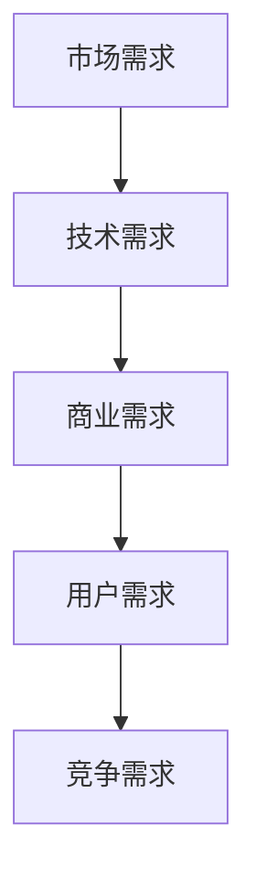
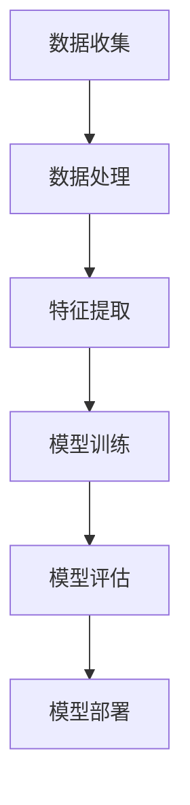
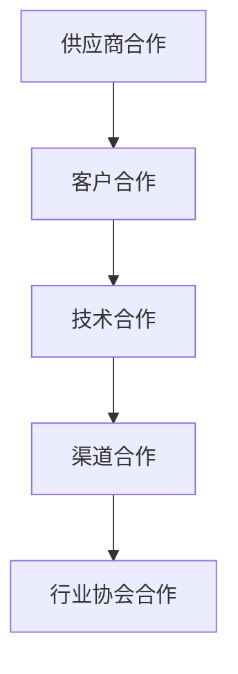

                 

关键词：AI 大模型，创业，国际优势，全球市场，竞争策略，技术积累，合作网络。

> 摘要：本文旨在探讨 AI 大模型创业如何在全球化背景下利用国际优势，通过分析市场需求、技术积累、合作网络和品牌建设等方面，提供一套系统化的创业指南。文章首先介绍了 AI 大模型的现状和趋势，然后深入探讨了创业者在国际市场上需要关注的几个关键问题，最后提出了实用的策略和建议，以帮助创业者更好地把握国际市场机会。

## 1. 背景介绍

随着人工智能技术的飞速发展，AI 大模型逐渐成为各行各业的核心驱动力。从自然语言处理到计算机视觉，再到强化学习，大模型在提升效率、降低成本、创新业务模式等方面展现出巨大的潜力。在这种背景下，越来越多的创业者看到了 AI 大模型所带来的商业机会，开始着手布局这一领域。

### 1.1 AI 大模型的发展现状

- **市场规模**：根据市场研究公司的数据，全球 AI 大模型市场预计将在未来几年内保持高速增长，年复合增长率可达 30% 以上。
- **技术进展**：AI 大模型的计算能力不断提升，模型参数数量呈指数级增长，算法也不断优化，使得模型在各个领域的应用更加广泛。
- **行业应用**：AI 大模型已经深入到金融、医疗、教育、零售等多个行业，为企业提供了强大的智能化解决方案。

### 1.2 AI 大模型创业的优势与挑战

- **优势**：技术积累、人才优势、市场潜力等。
- **挑战**：激烈的市场竞争、技术更新迭代速度、国际化运作的复杂性等。

## 2. 核心概念与联系

### 2.1 市场需求分析

**Mermaid 流程图：**



### 2.2 技术积累与架构

**Mermaid 流程图：**



### 2.3 合作网络建设

**Mermaid 流程图：**



## 3. 核心算法原理 & 具体操作步骤

### 3.1 算法原理概述

AI 大模型的核心算法主要包括深度学习、生成对抗网络（GAN）、迁移学习等。这些算法通过大规模数据的训练，能够实现高度复杂的模式识别和预测。

### 3.2 算法步骤详解

- 数据收集与预处理
- 模型设计与选择
- 模型训练与优化
- 模型评估与部署

### 3.3 算法优缺点

- **优点**：强大的计算能力，高度自动化的数据处理流程。
- **缺点**：计算资源需求大，模型解释性较差。

### 3.4 算法应用领域

AI 大模型在金融、医疗、零售、制造业等多个领域都有广泛应用，例如智能投顾、医疗影像诊断、智能推荐系统、智能制造等。

## 4. 数学模型和公式 & 详细讲解 & 举例说明

### 4.1 数学模型构建

AI 大模型的数学基础主要包括概率论、线性代数、微积分等。以下是一个简单的神经网络模型：

$$
y = \sigma(W \cdot x + b)
$$

其中，$W$ 是权重矩阵，$x$ 是输入向量，$b$ 是偏置项，$\sigma$ 是激活函数。

### 4.2 公式推导过程

神经网络的训练过程可以通过反向传播算法来实现。以下是简要的推导过程：

$$
\begin{aligned}
\Delta W &= \eta \frac{\partial J}{\partial W} \\
\Delta b &= \eta \frac{\partial J}{\partial b}
\end{aligned}
$$

其中，$J$ 是损失函数，$\eta$ 是学习率。

### 4.3 案例分析与讲解

以智能投顾为例，AI 大模型可以分析用户的财务状况、投资偏好等，为其提供个性化的投资建议。

## 5. 项目实践：代码实例和详细解释说明

### 5.1 开发环境搭建

- **硬件**：GPU 等高性能计算设备。
- **软件**：Python、TensorFlow 或 PyTorch 等深度学习框架。

### 5.2 源代码详细实现

```python
import tensorflow as tf

# 定义模型
model = tf.keras.Sequential([
    tf.keras.layers.Dense(128, activation='relu', input_shape=(784,)),
    tf.keras.layers.Dense(10, activation='softmax')
])

# 编译模型
model.compile(optimizer='adam',
              loss='categorical_crossentropy',
              metrics=['accuracy'])

# 训练模型
model.fit(x_train, y_train, epochs=5)
```

### 5.3 代码解读与分析

上述代码定义了一个简单的神经网络模型，用于手写数字识别任务。模型训练过程中，使用 Adam 优化器和交叉熵损失函数。

### 5.4 运行结果展示

训练完成后，可以通过 `model.evaluate()` 函数评估模型在测试集上的性能。

## 6. 实际应用场景

AI 大模型在金融、医疗、零售等领域都有广泛应用。以下是一些典型应用案例：

- **金融**：智能投顾、风险管理、信用评估等。
- **医疗**：疾病诊断、医学影像分析、个性化治疗等。
- **零售**：智能推荐、库存管理、客户关系管理等。

## 7. 工具和资源推荐

### 7.1 学习资源推荐

- **书籍**：《深度学习》、《Python 深度学习》等。
- **在线课程**：Coursera、edX 等。

### 7.2 开发工具推荐

- **深度学习框架**：TensorFlow、PyTorch 等。
- **数据预处理工具**：Pandas、Scikit-learn 等。

### 7.3 相关论文推荐

- **《A Theoretical Analysis of the Cramér-Rao Lower Bound for Multivariate Gaussian Noise》**：关于统计学习理论的重要论文。
- **《Generative Adversarial Nets》**：生成对抗网络的开创性论文。

## 8. 总结：未来发展趋势与挑战

### 8.1 研究成果总结

AI 大模型在技术层面取得了显著成果，但在实际应用中仍面临诸多挑战。

### 8.2 未来发展趋势

- **算法优化**：模型压缩、低能耗计算等。
- **应用拓展**：更多行业和场景的应用。
- **国际合作**：技术交流与合作将更加紧密。

### 8.3 面临的挑战

- **数据隐私**：如何保护用户数据隐私。
- **算法伦理**：如何确保算法的公平性和透明度。

### 8.4 研究展望

随着技术的不断进步，AI 大模型将在未来发挥更加重要的作用，为人类带来更多创新和变革。

## 9. 附录：常见问题与解答

### 9.1 问题一：AI 大模型创业需要哪些技术储备？

**解答**：创业者需要掌握深度学习、生成对抗网络、迁移学习等核心技术。此外，还需要熟悉数据预处理、模型训练和优化等基本技能。

### 9.2 问题二：如何在国际市场上建立品牌？

**解答**：建立品牌需要从产品定位、市场推广、客户关系等多个方面入手。具体策略包括：打造高质量产品、积极参与国际展会、利用社交媒体宣传等。

作者：禅与计算机程序设计艺术 / Zen and the Art of Computer Programming
----------------------------------------------------------------

以上是文章正文部分的内容。接下来，我们将根据文章结构模板，完善文章的各个部分，确保内容的完整性、逻辑性和专业性。接下来，我会依次撰写文章的各个章节，并按照markdown格式进行排版。请您查看后续内容。

