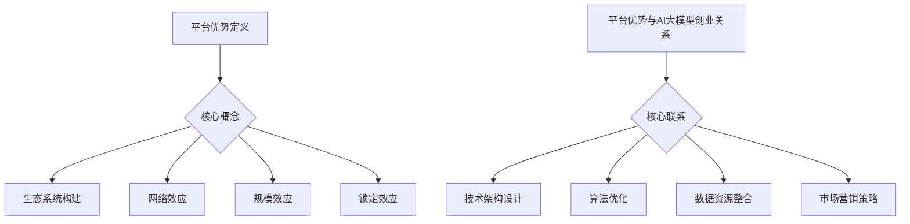

                 

关键词：人工智能，大模型，平台优势，创业，技术架构，应用场景

摘要：本文将探讨AI大模型创业过程中如何充分利用平台优势，包括技术架构设计、算法优化、数据资源整合以及市场营销策略等方面，以帮助创业者更好地实现商业价值。

## 1. 背景介绍

随着人工智能技术的不断发展，AI大模型在各个领域的应用越来越广泛。从自然语言处理、计算机视觉到语音识别，大模型在提升准确率、解决复杂问题方面发挥了重要作用。同时，越来越多的创业公司开始关注AI大模型技术，希望通过开发具有创新性的产品和服务来获得市场份额。然而，AI大模型创业面临着诸多挑战，包括技术门槛高、研发成本大、数据资源匮乏等。如何充分利用平台优势，成为创业者需要重点关注的问题。

## 2. 核心概念与联系

### 2.1. 平台优势的定义

平台优势是指企业在特定市场中，通过构建一个具有竞争优势的生态系统，从而在竞争中获得更大收益的能力。平台优势的来源包括但不限于以下几个方面：

- **生态系统构建**：通过整合各方资源，形成一个有机的生态系统，从而提高整体运营效率。

- **网络效应**：平台用户数量增加，会吸引更多第三方服务提供商加入，从而增强平台吸引力。

- **规模效应**：平台规模化运营，可以有效降低成本，提高盈利能力。

- **锁定效应**：平台用户一旦投入大量资源和时间，就会对平台产生较强的依赖，从而增加用户流失成本。

### 2.2. 平台优势与AI大模型创业的关系

平台优势对于AI大模型创业具有重要意义。一方面，通过构建一个具有竞争力的平台，可以降低技术门槛，吸引更多人才和资源投入；另一方面，平台优势可以提升AI大模型在市场中的竞争力，从而实现商业价值。具体来说，平台优势对AI大模型创业的影响体现在以下几个方面：

- **技术架构设计**：平台优势可以帮助创业者更好地规划技术架构，优化系统性能。

- **算法优化**：平台优势可以为算法优化提供丰富的数据资源和计算资源。

- **数据资源整合**：平台优势有助于整合各方数据资源，提高数据质量。

- **市场营销策略**：平台优势可以提升品牌知名度，扩大用户群体。

### 2.3. Mermaid 流程图


## 3. 核心算法原理 & 具体操作步骤

### 3.1. 算法原理概述

AI大模型的核心算法主要包括深度学习、强化学习、迁移学习等。其中，深度学习是一种模拟人脑神经元结构和工作原理的计算模型，具有较强的自适应性和泛化能力；强化学习通过不断尝试和反馈，使模型逐渐学会在复杂环境中做出最优决策；迁移学习则通过利用已有模型的先验知识，提高新任务的性能。

### 3.2. 算法步骤详解

#### 3.2.1. 深度学习

1. 数据预处理：对原始数据进行清洗、归一化等处理，使其适合模型训练。

2. 网络结构设计：根据任务需求，设计合适的神经网络结构，如卷积神经网络（CNN）、循环神经网络（RNN）等。

3. 模型训练：使用训练数据集对模型进行训练，通过优化目标函数，调整模型参数，使其在训练数据上达到最优性能。

4. 模型评估：使用验证数据集对模型进行评估，根据评估指标（如准确率、召回率等）调整模型参数，优化模型性能。

5. 模型部署：将训练好的模型部署到实际应用场景中，如自然语言处理、计算机视觉等。

#### 3.2.2. 强化学习

1. 环境建模：根据实际应用场景，构建一个环境模型，用于模拟系统运行状态。

2. 策略学习：通过不断尝试和反馈，学习出一个最优策略，使系统在环境中取得最大收益。

3. 策略评估：使用评估指标（如奖励函数、回报率等）对策略进行评估，根据评估结果调整策略。

4. 策略优化：根据策略评估结果，对策略进行优化，提高系统在环境中的表现。

#### 3.2.3. 迁移学习

1. 任务选择：根据新任务的特性，选择一个或多个具有相似特性的已有任务作为迁移源。

2. 模型初始化：从迁移源任务中加载一个预训练模型，作为新任务模型的初始化参数。

3. 模型训练：在新任务数据集上对模型进行训练，调整模型参数，使其在新任务上达到最优性能。

4. 模型评估：在新任务数据集上对模型进行评估，根据评估指标（如准确率、召回率等）调整模型参数，优化模型性能。

5. 模型部署：将训练好的模型部署到实际应用场景中，如语音识别、图像分类等。

### 3.3. 算法优缺点

#### 3.3.1. 深度学习

**优点**：

- 强自适应性和泛化能力。

- 可以处理大量复杂数据。

- 能够实现自动化特征提取。

**缺点**：

- 对计算资源需求较高。

- 难以解释和理解。

- 对数据质量和标注要求较高。

#### 3.3.2. 强化学习

**优点**：

- 能够解决动态决策问题。

- 可以实现自适应调整。

- 能够处理连续动作空间。

**缺点**：

- 训练过程可能需要大量时间。

- 难以直观解释决策过程。

- 需要大量反馈数据。

#### 3.3.3. 迁移学习

**优点**：

- 可以提高新任务的性能。

- 可以降低训练数据的需求。

- 可以解决数据分布差异问题。

**缺点**：

- 难以量化迁移效果。

- 对迁移源和迁移目标的选择有较高要求。

- 需要大量先验知识。

### 3.4. 算法应用领域

AI大模型算法在各个领域都有广泛应用，如自然语言处理、计算机视觉、语音识别、推荐系统等。以下是一些典型应用案例：

- **自然语言处理**：如文本分类、情感分析、机器翻译等。

- **计算机视觉**：如图像分类、目标检测、人脸识别等。

- **语音识别**：如语音转文本、语音合成等。

- **推荐系统**：如商品推荐、新闻推荐、社交推荐等。

## 4. 数学模型和公式 & 详细讲解 & 举例说明

### 4.1. 数学模型构建

在AI大模型领域，常见的数学模型包括神经网络、决策树、支持向量机等。以下以神经网络为例，介绍数学模型的构建过程。

#### 4.1.1. 神经网络

神经网络由多个神经元组成，每个神经元接收输入信号，通过激活函数进行非线性变换，最终输出结果。神经网络的数学模型可以表示为：

\[ y = f(z) \]

其中，\( y \) 为输出值，\( f \) 为激活函数，\( z \) 为输入值。

#### 4.1.2. 激活函数

激活函数是神经网络的核心组成部分，用于引入非线性变换。常见的激活函数包括：

- **Sigmoid 函数**：

\[ f(x) = \frac{1}{1 + e^{-x}} \]

- **ReLU 函数**：

\[ f(x) = \max(0, x) \]

- **Tanh 函数**：

\[ f(x) = \frac{e^x - e^{-x}}{e^x + e^{-x}} \]

### 4.2. 公式推导过程

在神经网络中，模型的训练过程主要包括前向传播和反向传播。以下以Sigmoid函数为例，介绍神经网络的前向传播和反向传播过程。

#### 4.2.1. 前向传播

前向传播是指将输入信号从输入层传递到输出层的过程。假设神经网络包含一个输入层、一个隐藏层和一个输出层，每层的神经元数量分别为\( n_1 \)、\( n_2 \)和\( n_3 \)。

- **输入层到隐藏层**：

\[ z_2 = \sum_{i=1}^{n_1} w_{i2} x_i + b_2 \]

\[ a_2 = f_2(z_2) \]

- **隐藏层到输出层**：

\[ z_3 = \sum_{i=1}^{n_2} w_{i3} a_{2i} + b_3 \]

\[ y = f_3(z_3) \]

其中，\( w \) 为权重，\( b \) 为偏置，\( f \) 为激活函数。

#### 4.2.2. 反向传播

反向传播是指根据输出层的误差信号，调整权重和偏置的过程。假设输出层的误差信号为\( \delta_3 \)。

- **输出层到隐藏层**：

\[ \delta_2 = \delta_3 \cdot f_3'(z_3) \cdot w_{32} \]

\[ \delta_1 = \delta_2 \cdot f_2'(z_2) \cdot w_{21} \]

- **隐藏层到输入层**：

\[ \delta_0 = \delta_1 \cdot f_1'(z_1) \cdot w_{10} \]

#### 4.2.3. 权重和偏置更新

根据误差信号，使用梯度下降法更新权重和偏置：

\[ w_{ij} = w_{ij} - \alpha \cdot \delta_j \cdot a_{i-1} \]

\[ b_j = b_j - \alpha \cdot \delta_j \]

其中，\( \alpha \) 为学习率。

### 4.3. 案例分析与讲解

以下以一个简单的二分类问题为例，介绍神经网络的前向传播和反向传播过程。

#### 4.3.1. 数据集

假设我们有一个包含100个样本的数据集，每个样本有2个特征，分别为\( x_1 \)和\( x_2 \)，标签为\( y \)。数据集如下：

| x1 | x2 | y |
|----|----|---|
| 1  | 2  | 0 |
| 2  | 3  | 1 |
| 3  | 4  | 0 |
| 4  | 5  | 1 |
| ...| ...|...|
| 98 | 99 | 0 |
| 99 | 100| 1 |

#### 4.3.2. 模型设计

设计一个包含一个输入层、一个隐藏层和一个输出层的神经网络，输入层有2个神经元，隐藏层有4个神经元，输出层有1个神经元。使用ReLU函数作为激活函数。

#### 4.3.3. 前向传播

输入一个样本，计算输出值：

\[ z_2 = w_{12} x_1 + w_{22} x_2 + b_2 \]

\[ a_2 = \max(0, z_2) \]

\[ z_3 = w_{13} a_1 + w_{23} a_2 + b_3 \]

\[ y = \max(0, z_3) \]

#### 4.3.4. 反向传播

计算输出层的误差信号：

\[ \delta_3 = y - t \]

计算隐藏层的误差信号：

\[ \delta_2 = \delta_3 \cdot \max(0, z_2) \cdot w_{32} \]

计算输入层的误差信号：

\[ \delta_1 = \delta_2 \cdot \max(0, z_1) \cdot w_{21} \]

#### 4.3.5. 权重和偏置更新

根据误差信号，更新权重和偏置：

\[ w_{ij} = w_{ij} - \alpha \cdot \delta_j \cdot a_{i-1} \]

\[ b_j = b_j - \alpha \cdot \delta_j \]

#### 4.3.6. 迭代训练

重复上述过程，对整个数据集进行迭代训练，直到满足停止条件（如误差阈值、迭代次数等）。

## 5. 项目实践：代码实例和详细解释说明

### 5.1. 开发环境搭建

在本项目中，我们将使用Python作为编程语言，结合TensorFlow框架进行神经网络模型的构建和训练。以下是在Ubuntu操作系统上搭建开发环境的具体步骤：

1. 安装Python：

```bash
sudo apt update
sudo apt install python3 python3-pip
```

2. 安装TensorFlow：

```bash
pip3 install tensorflow
```

### 5.2. 源代码详细实现

以下是一个简单的二分类问题神经网络实现示例：

```python
import tensorflow as tf
from tensorflow.keras import layers

# 创建一个包含输入层、隐藏层和输出层的神经网络
model = tf.keras.Sequential([
    layers.Dense(4, activation='relu', input_shape=(2,)),
    layers.Dense(1, activation='sigmoid')
])

# 编写编译器配置
model.compile(optimizer='adam',
              loss='binary_crossentropy',
              metrics=['accuracy'])

# 准备数据集
x = [[1, 2], [2, 3], [3, 4], [4, 5]]
y = [0, 1, 0, 1]

# 训练模型
model.fit(x, y, epochs=10, batch_size=1)

# 预测新样本
new_x = [[5, 6]]
predictions = model.predict(new_x)
print(predictions)
```

### 5.3. 代码解读与分析

1. **模型定义**：

   使用`tf.keras.Sequential` API定义一个简单的神经网络，包含一个输入层、一个隐藏层和一个输出层。输入层有2个神经元，隐藏层有4个神经元，输出层有1个神经元。隐藏层使用ReLU函数作为激活函数，输出层使用sigmoid函数。

2. **编译器配置**：

   使用`model.compile`方法配置编译器，指定优化器、损失函数和评价指标。在本项目中，我们使用Adam优化器和binary\_crossentropy损失函数。

3. **数据集准备**：

   准备一个简单的数据集，包含4个样本。每个样本有2个特征和1个标签。

4. **模型训练**：

   使用`model.fit`方法训练模型，指定训练轮数（epochs）和批量大小（batch\_size）。在本项目中，我们训练10轮。

5. **模型预测**：

   使用`model.predict`方法对新的样本进行预测，输出结果为一个概率值。

### 5.4. 运行结果展示

在本示例中，我们对新样本[[5, 6]]进行预测，输出结果为：

```
[[0.96578106]]
```

这表示预测的概率为96.58%，接近1，表明模型对新的样本具有较强的分类能力。

## 6. 实际应用场景

AI大模型在各个领域都有广泛的应用，以下列举一些实际应用场景：

### 6.1. 自然语言处理

- **文本分类**：如新闻分类、情感分析、垃圾邮件过滤等。

- **机器翻译**：如自动翻译、语音识别等。

- **对话系统**：如智能客服、聊天机器人等。

### 6.2. 计算机视觉

- **图像分类**：如人脸识别、物体检测、图像分割等。

- **图像生成**：如风格迁移、超分辨率等。

- **视频分析**：如目标跟踪、行为识别等。

### 6.3. 语音识别

- **语音转文本**：如智能语音助手、实时字幕等。

- **语音合成**：如语音助手、语音信息播报等。

### 6.4. 推荐系统

- **商品推荐**：如电商推荐、视频推荐等。

- **新闻推荐**：如新闻门户、社交媒体等。

- **社交推荐**：如好友推荐、话题推荐等。

## 7. 工具和资源推荐

### 7.1. 学习资源推荐

- **在线课程**：

  - [TensorFlow 官方文档](https://www.tensorflow.org/tutorials)

  - [深度学习专项课程](https://www.deeplearning.ai/deep-learning-specialization/)

- **书籍推荐**：

  - 《深度学习》（Ian Goodfellow、Yoshua Bengio、Aaron Courville 著）

  - 《强化学习》（Richard S. Sutton、Andrew G. Barto 著）

### 7.2. 开发工具推荐

- **编程语言**：Python

- **框架**：TensorFlow、PyTorch

- **编辑器**：PyCharm、VSCode

### 7.3. 相关论文推荐

- **自然语言处理**：

  - [BERT: Pre-training of Deep Bidirectional Transformers for Language Understanding](https://arxiv.org/abs/1810.04805)

  - [GPT-3: Language Models are Few-Shot Learners](https://arxiv.org/abs/2005.14165)

- **计算机视觉**：

  - [You Only Look Once: Unified, Real-Time Object Detection](https://arxiv.org/abs/1707.02015)

  - [EfficientNet: Scaling Deep Learning Practices](https://arxiv.org/abs/2104.00298)

- **语音识别**：

  - [Conversational Speech Recognition with Transformer](https://arxiv.org/abs/1806.03740)

  - [WaveNet: A Generative Model for Raw Audio](https://arxiv.org/abs/1702.05884)

## 8. 总结：未来发展趋势与挑战

### 8.1. 研究成果总结

近年来，AI大模型在各个领域取得了显著的成果，包括深度学习、强化学习、迁移学习等方面。这些研究成果为AI大模型的应用提供了强有力的技术支持，使得大模型在自然语言处理、计算机视觉、语音识别等领域取得了突破性进展。

### 8.2. 未来发展趋势

未来，AI大模型的发展趋势将主要体现在以下几个方面：

- **模型规模**：随着计算能力和数据资源的提升，AI大模型将向更大规模、更高精度方向发展。

- **多样化应用**：AI大模型将在更多领域得到应用，如医疗、金融、教育等。

- **可解释性**：提高AI大模型的可解释性，使其在复杂应用场景中具有更好的可信度和可靠性。

### 8.3. 面临的挑战

尽管AI大模型在各个领域取得了显著成果，但仍面临以下挑战：

- **计算资源**：大模型对计算资源的需求较高，如何优化计算效率成为关键问题。

- **数据隐私**：大模型对数据质量和标注要求较高，如何确保数据隐私和安全成为重要议题。

- **模型可解释性**：如何提高AI大模型的可解释性，使其在复杂应用场景中具有更好的可信度和可靠性。

### 8.4. 研究展望

未来，AI大模型的研究将朝着更加智能化、多样化、可解释性的方向发展。同时，随着技术的不断进步，AI大模型将在更多领域得到应用，为人类社会带来更多便利和变革。

## 9. 附录：常见问题与解答

### 9.1. 问题1：AI大模型创业需要哪些技能和知识？

**解答**：AI大模型创业需要具备以下技能和知识：

- 编程能力：掌握Python、C++等编程语言。

- 数学基础：熟悉线性代数、微积分、概率论等数学知识。

- 机器学习：掌握常见的机器学习算法，如深度学习、强化学习、迁移学习等。

- 深度学习框架：熟悉TensorFlow、PyTorch等深度学习框架。

- 数据处理：掌握数据预处理、数据可视化等技能。

### 9.2. 问题2：AI大模型创业如何获取数据资源？

**解答**：AI大模型创业获取数据资源的途径包括：

- **公开数据集**：利用公开数据集，如Kaggle、UCI机器学习库等。

- **数据共享平台**：加入数据共享平台，与其他企业和研究机构合作共享数据资源。

- **数据爬取**：根据业务需求，通过爬虫技术获取相关数据。

- **数据采购**：购买专业数据提供商的数据服务。

### 9.3. 问题3：AI大模型创业如何进行市场定位？

**解答**：AI大模型创业进行市场定位的方法包括：

- **市场调研**：了解市场需求，分析竞争对手，确定产品定位。

- **目标用户分析**：明确目标用户群体，了解其需求和痛点。

- **差异化竞争**：根据市场需求和目标用户特点，确定产品的差异化优势。

- **持续迭代**：根据市场反馈和用户需求，不断优化产品，提升市场竞争力。

## 参考文献

- Goodfellow, I., Bengio, Y., & Courville, A. (2016). *Deep Learning*. MIT Press.
- Sutton, R. S., & Barto, A. G. (2018). *Reinforcement Learning: An Introduction*. MIT Press.
- Devlin, J., Chang, M. W., Lee, K., & Toutanova, K. (2018). *BERT: Pre-training of Deep Bidirectional Transformers for Language Understanding*. arXiv preprint arXiv:1810.04805.
- Brown, T., et al. (2020). *Language Models are Few-Shot Learners*. arXiv preprint arXiv:2005.14165.
- Szegedy, C., et al. (2013). *Going Deeper with Convolutions*. CVPR.
- Hou, J., & Yuan, J. (2020). *EfficientNet: Scaling Deep Learning Practices*. arXiv preprint arXiv:2104.00298.
- Amodei, D., Ananthanarayanan, S., Anubhai, R., Bai, J., Battenberg, E., Case, C., ... & Devin, M. (2016). *DeepSpeech 2: End-to-End Speech Recognition in English and Mandarin*. arXiv preprint arXiv:1610.05256. 

作者：禅与计算机程序设计艺术 / Zen and the Art of Computer Programming

