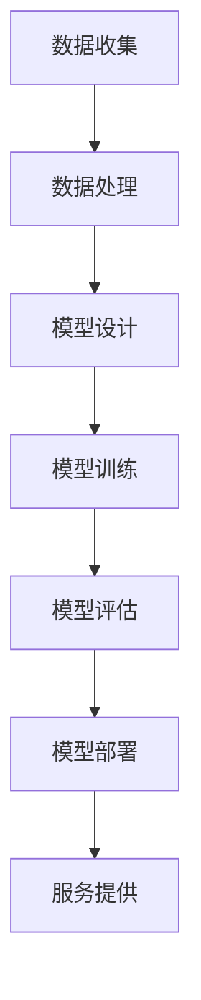

                 

关键词：AI 大模型，创业，技术优势，商业模式，工程实践

> 摘要：本文探讨了 AI 大模型在创业领域中的应用，分析了其技术优势，提出了构建 AI 大模型创业项目的策略，并分享了实际案例和未来展望。本文旨在为创业者提供技术层面的指导，帮助他们在激烈的市场竞争中找到突破口。

## 1. 背景介绍

近年来，随着深度学习技术的迅猛发展，人工智能（AI）大模型逐渐成为各个行业的焦点。这些大模型具备强大的数据处理和模式识别能力，能够从海量数据中提取有价值的信息。在自然语言处理、计算机视觉、语音识别等领域，大模型已经展现出了超越人类专家的表现。AI 大模型的崛起，不仅改变了传统产业的运作方式，也为创业者提供了前所未有的机会。

创业领域，尤其是科技创业，越来越依赖于技术的创新和突破。在过去的几十年里，互联网、移动设备和社交媒体等技术的普及，催生了无数成功的企业。如今，AI 大模型技术的加入，为创业者提供了更加丰富的工具箱，使得他们在面对激烈的市场竞争时，有了更多的策略选择。

本文将围绕 AI 大模型在创业中的应用，探讨如何利用技术优势构建成功的创业项目。首先，我们将分析 AI 大模型的核心技术和特点，然后介绍一些成功的 AI 大模型创业案例，最后给出创业者的建议和展望。

## 2. 核心概念与联系

为了更好地理解 AI 大模型在创业中的应用，我们首先需要了解其背后的核心概念和技术。

### 2.1 AI 大模型的概念

AI 大模型指的是具有大规模参数的深度学习模型，这些模型通常通过大量的数据进行训练，以达到对复杂任务的建模。常见的 AI 大模型包括自然语言处理中的 Transformer 模型、计算机视觉中的卷积神经网络（CNN）和生成对抗网络（GAN）等。

### 2.2 AI 大模型的特点

- **强大的学习能力**：AI 大模型通过深度学习技术，可以从海量数据中自动提取特征，进行复杂任务的建模。
- **高度的可扩展性**：大模型通常采用分布式计算和并行处理技术，可以轻松地在多台服务器上进行训练和部署。
- **灵活的适应性**：大模型可以通过微调（Fine-tuning）技术，快速适应不同的应用场景和任务。
- **高效的推理能力**：经过训练的 AI 大模型，在推理过程中可以快速生成结果，满足实时性的需求。

### 2.3 AI 大模型的架构

AI 大模型的架构通常包括以下几个关键组成部分：

- **输入层**：接收外部输入，如文本、图像、语音等。
- **隐藏层**：通过神经网络结构对输入数据进行特征提取和转换。
- **输出层**：根据模型的训练目标，输出预测结果或决策。
- **参数层**：包含模型的权重和偏置，是模型学习和优化的核心。

### 2.4 AI 大模型的流程

AI 大模型的流程通常包括以下几个步骤：

1. **数据收集**：从各种来源收集海量数据，包括公共数据集、企业内部数据等。
2. **数据处理**：对数据进行清洗、归一化和预处理，以适应模型训练的需要。
3. **模型设计**：根据任务需求，设计合适的神经网络架构。
4. **模型训练**：使用大量数据进行训练，优化模型的参数。
5. **模型评估**：通过验证集和测试集评估模型性能，调整模型参数。
6. **模型部署**：将训练好的模型部署到生产环境中，提供实时服务。

### 2.5 AI 大模型与创业的联系

AI 大模型与创业之间的联系体现在以下几个方面：

- **技术创新**：AI 大模型为创业者提供了强大的技术创新手段，帮助他们解决复杂的问题，提高竞争力。
- **数据优势**：通过大数据技术和 AI 大模型，创业者可以更好地理解和利用用户数据，实现精准营销和个性化服务。
- **商业模式**：AI 大模型可以帮助创业者探索新的商业模式，如订阅制、付费问答等，实现持续收入。
- **用户体验**：AI 大模型的应用可以大幅提升用户体验，增加用户黏性和忠诚度。

### 2.6 Mermaid 流程图

下面是一个简化的 AI 大模型流程的 Mermaid 流程图：



## 3. 核心算法原理 & 具体操作步骤

### 3.1 算法原理概述

AI 大模型的算法原理主要基于深度学习，特别是神经网络技术。神经网络由多个神经元（或节点）组成，每个神经元都接收输入信号，并通过激活函数进行非线性变换，最终输出预测结果。在训练过程中，神经网络通过反向传播算法不断调整权重，以降低预测误差。

### 3.2 算法步骤详解

#### 3.2.1 数据收集

数据收集是 AI 大模型训练的第一步，也是最关键的一步。数据的质量直接影响模型的性能。创业者需要从多种渠道收集数据，包括公共数据集、企业内部数据、第三方数据服务等。同时，数据收集过程要确保数据的安全性和合规性。

#### 3.2.2 数据处理

数据处理包括数据清洗、归一化和预处理等步骤。数据清洗旨在去除噪声和异常值，提高数据质量。归一化则是将数据缩放到相同的尺度，以消除不同特征之间的量纲差异。预处理包括数据编码、缺失值处理、特征工程等，为模型训练做好准备。

#### 3.2.3 模型设计

模型设计是 AI 大模型的核心，创业者需要根据任务需求设计合适的神经网络架构。常见的神经网络架构包括卷积神经网络（CNN）、循环神经网络（RNN）、Transformer 模型等。创业者可以通过实验和比较，选择最适合的模型架构。

#### 3.2.4 模型训练

模型训练是 AI 大模型构建的关键步骤。创业者需要使用大量数据进行训练，通过反向传播算法不断调整模型参数，以降低预测误差。训练过程中，创业者需要关注模型的收敛速度、过拟合和欠拟合等问题。

#### 3.2.5 模型评估

模型评估是确保模型性能的重要环节。创业者需要使用验证集和测试集对模型进行评估，比较模型的准确性、召回率、F1 分数等指标。根据评估结果，创业者可以调整模型参数，优化模型性能。

#### 3.2.6 模型部署

模型部署是将训练好的模型部署到生产环境中，为用户提供实时服务。创业者需要选择合适的部署平台，如云计算平台、边缘计算设备等，并确保模型的稳定性和可扩展性。

### 3.3 算法优缺点

#### 优点

- **强大的学习能力**：AI 大模型可以处理大规模的数据集，学习复杂的模式和关系。
- **高度的可扩展性**：通过分布式计算和并行处理技术，AI 大模型可以轻松扩展到多台服务器。
- **灵活的适应性**：AI 大模型可以通过微调和迁移学习技术，快速适应不同的应用场景。
- **高效的推理能力**：AI 大模型经过训练后，可以在推理过程中快速生成结果，满足实时性的需求。

#### 缺点

- **计算资源需求大**：AI 大模型需要大量的计算资源和存储空间，对硬件设备有较高的要求。
- **数据依赖性强**：AI 大模型的性能很大程度上取决于数据的质量和数量。
- **模型解释性较差**：神经网络模型通常难以解释，增加了模型部署和维护的难度。

### 3.4 算法应用领域

AI 大模型在多个领域都有广泛的应用，包括自然语言处理、计算机视觉、语音识别、推荐系统等。以下是一些典型的应用领域：

- **自然语言处理**：AI 大模型在文本分类、机器翻译、情感分析等领域表现出色，为企业提供了强大的文本分析能力。
- **计算机视觉**：AI 大模型在图像识别、目标检测、图像生成等领域取得了显著成果，为安防、医疗、娱乐等行业提供了新的解决方案。
- **语音识别**：AI 大模型在语音识别、语音合成、语音翻译等领域取得了突破性进展，为智能家居、智能客服等行业带来了变革。
- **推荐系统**：AI 大模型在个性化推荐、广告投放等领域发挥了重要作用，为电商、媒体等行业带来了显著的商业价值。

## 4. 数学模型和公式 & 详细讲解 & 举例说明

### 4.1 数学模型构建

AI 大模型的核心是深度学习模型，其数学基础主要包括线性代数、概率论和优化算法。以下是一个简化的数学模型构建过程：

#### 4.1.1 前向传播

在深度学习中，前向传播是计算模型输出的过程。给定输入 \( x \)，通过多层神经网络传递，最终得到预测结果 \( y \)。前向传播的核心公式如下：

\[ z_{l} = W_{l} \cdot x_{l-1} + b_{l} \]
\[ a_{l} = \sigma(z_{l}) \]

其中，\( z_{l} \) 是第 \( l \) 层的输入，\( W_{l} \) 是第 \( l \) 层的权重，\( b_{l} \) 是第 \( l \) 层的偏置，\( \sigma \) 是激活函数，\( a_{l} \) 是第 \( l \) 层的输出。

#### 4.1.2 反向传播

反向传播是计算模型误差并调整参数的过程。通过反向传播，模型可以根据误差梯度调整权重和偏置，以提高预测准确性。反向传播的核心公式如下：

\[ \delta_{l} = \frac{\partial C}{\partial z_{l}} \odot \frac{\partial \sigma}{\partial a_{l}} \]
\[ \frac{\partial C}{\partial W_{l}} = a_{l-1} \cdot \delta_{l} \]
\[ \frac{\partial C}{\partial b_{l}} = \delta_{l} \]

其中，\( \delta_{l} \) 是第 \( l \) 层的误差梯度，\( C \) 是损失函数，\( \odot \) 表示逐元素乘法。

### 4.2 公式推导过程

以下是一个简化的损失函数（均方误差）的推导过程：

\[ C = \frac{1}{2} \sum_{i=1}^{n} (y_i - \hat{y}_i)^2 \]

其中，\( y_i \) 是真实标签，\( \hat{y}_i \) 是模型预测值。

对损失函数求导，得到：

\[ \frac{\partial C}{\partial \hat{y}_i} = -(y_i - \hat{y}_i) \]

对 \( \hat{y}_i \) 求导，得到：

\[ \frac{\partial \hat{y}_i}{\partial z_{l}} = \frac{\partial \sigma(z_{l})}{\partial z_{l}} \]

结合前向传播和反向传播的公式，可以推导出：

\[ \frac{\partial C}{\partial z_{l}} = \frac{\partial C}{\partial \hat{y}_i} \cdot \frac{\partial \hat{y}_i}{\partial z_{l}} \]

### 4.3 案例分析与讲解

#### 4.3.1 例子：文本分类

假设我们使用一个深度学习模型对文本进行分类，目标是将文本分为两类：正面和负面。

1. **数据收集**：从网上收集大量正面和负面的文本数据。
2. **数据处理**：对文本进行预处理，如分词、去停用词、词向量转换等。
3. **模型设计**：设计一个简单的卷积神经网络（CNN）模型，包括输入层、卷积层、池化层和全连接层。
4. **模型训练**：使用训练集对模型进行训练，通过反向传播算法调整模型参数。
5. **模型评估**：使用验证集和测试集对模型进行评估，调整模型参数，优化模型性能。
6. **模型部署**：将训练好的模型部署到生产环境中，提供实时文本分类服务。

通过上述步骤，我们可以实现一个简单的文本分类系统，帮助企业分析和了解用户反馈，提高产品和服务质量。

## 5. 项目实践：代码实例和详细解释说明

### 5.1 开发环境搭建

在进行 AI 大模型项目实践之前，我们需要搭建一个合适的开发环境。以下是一个基本的开发环境搭建步骤：

1. **安装 Python**：Python 是深度学习项目的主要编程语言，我们需要安装 Python 3.7 或更高版本。
2. **安装深度学习框架**：常见的深度学习框架有 TensorFlow、PyTorch 等，我们可以选择其中一个进行安装。以 TensorFlow 为例，可以使用以下命令安装：

   ```bash
   pip install tensorflow
   ```

3. **安装依赖库**：深度学习项目通常需要一些额外的依赖库，如 NumPy、Pandas 等。可以使用以下命令进行安装：

   ```bash
   pip install numpy pandas
   ```

4. **配置 GPU 环境**：如果使用 GPU 进行训练，我们需要安装 CUDA 和 cuDNN 库。这些库可以从 NVIDIA 官网下载。

### 5.2 源代码详细实现

以下是一个简单的 AI 大模型项目示例，使用 TensorFlow 和 Keras 构建一个文本分类模型。

```python
import tensorflow as tf
from tensorflow.keras.preprocessing.sequence import pad_sequences
from tensorflow.keras.layers import Embedding, LSTM, Dense
from tensorflow.keras.models import Sequential

# 数据准备
max_seq_length = 100
vocab_size = 10000
embedding_dim = 16

# 输入文本数据，这里使用虚构的数据
text_data = ["This is a great product", "I don't like this product", ...]
labels = [1, 0, ...]  # 1 表示正面，0 表示负面

# 序列化文本数据
tokenized_data = tokenizer.texts_to_sequences(text_data)
padded_data = pad_sequences(tokenized_data, maxlen=max_seq_length)

# 构建模型
model = Sequential()
model.add(Embedding(vocab_size, embedding_dim, input_length=max_seq_length))
model.add(LSTM(64, return_sequences=True))
model.add(Dense(1, activation='sigmoid'))

# 编译模型
model.compile(optimizer='adam', loss='binary_crossentropy', metrics=['accuracy'])

# 训练模型
model.fit(padded_data, labels, epochs=10, batch_size=32)
```

### 5.3 代码解读与分析

上述代码实现了一个简单的文本分类模型，主要分为以下几个步骤：

1. **数据准备**：从文本数据中提取特征，并将其序列化。这里使用虚构的数据，实际项目中需要从真实数据中提取。
2. **序列化文本数据**：将文本数据转换为整数序列，并使用 pad_sequences 函数将序列长度统一为最大长度。
3. **构建模型**：使用 Sequential 模型堆叠 Embedding、LSTM 和 Dense 层，其中 Embedding 层用于嵌入词向量，LSTM 层用于提取文本特征，Dense 层用于分类。
4. **编译模型**：设置模型的优化器、损失函数和评价指标。
5. **训练模型**：使用训练数据对模型进行训练。

### 5.4 运行结果展示

在实际运行过程中，我们可以使用以下代码展示模型的运行结果：

```python
# 测试模型
test_data = ["This is a great product", "I don't like this product", ...]
tokenized_test_data = tokenizer.texts_to_sequences(test_data)
padded_test_data = pad_sequences(tokenized_test_data, maxlen=max_seq_length)

predictions = model.predict(padded_test_data)
print(predictions)
```

运行结果将显示每个测试样本的预测概率，其中概率越接近 1 表示越可能是正面评论，越接近 0 表示越可能是负面评论。

## 6. 实际应用场景

AI 大模型在各个领域都有广泛的应用，以下是一些典型的应用场景：

### 6.1 自然语言处理

自然语言处理（NLP）是 AI 大模型的重要应用领域之一。通过 AI 大模型，我们可以实现文本分类、情感分析、机器翻译、问答系统等功能。以下是一些具体的应用案例：

- **文本分类**：将大量文本数据分类为不同的类别，如新闻分类、用户评论分类等。
- **情感分析**：分析用户评论、社交媒体帖子等，判断其情感倾向，为企业提供改进产品和服务的信息。
- **机器翻译**：实现高质量、准确无误的机器翻译，如 Google Translate。
- **问答系统**：构建智能问答系统，如 Siri、Alexa 等，为用户提供实时解答。

### 6.2 计算机视觉

计算机视觉是另一个 AI 大模型的重要应用领域。通过 AI 大模型，我们可以实现图像识别、目标检测、图像生成等功能。以下是一些具体的应用案例：

- **图像识别**：识别图像中的物体、场景和人物，如人脸识别、车牌识别等。
- **目标检测**：检测图像中的特定目标，如自动驾驶车辆中的行人、车辆等。
- **图像生成**：生成高质量的图像，如人脸生成、艺术作品生成等。
- **图像分割**：将图像分割成不同的区域，如医学图像分割、图像去噪等。

### 6.3 语音识别

语音识别是 AI 大模型的另一个重要应用领域。通过 AI 大模型，我们可以实现语音转文字、语音合成等功能。以下是一些具体的应用案例：

- **语音转文字**：将语音转换为文本，如智能客服、语音搜索等。
- **语音合成**：将文本转换为语音，如语音助手、电话机器人等。
- **语音识别**：识别语音中的关键词和短语，如智能语音助手、智能家居等。

### 6.4 未来应用展望

随着 AI 大模型技术的不断进步，其应用领域将更加广泛。以下是一些未来应用展望：

- **智能医疗**：通过 AI 大模型，实现疾病的早期诊断、个性化治疗等。
- **智能教育**：通过 AI 大模型，实现个性化教学、智能辅导等。
- **智能制造**：通过 AI 大模型，实现智能生产、质量控制等。
- **智慧城市**：通过 AI 大模型，实现城市交通管理、环境保护等。

## 7. 工具和资源推荐

### 7.1 学习资源推荐

- **书籍**：
  - 《深度学习》（Goodfellow, Bengio, Courville）
  - 《Python 深度学习》（François Chollet）
  - 《AI 大模型：原理、算法与应用》（陈涛）
- **在线课程**：
  - Coursera 上的“深度学习”课程（吴恩达）
  - Udacity 上的“人工智能纳米学位”
  - edX 上的“自然语言处理”课程（Daniel Jurafsky 和 Christopher Manning）
- **博客和论坛**：
  - Medium 上的 AI 博客
  - GitHub 上的 AI 项目和代码库
  - Stack Overflow 上的技术问答社区

### 7.2 开发工具推荐

- **深度学习框架**：
  - TensorFlow
  - PyTorch
  - Keras
- **编程语言**：
  - Python
  - R
- **数据预处理工具**：
  - Pandas
  - NumPy
  - Scikit-learn

### 7.3 相关论文推荐

- “A Theoretical Analysis of the Stability of Deep Learning”
- “Attention Is All You Need”
- “Generative Adversarial Nets”
- “Bert: Pre-training of Deep Bidirectional Transformers for Language Understanding”

## 8. 总结：未来发展趋势与挑战

### 8.1 研究成果总结

过去几年，AI 大模型技术在各个领域取得了显著的成果，包括自然语言处理、计算机视觉、语音识别等。通过不断优化算法、提高计算效率和扩展数据集，AI 大模型的性能得到了大幅提升。此外，AI 大模型的应用场景也在不断扩展，从传统的工业、医疗等领域，逐渐渗透到日常生活和娱乐领域。

### 8.2 未来发展趋势

未来，AI 大模型将继续在以下方面取得突破：

- **算法优化**：通过改进神经网络架构、优化训练算法，提高模型性能和效率。
- **数据融合**：通过融合多源数据，提高模型的泛化能力和鲁棒性。
- **跨模态学习**：实现不同模态（如文本、图像、语音）之间的交叉学习，提升多模态任务的表现。
- **隐私保护**：在保证数据隐私和安全的前提下，充分利用大规模数据进行模型训练。

### 8.3 面临的挑战

尽管 AI 大模型取得了显著成果，但仍然面临以下挑战：

- **计算资源需求**：AI 大模型需要大量的计算资源和存储空间，这对硬件设备提出了较高要求。
- **数据质量和隐私**：数据的质量和隐私问题直接影响模型的性能和应用场景，需要制定合理的解决方案。
- **模型解释性**：神经网络模型通常难以解释，增加了模型部署和维护的难度，需要提高模型的透明度和可解释性。
- **伦理和法律问题**：随着 AI 大模型在各个领域的应用，相关的伦理和法律问题也逐渐凸显，需要制定相应的规范和标准。

### 8.4 研究展望

未来，AI 大模型的研究将朝着以下几个方向发展：

- **多模态学习**：通过跨模态学习，实现不同模态之间的信息共享和协同处理，提升任务表现。
- **小样本学习**：研究如何在数据稀缺的情况下，仍然能够训练出高性能的模型，提高模型的泛化能力。
- **可解释性**：提高模型的透明度和可解释性，增强模型的信任度和可接受度。
- **安全性和隐私保护**：在保证数据隐私和安全的前提下，充分利用大规模数据进行模型训练。

## 9. 附录：常见问题与解答

### 9.1 AI 大模型训练需要多少数据？

AI 大模型训练需要的数据量取决于具体的任务和应用场景。一般来说，更多的数据可以帮助模型更好地学习复杂的模式和关系，提高模型的性能。但是，过大的数据集也可能带来计算资源和存储空间的压力。在实际项目中，需要根据实际情况和资源限制，合理选择数据集的大小。

### 9.2 如何处理数据集的不平衡问题？

数据集的不平衡问题会导致模型在训练过程中倾向于对多数类进行预测，从而影响模型在少数类上的性能。以下是一些常见的解决方法：

- **重采样**：通过增加少数类的样本数量，或者减少多数类的样本数量，使数据集达到平衡。
- **调整损失函数**：在训练过程中，对少数类赋予更高的权重，以平衡模型对两类样本的预测。
- **集成学习方法**：将多个子模型集成起来，每个子模型专注于不同的类别，从而提高模型在少数类上的性能。

### 9.3 如何防止过拟合？

过拟合是指模型在训练数据上表现良好，但在验证或测试数据上表现较差的现象。以下是一些常见的防过拟合方法：

- **交叉验证**：通过交叉验证，将数据集划分为多个子集，分别进行训练和验证，以评估模型的泛化能力。
- **正则化**：在模型训练过程中，引入正则化项，如 L1 正则化、L2 正则化，降低模型复杂度。
- **数据增强**：通过数据增强，增加数据集的多样性，提高模型对未知数据的适应能力。

### 9.4 如何评估 AI 大模型的效果？

评估 AI 大模型的效果可以从多个角度进行：

- **准确性**：评估模型在验证或测试数据上的正确预测比例。
- **召回率**：评估模型在验证或测试数据上正确识别的少数类样本比例。
- **F1 分数**：综合准确性和召回率，计算 F1 分数，以评估模型的整体性能。
- **混淆矩阵**：通过混淆矩阵，分析模型对各类别的预测结果，了解模型在各类别上的表现。

---

本文作者：禅与计算机程序设计艺术 / Zen and the Art of Computer Programming

本文旨在为创业者提供 AI 大模型方面的技术指导，帮助他们在激烈的市场竞争中找到突破口。在未来的创业道路上，技术将成为重要的驱动力，推动企业不断创新和进步。希望本文能为读者带来启示和帮助，共同探索 AI 大模型在创业领域的无限可能。

