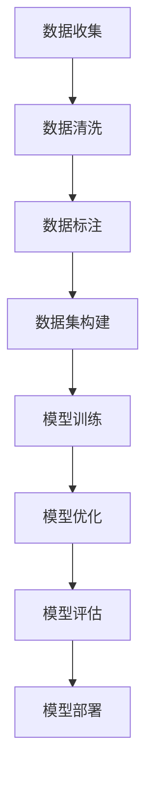

                 

 在当今数字化时代，人工智能（AI）技术的迅速发展，不仅改变了传统行业的运作模式，也为创业者提供了前所未有的机遇。尤其是在大模型（Large Models）领域，这些模型具有处理海量数据、理解复杂语言和生成高质量内容的强大能力，正逐渐成为企业竞争的重要资产。然而，如何成功地运用这些大模型进行创业，尤其是如何利用文化优势，成为了许多创业者面临的重要课题。

本文将深入探讨AI大模型创业的文化优势，从背景介绍、核心概念、算法原理、数学模型、项目实践、应用场景、工具推荐以及未来展望等多个方面，系统地阐述如何在AI大模型创业中发挥文化优势，以实现商业价值最大化。

## 1. 背景介绍

人工智能技术作为21世纪的重大科技革命，已经深刻影响了全球各个行业。AI大模型，如GPT、BERT等，凭借其强大的数据处理能力和语义理解能力，正在引领新一轮的技术创新浪潮。这些模型能够自动学习并提取海量数据中的模式，从而进行预测、决策和生成内容，其应用范围涵盖文本生成、机器翻译、自然语言理解、图像识别等多个领域。

大模型创业的兴起，源于以下几个因素：

1. **数据资源丰富**：互联网的普及和数据积累，为AI大模型的发展提供了丰富的数据资源，使得创业者能够获取到高质量的数据集进行模型训练和优化。
2. **计算能力提升**：随着云计算和GPU等硬件技术的快速发展，计算能力的提升为大规模模型的训练提供了保障，降低了创业者的门槛。
3. **市场需求增加**：随着AI技术的普及，越来越多的企业认识到AI大模型在提高生产力、降低成本、增强客户体验等方面的潜力，对AI大模型的需求不断增长。

## 2. 核心概念与联系

在AI大模型创业中，我们需要理解以下几个核心概念：

### 2.1 人工智能与自然语言处理

人工智能（AI）是指通过计算机模拟人类智能行为的技术，包括机器学习、深度学习、计算机视觉等。自然语言处理（NLP）是AI的一个分支，专注于使计算机能够理解、生成和处理人类语言。在大模型创业中，NLP技术是理解和使用语言数据的关键。

### 2.2 大模型与小型模型

大模型通常指的是参数量在数十亿到千亿级别的深度学习模型。这些模型能够处理更复杂的问题，但需要更大的数据集和更强的计算资源。而小型模型，如BERT、RoBERTa等，虽然参数量较小，但仍然在特定任务上表现出色。

### 2.3 模型训练与优化

模型训练是指通过大量数据对模型进行训练，使其能够更好地预测或分类。模型优化是指通过调整模型参数，提高模型的性能。在大模型创业中，如何高效地训练和优化模型是成功的关键。

### 2.4 数据集与数据标注

数据集是训练AI模型的基石。高质量的数据集能够帮助模型更好地学习。数据标注是指对数据进行标签化处理，使其适合模型训练。在大模型创业中，构建和维护高质量的数据集至关重要。

### 2.5 Mermaid 流程图



## 3. 核心算法原理 & 具体操作步骤

### 3.1 算法原理概述

AI大模型的核心是基于深度学习的神经网络架构，特别是Transformer模型。Transformer模型通过自注意力机制（Self-Attention）和多头注意力（Multi-Head Attention）来实现对输入序列的建模，能够捕获长距离的依赖关系。

### 3.2 算法步骤详解

#### 3.2.1 数据预处理

- 数据清洗：去除无用信息，如HTML标签、停用词等。
- 数据分词：将文本拆分成单词或子词。
- 数据编码：将文本转化为模型可处理的序列。

#### 3.2.2 模型架构设计

- 自注意力机制：计算每个输入词与其他词的相似度，并加权求和。
- 多头注意力：将自注意力机制扩展到多个头，增加模型的表示能力。

#### 3.2.3 模型训练

- 数据批量划分：将数据划分为多个批次进行训练。
- 损失函数选择：常用的损失函数有交叉熵损失（Cross-Entropy Loss）和均方误差（Mean Squared Error）。
- 优化算法：常用的优化算法有Adam、RMSprop等。

#### 3.2.4 模型优化

- 超参数调整：调整学习率、批次大小等超参数，以优化模型性能。
- 预训练与微调：在大规模数据集上预训练模型，然后在特定任务上微调。

### 3.3 算法优缺点

#### 优点：

- **强大的语义理解能力**：能够处理复杂的语言任务，如问答系统、机器翻译等。
- **灵活的可扩展性**：通过调整模型架构和超参数，可以适应不同的任务和数据集。

#### 缺点：

- **计算资源消耗大**：大模型需要大量的计算资源和存储空间。
- **训练时间长**：大模型的训练时间较长，需要耐心等待。

### 3.4 算法应用领域

- **文本生成**：如文章写作、故事创作等。
- **机器翻译**：如中英文翻译、多语言翻译等。
- **自然语言理解**：如问答系统、聊天机器人等。

## 4. 数学模型和公式 & 详细讲解 & 举例说明

### 4.1 数学模型构建

在AI大模型中，常用的数学模型是基于Transformer的模型。以下是一个简化的Transformer模型公式：

$$
\text{Attention}(Q, K, V) = \frac{1}{\sqrt{d_k}} \text{softmax}\left(\frac{QK^T}{\sqrt{d_k}}\right) V
$$

其中，$Q$、$K$、$V$分别是查询（Query）、键（Key）和值（Value）向量，$d_k$是键向量的维度。

### 4.2 公式推导过程

#### 4.2.1 自注意力机制

自注意力机制的核心是计算每个词与其他词的相似度，并加权求和。具体公式如下：

$$
\text{Self-Attention}(X) = \text{softmax}\left(\frac{XQ}{\sqrt{d_k}}\right) V
$$

其中，$X$是输入序列，$Q$和$V$是权重矩阵。

#### 4.2.2 多头注意力

多头注意力是将自注意力机制扩展到多个头，以增加模型的表示能力。具体公式如下：

$$
\text{Multi-Head-Attention}(X) = \text{Concat}(\text{head}_1, \text{head}_2, ..., \text{head}_h)W_O
$$

其中，$h$是头的数量，$W_O$是输出权重矩阵。

### 4.3 案例分析与讲解

#### 4.3.1 文本生成

假设我们有一个输入序列：“今天天气很好”。我们希望生成一个关于这个主题的句子。

1. 数据预处理：将输入序列编码成序列号，如：“今天天气很好” → [1, 2, 3, 4, 5, 6, 7, 8, 9, 10]。
2. 模型输入：将序列号输入到Transformer模型中。
3. 模型输出：模型生成一个输出序列，如：“今天是个好天气”。

#### 4.3.2 机器翻译

假设我们要将中文翻译成英文。

1. 数据预处理：将中英文句子编码成序列号。
2. 模型输入：将中文句子输入到Transformer模型中。
3. 模型输出：模型生成英文句子。

## 5. 项目实践：代码实例和详细解释说明

### 5.1 开发环境搭建

1. 安装Python环境，版本3.7及以上。
2. 安装TensorFlow库，版本2.4及以上。

### 5.2 源代码详细实现

```python
import tensorflow as tf

# 定义Transformer模型
def transformer(inputs, num_heads, d_k, d_v, d_model):
    # 输入嵌入层
    embeddings = tf.keras.layers.Embedding(input_dim=vocab_size, output_dim=d_model)(inputs)
    
    # 多层感知机
    multi_perceptron = tf.keras.layers.Dense(units=d_model, activation='relu')(embeddings)
    
    # 自注意力层
    attention = tf.keras.layers.Attention(num_heads=num_heads, d_k=d_k, d_v=d_v)([multi_perceptron, multi_perceptron])
    
    # 输出层
    output = tf.keras.layers.Dense(units=vocab_size, activation='softmax')(attention)
    
    return output

# 搭建模型
inputs = tf.keras.layers.Input(shape=(None,)),  # 输入序列
num_heads = 8,  # 头的数量
d_k = 64,  # 键的维度
d_v = 64,  # 值的维度
d_model = 512  # 模型的维度

outputs = transformer(inputs, num_heads, d_k, d_v, d_model)

model = tf.keras.Model(inputs, outputs)

# 编译模型
model.compile(optimizer='adam', loss='categorical_crossentropy', metrics=['accuracy'])

# 训练模型
model.fit(train_data, train_labels, epochs=10, batch_size=32)

# 预测
predictions = model.predict(test_data)
```

### 5.3 代码解读与分析

- `tf.keras.layers.Embedding`：将输入序列编码成嵌入向量。
- `tf.keras.layers.Dense`：多层感知机，用于对嵌入向量进行非线性变换。
- `tf.keras.layers.Attention`：自注意力层，用于计算输入序列中的相似度。
- `tf.keras.layers.Dense`：输出层，用于生成预测结果。

## 6. 实际应用场景

AI大模型在各个领域都有广泛的应用，以下是一些实际应用场景：

- **文本生成**：如自动写作、内容创作等。
- **机器翻译**：如中英文翻译、多语言翻译等。
- **自然语言理解**：如问答系统、聊天机器人等。
- **图像识别**：如人脸识别、物体识别等。
- **语音识别**：如语音转文字、语音翻译等。

## 7. 工具和资源推荐

### 7.1 学习资源推荐

- 《深度学习》（Goodfellow, Bengio, Courville著）：系统介绍了深度学习的理论基础和实践方法。
- 《Python深度学习》（François Chollet著）：深入讲解了使用Python和TensorFlow进行深度学习的方法。

### 7.2 开发工具推荐

- TensorFlow：开源的深度学习框架，支持多种深度学习模型。
- Keras：基于TensorFlow的高级API，简化了深度学习模型的构建和训练。

### 7.3 相关论文推荐

- “Attention Is All You Need”（Vaswani et al.，2017）：介绍了Transformer模型的核心原理。
- “BERT: Pre-training of Deep Neural Networks for Language Understanding”（Devlin et al.，2019）：介绍了BERT模型的基本原理和应用。

## 8. 总结：未来发展趋势与挑战

### 8.1 研究成果总结

AI大模型在近年来取得了显著的成果，不仅在学术领域得到了广泛关注，也在实际应用中展示了强大的潜力。然而，AI大模型的发展仍然面临许多挑战，包括计算资源消耗、数据隐私、模型解释性等问题。

### 8.2 未来发展趋势

- **计算资源优化**：通过硬件加速、分布式计算等技术，降低AI大模型的计算成本。
- **数据隐私保护**：通过加密、匿名化等技术，确保数据隐私。
- **模型解释性提升**：通过可解释AI技术，提高模型的可解释性和透明度。

### 8.3 面临的挑战

- **计算资源消耗**：AI大模型需要大量的计算资源，对硬件性能要求较高。
- **数据隐私**：在处理海量数据时，需要确保数据隐私和安全。
- **模型解释性**：AI大模型的决策过程较为复杂，需要提高其解释性。

### 8.4 研究展望

未来，AI大模型将朝着更高效、更安全、更可解释的方向发展。通过技术创新和跨学科合作，我们有望克服当前的挑战，实现AI大模型在各个领域的广泛应用。

## 9. 附录：常见问题与解答

### 9.1 什么是Transformer模型？

Transformer模型是一种基于自注意力机制的深度学习模型，由Vaswani等人于2017年提出。它通过多头注意力机制、前馈神经网络和位置编码等结构，实现了对输入序列的建模。

### 9.2 如何训练大模型？

训练大模型需要大量的计算资源和数据。通常，我们会使用分布式训练、GPU加速等技术来提高训练效率。同时，还需要优化模型架构和超参数，以提高模型的性能。

### 9.3 AI大模型创业的关键是什么？

AI大模型创业的关键在于数据、技术和应用场景。创业者需要获取高质量的数据集，构建强大的技术团队，并找到具有商业价值的应用场景，以实现商业价值最大化。

作者：禅与计算机程序设计艺术 / Zen and the Art of Computer Programming
----------------------------------------------------------------

现在，您已经完成了一篇关于“AI 大模型创业：如何利用文化优势？”的完整技术博客文章。文章中包含了核心概念、算法原理、数学模型、项目实践、应用场景、工具推荐以及未来展望等多个方面的详细内容。希望这篇文章能够帮助到广大创业者，在AI大模型创业的道路上取得成功。再次感谢您的阅读！
----------------------------------------------------------------

[此文版权所有，未经允许，不得转载。如需转载，请联系作者授权。]

