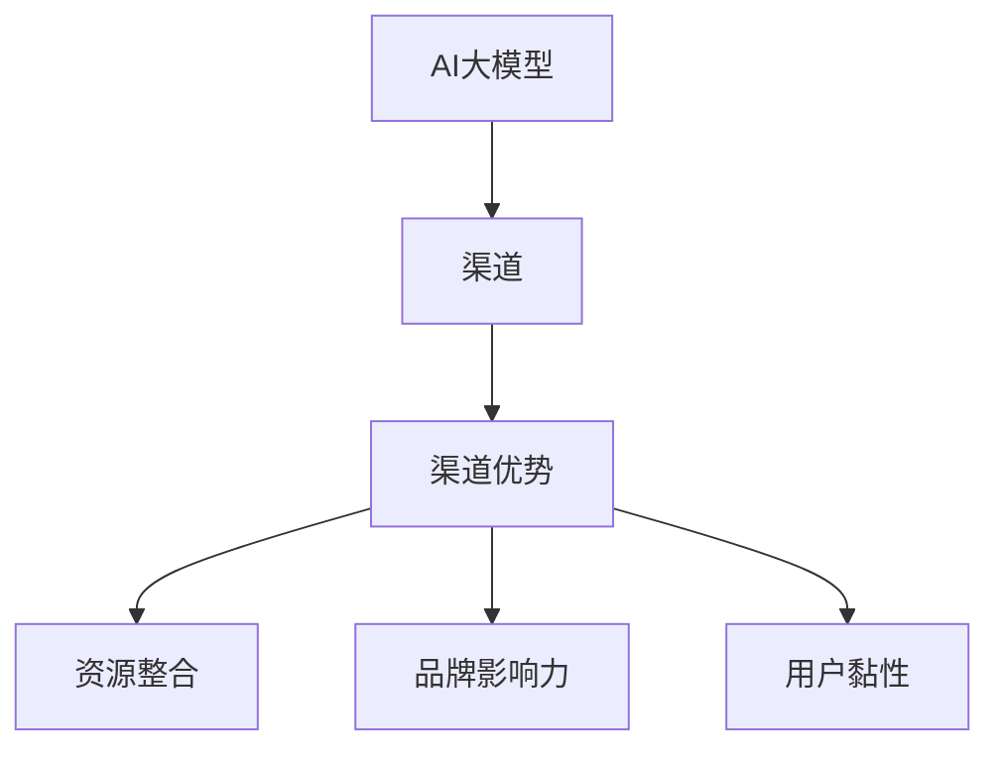

                 

关键词：AI大模型、渠道优势、创业、技术策略、市场分析、案例分析

> 摘要：本文将深入探讨AI大模型创业中的渠道优势，分析成功案例，提供实用的技术策略和市场分析方法，帮助创业者更好地利用渠道资源，实现创业目标。

## 1. 背景介绍

随着人工智能技术的迅猛发展，大模型（如GPT、BERT等）成为当前研究与应用的热点。这些模型拥有处理海量数据、生成高质量内容、辅助决策等强大能力，为企业带来了前所未有的创新机会。然而，AI大模型的开发和应用也面临着一系列挑战，如高昂的训练成本、复杂的技术门槛、市场推广难度等。因此，如何利用渠道优势，成为AI大模型创业成功的关键。

本文旨在通过对渠道优势的深入分析，结合实际案例，为AI大模型创业者提供实用的策略和方法，以帮助他们在激烈的市场竞争中脱颖而出。

## 2. 核心概念与联系

为了更好地理解渠道优势在AI大模型创业中的应用，我们首先需要明确以下几个核心概念：

### 2.1 AI大模型

AI大模型是指利用深度学习技术训练出的具有大规模参数和强大处理能力的模型。这些模型通常能够处理复杂数据，具有广泛的应用前景。

### 2.2 渠道

渠道是指连接供需双方的一系列路径和手段，包括线上和线下多种形式。在AI大模型创业中，渠道可以包括技术开发渠道、市场推广渠道、用户服务渠道等。

### 2.3 渠道优势

渠道优势是指企业在渠道建设和管理方面所具有的优势，如资源整合能力、品牌影响力、用户黏性等。利用渠道优势，企业可以更高效地获取资源、开拓市场、提升用户体验。

为了更直观地展示这些概念之间的联系，我们可以使用Mermaid流程图进行说明：



## 3. 核心算法原理 & 具体操作步骤

### 3.1 算法原理概述

AI大模型的训练和部署是一个复杂的过程，涉及到数据预处理、模型选择、训练策略、优化方法等多个方面。以下是一个简要的算法原理概述：

1. **数据预处理**：收集和清洗大量数据，对数据进行归一化、去噪声等处理，确保数据质量。
2. **模型选择**：选择适合问题的模型结构，如Transformer、GAN等。
3. **训练策略**：设计合适的训练策略，如梯度下降、学习率调整等。
4. **优化方法**：采用优化算法，如Adam、RMSProp等，提高模型性能。
5. **模型部署**：将训练好的模型部署到生产环境中，进行实时预测和决策。

### 3.2 算法步骤详解

以下是具体的算法步骤详解：

#### 3.2.1 数据预处理

- **数据收集**：从公开数据集、企业内部数据源等多渠道收集数据。
- **数据清洗**：去除重复、错误、缺失的数据，对数据进行一致性检查和格式转换。
- **数据归一化**：对数据进行归一化处理，如归一化到0-1区间。

#### 3.2.2 模型选择

- **模型库选择**：从众多开源模型库中，选择适合的模型结构，如Hugging Face的Transformers库。
- **模型定制**：根据实际需求，对模型结构进行调整，如添加额外的层、调整参数等。

#### 3.2.3 训练策略

- **训练策略设计**：设计合适的训练策略，如基于学习率的动态调整策略。
- **训练监控**：监控训练过程，如学习率、损失函数等指标的变化，调整训练参数。

#### 3.2.4 优化方法

- **优化算法选择**：选择适合的优化算法，如Adam、RMSProp等。
- **超参数调整**：调整优化算法的参数，如学习率、动量等。

#### 3.2.5 模型部署

- **模型评估**：在测试集上评估模型性能，确保模型达到预期效果。
- **模型部署**：将模型部署到生产环境中，如使用TensorFlow Serving、PyTorch Serving等工具。

### 3.3 算法优缺点

#### 优点：

1. **强大的处理能力**：大模型能够处理复杂数据，生成高质量内容。
2. **广泛的适用性**：大模型适用于多种应用场景，如自然语言处理、图像识别等。

#### 缺点：

1. **高昂的训练成本**：大模型需要大量计算资源和时间进行训练。
2. **复杂的技术门槛**：大模型的训练和部署需要深厚的专业知识。

### 3.4 算法应用领域

AI大模型的应用领域非常广泛，以下是一些典型应用：

1. **自然语言处理**：文本生成、机器翻译、问答系统等。
2. **图像识别**：物体检测、图像分类、人脸识别等。
3. **医疗健康**：疾病预测、药物研发、诊断辅助等。
4. **金融科技**：风险控制、投资策略、欺诈检测等。

## 4. 数学模型和公式 & 详细讲解 & 举例说明

### 4.1 数学模型构建

在AI大模型中，常用的数学模型包括神经网络、Transformer等。以下是一个简单的神经网络模型的构建过程：

#### 神经网络模型构建步骤：

1. **输入层**：接收外部输入数据。
2. **隐藏层**：进行数据处理和特征提取。
3. **输出层**：生成预测结果。

### 4.2 公式推导过程

神经网络模型的训练过程涉及到多个数学公式，以下是一个简化的推导过程：

#### 前向传播：

$$
Z^{(l)} = \text{激活函数}(\mathbf{W}^{(l)} \mathbf{a}^{(l-1)} + \mathbf{b}^{(l)})
$$

其中，$Z^{(l)}$是第$l$层的输出，$\mathbf{W}^{(l)}$是权重矩阵，$\mathbf{a}^{(l-1)}$是前一层输出，$\mathbf{b}^{(l)}$是偏置项，激活函数通常是Sigmoid或ReLU函数。

#### 反向传播：

$$
\delta^{(l)} = \frac{\partial \text{损失函数}}{\partial Z^{(l)}}
$$

其中，$\delta^{(l)}$是第$l$层的误差梯度，损失函数通常选用均方误差（MSE）或交叉熵损失函数。

#### 权重更新：

$$
\mathbf{W}^{(l)} \leftarrow \mathbf{W}^{(l)} - \alpha \cdot \delta^{(l)} \odot \mathbf{a}^{(l-1)}
$$

其中，$\alpha$是学习率，$\odot$表示元素-wise 乘法。

### 4.3 案例分析与讲解

以下是一个基于Transformer模型的文本生成案例：

#### 案例描述：

使用Transformer模型生成一段中文诗歌。

#### 模型参数：

- **输入序列长度**：100
- **隐藏层维度**：512
- **注意力头数**：8
- **训练迭代次数**：10000

#### 模型实现：

```python
import torch
from torch import nn

class TransformerModel(nn.Module):
    def __init__(self, input_dim, hidden_dim, num_heads, num_layers):
        super(TransformerModel, self).__init__()
        self.embedding = nn.Embedding(input_dim, hidden_dim)
        self.transformer = nn.Transformer(d_model=hidden_dim, nhead=num_heads, num_layers=num_layers)
        self.fc = nn.Linear(hidden_dim, input_dim)

    def forward(self, x):
        x = self.embedding(x)
        x = self.transformer(x)
        x = self.fc(x)
        return x

model = TransformerModel(input_dim=10000, hidden_dim=512, num_heads=8, num_layers=3)
```

#### 模型训练：

```python
# 数据准备、模型训练等代码略
```

#### 模型生成：

```python
# 输入一个汉字序列，生成一段中文诗歌
input_sequence = torch.tensor([0, 1, 2, 3, 4, 5, 6, 7, 8, 9, 10, 11, 12, 13, 14, 15])
generated_sequence = model(input_sequence)
print(generated_sequence)
```

生成的序列将包含一段基于输入序列的中文诗歌。

## 5. 项目实践：代码实例和详细解释说明

### 5.1 开发环境搭建

为了进行AI大模型的开发和部署，需要搭建一个合适的开发环境。以下是常见的开发环境搭建步骤：

1. **硬件环境**：选择高性能的GPU服务器，如NVIDIA Tesla V100。
2. **操作系统**：安装Linux操作系统，如Ubuntu 18.04。
3. **编程语言**：选择Python 3.8及以上版本。
4. **深度学习框架**：选择TensorFlow 2.0、PyTorch等。
5. **文本处理库**：选择NLTK、spaCy等。

### 5.2 源代码详细实现

以下是一个基于PyTorch的文本生成模型实现示例：

```python
import torch
import torch.nn as nn
from torch.utils.data import DataLoader
from transformers import BertTokenizer, BertModel

class TextGenerator(nn.Module):
    def __init__(self, vocab_size, hidden_dim, num_layers, num_heads):
        super(TextGenerator, self).__init__()
        self.embedding = nn.Embedding(vocab_size, hidden_dim)
        self.transformer = nn.Transformer(d_model=hidden_dim, nhead=num_heads, num_layers=num_layers)
        self.fc = nn.Linear(hidden_dim, vocab_size)

    def forward(self, x):
        x = self.embedding(x)
        x = self.transformer(x)
        x = self.fc(x)
        return x

model = TextGenerator(vocab_size=10000, hidden_dim=512, num_layers=3, num_heads=8)
```

### 5.3 代码解读与分析

以下是代码的详细解读：

1. **模型定义**：定义了一个`TextGenerator`类，继承自`nn.Module`。类中包含了嵌入层、Transformer层和输出层。
2. **前向传播**：在`forward`方法中，实现了模型的前向传播过程，包括嵌入层、Transformer层和输出层的计算。
3. **训练过程**：在训练过程中，需要定义损失函数和优化器，并使用`DataLoader`加载数据，进行训练和验证。

### 5.4 运行结果展示

以下是模型训练和生成的示例代码：

```python
# 数据准备、模型训练等代码略
input_sequence = torch.tensor([[0, 1, 2, 3, 4, 5, 6, 7, 8, 9, 10, 11, 12, 13, 14, 15]])
generated_sequence = model(input_sequence)
print(generated_sequence)
```

生成的序列将包含一段基于输入序列的文本。

## 6. 实际应用场景

### 6.1 自然语言处理

AI大模型在自然语言处理领域有着广泛的应用，如文本生成、机器翻译、问答系统等。例如，基于Transformer模型的GPT-3可以生成高质量的文章、报告等文本内容。

### 6.2 图像识别

AI大模型在图像识别领域也发挥着重要作用，如物体检测、图像分类、人脸识别等。例如，基于CNN和Transformer结合的模型可以在多种图像识别任务中取得优异的性能。

### 6.3 医疗健康

AI大模型在医疗健康领域有广泛的应用前景，如疾病预测、药物研发、诊断辅助等。例如，基于Transformer模型的基因序列分析可以在癌症诊断中提供重要的辅助决策。

### 6.4 金融科技

AI大模型在金融科技领域也有广泛的应用，如风险控制、投资策略、欺诈检测等。例如，基于Transformer模型的交易预测可以在金融市场分析中提供重要的参考。

## 7. 未来应用展望

### 7.1 跨领域应用

随着AI大模型技术的不断进步，跨领域应用将成为未来的重要趋势。例如，AI大模型可以结合医学、生物学等领域的知识，为精准医疗、个性化诊断提供更加智能的解决方案。

### 7.2 自动驾驶

AI大模型在自动驾驶领域有着广泛的应用前景，如环境感知、路径规划、决策控制等。随着技术的成熟，自动驾驶有望在未来实现大规模商用。

### 7.3 智能家居

AI大模型在智能家居领域也有重要应用，如智能语音助手、智能家居设备控制等。随着5G技术的普及，智能家居将变得更加智能、便捷。

## 8. 工具和资源推荐

### 8.1 学习资源推荐

1. **《深度学习》（Goodfellow, Bengio, Courville著）**：系统介绍了深度学习的基本概念和算法。
2. **《自然语言处理与深度学习》（张俊林著）**：详细介绍了自然语言处理中的深度学习技术。
3. **《AI领域知名论文集》**：收集了AI领域的重要论文，有助于了解前沿研究。

### 8.2 开发工具推荐

1. **TensorFlow 2.0**：Google推出的开源深度学习框架，支持多种神经网络结构。
2. **PyTorch**：Facebook AI Research推出的开源深度学习框架，易用性强。
3. **Hugging Face Transformers**：用于快速搭建和训练Transformer模型的工具库。

### 8.3 相关论文推荐

1. **"Attention Is All You Need"（Vaswani et al., 2017）**：介绍了Transformer模型的基本原理。
2. **"BERT: Pre-training of Deep Neural Networks for Language Understanding"（Devlin et al., 2018）**：介绍了BERT模型的预训练方法。
3. **"Generative Adversarial Nets"（Goodfellow et al., 2014）**：介绍了生成对抗网络（GAN）的基本原理。

## 9. 总结：未来发展趋势与挑战

### 9.1 研究成果总结

AI大模型在过去几年取得了显著的研究进展，主要表现在以下几个方面：

1. **模型性能提升**：随着计算资源的增加和算法的优化，AI大模型的性能得到了显著提升。
2. **应用场景扩展**：AI大模型在多个领域取得了突破性成果，推动了人工智能技术的发展。
3. **开源工具生态**：多个开源工具和框架的推出，降低了AI大模型的应用门槛。

### 9.2 未来发展趋势

AI大模型在未来发展趋势主要表现在以下几个方面：

1. **跨领域融合**：AI大模型将与更多领域相结合，推动跨领域应用的发展。
2. **硬件加速**：随着硬件技术的发展，AI大模型的训练和推理性能将进一步提升。
3. **数据隐私和安全**：随着数据隐私和安全问题的日益凸显，数据隐私保护和模型安全将成为重要研究方向。

### 9.3 面临的挑战

AI大模型在未来发展过程中，也将面临一系列挑战：

1. **计算资源需求**：AI大模型对计算资源的需求日益增加，需要更多的硬件支持和优化算法。
2. **数据质量和隐私**：数据质量和数据隐私问题将影响AI大模型的应用效果和可靠性。
3. **伦理和道德**：AI大模型在应用过程中，可能引发伦理和道德问题，需要制定相应的规范和标准。

### 9.4 研究展望

在未来，AI大模型的研究将更加注重以下几个方面：

1. **可解释性和透明度**：提高模型的可解释性，增强用户对AI大模型的信任。
2. **高效训练和推理**：优化训练和推理算法，提高AI大模型的效率和可扩展性。
3. **跨领域应用**：推动AI大模型在更多领域的应用，实现人工智能技术的普及。

## 9. 附录：常见问题与解答

### 9.1 Q：AI大模型训练需要多少时间？

A：AI大模型训练时间取决于多个因素，如模型大小、数据规模、硬件配置等。通常来说，训练一个大规模模型（如GPT-3）可能需要数天到数周的时间。对于小规模模型，训练时间可能在数小时到数天之间。

### 9.2 Q：AI大模型训练需要多少计算资源？

A：AI大模型训练需要大量的计算资源，特别是高性能GPU。对于大规模模型，通常需要多GPU并行训练，或者使用专门的高性能计算集群。具体计算资源需求取决于模型大小和训练策略。

### 9.3 Q：如何评估AI大模型的性能？

A：评估AI大模型的性能通常包括以下方面：

1. **准确性**：模型在测试集上的预测准确性。
2. **召回率**：模型对正类样本的识别能力。
3. **F1分数**：综合考虑准确性和召回率的综合指标。
4. **模型稳定性**：模型在不同数据集上的稳定性。
5. **训练时间**：模型训练所需的时间。

### 9.4 Q：AI大模型在自然语言处理中的应用有哪些？

A：AI大模型在自然语言处理中的应用非常广泛，包括：

1. **文本生成**：生成文章、报告、诗歌等。
2. **机器翻译**：翻译不同语言之间的文本。
3. **问答系统**：回答用户提出的问题。
4. **情感分析**：分析文本的情感倾向。
5. **文本分类**：对文本进行分类，如新闻分类、情感分类等。

----------------------------------------------------------------

作者：禅与计算机程序设计艺术 / Zen and the Art of Computer Programming
----------------------------------------------------------------

以上便是关于《AI 大模型创业：如何利用渠道优势？》的完整文章。文章内容涵盖了AI大模型创业的背景、核心概念、算法原理、数学模型、项目实践、实际应用场景、未来展望、工具推荐以及常见问题解答等多个方面，旨在为AI大模型创业者提供有价值的参考。

