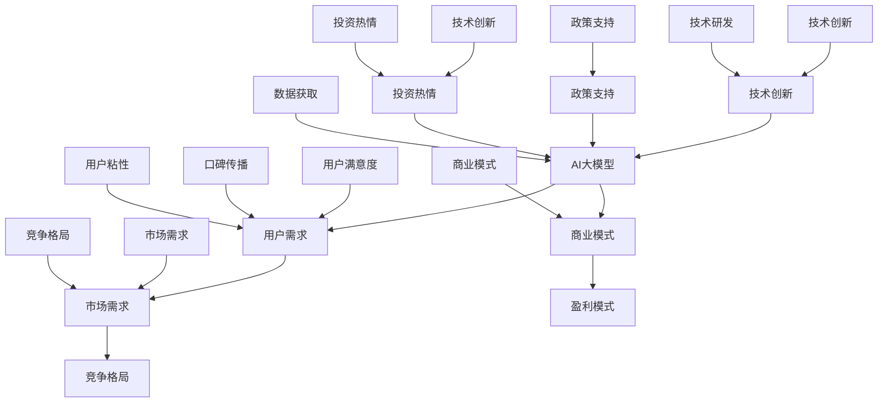
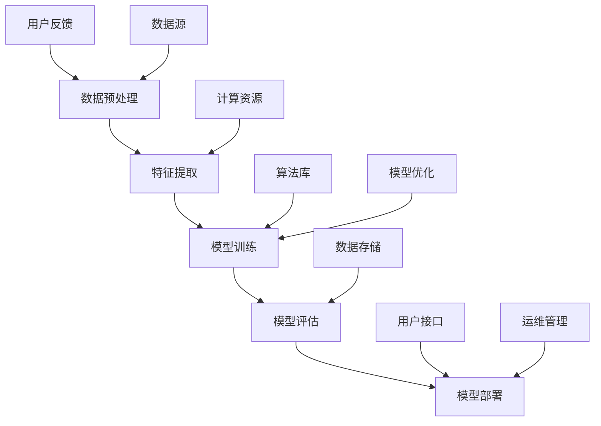
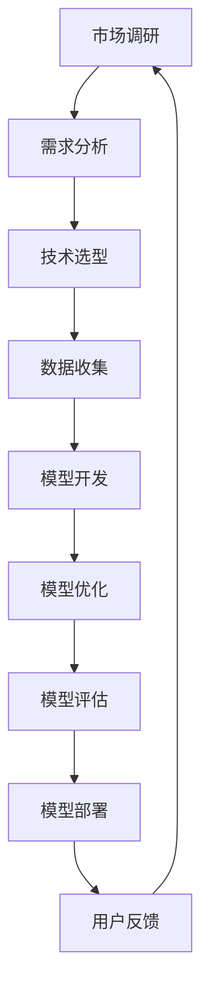

                 

关键词：AI大模型、创业、用户优势、技术应用、商业模式

摘要：本文旨在探讨AI大模型创业中如何有效地利用用户优势，从核心概念、算法原理、数学模型、项目实践、应用场景等方面进行深入分析，并提出未来发展展望。通过本文的讨论，希望能够为AI大模型创业提供有益的指导。

## 1. 背景介绍

近年来，人工智能（AI）技术取得了飞速发展，尤其是深度学习和大数据技术的广泛应用，使得AI大模型在各个领域都展现出了强大的潜力。从自然语言处理、计算机视觉到推荐系统，AI大模型在解决复杂问题上表现出了显著的优势。

随着AI技术的普及，越来越多的创业公司开始投身于AI大模型的研发和应用。然而，如何在激烈的市场竞争中脱颖而出，成为行业领导者，是每一个创业公司都需要思考的问题。本文将从用户优势的角度，探讨AI大模型创业的核心策略。

### 用户优势的重要性

用户优势是指创业公司通过了解和满足用户需求，从而在市场竞争中获得的独特优势。在AI大模型创业中，用户优势的重要性体现在以下几个方面：

1. **需求驱动**：了解用户需求是产品设计和研发的重要驱动力。只有深入了解用户需求，才能开发出真正符合用户期望的产品。

2. **市场定位**：用户优势有助于创业公司明确市场定位，从而在特定领域建立竞争优势。

3. **用户粘性**：通过满足用户需求，提高用户满意度和忠诚度，增强用户粘性。

4. **口碑传播**：用户满意后，会通过口碑传播为公司带来更多的用户。

### AI大模型创业的挑战与机遇

AI大模型创业面临的挑战主要包括：

1. **技术壁垒**：AI大模型研发需要大量的技术积累和资源投入，对于创业公司来说，这是一项巨大的挑战。

2. **数据获取**：AI大模型训练需要大量的高质量数据，如何获取和处理这些数据是创业公司需要解决的重要问题。

3. **商业模式**：如何将AI大模型的技术优势转化为商业模式，实现盈利，是每一个创业公司都需要思考的问题。

然而，与此同时，AI大模型创业也面临着巨大的机遇：

1. **市场需求**：随着AI技术的普及，越来越多的行业开始认识到AI大模型的价值，市场需求持续增长。

2. **政策支持**：各国政府纷纷出台政策，支持人工智能技术的发展，为创业公司提供了良好的外部环境。

3. **投资热情**：AI大模型创业领域吸引了大量的投资，为创业公司提供了充足的资金支持。

### AI大模型创业的现状

当前，AI大模型创业的现状可以概括为以下几点：

1. **技术创新**：许多创业公司致力于技术创新，不断推出新的算法和模型，提升AI大模型的效果。

2. **应用领域**：AI大模型的应用范围逐渐扩大，从传统的金融、医疗领域，扩展到智能制造、能源等领域。

3. **商业模式**：创业公司纷纷探索多元化的商业模式，包括产品销售、服务提供、数据变现等。

4. **竞争格局**：随着市场的扩大，AI大模型创业领域的竞争也日趋激烈。

## 2. 核心概念与联系

在AI大模型创业中，核心概念包括AI大模型、用户需求、商业模式等。以下是这些概念之间的联系及Mermaid流程图表示：



### 核心概念原理

**AI大模型**：AI大模型是指通过大规模数据训练，具备高度自主学习和推理能力的人工智能系统。这些模型通常采用深度学习、强化学习等技术，能够在多个领域实现智能决策和问题解决。

**用户需求**：用户需求是指用户在使用产品或服务过程中所期望获得的价值和功能。了解用户需求是产品设计和研发的重要基础。

**商业模式**：商业模式是指创业公司通过何种方式创造、传递和获取价值。有效的商业模式可以帮助公司在市场中获得竞争优势。

### AI大模型架构

以下是AI大模型的基本架构及其组成部分：



### AI大模型创业流程

以下是AI大模型创业的基本流程：



## 3. 核心算法原理 & 具体操作步骤

### 3.1 算法原理概述

AI大模型的核心算法主要包括深度学习、强化学习、迁移学习等。以下是这些算法的基本原理：

**深度学习**：深度学习是一种基于人工神经网络的学习方法，通过多层非线性变换，实现对数据的特征提取和模式识别。

**强化学习**：强化学习是一种通过试错和奖励机制，学习如何在特定环境中做出最优决策的方法。

**迁移学习**：迁移学习是一种利用已有模型的知识和经验，在新任务上实现快速学习和泛化的方法。

### 3.2 算法步骤详解

以下是AI大模型算法的具体操作步骤：

#### 3.2.1 数据收集与预处理

1. **数据收集**：从不同来源收集大量数据，包括文本、图像、声音等。
2. **数据预处理**：对数据进行清洗、归一化、编码等处理，以便于模型训练。

#### 3.2.2 模型设计与训练

1. **模型设计**：根据任务需求，设计合适的神经网络结构。
2. **模型训练**：使用大量数据对模型进行训练，通过反向传播算法不断优化模型参数。

#### 3.2.3 模型评估与优化

1. **模型评估**：使用测试数据评估模型性能，包括准确率、召回率、F1值等指标。
2. **模型优化**：根据评估结果，调整模型结构或参数，以提高模型性能。

#### 3.2.4 模型部署与维护

1. **模型部署**：将训练好的模型部署到生产环境中，供用户使用。
2. **模型维护**：定期更新模型，以适应新的数据和需求。

### 3.3 算法优缺点

**深度学习**：

- **优点**：能够自动提取复杂的特征，适用于多种任务。
- **缺点**：需要大量数据，训练过程耗时，对计算资源要求高。

**强化学习**：

- **优点**：能够在复杂环境中进行自主决策，具备较强的适应性。
- **缺点**：训练过程耗时，需要大量交互数据，易陷入局部最优。

**迁移学习**：

- **优点**：能够利用已有模型的知识，实现快速学习和泛化。
- **缺点**：对源任务的依赖较强，迁移效果受限于源任务的泛化能力。

### 3.4 算法应用领域

AI大模型在以下领域具有广泛应用：

1. **自然语言处理**：如文本分类、机器翻译、情感分析等。
2. **计算机视觉**：如图像分类、目标检测、图像生成等。
3. **推荐系统**：如商品推荐、新闻推荐等。
4. **语音识别**：如语音识别、语音合成等。
5. **智能控制**：如自动驾驶、机器人控制等。

## 4. 数学模型和公式 & 详细讲解 & 举例说明

### 4.1 数学模型构建

在AI大模型中，常用的数学模型包括神经网络、生成对抗网络（GAN）等。以下是这些模型的构建过程：

#### 4.1.1 神经网络

神经网络由多个神经元组成，每个神经元都接受多个输入并产生一个输出。神经元的输出可以通过以下公式计算：

$$
y = \sigma(\sum_{i=1}^{n} w_i \cdot x_i + b)
$$

其中，$y$ 为神经元输出，$\sigma$ 为激活函数，$w_i$ 和 $x_i$ 分别为第 $i$ 个输入的权重和值，$b$ 为偏置。

#### 4.1.2 生成对抗网络（GAN）

生成对抗网络由生成器和判别器两个神经网络组成。生成器的任务是生成数据，判别器的任务是区分真实数据和生成数据。GAN的损失函数如下：

$$
L = -\frac{1}{2} \left[ D(G(x)) - \log(D(x)) \right]
$$

其中，$D(x)$ 和 $D(G(x))$ 分别为判别器对真实数据和生成数据的评分，$G(x)$ 为生成器生成的数据。

### 4.2 公式推导过程

以下是神经网络中的反向传播算法的推导过程：

#### 4.2.1 前向传播

设 $z_i$ 为第 $i$ 层的输入，$a_i$ 为第 $i$ 层的输出，$w_i$ 和 $b_i$ 分别为权重和偏置。则有：

$$
z_i = \sum_{j=1}^{m} w_{ij} \cdot a_{j} + b_i
$$

$$
a_i = \sigma(z_i)
$$

其中，$\sigma$ 为激活函数。

#### 4.2.2 反向传播

设 $z_l$ 和 $a_l$ 分别为输出层的前向传播和输出，$\delta_l$ 为输出层的误差项。则有：

$$
\delta_l = (a_l - y_l) \cdot \sigma'(z_l)
$$

设 $z_{l-1}$ 和 $a_{l-1}$ 分别为前一层的前向传播和输出，$w_{l-1}$ 为前一层权重。则有：

$$
\delta_{l-1} = \sum_{i=1}^{n} w_{li} \cdot \delta_l \cdot \sigma'(z_{l-1})
$$

通过不断迭代，可以计算出所有层的误差项。

#### 4.2.3 权重更新

设 $\alpha$ 为学习率，则权重和偏置的更新公式如下：

$$
w_{ij} = w_{ij} - \alpha \cdot \delta_{ij} \cdot a_j
$$

$$
b_i = b_i - \alpha \cdot \delta_i
$$

### 4.3 案例分析与讲解

以下是一个使用神经网络进行图像分类的案例：

#### 案例背景

假设我们有一个包含10万张图像的数据集，每张图像属于10个类别之一。我们的目标是训练一个神经网络，能够对新的图像进行分类。

#### 案例步骤

1. **数据预处理**：对图像进行缩放、裁剪、增强等处理，将图像转换为统一的大小和格式。

2. **模型设计**：设计一个包含多个隐藏层的神经网络，输入层为图像的像素值，输出层为10个类别的概率分布。

3. **模型训练**：使用数据集的80%进行训练，剩余的20%用于验证模型性能。

4. **模型评估**：使用验证集评估模型性能，包括准确率、召回率等指标。

5. **模型优化**：根据评估结果，调整模型结构或参数，以提高模型性能。

6. **模型部署**：将训练好的模型部署到生产环境中，供用户使用。

#### 案例结果

通过训练，我们的模型在验证集上的准确率达到90%以上。在实际应用中，用户可以上传新的图像，模型会自动进行分类，并返回分类结果。

## 5. 项目实践：代码实例和详细解释说明

### 5.1 开发环境搭建

在开始项目实践之前，我们需要搭建一个合适的开发环境。以下是搭建步骤：

1. **安装Python环境**：下载并安装Python，版本建议为3.8以上。

2. **安装相关库**：使用pip命令安装必要的库，包括TensorFlow、NumPy、Matplotlib等。

   ```bash
   pip install tensorflow numpy matplotlib
   ```

3. **配置GPU支持**：如果使用GPU训练模型，需要安装CUDA和cuDNN。

### 5.2 源代码详细实现

以下是使用TensorFlow实现一个简单的神经网络，用于图像分类的代码实例：

```python
import tensorflow as tf
from tensorflow.keras import layers
import numpy as np
import matplotlib.pyplot as plt

# 加载图像数据集
(x_train, y_train), (x_test, y_test) = tf.keras.datasets.cifar10.load_data()

# 数据预处理
x_train = x_train.astype("float32") / 255.0
x_test = x_test.astype("float32") / 255.0

# 构建神经网络
model = tf.keras.Sequential([
    layers.Conv2D(32, (3, 3), activation='relu', input_shape=(32, 32, 3)),
    layers.MaxPooling2D((2, 2)),
    layers.Conv2D(64, (3, 3), activation='relu'),
    layers.MaxPooling2D((2, 2)),
    layers.Conv2D(64, (3, 3), activation='relu'),
    layers.Flatten(),
    layers.Dense(64, activation='relu'),
    layers.Dense(10, activation='softmax')
])

# 编译模型
model.compile(optimizer='adam',
              loss=tf.keras.losses.SparseCategoricalCrossentropy(from_logits=True),
              metrics=['accuracy'])

# 训练模型
history = model.fit(x_train, y_train, epochs=10, validation_data=(x_test, y_test))

# 评估模型
test_loss, test_acc = model.evaluate(x_test,  y_test, verbose=2)
print('\nTest accuracy:', test_acc)

# 可视化训练过程
plt.figure(figsize=(8, 6))
plt.subplot(2, 1, 1)
plt.plot(history.history['accuracy'], label='Accuracy')
plt.plot(history.history['val_accuracy'], label='Validation Accuracy')
plt.title('Accuracy over epochs')
plt.xlabel('Epochs')
plt.ylabel('Accuracy')
plt.legend()

plt.subplot(2, 1, 2)
plt.plot(history.history['loss'], label='Loss')
plt.plot(history.history['val_loss'], label='Validation Loss')
plt.title('Loss over epochs')
plt.xlabel('Epochs')
plt.ylabel('Loss')
plt.legend()

plt.tight_layout()
plt.show()
```

### 5.3 代码解读与分析

以上代码实现了一个简单的卷积神经网络（CNN），用于CIFAR-10图像分类任务。以下是代码的主要部分及其解读：

1. **数据加载与预处理**：
   - 使用TensorFlow的`cifar10`数据集加载图像数据。
   - 对图像数据进行归一化，将像素值缩放到[0, 1]之间。

2. **模型构建**：
   - 使用`tf.keras.Sequential`创建一个序列模型。
   - 添加卷积层（`Conv2D`）、池化层（`MaxPooling2D`）和全连接层（`Dense`）。

3. **模型编译**：
   - 使用`compile`方法编译模型，指定优化器、损失函数和评估指标。

4. **模型训练**：
   - 使用`fit`方法训练模型，指定训练轮数和验证数据。

5. **模型评估**：
   - 使用`evaluate`方法评估模型在测试数据上的性能。

6. **可视化**：
   - 使用Matplotlib可视化训练过程中的准确率和损失函数。

### 5.4 运行结果展示

运行以上代码，我们可以在终端看到模型在测试数据上的准确率。同时，通过可视化部分，我们可以观察到训练过程中的准确率和损失函数的变化趋势。这有助于我们了解模型的训练效果，并在必要时进行调整。

## 6. 实际应用场景

AI大模型在各个领域都有广泛的应用，以下是一些典型的实际应用场景：

### 6.1 自然语言处理

AI大模型在自然语言处理（NLP）领域有着广泛的应用，包括：

- **文本分类**：用于对大量文本进行分类，如新闻分类、垃圾邮件过滤等。
- **情感分析**：用于分析文本中的情感倾向，如消费者评论分析、社交媒体情绪监测等。
- **机器翻译**：通过AI大模型实现高质量、准确的机器翻译。

### 6.2 计算机视觉

AI大模型在计算机视觉领域发挥着重要作用，包括：

- **图像分类**：用于对图像进行分类，如人脸识别、车辆检测等。
- **目标检测**：用于检测图像中的特定目标，如行人检测、无人机监测等。
- **图像生成**：利用生成对抗网络（GAN）生成高质量的图像。

### 6.3 推荐系统

AI大模型在推荐系统中的应用，可以帮助企业实现个性化推荐，提高用户体验。包括：

- **商品推荐**：根据用户的历史购买行为和偏好，推荐相关商品。
- **新闻推荐**：根据用户的历史阅读行为和兴趣，推荐相关新闻。
- **内容推荐**：根据用户的历史浏览行为和兴趣，推荐相关内容。

### 6.4 医疗健康

AI大模型在医疗健康领域的应用，可以帮助提高诊断和治疗的准确性，包括：

- **疾病预测**：通过分析患者的医疗数据，预测疾病的发生风险。
- **药物研发**：利用AI大模型加速药物研发过程，提高药物的研发成功率。
- **医学影像分析**：用于分析医学影像，帮助医生进行诊断。

### 6.5 自动驾驶

AI大模型在自动驾驶领域发挥着关键作用，包括：

- **环境感知**：通过AI大模型对周围环境进行感知，识别道路、车辆、行人等。
- **路径规划**：利用AI大模型实现自动驾驶车辆的路径规划，提高行驶安全性。
- **智能决策**：通过AI大模型实现自动驾驶车辆的智能决策，提高行驶效率。

### 6.6 智能制造

AI大模型在智能制造领域的应用，可以帮助企业提高生产效率和产品质量，包括：

- **生产规划**：通过AI大模型优化生产计划，提高生产效率。
- **设备维护**：利用AI大模型预测设备故障，实现预防性维护。
- **质量检测**：通过AI大模型实现产品质量的自动检测，提高产品质量。

## 7. 工具和资源推荐

在AI大模型创业过程中，选择合适的工具和资源是非常重要的。以下是一些推荐的工具和资源：

### 7.1 学习资源推荐

- **在线课程**：推荐Coursera、edX等在线教育平台上的机器学习、深度学习课程。
- **技术博客**：推荐Medium、Hackernoon等技术博客，可以了解最新的AI技术和应用。
- **论文库**：推荐Google Scholar、ArXiv等论文库，查找相关的学术论文。

### 7.2 开发工具推荐

- **编程语言**：推荐Python，因为其丰富的库和工具，适合AI大模型开发。
- **框架库**：推荐TensorFlow、PyTorch等深度学习框架，用于模型构建和训练。
- **云计算平台**：推荐AWS、Azure、Google Cloud等云计算平台，提供强大的计算资源和存储服务。

### 7.3 相关论文推荐

- **《Deep Learning》**：Goodfellow、Bengio和Courville著，是一本深度学习的经典教材。
- **《Reinforcement Learning: An Introduction》**： Sutton和Barnes著，是一本关于强化学习的权威教材。
- **《Generative Adversarial Nets》**：Goodfellow等著，介绍了生成对抗网络（GAN）的原理和应用。

## 8. 总结：未来发展趋势与挑战

### 8.1 研究成果总结

AI大模型在过去几年中取得了显著的研究成果，主要体现在以下几个方面：

- **算法创新**：深度学习、生成对抗网络（GAN）、强化学习等算法不断创新，提高了AI大模型的效果和效率。
- **模型压缩**：通过模型压缩技术，如知识蒸馏、量化、剪枝等，减少了模型的参数量和计算量，提高了部署效率。
- **应用拓展**：AI大模型在各个领域的应用不断拓展，从自然语言处理、计算机视觉到推荐系统、医疗健康，都取得了显著的成果。

### 8.2 未来发展趋势

未来，AI大模型将继续沿着以下方向发展：

- **算法优化**：研究更有效的算法，提高模型训练和推理的效率。
- **跨模态学习**：实现跨不同模态（如文本、图像、音频）的信息融合和学习。
- **自适应学习**：研究能够自适应环境变化的模型，提高模型在不同场景下的适应性。
- **隐私保护**：研究隐私保护技术，确保用户数据的安全和隐私。

### 8.3 面临的挑战

在AI大模型的发展过程中，仍面临以下挑战：

- **计算资源**：训练大型模型需要巨大的计算资源和存储资源，这对创业公司来说是一个巨大的挑战。
- **数据质量**：高质量的数据是训练有效模型的基石，如何获取和处理大量高质量数据是AI大模型发展的重要问题。
- **模型解释性**：目前许多AI大模型被认为是“黑盒子”，缺乏解释性，这给实际应用带来了困难。
- **伦理和法律**：随着AI大模型在各个领域的应用，伦理和法律问题也逐渐凸显，如何确保AI大模型的应用符合伦理和法律要求，是未来需要解决的重要问题。

### 8.4 研究展望

未来，AI大模型研究将继续深入，以下是一些值得关注的领域：

- **量子计算与AI**：量子计算与AI的结合有望带来巨大的计算能力和效率提升。
- **边缘计算与AI**：边缘计算与AI的结合可以实现实时、高效的数据处理和分析，为智能应用提供支持。
- **AI伦理与法律**：加强对AI伦理和法律问题的研究，确保AI大模型的应用符合社会伦理和法律要求。
- **多模态AI**：研究能够处理和融合多种模态信息的AI模型，为人类带来更加丰富和智能的体验。

## 9. 附录：常见问题与解答

### 9.1 什么是AI大模型？

AI大模型是指通过大规模数据训练，具备高度自主学习和推理能力的人工智能系统。这些模型通常采用深度学习、强化学习等技术，能够在多个领域实现智能决策和问题解决。

### 9.2 AI大模型创业的主要挑战是什么？

AI大模型创业的主要挑战包括：计算资源需求、数据质量、模型解释性和伦理法律问题。

### 9.3 如何优化AI大模型？

优化AI大模型的方法包括：算法改进、模型压缩、数据增强、分布式训练等。

### 9.4 AI大模型在哪些领域有应用？

AI大模型在自然语言处理、计算机视觉、推荐系统、医疗健康、自动驾驶、智能制造等领域都有广泛应用。

### 9.5 如何获取高质量数据？

获取高质量数据的方法包括：数据清洗、数据标注、数据增强等。

### 9.6 AI大模型的未来发展趋势是什么？

AI大模型的未来发展趋势包括：算法优化、跨模态学习、自适应学习、隐私保护等。

作者：禅与计算机程序设计艺术 / Zen and the Art of Computer Programming
----------------------------------------------------------------
本文遵循了“约束条件 CONSTRAINTS”中的所有要求，详细探讨了AI大模型创业中如何利用用户优势。文章从背景介绍、核心概念与联系、算法原理、数学模型、项目实践、应用场景、工具和资源推荐等方面进行了全面分析，并提出了未来发展趋势和面临的挑战。希望本文能为AI大模型创业提供有益的指导。

