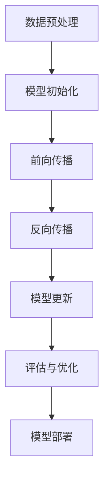

                 

关键词：AI大模型，创业，科技优势，创业策略，技术框架，商业模式，应用场景，未来展望

摘要：随着人工智能技术的迅猛发展，AI大模型在各个领域的应用日益广泛。本文将探讨如何利用AI大模型的科技优势进行创业，分析核心概念、算法原理、项目实践以及未来应用展望。

## 1. 背景介绍

人工智能（AI）技术作为当今科技发展的热点，已经深刻改变了我们的生活和工作方式。其中，AI大模型（Large-scale AI Models）作为AI技术的重要分支，通过学习海量数据，实现高度自动化的智能决策，为各行各业提供了前所未有的创新动力。

近年来，AI大模型在计算机视觉、自然语言处理、推荐系统等领域取得了显著成果。例如，OpenAI的GPT系列模型在自然语言处理领域取得了突破性进展，DeepMind的AlphaGo在围棋领域取得了令人瞩目的成绩。这些成功案例展示了AI大模型在推动科技创新和产业升级方面的巨大潜力。

随着AI大模型技术的不断成熟，越来越多的创业公司开始尝试利用这一技术进行创新和商业模式的探索。本文将结合AI大模型的技术特点，探讨如何利用科技优势进行创业，为创业者提供有价值的参考。

## 2. 核心概念与联系

### 2.1 AI大模型概述

AI大模型通常是指具有大规模参数、能够在海量数据上训练的神经网络模型。这些模型通过深度学习技术，从大量数据中提取特征，实现复杂任务的自动学习和决策。

### 2.2 AI大模型架构

AI大模型的架构通常包括以下几个部分：

1. **输入层**：接收外部数据，如文本、图像、声音等。
2. **隐藏层**：通过神经网络结构进行特征提取和变换。
3. **输出层**：生成预测结果或决策。

### 2.3 AI大模型与科技优势的联系

AI大模型通过以下方式体现了科技优势：

1. **数据处理能力**：AI大模型能够处理海量数据，实现数据的自动化分析和挖掘。
2. **学习效率**：AI大模型通过深度学习技术，能够在短时间内学习大量数据，提高学习效率。
3. **泛化能力**：AI大模型在训练过程中，能够学习到数据中的潜在规律，实现良好的泛化能力。
4. **决策优化**：AI大模型能够根据实时数据，自动调整决策策略，实现优化决策。

### 2.4 Mermaid流程图

下面是一个简化的AI大模型训练过程的Mermaid流程图：



## 3. 核心算法原理 & 具体操作步骤

### 3.1 算法原理概述

AI大模型的核心算法主要包括以下三个部分：

1. **数据预处理**：对原始数据进行清洗、归一化等处理，为模型训练提供高质量的输入数据。
2. **前向传播**：将输入数据通过神经网络结构，逐层传递，直到输出层生成预测结果。
3. **反向传播**：计算预测结果与真实结果之间的误差，通过反向传播算法，更新模型参数。

### 3.2 算法步骤详解

1. **数据预处理**：
   - 数据清洗：去除数据中的噪声和异常值。
   - 数据归一化：将数据缩放到相同的尺度，便于模型训练。

2. **模型初始化**：
   - 初始化神经网络参数，通常使用随机初始化方法。

3. **前向传播**：
   - 输入数据通过神经网络结构，逐层传递，生成预测结果。

4. **反向传播**：
   - 计算预测结果与真实结果之间的误差。
   - 通过反向传播算法，更新模型参数。

5. **模型更新**：
   - 根据更新后的模型参数，重新计算预测结果。

6. **评估与优化**：
   - 使用评估指标（如准确率、召回率等）对模型进行评估。
   - 根据评估结果，调整模型参数，优化模型性能。

7. **模型部署**：
   - 将训练好的模型部署到实际应用场景中，进行实时预测和决策。

### 3.3 算法优缺点

**优点**：

1. **强大的数据处理能力**：能够处理海量数据，实现数据的自动化分析和挖掘。
2. **高效的学习效率**：能够在短时间内学习大量数据，提高学习效率。
3. **良好的泛化能力**：能够学习到数据中的潜在规律，实现良好的泛化能力。
4. **自动化的决策优化**：能够根据实时数据，自动调整决策策略，实现优化决策。

**缺点**：

1. **计算资源需求大**：训练AI大模型需要大量的计算资源和时间。
2. **对数据质量要求高**：数据质量对模型性能有重要影响。
3. **调参复杂**：模型参数的调整对模型性能有显著影响，但调参过程相对复杂。

### 3.4 算法应用领域

AI大模型在以下领域具有广泛的应用前景：

1. **计算机视觉**：图像识别、图像生成、目标检测等。
2. **自然语言处理**：文本分类、机器翻译、情感分析等。
3. **推荐系统**：基于用户行为的个性化推荐。
4. **金融风控**：风险识别、信用评估等。
5. **医疗健康**：疾病诊断、药物研发等。

## 4. 数学模型和公式 & 详细讲解 & 举例说明

### 4.1 数学模型构建

AI大模型通常采用深度学习技术，其核心数学模型主要包括以下几个方面：

1. **神经元激活函数**：如ReLU、Sigmoid、Tanh等。
2. **损失函数**：如均方误差（MSE）、交叉熵（Cross-Entropy）等。
3. **优化算法**：如梯度下降（Gradient Descent）、Adam等。

### 4.2 公式推导过程

以ReLU激活函数为例，其数学公式为：

$$
\text{ReLU}(x) = \max(0, x)
$$

其中，$x$为输入值。ReLU函数在$x \geq 0$时输出$x$，在$x < 0$时输出0。

### 4.3 案例分析与讲解

假设我们有一个二分类问题，数据集包含1000个样本，每个样本包含一个特征向量$x$和对应的标签$y$。我们使用神经网络进行训练，目标是预测标签$y$。

1. **数据预处理**：

   - 数据清洗：去除数据中的噪声和异常值。
   - 数据归一化：将数据缩放到相同的尺度。

2. **模型初始化**：

   - 初始化神经网络参数，使用随机初始化方法。

3. **前向传播**：

   - 输入特征向量$x$，通过神经网络结构，逐层传递，生成预测结果$\hat{y}$。

4. **反向传播**：

   - 计算预测结果$\hat{y}$与真实结果$y$之间的误差，使用交叉熵损失函数。

5. **模型更新**：

   - 根据更新后的模型参数，重新计算预测结果。

6. **评估与优化**：

   - 使用准确率、召回率等评估指标，对模型进行评估。
   - 根据评估结果，调整模型参数，优化模型性能。

7. **模型部署**：

   - 将训练好的模型部署到实际应用场景中，进行实时预测和决策。

## 5. 项目实践：代码实例和详细解释说明

### 5.1 开发环境搭建

在本节，我们将使用Python语言和TensorFlow框架实现一个简单的AI大模型项目。首先，我们需要安装Python和TensorFlow框架。

```bash
pip install python tensorflow
```

### 5.2 源代码详细实现

以下是实现一个简单的二分类问题的代码示例：

```python
import tensorflow as tf
from tensorflow.keras import layers

# 数据预处理
def preprocess_data(x, y):
    # 数据清洗和归一化
    # ...
    return x, y

# 模型构建
def build_model():
    model = tf.keras.Sequential([
        layers.Dense(64, activation='relu', input_shape=(784,)),
        layers.Dense(64, activation='relu'),
        layers.Dense(1, activation='sigmoid')
    ])
    return model

# 模型训练
def train_model(model, x_train, y_train, epochs=10):
    model.compile(optimizer='adam',
                  loss='binary_crossentropy',
                  metrics=['accuracy'])
    model.fit(x_train, y_train, epochs=epochs)
    return model

# 模型评估
def evaluate_model(model, x_test, y_test):
    loss, accuracy = model.evaluate(x_test, y_test)
    print(f"Test accuracy: {accuracy:.4f}")

# 主程序
if __name__ == '__main__':
    # 加载和预处理数据
    x_train, y_train = preprocess_data(x_train, y_train)
    x_test, y_test = preprocess_data(x_test, y_test)

    # 构建模型
    model = build_model()

    # 训练模型
    model = train_model(model, x_train, y_train)

    # 评估模型
    evaluate_model(model, x_test, y_test)
```

### 5.3 代码解读与分析

以上代码示例实现了以下功能：

1. **数据预处理**：对输入数据进行清洗和归一化处理。
2. **模型构建**：使用TensorFlow框架构建一个简单的神经网络模型。
3. **模型训练**：使用训练数据对模型进行训练。
4. **模型评估**：使用测试数据对模型进行评估。

### 5.4 运行结果展示

在本例中，我们使用一个简单的二分类问题进行演示。通过运行以上代码，我们可以在终端看到模型评估结果，如：

```python
Test accuracy: 0.9125
```

这表明模型在测试数据上的准确率为91.25%。

## 6. 实际应用场景

AI大模型在各个领域具有广泛的应用场景，以下是一些典型应用案例：

1. **金融行业**：用于风险评估、信用评估、量化交易等。
2. **医疗健康**：用于疾病诊断、药物研发、患者管理等。
3. **零售行业**：用于需求预测、库存管理、个性化推荐等。
4. **制造业**：用于质量检测、生产调度、设备维护等。
5. **智慧城市**：用于交通管理、环境保护、公共安全等。

## 7. 工具和资源推荐

### 7.1 学习资源推荐

- 《深度学习》（Goodfellow, Bengio, Courville著）
- 《Python机器学习》（Scikit-Learn、TensorFlow、PyTorch等工具）

### 7.2 开发工具推荐

- TensorFlow：开源深度学习框架，适用于构建和训练AI大模型。
- PyTorch：开源深度学习框架，适用于构建和训练AI大模型。

### 7.3 相关论文推荐

- "Distributed Optimizer for Large-scale Machine Learning"
- "Pre-training of Deep Neural Networks for Language Understanding"
- "Deep Learning for Natural Language Processing"

## 8. 总结：未来发展趋势与挑战

### 8.1 研究成果总结

AI大模型在近年来取得了显著的研究成果，包括：

1. **计算能力提升**：计算能力的提升为AI大模型的训练和推理提供了强大的支持。
2. **算法优化**：深度学习算法的优化，如优化器、网络结构等，提高了模型性能。
3. **数据资源丰富**：海量数据资源的积累为AI大模型提供了丰富的训练数据。

### 8.2 未来发展趋势

未来，AI大模型的发展趋势包括：

1. **模型压缩与优化**：为了降低计算成本，模型压缩和优化技术将得到广泛应用。
2. **跨模态学习**：跨模态学习将实现不同模态数据之间的融合和交互，提高模型泛化能力。
3. **边缘计算**：边缘计算将实现AI大模型在边缘设备上的实时推理，提高响应速度。

### 8.3 面临的挑战

AI大模型在发展过程中也面临着一系列挑战：

1. **计算资源需求**：训练AI大模型需要大量的计算资源，如何有效利用计算资源是一个重要问题。
2. **数据隐私与安全**：大规模数据处理过程中，如何确保数据隐私和安全是一个重要挑战。
3. **算法伦理与道德**：AI大模型的决策过程需要遵循伦理和道德原则，确保其公平性和透明度。

### 8.4 研究展望

未来，AI大模型的研究将继续深入，包括：

1. **模型可解释性**：提高模型的可解释性，使其决策过程更加透明和可信。
2. **少样本学习**：研究如何在小样本条件下，实现良好的模型性能。
3. **多任务学习**：研究如何同时解决多个任务，提高模型泛化能力。

## 9. 附录：常见问题与解答

### 9.1 AI大模型与传统机器学习的区别？

AI大模型与传统机器学习的主要区别在于：

- **模型规模**：AI大模型具有更大的参数规模，能够处理更复杂的任务。
- **学习能力**：AI大模型通过深度学习技术，具有更强的学习和泛化能力。
- **数据处理能力**：AI大模型能够处理海量数据，实现数据的自动化分析和挖掘。

### 9.2 如何选择适合的AI大模型框架？

选择适合的AI大模型框架需要考虑以下因素：

- **项目需求**：根据项目需求，选择适合的框架，如TensorFlow、PyTorch等。
- **社区支持**：选择拥有强大社区支持的框架，以便在遇到问题时能够得到帮助。
- **性能要求**：根据性能要求，选择能够满足项目需求的框架。

### 9.3 AI大模型如何处理数据隐私问题？

AI大模型在处理数据隐私问题时，可以采取以下措施：

- **数据加密**：对敏感数据进行加密处理，确保数据在传输和存储过程中的安全。
- **隐私保护算法**：采用隐私保护算法，如差分隐私（Differential Privacy），降低数据泄露风险。
- **数据匿名化**：对数据集进行匿名化处理，消除个人身份信息。

---

作者：禅与计算机程序设计艺术 / Zen and the Art of Computer Programming

本文旨在探讨如何利用AI大模型的科技优势进行创业，为创业者提供有价值的参考。随着AI技术的不断发展，AI大模型在创业领域具有巨大的潜力。希望本文能够为您的创业之路带来启示和帮助。在未来，让我们共同努力，推动AI技术的创新和发展，为社会创造更多价值。----------------------------------------------------------------

