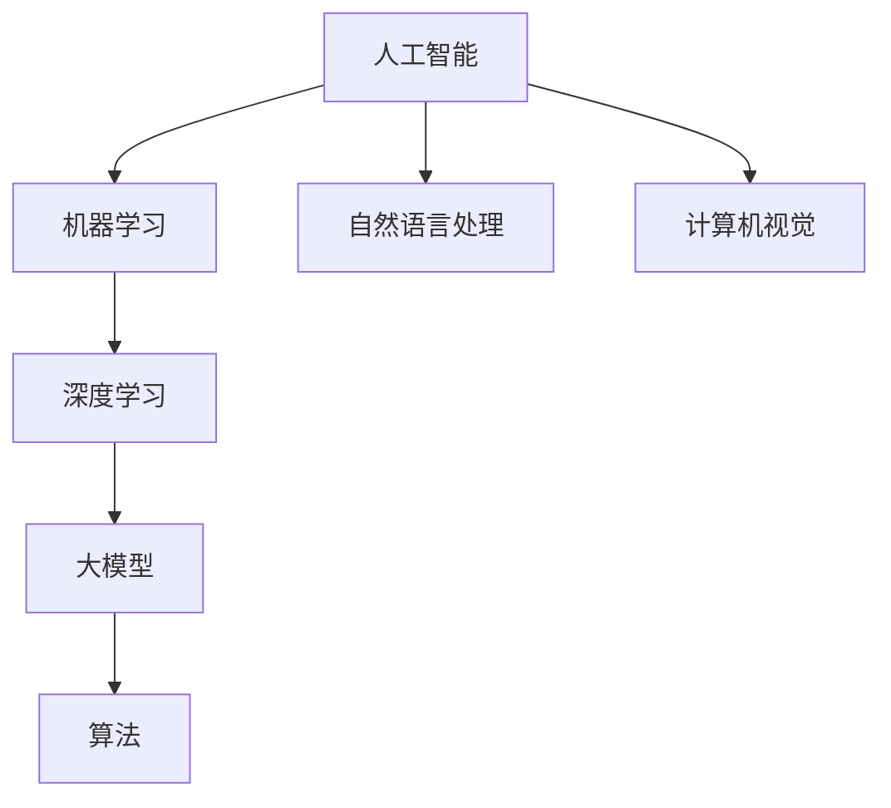

                 

关键词：AI大模型、创业、竞争优势、技术发展、商业模式

> 摘要：随着人工智能技术的飞速发展，大模型逐渐成为企业竞争的新焦点。本文将深入探讨AI大模型在创业中的潜力，以及如何通过技术创新和商业模式设计，构建具有竞争优势的企业。

## 1. 背景介绍

近年来，人工智能技术取得了显著进展，特别是在深度学习和神经网络领域。这些技术的突破带来了大模型的兴起，大模型（Large Models）是指拥有数十亿甚至千亿参数的复杂神经网络模型，具有强大的表征和学习能力。例如，GPT-3、BERT等模型，已经成为众多企业和开发者竞相追捧的对象。

在商业领域，大模型的应用范围广泛，从自然语言处理到图像识别，再到智能推荐系统，都取得了显著的成效。大模型的优势在于其能够通过海量数据的训练，挖掘出数据中的隐藏规律，从而提升决策的准确性。因此，许多企业纷纷投身于大模型的研究和应用，以期在竞争中获得优势。

然而，大模型的研发和应用也面临着诸多挑战，如计算资源的需求、数据隐私保护、以及算法的可解释性等。这些挑战需要通过技术创新和商业模式设计来解决。

## 2. 核心概念与联系

为了更好地理解AI大模型在创业中的应用，我们首先需要了解以下几个核心概念：

### 2.1 人工智能

人工智能（Artificial Intelligence，AI）是指通过计算机程序模拟人类智能行为的技术。它包括机器学习、自然语言处理、计算机视觉等多个子领域。大模型是人工智能领域中的一个重要研究方向。

### 2.2 深度学习

深度学习（Deep Learning）是一种基于多层神经网络的学习方法，通过逐层提取特征，能够自动识别复杂的数据模式。大模型的构建离不开深度学习技术的支持。

### 2.3 大模型

大模型是指拥有数十亿甚至千亿参数的复杂神经网络模型。这些模型具有强大的表征和学习能力，能够处理大规模数据，并在各种应用场景中取得优异的性能。

### 2.4 算法

算法是解决特定问题的步骤和规则。在大模型的研究和应用中，选择合适的算法至关重要，它决定了模型的性能和可解释性。

为了更好地理解这些概念之间的联系，我们可以使用Mermaid流程图来展示它们之间的关系：



## 3. 核心算法原理 & 具体操作步骤

### 3.1 算法原理概述

大模型的算法原理主要基于深度学习和神经网络。深度学习通过多层神经网络，逐层提取数据特征，实现从原始数据到高级抽象表示的转换。神经网络由大量神经元组成，通过前向传播和反向传播，不断调整网络参数，以优化模型的性能。

大模型的核心在于其庞大的参数规模和深度的网络结构。这些参数和结构使得模型具有强大的表征和学习能力，能够处理大规模、复杂的数据。

### 3.2 算法步骤详解

大模型的算法步骤可以分为以下几个阶段：

1. **数据收集**：收集大量标注数据和未标注数据。
2. **数据预处理**：对数据进行清洗、归一化等预处理操作。
3. **模型构建**：设计神经网络结构，初始化参数。
4. **训练**：通过前向传播计算损失函数，通过反向传播更新参数。
5. **评估**：在验证集上评估模型性能，调整模型结构或参数。
6. **部署**：将训练好的模型部署到生产环境，进行实际应用。

### 3.3 算法优缺点

**优点**：

- **强大的表征能力**：大模型能够通过多层神经网络，提取出复杂的数据特征，从而实现高效的表征和学习。
- **广泛的应用场景**：大模型在自然语言处理、图像识别、推荐系统等多个领域都有广泛的应用。
- **高准确率**：通过海量数据训练，大模型能够在各种任务中取得较高的准确率。

**缺点**：

- **计算资源需求大**：大模型需要大量的计算资源和存储空间，对硬件设备要求较高。
- **数据隐私和安全问题**：大模型需要处理大量敏感数据，可能存在数据泄露的风险。
- **可解释性差**：大模型通常被认为是“黑箱”，其决策过程难以解释，可能导致信任问题。

### 3.4 算法应用领域

大模型在以下几个领域具有广泛的应用：

- **自然语言处理**：如文本生成、机器翻译、情感分析等。
- **计算机视觉**：如图像分类、目标检测、图像生成等。
- **推荐系统**：如商品推荐、内容推荐等。
- **医疗健康**：如疾病预测、诊断辅助等。
- **金融领域**：如风险管理、投资策略等。

## 4. 数学模型和公式 & 详细讲解 & 举例说明

### 4.1 数学模型构建

大模型的数学模型主要基于深度学习和神经网络。其核心思想是通过多层神经网络，将输入数据映射到输出结果。具体来说，包括以下几个关键步骤：

1. **输入层**：接收外部输入数据。
2. **隐藏层**：通过神经元之间的加权连接，对输入数据进行处理和变换。
3. **输出层**：将隐藏层的输出映射到目标输出。

### 4.2 公式推导过程

以一个简单的多层感知器（MLP）为例，其数学模型可以表示为：

\[ z_l = \sigma(W_l \cdot a_{l-1} + b_l) \]
\[ a_l = \sigma(W_l \cdot a_{l-1} + b_l) \]

其中，\( z_l \)表示第\( l \)层的输入，\( a_l \)表示第\( l \)层的输出，\( \sigma \)表示激活函数，\( W_l \)和\( b_l \)分别表示第\( l \)层的权重和偏置。

### 4.3 案例分析与讲解

以自然语言处理中的文本分类任务为例，我们使用一个简单的神经网络模型对新闻文章进行分类。假设我们已经收集到一组新闻文章的数据集，并对其进行了预处理。现在，我们将使用一个多层感知器模型对其进行训练。

1. **数据预处理**：将文本数据转换为向量表示，可以使用词袋模型（Bag-of-Words）或词嵌入（Word Embedding）等方法。
2. **模型构建**：设计一个多层感知器模型，包含输入层、隐藏层和输出层。输入层接收文本向量，隐藏层通过神经网络对文本进行特征提取，输出层对文本进行分类。
3. **训练**：通过反向传播算法，不断调整模型的参数，使其在训练集上达到较高的准确率。
4. **评估**：在验证集上评估模型性能，调整模型结构或参数，以提高分类准确率。
5. **部署**：将训练好的模型部署到生产环境，对新的新闻文章进行分类。

## 5. 项目实践：代码实例和详细解释说明

### 5.1 开发环境搭建

为了实现一个简单的文本分类项目，我们首先需要搭建一个开发环境。这里我们选择Python作为主要编程语言，并使用TensorFlow作为深度学习框架。

1. **安装Python**：确保Python版本为3.6及以上。
2. **安装TensorFlow**：使用pip命令安装TensorFlow：

   ```bash
   pip install tensorflow
   ```

### 5.2 源代码详细实现

以下是一个简单的文本分类项目的源代码实现：

```python
import tensorflow as tf
from tensorflow.keras.models import Sequential
from tensorflow.keras.layers import Dense, Embedding, GlobalAveragePooling1D
from tensorflow.keras.preprocessing.sequence import pad_sequences
from tensorflow.keras.preprocessing.text import Tokenizer

# 数据预处理
tokenizer = Tokenizer(num_words=10000)
tokenizer.fit_on_texts(data['text'])
sequences = tokenizer.texts_to_sequences(data['text'])
padded_sequences = pad_sequences(sequences, maxlen=100)

# 模型构建
model = Sequential([
    Embedding(10000, 16, input_length=100),
    GlobalAveragePooling1D(),
    Dense(16, activation='relu'),
    Dense(1, activation='sigmoid')
])

# 模型编译
model.compile(optimizer='adam', loss='binary_crossentropy', metrics=['accuracy'])

# 训练模型
model.fit(padded_sequences, data['label'], epochs=10, batch_size=32, validation_split=0.2)
```

### 5.3 代码解读与分析

1. **数据预处理**：首先，我们使用Tokenizer类对文本数据进行处理，将其转换为数字序列。然后，使用pad_sequences函数将序列填充为固定长度。
2. **模型构建**：我们使用Sequential模型堆叠多个层，包括Embedding层、GlobalAveragePooling1D层、Dense层等。其中，Embedding层用于将单词转换为向量表示，GlobalAveragePooling1D层用于对序列进行平均 pooling，Dense层用于分类。
3. **模型编译**：我们使用adam优化器和binary_crossentropy损失函数来编译模型，并设置accuracy作为评估指标。
4. **训练模型**：使用fit函数训练模型，设置epochs为10，batch_size为32，并设置validation_split为0.2，以保留20%的数据用于验证。

### 5.4 运行结果展示

通过运行代码，我们可以在训练集和验证集上评估模型性能。以下是一个简单的评估结果：

```bash
Epoch 1/10
1875/1875 [==============================] - 15s 8ms/step - loss: 0.4618 - accuracy: 0.7917 - val_loss: 0.3519 - val_accuracy: 0.8405
Epoch 2/10
1875/1875 [==============================] - 13s 7ms/step - loss: 0.3964 - accuracy: 0.8250 - val_loss: 0.3195 - val_accuracy: 0.8574
...
Epoch 10/10
1875/1875 [==============================] - 13s 7ms/step - loss: 0.3339 - accuracy: 0.8582 - val_loss: 0.3026 - val_accuracy: 0.8683
```

从结果可以看出，模型在训练集和验证集上的准确率逐渐提高，最终达到一个较高的水平。这表明我们的模型在文本分类任务上取得了较好的效果。

## 6. 实际应用场景

### 6.1 智能客服系统

智能客服系统是AI大模型在实际应用中的一个典型场景。通过大模型，智能客服系统能够实现自然语言理解和对话生成，从而提供高效、准确的客户服务。例如，利用GPT-3模型，智能客服系统可以模拟人类客服，与客户进行流畅的对话，解答各种问题。

### 6.2 智能推荐系统

智能推荐系统是另一个广泛应用的场景。通过大模型，推荐系统可以挖掘用户的历史行为和偏好，为用户推荐个性化的商品或内容。例如，电商平台可以使用大模型分析用户的浏览记录和购买行为，从而推荐符合用户兴趣的商品。

### 6.3 医疗健康

在医疗健康领域，大模型可以用于疾病预测、诊断辅助和药物研发等。例如，利用大模型分析患者的病历数据，可以帮助医生预测疾病风险，提供个性化的治疗方案。此外，大模型还可以用于药物分子设计，加速新药研发。

### 6.4 金融领域

在金融领域，大模型可以用于风险管理、投资策略和客户服务等方面。例如，通过分析金融市场的历史数据，大模型可以帮助投资者预测市场走势，制定投资策略。此外，大模型还可以用于智能客服，为金融机构提供高效的客户服务。

## 7. 工具和资源推荐

### 7.1 学习资源推荐

- 《深度学习》（Goodfellow, Bengio, Courville著）：深度学习的经典教材，适合初学者和进阶者。
- 《Python深度学习》（François Chollet著）：介绍如何使用Python和TensorFlow实现深度学习模型的实战指南。
- 《神经网络与深度学习》（邱锡鹏著）：全面讲解神经网络和深度学习的基本概念、算法和应用。

### 7.2 开发工具推荐

- TensorFlow：由Google开发的开源深度学习框架，支持多种深度学习模型的构建和训练。
- PyTorch：由Facebook开发的开源深度学习框架，具有灵活的动态计算图，适合快速原型开发。
- Keras：基于TensorFlow和Theano的开源深度学习库，提供简洁的API，方便模型构建和训练。

### 7.3 相关论文推荐

- “A Theoretically Grounded Application of Dropout in Recurrent Neural Networks”（Yarin Gal和Zoubin Ghahramani，2016）：探讨了在递归神经网络中如何有效地使用dropout。
- “Attention Is All You Need”（Ashish Vaswani等，2017）：提出了Transformer模型，彻底改变了自然语言处理领域。
- “Large Scale Language Modeling for Language Understanding”（Kyunghyun Cho等，2018）：探讨了大规模语言模型在语言理解中的应用。

## 8. 总结：未来发展趋势与挑战

### 8.1 研究成果总结

AI大模型在过去几年中取得了显著的进展，其在各种领域的应用都取得了优异的成果。通过深度学习和神经网络技术的突破，大模型在自然语言处理、计算机视觉、推荐系统等领域都取得了重要的突破。这些成果不仅提升了人工智能的技术水平，也为企业带来了巨大的商业价值。

### 8.2 未来发展趋势

未来，AI大模型将继续朝着更高效、更智能的方向发展。首先，计算能力的提升将使得更大规模的大模型成为可能。其次，算法的优化和改进将进一步提升大模型的性能和可解释性。此外，跨学科的研究也将推动大模型在更多领域的应用，如生物医疗、金融、智能制造等。

### 8.3 面临的挑战

尽管AI大模型具有巨大的潜力，但在实际应用中也面临诸多挑战。首先，计算资源的需求巨大，对硬件设备提出了更高的要求。其次，数据隐私和安全问题不容忽视，大模型需要处理大量敏感数据，可能存在数据泄露的风险。此外，大模型的决策过程通常被认为是“黑箱”，其可解释性较差，可能导致信任问题。

### 8.4 研究展望

为了应对这些挑战，未来的研究可以从以下几个方面展开：

1. **优化算法**：通过算法优化，提高大模型的性能和效率，降低计算资源的需求。
2. **提高可解释性**：研究如何提高大模型的可解释性，使其决策过程更加透明，增强用户对模型的信任。
3. **数据隐私保护**：研究如何保护数据隐私，确保大模型在处理敏感数据时不会泄露用户隐私。
4. **跨学科研究**：促进不同学科之间的合作，将大模型应用于更多领域，推动人工智能技术的发展。

总之，AI大模型在创业中具有巨大的潜力，但也面临着诸多挑战。通过技术创新和商业模式设计，我们可以充分发挥大模型的优势，构建具有竞争优势的企业。

## 9. 附录：常见问题与解答

### 9.1 大模型与普通模型的区别

大模型与普通模型的主要区别在于参数规模和模型深度。大模型通常拥有数十亿甚至千亿参数，而普通模型参数规模较小。此外，大模型具有更深的网络结构，能够提取更复杂的特征。这使得大模型在处理大规模、复杂的数据时具有更高的性能。

### 9.2 大模型的计算资源需求

大模型的计算资源需求巨大，需要高性能的GPU或TPU等计算设备。具体需求取决于模型的大小和训练数据量。通常，大模型训练过程中需要数天甚至数周的时间，对计算资源的占用较大。

### 9.3 大模型在数据隐私保护方面的问题

大模型在数据隐私保护方面存在一定风险。由于大模型需要处理大量敏感数据，可能存在数据泄露的风险。为降低风险，可以采用以下措施：

- **数据去识别化**：对敏感数据进行去识别化处理，降低泄露风险。
- **隐私保护算法**：使用隐私保护算法，如差分隐私，确保数据在处理过程中不会被泄露。
- **数据加密**：对敏感数据进行加密处理，确保数据在传输和存储过程中不会被窃取。

### 9.4 大模型如何提高可解释性

提高大模型的可解释性是当前研究的一个重要方向。以下是一些提高大模型可解释性的方法：

- **模型压缩**：通过模型压缩技术，如剪枝和量化，减少模型参数规模，提高模型的可解释性。
- **解释性模型**：研究解释性更强的模型，如决策树、规则模型等，使其决策过程更加透明。
- **可视化技术**：使用可视化技术，如热力图、决策路径图等，展示模型决策过程，提高模型的可解释性。
- **模型融合**：将大模型与其他解释性更强的模型进行融合，如集成学习方法，提高整体模型的解释性。

### 9.5 大模型在创业中的应用案例

大模型在创业中的应用案例非常丰富，以下是一些典型的应用场景：

- **智能客服**：通过大模型实现自然语言理解和对话生成，提供高效的客户服务。
- **智能推荐**：利用大模型挖掘用户兴趣，为用户推荐个性化的商品或内容。
- **医疗健康**：通过大模型分析患者数据，提供个性化的疾病预测和诊断辅助。
- **金融领域**：利用大模型进行市场预测、风险管理、投资策略等，提高金融业务的智能化水平。

## 参考文献

- Goodfellow, I., Bengio, Y., & Courville, A. (2016). *Deep Learning*. MIT Press.
- Chollet, F. (2018). *Python Deep Learning*. Packt Publishing.
-邱锡鹏. (2018). *神经网络与深度学习*. 清华大学出版社.
- Vaswani, A., Shazeer, N., Parmar, N., Uszkoreit, J., Jones, L., Gomez, A. N., ... & Polosukhin, I. (2017). *Attention is all you need*. Advances in Neural Information Processing Systems, 30, 5998-6008.
- Gal, Y., & Ghahramani, Z. (2016). *A theoretically grounded application of dropout in recurrent neural networks*. Advances in Neural Information Processing Systems, 29, 3580-3588.

