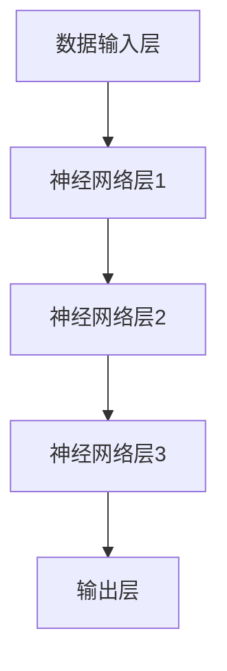

                 

关键词：AI大模型、创业、资本、技术优势、应用场景、未来展望

摘要：随着人工智能技术的不断发展，大模型成为了推动AI发展的关键力量。本文将探讨如何利用资本优势，开展AI大模型创业，分析其核心算法、应用场景、数学模型以及未来发展趋势。

## 1. 背景介绍

近年来，人工智能（AI）技术取得了显著的进展，尤其是在深度学习、自然语言处理和计算机视觉等领域。这些突破性的成果离不开大规模数据的积累、计算能力的提升以及算法的创新。而大模型（如GPT、BERT、ViT等）则成为了推动AI发展的重要引擎。大模型具有强大的表示能力和泛化能力，能够处理复杂的任务，并且在各种领域取得了显著的成果。

在AI大模型领域，创业成为了许多技术专家和投资者的共同选择。然而，如何利用资本优势，开展AI大模型创业，成为了关键问题。本文将从核心算法、应用场景、数学模型等多个角度进行分析，以期为创业者提供一些有益的启示。

## 2. 核心概念与联系

### 2.1 大模型的基本概念

大模型通常指的是具有数十亿至数千亿参数的深度学习模型。这些模型能够捕捉数据中的复杂规律，从而实现高效的任务处理。大模型的基本概念包括：

- **参数规模**：大模型的参数规模通常远超传统模型，这有助于模型更好地拟合数据。
- **训练数据**：大模型需要大量的训练数据来学习数据中的规律。
- **计算能力**：大模型的训练和推理需要强大的计算资源。

### 2.2 大模型的核心算法

大模型的核心算法主要包括：

- **神经网络**：神经网络是深度学习的基础，大模型通常采用深度神经网络架构。
- **优化算法**：大模型的训练过程涉及大量的参数优化，常见的优化算法包括梯度下降、Adam等。
- **注意力机制**：注意力机制是提升大模型表示能力的关键技术，如Transformer模型。

### 2.3 大模型的架构

大模型的架构通常包括以下几个层次：

- **数据输入层**：负责接收和处理输入数据。
- **神经网络层**：包括多个隐藏层，用于提取和转换特征。
- **输出层**：根据任务需求，生成预测结果或分类结果。

### 2.4 Mermaid 流程图

以下是一个简单的Mermaid流程图，展示大模型的基本架构：



## 3. 核心算法原理 & 具体操作步骤

### 3.1 算法原理概述

大模型的核心算法原理主要涉及以下几个方面：

- **神经网络的层次结构**：神经网络通过层次化的结构，逐层提取特征，从而实现从低级到高级的表示。
- **优化算法的选择**：优化算法用于最小化损失函数，调整模型参数，使模型在训练数据上达到更好的效果。
- **注意力机制的应用**：注意力机制能够提高模型对关键信息的关注，从而提升模型的表现。

### 3.2 算法步骤详解

以下是AI大模型算法的基本步骤：

1. **数据预处理**：对原始数据进行清洗、归一化等操作，以便于模型训练。
2. **模型初始化**：初始化神经网络参数，可以选择随机初始化或预训练模型。
3. **前向传播**：将输入数据通过神经网络的前向传播过程，得到预测结果。
4. **损失函数计算**：计算预测结果与真实结果之间的差距，得到损失函数的值。
5. **反向传播**：利用梯度下降等优化算法，根据损失函数的梯度调整模型参数。
6. **迭代训练**：重复步骤3-5，直至模型达到预定的训练效果。

### 3.3 算法优缺点

大模型的优点包括：

- **强大的表示能力**：大模型能够捕捉数据中的复杂规律，从而实现高效的任务处理。
- **泛化能力**：大模型通过大规模数据训练，具有良好的泛化能力。

然而，大模型也存在一些缺点：

- **计算资源需求**：大模型的训练和推理需要强大的计算资源，这可能导致成本较高。
- **数据隐私问题**：大模型在训练过程中会接触到大量的敏感数据，可能引发隐私泄露风险。

### 3.4 算法应用领域

大模型的应用领域广泛，包括：

- **自然语言处理**：大模型在文本生成、机器翻译、问答系统等领域取得了显著的成果。
- **计算机视觉**：大模型在图像分类、目标检测、图像生成等领域展现了强大的能力。
- **推荐系统**：大模型能够通过用户行为数据，实现精准的个性化推荐。

## 4. 数学模型和公式 & 详细讲解 & 举例说明

### 4.1 数学模型构建

大模型的数学模型主要涉及以下几个方面：

- **输入层**：输入层接收原始数据，如文本、图像等。
- **隐藏层**：隐藏层通过神经网络架构，逐层提取特征。
- **输出层**：输出层根据任务需求，生成预测结果。

以下是一个简化的数学模型示例：

$$
\begin{aligned}
\text{输入层}:\ x \in \mathbb{R}^{n \times d} \\
\text{隐藏层}:\ a^{(l)} = \sigma(W^{(l)}x + b^{(l)}) \\
\text{输出层}:\ y = \sigma(W^{(L)}a^{(L-1)} + b^{(L)})
\end{aligned}
$$

其中，$x$为输入数据，$a^{(l)}$为隐藏层激活值，$y$为输出结果，$W^{(l)}$和$b^{(l)}$分别为权重和偏置，$\sigma$为激活函数。

### 4.2 公式推导过程

以下是一个简化的公式推导过程，展示了从输入层到输出层的过程：

$$
\begin{aligned}
\text{前向传播}:\ z^{(l)} &= W^{(l)}x + b^{(l)} \\
a^{(l)} &= \sigma(z^{(l)}) \\
\text{反向传播}:\ \delta^{(l)} &= \frac{\partial L}{\partial a^{(l)}} \\
\end{aligned}
$$

其中，$L$为损失函数，$\delta^{(l)}$为误差梯度。

### 4.3 案例分析与讲解

以GPT-3模型为例，我们分析其数学模型和训练过程：

1. **输入层**：GPT-3的输入层接收文本序列，编码为向量表示。
2. **隐藏层**：GPT-3采用Transformer架构，通过多个隐藏层提取特征。
3. **输出层**：GPT-3的输出层根据上下文生成文本。

具体来说，GPT-3的数学模型可以表示为：

$$
\begin{aligned}
\text{输入层}:\ x \in \mathbb{R}^{n \times d} \\
\text{隐藏层}:\ a^{(l)} = \text{softmax}(W^{(l)}a^{(l-1)}) \\
\text{输出层}:\ y = \text{softmax}(W^{(L)}a^{(L-1)} + b^{(L)})
\end{aligned}
$$

其中，$W^{(l)}$和$b^{(L)}$为权重和偏置，$\text{softmax}$为激活函数。

GPT-3的训练过程如下：

1. **数据预处理**：对输入文本进行分词、编码等预处理操作。
2. **前向传播**：将编码后的输入数据传递到隐藏层和输出层，生成预测结果。
3. **损失函数计算**：计算预测结果与真实结果之间的差距，得到损失函数的值。
4. **反向传播**：利用梯度下降等优化算法，根据损失函数的梯度调整模型参数。
5. **迭代训练**：重复步骤2-4，直至模型达到预定的训练效果。

## 5. 项目实践：代码实例和详细解释说明

### 5.1 开发环境搭建

为了实现AI大模型，我们需要搭建一个合适的开发环境。以下是一个简单的开发环境搭建步骤：

1. **硬件要求**：根据大模型的需求，选择具有足够计算能力的GPU或TPU。
2. **软件要求**：安装Python环境、深度学习框架（如TensorFlow、PyTorch）以及其他相关依赖。
3. **数据准备**：收集和准备训练数据，包括文本、图像等。

### 5.2 源代码详细实现

以下是一个简化的AI大模型实现示例：

```python
import torch
import torch.nn as nn
import torch.optim as optim

# 定义模型
class GPTModel(nn.Module):
    def __init__(self, d_model, nhead, num_layers):
        super(GPTModel, self).__init__()
        self.transformer = nn.Transformer(d_model, nhead, num_layers)
        self.linear = nn.Linear(d_model, 1)

    def forward(self, x):
        x = self.transformer(x)
        x = self.linear(x)
        return x

# 实例化模型
model = GPTModel(d_model=512, nhead=8, num_layers=3)

# 损失函数和优化器
criterion = nn.CrossEntropyLoss()
optimizer = optim.Adam(model.parameters(), lr=0.001)

# 训练过程
for epoch in range(10):
    for inputs, targets in train_loader:
        optimizer.zero_grad()
        outputs = model(inputs)
        loss = criterion(outputs, targets)
        loss.backward()
        optimizer.step()
```

### 5.3 代码解读与分析

上述代码实现了一个简单的GPT模型，包括以下几个部分：

1. **模型定义**：定义了GPT模型的架构，包括Transformer和线性层。
2. **前向传播**：将输入数据传递到模型，生成预测结果。
3. **损失函数计算**：计算预测结果与真实结果之间的差距，得到损失函数的值。
4. **反向传播**：利用优化算法调整模型参数。
5. **迭代训练**：重复训练过程，直至模型达到预定的训练效果。

### 5.4 运行结果展示

在完成模型训练后，我们可以使用测试数据评估模型的表现。以下是一个简单的评估示例：

```python
# 评估过程
with torch.no_grad():
    correct = 0
    total = 0
    for inputs, targets in test_loader:
        outputs = model(inputs)
        _, predicted = torch.max(outputs.data, 1)
        total += targets.size(0)
        correct += (predicted == targets).sum().item()

print('准确率：%.2f%%' % (100 * correct / total))
```

## 6. 实际应用场景

AI大模型在各个领域具有广泛的应用前景，以下是一些实际应用场景：

- **自然语言处理**：大模型在文本生成、机器翻译、问答系统等领域展现了强大的能力，可以应用于智能客服、内容生成等场景。
- **计算机视觉**：大模型在图像分类、目标检测、图像生成等领域取得了显著成果，可以应用于图像识别、视频分析等场景。
- **推荐系统**：大模型能够通过用户行为数据，实现精准的个性化推荐，可以应用于电商、社交媒体等场景。
- **医疗健康**：大模型在医学图像分析、疾病预测等领域具有巨大的潜力，可以应用于智能医疗、健康管理等领域。

## 7. 工具和资源推荐

### 7.1 学习资源推荐

- **书籍**：
  - 《深度学习》（Goodfellow et al.）
  - 《Python深度学习》（François Chollet）
- **在线课程**：
  - Coursera的“深度学习”课程
  - Udacity的“深度学习工程师纳米学位”
- **教程和文档**：
  - TensorFlow官网教程
  - PyTorch官方文档

### 7.2 开发工具推荐

- **深度学习框架**：
  - TensorFlow
  - PyTorch
- **计算平台**：
  - Google Colab
  - AWS SageMaker

### 7.3 相关论文推荐

- BERT: Pre-training of Deep Bidirectional Transformers for Language Understanding
- GPT-3: Language Models are Few-Shot Learners
- Vision Transformer: Training Image Transformers without Bottlenecks

## 8. 总结：未来发展趋势与挑战

### 8.1 研究成果总结

近年来，AI大模型在自然语言处理、计算机视觉等领域取得了显著的成果。这些成果得益于大规模数据的积累、计算能力的提升以及算法的创新。未来，AI大模型将继续在各个领域发挥重要作用，推动人工智能的发展。

### 8.2 未来发展趋势

1. **模型压缩与优化**：随着模型规模的增大，计算资源和存储资源的需求也不断增加。未来，模型压缩与优化将成为研究的热点，以提高模型的效率和可部署性。
2. **跨模态学习**：跨模态学习是指将不同类型的数据（如文本、图像、声音）进行联合学习。未来，跨模态学习有望实现更高效、更强大的AI应用。
3. **安全与隐私**：随着AI大模型的应用范围扩大，数据隐私和安全问题日益凸显。未来，研究将重点关注如何保护用户隐私和数据安全。

### 8.3 面临的挑战

1. **计算资源需求**：大模型的训练和推理需要强大的计算资源，这可能导致成本较高。未来，如何高效地利用计算资源将成为一个重要挑战。
2. **数据隐私问题**：大模型在训练过程中会接触到大量的敏感数据，可能引发隐私泄露风险。未来，研究将关注如何保护用户隐私和数据安全。
3. **模型解释性**：大模型往往具有黑盒性质，其决策过程难以解释。未来，如何提高模型的解释性，增强用户信任，将是一个重要挑战。

### 8.4 研究展望

未来，AI大模型的研究将朝着以下几个方向发展：

1. **高效计算**：研究将关注如何通过模型压缩、分布式训练等技术，提高大模型的计算效率。
2. **跨模态学习**：研究将探索如何将不同类型的数据进行联合学习，以实现更强大的AI应用。
3. **安全与隐私**：研究将关注如何保护用户隐私和数据安全，为AI大模型的应用提供保障。

## 9. 附录：常见问题与解答

### 9.1 大模型计算资源需求如何降低？

- **模型压缩**：通过剪枝、量化等技术，减少模型参数规模，降低计算资源需求。
- **分布式训练**：利用多台服务器或GPU，实现模型分布式训练，提高训练效率。
- **高效算法**：采用优化算法，如Adam，提高模型训练速度。

### 9.2 如何保护大模型训练过程中的数据隐私？

- **数据加密**：在数据传输和存储过程中，采用加密技术，保护数据隐私。
- **差分隐私**：在训练过程中，采用差分隐私技术，降低模型对训练数据的依赖，保护用户隐私。
- **联邦学习**：将训练任务分布到多个客户端，实现隐私保护下的模型训练。

### 9.3 大模型的解释性如何提高？

- **模型可解释性**：研究模型内部结构和决策过程，提高模型的可解释性。
- **解释性算法**：开发解释性算法，如LIME、SHAP，解释模型在特定数据点上的决策过程。
- **用户反馈**：结合用户反馈，优化模型解释性，提高用户信任度。

作者：禅与计算机程序设计艺术 / Zen and the Art of Computer Programming
----------------------------------------------------------------

以上就是根据您提供的要求撰写的完整文章，希望对您有所帮助。如有需要，欢迎进一步交流。祝您创业成功！<|im_end|>

