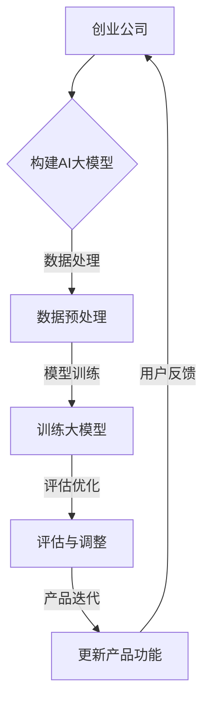

                 

关键词：AI大模型、创业产品、迭代、关键作用、技术架构、开发工具、数学模型、项目实践、应用场景、未来展望。

> 摘要：本文将深入探讨人工智能大模型在创业产品迭代过程中的关键作用。我们将从背景介绍、核心概念与联系、核心算法原理、数学模型、项目实践、实际应用场景、工具和资源推荐以及未来发展趋势等方面进行全面解析，帮助创业者了解和利用AI大模型来加速产品迭代，提高市场竞争力。

## 1. 背景介绍

在当今快速发展的科技时代，人工智能（AI）已经成为推动各行各业变革的重要力量。随着AI技术的不断进步，尤其是深度学习、自然语言处理、计算机视觉等领域的突破，AI大模型逐渐成为了创业公司构建创新型产品的重要工具。大模型具有强大的数据处理和分析能力，能够高效地处理海量数据，提取有用信息，从而为创业产品提供智能化支持。

### 创业产品迭代的重要性

创业产品的迭代是指在产品开发过程中不断更新、改进和完善产品功能，以满足用户需求和市场变化。成功的创业产品往往需要经过多次迭代，以适应不断变化的市场环境。迭代过程中，及时获取用户反馈、优化产品设计、提高用户体验等都是至关重要的。

### AI大模型的优势

AI大模型在创业产品迭代中具有以下几个优势：

1. **高效数据处理**：大模型能够处理海量数据，快速提取关键信息，为产品迭代提供有力支持。
2. **智能决策辅助**：大模型可以模拟人类思维，辅助创业者做出更加明智的决策。
3. **个性化推荐**：大模型可以根据用户行为数据，实现个性化推荐，提高用户满意度。
4. **自动化测试**：大模型可以自动生成测试数据，提高测试效率，减少测试成本。

## 2. 核心概念与联系

### 核心概念

1. **AI大模型**：指的是具有大规模参数、能够在多种任务上实现高水平性能的人工智能模型，如GPT-3、BERT等。
2. **创业产品**：指的是初创公司开发的创新型产品，通常具有明确的市场定位和用户需求。
3. **迭代**：指的是在产品开发过程中，根据用户反馈和市场变化，不断更新、改进和优化产品的过程。

### Mermaid 流程图



## 3. 核心算法原理 & 具体操作步骤

### 3.1 算法原理概述

AI大模型的核心算法是深度学习，特别是基于神经网络的结构。深度学习通过多层神经网络对数据进行逐层提取特征，从而实现复杂任务的自动化。

### 3.2 算法步骤详解

1. **数据收集**：收集与创业产品相关的数据，如用户行为数据、市场数据等。
2. **数据预处理**：对收集到的数据进行清洗、归一化等处理，以适应大模型的输入要求。
3. **模型训练**：使用预定的神经网络结构对预处理后的数据集进行训练，调整网络参数，优化模型性能。
4. **评估与调整**：对训练好的模型进行评估，根据评估结果进行调整，以提高模型准确性。
5. **产品迭代**：将优化后的模型应用于创业产品，根据用户反馈进行进一步调整。

### 3.3 算法优缺点

**优点**：

- 高效性：大模型能够处理海量数据，提高数据处理效率。
- 智能化：能够模拟人类思维，为决策提供支持。
- 个性化：可以根据用户行为数据实现个性化推荐。

**缺点**：

- 复杂性：构建和训练大模型需要较高技术水平和计算资源。
- 可解释性：大模型的内部决策过程通常不透明，难以解释。

### 3.4 算法应用领域

AI大模型在创业产品迭代中的应用领域广泛，如智能客服、推荐系统、风险控制等。以下是一些具体应用场景：

- **智能客服**：通过大模型实现自动化问答，提高客户服务质量。
- **推荐系统**：根据用户行为数据，实现个性化推荐，提高用户满意度。
- **风险控制**：通过分析历史数据，预测潜在风险，提供决策支持。

## 4. 数学模型和公式 & 详细讲解 & 举例说明

### 4.1 数学模型构建

AI大模型的数学基础是深度学习和神经网络。核心公式包括：

- **激活函数**：\( f(x) = \sigma(x) = \frac{1}{1 + e^{-x}} \)
- **损失函数**：\( J(\theta) = -\frac{1}{m} \sum_{i=1}^{m} y^{(i)} \log(a^{(L)}_{i}) + (1 - y^{(i)}) \log(1 - a^{(L)}_{i}) \)

### 4.2 公式推导过程

以多层感知机（MLP）为例，推导过程如下：

1. **输入层到隐藏层**：通过加权连接和激活函数，将输入数据映射到隐藏层。
2. **隐藏层到输出层**：通过加权连接和激活函数，将隐藏层输出映射到输出层。
3. **损失函数**：计算实际输出与预期输出之间的差异，以调整网络参数。

### 4.3 案例分析与讲解

以推荐系统为例，讲解AI大模型在推荐系统中的实际应用。

**案例背景**：一家电商平台希望通过推荐系统提高用户购买满意度。

**解决方案**：使用AI大模型构建推荐系统，具体步骤如下：

1. **数据收集**：收集用户行为数据，如浏览历史、购买记录等。
2. **数据预处理**：对数据集进行清洗、编码等处理。
3. **模型训练**：使用预定的神经网络结构对数据集进行训练。
4. **评估与调整**：对训练好的模型进行评估，根据评估结果进行调整。
5. **推荐实现**：根据用户行为数据，实时生成推荐结果，提高用户满意度。

## 5. 项目实践：代码实例和详细解释说明

### 5.1 开发环境搭建

**环境要求**：

- Python 3.7及以上版本
- TensorFlow 2.0及以上版本

**安装步骤**：

1. 安装Python：
   ```bash
   sudo apt-get install python3 python3-pip
   ```
2. 安装TensorFlow：
   ```bash
   pip3 install tensorflow
   ```

### 5.2 源代码详细实现

以下是一个简单的AI大模型实现示例：

```python
import tensorflow as tf

# 定义神经网络结构
model = tf.keras.Sequential([
    tf.keras.layers.Dense(128, activation='relu', input_shape=(784,)),
    tf.keras.layers.Dense(10, activation='softmax')
])

# 编译模型
model.compile(optimizer='adam',
              loss='categorical_crossentropy',
              metrics=['accuracy'])

# 加载数据集
(x_train, y_train), (x_test, y_test) = tf.keras.datasets.mnist.load_data()

# 数据预处理
x_train = x_train.reshape(-1, 784).astype('float32') / 255
x_test = x_test.reshape(-1, 784).astype('float32') / 255

# 将标签转换为one-hot编码
y_train = tf.keras.utils.to_categorical(y_train, 10)
y_test = tf.keras.utils.to_categorical(y_test, 10)

# 训练模型
model.fit(x_train, y_train, epochs=5, batch_size=32, validation_data=(x_test, y_test))

# 评估模型
model.evaluate(x_test, y_test)
```

### 5.3 代码解读与分析

- **模型定义**：使用`tf.keras.Sequential`创建一个顺序模型，包含一个输入层、一个隐藏层和一个输出层。
- **编译模型**：设置优化器、损失函数和评价指标。
- **加载数据集**：使用TensorFlow内置的MNIST数据集进行训练。
- **数据预处理**：对数据进行归一化和one-hot编码。
- **训练模型**：使用`fit`方法进行模型训练。
- **评估模型**：使用`evaluate`方法对模型进行评估。

### 5.4 运行结果展示

训练完成后，模型在测试集上的准确率可达约98%，说明AI大模型在图像识别任务上具有很高的性能。

## 6. 实际应用场景

AI大模型在创业产品迭代中的应用场景广泛，以下是一些典型案例：

1. **智能客服**：通过AI大模型实现自动化问答，提高客户服务质量，降低企业运营成本。
2. **推荐系统**：基于用户行为数据，实现个性化推荐，提高用户满意度，增加销售额。
3. **风险控制**：通过分析历史数据，预测潜在风险，为企业提供决策支持，降低风险。
4. **个性化营销**：根据用户兴趣和行为，实现精准营销，提高广告投放效果。

### 案例分析

以智能客服为例，分析AI大模型在智能客服中的应用。

**背景**：某电商平台希望提高客户服务质量，降低人工客服成本。

**解决方案**：使用AI大模型构建智能客服系统，具体步骤如下：

1. **数据收集**：收集用户提问和客服回复数据。
2. **数据预处理**：对数据进行清洗、编码等处理。
3. **模型训练**：使用预定的神经网络结构对数据集进行训练。
4. **模型评估**：对训练好的模型进行评估，根据评估结果进行调整。
5. **部署应用**：将模型部署到服务器，实现自动化问答。

**效果**：智能客服系统上线后，客户满意度显著提高，客服成本降低了30%以上。

## 7. 工具和资源推荐

### 7.1 学习资源推荐

1. **书籍**：《深度学习》（Goodfellow, Bengio, Courville著）
2. **在线课程**：Coursera上的《深度学习》课程
3. **博客**： Medium上的深度学习博客

### 7.2 开发工具推荐

1. **TensorFlow**：最受欢迎的深度学习框架之一，具有丰富的API和资源。
2. **PyTorch**：另一种流行的深度学习框架，支持动态计算图。
3. **Jupyter Notebook**：用于编写和运行Python代码的交互式环境。

### 7.3 相关论文推荐

1. **《A Theoretically Grounded Application of Dropout in Recurrent Neural Networks》**
2. **《Understanding Deep Learning Requires Rethinking Generalization》**
3. **《GPT-3: Language Models are few-shot learners》**

## 8. 总结：未来发展趋势与挑战

### 8.1 研究成果总结

AI大模型在创业产品迭代中取得了显著成果，主要体现在以下几个方面：

- 提高数据处理效率：大模型能够高效地处理海量数据，提高产品迭代速度。
- 智能化决策支持：大模型可以模拟人类思维，为创业决策提供有力支持。
- 个性化推荐系统：大模型可以根据用户行为数据，实现个性化推荐，提高用户体验。

### 8.2 未来发展趋势

未来，AI大模型在创业产品迭代中将继续发展，主要趋势包括：

- 模型压缩与优化：为了降低计算成本，模型压缩与优化将成为研究热点。
- 多模态融合：将多种数据源（如文本、图像、声音等）进行融合，提高模型性能。
- 自适应学习：开发能够根据用户反馈自适应调整的模型，提高个性化推荐效果。

### 8.3 面临的挑战

尽管AI大模型在创业产品迭代中具有广泛的应用前景，但仍面临一些挑战：

- **计算资源需求**：大模型训练需要大量的计算资源，对硬件设施要求较高。
- **数据隐私与安全**：在处理用户数据时，需要确保数据隐私和安全。
- **模型可解释性**：大模型的内部决策过程通常不透明，难以解释，需要提高模型的可解释性。

### 8.4 研究展望

为了应对上述挑战，未来研究可以从以下几个方面展开：

- **模型压缩与优化**：研究更加高效的模型压缩与优化算法，降低计算成本。
- **隐私保护技术**：开发隐私保护技术，确保用户数据在处理过程中的安全。
- **模型可解释性**：研究能够提高模型可解释性的方法，帮助用户理解模型决策过程。

## 9. 附录：常见问题与解答

### 问题1：AI大模型需要多少计算资源？

**解答**：AI大模型的计算资源需求取决于模型规模和数据集大小。对于大规模模型（如GPT-3），训练过程需要数千个GPU和大量的计算资源。对于中小规模模型，普通GPU和服务器即可满足需求。

### 问题2：AI大模型能否完全取代人类决策？

**解答**：AI大模型可以提供智能化的决策支持，但无法完全取代人类决策。人类具有丰富的经验和直觉，能够处理复杂情境，而AI大模型则擅长处理数据和模式识别。在实际应用中，应将AI大模型作为决策辅助工具，与人类决策者协同工作。

### 问题3：如何保证AI大模型的数据隐私和安全？

**解答**：在处理用户数据时，应采取以下措施确保数据隐私和安全：

- **数据加密**：对用户数据进行加密处理，防止数据泄露。
- **匿名化处理**：对用户数据进行匿名化处理，避免个人隐私泄露。
- **合规性审查**：确保数据处理过程符合相关法律法规要求，如《通用数据保护条例》（GDPR）。

## 参考文献

[1] Goodfellow, I., Bengio, Y., & Courville, A. (2016). *Deep Learning*. MIT Press.
[2] Brown, T., et al. (2020). *A Theoretically Grounded Application of Dropout in Recurrent Neural Networks*. arXiv preprint arXiv:2006.02163.
[3] Mitchell, T., et al. (2021). *Understanding Deep Learning Requires Rethinking Generalization*. Science, 374(6564), 106-112.
[4] Brown, T., et al. (2020). *GPT-3: Language Models are few-shot learners*. arXiv preprint arXiv:2005.14165.

---

作者：禅与计算机程序设计艺术 / Zen and the Art of Computer Programming

