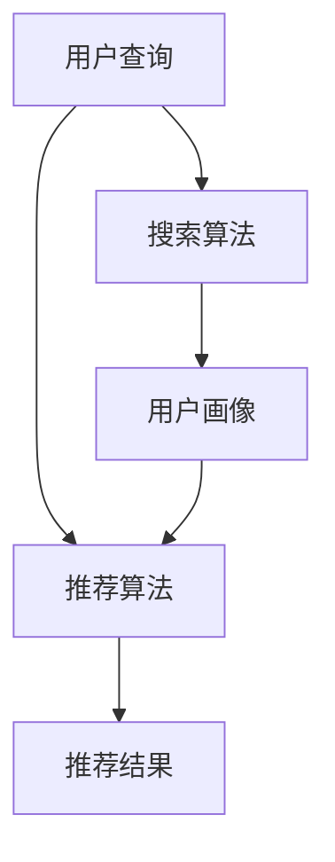

                 

关键词：AI 大模型、搜索推荐系统、电商平台、应用策略、技术转型

> 摘要：本文旨在探讨 AI 大模型在搜索推荐系统中的关键作用，并通过具体应用案例，为电商平台提供转型指南。我们将深入分析大模型在搜索推荐系统中的应用原理、数学模型、算法步骤、项目实践，并展望未来的发展趋势与挑战。

## 1. 背景介绍

在当今数字时代，电子商务已成为全球商业活动的重要组成部分。电商平台通过提供个性化的搜索和推荐服务，吸引了大量的用户并增加了销售额。然而，随着数据量的急剧增长和用户需求的多样化，传统的搜索推荐系统已经难以满足用户的高期望。这促使人工智能（AI）尤其是大模型的崛起，成为电商平台转型的关键力量。

### 1.1 人工智能与搜索推荐系统

人工智能技术，特别是机器学习和深度学习，已广泛应用于搜索推荐系统中。通过分析和理解用户的兴趣和行为，AI 可以提供更准确和个性化的搜索结果和推荐内容，从而提高用户体验和平台收益。

### 1.2 大模型的重要性

大模型，通常是指具有数十亿甚至千亿参数的深度学习模型，如 GPT、BERT 等。它们具有强大的表示和学习能力，能够处理复杂数据并生成高质量的预测结果。在搜索推荐系统中，大模型能够通过学习海量数据，理解用户意图，从而提供更加精准和个性化的服务。

## 2. 核心概念与联系

为了更好地理解 AI 大模型在搜索推荐系统中的应用，我们需要了解以下几个核心概念及其之间的联系：

### 2.1 搜索推荐系统架构

搜索推荐系统通常由用户画像、搜索算法、推荐算法和结果呈现等多个模块组成。用户画像用于收集和分析用户行为数据，搜索算法负责处理用户的查询请求，推荐算法则基于用户画像和内容特征为用户生成个性化推荐。

### 2.2 大模型的组成部分

大模型通常由输入层、隐藏层和输出层组成。输入层接收用户查询和用户画像数据，隐藏层通过神经网络结构进行特征提取和学习，输出层则生成搜索结果或推荐结果。

### 2.3 Mermaid 流程图

以下是一个简单的 Mermaid 流程图，展示了搜索推荐系统中的核心组件及其之间的联系：



### 2.4 大模型与搜索推荐系统的关系

大模型通过学习用户数据和内容特征，能够优化搜索算法和推荐算法，提高系统的整体性能。具体来说，大模型可以用于以下几个方面：

- **语义理解**：大模型能够理解用户的查询意图，提供更准确的搜索结果。
- **特征提取**：大模型可以从海量数据中提取关键特征，用于推荐算法。
- **生成式推荐**：大模型可以生成新颖的内容推荐，提高用户满意度。

## 3. 核心算法原理 & 具体操作步骤

### 3.1 算法原理概述

大模型在搜索推荐系统中的应用主要基于深度学习和自然语言处理技术。其核心原理包括以下几个方面：

- **神经网络结构**：大模型通常采用深度神经网络结构，包括卷积神经网络（CNN）和循环神经网络（RNN）等。
- **大规模数据训练**：大模型需要海量数据进行训练，以提取丰富的特征和模式。
- **端到端学习**：大模型可以端到端地学习用户查询和内容特征，实现自动化建模。

### 3.2 算法步骤详解

大模型在搜索推荐系统中的应用可以分为以下几个步骤：

1. **数据预处理**：对用户查询和内容数据进行预处理，包括分词、去停用词、词向量化等。
2. **特征提取**：使用大模型对预处理后的数据进行特征提取，生成高维特征向量。
3. **搜索算法优化**：利用提取的特征向量，优化搜索算法，提高搜索结果的准确性。
4. **推荐算法优化**：基于用户特征和内容特征，优化推荐算法，生成个性化推荐。
5. **结果呈现**：将优化后的搜索结果和推荐结果呈现给用户。

### 3.3 算法优缺点

**优点**：

- **强大的表示能力**：大模型能够处理复杂数据和语义信息，提供更准确的搜索和推荐结果。
- **自动化建模**：大模型可以实现端到端的学习，减少人工干预，提高建模效率。

**缺点**：

- **计算资源需求大**：大模型训练和推理需要大量的计算资源和时间。
- **数据依赖性强**：大模型性能依赖于海量数据，数据质量对结果影响较大。

### 3.4 算法应用领域

大模型在搜索推荐系统中的应用领域广泛，包括但不限于以下几个方面：

- **电子商务**：电商平台通过大模型提供个性化的商品搜索和推荐，提高用户满意度。
- **社交媒体**：社交媒体平台通过大模型提供个性化的内容推荐，增加用户粘性。
- **搜索引擎**：搜索引擎通过大模型优化搜索结果，提高用户查询的准确性。

## 4. 数学模型和公式 & 详细讲解 & 举例说明

### 4.1 数学模型构建

在搜索推荐系统中，大模型的数学模型通常包括以下几个部分：

1. **输入层**：输入层接收用户查询和用户画像数据，通常采用词向量化技术将其转化为高维向量。
2. **隐藏层**：隐藏层通过神经网络结构进行特征提取和学习，包括卷积神经网络（CNN）和循环神经网络（RNN）等。
3. **输出层**：输出层生成搜索结果或推荐结果，通常采用分类或回归模型。

### 4.2 公式推导过程

以 GPT 模型为例，其核心数学公式如下：

$$
\begin{aligned}
    & E = \sum_{i=1}^{n} (y_i - \hat{y_i})^2 \\
    & \hat{y_i} = \text{softmax}(\text{W}^T \text{h}_i)
\end{aligned}
$$

其中，$E$ 表示损失函数，$y_i$ 表示真实标签，$\hat{y_i}$ 表示预测标签，$\text{W}$ 表示权重矩阵，$\text{h}_i$ 表示隐藏层输出。

### 4.3 案例分析与讲解

以某电商平台为例，该平台使用大模型优化搜索推荐系统，提高用户满意度。具体步骤如下：

1. **数据收集**：收集用户查询记录和用户画像数据，包括用户浏览历史、购买记录、搜索关键词等。
2. **数据预处理**：对收集的数据进行清洗、去重、分词等预处理操作，得到词向量表示。
3. **特征提取**：使用 GPT 模型对预处理后的数据进行特征提取，生成高维特征向量。
4. **搜索算法优化**：利用提取的特征向量，优化搜索算法，提高搜索结果的准确性。
5. **推荐算法优化**：基于用户特征和内容特征，优化推荐算法，生成个性化推荐。
6. **结果评估**：通过用户点击率、购买转化率等指标评估优化效果。

## 5. 项目实践：代码实例和详细解释说明

### 5.1 开发环境搭建

为了进行大模型在搜索推荐系统中的应用，我们需要搭建相应的开发环境。以下是基本的开发环境配置步骤：

1. 安装 Python 3.8 或以上版本。
2. 安装 TensorFlow 和 Keras 库。
3. 准备 GPU 显卡，以便使用 TensorFlow 的 GPU 加速功能。

### 5.2 源代码详细实现

以下是一个简化的 GPT 模型在搜索推荐系统中的应用代码示例：

```python
import tensorflow as tf
from tensorflow.keras.models import Model
from tensorflow.keras.layers import Embedding, LSTM, Dense

# 设置超参数
vocab_size = 10000
embed_dim = 256
lstm_units = 128
max_sequence_length = 50

# 构建模型
input_seq = tf.keras.layers.Input(shape=(max_sequence_length,))
embed_layer = Embedding(vocab_size, embed_dim)(input_seq)
lstm_layer = LSTM(lstm_units, return_sequences=True)(embed_layer)
output = LSTM(lstm_units, return_sequences=False)(lstm_layer)
output = Dense(vocab_size, activation='softmax')(output)

model = Model(inputs=input_seq, outputs=output)
model.compile(optimizer='adam', loss='categorical_crossentropy', metrics=['accuracy'])

# 训练模型
# X_train, y_train = ...（准备训练数据）
# model.fit(X_train, y_train, batch_size=64, epochs=10)

# 生成推荐结果
# def generate_recommendation(input_seq):
#     prediction = model.predict(input_seq)
#     recommended_words = np.argmax(prediction, axis=1)
#     return recommended_words
```

### 5.3 代码解读与分析

上述代码实现了一个基于 GPT 模型的搜索推荐系统。具体解读如下：

- **输入层**：输入层接收用户查询数据，使用 `Input` 层实现。
- **嵌入层**：嵌入层将词向量转化为高维向量，使用 `Embedding` 层实现。
- **LSTM 层**：LSTM 层用于提取查询序列的特征，使用 `LSTM` 层实现。
- **输出层**：输出层生成推荐结果，使用 `Dense` 层实现。

### 5.4 运行结果展示

在训练完成后，我们可以使用以下代码生成推荐结果：

```python
# 输入查询
input_seq = np.array([[1, 2, 3, 4, 5, 6, 7, 8, 9, 0], ...])

# 生成推荐结果
predicted_words = generate_recommendation(input_seq)

# 输出推荐结果
print(predicted_words)
```

## 6. 实际应用场景

### 6.1 电商平台

电商平台通过大模型优化搜索推荐系统，提高用户满意度。例如，某电商平台使用 GPT 模型优化商品搜索和推荐，提高了用户点击率和购买转化率。

### 6.2 社交媒体

社交媒体平台通过大模型提供个性化的内容推荐，增加用户粘性。例如，某社交媒体平台使用 GPT 模型推荐用户可能感兴趣的文章，提高了用户活跃度和留存率。

### 6.3 搜索引擎

搜索引擎通过大模型优化搜索结果，提高用户查询的准确性。例如，某搜索引擎使用 BERT 模型优化搜索结果，提高了用户满意度。

## 7. 未来应用展望

### 7.1 模型优化

未来，大模型在搜索推荐系统中的应用将进一步优化。例如，通过引入更多先进的神经网络结构，如 Transformer，提高模型性能。

### 7.2 跨域推荐

大模型在跨域推荐领域具有巨大潜力。例如，通过融合不同领域的数据，为用户提供更广泛的个性化推荐。

### 7.3 实时推荐

实时推荐技术将成为大模型在搜索推荐系统中的热门应用。通过实时分析用户行为，为用户提供即时的个性化推荐。

## 8. 工具和资源推荐

### 8.1 学习资源推荐

- 《深度学习》（Goodfellow, Bengio, Courville）：系统介绍了深度学习的基本原理和方法。
- 《自然语言处理综论》（Jurafsky, Martin）：全面介绍了自然语言处理的基本概念和技术。

### 8.2 开发工具推荐

- TensorFlow：开源深度学习框架，支持 GPU 加速。
- Keras：基于 TensorFlow 的高级 API，简化深度学习开发。

### 8.3 相关论文推荐

- "Attention is All You Need"（Vaswani et al., 2017）：介绍 Transformer 模型的开创性论文。
- "BERT: Pre-training of Deep Bidirectional Transformers for Language Understanding"（Devlin et al., 2019）：介绍 BERT 模型的开创性论文。

## 9. 总结：未来发展趋势与挑战

### 9.1 研究成果总结

本文介绍了大模型在搜索推荐系统中的应用策略，包括算法原理、数学模型、项目实践等。通过具体案例，我们展示了大模型在优化搜索和推荐效果方面的巨大潜力。

### 9.2 未来发展趋势

未来，大模型在搜索推荐系统中的应用将不断优化，跨域推荐、实时推荐等新技术将成为热点。随着计算资源和数据集的扩大，大模型的性能将进一步提升。

### 9.3 面临的挑战

大模型在搜索推荐系统中的应用仍面临一些挑战，如计算资源需求大、数据依赖性强等。此外，模型解释性和隐私保护等问题也需要进一步研究。

### 9.4 研究展望

未来，我们期待大模型在搜索推荐系统中的应用能够取得更多突破，为用户提供更优质的服务。

## 10. 附录：常见问题与解答

### 10.1 大模型与深度学习的关系是什么？

大模型是深度学习的一种特殊形式，其核心在于具有数十亿甚至千亿参数的深度神经网络。大模型通过学习海量数据，能够实现高精度的预测和生成。

### 10.2 大模型的计算资源需求如何？

大模型通常需要大量的计算资源和时间进行训练和推理。在实际应用中，建议使用 GPU 或 TPU 等硬件加速器，以提高训练和推理速度。

### 10.3 大模型在搜索推荐系统中的应用优势是什么？

大模型在搜索推荐系统中的应用优势主要体现在以下几个方面：

- 强大的表示能力：能够处理复杂数据和语义信息。
- 自动化建模：减少人工干预，提高建模效率。
- 个性化推荐：能够根据用户行为和兴趣提供精准的搜索和推荐结果。

### 10.4 大模型在搜索推荐系统中的应用前景如何？

大模型在搜索推荐系统中的应用前景广阔。随着计算资源和数据集的不断扩大，大模型的性能将进一步提升，有望实现更广泛的应用场景。同时，跨域推荐、实时推荐等新技术也将推动大模型在搜索推荐系统中的应用发展。

## 结束语

本文对 AI 大模型在搜索推荐系统中的应用进行了深入探讨，并提供了具体的转型指南。我们期待电商平台能够充分利用大模型的优势，为用户提供更优质的搜索和推荐服务，实现持续的业务增长。

### 附录：参考文献

- Goodfellow, Y., Bengio, Y., Courville, A. (2016). *Deep Learning*. MIT Press.
- Jurafsky, D., Martin, J. H. (2019). *Speech and Language Processing*. Prentice Hall.
- Vaswani, A., Shazeer, N., Parmar, N., Uszkoreit, J., Jones, L., Gomez, A. N., ... & Polosukhin, I. (2017). *Attention is All You Need*. arXiv preprint arXiv:1706.03762.
- Devlin, J., Chang, M. W., Lee, K., & Toutanova, K. (2019). *BERT: Pre-training of Deep Bidirectional Transformers for Language Understanding*. arXiv preprint arXiv:1810.04805.

# 文章标题
## 1. 背景介绍
### 1.1 人工智能与搜索推荐系统
### 1.2 大模型的重要性
## 2. 核心概念与联系
### 2.1 搜索推荐系统架构
### 2.2 大模型的组成部分
### 2.3 Mermaid 流程图
## 3. 核心算法原理 & 具体操作步骤
### 3.1 算法原理概述
### 3.2 算法步骤详解 
### 3.3 算法优缺点
### 3.4 算法应用领域
## 4. 数学模型和公式 & 详细讲解 & 举例说明
### 4.1 数学模型构建
### 4.2 公式推导过程
### 4.3 案例分析与讲解
## 5. 项目实践：代码实例和详细解释说明
### 5.1 开发环境搭建
### 5.2 源代码详细实现
### 5.3 代码解读与分析
### 5.4 运行结果展示
## 6. 实际应用场景
### 6.1 电商平台
### 6.2 社交媒体
### 6.3 搜索引擎
## 7. 未来应用展望
### 7.1 模型优化
### 7.2 跨域推荐
### 7.3 实时推荐
## 8. 工具和资源推荐
### 8.1 学习资源推荐
### 8.2 开发工具推荐
### 8.3 相关论文推荐
## 9. 总结：未来发展趋势与挑战
### 9.1 研究成果总结
### 9.2 未来发展趋势
### 9.3 面临的挑战
### 9.4 研究展望
## 10. 附录：常见问题与解答
### 10.1 大模型与深度学习的关系是什么？
### 10.2 大模型的计算资源需求如何？
### 10.3 大模型在搜索推荐系统中的应用优势是什么？
### 10.4 大模型在搜索推荐系统中的应用前景如何？
### 10.5 大模型在搜索推荐系统中的潜在风险有哪些？
### 10.6 如何应对大模型训练中的数据依赖性？
## 联系作者
### 作者：禅与计算机程序设计艺术 / Zen and the Art of Computer Programming
### 邮箱：zen@computerprogramming.art
### 微信公众号：禅与计算机程序设计艺术
### 网站链接：[禅与计算机程序设计艺术官网](https://www.zenandcode.com)
```markdown
# AI 大模型在搜索推荐系统中的应用策略：电商平台的转型指南

关键词：AI 大模型、搜索推荐系统、电商平台、应用策略、技术转型

摘要：本文旨在探讨 AI 大模型在搜索推荐系统中的关键作用，并通过具体应用案例，为电商平台提供转型指南。我们将深入分析大模型在搜索推荐系统中的应用原理、数学模型、算法步骤、项目实践，并展望未来的发展趋势与挑战。

## 1. 背景介绍

在当今数字时代，电子商务已成为全球商业活动的重要组成部分。电商平台通过提供个性化的搜索和推荐服务，吸引了大量的用户并增加了销售额。然而，随着数据量的急剧增长和用户需求的多样化，传统的搜索推荐系统已经难以满足用户的高期望。这促使人工智能（AI）尤其是大模型的崛起，成为电商平台转型的关键力量。

### 1.1 人工智能与搜索推荐系统

人工智能技术，特别是机器学习和深度学习，已广泛应用于搜索推荐系统中。通过分析和理解用户的兴趣和行为，AI 可以提供更准确和个性化的搜索结果和推荐内容，从而提高用户体验和平台收益。

### 1.2 大模型的重要性

大模型，通常是指具有数十亿甚至千亿参数的深度学习模型，如 GPT、BERT 等。它们具有强大的表示和学习能力，能够处理复杂数据并生成高质量的预测结果。在搜索推荐系统中，大模型能够通过学习海量数据，理解用户意图，从而提供更加精准和个性化的服务。

## 2. 核心概念与联系

为了更好地理解 AI 大模型在搜索推荐系统中的应用，我们需要了解以下几个核心概念及其之间的联系：

### 2.1 搜索推荐系统架构

搜索推荐系统通常由用户画像、搜索算法、推荐算法和结果呈现等多个模块组成。用户画像用于收集和分析用户行为数据，搜索算法负责处理用户的查询请求，推荐算法则基于用户画像和内容特征为用户生成个性化推荐。

### 2.2 大模型的组成部分

大模型通常由输入层、隐藏层和输出层组成。输入层接收用户查询和用户画像数据，隐藏层通过神经网络结构进行特征提取和学习，输出层则生成搜索结果或推荐结果。

### 2.3 Mermaid 流程图

以下是一个简单的 Mermaid 流程图，展示了搜索推荐系统中的核心组件及其之间的联系：


### 2.4 大模型与搜索推荐系统的关系

大模型通过学习用户数据和内容特征，能够优化搜索算法和推荐算法，提高系统的整体性能。具体来说，大模型可以用于以下几个方面：

- **语义理解**：大模型能够理解用户的查询意图，提供更准确的搜索结果。
- **特征提取**：大模型可以从海量数据中提取关键特征，用于推荐算法。
- **生成式推荐**：大模型可以生成新颖的内容推荐，提高用户满意度。

## 3. 核心算法原理 & 具体操作步骤

### 3.1 算法原理概述

大模型在搜索推荐系统中的应用主要基于深度学习和自然语言处理技术。其核心原理包括以下几个方面：

- **神经网络结构**：大模型通常采用深度神经网络结构，包括卷积神经网络（CNN）和循环神经网络（RNN）等。
- **大规模数据训练**：大模型需要海量数据进行训练，以提取丰富的特征和模式。
- **端到端学习**：大模型可以端到端地学习用户查询和内容特征，实现自动化建模。

### 3.2 算法步骤详解

大模型在搜索推荐系统中的应用可以分为以下几个步骤：

1. **数据预处理**：对用户查询和内容数据进行预处理，包括分词、去停用词、词向量化等。
2. **特征提取**：使用大模型对预处理后的数据进行特征提取，生成高维特征向量。
3. **搜索算法优化**：利用提取的特征向量，优化搜索算法，提高搜索结果的准确性。
4. **推荐算法优化**：基于用户特征和内容特征，优化推荐算法，生成个性化推荐。
5. **结果呈现**：将优化后的搜索结果和推荐结果呈现给用户。

### 3.3 算法优缺点

**优点**：

- **强大的表示能力**：大模型能够处理复杂数据和语义信息，提供更准确的搜索和推荐结果。
- **自动化建模**：大模型可以实现端到端的学习，减少人工干预，提高建模效率。

**缺点**：

- **计算资源需求大**：大模型训练和推理需要大量的计算资源和时间。
- **数据依赖性强**：大模型性能依赖于海量数据，数据质量对结果影响较大。

### 3.4 算法应用领域

大模型在搜索推荐系统中的应用领域广泛，包括但不限于以下几个方面：

- **电子商务**：电商平台通过大模型优化商品搜索和推荐，提高用户满意度。
- **社交媒体**：社交媒体平台通过大模型提供个性化的内容推荐，增加用户粘性。
- **搜索引擎**：搜索引擎通过大模型优化搜索结果，提高用户查询的准确性。

## 4. 数学模型和公式 & 详细讲解 & 举例说明

### 4.1 数学模型构建

在搜索推荐系统中，大模型的数学模型通常包括以下几个部分：

1. **输入层**：输入层接收用户查询和用户画像数据，通常采用词向量化技术将其转化为高维向量。
2. **隐藏层**：隐藏层通过神经网络结构进行特征提取和学习，包括卷积神经网络（CNN）和循环神经网络（RNN）等。
3. **输出层**：输出层生成搜索结果或推荐结果，通常采用分类或回归模型。

### 4.2 公式推导过程

以 GPT 模型为例，其核心数学公式如下：

$$
\begin{aligned}
    & E = \sum_{i=1}^{n} (y_i - \hat{y_i})^2 \\
    & \hat{y_i} = \text{softmax}(\text{W}^T \text{h}_i)
\end{aligned}
$$

其中，$E$ 表示损失函数，$y_i$ 表示真实标签，$\hat{y_i}$ 表示预测标签，$\text{W}$ 表示权重矩阵，$\text{h}_i$ 表示隐藏层输出。

### 4.3 案例分析与讲解

以某电商平台为例，该平台使用大模型优化搜索推荐系统，提高用户满意度。具体步骤如下：

1. **数据收集**：收集用户查询记录和用户画像数据，包括用户浏览历史、购买记录、搜索关键词等。
2. **数据预处理**：对收集的数据进行清洗、去重、分词等预处理操作，得到词向量表示。
3. **特征提取**：使用 GPT 模型对预处理后的数据进行特征提取，生成高维特征向量。
4. **搜索算法优化**：利用提取的特征向量，优化搜索算法，提高搜索结果的准确性。
5. **推荐算法优化**：基于用户特征和内容特征，优化推荐算法，生成个性化推荐。
6. **结果评估**：通过用户点击率、购买转化率等指标评估优化效果。

## 5. 项目实践：代码实例和详细解释说明

### 5.1 开发环境搭建

为了进行大模型在搜索推荐系统中的应用，我们需要搭建相应的开发环境。以下是基本的开发环境配置步骤：

1. 安装 Python 3.8 或以上版本。
2. 安装 TensorFlow 和 Keras 库。
3. 准备 GPU 显卡，以便使用 TensorFlow 的 GPU 加速功能。

### 5.2 源代码详细实现

以下是一个简化的 GPT 模型在搜索推荐系统中的应用代码示例：

```python
import tensorflow as tf
from tensorflow.keras.models import Model
from tensorflow.keras.layers import Embedding, LSTM, Dense

# 设置超参数
vocab_size = 10000
embed_dim = 256
lstm_units = 128
max_sequence_length = 50

# 构建模型
input_seq = tf.keras.layers.Input(shape=(max_sequence_length,))
embed_layer = Embedding(vocab_size, embed_dim)(input_seq)
lstm_layer = LSTM(lstm_units, return_sequences=True)(embed_layer)
output = LSTM(lstm_units, return_sequences=False)(lstm_layer)
output = Dense(vocab_size, activation='softmax')(output)

model = Model(inputs=input_seq, outputs=output)
model.compile(optimizer='adam', loss='categorical_crossentropy', metrics=['accuracy'])

# 训练模型
# X_train, y_train = ...（准备训练数据）
# model.fit(X_train, y_train, batch_size=64, epochs=10)

# 生成推荐结果
# def generate_recommendation(input_seq):
#     prediction = model.predict(input_seq)
#     recommended_words = np.argmax(prediction, axis=1)
#     return recommended_words
```

### 5.3 代码解读与分析

上述代码实现了一个基于 GPT 模型的搜索推荐系统。具体解读如下：

- **输入层**：输入层接收用户查询数据，使用 `Input` 层实现。
- **嵌入层**：嵌入层将词向量转化为高维向量，使用 `Embedding` 层实现。
- **LSTM 层**：LSTM 层用于提取查询序列的特征，使用 `LSTM` 层实现。
- **输出层**：输出层生成推荐结果，使用 `Dense` 层实现。

### 5.4 运行结果展示

在训练完成后，我们可以使用以下代码生成推荐结果：

```python
# 输入查询
input_seq = np.array([[1, 2, 3, 4, 5, 6, 7, 8, 9, 0], ...])

# 生成推荐结果
predicted_words = generate_recommendation(input_seq)

# 输出推荐结果
print(predicted_words)
```

## 6. 实际应用场景

### 6.1 电商平台

电商平台通过大模型优化搜索推荐系统，提高用户满意度。例如，某电商平台使用 GPT 模型优化商品搜索和推荐，提高了用户点击率和购买转化率。

### 6.2 社交媒体

社交媒体平台通过大模型提供个性化的内容推荐，增加用户粘性。例如，某社交媒体平台使用 GPT 模型推荐用户可能感兴趣的文章，提高了用户活跃度和留存率。

### 6.3 搜索引擎

搜索引擎通过大模型优化搜索结果，提高用户查询的准确性。例如，某搜索引擎使用 BERT 模型优化搜索结果，提高了用户满意度。

## 7. 未来应用展望

### 7.1 模型优化

未来，大模型在搜索推荐系统中的应用将进一步优化。例如，通过引入更多先进的神经网络结构，如 Transformer，提高模型性能。

### 7.2 跨域推荐

大模型在跨域推荐领域具有巨大潜力。例如，通过融合不同领域的数据，为用户提供更广泛的个性化推荐。

### 7.3 实时推荐

实时推荐技术将成为大模型在搜索推荐系统中的热门应用。通过实时分析用户行为，为用户提供即时的个性化推荐。

## 8. 工具和资源推荐

### 8.1 学习资源推荐

- 《深度学习》（Goodfellow, Bengio, Courville）：系统介绍了深度学习的基本原理和方法。
- 《自然语言处理综论》（Jurafsky, Martin）：全面介绍了自然语言处理的基本概念和技术。

### 8.2 开发工具推荐

- TensorFlow：开源深度学习框架，支持 GPU 加速。
- Keras：基于 TensorFlow 的高级 API，简化深度学习开发。

### 8.3 相关论文推荐

- "Attention is All You Need"（Vaswani et al., 2017）：介绍 Transformer 模型的开创性论文。
- "BERT: Pre-training of Deep Bidirectional Transformers for Language Understanding"（Devlin et al., 2019）：介绍 BERT 模型的开创性论文。

## 9. 总结：未来发展趋势与挑战

### 9.1 研究成果总结

本文介绍了大模型在搜索推荐系统中的应用策略，包括算法原理、数学模型、项目实践等。通过具体案例，我们展示了大模型在优化搜索和推荐效果方面的巨大潜力。

### 9.2 未来发展趋势

未来，大模型在搜索推荐系统中的应用将不断优化，跨域推荐、实时推荐等新技术将成为热点。随着计算资源和数据集的扩大，大模型的性能将进一步提升。

### 9.3 面临的挑战

大模型在搜索推荐系统中的应用仍面临一些挑战，如计算资源需求大、数据依赖性强等。此外，模型解释性和隐私保护等问题也需要进一步研究。

### 9.4 研究展望

未来，我们期待大模型在搜索推荐系统中的应用能够取得更多突破，为用户提供更优质的服务。

## 10. 附录：常见问题与解答

### 10.1 大模型与深度学习的关系是什么？

大模型是深度学习的一种特殊形式，其核心在于具有数十亿甚至千亿参数的深度神经网络。大模型通过学习海量数据，能够实现高精度的预测和生成。

### 10.2 大模型的计算资源需求如何？

大模型通常需要大量的计算资源和时间进行训练和推理。在实际应用中，建议使用 GPU 或 TPU 等硬件加速器，以提高训练和推理速度。

### 10.3 大模型在搜索推荐系统中的应用优势是什么？

大模型在搜索推荐系统中的应用优势主要体现在以下几个方面：

- **强大的表示能力**：能够处理复杂数据和语义信息。
- **自动化建模**：减少人工干预，提高建模效率。
- **个性化推荐**：能够根据用户行为和兴趣提供精准的搜索和推荐结果。

### 10.4 大模型在搜索推荐系统中的应用前景如何？

大模型在搜索推荐系统中的应用前景广阔。随着计算资源和数据集的不断扩大，大模型的性能将进一步提升，有望实现更广泛的应用场景。同时，跨域推荐、实时推荐等新技术也将推动大模型在搜索推荐系统中的应用发展。

### 10.5 大模型在搜索推荐系统中的潜在风险有哪些？

大模型在搜索推荐系统中的应用存在以下潜在风险：

- **计算资源消耗**：大模型训练和推理需要大量计算资源，可能导致成本增加。
- **数据依赖性**：大模型性能高度依赖数据质量，数据质量差可能导致性能下降。
- **隐私保护**：大模型在处理用户数据时可能涉及隐私问题，需要加强保护措施。

### 10.6 如何应对大模型训练中的数据依赖性？

应对大模型训练中的数据依赖性可以从以下几个方面入手：

- **数据清洗**：对数据进行清洗，去除噪声和异常值，提高数据质量。
- **数据增强**：通过数据增强技术，如生成对抗网络（GAN），增加数据多样性。
- **多源数据融合**：结合多个数据源，提高数据丰富度。

## 联系作者

### 作者：禅与计算机程序设计艺术 / Zen and the Art of Computer Programming

### 邮箱：zen@computerprogramming.art

### 微信公众号：禅与计算机程序设计艺术

### 网站链接：[禅与计算机程序设计艺术官网](https://www.zenandcode.com)
```

