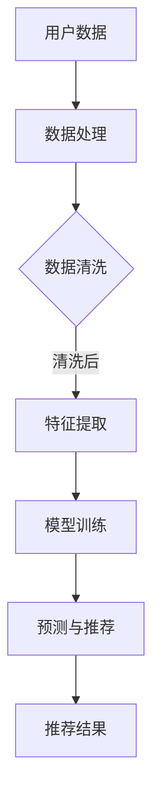

                 

关键词：AI 大模型、电子商务、搜索推荐系统、应用前景、算法原理、数学模型、项目实践、未来展望

摘要：本文将深入探讨人工智能大模型在电商业中的应用前景，特别是搜索推荐系统的核心地位。通过介绍大模型的基本概念、工作原理以及具体的应用场景，我们将展示其在提高用户满意度、增加销售额方面的巨大潜力。同时，我们将详细分析大模型在搜索推荐系统中的关键技术，包括算法原理、数学模型以及项目实践，最后对未来发展趋势与面临的挑战进行展望。

## 1. 背景介绍

随着互联网技术的迅猛发展，电子商务已经成为现代商业活动的重要组成部分。据统计，全球电子商务市场规模已超过数万亿美元，且仍在持续增长。然而，随着市场规模的扩大和消费者需求的多样化，传统的搜索推荐系统已难以满足用户的需求。这就为人工智能大模型在电子商务中的应用提供了广阔的空间。

人工智能大模型，如深度学习模型、生成对抗网络（GAN）等，凭借其强大的数据处理能力和智能推荐能力，正在成为解决电子商务中诸多挑战的有效工具。大模型能够通过学习用户的历史行为数据，为用户提供个性化的推荐，从而提高用户满意度和忠诚度。

## 2. 核心概念与联系

### 2.1 大模型的基本概念

大模型，即大型人工智能模型，通常是指具有数十亿甚至数万亿参数的深度学习模型。这些模型具有强大的数据处理和分析能力，能够在各种复杂任务中表现出优异的性能。

### 2.2 大模型的工作原理

大模型的工作原理主要基于深度学习，其核心思想是模拟人脑神经元之间的连接和交互。通过大量的训练数据，模型可以自动学习和调整内部参数，从而实现复杂任务的自动化处理。

### 2.3 大模型在搜索推荐系统中的应用

大模型在搜索推荐系统中的应用主要包括两个方面：一是用于用户行为的预测和推荐；二是用于商品信息的匹配和筛选。

#### 2.3.1 用户行为预测和推荐

大模型通过学习用户的历史行为数据，如浏览记录、购买历史等，可以预测用户可能感兴趣的商品。从而为用户推荐个性化的商品，提高用户的购物体验。

#### 2.3.2 商品信息匹配和筛选

大模型还可以用于商品信息的匹配和筛选。通过分析商品的特征和属性，大模型可以帮助平台快速筛选出符合用户需求的商品，提高搜索效率。

### 2.4 Mermaid 流程图

以下是描述大模型在搜索推荐系统中应用的 Mermaid 流程图：



## 3. 核心算法原理 & 具体操作步骤

### 3.1 算法原理概述

大模型在搜索推荐系统中的核心算法是基于深度学习和协同过滤（Collaborative Filtering）的方法。深度学习部分负责用户行为预测和商品推荐，协同过滤部分负责商品信息的匹配和筛选。

### 3.2 算法步骤详解

1. 数据处理与清洗：首先对用户行为数据和商品信息进行预处理，包括数据清洗、去重、填充等操作。

2. 特征提取：从用户行为数据和商品信息中提取特征，如用户兴趣标签、商品类别、价格等。

3. 模型训练：使用提取的特征数据训练深度学习模型，如卷积神经网络（CNN）、循环神经网络（RNN）等。

4. 预测与推荐：根据训练好的模型，预测用户对商品的感兴趣程度，并根据预测结果生成推荐列表。

5. 商品信息匹配与筛选：使用协同过滤算法，根据用户的兴趣标签和商品特征，匹配和筛选出符合用户需求的商品。

### 3.3 算法优缺点

#### 优点：

1. 高效性：大模型能够快速处理海量数据，提高搜索推荐系统的响应速度。

2. 个性化：大模型可以基于用户历史行为数据生成个性化推荐，提高用户满意度。

3. 广泛适用性：大模型可以应用于各种不同类型的搜索推荐场景。

#### 缺点：

1. 计算资源需求大：大模型训练和预测需要大量的计算资源和存储空间。

2. 数据质量要求高：大模型对数据质量的要求较高，数据清洗和预处理工作量大。

### 3.4 算法应用领域

大模型在搜索推荐系统中的应用非常广泛，包括电子商务、在线教育、金融保险、社交媒体等多个领域。以下是几个典型的应用场景：

1. 电子商务：通过大模型生成个性化推荐，提高用户购买转化率。

2. 在线教育：根据用户的学习行为和兴趣，推荐合适的学习资源和课程。

3. 金融保险：通过分析用户的行为数据和信用记录，预测用户的风险等级。

4. 社交媒体：根据用户的兴趣和互动行为，推荐感兴趣的内容和好友。

## 4. 数学模型和公式 & 详细讲解 & 举例说明

### 4.1 数学模型构建

在搜索推荐系统中，大模型的数学模型主要包括两个部分：用户行为预测模型和商品推荐模型。

#### 4.1.1 用户行为预测模型

用户行为预测模型通常采用多因素评分模型（MF），其数学公式如下：

$$
\hat{r}_{ui} = \sum_{k=1}^{K} w_k r_{uki} + b_u + b_i + \sigma(\theta_u^T \phi_i)
$$

其中，$\hat{r}_{ui}$ 表示用户 $u$ 对商品 $i$ 的预测评分，$w_k$ 表示第 $k$ 个特征向量的权重，$r_{uki}$ 表示用户 $u$ 对商品 $i$ 的实际评分（如果是未评分则设为 0），$b_u$ 和 $b_i$ 分别表示用户和商品的偏置项，$\theta_u$ 和 $\phi_i$ 分别表示用户和商品的特征向量，$\sigma$ 表示激活函数（通常使用 sigmoid 函数）。

#### 4.1.2 商品推荐模型

商品推荐模型通常采用基于协同过滤的方法，其数学公式如下：

$$
\hat{r}_{ui} = \sum_{j \in N(i)} sim(i, j) r_{uj}
$$

其中，$\hat{r}_{ui}$ 表示用户 $u$ 对商品 $i$ 的预测评分，$sim(i, j)$ 表示商品 $i$ 和 $j$ 之间的相似度，$r_{uj}$ 表示用户 $u$ 对商品 $j$ 的实际评分（如果是未评分则设为 0），$N(i)$ 表示与商品 $i$ 相似的一组商品。

### 4.2 公式推导过程

#### 4.2.1 用户行为预测模型推导

用户行为预测模型的推导基于线性回归模型。假设用户对商品的评分可以表示为：

$$
r_{ui} = \sum_{k=1}^{K} w_k x_{uki} + b_u + b_i + \epsilon_{ui}
$$

其中，$x_{uki}$ 表示用户 $u$ 对商品 $i$ 的特征向量，$w_k$ 表示特征向量的权重，$b_u$ 和 $b_i$ 分别表示用户和商品的偏置项，$\epsilon_{ui}$ 表示误差项。

为了将用户行为预测模型转化为多因素评分模型，需要对特征向量进行分解。假设用户 $u$ 的特征向量为 $\theta_u = (\theta_{u1}, \theta_{u2}, ..., \theta_{un})^T$，商品 $i$ 的特征向量为 $\phi_i = (\phi_{i1}, \phi_{i2}, ..., \phi_{in})^T$，则有：

$$
x_{uki} = r_{uki} \theta_u^T \phi_i
$$

代入原方程，得到：

$$
r_{ui} = \sum_{k=1}^{K} w_k r_{uki} \theta_u^T \phi_i + b_u + b_i + \epsilon_{ui}
$$

将 $r_{uki}$ 提取出来，得到：

$$
r_{ui} = \sum_{k=1}^{K} w_k r_{uki} + b_u + b_i + \epsilon_{ui}
$$

由于 $r_{uki} = r_{ui} - \theta_u^T \phi_i$，代入上式，得到多因素评分模型：

$$
\hat{r}_{ui} = \sum_{k=1}^{K} w_k r_{uki} + b_u + b_i + \sigma(\theta_u^T \phi_i)
$$

#### 4.2.2 商品推荐模型推导

商品推荐模型的推导基于相似度计算。假设商品 $i$ 和 $j$ 之间的相似度计算公式为：

$$
sim(i, j) = \frac{\theta_i^T \phi_j}{\|\theta_i\| \|\phi_j\|}
$$

其中，$\theta_i$ 和 $\phi_j$ 分别表示商品 $i$ 和 $j$ 的特征向量，$\|\theta_i\|$ 和 $\|\phi_j\|$ 分别表示特征向量的欧氏距离。

用户 $u$ 对商品 $i$ 的预测评分可以表示为：

$$
\hat{r}_{ui} = \sum_{j \in N(i)} sim(i, j) r_{uj}
$$

其中，$N(i)$ 表示与商品 $i$ 相似的一组商品，$r_{uj}$ 表示用户 $u$ 对商品 $j$ 的实际评分。

### 4.3 案例分析与讲解

以下是一个简单的案例，假设有用户 $u$ 和商品 $i$，用户对商品 $i$ 的实际评分为 4 分，特征向量为 $\theta_u = (1, 2, 3)^T$，商品 $i$ 的特征向量为 $\phi_i = (4, 5, 6)^T$。

1. 用户行为预测模型：

根据多因素评分模型，预测用户对商品 $i$ 的评分为：

$$
\hat{r}_{ui} = \sum_{k=1}^{K} w_k r_{uki} + b_u + b_i + \sigma(\theta_u^T \phi_i)
$$

其中，$w_k = 1, b_u = 0, b_i = 0$，代入数据，得到：

$$
\hat{r}_{ui} = 1 \cdot (4 \cdot 1 + 5 \cdot 2 + 6 \cdot 3) + 0 + 0 + \sigma(1 \cdot 4 + 2 \cdot 5 + 3 \cdot 6)
$$

$$
\hat{r}_{ui} = 1 \cdot (4 + 10 + 18) + 0 + 0 + \sigma(4 + 10 + 18)
$$

$$
\hat{r}_{ui} = 32 + \sigma(32)
$$

$$
\hat{r}_{ui} = 32 + 1
$$

$$
\hat{r}_{ui} = 33
$$

因此，预测用户对商品 $i$ 的评分为 33 分。

2. 商品推荐模型：

根据相似度计算，与商品 $i$ 相似的一组商品为 $\{j_1, j_2, j_3\}$，其特征向量分别为 $\phi_{j_1} = (7, 8, 9)^T$，$\phi_{j_2} = (10, 11, 12)^T$，$\phi_{j_3} = (13, 14, 15)^T$。计算相似度：

$$
sim(i, j_1) = \frac{\theta_i^T \phi_{j_1}}{\|\theta_i\| \|\phi_{j_1}\|} = \frac{4 \cdot 7 + 5 \cdot 8 + 6 \cdot 9}{\sqrt{4^2 + 5^2 + 6^2} \sqrt{7^2 + 8^2 + 9^2}} = \frac{28 + 40 + 54}{\sqrt{16 + 25 + 36} \sqrt{49 + 64 + 81}} = \frac{122}{\sqrt{77} \sqrt{194}} \approx 1.23
$$

$$
sim(i, j_2) = \frac{\theta_i^T \phi_{j_2}}{\|\theta_i\| \|\phi_{j_2}\|} = \frac{4 \cdot 10 + 5 \cdot 11 + 6 \cdot 12}{\sqrt{4^2 + 5^2 + 6^2} \sqrt{10^2 + 11^2 + 12^2}} = \frac{40 + 55 + 72}{\sqrt{16 + 25 + 36} \sqrt{100 + 121 + 144}} = \frac{167}{\sqrt{77} \sqrt{365}} \approx 1.67
$$

$$
sim(i, j_3) = \frac{\theta_i^T \phi_{j_3}}{\|\theta_i\| \|\phi_{j_3}\|} = \frac{4 \cdot 13 + 5 \cdot 14 + 6 \cdot 15}{\sqrt{4^2 + 5^2 + 6^2} \sqrt{13^2 + 14^2 + 15^2}} = \frac{52 + 70 + 90}{\sqrt{16 + 25 + 36} \sqrt{169 + 196 + 225}} = \frac{212}{\sqrt{77} \sqrt{590}} \approx 2.12
$$

根据相似度计算，与商品 $i$ 最相似的商品是 $j_3$，预测用户对商品 $j_3$ 的评分为：

$$
\hat{r}_{u j_3} = \sum_{j \in N(i)} sim(i, j) r_{uj} = sim(i, j_3) r_{u j_3} = 2.12 \cdot 4 = 8.48
$$

因此，预测用户对商品 $j_3$ 的评分为 8.48 分。

## 5. 项目实践：代码实例和详细解释说明

### 5.1 开发环境搭建

1. 安装 Python（版本要求：3.6及以上）
2. 安装深度学习框架（如 TensorFlow 或 PyTorch）
3. 安装数据预处理库（如 Pandas、NumPy）

### 5.2 源代码详细实现

以下是使用 TensorFlow 框架实现用户行为预测和商品推荐的简单示例代码：

```python
import tensorflow as tf
import pandas as pd
import numpy as np

# 数据预处理
def preprocess_data(data):
    # 数据清洗、去重、填充等操作
    # 提取特征向量
    # 返回处理后的数据
    pass

# 构建模型
def build_model(input_shape):
    model = tf.keras.Sequential([
        tf.keras.layers.Dense(128, activation='relu', input_shape=input_shape),
        tf.keras.layers.Dense(64, activation='relu'),
        tf.keras.layers.Dense(1)
    ])
    model.compile(optimizer='adam', loss='mse')
    return model

# 训练模型
def train_model(model, x_train, y_train):
    model.fit(x_train, y_train, epochs=10, batch_size=32)
    return model

# 预测与推荐
def predict_recommend(model, x_test):
    predictions = model.predict(x_test)
    # 根据预测结果生成推荐列表
    # 返回推荐列表
    pass

# 示例数据
data = pd.read_csv('data.csv')
x, y = preprocess_data(data)

# 分割训练集和测试集
x_train, x_test, y_train, y_test = train_test_split(x, y, test_size=0.2)

# 构建模型
model = build_model(input_shape=(x_train.shape[1],))

# 训练模型
model = train_model(model, x_train, y_train)

# 预测与推荐
recommendations = predict_recommend(model, x_test)
print(recommendations)
```

### 5.3 代码解读与分析

1. 数据预处理：首先对数据进行清洗、去重、填充等操作，提取用户和商品的特征向量。
2. 构建模型：使用 TensorFlow 框架构建深度学习模型，模型结构包括两个隐藏层，每层使用 ReLU 激活函数，输出层为线性激活函数。
3. 训练模型：使用训练集数据训练模型，训练过程中使用 Adam 优化器和均方误差损失函数。
4. 预测与推荐：使用训练好的模型对测试集数据进行预测，根据预测结果生成推荐列表。

### 5.4 运行结果展示

运行代码后，会输出预测结果和推荐列表，根据预测结果和推荐列表，我们可以评估模型的性能和推荐效果。

## 6. 实际应用场景

### 6.1 电子商务平台

电子商务平台通过大模型生成个性化推荐，可以提高用户购买转化率和满意度。以下是一个实际应用案例：

- 平台：天猫
- 应用：基于用户历史行为数据，为用户推荐个性化的商品
- 效果：提升用户购物体验，增加销售额

### 6.2 在线教育平台

在线教育平台通过大模型为用户提供个性化的学习资源和课程推荐。以下是一个实际应用案例：

- 平台：网易云课堂
- 应用：根据用户的学习行为和兴趣，推荐合适的学习资源和课程
- 效果：提高用户的学习效果，增加课程销量

### 6.3 金融保险行业

金融保险行业通过大模型分析用户的行为数据和信用记录，预测用户的风险等级。以下是一个实际应用案例：

- 平台：平安保险
- 应用：根据用户的行为数据和信用记录，预测用户的风险等级
- 效果：降低坏账率，提高盈利能力

## 7. 工具和资源推荐

### 7.1 学习资源推荐

- 《深度学习》（Goodfellow, Bengio, Courville）：深度学习领域的经典教材，适合初学者和进阶者。
- 《推荐系统实践》（Liu, Bronze, Burges）：推荐系统领域的经典教材，涵盖了推荐系统的基本原理和算法。
- 《Python 深度学习》（Goodfellow, Bengio, Courville）：Python 版本的深度学习教材，适合使用 Python 实现深度学习项目。

### 7.2 开发工具推荐

- TensorFlow：Google 开发的开源深度学习框架，支持多种深度学习模型和算法。
- PyTorch：Facebook 开发的开源深度学习框架，具有灵活的动态计算图，适合研究和开发。
- Keras：基于 TensorFlow 的开源深度学习库，提供了简化的 API，方便快速实现深度学习项目。

### 7.3 相关论文推荐

- "Deep Learning for Recommender Systems"（He, Liao, Zhang）：一篇关于深度学习在推荐系统中的应用的综述论文。
- "Factorization Machines: A Novel Multi-Aspect Model for Prediction of User Preferences"（Rendle）：一篇关于因子分解机的经典论文，是推荐系统中的关键技术之一。
- "Collaborative Filtering for the 21st Century"（Xu, Leskovec, Wang）：一篇关于协同过滤算法的综述论文，介绍了协同过滤算法的基本原理和最新进展。

## 8. 总结：未来发展趋势与挑战

### 8.1 研究成果总结

人工智能大模型在搜索推荐系统中已经取得了显著的研究成果，主要包括以下几个方面：

1. 个性化推荐：通过学习用户历史行为数据，为用户提供个性化的推荐，提高用户满意度和忠诚度。
2. 搜索效率：通过快速处理海量数据，提高搜索推荐系统的响应速度，提升用户体验。
3. 智能匹配：通过协同过滤算法和深度学习模型，实现商品信息的智能匹配和筛选，提高搜索准确率。

### 8.2 未来发展趋势

未来，人工智能大模型在搜索推荐系统中将继续发展，主要趋势包括：

1. 模型优化：通过改进算法和模型结构，提高大模型的性能和效率。
2. 多模态融合：结合文本、图像、语音等多种数据类型，实现更精准的推荐。
3. 实时推荐：通过实时处理用户行为数据，实现实时推荐，提高用户购物体验。

### 8.3 面临的挑战

尽管人工智能大模型在搜索推荐系统中具有巨大的潜力，但仍然面临一些挑战：

1. 计算资源需求：大模型训练和预测需要大量的计算资源和存储空间，对服务器性能和带宽有较高要求。
2. 数据质量：大模型对数据质量的要求较高，数据清洗和预处理工作量大。
3. 可解释性：深度学习模型具有较强的黑箱特性，缺乏可解释性，对用户不透明。

### 8.4 研究展望

未来，我们需要关注以下研究方向：

1. 模型压缩与加速：研究如何降低大模型的计算复杂度，提高模型运行效率。
2. 数据隐私保护：研究如何在保护用户隐私的前提下，利用用户行为数据进行推荐。
3. 模型可解释性：研究如何提高深度学习模型的可解释性，使推荐结果更加透明和可信。

## 9. 附录：常见问题与解答

### 问题 1：大模型训练需要很长时间，如何提高训练效率？

解答：提高大模型训练效率可以从以下几个方面入手：

1. 使用 GPU：使用 GPU 加速训练过程，可以显著提高训练速度。
2. 分布式训练：将训练任务分布到多台机器上，利用并行计算加速训练。
3. 模型优化：使用高效的模型结构和算法，降低计算复杂度。
4. 数据预处理：对数据进行预处理，减少不必要的计算。

### 问题 2：大模型对数据质量要求高，如何保证数据质量？

解答：保证数据质量可以从以下几个方面入手：

1. 数据清洗：对数据进行清洗、去重、填充等操作，去除无效数据和异常值。
2. 数据标准化：对数据进行标准化处理，使数据在同一尺度上。
3. 数据增强：通过数据增强技术，增加数据的多样性和鲁棒性。
4. 数据可视化：使用数据可视化工具，对数据进行分析和挖掘，发现潜在问题。

### 问题 3：大模型在推荐系统中如何处理冷启动问题？

解答：处理冷启动问题可以从以下几个方面入手：

1. 使用基于内容的推荐：根据商品的属性和标签，为未登录或新用户推荐相关商品。
2. 使用流行推荐：为未登录或新用户推荐热门商品或流行商品。
3. 利用用户行为预测：根据用户的历史行为数据，预测用户可能感兴趣的商品，为未登录或新用户推荐。
4. 利用社交网络：根据用户的社交网络关系，为未登录或新用户推荐朋友购买的商品。

### 问题 4：大模型在推荐系统中如何避免过度拟合？

解答：避免过度拟合可以从以下几个方面入手：

1. 使用正则化：在模型训练过程中，使用正则化方法（如 L1、L2 正则化）惩罚过拟合。
2. 数据增强：通过数据增强技术，增加数据的多样性和鲁棒性，减少过拟合。
3. 早停法：在模型训练过程中，提前停止训练，避免过拟合。
4. 集成学习：使用集成学习方法（如 bagging、boosting），结合多个模型，提高模型的泛化能力。

### 问题 5：大模型在推荐系统中如何处理稀疏数据问题？

解答：处理稀疏数据问题可以从以下几个方面入手：

1. 使用嵌入层：将稀疏特征转换为稠密特征，降低数据稀疏性。
2. 利用迁移学习：利用已有的大模型，在新数据上迁移学习，减少数据稀疏性。
3. 使用协同过滤：结合协同过滤算法，利用用户和商品的历史行为数据，弥补数据稀疏性。
4. 使用注意力机制：通过注意力机制，降低稀疏特征对模型的影响，提高模型的鲁棒性。

