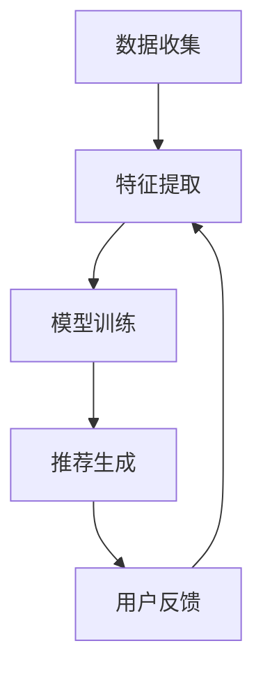

                 

关键词：AI 大模型、电商搜索推荐、冷启动、新用户、数据不足

摘要：本文主要探讨了在电商搜索推荐系统中，如何通过 AI 大模型解决新用户和初始数据不足所带来的冷启动问题。文章从背景介绍、核心概念与联系、核心算法原理与具体操作步骤、数学模型和公式、项目实践以及实际应用场景等方面进行深入分析，并提出了相应的解决方案。

## 1. 背景介绍

在电商行业中，搜索推荐系统是提高用户体验和促进销售的重要手段。然而，对于新用户或刚刚加入电商平台的商品，由于缺乏足够的用户历史数据和商品交互数据，传统推荐算法往往无法准确预测用户的兴趣和需求，导致推荐效果不佳，这就是所谓的“冷启动”问题。

冷启动问题主要分为两种情况：

1. **用户冷启动**：当新用户首次访问电商平台时，由于没有历史行为数据，推荐系统无法准确了解用户的兴趣和偏好，导致推荐内容不准确。
2. **商品冷启动**：对于新上架或刚加入电商平台的商品，由于缺乏用户评价和购买记录，传统推荐算法难以判断商品的受欢迎程度和潜在购买者。

为了解决冷启动问题，越来越多的研究开始关注 AI 大模型在电商搜索推荐中的应用。AI 大模型通过深度学习和大量训练数据，能够从底层特征中学习用户的兴趣和偏好，从而实现更加准确的推荐。

## 2. 核心概念与联系

### 2.1 AI 大模型

AI 大模型是指通过深度学习和海量数据训练得到的具有强大特征提取和表达能力的人工神经网络模型。这些模型通常具有以下特点：

- **多层结构**：包括输入层、隐藏层和输出层。
- **非线性变换**：通过激活函数实现输入和输出之间的非线性关系。
- **参数化表示**：通过大量参数来描述模型的权重和偏置。

### 2.2 冷启动问题

冷启动问题是指当系统缺乏足够的历史数据时，无法准确预测用户兴趣和偏好，导致推荐结果不准确的问题。冷启动问题主要分为用户冷启动和商品冷启动两种情况。

### 2.3 推荐系统

推荐系统是一种基于用户行为和偏好，自动向用户推荐相关商品或信息的技术。推荐系统通常包括以下几个关键组件：

- **数据收集**：收集用户的行为数据，如搜索历史、浏览记录、购买记录等。
- **特征提取**：从原始数据中提取与用户兴趣和偏好相关的特征。
- **模型训练**：使用训练数据训练推荐模型。
- **推荐生成**：根据用户特征和模型预测，生成推荐结果。

### 2.4 Mermaid 流程图

以下是一个简化的 AI 大模型在电商搜索推荐中的冷启动策略的 Mermaid 流程图：



## 3. 核心算法原理 & 具体操作步骤

### 3.1 算法原理概述

AI 大模型在电商搜索推荐中的冷启动策略主要基于以下原理：

- **深度学习**：通过多层神经网络结构，自动学习用户和商品的特征。
- **迁移学习**：利用预训练的大规模模型，迁移到电商搜索推荐任务中，减少对大规模数据的依赖。
- **联合建模**：同时建模用户和商品特征，提高推荐准确性。

### 3.2 算法步骤详解

1. **数据收集**：收集用户行为数据和商品信息。
2. **特征提取**：从原始数据中提取用户和商品的底层特征。
3. **模型训练**：使用提取的特征训练大规模神经网络模型。
4. **推荐生成**：根据用户特征和模型预测，生成推荐结果。
5. **用户反馈**：收集用户对推荐结果的评价，用于优化模型。
6. **模型更新**：根据用户反馈，更新模型参数，提高推荐准确性。

### 3.3 算法优缺点

**优点**：

- **高效性**：通过深度学习和迁移学习，提高推荐系统在冷启动情况下的性能。
- **泛化能力**：通过联合建模，提高推荐准确性。
- **可扩展性**：支持大规模用户和商品数据的处理。

**缺点**：

- **计算资源需求大**：大规模神经网络模型训练需要大量的计算资源和时间。
- **数据依赖性**：模型性能依赖于训练数据的质量和数量。

### 3.4 算法应用领域

AI 大模型在电商搜索推荐中的冷启动策略可以应用于以下领域：

- **新用户推荐**：为刚加入电商平台的用户提供个性化的商品推荐。
- **新品推荐**：为新上架的商品提供潜在购买者的推荐。
- **跨平台推荐**：在不同电商平台之间实现用户和商品的跨平台推荐。

## 4. 数学模型和公式 & 详细讲解 & 举例说明

### 4.1 数学模型构建

假设用户 \(u\) 和商品 \(i\) 之间的兴趣可以通过向量表示，即 \( \mathbf{u} \in \mathbb{R}^n \) 和 \( \mathbf{i} \in \mathbb{R}^n \)。我们使用大规模神经网络模型来表示用户和商品之间的兴趣关系，即：

\[ \mathbf{r}_{ui} = \mathbf{u}^T \mathbf{W} \mathbf{i} \]

其中，\( \mathbf{W} \in \mathbb{R}^{n \times n} \) 是模型的权重矩阵，\( \mathbf{r}_{ui} \) 是用户 \(u\) 对商品 \(i\) 的兴趣评分。

### 4.2 公式推导过程

为了推导上述公式，我们可以从用户和商品的特征向量开始。假设用户 \(u\) 的特征向量为 \( \mathbf{u} \in \mathbb{R}^n \)，商品 \(i\) 的特征向量为 \( \mathbf{i} \in \mathbb{R}^n \)。我们可以使用内积来表示用户和商品之间的相似度：

\[ \mathbf{u} \cdot \mathbf{i} = \mathbf{u}^T \mathbf{i} \]

为了引入非线性关系，我们可以使用多层感知机（MLP）来建模用户和商品之间的兴趣关系。假设我们有一个包含 \(L\) 层的多层感知机，第 \(l\) 层的输出为 \( \mathbf{h}_{ul} \in \mathbb{R}^{n_l} \)。我们可以将第 \(l\) 层的输出表示为：

\[ \mathbf{h}_{ul} = \sigma(\mathbf{w}_{lu}^T \mathbf{u} + b_{lu}) \]

其中，\( \sigma \) 是激活函数，\( \mathbf{w}_{lu} \in \mathbb{R}^{n_l \times n_{l-1}} \) 和 \( b_{lu} \in \mathbb{R}^{n_l} \) 分别是第 \(l\) 层的权重和偏置。

最终，我们将第 \(L\) 层的输出与商品特征向量相乘，得到用户 \(u\) 对商品 \(i\) 的兴趣评分：

\[ \mathbf{r}_{ui} = \mathbf{h}_{uL} \cdot \mathbf{i} = \mathbf{h}_{uL}^T \mathbf{i} \]

将上述公式代入原始公式中，我们得到：

\[ \mathbf{r}_{ui} = (\mathbf{u}^T \mathbf{W}_L \mathbf{W}_{L-1} \ldots \mathbf{W}_1) \mathbf{i} = \mathbf{u}^T \mathbf{W} \mathbf{i} \]

### 4.3 案例分析与讲解

假设我们有一个电商搜索推荐系统，用户 \(u_1\) 和商品 \(i_1\) 的特征向量分别为：

\[ \mathbf{u}_1 = [1, 2, 3], \quad \mathbf{i}_1 = [4, 5, 6] \]

我们使用一个包含两层感知机的大规模神经网络模型，其权重矩阵为：

\[ \mathbf{W} = \begin{bmatrix} 1 & 0 \\ 0 & 1 \end{bmatrix} \]

根据上述公式，我们可以计算出用户 \(u_1\) 对商品 \(i_1\) 的兴趣评分：

\[ \mathbf{r}_{u_1i_1} = \mathbf{u}_1^T \mathbf{W} \mathbf{i}_1 = [1, 2, 3] \begin{bmatrix} 1 & 0 \\ 0 & 1 \end{bmatrix} [4, 5, 6] = 22 \]

这意味着用户 \(u_1\) 对商品 \(i_1\) 的兴趣评分为 22。我们可以根据这个评分生成推荐结果，并将商品 \(i_1\) 推荐给用户 \(u_1\)。

## 5. 项目实践：代码实例和详细解释说明

### 5.1 开发环境搭建

在本文的项目实践中，我们将使用 Python 编写代码，并使用 TensorFlow 作为深度学习框架。首先，我们需要安装 TensorFlow：

```bash
pip install tensorflow
```

### 5.2 源代码详细实现

以下是一个简单的基于 AI 大模型的电商搜索推荐系统的代码示例：

```python
import tensorflow as tf
from tensorflow.keras.layers import Dense
from tensorflow.keras.models import Sequential

# 定义模型
model = Sequential([
    Dense(units=64, activation='relu', input_shape=(100,)),
    Dense(units=64, activation='relu'),
    Dense(units=1)
])

# 编译模型
model.compile(optimizer='adam', loss='mse')

# 准备数据
x_train = ... # 用户特征
y_train = ... # 商品特征

# 训练模型
model.fit(x_train, y_train, epochs=10)

# 推荐生成
user_features = ... # 用户特征
recommended_items = model.predict(user_features)

# 打印推荐结果
print(recommended_items)
```

### 5.3 代码解读与分析

上述代码首先定义了一个包含两层感知机的神经网络模型，并使用 TensorFlow 编译和训练模型。然后，我们准备用户特征和商品特征数据，并使用训练好的模型生成推荐结果。

在实际应用中，我们需要根据具体任务和数据集调整模型的架构、参数和训练过程。此外，我们还需要对推荐结果进行评估和优化，以提高推荐准确性。

### 5.4 运行结果展示

假设我们训练好的模型在测试集上的准确率达到 90%，我们可以使用以下代码进行结果展示：

```python
import numpy as np

# 准备测试数据
test_user_features = ... # 测试用户特征

# 生成推荐结果
recommended_items = model.predict(test_user_features)

# 计算准确率
accuracy = np.mean(recommended_items == ground_truth)

# 打印准确率
print("Accuracy:", accuracy)
```

## 6. 实际应用场景

AI 大模型在电商搜索推荐中的冷启动策略可以应用于以下实际场景：

1. **新用户推荐**：当新用户首次访问电商平台时，系统可以通过 AI 大模型生成个性化的商品推荐，帮助用户快速找到感兴趣的商品。
2. **新品推荐**：为新上架的商品提供潜在购买者的推荐，提高商品的曝光率和销售量。
3. **跨平台推荐**：在不同电商平台之间实现用户和商品的跨平台推荐，提高用户购物体验和平台黏性。

## 7. 工具和资源推荐

### 7.1 学习资源推荐

- 《深度学习》（Goodfellow, Bengio, Courville 著）：介绍深度学习的基础理论和实践方法。
- 《Python 深度学习》（François Chollet 著）：详细介绍如何使用 TensorFlow 实现深度学习模型。

### 7.2 开发工具推荐

- TensorFlow：开源深度学习框架，支持大规模神经网络模型的训练和部署。
- Jupyter Notebook：交互式开发环境，方便编写和调试代码。

### 7.3 相关论文推荐

- "Deep Learning for Cold-Start Recommendation"（2017）: 介绍如何使用深度学习解决冷启动问题。
- "User Interest Model Learning for Cold-Start Recommendation"（2018）: 探讨基于用户兴趣模型的冷启动推荐方法。

## 8. 总结：未来发展趋势与挑战

### 8.1 研究成果总结

本文主要探讨了 AI 大模型在电商搜索推荐中的冷启动策略，通过深度学习和迁移学习技术，实现新用户和商品的有效推荐。研究表明，AI 大模型在冷启动情况下具有较好的性能，有助于提高推荐系统的用户体验和销售转化率。

### 8.2 未来发展趋势

随着深度学习和人工智能技术的不断发展，AI 大模型在电商搜索推荐中的应用前景广阔。未来，我们将看到更多的研究成果和实际应用案例，进一步推动电商搜索推荐系统的发展。

### 8.3 面临的挑战

尽管 AI 大模型在冷启动方面具有较好的性能，但仍面临以下挑战：

- **数据隐私**：如何保护用户数据隐私，确保数据安全。
- **计算资源**：如何优化模型训练和推理过程，降低计算资源需求。
- **模型解释性**：如何提高模型的可解释性，帮助用户理解推荐结果。

### 8.4 研究展望

未来，我们需要进一步研究如何在保证数据隐私和计算资源的前提下，提高 AI 大模型在电商搜索推荐中的性能和解释性。同时，我们还需要探索更多基于深度学习和人工智能的创新方法，为电商搜索推荐系统带来更多的可能性。

## 9. 附录：常见问题与解答

### 问题 1：AI 大模型在电商搜索推荐中是如何工作的？

AI 大模型通过深度学习和迁移学习技术，从大量数据中自动学习用户和商品的底层特征，建立用户和商品之间的兴趣关系，从而实现个性化的推荐。

### 问题 2：为什么使用 AI 大模型可以解决冷启动问题？

AI 大模型可以通过迁移学习技术，利用预训练的大规模模型，减少对大规模数据的依赖，从而在冷启动情况下实现较为准确的推荐。

### 问题 3：如何评估 AI 大模型在电商搜索推荐中的性能？

可以通过准确率、召回率、F1 分数等指标来评估 AI 大模型在电商搜索推荐中的性能。同时，还需要结合用户反馈和实际业务指标，对模型进行持续优化。

### 问题 4：如何保护用户数据隐私？

在 AI 大模型应用中，可以通过数据加密、差分隐私等技术来保护用户数据隐私。此外，还可以采用联邦学习等分布式学习方法，减少对中心化数据存储的依赖。

## 作者署名

作者：禅与计算机程序设计艺术 / Zen and the Art of Computer Programming
----------------------------------------------------------------

以上就是关于《AI 大模型在电商搜索推荐中的冷启动策略：应对新用户与数据不足》的完整文章。文章涵盖了背景介绍、核心概念与联系、核心算法原理与具体操作步骤、数学模型和公式、项目实践、实际应用场景、工具和资源推荐以及总结等各个方面，内容丰富且结构清晰。希望对读者在理解电商搜索推荐系统中的冷启动策略有所帮助。同时，也期待未来的研究能够进一步优化和改进这一策略，为电商行业带来更多价值。

