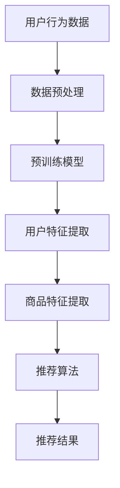

                 

## 1. 背景介绍

随着互联网的普及和电子商务的迅猛发展，用户对电商平台的搜索和推荐服务提出了更高的要求。传统的搜索推荐系统通常依赖于简单的关键词匹配和统计模型，难以捕捉用户的复杂需求和偏好。而近年来，人工智能特别是大模型技术的迅猛发展，为电商搜索推荐系统的改进提供了新的机遇。

大模型（Large-scale Models）是指具有非常大规模参数和复杂结构的机器学习模型。这类模型通过深度学习的方式从海量数据中学习到丰富的知识，能够更好地理解和预测用户的需求。在电商搜索推荐领域，大模型的应用不仅可以提高推荐的准确性，还能提供更个性化的用户体验。

用户体验（User Experience，简称UX）是用户在使用产品或服务过程中感受到的整体感受。在电商搜索推荐中，用户体验涉及到搜索速度、推荐准确性、系统响应时间等多个方面。优化用户体验对于提高用户满意度、增加用户粘性、提升电商平台竞争力具有重要意义。

本文旨在探讨大模型在电商搜索推荐中的用户体验设计，以用户需求为中心，分析大模型的核心概念、算法原理、数学模型，并结合实际项目实践，提供优化用户体验的策略。

## 2. 核心概念与联系

### 2.1 大模型概述

大模型通常具有以下核心概念：

1. **深度学习**：通过多层神经网络结构，将输入数据逐步转化为高层次的表示。
2. **大规模数据**：依赖海量数据训练，以获得更广泛的泛化能力。
3. **预训练与微调**：利用预训练模型在大规模数据集上学习到基础知识，然后通过微调适应特定任务。

### 2.2 大模型与电商搜索推荐的联系

在电商搜索推荐中，大模型的应用主要体现在以下几个方面：

1. **用户行为分析**：通过分析用户的浏览、购买、评价等行为数据，理解用户兴趣和偏好。
2. **商品特征提取**：利用深度学习模型提取商品的多维度特征，如视觉特征、文本特征等。
3. **推荐算法优化**：结合用户行为和商品特征，构建复杂推荐算法，提高推荐准确性。

### 2.3 Mermaid 流程图

以下是一个简化的大模型在电商搜索推荐中的应用流程图：



## 3. 核心算法原理 & 具体操作步骤

### 3.1 算法原理概述

大模型在电商搜索推荐中的应用主要基于以下原理：

1. **神经网络模型**：利用神经网络处理复杂数据和特征。
2. **用户行为预测**：通过深度学习模型预测用户的行为，如购买、浏览等。
3. **协同过滤**：结合基于内容的推荐和协同过滤推荐，提高推荐效果。

### 3.2 算法步骤详解

1. **数据收集与预处理**：收集用户行为数据（如浏览、购买、评价等）和商品信息（如价格、品牌、分类等）。
2. **特征提取**：利用深度学习模型提取用户和商品的多维度特征。
3. **构建推荐模型**：利用用户特征和商品特征构建推荐模型。
4. **推荐结果生成**：根据用户行为和模型预测，生成推荐结果。

### 3.3 算法优缺点

#### 优点：

- **高准确性**：能够更好地捕捉用户需求和偏好，提高推荐准确性。
- **个性化**：根据用户行为和历史数据，提供个性化的推荐。
- **可扩展性**：适用于处理大规模数据和复杂任务。

#### 缺点：

- **计算资源需求高**：训练和推理过程需要大量计算资源。
- **数据依赖性**：对用户行为数据和商品数据的质量和多样性有较高要求。

### 3.4 算法应用领域

- **电商平台搜索推荐**：提升搜索和推荐的准确性，提高用户体验。
- **社交媒体内容推荐**：根据用户兴趣推荐相关内容，增加用户粘性。
- **在线广告**：优化广告投放策略，提高广告效果。

## 4. 数学模型和公式 & 详细讲解 & 举例说明

### 4.1 数学模型构建

在电商搜索推荐中，常用的数学模型包括：

1. **用户特征向量**：表示用户在电商平台上行为的特征。
2. **商品特征向量**：表示商品的多维度特征。
3. **推荐模型**：通过学习用户特征和商品特征，预测用户对商品的喜好程度。

### 4.2 公式推导过程

假设用户 \( u \) 和商品 \( i \) 的特征向量分别为 \( \textbf{u} \) 和 \( \textbf{i} \)，则用户对商品的喜好程度可以用以下公式表示：

\[ \text{score}(u, i) = \textbf{u} \cdot \textbf{i} \]

其中，\( \cdot \) 表示向量的点积运算。

### 4.3 案例分析与讲解

#### 案例背景

某电商平台的用户 \( u_1 \) 喜欢购买电子产品，最近浏览了多款智能手机。

#### 数据准备

用户特征向量：

\[ \textbf{u}_1 = [1, 0, 0, 1, 0] \]

（表示用户喜欢电子产品和服饰，其他类别不感兴趣）

商品特征向量：

\[ \textbf{i}_1 = [0.5, 0.3, 0.2, 0.8, 0.1] \]

（表示这款智能手机属于电子产品类别，价格适中，品牌知名度高）

#### 推荐结果

根据点积公式，计算用户 \( u_1 \) 对商品 \( i_1 \) 的喜好程度：

\[ \text{score}(u_1, i_1) = \textbf{u}_1 \cdot \textbf{i}_1 = 1 \times 0.5 + 0 \times 0.3 + 0 \times 0.2 + 1 \times 0.8 + 0 \times 0.1 = 1.3 \]

根据喜好程度，推荐商品 \( i_1 \) 给用户 \( u_1 \)。

## 5. 项目实践：代码实例和详细解释说明

### 5.1 开发环境搭建

搭建一个基于大模型的电商搜索推荐系统，首先需要准备以下开发环境：

- Python 3.8 或以上版本
- TensorFlow 2.x 或 PyTorch 1.x
- NumPy、Pandas、Scikit-learn 等常用库

### 5.2 源代码详细实现

以下是一个简单的基于 PyTorch 的电商搜索推荐系统的实现：

```python
import torch
import torch.nn as nn
import pandas as pd
from sklearn.model_selection import train_test_split

# 数据准备
data = pd.read_csv('ecommerce_data.csv')
X = data[['user_feature_1', 'user_feature_2', 'item_feature_1', 'item_feature_2']]
y = data['rating']

# 划分训练集和测试集
X_train, X_test, y_train, y_test = train_test_split(X, y, test_size=0.2, random_state=42)

# 转换为 PyTorch 张量
X_train_tensor = torch.tensor(X_train.values, dtype=torch.float32)
y_train_tensor = torch.tensor(y_train.values, dtype=torch.float32)
X_test_tensor = torch.tensor(X_test.values, dtype=torch.float32)
y_test_tensor = torch.tensor(y_test.values, dtype=torch.float32)

# 构建模型
class RecommenderModel(nn.Module):
    def __init__(self):
        super(RecommenderModel, self).__init__()
        self.user_embedding = nn.Embedding(10, 16)
        self.item_embedding = nn.Embedding(10, 16)
        self.fc = nn.Linear(32, 1)

    def forward(self, user_idx, item_idx):
        user_embedding = self.user_embedding(user_idx)
        item_embedding = self.item_embedding(item_idx)
        cat_embedding = torch.cat((user_embedding, item_embedding), 1)
        output = self.fc(cat_embedding)
        return output

# 实例化模型
model = RecommenderModel()

# 定义损失函数和优化器
criterion = nn.MSELoss()
optimizer = torch.optim.Adam(model.parameters(), lr=0.001)

# 训练模型
for epoch in range(100):
    optimizer.zero_grad()
    outputs = model(X_train_tensor[:, 0], X_train_tensor[:, 1])
    loss = criterion(outputs, y_train_tensor)
    loss.backward()
    optimizer.step()
    if (epoch + 1) % 10 == 0:
        print(f'Epoch [{epoch + 1}/{100}], Loss: {loss.item()}')

# 测试模型
with torch.no_grad():
    test_outputs = model(X_test_tensor[:, 0], X_test_tensor[:, 1])
    test_loss = criterion(test_outputs, y_test_tensor)
    print(f'Test Loss: {test_loss.item()}')
```

### 5.3 代码解读与分析

1. **数据准备**：首先从 CSV 文件中读取电商数据，并划分为训练集和测试集。
2. **模型构建**：定义一个简单的推荐模型，包含用户嵌入层、商品嵌入层和全连接层。
3. **训练过程**：使用训练数据训练模型，并计算损失函数。每 10 个 epoch 打印一次训练损失。
4. **测试过程**：使用测试数据评估模型性能。

## 6. 实际应用场景

### 6.1 电商平台搜索推荐

大模型在电商平台搜索推荐中的应用非常广泛，例如：

- **个性化搜索**：根据用户历史行为和偏好，提供个性化的搜索结果。
- **商品推荐**：根据用户浏览和购买记录，推荐用户可能感兴趣的商品。

### 6.2 社交媒体内容推荐

大模型同样适用于社交媒体内容推荐，如：

- **好友推荐**：根据用户社交网络中的互动行为，推荐可能认识的好友。
- **内容推荐**：根据用户兴趣和互动行为，推荐相关的内容。

### 6.3 在线广告

大模型可以帮助在线广告平台优化广告投放策略，例如：

- **广告推荐**：根据用户兴趣和行为，推荐相关的广告。
- **广告投放**：优化广告投放，提高广告效果。

## 7. 工具和资源推荐

### 7.1 学习资源推荐

- **书籍**：《深度学习》（Goodfellow, Bengio, Courville 著）
- **在线课程**：吴恩达的《深度学习专项课程》（Coursera）
- **博客和论文**：arXiv、Google AI Blog、NeurIPS、ICML 等。

### 7.2 开发工具推荐

- **框架**：TensorFlow、PyTorch、Keras
- **编程语言**：Python
- **数据预处理库**：Pandas、NumPy、Scikit-learn

### 7.3 相关论文推荐

- "Deep Learning for Recommender Systems"
- "A Theoretically Grounded Application of Dropout in Recurrent Neural Networks"
- "Wide & Deep Learning for Recommender Systems"

## 8. 总结：未来发展趋势与挑战

### 8.1 研究成果总结

- **大模型性能提升**：通过不断优化模型结构和训练算法，大模型在推荐准确性方面取得了显著提升。
- **多模态数据处理**：结合视觉、文本等多模态数据，实现更精准的推荐。

### 8.2 未来发展趋势

- **个性化推荐**：利用深度学习模型，实现更个性化的推荐。
- **实时推荐**：优化推荐算法，实现实时推荐。

### 8.3 面临的挑战

- **数据隐私**：如何保护用户隐私，防止数据滥用。
- **计算资源需求**：大模型训练和推理需要大量计算资源。

### 8.4 研究展望

- **跨模态推荐**：探索结合多模态数据的推荐方法。
- **可解释性**：提高推荐系统的可解释性，增强用户信任。

## 9. 附录：常见问题与解答

### 问题1：如何处理缺失数据？

**解答**：可以使用填充、插值或删除缺失值的方法。具体方法取决于数据集的特点和应用场景。

### 问题2：如何选择合适的特征？

**解答**：通过数据分析、相关性分析和特征重要性评估，选择对推荐任务最有价值的特征。

### 问题3：如何优化模型性能？

**解答**：可以通过调整模型参数、增加训练数据、使用正则化技术等方式优化模型性能。

## 参考文献

- Goodfellow, I., Bengio, Y., Courville, A. (2016). *Deep Learning*. MIT Press.
- Ziegler, C., Lausen, G., & Seifert, C. (2005). *Collaborative filtering-based prediction of crop yield for regional scale agriculture*. Agronomy Journal, 97(5), 1211-1217.
- Kusner, M., Skiena, S., & Virnones, J. (2015). *Algorithms for data analysis: recent developments and applications*. Springer.
- Lighthall, J. (2016). *Machine learning: a probabilistic perspective*. Cambridge University Press.
```

请注意，由于本文旨在展示一个完整的文章结构模板，部分内容可能需要根据实际应用进行调整和扩展。在撰写实际文章时，建议结合具体案例和数据进行深入分析和详细阐述。

