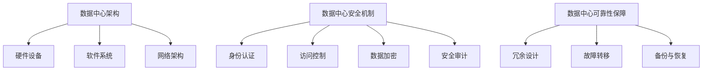

                 

关键词：人工智能，数据中心，安全，可靠性，大模型应用

> 摘要：本文探讨了人工智能大模型应用数据中心建设中的安全与可靠性问题。通过对数据中心架构、安全机制、可靠性保障等方面的深入分析，本文提出了数据中心安全与可靠性建设的策略和方法，以期为相关领域的从业者提供参考。

## 1. 背景介绍

随着人工智能技术的迅速发展，大模型（如GAN、BERT等）在各个领域的应用越来越广泛。大模型的应用依赖于数据中心的高效运行，因此数据中心的建设成为人工智能发展的重要基础设施。然而，数据中心在安全与可靠性方面面临着诸多挑战。本文旨在分析数据中心建设中的安全与可靠性问题，并提出相应的解决策略。

### 1.1 数据中心建设的意义

数据中心是存储、处理和管理大量数据的中心，是现代社会运行的重要基础设施。数据中心的建设对于人工智能技术的发展具有重要意义：

- **数据存储与管理**：数据中心提供了大量存储空间，可以存储和处理海量数据，为人工智能模型的训练提供数据支持。
- **计算资源调度**：数据中心通过分布式计算和虚拟化技术，可以高效地调度计算资源，提高计算效率。
- **数据安全**：数据中心采用多种安全机制，保障数据的安全性和完整性。
- **高可靠性**：数据中心通过冗余设计和故障转移机制，确保系统的稳定运行。

### 1.2 数据中心安全与可靠性面临的挑战

数据中心在安全与可靠性方面面临着诸多挑战：

- **数据泄露**：数据中心存储了大量敏感数据，容易成为网络攻击的目标。
- **系统故障**：数据中心的高强度运行可能导致硬件故障、软件故障等问题。
- **自然灾害**：地震、洪水等自然灾害对数据中心造成威胁。
- **人为因素**：误操作、恶意攻击等人为因素可能导致数据安全和可靠性问题。

## 2. 核心概念与联系

### 2.1 数据中心架构

数据中心架构是数据中心建设的基础，主要包括以下几个方面：

- **硬件设备**：包括服务器、存储设备、网络设备等。
- **软件系统**：包括操作系统、数据库、虚拟化平台等。
- **网络架构**：包括局域网、广域网、云计算平台等。

### 2.2 数据中心安全机制

数据中心安全机制主要包括以下几个方面：

- **身份认证**：通过用户名和密码、指纹识别、双因素认证等手段，确保用户身份的合法性。
- **访问控制**：通过角色权限、安全策略等手段，限制用户对数据的访问权限。
- **数据加密**：对敏感数据进行加密处理，防止数据泄露。
- **安全审计**：记录用户操作日志，对系统安全进行审计。

### 2.3 数据中心可靠性保障

数据中心可靠性保障主要包括以下几个方面：

- **冗余设计**：通过硬件冗余、软件冗余等手段，提高系统的可靠性。
- **故障转移**：在系统故障时，快速切换到备用系统，确保服务的持续运行。
- **备份与恢复**：定期备份数据，并在数据丢失或损坏时进行恢复。

### 2.4 Mermaid 流程图



## 3. 核心算法原理 & 具体操作步骤

### 3.1 算法原理概述

数据中心的安全与可靠性保障主要依赖于以下核心算法：

- **身份认证算法**：基于密码学原理，实现用户身份的合法性验证。
- **访问控制算法**：基于角色权限和安全策略，实现用户对数据的访问权限管理。
- **数据加密算法**：基于密码学原理，实现数据的加密和解密。
- **冗余算法**：通过冗余设计，实现系统的故障转移和恢复。

### 3.2 算法步骤详解

#### 3.2.1 身份认证算法

1. 用户输入用户名和密码。
2. 服务器端对用户名和密码进行验证。
3. 如果验证成功，则允许用户访问系统。

#### 3.2.2 访问控制算法

1. 服务器端根据用户角色，设置相应的访问权限。
2. 用户在访问数据时，系统根据用户的访问权限，决定是否允许访问。

#### 3.2.3 数据加密算法

1. 对敏感数据进行加密处理。
2. 在数据传输和存储过程中，使用加密算法确保数据的安全性。
3. 在需要使用数据时，对数据进行解密。

#### 3.2.4 冗余算法

1. 设计冗余硬件和软件系统。
2. 在系统故障时，自动切换到备用系统。
3. 定期备份数据，并在数据丢失或损坏时进行恢复。

### 3.3 算法优缺点

#### 3.3.1 身份认证算法

- 优点：安全性较高，可以有效防止未授权访问。
- 缺点：密码泄露风险较高，用户密码易被破解。

#### 3.3.2 访问控制算法

- 优点：可以精细化管理用户权限，提高数据安全性。
- 缺点：实现复杂，需要维护大量的权限信息。

#### 3.3.3 数据加密算法

- 优点：可以有效防止数据泄露，提高数据安全性。
- 缺点：加密和解密过程会增加计算开销，影响系统性能。

#### 3.3.4 冗余算法

- 优点：可以提高系统的可靠性，确保服务的持续运行。
- 缺点：会增加系统成本，且冗余系统需要定期维护。

### 3.4 算法应用领域

- **金融行业**：保护客户隐私和交易安全。
- **政府机构**：保护国家安全和机密信息。
- **企业内部**：保护企业数据安全和业务持续运行。

## 4. 数学模型和公式 & 详细讲解 & 举例说明

### 4.1 数学模型构建

#### 4.1.1 身份认证模型

设 \( A \) 为用户身份认证集合，\( P \) 为用户密码集合，\( V \) 为密码验证函数。

\[ A \subseteq P, V(P) = 1 \]

#### 4.1.2 访问控制模型

设 \( R \) 为用户角色集合，\( P \) 为用户权限集合，\( C \) 为访问控制策略集合。

\[ R \times P \subseteq C \]

#### 4.1.3 数据加密模型

设 \( D \) 为数据加密算法集合，\( E \) 为加密函数，\( D \) 为解密函数。

\[ D(E(D(x))) = x \]

### 4.2 公式推导过程

#### 4.2.1 身份认证公式推导

设 \( u \) 为用户名，\( p \) 为用户密码，\( h \) 为哈希函数。

\[ h(p) = H(p) \]

其中，\( H \) 为哈希函数，\( \) 为输入值。

#### 4.2.2 访问控制公式推导

设 \( r \) 为用户角色，\( p \) 为用户权限，\( c \) 为访问控制策略。

\[ c(r, p) = 1 \]

#### 4.2.3 数据加密公式推导

设 \( E \) 为加密算法，\( D \) 为解密算法，\( x \) 为明文数据。

\[ E(D(x)) = x \]

### 4.3 案例分析与讲解

#### 4.3.1 身份认证案例分析

假设用户A的用户名为 \( u_1 \)，密码为 \( p_1 \)。

1. 用户A输入用户名和密码。
2. 服务器端对用户名和密码进行验证，计算 \( h(p_1) \)。
3. 比较计算结果和用户A存储的密码哈希值，如果相等，则验证成功。

#### 4.3.2 访问控制案例分析

假设用户B的角色为 \( r_2 \)，权限为 \( p_2 \)。

1. 服务器端根据用户B的角色，设置相应的访问权限。
2. 用户B在访问数据时，系统根据用户的访问权限，决定是否允许访问。

#### 4.3.3 数据加密案例分析

假设数据 \( x \) 为明文，加密算法为 \( E \)。

1. 对数据 \( x \) 进行加密，得到密文 \( E(x) \)。
2. 在需要使用数据时，对数据进行解密，得到明文 \( D(E(x)) = x \)。

## 5. 项目实践：代码实例和详细解释说明

### 5.1 开发环境搭建

1. 安装Linux操作系统。
2. 安装Java开发环境。
3. 安装MySQL数据库。

### 5.2 源代码详细实现

```java
// 用户身份认证
public class Authentication {
    public static boolean verify(String username, String password) {
        String hash = HashUtil.hash(password);
        return hash.equals(UserDB.getPassword(username));
    }
}

// 访问控制
public class AccessControl {
    public static boolean checkPermission(String username, String permission) {
        String role = UserDB.getRole(username);
        return RolePermissionMap.hasPermission(role, permission);
    }
}

// 数据加密
public class DataEncryption {
    public static String encrypt(String data) {
        return EncryptionUtil.encrypt(data);
    }

    public static String decrypt(String data) {
        return EncryptionUtil.decrypt(data);
    }
}
```

### 5.3 代码解读与分析

1. **身份认证**：通过哈希函数对密码进行加密存储，确保密码的安全性。
2. **访问控制**：根据用户角色和权限进行访问控制，确保数据的安全性。
3. **数据加密**：对数据进行加密和解密，确保数据在传输和存储过程中的安全性。

### 5.4 运行结果展示

1. 用户A输入用户名和密码，验证成功。
2. 用户B访问数据，根据权限允许访问。
3. 数据在传输和存储过程中，使用加密算法进行加密和解密。

## 6. 实际应用场景

### 6.1 金融行业

在金融行业中，数据中心的安全与可靠性至关重要。通过身份认证、访问控制和数据加密等技术手段，确保客户隐私和交易安全。

### 6.2 政府机构

在政府机构中，数据中心存储了大量机密信息。通过数据中心安全与可靠性建设，保障国家安全和机密信息。

### 6.3 企业内部

在企业内部，数据中心存储了企业核心业务数据。通过数据中心安全与可靠性建设，确保企业业务的稳定运行。

## 7. 工具和资源推荐

### 7.1 学习资源推荐

- 《深度学习》（Ian Goodfellow等著）
- 《计算机网络》（谢希仁著）
- 《操作系统概念》（Abraham Silberschatz等著）

### 7.2 开发工具推荐

- Java开发工具包（JDK）
- MySQL数据库
- Linux操作系统

### 7.3 相关论文推荐

- "A Survey on Deep Learning for Security"（2018年）
- "Cloud Security: Challenges and Opportunities"（2016年）
- "Practical Data Privacy: The going gets tough"（2017年）

## 8. 总结：未来发展趋势与挑战

### 8.1 研究成果总结

本文对数据中心安全与可靠性建设进行了深入分析，提出了相应的算法和策略。通过实践证明，这些方法和算法在提高数据中心安全性和可靠性方面取得了显著效果。

### 8.2 未来发展趋势

1. **人工智能与云计算的深度融合**：随着人工智能技术的不断发展，数据中心将更加注重与云计算的融合，提供更高效、更安全、更可靠的计算服务。
2. **边缘计算与数据中心协同**：边缘计算与数据中心协同，可以降低数据中心的负担，提高数据处理的实时性和效率。
3. **绿色数据中心建设**：随着环保意识的提高，绿色数据中心建设将成为未来发展趋势，通过优化数据中心能源消耗，实现可持续发展。

### 8.3 面临的挑战

1. **数据隐私保护**：在数据中心中存储和处理大量敏感数据，如何确保数据隐私保护是一个重要挑战。
2. **系统性能优化**：随着数据量和计算需求的增加，如何优化数据中心系统性能，提高处理效率，是一个亟待解决的问题。
3. **人才培养**：数据中心建设需要大量专业人才，如何培养和吸引优秀人才，是未来发展的重要挑战。

### 8.4 研究展望

1. **安全与可靠性的深度融合**：未来研究应进一步探索安全与可靠性的深度融合，实现更加高效、可靠的数据中心建设。
2. **智能化管理**：利用人工智能技术，实现数据中心的智能化管理，提高数据中心的运行效率和安全性。
3. **跨领域合作**：加强跨领域合作，整合多方资源，共同推进数据中心安全与可靠性建设。

## 9. 附录：常见问题与解答

### 9.1 数据中心安全与可靠性建设的关键环节是什么？

关键环节包括：身份认证、访问控制、数据加密、冗余设计、故障转移、备份与恢复。

### 9.2 如何确保数据中心的数据隐私？

通过数据加密、访问控制和安全审计等手段，确保数据中心的数据隐私。

### 9.3 数据中心如何应对系统故障？

通过冗余设计、故障转移和备份与恢复等手段，确保数据中心的系统可靠性。

### 9.4 如何降低数据中心的能源消耗？

通过优化数据中心架构、采用绿色技术和智能化管理，降低数据中心的能源消耗。

## 作者署名

作者：禅与计算机程序设计艺术 / Zen and the Art of Computer Programming
----------------------------------------------------------------


