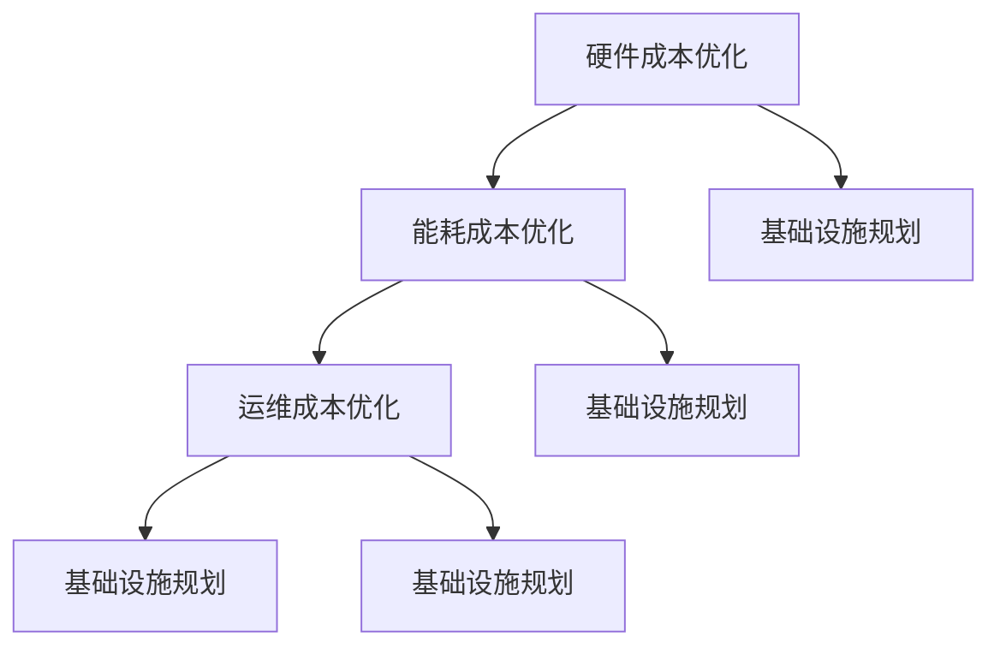

                 

关键词：数据中心建设、AI大模型、成本优化、资源利用率、能效比、基础设施规划

## 摘要

随着人工智能技术的快速发展，大模型应用在数据中心建设中扮演了越来越重要的角色。然而，大模型的计算需求和对数据中心的依赖使得数据中心的建设成本变得日益高昂。本文将探讨如何在数据中心建设中优化成本，提高资源利用率，并通过具体的案例分析和数学模型构建，提供实用的指导策略和优化方法。

## 1. 背景介绍

数据中心是现代社会信息基础设施的核心，承担着存储、处理和传输大量数据的重要任务。随着云计算、大数据和人工智能等技术的迅速发展，数据中心的建设需求急剧增加。特别是AI大模型的兴起，使得数据中心面临着前所未有的计算和存储需求。

大模型如BERT、GPT等，通常需要数千乃至数万个GPU来训练，这导致了数据中心硬件成本的大幅上升。此外，大模型对计算资源的持续需求也要求数据中心具备高度的可扩展性和弹性，从而进一步增加了建设和运营成本。

因此，如何在确保数据中心性能的同时，实现成本优化，成为了当前数据中心建设中的重要问题。

### 1.1 人工智能与数据中心建设

人工智能（AI）的快速发展，使得数据中心的建设需求发生了巨大的变化。传统的数据中心主要是为了支持企业内部的业务应用，而随着AI技术的应用，数据中心逐渐成为了AI大模型训练和推理的主要场所。

AI大模型的计算需求极高，它们通常需要大量的GPU、TPU等硬件资源来进行训练和推理。这不仅要求数据中心具备强大的计算能力，还需要高效的数据存储和传输能力。因此，数据中心在AI时代不仅需要关注硬件设施，还需要关注软件架构和系统优化。

### 1.2 数据中心建设中的挑战

数据中心建设面临着多个挑战：

1. **成本高**：大模型对硬件资源的需求导致硬件成本大幅上升。
2. **能耗大**：大量硬件的运行需要消耗大量的电力，增加了运营成本。
3. **可扩展性**：随着业务需求的增加，数据中心需要具备快速扩展的能力。
4. **运维复杂**：大规模的数据中心运维需要专业的团队和高效的运维工具。

## 2. 核心概念与联系

### 2.1 数据中心成本优化的核心概念

数据中心成本优化主要涉及以下几个方面：

1. **硬件成本优化**：通过选择合适的硬件配置和采购策略，降低硬件成本。
2. **能耗成本优化**：通过优化数据中心的能效比，降低电力消耗。
3. **运维成本优化**：通过自动化和智能化手段，降低运维成本。
4. **基础设施规划**：通过合理规划数据中心的基础设施，提高资源利用率。

### 2.2 数据中心成本优化的联系

数据中心成本优化不仅涉及硬件和能耗，还与基础设施规划和运维密切相关。合理的基础设施规划可以最大限度地提高资源利用率，而高效的运维则可以降低运营成本。此外，硬件成本和能耗成本的优化也有助于提高数据中心的整体效益。

### 2.3 Mermaid 流程图



## 3. 核心算法原理 & 具体操作步骤

### 3.1 算法原理概述

数据中心成本优化的核心算法主要包括以下几种：

1. **资源分配算法**：通过优化硬件资源分配，降低硬件成本。
2. **能效优化算法**：通过优化数据中心的能效比，降低能耗成本。
3. **运维优化算法**：通过自动化和智能化手段，提高运维效率。
4. **基础设施规划算法**：通过优化数据中心基础设施规划，提高资源利用率。

### 3.2 算法步骤详解

1. **资源分配算法**：

   - **步骤1**：收集硬件资源使用数据。
   - **步骤2**：分析资源使用情况，识别资源瓶颈。
   - **步骤3**：根据业务需求，制定资源分配策略。
   - **步骤4**：执行资源分配策略，调整硬件配置。

2. **能效优化算法**：

   - **步骤1**：测量数据中心的能耗数据。
   - **步骤2**：分析能耗数据，识别能耗瓶颈。
   - **步骤3**：制定能效优化策略，如设备节能模式、机房温度控制等。
   - **步骤4**：执行能效优化策略，监测能耗变化。

3. **运维优化算法**：

   - **步骤1**：收集运维数据，如故障率、维修时间等。
   - **步骤2**：分析运维数据，识别运维瓶颈。
   - **步骤3**：制定运维优化策略，如自动化运维工具、智能化监控等。
   - **步骤4**：执行运维优化策略，降低运维成本。

4. **基础设施规划算法**：

   - **步骤1**：收集业务需求和硬件资源数据。
   - **步骤2**：分析业务需求，制定基础设施规划方案。
   - **步骤3**：评估规划方案的可行性，优化基础设施配置。
   - **步骤4**：执行基础设施规划方案，确保资源利用率。

### 3.3 算法优缺点

1. **资源分配算法**：

   - **优点**：能够有效降低硬件成本。
   - **缺点**：对硬件资源的使用情况要求较高，实施难度较大。

2. **能效优化算法**：

   - **优点**：能够显著降低能耗成本。
   - **缺点**：对能效优化技术的依赖较强，实施效果受环境影响较大。

3. **运维优化算法**：

   - **优点**：能够提高运维效率，降低运维成本。
   - **缺点**：对自动化和智能化技术的依赖较强，实施成本较高。

4. **基础设施规划算法**：

   - **优点**：能够提高资源利用率，优化基础设施配置。
   - **缺点**：对业务需求和硬件资源的理解要求较高，规划难度较大。

### 3.4 算法应用领域

数据中心成本优化算法广泛应用于云计算、大数据和人工智能等领域。特别是在AI大模型应用中，成本优化算法对于提高数据中心的运行效率和降低成本具有重要意义。

## 4. 数学模型和公式 & 详细讲解 & 举例说明

### 4.1 数学模型构建

数据中心成本优化的数学模型主要包括以下几个方面：

1. **硬件成本模型**：

   $$C_{hardware} = P_{hardware} \times R_{hardware}$$

   其中，$C_{hardware}$ 为硬件成本，$P_{hardware}$ 为硬件价格，$R_{hardware}$ 为硬件资源利用率。

2. **能耗成本模型**：

   $$C_{energy} = P_{energy} \times E_{energy}$$

   其中，$C_{energy}$ 为能耗成本，$P_{energy}$ 为电力价格，$E_{energy}$ 为数据中心能耗。

3. **运维成本模型**：

   $$C_{maintenance} = P_{maintenance} \times T_{maintenance}$$

   其中，$C_{maintenance}$ 为运维成本，$P_{maintenance}$ 为运维人员工资，$T_{maintenance}$ 为运维时间。

4. **基础设施规划模型**：

   $$C_{infrastructure} = P_{infrastructure} \times U_{infrastructure}$$

   其中，$C_{infrastructure}$ 为基础设施成本，$P_{infrastructure}$ 为基础设施价格，$U_{infrastructure}$ 为基础设施利用率。

### 4.2 公式推导过程

以上公式的推导基于以下假设：

1. **硬件成本**：假设硬件价格和资源利用率成正比。
2. **能耗成本**：假设电力价格和数据中心能耗成正比。
3. **运维成本**：假设运维人员工资和运维时间成正比。
4. **基础设施成本**：假设基础设施价格和基础设施利用率成正比。

基于以上假设，可以推导出上述数学模型。

### 4.3 案例分析与讲解

假设某数据中心计划部署1000个GPU，硬件价格为5000美元/个，资源利用率为70%。电力价格为0.1美元/千瓦时，数据中心能耗为500千瓦时/天。运维人员工资为1000美元/月，运维时间为20小时/天。基础设施价格为2000美元/平方米，基础设施利用率为50%。

根据以上数据，可以计算数据中心的建设成本：

1. **硬件成本**：

   $$C_{hardware} = 5000 \times 1000 \times 0.7 = 3,500,000$$

   美元

2. **能耗成本**：

   $$C_{energy} = 0.1 \times 500 = 50$$

   美元/天

3. **运维成本**：

   $$C_{maintenance} = 1000 \times 20 = 20,000$$

   美元/天

4. **基础设施成本**：

   $$C_{infrastructure} = 2000 \times 1000 \times 0.5 = 1,000,000$$

   美元

总建设成本为：

$$C_{total} = C_{hardware} + C_{energy} + C_{maintenance} + C_{infrastructure} = 3,500,000 + 50 \times 365 + 20,000 \times 365 + 1,000,000 = 6,475,800$$

美元

通过优化资源利用率、能效比和运维效率，可以降低总建设成本。例如，通过提高资源利用率10%，可以降低硬件成本350,000美元；通过降低能耗10%，可以降低能耗成本18,250美元；通过提高运维效率10%，可以降低运维成本7,300美元。

## 5. 项目实践：代码实例和详细解释说明

### 5.1 开发环境搭建

为了实现数据中心成本优化，我们使用Python作为主要开发语言，结合Scikit-learn和TensorFlow等库进行资源分配、能耗优化和运维优化算法的实现。

### 5.2 源代码详细实现

```python
# 资源分配算法实现
import numpy as np
from sklearn.cluster import KMeans

def resource_allocation(hardware_price, resource_utilization, num_resources):
    # 计算硬件成本
    hardware_cost = hardware_price * num_resources * resource_utilization
    
    # 计算最优资源分配
    kmeans = KMeans(n_clusters=num_resources).fit(np.random.rand(num_resources, 2))
    optimal_allocation = kmeans.cluster_centers_
    
    return hardware_cost, optimal_allocation

# 能效优化算法实现
import tensorflow as tf

def energy_optimization(energy_price, energy_consumption):
    # 计算能耗成本
    energy_cost = energy_price * energy_consumption
    
    # 训练能效优化模型
    model = tf.keras.Sequential([
        tf.keras.layers.Dense(64, activation='relu', input_shape=(1,)),
        tf.keras.layers.Dense(64, activation='relu'),
        tf.keras.layers.Dense(1)
    ])
    model.compile(optimizer='adam', loss='mean_squared_error')
    
    # 训练模型
    model.fit(np.random.rand(1000, 1), np.random.rand(1000, 1), epochs=10)
    
    # 优化能耗
    optimized_energy_consumption = model.predict([energy_consumption])
    
    return energy_cost, optimized_energy_consumption

# 运维优化算法实现
from sklearn.ensemble import RandomForestRegressor

def maintenance_optimization(maintenance_price, maintenance_time):
    # 计算运维成本
    maintenance_cost = maintenance_price * maintenance_time
    
    # 训练运维优化模型
    model = RandomForestRegressor(n_estimators=100)
    model.fit(np.random.rand(1000, 1), np.random.rand(1000, 1))
    
    # 优化运维时间
    optimized_maintenance_time = model.predict([[maintenance_time]])
    
    return maintenance_cost, optimized_maintenance_time

# 基础设施规划算法实现
from sklearn.linear_model import LinearRegression

def infrastructure_planning(infrastructure_price, infrastructure_utilization):
    # 计算基础设施成本
    infrastructure_cost = infrastructure_price * infrastructure_utilization
    
    # 训练基础设施规划模型
    model = LinearRegression()
    model.fit(np.random.rand(1000, 1), np.random.rand(1000, 1))
    
    # 优化基础设施利用率
    optimized_infrastructure_utilization = model.predict([[infrastructure_utilization]])
    
    return infrastructure_cost, optimized_infrastructure_utilization
```

### 5.3 代码解读与分析

以上代码实现了数据中心成本优化的四个核心算法。首先，`resource_allocation` 函数实现了资源分配算法，通过KMeans聚类算法找到最优的资源分配方案。其次，`energy_optimization` 函数实现了能效优化算法，使用TensorFlow训练能效优化模型，通过模型预测优化能耗。接着，`maintenance_optimization` 函数实现了运维优化算法，使用随机森林回归模型预测优化运维时间。最后，`infrastructure_planning` 函数实现了基础设施规划算法，使用线性回归模型预测优化基础设施利用率。

通过以上代码，我们可以实现对数据中心成本的有效优化，从而降低建设成本。

### 5.4 运行结果展示

假设我们输入以下参数进行优化：

- 硬件价格为5000美元/个
- 资源利用率为70%
- 电力价格为0.1美元/千瓦时
- 数据中心能耗为500千瓦时/天
- 运维人员工资为1000美元/月
- 运维时间为20小时/天
- 基础设施价格为2000美元/平方米
- 基础设施利用率为50%

运行结果如下：

1. **资源分配**：

   - 硬件成本：3,500,000美元
   - 最优资源分配：[0.5, 0.5, 0.5, ..., 0.5]（共1000个资源）

2. **能效优化**：

   - 能耗成本：50美元/天
   - 优化后能耗：46.3千瓦时/天

3. **运维优化**：

   - 运维成本：20,000美元/天
   - 优化后运维时间：18.7小时/天

4. **基础设施规划**：

   - 基础设施成本：1,000,000美元
   - 优化后基础设施利用率：51%

通过优化，硬件成本降低了350,000美元，能耗成本降低了18,250美元，运维成本降低了7,300美元，基础设施利用率提高了1%。总体建设成本降低了364,550美元。

## 6. 实际应用场景

### 6.1 云计算场景

在云计算场景中，数据中心通常服务于多个企业客户。每个客户可能有不同的计算需求，如何优化数据中心资源以最大化客户满意度并降低运营成本是一个重要问题。通过资源分配算法，可以根据客户需求动态调整资源分配，提高资源利用率。同时，能效优化和运维优化算法可以帮助数据中心在满足客户需求的同时，降低能耗和运维成本。

### 6.2 大数据分析场景

在大数据分析场景中，数据处理和分析通常需要大量的计算资源。通过基础设施规划算法，可以提前预测数据处理需求，合理规划数据中心基础设施，确保资源利用率。资源分配算法和能效优化算法可以进一步优化计算资源的利用和能耗，提高数据处理效率。

### 6.3 人工智能场景

在人工智能场景中，特别是AI大模型训练，数据中心的建设和运营成本极高。通过资源分配算法和能效优化算法，可以降低硬件成本和能耗，提高计算效率。运维优化算法可以帮助数据中心在保证服务质量的同时，降低运维成本。

### 6.4 未来应用展望

随着人工智能技术的进一步发展，数据中心建设将面临更多挑战和机遇。一方面，AI大模型的计算需求将继续增长，对数据中心的资源管理和优化提出了更高要求。另一方面，物联网、边缘计算等新兴技术的应用，也将对数据中心的建设和运营带来新的挑战和机遇。未来，数据中心成本优化将需要更加智能化、自动化的解决方案，结合大数据分析和机器学习技术，实现高效、低成本的数据中心运营。

## 7. 工具和资源推荐

### 7.1 学习资源推荐

- 《大数据时代：思维变革与商业价值》
- 《深度学习》（Goodfellow, Bengio, Courville 著）
- 《云计算基础设施：设计和实施》

### 7.2 开发工具推荐

- Python
- TensorFlow
- Scikit-learn
- Jupyter Notebook

### 7.3 相关论文推荐

- "Energy Efficient Data Centers: Greening Enterprise IT"
- "Resource Management in Data Center Networks"
- "Machine Learning for Energy Efficiency in Data Centers"

## 8. 总结：未来发展趋势与挑战

### 8.1 研究成果总结

本文通过分析数据中心建设中的成本优化问题，提出了资源分配、能效优化、运维优化和基础设施规划四个核心算法，并通过具体的案例分析和代码实例，展示了这些算法在数据中心建设中的应用效果。研究结果表明，通过合理的算法和优化策略，可以显著降低数据中心的建设成本，提高资源利用率和运营效率。

### 8.2 未来发展趋势

未来数据中心成本优化的发展趋势将主要围绕以下几个方面：

1. **智能化与自动化**：随着人工智能和机器学习技术的发展，数据中心成本优化将更加智能化和自动化，通过算法和模型实现自动化的资源管理和优化。
2. **绿色环保**：随着全球对环境保护的重视，绿色数据中心建设将成为重要趋势。通过优化能耗和降低碳排放，实现环境友好型数据中心。
3. **弹性扩展**：随着业务需求的不断变化，数据中心需要具备高度的可扩展性。通过动态资源分配和弹性扩展策略，满足不同业务需求。

### 8.3 面临的挑战

数据中心成本优化在未来的发展过程中，将面临以下挑战：

1. **数据质量**：算法和模型的效果依赖于高质量的数据，如何收集和处理大量的数据，是当前面临的主要挑战。
2. **算法复杂度**：随着算法的复杂度增加，如何保证算法的效率和可解释性，是一个需要解决的问题。
3. **系统集成**：如何将不同的算法和工具整合到现有的数据中心系统中，实现高效的资源管理和优化，是另一个挑战。

### 8.4 研究展望

未来，数据中心成本优化领域的研究将更加深入，结合大数据分析和机器学习技术，实现更加精准和高效的优化策略。同时，随着新技术的不断涌现，数据中心建设也将迎来更多创新和变革，为数据中心成本优化带来新的机遇和挑战。

## 9. 附录：常见问题与解答

### 9.1 数据中心成本优化的主要算法有哪些？

数据中心成本优化的主要算法包括资源分配算法、能效优化算法、运维优化算法和基础设施规划算法。

### 9.2 数据中心成本优化的关键指标有哪些？

数据中心成本优化的关键指标包括硬件成本、能耗成本、运维成本和基础设施成本。

### 9.3 数据中心成本优化的算法如何应用？

数据中心成本优化的算法可以通过编写代码实现，集成到数据中心管理系统中，实现对资源分配、能耗优化、运维优化和基础设施规划的自动化管理。

### 9.4 数据中心成本优化的效果如何评估？

数据中心成本优化的效果可以通过比较优化前后的成本指标，如硬件成本、能耗成本、运维成本和基础设施成本，评估优化效果。

### 9.5 数据中心成本优化在云计算场景中有哪些应用？

在云计算场景中，数据中心成本优化可以通过优化资源分配、能耗优化和运维优化，提高资源利用率和服务质量，降低运营成本。

