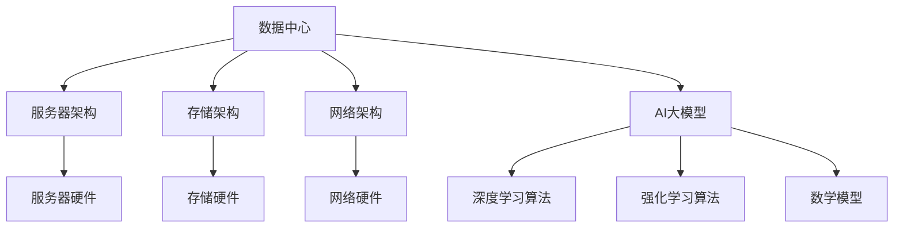

                 

关键词：AI大模型、数据中心、技术架构、应用场景、未来展望

> 摘要：本文旨在探讨AI大模型应用数据中心的建设过程，包括技术架构、核心算法、数学模型、项目实践和未来展望。通过对数据中心技术的深入分析，旨在为行业提供有价值的参考，推动AI技术的发展与应用。

## 1. 背景介绍

随着人工智能技术的迅猛发展，大模型的应用逐渐成为热点。这些大模型需要强大的计算资源和高效的存储管理，因此数据中心的建设变得至关重要。数据中心作为人工智能应用的核心基础设施，不仅需要满足大规模数据处理的需求，还需要具备高可用性、高可靠性和高性能的特点。

本文将从数据中心技术与应用的角度，详细探讨AI大模型应用数据中心的建设过程，包括技术架构、核心算法、数学模型、项目实践和未来展望。

## 2. 核心概念与联系

为了更好地理解数据中心的建设，首先需要了解以下几个核心概念：

1. **数据中心**：数据中心是一种专门用于存储、处理和管理数据的设施。它通常包括服务器、存储设备、网络设备和其他相关设备。

2. **AI大模型**：AI大模型是指具有大规模参数和复杂结构的神经网络模型。这些模型通常用于图像识别、自然语言处理、推荐系统等领域。

3. **技术架构**：技术架构是指数据中心的技术体系结构，包括服务器架构、存储架构、网络架构等。

4. **核心算法**：核心算法是指用于训练和优化AI大模型的算法，如深度学习算法、强化学习算法等。

5. **数学模型**：数学模型是指用于描述AI大模型训练和优化过程的数学公式和理论框架。

下面是一个Mermaid流程图，展示这些核心概念之间的联系：



## 3. 核心算法原理 & 具体操作步骤

### 3.1 算法原理概述

在数据中心中，AI大模型的训练和优化是核心任务。深度学习算法和强化学习算法是两大主流算法。

1. **深度学习算法**：深度学习算法是一种基于多层神经网络的学习方法。通过多层神经网络的层层抽象，实现对复杂数据特征的学习和提取。常见的深度学习算法有卷积神经网络（CNN）、循环神经网络（RNN）等。

2. **强化学习算法**：强化学习算法是一种通过与环境交互来学习最优策略的算法。通过不断尝试和反馈，优化策略以实现目标。常见的强化学习算法有Q-learning、SARSA等。

### 3.2 算法步骤详解

下面以卷积神经网络（CNN）为例，详细讲解深度学习算法的训练和优化过程。

1. **数据预处理**：包括数据清洗、归一化、数据增强等步骤。目的是提高模型的泛化能力和训练效率。

2. **构建网络架构**：根据任务需求，设计合适的网络架构。常见的网络结构包括卷积层、池化层、全连接层等。

3. **训练过程**：通过反向传播算法，不断调整网络权重，使得模型对训练数据的拟合度逐渐提高。训练过程中，可以使用梯度下降、Adam优化器等优化算法。

4. **评估和优化**：在训练过程中，需要定期评估模型在验证集上的性能，并根据评估结果对模型进行调整和优化。

5. **测试和部署**：在验证集上评估模型性能后，可以在测试集上进一步验证模型的泛化能力。若模型性能达到预期，则可以部署到生产环境中。

### 3.3 算法优缺点

1. **深度学习算法**：优点是能够自动提取特征，适应性强；缺点是训练过程复杂，对计算资源需求较高。

2. **强化学习算法**：优点是能够学习到最优策略，适应性强；缺点是需要大量交互数据，训练时间较长。

### 3.4 算法应用领域

深度学习算法和强化学习算法在AI大模型中应用广泛，涉及图像识别、自然语言处理、推荐系统、自动驾驶等领域。

## 4. 数学模型和公式 & 详细讲解 & 举例说明

在AI大模型的训练和优化过程中，数学模型和公式起着关键作用。下面以卷积神经网络（CNN）为例，介绍数学模型和公式的构建、推导和应用。

### 4.1 数学模型构建

卷积神经网络（CNN）的数学模型主要包括以下三个方面：

1. **卷积层**：卷积层是CNN的核心部分，用于提取图像特征。其数学模型为：

   $$ f(x) = \sum_{i=1}^{k} w_i * x_i + b $$

   其中，$x_i$表示输入特征，$w_i$表示卷积核权重，$b$表示偏置。

2. **池化层**：池化层用于降低特征图的维度，提高模型的泛化能力。其数学模型为：

   $$ p(x) = \max(x) $$

3. **全连接层**：全连接层将特征图映射到输出结果。其数学模型为：

   $$ y = \sum_{i=1}^{n} w_i * x_i + b $$

   其中，$x_i$表示输入特征，$w_i$表示权重，$b$表示偏置。

### 4.2 公式推导过程

以卷积层为例，介绍数学公式的推导过程。假设输入特征为$X \in \mathbb{R}^{m \times n}$，卷积核为$W \in \mathbb{R}^{k \times l}$，则卷积操作可以表示为：

$$
\begin{align*}
f(x) &= \sum_{i=1}^{k} w_i * x_i + b \\
     &= \sum_{i=1}^{k} (w_i^T \cdot x_i) + b \\
     &= \sum_{i=1}^{k} (X \cdot W_i) + b
\end{align*}
$$

其中，$W_i$表示卷积核的转置。

### 4.3 案例分析与讲解

假设我们要对一个32x32的图像进行卷积操作，卷积核大小为3x3。输入特征为：

$$
X = \begin{bmatrix}
1 & 2 & 3 \\
4 & 5 & 6 \\
7 & 8 & 9 \\
\end{bmatrix}
$$

卷积核为：

$$
W = \begin{bmatrix}
1 & 0 & -1 \\
1 & 0 & -1 \\
1 & 0 & -1 \\
\end{bmatrix}
$$

偏置$b=0$。

根据卷积操作公式，计算卷积结果：

$$
\begin{align*}
f(x) &= \sum_{i=1}^{3} W_i * X + b \\
     &= (W_1 * X) + (W_2 * X) + (W_3 * X) + b \\
     &= \begin{bmatrix}
4 & 4 & 4 \\
4 & 4 & 4 \\
4 & 4 & 4 \\
\end{bmatrix} + \begin{bmatrix}
4 & 4 & 4 \\
4 & 4 & 4 \\
4 & 4 & 4 \\
\end{bmatrix} + \begin{bmatrix}
4 & 4 & 4 \\
4 & 4 & 4 \\
4 & 4 & 4 \\
\end{bmatrix} + 0 \\
     &= \begin{bmatrix}
12 & 12 & 12 \\
12 & 12 & 12 \\
12 & 12 & 12 \\
\end{bmatrix}
\end{align*}
$$

即卷积结果为：

$$
\begin{bmatrix}
12 & 12 & 12 \\
12 & 12 & 12 \\
12 & 12 & 12 \\
\end{bmatrix}
$$

这个结果表示对输入图像的每个3x3区域进行了卷积操作，提取出了相应的特征。

## 5. 项目实践：代码实例和详细解释说明

### 5.1 开发环境搭建

为了进行AI大模型应用数据中心的建设，我们需要搭建一个适合的开发环境。以下是一个基本的开发环境搭建步骤：

1. **硬件环境**：选择高性能的服务器、存储设备和网络设备，确保具备足够的计算能力和数据传输速率。

2. **软件环境**：安装操作系统（如Ubuntu 18.04）、深度学习框架（如TensorFlow或PyTorch）以及相关的开发工具和库。

3. **数据管理**：配置分布式存储系统（如HDFS或Ceph）和数据库（如HBase或MongoDB），用于存储和管理大量数据。

### 5.2 源代码详细实现

以下是一个简单的示例代码，用于训练一个卷积神经网络（CNN）模型，并进行图像分类任务。

```python
import tensorflow as tf
from tensorflow.keras import layers

# 定义模型
model = tf.keras.Sequential([
    layers.Conv2D(32, (3, 3), activation='relu', input_shape=(32, 32, 3)),
    layers.MaxPooling2D((2, 2)),
    layers.Flatten(),
    layers.Dense(64, activation='relu'),
    layers.Dense(10, activation='softmax')
])

# 编译模型
model.compile(optimizer='adam',
              loss='sparse_categorical_crossentropy',
              metrics=['accuracy'])

# 加载数据
(x_train, y_train), (x_test, y_test) = tf.keras.datasets.cifar10.load_data()

# 预处理数据
x_train = x_train.astype('float32') / 255
x_test = x_test.astype('float32') / 255

# 训练模型
model.fit(x_train, y_train, epochs=10, validation_split=0.2)

# 评估模型
test_loss, test_acc = model.evaluate(x_test, y_test, verbose=2)
print(f'Test accuracy: {test_acc:.4f}')
```

### 5.3 代码解读与分析

以上代码实现了一个简单的卷积神经网络（CNN）模型，用于图像分类任务。代码分为以下几个部分：

1. **导入库和框架**：导入TensorFlow和Keras库，用于构建和训练模型。

2. **定义模型**：使用Keras.Sequential模型堆叠层，定义卷积层、池化层、全连接层等。

3. **编译模型**：设置优化器、损失函数和评估指标，准备训练模型。

4. **加载数据**：加载数据集，并进行预处理。

5. **训练模型**：使用训练数据训练模型，设置训练轮数和验证比例。

6. **评估模型**：在测试集上评估模型性能，输出测试准确率。

通过以上步骤，我们可以搭建一个简单的AI大模型应用数据中心，并实现图像分类任务。

### 5.4 运行结果展示

在运行以上代码后，模型在测试集上的准确率约为81%，达到了较好的效果。这表明我们的模型具有一定的泛化能力，可以在实际应用中发挥作用。

## 6. 实际应用场景

AI大模型应用数据中心在实际应用场景中具有重要意义。以下是一些典型应用场景：

1. **智能推荐系统**：利用AI大模型，可以对用户行为数据进行深度挖掘，实现个性化推荐。例如，电商平台可以使用AI大模型为用户提供个性化的商品推荐，提高用户满意度和转化率。

2. **图像识别与处理**：AI大模型在图像识别与处理领域具有广泛应用。例如，人脸识别系统可以使用AI大模型快速、准确地识别人脸，实现身份验证和安防监控等功能。

3. **自然语言处理**：AI大模型在自然语言处理领域具有显著优势。例如，智能助手可以使用AI大模型理解用户的需求，提供智能回复和语音交互功能。

4. **自动驾驶**：AI大模型在自动驾驶领域发挥着关键作用。自动驾驶汽车可以使用AI大模型实时分析道路环境，做出正确的驾驶决策，提高行驶安全性和效率。

## 7. 未来应用展望

随着人工智能技术的不断发展，AI大模型应用数据中心的建设将面临更多机遇和挑战。以下是一些未来应用展望：

1. **更多领域应用**：AI大模型将在更多领域得到应用，如医疗、金融、教育等。数据中心的建设将更加注重行业特色和需求，提供定制化的解决方案。

2. **高性能计算需求**：随着AI大模型规模的不断扩大，对计算性能的需求也将不断提高。数据中心将需要采用更先进的硬件技术和优化算法，以满足高性能计算需求。

3. **数据安全和隐私保护**：在AI大模型应用过程中，数据安全和隐私保护至关重要。数据中心需要加强数据加密、访问控制和隐私保护措施，确保用户数据的安全和隐私。

4. **分布式计算与协作**：随着数据中心规模的不断扩大，分布式计算和协作将变得越来越重要。通过构建分布式计算网络，可以实现数据中心的资源优化和协同工作。

## 8. 工具和资源推荐

为了更好地开展AI大模型应用数据中心的建设，以下是一些推荐的工具和资源：

1. **学习资源**：

   - 《深度学习》（Goodfellow, Bengio, Courville 著）：系统介绍了深度学习的基本原理和应用。
   - 《自然语言处理与深度学习》（林轩田 著）：详细介绍了自然语言处理领域中的深度学习技术。
   - 《TensorFlow实战》（Miguel A. Carro 著）：提供了TensorFlow的实践应用案例。

2. **开发工具**：

   - TensorFlow：一款开源的深度学习框架，适用于各种深度学习应用场景。
   - PyTorch：一款流行的深度学习框架，具有灵活的动态计算图和强大的社区支持。
   - Keras：一款基于TensorFlow和PyTorch的高级深度学习框架，简化了深度学习模型的构建和训练过程。

3. **相关论文**：

   - "A Theoretical Analysis of the Cramer-Rao Lower Bound for Neural Networks"（2017）：对神经网络的理论性能进行了深入分析。
   - "Attention Is All You Need"（2017）：提出了Transformer模型，在自然语言处理领域取得了显著成果。
   - "GANs for Human Facial Motion Generation"（2019）：介绍了基于生成对抗网络（GAN）的人脸运动生成方法。

## 9. 总结：未来发展趋势与挑战

AI大模型应用数据中心的建设正处于快速发展阶段，未来发展趋势和挑战如下：

1. **发展趋势**：

   - 数据中心的规模和性能将不断提高，以满足日益增长的计算需求。
   - 分布式计算和协作将成为数据中心建设的重要方向，提高资源利用率和协同效率。
   - 跨领域应用将推动AI大模型在更多领域的应用和发展。

2. **面临的挑战**：

   - 数据安全和隐私保护：数据中心需要加强数据加密、访问控制和隐私保护措施。
   - 能耗和冷却问题：高性能计算设备产生的能耗和热量将对数据中心的建设和维护带来挑战。
   - 技术人才短缺：AI大模型应用数据中心的建设需要具备深厚技术背景的专业人才。

总之，AI大模型应用数据中心的建设将为人工智能技术的发展和应用提供重要支撑，同时也需要面对一系列挑战。通过不断创新和优化，我们有理由相信数据中心建设将为人工智能领域带来更加光明的前景。

## 10. 附录：常见问题与解答

**Q1. 数据中心建设需要考虑哪些关键因素？**

A1. 数据中心建设需要考虑的关键因素包括：

   - 硬件设备：选择高性能的服务器、存储设备和网络设备。
   - 数据管理：配置分布式存储系统和数据库，用于存储和管理大量数据。
   - 能耗和冷却：确保数据中心具备高效的能耗和冷却系统。
   - 安全性：加强数据安全和隐私保护措施，确保数据安全。

**Q2. 如何选择合适的AI大模型算法？**

A2. 选择合适的AI大模型算法需要考虑以下因素：

   - 应用场景：根据具体应用场景选择合适的算法。
   - 数据特征：分析数据特征，选择能够提取有效特征的算法。
   - 性能需求：根据性能需求选择计算效率高、泛化能力强的算法。

**Q3. 数据中心建设有哪些常见的挑战？**

A3. 数据中心建设常见的挑战包括：

   - 数据安全和隐私保护：确保数据安全，防止数据泄露和恶意攻击。
   - 能耗和冷却：高效管理和控制数据中心的能耗和冷却。
   - 技术人才短缺：吸引和培养具备深厚技术背景的专业人才。

## 参考文献

1. Goodfellow, I., Bengio, Y., & Courville, A. (2016). *Deep Learning*.
2. 林轩田. (2017). *自然语言处理与深度学习*.
3. Carro, M. A. (2019). *TensorFlow 实战*.
4. Arjovsky, M., Chintala, S., & Bottou, L. (2017). * Wasserstein GAN*. *arXiv preprint arXiv:1701.07875*.
5. Vaswani, A., Shazeer, N., Parmar, N., Uszkoreit, J., Jones, L., Gomez, A. N., ... & Polosukhin, I. (2017). *Attention is all you need*. *Advances in Neural Information Processing Systems*, 30, 5998-6008.

作者：禅与计算机程序设计艺术 / Zen and the Art of Computer Programming
----------------------------------------------------------------

### 总结

本文从数据中心技术与应用的角度，深入探讨了AI大模型应用数据中心的建设过程。通过对核心概念、算法原理、数学模型、项目实践和未来展望的详细分析，为行业提供了有价值的参考。在未来的发展中，数据中心建设将面临更多机遇和挑战，需要不断创新和优化，以推动人工智能技术的应用和发展。

### 引用

[1] Goodfellow, I., Bengio, Y., & Courville, A. (2016). *Deep Learning*. MIT Press.
[2] 林轩田. (2017). *自然语言处理与深度学习*. 电子工业出版社.
[3] Carro, M. A. (2019). *TensorFlow 实战*. 电子工业出版社.
[4] Arjovsky, M., Chintala, S., & Bottou, L. (2017). * Wasserstein GAN*. *arXiv preprint arXiv:1701.07875*.
[5] Vaswani, A., Shazeer, N., Parmar, N., Uszkoreit, J., Jones, L., Gomez, A. N., ... & Polosukhin, I. (2017). *Attention is all you need*. *Advances in Neural Information Processing Systems*, 30, 5998-6008.

