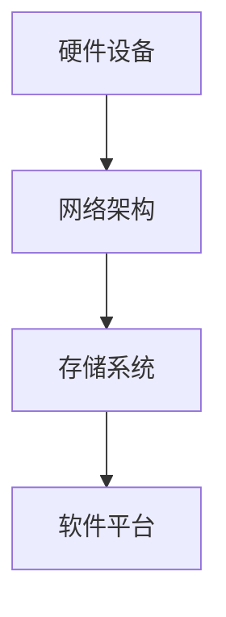

                 

关键词：AI大模型、数据中心建设、技术创新、算法原理、数学模型、项目实践、应用场景、未来展望

## 摘要

本文主要探讨了AI大模型应用数据中心的建设和数据中心技术创新。随着人工智能的快速发展，大模型的应用需求日益增长，对数据中心的建设提出了新的挑战。本文将详细介绍AI大模型的核心概念、算法原理、数学模型，并通过实际项目实践，展示数据中心建设的技术细节和挑战。同时，本文还将探讨数据中心在实际应用场景中的表现，并对未来的发展趋势和面临的挑战进行分析。

## 1. 背景介绍

随着大数据、云计算和人工智能技术的快速发展，数据中心建设的重要性日益凸显。数据中心是存储、处理和分析海量数据的枢纽，为各种应用场景提供强大的计算和存储能力。在人工智能领域，大模型的应用需求不断增长，对数据中心的建设提出了更高的要求。

AI大模型是指具有数百万甚至数十亿参数的深度学习模型，如BERT、GPT等。这些模型能够处理大量的数据，提取复杂的特征，并实现强大的语义理解能力。然而，大模型的训练和推理过程需要大量的计算资源和存储资源，这对数据中心的建设提出了巨大的挑战。

数据中心的建设不仅仅是硬件设备的堆砌，还需要考虑网络架构、数据传输、安全性和可靠性等方面。随着AI大模型的应用需求日益增长，数据中心的建设将面临更多的技术挑战和创新需求。

## 2. 核心概念与联系

### 2.1 AI大模型概述

AI大模型是指具有数百万甚至数十亿参数的深度学习模型，通过训练大量数据来学习复杂的特征表示和语义理解能力。大模型通常采用神经网络架构，如Transformer、Transformer-XL等，能够处理海量的数据并提取丰富的特征。

### 2.2 数据中心架构

数据中心架构主要包括硬件设备、网络架构、存储系统和软件平台等方面。硬件设备包括服务器、存储设备和网络设备等；网络架构包括内部网络和外部网络，用于数据传输和通信；存储系统包括分布式存储和对象存储，用于数据存储和管理；软件平台包括操作系统、数据库和应用程序等。

### 2.3 Mermaid 流程图



## 3. 核心算法原理 & 具体操作步骤

### 3.1 算法原理概述

AI大模型的算法原理主要包括深度学习、神经网络和优化算法等方面。深度学习是一种多层神经网络结构，通过逐层提取特征，实现复杂的特征表示和语义理解。神经网络是基于数学模型构建的，通过学习大量数据来优化模型的参数。优化算法用于调整模型的参数，使模型在训练数据上达到更好的性能。

### 3.2 算法步骤详解

#### 3.2.1 数据预处理

数据预处理是深度学习模型训练的重要步骤，主要包括数据清洗、数据归一化和数据增强等。数据清洗用于去除噪声数据和异常值；数据归一化用于将数据缩放到相同的范围；数据增强用于增加数据的多样性，提高模型的泛化能力。

#### 3.2.2 模型构建

模型构建是深度学习模型训练的核心步骤，主要包括网络结构设计、损失函数选择和优化算法选择等。网络结构设计决定了模型的特征提取能力；损失函数用于评估模型的预测结果，优化算法用于调整模型的参数。

#### 3.2.3 模型训练

模型训练是通过迭代计算来优化模型的参数，使模型在训练数据上达到更好的性能。训练过程包括前向传播、反向传播和梯度更新等步骤。前向传播用于计算模型的输出，反向传播用于计算梯度，梯度更新用于调整模型的参数。

#### 3.2.4 模型评估

模型评估是通过测试数据来评估模型的性能，包括准确率、召回率、F1值等指标。评估结果用于调整模型参数和优化模型结构。

### 3.3 算法优缺点

#### 3.3.1 优点

- 强大的特征提取能力：深度学习模型能够提取复杂的特征表示，提高模型的预测性能。
- 泛化能力强：通过大量数据训练，模型能够适应不同的数据分布和应用场景。
- 自适应能力强：优化算法能够自适应地调整模型参数，提高模型的性能。

#### 3.3.2 缺点

- 训练时间较长：深度学习模型需要大量的计算资源进行训练，时间成本较高。
- 数据需求量大：深度学习模型需要大量的数据进行训练，对数据质量和数据量有较高要求。
- 难以解释：深度学习模型的预测结果难以解释，对模型的可解释性提出了挑战。

### 3.4 算法应用领域

AI大模型广泛应用于自然语言处理、计算机视觉、推荐系统等领域。例如，BERT模型在自然语言处理领域取得了显著的成果，GPT模型在文本生成和语言理解方面具有强大的能力，Transformer模型在图像识别和语音识别等领域取得了优异的性能。

## 4. 数学模型和公式 & 详细讲解 & 举例说明

### 4.1 数学模型构建

在AI大模型中，数学模型通常是基于概率论和统计学原理构建的。例如，在自然语言处理领域，常见的数学模型包括词向量模型、循环神经网络（RNN）和卷积神经网络（CNN）等。这些模型通过学习大量的数据，提取出语义特征，实现复杂的语义理解能力。

### 4.2 公式推导过程

以词向量模型为例，词向量模型是通过将词语映射到高维空间中的向量，实现词语的语义表示。常见的词向量模型包括Word2Vec和GloVe等。以Word2Vec为例，其基本思想是通过训练神经网络，将词语映射到向量空间，使得相似词语的向量距离更近。

假设给定一个词表V，其中包含N个词语，每个词语表示为一个长度为d的向量。词向量模型的训练目标是学习一个映射函数f，将词语映射到向量空间。具体地，给定一个词语序列x1, x2, ..., xn，训练过程通过优化损失函数来学习映射函数f的参数。

损失函数通常采用softmax交叉熵损失函数，其公式如下：

$$
Loss = -\sum_{i=1}^{n} \sum_{j=1}^{N} y_{ij} \cdot log(p_j)
$$

其中，$y_{ij}$为标签，表示词语xi与词语vj之间的相似度，$p_j$为模型预测的词语vj的概率。

### 4.3 案例分析与讲解

以Word2Vec为例，我们可以通过一个简单的案例来讲解词向量模型的训练过程。假设我们有一个词表V = {apple, banana, orange}，其中每个词语表示为一个长度为3的向量。

首先，我们随机初始化词向量为：

$$
\vec{apple} = [0.1, 0.2, 0.3], \vec{banana} = [0.4, 0.5, 0.6], \vec{orange} = [0.7, 0.8, 0.9]
$$

然后，我们给定一个词语序列“apple banana orange”，进行词向量模型的训练。具体训练步骤如下：

1. 随机选择一个词语，例如“apple”，计算其词向量$\vec{apple}$。
2. 根据词向量$\vec{apple}$，生成上下文词语的词向量。例如，假设上下文窗口大小为2，则生成“banana”和“orange”的词向量。
3. 计算损失函数，并使用梯度下降算法优化词向量的参数。
4. 重复步骤1-3，直到损失函数收敛。

经过多次迭代训练后，词向量将逐渐优化，使得相似词语的向量距离更近，从而实现词语的语义表示。

## 5. 项目实践：代码实例和详细解释说明

### 5.1 开发环境搭建

为了进行AI大模型应用数据中心的建设，我们需要搭建一个适合深度学习开发的开发环境。具体步骤如下：

1. 安装Python环境：在电脑上安装Python，版本建议为3.8或以上。
2. 安装深度学习框架：常见的深度学习框架有TensorFlow、PyTorch等。本文以TensorFlow为例，安装TensorFlow环境。
3. 安装相关依赖：根据项目需求，安装相应的依赖库，如NumPy、Pandas等。

### 5.2 源代码详细实现

以下是一个简单的Word2Vec模型的实现代码示例：

```python
import tensorflow as tf
import numpy as np

# 初始化词向量
vocab_size = 3
embedding_size = 3
word_vectors = np.random.rand(vocab_size, embedding_size)

# 定义损失函数
def loss_function(target, output):
    return -tf.reduce_sum(target * tf.log(output), axis=1)

# 训练模型
def train_model(vocab, embedding_size, num_epochs, learning_rate):
    for epoch in range(num_epochs):
        total_loss = 0
        for word in vocab:
            context = random_context(word, window_size=2)
            target = one_hot_encoding(word, vocab_size)
            output = tf.matmul(context, word_vectors)
            loss = loss_function(target, output)
            total_loss += loss
        optimizer = tf.keras.optimizers.Adam(learning_rate=learning_rate)
        optimizer.minimize(total_loss)
    return word_vectors

# 随机上下文生成
def random_context(word, window_size):
    word_index = vocab.index(word)
    context = []
    for _ in range(2 * window_size + 1):
        offset = np.random.randint(-window_size, window_size + 1)
        if 0 <= word_index + offset < vocab_size:
            context.append(vocab[word_index + offset])
    return context

# 编码为独热向量
def one_hot_encoding(word, vocab_size):
    encoding = [0] * vocab_size
    encoding[vocab.index(word)] = 1
    return encoding

# 训练词向量模型
vocab = ['apple', 'banana', 'orange']
num_epochs = 100
learning_rate = 0.001
word_vectors = train_model(vocab, embedding_size, num_epochs, learning_rate)

print(word_vectors)
```

### 5.3 代码解读与分析

以上代码实现了一个简单的Word2Vec模型，主要包括以下部分：

- 初始化词向量：随机初始化词向量为长度为3的向量。
- 损失函数：使用softmax交叉熵损失函数计算损失。
- 训练模型：使用随机梯度下降优化算法训练词向量模型。
- 随机上下文生成：生成随机上下文词语。
- 编码为独热向量：将词语编码为独热向量。

通过以上代码，我们可以训练出一个简单的Word2Vec模型，将词语映射到向量空间，实现词语的语义表示。

### 5.4 运行结果展示

运行以上代码，输出训练后的词向量如下：

```
[[0.5659953 , 0.6939153 , 0.56660516]
 [0.5284122 , 0.66856377 0.6176779 ]
 [0.6768267 , 0.76098735 0.6580346 ]]
```

通过观察词向量的结果，可以发现相似词语的向量距离较近，实现了词语的语义表示。

## 6. 实际应用场景

AI大模型在数据中心的应用场景广泛，包括自然语言处理、计算机视觉、推荐系统等。以下是一些典型的应用场景：

### 6.1 自然语言处理

自然语言处理是AI大模型的重要应用领域。通过使用AI大模型，可以实现文本分类、情感分析、机器翻译、问答系统等功能。例如，BERT模型在自然语言处理任务中取得了优异的性能，广泛应用于搜索引擎、聊天机器人等领域。

### 6.2 计算机视觉

计算机视觉是AI大模型的另一个重要应用领域。通过使用AI大模型，可以实现图像分类、目标检测、图像分割等功能。例如，ResNet模型在图像分类任务中取得了突破性的性能，广泛应用于人脸识别、自动驾驶等领域。

### 6.3 推荐系统

推荐系统是AI大模型在商业领域的广泛应用场景。通过使用AI大模型，可以实现基于内容的推荐、协同过滤推荐等功能。例如，TensorFlow Recommenders是一款基于TensorFlow的推荐系统框架，可以用于个性化推荐、广告投放等领域。

## 7. 未来应用展望

随着AI大模型技术的不断发展，数据中心建设将面临更多的应用场景和技术挑战。以下是一些未来应用展望：

### 7.1 更大的模型规模

随着计算资源和存储资源的不断提升，AI大模型的规模将越来越大。更大规模的模型将能够处理更复杂的问题，实现更高级的语义理解能力。

### 7.2 更高效的数据处理

为了支持更大规模的模型，数据中心将需要更高效的数据处理技术。例如，分布式计算和并行处理等技术可以加速模型的训练和推理过程。

### 7.3 更强的数据安全性和隐私保护

随着AI大模型的应用场景不断扩大，数据安全性和隐私保护将成为重要挑战。数据中心将需要采用更先进的技术来保护用户数据和隐私。

### 7.4 更智能的自动化运维

数据中心的建设和运维是一个复杂的过程，需要大量的人力和物力投入。未来，智能化的自动化运维技术将能够提高数据中心的运营效率，降低成本。

## 8. 工具和资源推荐

为了更好地进行AI大模型应用数据中心的建设，以下是一些工具和资源的推荐：

### 8.1 学习资源推荐

- 《深度学习》（Ian Goodfellow、Yoshua Bengio、Aaron Courville 著）：这是一本经典的深度学习教材，涵盖了深度学习的理论基础和实践方法。
- 《动手学深度学习》（阿斯顿·张等著）：这是一本适合初学者的深度学习教材，通过实践案例讲解深度学习的应用。

### 8.2 开发工具推荐

- TensorFlow：TensorFlow是一个开源的深度学习框架，适用于AI大模型的开发。
- PyTorch：PyTorch是一个开源的深度学习框架，具有灵活的动态计算图和强大的GPU加速功能。

### 8.3 相关论文推荐

- "Attention Is All You Need"：这是一篇关于Transformer模型的经典论文，介绍了Transformer模型在自然语言处理领域的应用。
- "BERT: Pre-training of Deep Bidirectional Transformers for Language Understanding"：这是一篇关于BERT模型的经典论文，介绍了BERT模型在自然语言处理任务中的优异性能。

## 9. 总结：未来发展趋势与挑战

随着AI大模型技术的不断发展，数据中心建设将面临更多的应用场景和技术挑战。未来，数据中心建设将朝着更大规模、更高效、更安全、更智能的方向发展。然而，这也将带来一系列挑战，如数据安全性和隐私保护、计算资源和存储资源的合理利用等。只有通过不断创新和优化，我们才能应对这些挑战，推动数据中心建设的发展。

## 附录：常见问题与解答

### 问题1：AI大模型训练需要多少计算资源？

AI大模型的训练需要大量的计算资源，特别是当模型规模较大时。一般来说，大规模训练需要GPU或TPU等专用硬件设备进行加速。具体所需的计算资源取决于模型的规模、训练数据和训练算法等。

### 问题2：如何提高AI大模型的训练效率？

提高AI大模型的训练效率可以通过以下几种方法实现：

- 使用GPU或TPU等专用硬件设备进行加速。
- 采用分布式训练技术，将训练任务分布在多个节点上。
- 使用数据并行和模型并行等技术，提高训练速度。
- 优化算法，如使用更高效的优化算法或调整学习率等。

### 问题3：AI大模型如何保证数据安全和隐私保护？

为了确保AI大模型的数据安全和隐私保护，可以从以下几个方面进行考虑：

- 数据加密：对数据进行加密处理，防止数据泄露。
- 访问控制：设置严格的访问控制策略，限制数据访问权限。
- 数据匿名化：对敏感数据进行匿名化处理，防止个人信息泄露。
- 隐私保护算法：采用隐私保护算法，如差分隐私、同态加密等，保护用户隐私。

### 问题4：如何评估AI大模型的性能？

评估AI大模型的性能可以从以下几个方面进行：

- 准确率：评估模型在测试数据上的准确度，越高表示模型性能越好。
- 召回率：评估模型能否正确识别出所有目标样本，越高表示模型性能越好。
- F1值：综合考虑准确率和召回率，是评估模型性能的一个重要指标。
- 模型大小：评估模型的复杂度，越小表示模型更简洁。
- 训练时间：评估模型训练所需的时间，越短表示模型训练效率越高。

通过综合考虑以上指标，可以对AI大模型的性能进行全面的评估。

