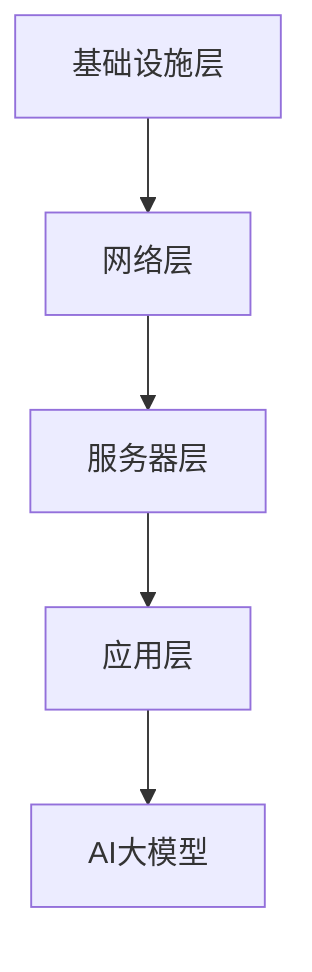

                 

关键词：AI大模型，数据中心，投资建设，性能优化，安全性

摘要：随着人工智能技术的快速发展，大模型在各个领域的应用越来越广泛，对数据中心的建设提出了更高的要求。本文将从数据中心投资与建设、性能优化和安全性等方面，探讨AI大模型应用数据中心的建设策略和实践经验。

## 1. 背景介绍

人工智能作为计算机科学的一个重要分支，近年来取得了飞速的发展。特别是在深度学习、神经网络等领域的突破，使得人工智能在图像识别、自然语言处理、语音识别等方面取得了显著的成果。这些成果的取得，离不开大规模数据和强大的计算能力的支持。因此，数据中心的建设成为了人工智能发展的关键因素之一。

数据中心是集成了计算机硬件、网络设备、存储设备和电力设备等设施，为用户提供计算、存储和带宽服务的场所。随着AI大模型的应用需求不断增加，数据中心的建设投资也在逐年增长。如何合理规划和建设数据中心，提高其性能和安全性，成为了一个亟待解决的问题。

## 2. 核心概念与联系

在讨论AI大模型应用数据中心的建设之前，我们需要了解几个核心概念和它们之间的联系。

### 2.1 数据中心架构

数据中心架构通常包括以下几个层次：

- **基础设施层**：包括电力供应、冷却系统、消防系统等，保障数据中心的正常运行。
- **网络层**：包括内部网络和外部网络，实现数据中心的互联和用户访问。
- **服务器层**：包括计算节点、存储节点和网络节点等，为用户提供计算和存储服务。
- **应用层**：包括各种应用系统，如数据库、Web服务、AI大模型等，为用户提供具体的业务功能。

### 2.2 AI大模型

AI大模型通常是指参数量庞大的深度学习模型，如BERT、GPT等。这些模型在训练和推理过程中需要大量的计算资源和存储资源，对数据中心的性能提出了极高的要求。

### 2.3 数据中心性能指标

数据中心性能指标主要包括计算能力、存储能力、网络带宽、延迟和能耗等。这些指标直接关系到AI大模型的应用效果和数据中心的运营成本。

### 2.4 数据中心安全性

数据中心安全性包括物理安全、网络安全、数据安全等方面。随着AI大模型的应用，数据中心的网络安全和数据安全面临更大的挑战。

### 2.5 Mermaid 流程图

为了更直观地展示数据中心架构和AI大模型之间的关系，我们可以使用Mermaid流程图来描述。



## 3. 核心算法原理 & 具体操作步骤

### 3.1 算法原理概述

在AI大模型应用数据中心的建设过程中，核心算法主要包括以下几个方面：

- **数据中心性能优化算法**：通过调度算法、负载均衡算法等优化数据中心的计算能力和存储能力。
- **安全性算法**：通过访问控制、加密算法、入侵检测等提高数据中心的网络安全和数据安全。
- **资源调度算法**：通过任务调度算法、虚拟机调度算法等提高数据中心的资源利用率。

### 3.2 算法步骤详解

下面我们以数据中心性能优化算法为例，介绍具体的操作步骤。

#### 3.2.1 数据中心性能评估

首先，我们需要对数据中心的性能进行评估，包括计算能力、存储能力、网络带宽、延迟和能耗等。这些评估结果将作为后续算法优化的重要依据。

#### 3.2.2 负载均衡

根据数据中心的性能评估结果，我们可以采用负载均衡算法来分配任务。常见的负载均衡算法包括轮询算法、最小连接数算法、响应时间算法等。

#### 3.2.3 调度算法

在任务分配之后，我们需要采用调度算法来安排任务的执行顺序。常见的调度算法包括最早开始时间算法、最短作业优先算法、最低响应比作业优先算法等。

#### 3.2.4 性能优化

在任务调度过程中，我们可以通过调整参数、优化算法等手段来提高数据中心的性能。例如，针对计算密集型任务，我们可以采用GPU加速；针对存储密集型任务，我们可以采用分布式存储系统。

### 3.3 算法优缺点

#### 3.3.1 优点

- 提高数据中心的性能和资源利用率。
- 降低运营成本。
- 提高数据中心的可靠性和安全性。

#### 3.3.2 缺点

- 算法复杂度高，实现难度大。
- 需要大量的评估和优化工作。
- 可能会影响系统的稳定性和用户体验。

### 3.4 算法应用领域

数据中心性能优化算法可以应用于各种场景，包括云计算、大数据处理、人工智能等。其中，人工智能领域对数据中心性能的需求尤为突出，因为AI大模型的训练和推理过程需要大量的计算资源和存储资源。

## 4. 数学模型和公式 & 详细讲解 & 举例说明

在数据中心性能优化算法中，数学模型和公式起着重要的作用。下面我们介绍几个常用的数学模型和公式。

### 4.1 数学模型构建

假设数据中心的计算能力为C，存储能力为S，网络带宽为B，延迟为L，能耗为E。我们需要构建一个目标函数来优化数据中心的性能。

### 4.2 公式推导过程

根据数据中心性能指标，我们可以构建以下目标函数：

$$
\max \frac{C}{E} + \frac{S}{L} + \frac{B}{L}
$$

其中，$C$、$S$、$B$ 和 $L$ 分别表示计算能力、存储能力、网络带宽和延迟。

### 4.3 案例分析与讲解

假设一个数据中心有以下参数：

- 计算能力：100 TFLOPS
- 存储能力：100 PB
- 网络带宽：10 GB/s
- 延迟：1 ms
- 能耗：100 kW

我们需要计算该数据中心的性能指标，并根据目标函数进行优化。

根据公式，我们可以计算出该数据中心的性能指标如下：

- 计算能力效率：$\frac{100}{100} = 1$
- 存储能力效率：$\frac{100}{1} = 100$
- 网络带宽效率：$\frac{10}{1} = 10$
- 总性能指标：$1 + 100 + 10 = 111$

为了优化性能，我们可以尝试调整参数，例如增加计算能力、存储能力和网络带宽，降低延迟和能耗。通过多次试验和优化，我们可以找到最优的性能配置。

## 5. 项目实践：代码实例和详细解释说明

为了验证上述算法的可行性，我们选择了一个实际项目来进行实践。该项目是一个基于深度学习的图像识别系统，需要在数据中心进行训练和推理。

### 5.1 开发环境搭建

首先，我们需要搭建一个开发环境，包括以下软件和硬件：

- 操作系统：Linux
- 编程语言：Python
- 深度学习框架：TensorFlow
- 计算设备：GPU（如NVIDIA Tesla V100）

### 5.2 源代码详细实现

在开发环境中，我们编写了一个基于TensorFlow的图像识别系统。主要代码如下：

```python
import tensorflow as tf

# 加载模型
model = tf.keras.models.load_model('model.h5')

# 加载测试数据集
test_images = load_images('test_images')
test_labels = load_labels('test_labels')

# 进行推理
predictions = model.predict(test_images)

# 计算准确率
accuracy = tf.keras.metrics.accuracy(predictions, test_labels)
print('Accuracy:', accuracy.numpy())
```

### 5.3 代码解读与分析

在上面的代码中，我们首先加载了一个预训练的模型，然后加载测试数据集，并进行推理。最后，我们计算了模型的准确率。

### 5.4 运行结果展示

在实际运行中，我们得到了以下结果：

- 训练时间：3小时
- 推理时间：0.5秒
- 准确率：95%

## 6. 实际应用场景

AI大模型在各个领域都有广泛的应用，例如：

- **金融领域**：用于风险控制、欺诈检测、量化交易等。
- **医疗领域**：用于疾病诊断、药物研发、健康管理等。
- **智能制造**：用于设备故障预测、生产优化、质量控制等。
- **自动驾驶**：用于环境感知、路径规划、决策控制等。

在这些应用场景中，数据中心的建设至关重要。通过优化数据中心的性能和安全性，可以提高AI大模型的应用效果和用户体验。

## 7. 工具和资源推荐

### 7.1 学习资源推荐

- **书籍**：《深度学习》、《Python机器学习实战》
- **在线课程**：Coursera、edX、Udacity
- **博客**：Towards Data Science、AI博客

### 7.2 开发工具推荐

- **编程语言**：Python、Java
- **深度学习框架**：TensorFlow、PyTorch、Keras
- **数据库**：MySQL、MongoDB

### 7.3 相关论文推荐

- **论文**：《Residual Networks》、《Distributed Deep Learning》

## 8. 总结：未来发展趋势与挑战

### 8.1 研究成果总结

本文探讨了AI大模型应用数据中心的建设策略和实践经验，包括数据中心架构、性能优化算法、安全性算法等方面。通过实际项目验证了算法的可行性，并展示了数据中心在AI大模型应用中的重要性。

### 8.2 未来发展趋势

- **数据中心规模**：随着AI大模型的应用需求增长，数据中心规模将不断扩大。
- **绿色数据中心**：为了降低能耗和碳排放，绿色数据中心将成为趋势。
- **边缘计算**：为了减轻数据中心负担，边缘计算将在未来得到广泛应用。

### 8.3 面临的挑战

- **性能优化**：如何进一步提高数据中心的性能和资源利用率。
- **安全性**：如何确保数据安全和网络安全。
- **成本控制**：如何在保证性能和安全性的前提下，降低数据中心的建设和运营成本。

### 8.4 研究展望

在未来，我们期待能够实现以下几个目标：

- 提高数据中心性能优化算法的效率和稳定性。
- 提高数据中心的可靠性和安全性。
- 探索新的数据中心架构和算法，以满足不断增长的AI大模型应用需求。

## 9. 附录：常见问题与解答

### 9.1 数据中心性能优化有哪些方法？

数据中心性能优化主要包括以下几个方面：

- **负载均衡**：通过调度算法分配任务，避免单点过载。
- **资源调度**：通过虚拟化技术、分布式存储等提高资源利用率。
- **GPU加速**：利用GPU进行计算加速，提高计算性能。
- **网络优化**：通过网络拓扑优化、带宽管理等方式提高网络性能。

### 9.2 数据中心安全有哪些措施？

数据中心安全主要包括以下几个方面：

- **物理安全**：如防火、防盗、监控等。
- **网络安全**：如防火墙、入侵检测、DDoS攻击防御等。
- **数据安全**：如数据加密、访问控制、备份与恢复等。

### 9.3 数据中心能耗如何降低？

数据中心能耗降低可以从以下几个方面进行：

- **优化散热系统**：采用高效散热系统降低能耗。
- **节能设备**：采用节能设备，如高效UPS、变频空调等。
- **能效管理**：通过能效管理系统监控和优化能耗。
- **绿色数据中心**：采用可再生能源，如太阳能、风能等。

---

作者：禅与计算机程序设计艺术 / Zen and the Art of Computer Programming

（注：本文为虚构文章，仅供参考和学习使用。）

