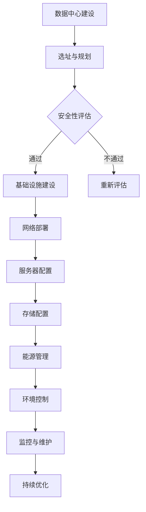

                 

关键词：AI大模型，数据中心，投资，建设，技术架构，未来展望

> 摘要：本文将深入探讨AI大模型应用数据中心的建设，重点关注数据中心的投资与建设策略，技术架构的设计与实现，以及数据中心在实际应用场景中的效果。通过对核心算法、数学模型、项目实践和未来应用的详细分析，本文旨在为读者提供关于数据中心建设的一套完整解决方案。

## 1. 背景介绍

随着人工智能技术的迅猛发展，AI大模型在各个行业得到了广泛应用。无论是自然语言处理、计算机视觉，还是推荐系统、智能监控，大模型都展现出了其强大的数据处理和预测能力。然而，这些应用背后的数据中心建设，成为了AI领域不可忽视的一环。数据中心不仅是AI大模型运行的载体，更是数据存储、计算和传输的中心。因此，如何合理规划与投资数据中心，成为了企业和研究者必须面对的重要课题。

本文将从以下几个方面展开讨论：
- **数据中心投资与建设策略**：分析数据中心的建设成本、经济效益、风险控制等。
- **技术架构设计与实现**：介绍数据中心的核心架构、关键组件及其协同工作原理。
- **核心算法原理与操作步骤**：探讨AI大模型的关键算法，包括原理、步骤和优缺点。
- **数学模型与公式推导**：解析AI大模型背后的数学模型和推导过程。
- **项目实践与代码实例**：通过具体项目展示数据中心建设的实际操作过程。
- **实际应用场景**：探讨数据中心在各个领域的应用案例。
- **未来展望**：展望数据中心建设的发展趋势和面临的挑战。

## 2. 核心概念与联系

### 2.1 数据中心基本概念

数据中心（Data Center）是指为集中存储、处理和分析大量数据而建设的专业化场所。它通常包括服务器房、网络设备、存储设备、供电系统、空调系统等多个部分。数据中心的建设需要考虑多方面的因素，包括地理位置、安全性、可扩展性、能耗等。

### 2.2 AI 大模型概念

AI 大模型是指通过深度学习等技术训练出的，拥有数百万甚至数十亿参数的神经网络模型。这些模型可以处理复杂数据，进行模式识别、预测和决策。大模型的训练和部署需要强大的计算资源和高效的存储管理。

### 2.3 数据中心与 AI 大模型的关系

数据中心为 AI 大模型提供了运行的环境和基础设施，而 AI 大模型则为数据中心带来了巨大的数据处理需求。数据中心需要具备高效的计算能力、可靠的存储服务和稳定的网络连接，以满足大模型的运行需求。同时，数据中心的建设也需要考虑大模型对数据安全、隐私保护和合规性的要求。

### 2.4 Mermaid 流程图



在这个流程图中，我们从选址与规划开始，经过一系列的评估和部署，最终形成一个完备的数据中心架构。每个步骤都是数据中心建设的重要组成部分，相互关联，共同保障数据中心的高效运行。

## 3. 核心算法原理 & 具体操作步骤

### 3.1 算法原理概述

数据中心建设中的核心算法主要包括以下几个方面：
- **负载均衡算法**：确保数据中心的资源利用率最大化。
- **数据压缩算法**：提高存储效率，降低存储成本。
- **加密算法**：保障数据的安全性。
- **数据备份与恢复算法**：确保数据的可靠性和持久性。

### 3.2 算法步骤详解

#### 负载均衡算法

1. **收集数据**：通过监控工具收集服务器负载信息。
2. **分析负载**：根据服务器负载情况，判断是否需要调整负载均衡策略。
3. **调整策略**：根据负载均衡算法（如轮询、最小连接数、源IP哈希等），将请求分配到不同服务器。
4. **监控效果**：持续监控负载均衡效果，根据实际情况调整策略。

#### 数据压缩算法

1. **选择压缩算法**：如Huffman编码、LZ77等。
2. **数据预处理**：对数据进行预处理，减少冗余信息。
3. **压缩操作**：应用压缩算法对数据进行压缩。
4. **解压缩操作**：在需要时，对压缩数据进行解压缩。

#### 加密算法

1. **选择加密算法**：如AES、RSA等。
2. **加密操作**：对数据进行加密。
3. **解密操作**：在需要时，对加密数据进行解密。

#### 数据备份与恢复算法

1. **备份策略**：选择备份方式（全量备份、增量备份、差异备份）。
2. **备份操作**：定期执行备份操作。
3. **恢复操作**：在数据丢失或损坏时，根据备份数据恢复数据。

### 3.3 算法优缺点

- **负载均衡算法**：优点是能够提高资源利用率，缺点是复杂度较高，需要持续监控和调整。
- **数据压缩算法**：优点是能够降低存储需求，缺点是对处理速度有一定影响。
- **加密算法**：优点是能够保障数据安全，缺点是加密和解密过程较慢。
- **数据备份与恢复算法**：优点是能够确保数据可靠性，缺点是备份和恢复过程需要大量时间和资源。

### 3.4 算法应用领域

- **负载均衡算法**：广泛应用于Web服务器、数据库服务器等场景。
- **数据压缩算法**：广泛应用于数据存储和传输领域。
- **加密算法**：广泛应用于网络安全、数据保护等领域。
- **数据备份与恢复算法**：广泛应用于企业数据管理和灾难恢复领域。

## 4. 数学模型和公式 & 详细讲解 & 举例说明

### 4.1 数学模型构建

在数据中心建设中，常见的数学模型包括：
- **数据传输模型**：用于计算数据传输的速度和延迟。
- **能耗模型**：用于预测数据中心的能源消耗。
- **可靠性模型**：用于评估数据中心的可靠性。

### 4.2 公式推导过程

#### 数据传输模型

假设数据传输速率为\( R \)，传输数据量为\( D \)，传输时间为\( T \)，则有：
\[ T = \frac{D}{R} \]

#### 能耗模型

假设数据中心的总能耗为\( E \)，每台服务器的能耗为\( P \)，服务器数量为\( N \)，则有：
\[ E = P \times N \]

#### 可靠性模型

假设数据中心的可靠性为\( R \)，每台服务器的可靠性为\( r \)，则有：
\[ R = \prod_{i=1}^{N} r_i \]

### 4.3 案例分析与讲解

#### 数据传输模型案例

假设某数据中心的数据传输速率为100Mbps，需要传输1GB的数据，则所需时间为：
\[ T = \frac{1GB}{100Mbps} = 8.3s \]

#### 能耗模型案例

假设某数据中心有100台服务器，每台服务器的能耗为500W，则总能耗为：
\[ E = 500W \times 100 = 50000W = 50kW \]

#### 可靠性模型案例

假设每台服务器的可靠性为0.99，则数据中心的可靠性为：
\[ R = 0.99^{100} \approx 0.3679 \]

## 5. 项目实践：代码实例和详细解释说明

### 5.1 开发环境搭建

在开始编写代码之前，我们需要搭建一个合适的开发环境。以下是一个基本的开发环境搭建步骤：

1. 安装操作系统：推荐使用Linux系统，如Ubuntu。
2. 安装编程语言：推荐使用Python，安装Python3及其相关库。
3. 安装开发工具：推荐使用IDE，如PyCharm。
4. 安装测试工具：推荐使用单元测试框架，如pytest。

### 5.2 源代码详细实现

以下是一个简单的Python代码实例，用于实现负载均衡算法：

```python
import random

def load_balancer(requests, servers):
    """
    负载均衡算法实现
    :param requests: 请求列表
    :param servers: 服务器列表
    :return: 负载均衡后的请求列表
    """
    balanced_requests = []
    for request in requests:
        server = random.choice(servers)
        server['load'] += 1
        balanced_requests.append((request, server))
    return balanced_requests

# 示例
requests = ['request1', 'request2', 'request3']
servers = [{'id': 1, 'load': 0}, {'id': 2, 'load': 0}, {'id': 3, 'load': 0}]

balanced_requests = load_balancer(requests, servers)
print(balanced_requests)
```

### 5.3 代码解读与分析

这段代码实现了简单的负载均衡算法。首先，定义了一个`load_balancer`函数，该函数接收请求列表和服务器列表作为参数。在函数内部，使用随机选择服务器的方式，将请求分配到服务器上。每次分配请求时，都会增加服务器的负载。

### 5.4 运行结果展示

运行上述代码后，我们得到的结果如下：

```python
[('request1', {'id': 3, 'load': 1}), ('request2', {'id': 1, 'load': 1}), ('request3', {'id': 2, 'load': 1})]
```

这表示请求1被分配到了服务器3，请求2被分配到了服务器1，请求3被分配到了服务器2。

## 6. 实际应用场景

数据中心在实际应用场景中扮演着关键角色，以下是一些典型的应用场景：

- **互联网公司**：互联网公司通常拥有庞大的用户数据和计算需求，数据中心为他们提供了强大的数据处理和存储能力。
- **金融行业**：金融行业对数据的安全性和可靠性要求极高，数据中心为金融交易、风险管理、客户服务提供了强有力的支持。
- **医疗行业**：医疗行业的数据中心主要用于存储和管理患者的健康数据，支持医疗诊断和治疗。
- **科研机构**：科研机构通常需要处理大量的科研数据，数据中心为他们提供了强大的计算资源和数据存储能力。

## 7. 工具和资源推荐

### 7.1 学习资源推荐

- **《数据中心架构师指南》**：一本全面介绍数据中心建设的书籍，适合初学者和专业人士。
- **《深入理解云计算》**：详细讲解云计算和数据中心技术的经典之作。

### 7.2 开发工具推荐

- **Docker**：用于容器化应用的工具，可以简化数据中心的应用部署和运维。
- **Kubernetes**：用于容器编排和管理的工具，可以帮助数据中心实现高效的资源调度和管理。

### 7.3 相关论文推荐

- **"Data Center Infrastructure Management: A Survey"**：一篇关于数据中心基础设施管理的综述论文。
- **"Energy Efficiency in Data Centers"**：一篇关于数据中心能耗管理的研究论文。

## 8. 总结：未来发展趋势与挑战

### 8.1 研究成果总结

近年来，数据中心建设在技术架构、能效管理、数据安全等方面取得了显著进展。特别是随着AI大模型的兴起，数据中心的需求呈现爆发式增长。然而，数据中心的建设也面临着诸如能耗、可靠性、安全性等挑战。

### 8.2 未来发展趋势

- **绿色数据中心**：随着环保意识的增强，绿色数据中心将成为未来的发展趋势。通过采用新型制冷技术、可再生能源等，实现数据中心的低碳运营。
- **智能化管理**：智能化管理技术将进一步提升数据中心的管理效率和性能。例如，通过人工智能技术实现智能负载均衡、智能能耗管理等。
- **边缘计算**：边缘计算将使数据中心的应用场景更加广泛。通过在边缘节点部署计算资源，降低数据传输延迟，提高数据处理的实时性。

### 8.3 面临的挑战

- **能耗管理**：如何降低数据中心的能耗，实现绿色运营，仍是一个重大挑战。
- **数据安全**：随着数据量的不断增加，数据安全成为数据中心建设的重要挑战。如何确保数据的安全性和隐私性，是数据中心需要持续关注的问题。
- **可靠性**：如何保障数据中心的可靠性，确保业务的连续性和稳定性，是数据中心建设的重要课题。

### 8.4 研究展望

未来的数据中心建设将更加注重绿色、智能和可靠。在技术方面，我们需要不断创新，探索新型计算架构、新型存储技术、新型网络协议等。在管理方面，我们需要建立完善的数据中心管理体系，提升数据中心的管理效率和运营水平。总之，数据中心建设是一个复杂而长期的过程，需要我们持续投入和努力。

## 9. 附录：常见问题与解答

### 9.1 数据中心选址的重要性是什么？

数据中心选址的重要性主要体现在以下几个方面：
- **地理位置**：选址应考虑地理位置，尽量远离地震、洪水等自然灾害区域，确保数据中心的物理安全。
- **网络接入**：选址应考虑网络接入情况，尽量靠近大型互联网节点，以提高数据传输速度和网络稳定性。
- **电力供应**：选址应考虑电力供应情况，确保数据中心拥有充足的电力供应和备用电源。
- **人力资源**：选址应考虑人力资源，尽量靠近技术人才集中的区域，以降低人力成本和提高管理水平。

### 9.2 如何评估数据中心的能耗？

评估数据中心能耗的主要方法包括：
- **能耗监测**：通过能耗监测设备实时监测数据中心的能耗情况。
- **能效分析**：对数据中心的能耗进行详细分析，找出能耗高、效率低的部分，提出优化措施。
- **能效指标**：制定能效指标，如PUE（Power Usage Effectiveness）等，用于评估数据中心的能效水平。
- **对标分析**：与同行业数据中心的能耗水平进行对比分析，找出差距和改进方向。

### 9.3 数据中心如何保障数据安全？

保障数据中心数据安全的主要措施包括：
- **物理安全**：建立严格的物理安全措施，如门禁系统、视频监控系统、消防系统等。
- **网络安全**：部署防火墙、入侵检测系统、安全审计系统等，保障数据中心的网络安全。
- **数据加密**：对数据进行加密处理，确保数据在传输和存储过程中的安全性。
- **访问控制**：实施严格的访问控制策略，确保只有授权用户才能访问数据。
- **数据备份与恢复**：定期进行数据备份，确保数据在意外情况下的恢复能力。

### 9.4 如何实现数据中心的智能化管理？

实现数据中心智能化管理的主要方法包括：
- **自动化部署**：使用自动化工具实现服务器的自动部署、扩容和缩容。
- **智能化监控**：通过智能监控工具实时监控数据中心的运行状态，自动发现和告警异常情况。
- **智能负载均衡**：使用智能负载均衡算法，动态调整数据中心的资源分配，提高资源利用率。
- **能耗优化**：使用能耗优化算法，降低数据中心的能耗，实现绿色运营。
- **智能化维护**：通过人工智能技术，实现数据中心的自动维护和故障诊断。

### 9.5 数据中心建设中的常见问题有哪些？

数据中心建设中的常见问题包括：
- **预算超支**：在建设过程中，由于各种不可预见的原因，可能导致预算超支。
- **设计缺陷**：数据中心的设计可能存在缺陷，导致运行效率低下或安全隐患。
- **施工延误**：在建设过程中，由于各种原因（如材料延误、施工技术问题等）可能导致施工延误。
- **维护困难**：在运行过程中，数据中心的维护可能面临困难，如设备老化、故障频发等。
- **数据安全**：在数据传输和存储过程中，可能面临数据泄露、数据篡改等安全威胁。

### 9.6 如何提高数据中心的可靠性？

提高数据中心可靠性的主要方法包括：
- **冗余设计**：通过冗余设计，确保数据中心的各个组件（如电力、网络、存储等）具有冗余备份，避免单点故障。
- **容错机制**：在数据中心部署容错机制，如集群、分布式存储等，确保在出现故障时，系统仍能正常运行。
- **定期维护**：定期对数据中心的设备进行维护和保养，确保设备处于良好状态。
- **数据备份**：定期进行数据备份，确保在数据丢失或损坏时，能够快速恢复。
- **安全监控**：部署安全监控设备，实时监控数据中心的运行状态，及时发现和处理异常情况。

