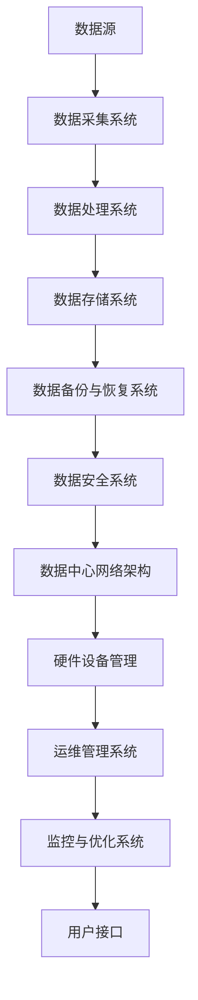
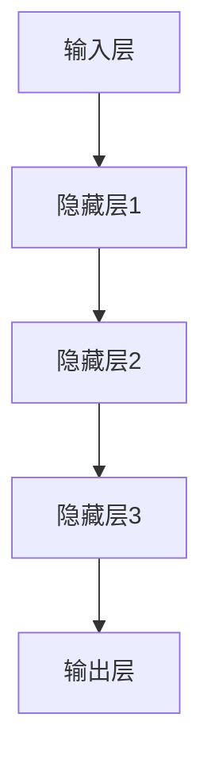

                 

关键词：AI大模型、数据中心、运维管理、性能优化、安全性、数据备份与恢复

> 摘要：本文将探讨AI大模型应用数据中心的建设与运维管理，分析数据中心的核心概念、算法原理、数学模型、项目实践及实际应用场景，并展望未来发展趋势与面临的挑战。

## 1. 背景介绍

随着人工智能技术的快速发展，AI大模型（如GPT、BERT等）在自然语言处理、计算机视觉、推荐系统等领域取得了显著成果。这些AI大模型通常需要大量的计算资源和支持复杂的数据处理能力，因此，建设一个高效、可靠、安全的AI大模型应用数据中心变得尤为重要。数据中心的建设和运维管理不仅涉及到硬件设备的选型、部署与维护，还包括网络架构、数据存储、安全防护等多个方面。

本文将从以下几个方面进行阐述：

1. **核心概念与联系**：介绍数据中心的建设原则、关键技术和架构。
2. **核心算法原理与操作步骤**：分析AI大模型的核心算法原理和具体操作步骤。
3. **数学模型和公式**：讲解相关数学模型和公式及其应用。
4. **项目实践**：展示代码实例并进行分析。
5. **实际应用场景**：探讨数据中心在各个领域的应用。
6. **未来应用展望**：预测数据中心的发展趋势和面临的挑战。

## 2. 核心概念与联系

数据中心是集中存储、处理和管理数据的设施，其建设涉及多个关键技术和架构。以下是一个简化的Mermaid流程图，展示了数据中心的核心概念和联系。



### 2.1 数据中心建设原则

数据中心建设应遵循以下原则：

1. **可靠性**：确保数据中心的稳定运行，减少故障率和停机时间。
2. **可扩展性**：支持未来业务增长和需求变化，实现灵活扩展。
3. **高性能**：提供高效的数据处理和计算能力。
4. **安全性**：保护数据安全和隐私，防止数据泄露和恶意攻击。
5. **能源效率**：降低能耗，减少对环境的影响。

### 2.2 关键技术

数据中心的关键技术包括：

1. **硬件设备**：服务器、存储设备、网络设备等。
2. **软件系统**：操作系统、数据库、数据存储与管理软件等。
3. **网络架构**：设计高效、可靠的网络拓扑结构，支持数据传输和负载均衡。
4. **数据存储与管理**：采用分布式存储系统，实现海量数据的存储和管理。
5. **数据备份与恢复**：确保数据的安全性和可恢复性。
6. **安全防护**：部署防火墙、入侵检测系统等，防止恶意攻击。

## 3. 核心算法原理与操作步骤

### 3.1 算法原理概述

AI大模型通常基于深度学习算法，通过神经网络结构对大量数据进行训练，从而实现智能预测和决策。以下是一个简化的神经网络结构：



### 3.2 算法步骤详解

1. **数据预处理**：对输入数据进行清洗、归一化等处理，使其适合模型训练。
2. **模型构建**：设计神经网络结构，包括输入层、隐藏层和输出层。
3. **模型训练**：使用训练数据对模型进行训练，调整网络权重和偏置。
4. **模型评估**：使用验证数据评估模型性能，调整模型参数。
5. **模型部署**：将训练好的模型部署到数据中心，进行实际应用。

### 3.3 算法优缺点

- **优点**：高精度、泛化能力强、自适应性强。
- **缺点**：训练过程复杂、计算资源消耗大、对数据质量要求高。

### 3.4 算法应用领域

AI大模型在以下领域有广泛应用：

1. **自然语言处理**：文本分类、机器翻译、语音识别等。
2. **计算机视觉**：图像分类、目标检测、图像生成等。
3. **推荐系统**：个性化推荐、商品推荐等。
4. **金融风控**：信用评估、欺诈检测等。

## 4. 数学模型和公式

### 4.1 数学模型构建

神经网络中的每个神经元可以通过以下公式进行计算：

$$
a_{i}^{(l)} = \sigma \left( \sum_{j} w_{ji}^{(l)} a_{j}^{(l-1)} + b_{i}^{(l)} \right)
$$

其中，$a_{i}^{(l)}$ 表示第 $l$ 层的第 $i$ 个神经元的激活值，$\sigma$ 是激活函数，$w_{ji}^{(l)}$ 和 $b_{i}^{(l)}$ 分别是连接权重和偏置。

### 4.2 公式推导过程

神经网络的训练过程主要包括前向传播和反向传播。前向传播过程如下：

$$
\begin{align*}
z_{ji}^{(l)} &= \sum_{k} w_{ki}^{(l-1)} a_{k}^{(l-1)} + b_{i}^{(l-1)} \\
a_{i}^{(l)} &= \sigma(z_{i}^{(l)})
\end{align*}
$$

反向传播过程如下：

$$
\begin{align*}
\delta_{i}^{(l)} &= (a_{i}^{(l)} - t_{i}) \cdot \sigma'(z_{i}^{(l)}) \\
\delta_{j}^{(l-1)} &= \sum_{i} w_{ji}^{(l)} \delta_{i}^{(l)} \\
w_{ji}^{(l)} &= w_{ji}^{(l)} + \alpha \cdot \delta_{i}^{(l)} \cdot a_{j}^{(l-1)} \\
b_{i}^{(l)} &= b_{i}^{(l)} + \alpha \cdot \delta_{i}^{(l)}
\end{align*}
$$

其中，$t_{i}$ 是第 $i$ 个神经元的实际输出值，$\sigma'$ 是激活函数的导数，$\alpha$ 是学习率。

### 4.3 案例分析与讲解

以一个简单的二分类问题为例，假设我们使用一个单层神经网络进行分类。数据集包含 100 个样本，每个样本有 5 个特征。目标值是 0 或 1。

1. **数据预处理**：将特征值归一化到 [0, 1] 范围内。
2. **模型构建**：设计一个单层神经网络，包含 5 个输入节点、10 个隐藏节点和 1 个输出节点。
3. **模型训练**：使用随机梯度下降（SGD）算法进行模型训练，学习率设置为 0.01。
4. **模型评估**：使用交叉验证方法评估模型性能，交叉验证轮数为 10。
5. **模型部署**：将训练好的模型部署到数据中心，进行实际应用。

## 5. 项目实践：代码实例和详细解释说明

### 5.1 开发环境搭建

1. **Python环境**：安装 Python 3.8 或更高版本。
2. **深度学习框架**：安装 TensorFlow 或 PyTorch。
3. **依赖库**：安装 NumPy、Pandas、Matplotlib 等常用库。

### 5.2 源代码详细实现

以下是一个使用 TensorFlow 实现简单二分类问题的代码示例：

```python
import tensorflow as tf
import numpy as np
import matplotlib.pyplot as plt

# 数据预处理
x = np.random.rand(100, 5)
y = np.random.randint(0, 2, 100)
x = (x - x.mean(axis=0)) / x.std(axis=0)

# 模型构建
model = tf.keras.Sequential([
    tf.keras.layers.Dense(10, activation='relu', input_shape=(5,)),
    tf.keras.layers.Dense(1, activation='sigmoid')
])

# 模型编译
model.compile(optimizer='sgd', loss='binary_crossentropy', metrics=['accuracy'])

# 模型训练
model.fit(x, y, epochs=100, batch_size=10, validation_split=0.1)

# 模型评估
loss, accuracy = model.evaluate(x, y)
print("Loss:", loss)
print("Accuracy:", accuracy)

# 模型部署
model.save("model.h5")
```

### 5.3 代码解读与分析

- **数据预处理**：使用 NumPy 生成随机数据集，并进行归一化处理。
- **模型构建**：使用 TensorFlow 的 Sequential 模型构建一个包含 10 个隐藏节点的单层神经网络。
- **模型编译**：使用 SGD 优化器和 binary_crossentropy 损失函数进行编译。
- **模型训练**：使用 fit 函数进行模型训练，并使用 validation_split 参数进行交叉验证。
- **模型评估**：使用 evaluate 函数评估模型性能。
- **模型部署**：使用 save 函数保存模型到文件。

## 6. 实际应用场景

数据中心在各个领域都有广泛的应用，以下列举几个典型场景：

1. **金融行业**：数据中心用于处理金融交易数据，进行风险控制和欺诈检测。
2. **医疗行业**：数据中心用于存储和管理患者数据，实现智能诊断和个性化治疗。
3. **电子商务**：数据中心用于处理海量商品数据，实现个性化推荐和广告投放。
4. **智能交通**：数据中心用于处理交通数据，实现智能交通管理和优化。

## 7. 未来应用展望

未来，随着人工智能技术的不断进步，数据中心将在更多领域发挥重要作用。以下是几个可能的发展趋势：

1. **边缘计算**：将数据中心的部分功能迁移到边缘设备，实现更高效的资源利用和更低的延迟。
2. **量子计算**：利用量子计算能力，解决传统数据中心无法处理的问题。
3. **绿色数据中心**：采用可再生能源和绿色技术，降低数据中心的能源消耗和碳排放。
4. **人工智能运维**：利用人工智能技术，实现自动化运维和故障预测。

## 8. 总结：未来发展趋势与挑战

数据中心在人工智能应用中具有重要地位。未来，随着技术的不断进步，数据中心将在更多领域发挥关键作用。然而，数据中心也面临着数据安全、隐私保护、能耗管理等方面的挑战。通过不断创新和优化，我们有理由相信数据中心将迎来更加美好的未来。

## 9. 附录：常见问题与解答

### 9.1  如何确保数据中心的安全性？

1. **物理安全**：限制人员访问，确保机房环境安全。
2. **网络安全**：部署防火墙、入侵检测系统等，保护网络安全。
3. **数据安全**：加密敏感数据，确保数据传输和存储的安全。
4. **访问控制**：采用严格的身份验证和权限管理，防止未经授权的访问。

### 9.2  数据中心如何进行能耗管理？

1. **能耗监测**：实时监测数据中心的能耗情况，分析能耗热点。
2. **节能设备**：采用高效能服务器和存储设备，降低能耗。
3. **智能调控**：利用人工智能技术，实现能耗的自动化调控。
4. **冷却系统优化**：优化冷却系统，降低能源消耗。

### 9.3  数据中心如何应对数据备份与恢复的需求？

1. **备份策略**：制定合理的备份策略，确保数据的安全性和完整性。
2. **备份存储**：采用分布式存储和云存储技术，实现数据的异地备份。
3. **恢复机制**：建立快速恢复机制，确保数据在发生故障时能够及时恢复。
4. **定期测试**：定期进行数据备份和恢复测试，验证备份和恢复的有效性。

