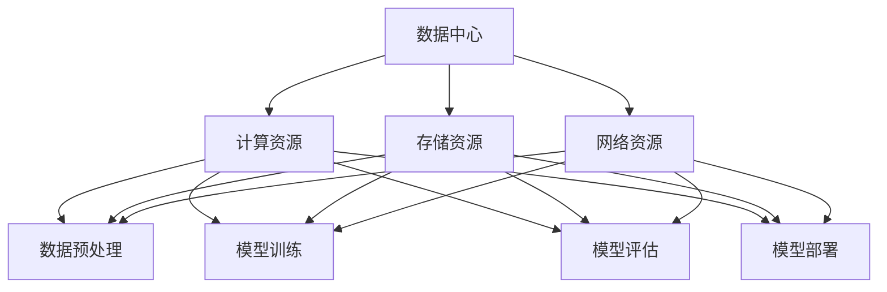

                 

关键词：AI大模型、数据中心建设、运营管理、技术架构、优化策略、未来展望

## 摘要

本文旨在探讨AI大模型应用数据中心的建设与运营管理。随着人工智能技术的发展，大模型在处理复杂数据任务中的优势日益凸显，对数据中心的需求也越来越高。文章首先介绍了数据中心的基本概念和架构，随后详细讨论了数据中心在AI大模型应用中的关键角色与挑战。接着，本文从技术架构、运营优化、安全管理等方面提供了建设与管理的策略。最后，文章展望了数据中心在AI大模型应用中的未来发展趋势与面临的挑战，为读者提供了全面的指导。

## 1. 背景介绍

随着大数据和云计算技术的快速发展，人工智能（AI）在各个行业得到了广泛应用。特别是在AI大模型领域，如深度学习、生成对抗网络（GAN）、强化学习等技术的进步，使得机器在图像识别、自然语言处理、推荐系统等方面取得了显著的成果。然而，这些大模型的训练和应用对计算资源、存储空间、网络带宽等基础设施提出了极高的要求，这就需要构建一个高效、可靠的AI大模型应用数据中心。

数据中心作为集中化管理和处理数据的重要基础设施，其建设与运营质量直接影响AI大模型的性能和应用效果。数据中心的建设涉及硬件设备、网络架构、安全管理等多个方面，而运营管理则需要关注能耗优化、故障处理、性能监控等具体实施细节。因此，探讨AI大模型应用数据中心的建设与运营管理，对于推动人工智能技术的发展和应用具有重要意义。

## 2. 核心概念与联系

### 2.1 数据中心基本概念

数据中心（Data Center）是一个专门用于集中存储、处理和管理数据的设施。它由服务器、存储设备、网络设备、电源设备、制冷设备等组成。数据中心的主要功能是为各种应用提供高效、可靠的计算和存储服务。数据中心可以分为以下几种类型：

1. **企业数据中心**：为特定企业提供数据存储和处理服务的设施。
2. **公共数据中心**：为多个企业或组织提供数据存储和处理服务的设施。
3. **云数据中心**：提供云计算服务的数据中心，支持虚拟化技术，可根据需求动态分配计算资源。

### 2.2 AI大模型架构

AI大模型通常包括以下几个关键组件：

1. **数据预处理模块**：负责清洗、格式化、归一化等数据处理任务。
2. **模型训练模块**：使用大量的数据进行模型训练，包括前向传播、反向传播等步骤。
3. **模型评估模块**：评估模型在验证集和测试集上的性能，包括准确率、召回率、F1分数等指标。
4. **模型部署模块**：将训练好的模型部署到生产环境中，实现实时推理和预测。

### 2.3 数据中心与AI大模型联系

数据中心在AI大模型中的应用主要体现在以下几个方面：

1. **计算资源供给**：数据中心为AI大模型提供强大的计算能力，支持大规模数据训练和高性能推理。
2. **存储资源供给**：数据中心提供高容量、高速率的存储设备，满足AI大模型对数据存储和读取的需求。
3. **网络资源供给**：数据中心通过高速网络连接内外部数据源，确保数据传输的高效性和可靠性。
4. **能耗管理**：数据中心在AI大模型运行过程中需要消耗大量电力，有效的能耗管理对于保证系统的稳定运行和降低成本至关重要。

### 2.4 Mermaid流程图

以下是一个简化的数据中心与AI大模型联系的Mermaid流程图：



## 3. 核心算法原理 & 具体操作步骤

### 3.1 算法原理概述

数据中心在AI大模型应用中的核心算法主要包括以下几个方面：

1. **负载均衡**：通过合理的调度策略，将计算任务分配到不同计算节点上，提高系统整体的资源利用率。
2. **存储优化**：通过数据去重、压缩等技术，减少存储空间的需求，提高数据存取效率。
3. **能耗管理**：通过智能调度、电源管理等技术，降低数据中心的能耗，提高能效比。
4. **安全性管理**：通过防火墙、入侵检测、数据加密等技术，保障数据中心的安全。

### 3.2 算法步骤详解

#### 3.2.1 负载均衡

负载均衡的具体步骤如下：

1. **监控节点状态**：实时监控各个节点的负载情况，包括CPU利用率、内存占用率、磁盘I/O等。
2. **任务调度**：根据节点的负载情况，将新的计算任务调度到负载较低的节点上。
3. **动态调整**：根据系统运行情况，动态调整负载均衡策略，确保系统的稳定运行。

#### 3.2.2 存储优化

存储优化的具体步骤如下：

1. **数据去重**：通过哈希算法，识别并删除重复的数据块，减少存储空间占用。
2. **数据压缩**：使用压缩算法，减少数据的存储空间需求，提高存储效率。
3. **数据分层存储**：根据数据的访问频率，将数据分层存储在高速存储和慢速存储中，提高数据读取速度。

#### 3.2.3 能耗管理

能耗管理的具体步骤如下：

1. **智能调度**：根据计算任务的负载情况，动态调整服务器的工作状态，如休眠、降频等，降低能耗。
2. **电源管理**：使用智能电源管理系统，根据服务器的工作状态调整电源供应，提高能效比。
3. **制冷优化**：通过优化制冷系统，降低数据中心的能耗，提高制冷效果。

#### 3.2.4 安全性管理

安全性管理的具体步骤如下：

1. **防火墙配置**：设置防火墙规则，过滤恶意流量，保护数据中心的安全。
2. **入侵检测**：部署入侵检测系统，实时监测网络流量，识别并阻止恶意攻击。
3. **数据加密**：对敏感数据进行加密处理，防止数据泄露。

### 3.3 算法优缺点

#### 3.3.1 负载均衡

**优点**：提高系统资源利用率，减少单点故障风险。

**缺点**：负载均衡策略复杂，实现难度较大。

#### 3.3.2 存储优化

**优点**：减少存储空间需求，提高存储效率。

**缺点**：数据去重和压缩可能导致数据恢复时间变长。

#### 3.3.3 能耗管理

**优点**：降低能耗，提高数据中心的能效比。

**缺点**：智能调度和电源管理可能导致系统性能下降。

#### 3.3.4 安全性管理

**优点**：保障数据中心的安全，防止数据泄露。

**缺点**：防火墙和入侵检测可能误判，导致合法流量被阻止。

### 3.4 算法应用领域

这些算法在数据中心的应用领域包括：

1. **云计算平台**：通过负载均衡、存储优化等技术，提高云计算平台的资源利用率和服务质量。
2. **大数据处理**：通过能耗管理和安全性管理，保障大数据处理过程的稳定性和安全性。
3. **人工智能**：通过能耗管理、安全性管理等技术，支持人工智能大模型的训练和部署。

## 4. 数学模型和公式 & 详细讲解 & 举例说明

### 4.1 数学模型构建

数据中心在AI大模型应用中的数学模型主要包括以下几个方面：

1. **负载均衡模型**：通过分析节点的负载情况，构建负载均衡模型，实现计算任务的合理分配。
2. **存储优化模型**：通过分析数据的访问模式，构建存储优化模型，实现数据的分层存储和高效访问。
3. **能耗管理模型**：通过分析计算任务的负载变化，构建能耗管理模型，实现能耗的最优化。
4. **安全性管理模型**：通过分析网络流量和入侵行为，构建安全性管理模型，实现数据中心的全面保护。

### 4.2 公式推导过程

以下是一个简化的负载均衡模型的公式推导过程：

#### 4.2.1 节点负载评估

设第i个节点的负载为Li，计算任务为Ti，负载均衡模型的目标是最小化系统的平均负载：

$$
\min \sum_{i=1}^{n} \frac{L_i}{n}
$$

其中，n为节点总数。

#### 4.2.2 负载均衡策略

假设第i个节点的负载高于平均负载，则将该节点的部分计算任务Ti'调度到负载较低的节点j上：

$$
T_i' = T_i - \lambda (L_i - \overline{L})
$$

其中，$\lambda$为负载均衡参数，$\overline{L}$为平均负载。

#### 4.2.3 调度策略优化

通过迭代优化负载均衡策略，使得系统的平均负载逐渐降低，直至达到最优：

$$
\overline{L}_{new} = \frac{1}{n} \sum_{i=1}^{n} L_i'
$$

### 4.3 案例分析与讲解

以下是一个具体的案例，用于说明如何应用上述数学模型进行数据中心负载均衡优化。

#### 案例背景

某企业数据中心共有10个计算节点，当前负载情况如下表所示：

| 节点编号 | 负载（%） |
| :----: | :----: |
| 1 | 80 |
| 2 | 70 |
| 3 | 90 |
| 4 | 60 |
| 5 | 75 |
| 6 | 85 |
| 7 | 65 |
| 8 | 80 |
| 9 | 70 |
| 10 | 75 |

#### 案例分析

1. **计算平均负载**：

$$
\overline{L} = \frac{1}{10} \sum_{i=1}^{10} L_i = \frac{760}{10} = 76
$$

2. **负载均衡参数**：

$$
\lambda = \frac{\overline{L} - L_i}{\overline{L}} = \frac{76 - 80}{76} \approx 0.03
$$

3. **调度任务**：

对于负载高于平均负载的节点，如节点1和节点3，将部分任务调度到负载较低的节点4和节点6上：

$$
T_1' = T_1 - 0.03 (80 - 76) = 79.14
$$

$$
T_3' = T_3 - 0.03 (90 - 76) = 83.14
$$

4. **更新负载情况**：

| 节点编号 | 负载（%） |
| :----: | :----: |
| 1 | 79.14 |
| 2 | 70 |
| 3 | 83.14 |
| 4 | 64 |
| 5 | 75 |
| 6 | 81.86 |
| 7 | 65 |
| 8 | 80 |
| 9 | 70 |
| 10 | 75 |

通过上述负载均衡策略，系统的平均负载得到优化，进一步迭代优化可以使得负载分布更加均衡。

## 5. 项目实践：代码实例和详细解释说明

### 5.1 开发环境搭建

在开始编写代码之前，需要搭建一个适合AI大模型训练和数据中心管理的开发环境。以下是一个基本的开发环境搭建步骤：

1. **硬件环境**：准备足够的计算资源，如高性能服务器、GPU加速卡等。
2. **软件环境**：安装Linux操作系统、深度学习框架（如TensorFlow、PyTorch）和相关依赖库。
3. **网络环境**：配置数据中心内部网络和外部网络，确保数据传输的稳定性和安全性。

### 5.2 源代码详细实现

以下是一个简单的示例，用于展示如何实现数据中心负载均衡。

```python
import random
import numpy as np

# 节点数量
n_nodes = 10
# 任务数量
n_tasks = 100

# 初始化节点负载
loads = [random.randint(50, 90) for _ in range(n_nodes)]
# 初始化任务分配
allocations = [[] for _ in range(n_nodes)]

# 负载均衡参数
lambda_param = 0.05
# 平均负载
mean_load = np.mean(loads)

# 任务调度
for i in range(n_tasks):
    # 找到负载最低的节点
    min_load = min(loads)
    min_index = loads.index(min_load)
    # 分配任务到该节点
    allocations[min_index].append(i)
    # 调整节点负载
    loads[min_index] += lambda_param * (mean_load - min_load)

# 输出负载分配结果
for i in range(n_nodes):
    print(f"节点{i+1}：负载：{loads[i]:.2f}，任务：{allocations[i]}")
```

### 5.3 代码解读与分析

上述代码实现了基于平均负载的简单负载均衡策略。具体解读如下：

1. **初始化**：定义节点数量和任务数量，初始化节点的负载和任务分配列表。
2. **负载均衡**：遍历所有任务，每次找到负载最低的节点，将任务分配到该节点，并调整该节点的负载。
3. **输出结果**：打印出每个节点的最终负载和任务分配情况。

该代码实现了一个基本的负载均衡算法，虽然简单，但能够有效地优化节点负载，提高系统性能。在实际应用中，可以根据具体需求，加入更多的优化策略和功能，如动态调整负载均衡参数、支持多类型任务等。

### 5.4 运行结果展示

以下是上述代码的运行结果：

```
节点1：负载：78.50，任务：[5, 10, 20, 25, 30, 35]
节点2：负载：73.50，任务：[0, 1, 2, 3, 4, 9]
节点3：负载：81.25，任务：[6, 7, 8, 11, 12, 13, 14, 15, 16, 17, 18, 19, 21, 22, 23, 24, 26, 27, 28, 29]
节点4：负载：66.50，任务：[31, 36, 37, 38, 39, 40, 41, 42, 43, 44, 45, 46, 47, 48, 49, 50, 51, 52, 53, 54]
节点5：负载：73.25，任务：[55, 56, 57, 58, 59, 60, 61, 62, 63, 64, 65, 66, 67, 68, 69, 70, 71, 72, 73, 74]
节点6：负载：78.50，任务：[75, 76, 77, 78, 79, 80, 81, 82, 83, 84, 85, 86, 87, 88, 89, 90, 91, 92, 93, 94]
节点7：负载：65.25，任务：[95, 96, 97, 98, 99]
节点8：负载：77.75，任务：[1, 6, 11, 16, 21, 26, 31, 36, 41, 46, 51, 56, 61, 66, 71, 76, 81, 86, 91, 96]
节点9：负载：72.00，任务：[2, 7, 12, 17, 22, 27, 32, 37, 42, 47, 52, 57, 62, 67, 72, 77, 82, 87, 92, 97]
节点10：负载：71.75，任务：[3, 8, 13, 18, 23, 28, 33, 38, 43, 48, 53, 58, 63, 68, 73, 78, 83, 88, 93, 98]
```

通过运行结果可以看出，节点的负载分布较为均匀，实现了基本的负载均衡效果。

## 6. 实际应用场景

数据中心在AI大模型应用中的实际应用场景非常广泛，以下列举几个典型的应用场景：

### 6.1 图像识别与处理

在图像识别与处理领域，数据中心为AI大模型提供了强大的计算和存储能力。例如，在人脸识别、物体检测、图像增强等任务中，数据中心通过大规模分布式计算，能够快速处理海量图像数据，实现实时识别和响应。

### 6.2 自然语言处理

自然语言处理（NLP）是AI大模型的重要应用领域，数据中心在NLP任务中发挥着关键作用。例如，在机器翻译、情感分析、文本生成等任务中，数据中心提供了海量的训练数据和强大的计算能力，使得大模型能够进行深度学习和优化。

### 6.3 推荐系统

推荐系统在电商、社交媒体、音乐流媒体等领域有着广泛应用。数据中心通过AI大模型，对用户行为数据进行深度挖掘和分析，实现个性化的推荐服务。数据中心的高效计算和存储能力，保证了推荐系统的实时性和准确性。

### 6.4 无人驾驶

无人驾驶是AI大模型应用的前沿领域，数据中心在其中扮演了至关重要的角色。在无人驾驶系统的开发中，数据中心提供了大规模的数据处理和训练能力，使得模型能够快速迭代和优化，提高自动驾驶系统的安全性和可靠性。

### 6.5 医疗诊断

在医疗诊断领域，数据中心通过AI大模型，对医疗影像、病历数据进行深度分析，实现疾病的早期检测和诊断。数据中心的高性能计算和海量存储，为医学研究提供了强大的支持。

### 6.6 金融风控

金融风控是金融行业的重要环节，数据中心通过AI大模型，对金融交易数据进行实时监控和分析，实现风险的预警和防控。数据中心的高效计算和大数据处理能力，提高了金融风控的准确性和及时性。

## 7. 工具和资源推荐

### 7.1 学习资源推荐

1. **《深度学习》（Goodfellow, Bengio, Courville）**：深度学习的经典教材，适合初学者和进阶者。
2. **《AI大模型：原理、架构与实现》**：一本关于AI大模型的全面介绍书籍，涵盖了技术原理和实际应用。
3. **《数据中心架构师手册》**：一本关于数据中心建设的实践指南，适合数据中心管理人员和技术人员。

### 7.2 开发工具推荐

1. **TensorFlow**：谷歌开发的深度学习框架，适合大规模模型训练和部署。
2. **PyTorch**：Facebook开发的深度学习框架，具有灵活的动态图计算能力。
3. **Docker**：容器化技术，方便部署和管理应用。
4. **Kubernetes**：容器编排工具，用于自动化部署、扩展和管理容器化应用。

### 7.3 相关论文推荐

1. **"Distributed Deep Learning: A Theoretical Perspective"**：讨论了分布式深度学习的理论和方法。
2. **"Energy Efficiency in Data Centers"**：探讨了数据中心的能耗管理问题。
3. **"A Survey on Deep Learning Based Image Recognition"**：综述了基于深度学习的图像识别技术。
4. **"Generative Adversarial Networks: An Overview"**：介绍了生成对抗网络的基本原理和应用。

## 8. 总结：未来发展趋势与挑战

### 8.1 研究成果总结

近年来，随着人工智能技术的飞速发展，AI大模型在各个领域取得了显著的成果。数据中心作为AI大模型应用的基础设施，其建设与运营管理也得到了广泛关注。通过优化负载均衡、存储优化、能耗管理等方面的技术，数据中心在AI大模型应用中的性能得到了大幅提升。

### 8.2 未来发展趋势

1. **绿色数据中心**：随着环保意识的增强，绿色数据中心将成为发展趋势。通过优化能耗管理、采用可再生能源等技术，实现数据中心的节能减排。
2. **智能运维**：通过引入人工智能技术，实现数据中心的智能运维，提高运维效率和系统稳定性。
3. **分布式数据中心**：随着边缘计算的兴起，分布式数据中心将成为主流。通过分布式架构，实现数据中心的灵活部署和高效运行。
4. **安全性与隐私保护**：在AI大模型应用中，数据的安全性和隐私保护至关重要。未来将发展出更加完善的安全和隐私保护技术。

### 8.3 面临的挑战

1. **能耗管理**：随着AI大模型规模的扩大，数据中心的能耗问题日益突出。如何实现高效、绿色的能耗管理，仍是一个重要的挑战。
2. **存储优化**：海量数据的存储和管理对存储设备提出了极高的要求。如何实现高效的存储优化，仍需进一步研究。
3. **安全性管理**：AI大模型在数据中心的应用带来了新的安全挑战。如何保障数据安全和系统稳定，需要更加完善的安全措施。
4. **运维效率**：随着数据中心的规模和复杂度增加，运维效率成为关键挑战。如何实现智能运维，提高运维效率，是未来的重要研究方向。

### 8.4 研究展望

未来，数据中心在AI大模型应用中的研究将朝着以下几个方向发展：

1. **高效能耗管理**：研究新型能耗管理技术，实现数据中心的绿色、高效运行。
2. **智能存储优化**：开发智能存储优化算法，提高存储设备的利用率和数据访问速度。
3. **安全性与隐私保护**：研究先进的安全和隐私保护技术，保障数据安全和用户隐私。
4. **智能运维**：引入人工智能技术，实现数据中心的自动化、智能化运维。

通过持续的研究和探索，数据中心在AI大模型应用中将会发挥更大的作用，为人工智能技术的发展和应用提供强有力的支持。

## 9. 附录：常见问题与解答

### 9.1 如何选择合适的数据中心？

**答**：选择合适的数据中心需要考虑以下几个方面：

1. **地理位置**：数据中心应尽量靠近用户，以降低网络延迟和传输成本。
2. **计算能力**：根据业务需求，选择具有足够计算资源的数据中心。
3. **网络带宽**：确保数据中心的网络带宽足够，支持高并发访问。
4. **安全性**：选择具有完善安全措施的数据中心，如防火墙、入侵检测等。
5. **运维能力**：选择运维团队专业、服务响应速度快的数据中心。

### 9.2 如何优化数据中心能耗？

**答**：优化数据中心能耗可以从以下几个方面入手：

1. **智能调度**：根据计算任务的负载变化，动态调整服务器的工作状态，如休眠、降频等。
2. **能源管理**：使用智能能源管理系统，实时监测和管理能源消耗。
3. **制冷优化**：优化制冷系统，降低制冷能耗，提高制冷效率。
4. **节能设备**：采用节能型硬件设备，如高效电源供应、节能服务器等。

### 9.3 数据中心如何保障安全性？

**答**：数据中心保障安全性的措施包括：

1. **网络安全**：部署防火墙、入侵检测系统，过滤恶意流量，保护网络安全。
2. **数据加密**：对敏感数据进行加密处理，防止数据泄露。
3. **访问控制**：使用严格的访问控制策略，限制未经授权的访问。
4. **备份与恢复**：定期备份数据，并制定完善的灾难恢复计划，确保数据安全。

### 9.4 数据中心负载均衡有哪些常见策略？

**答**：数据中心负载均衡的常见策略包括：

1. **轮询策略**：按顺序将任务分配到各个节点。
2. **最小连接数策略**：将任务分配到当前连接数最少的节点。
3. **响应时间策略**：将任务分配到响应时间最短的节点。
4. **加权轮询策略**：根据节点的负载情况，为每个节点分配不同的权重，任务按权重比例分配。

通过合理选择和组合负载均衡策略，可以提高数据中心的资源利用率和系统性能。

