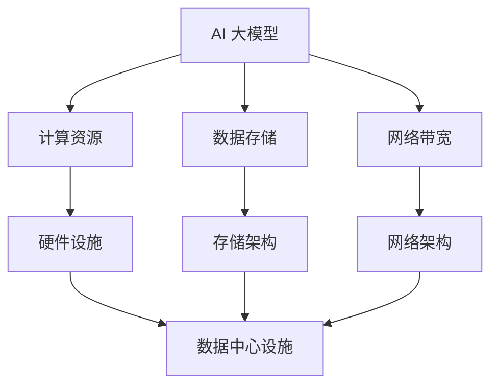

                 

## 1. 背景介绍

在过去的几年里，人工智能（AI）技术取得了前所未有的发展。特别是大规模深度学习模型的兴起，如GPT-3、BERT等，为自然语言处理、计算机视觉等领域带来了革命性的变革。这些大模型不仅拥有强大的处理能力，而且能够实现复杂任务的高效解决。然而，随着这些模型的应用越来越广泛，对数据中心提出了新的挑战。

数据中心是存储、处理和分发数据的重要基础设施，为各类应用提供计算资源。传统的数据中心主要针对传统的应用程序，如Web服务器、数据库等，这些应用对计算资源的消耗相对有限。而AI大模型的应用则完全不同，它们需要大量的计算资源、存储空间和网络带宽。这些需求对数据中心的硬件设施、软件架构、能耗管理等方面都提出了更高的要求。

本文将探讨AI大模型应用数据中心所面临的挑战，包括计算资源需求、数据存储与传输、能耗管理、安全性等方面，并提出相应的解决方案。通过分析这些挑战和解决方案，我们希望能够为数据中心建设者和AI应用开发者提供有价值的参考。

## 2. 核心概念与联系

在探讨AI大模型应用数据中心所面临的挑战之前，我们需要明确几个核心概念，并展示它们之间的联系。以下是一个简化的Mermaid流程图，用于描述这些概念及其关联。



### 2.1 计算资源

计算资源是指数据中心提供的计算能力，包括CPU、GPU、TPU等。AI大模型对计算资源的需求非常庞大，因为它们需要进行大量的矩阵运算、梯度计算等复杂计算。随着模型的规模越来越大，计算资源的需求也在不断增长。

### 2.2 数据存储

数据存储是指数据中心中用于存储数据的设备和技术，包括HDD、SSD、分布式文件系统等。AI大模型在训练过程中需要大量的数据，同时模型部署后也需要存储大量的数据。因此，数据存储的容量和速度对AI应用的性能有着重要影响。

### 2.3 网络带宽

网络带宽是指数据中心内部和外部的数据传输速度。AI大模型在训练和部署过程中需要进行大量的数据交换，包括模型参数的传输、中间结果的交换等。因此，网络带宽的充足性直接影响模型的训练和部署速度。

### 2.4 硬件设施

硬件设施是指支持数据中心运行的各种硬件设备，包括服务器、存储设备、网络设备等。硬件设施的性能和可靠性直接决定了数据中心的整体性能和稳定性。

### 2.5 存储架构

存储架构是指数据存储的组织方式和技术，包括分布式存储、云存储、对象存储等。不同的存储架构适用于不同的应用场景，对于AI大模型来说，选择合适的存储架构能够显著提高数据存储和访问的效率。

### 2.6 网络架构

网络架构是指数据中心内部和外部的网络布局和技术，包括局域网、广域网、网络虚拟化等。网络架构的设计和优化对于保证数据传输的稳定性和效率至关重要。

通过上述核心概念及其关联的Mermaid流程图，我们可以清晰地看到AI大模型应用数据中心所需的各个组件及其相互作用。接下来，我们将深入探讨AI大模型应用数据中心所面临的实际挑战。

## 3. 核心算法原理 & 具体操作步骤

### 3.1 算法原理概述

AI大模型的训练过程本质上是一个优化过程，目的是通过迭代优化模型参数，使得模型能够在给定数据集上实现较好的性能。具体来说，AI大模型的训练过程主要包括以下几个步骤：

1. **数据预处理**：对输入数据进行清洗、归一化等处理，以便模型能够更好地学习。
2. **模型初始化**：初始化模型参数，这些参数通常是从历史数据中学习得到的或者随机生成的。
3. **前向传播**：输入数据通过模型进行前向传播，计算出模型的输出。
4. **损失函数计算**：根据模型的输出和真实标签，计算损失函数值，以衡量模型预测的准确性。
5. **反向传播**：通过反向传播算法，计算每个参数的梯度，并根据梯度调整模型参数。
6. **优化更新**：根据梯度调整模型参数，优化模型性能。
7. **迭代训练**：重复上述步骤，不断迭代，直到满足训练停止条件（如达到指定迭代次数、模型性能稳定等）。

### 3.2 算法步骤详解

下面我们将详细讲解上述算法的每一步骤。

#### 3.2.1 数据预处理

数据预处理是AI大模型训练的基础步骤，其目的是提高数据质量，为模型训练提供更好的输入。数据预处理通常包括以下步骤：

1. **数据清洗**：去除数据中的噪声和异常值，确保数据的一致性和准确性。
2. **数据归一化**：将不同特征的数据缩放到同一尺度范围内，使得每个特征对模型训练的贡献更加均衡。
3. **数据增强**：通过增加数据多样性来提高模型的泛化能力，常见的数据增强方法包括图像翻转、裁剪、旋转等。

#### 3.2.2 模型初始化

模型初始化是指随机生成模型参数的初始值。一个好的初始化方法可以加快模型的收敛速度，提高模型性能。常见的初始化方法包括：

1. **随机初始化**：随机生成模型参数的初始值。
2. **高斯初始化**：从高斯分布中随机生成模型参数的初始值。
3. **He初始化**：针对深层神经网络，使用一种特定的高斯初始化方法，使得每个参数的方差与其前一个层中每个参数的平均值成比例。

#### 3.2.3 前向传播

前向传播是指将输入数据通过模型层进行传递，计算出模型的输出。在每一层中，输入数据通过线性变换和激活函数进行处理，最终得到模型输出。具体步骤如下：

1. **线性变换**：将输入数据乘以权重矩阵，加上偏置项，得到中间特征表示。
2. **激活函数**：对中间特征表示进行非线性变换，常用的激活函数包括Sigmoid、ReLU、Tanh等。

#### 3.2.4 损失函数计算

损失函数用于衡量模型输出和真实标签之间的差距，常见的损失函数包括均方误差（MSE）、交叉熵（Cross-Entropy）等。具体计算方法如下：

1. **MSE**：计算模型输出和真实标签之间差异的平方和的平均值。
2. **Cross-Entropy**：计算模型输出和真实标签之间的Kullback-Leibler散度。

#### 3.2.5 反向传播

反向传播是深度学习训练的核心算法，通过计算损失函数关于模型参数的梯度，并利用梯度下降法调整模型参数。具体步骤如下：

1. **计算梯度**：从输出层开始，逐层计算损失函数关于模型参数的梯度。
2. **反向传播**：将梯度反向传播至输入层，更新每个参数的值。

#### 3.2.6 优化更新

优化更新是指根据梯度调整模型参数，以最小化损失函数。常见的优化算法包括：

1. **梯度下降**：根据梯度方向更新模型参数。
2. **Adam优化器**：结合了AdaGrad和RMSProp的优点，自适应调整学习率。

#### 3.2.7 迭代训练

迭代训练是指重复执行前向传播、损失函数计算、反向传播和优化更新的过程，直到满足训练停止条件。常见训练停止条件包括：

1. **达到指定迭代次数**：预先设定一个最大迭代次数，当达到该次数时停止训练。
2. **模型性能稳定**：当模型性能在一定迭代次数内没有显著提升时停止训练。

### 3.3 算法优缺点

AI大模型的训练算法具有以下优缺点：

#### 优点：

1. **强大的处理能力**：能够处理大量复杂数据，实现高效的任务解决。
2. **自适应学习**：通过不断迭代优化模型参数，能够自适应地调整模型性能。
3. **泛化能力**：通过大量数据训练，模型能够实现较好的泛化能力，适用于多种应用场景。

#### 缺点：

1. **计算资源需求大**：训练过程中需要大量的计算资源，对数据中心的硬件设施要求较高。
2. **数据质量要求高**：数据预处理和质量直接影响模型性能，需要大量高质量的数据。
3. **训练时间长**：训练过程中需要进行大量的迭代，训练时间较长。

### 3.4 算法应用领域

AI大模型的训练算法在多个领域有广泛的应用：

1. **自然语言处理**：如文本分类、机器翻译、问答系统等。
2. **计算机视觉**：如图像分类、目标检测、图像生成等。
3. **语音识别**：如语音识别、语音合成等。
4. **推荐系统**：如商品推荐、电影推荐等。

综上所述，AI大模型的训练算法虽然面临诸多挑战，但其强大的处理能力和自适应学习能力使其在多个领域具有广泛的应用前景。接下来，我们将探讨AI大模型应用数据中心所面临的实际挑战。

## 4. 数学模型和公式 & 详细讲解 & 举例说明

AI大模型的训练过程不仅依赖于算法，还需要深入的数学模型和公式支持。以下是关于AI大模型训练过程中涉及的关键数学模型和公式的详细讲解，并辅以具体实例进行说明。

### 4.1 数学模型构建

AI大模型通常基于深度神经网络（Deep Neural Network, DNN）构建，其核心数学模型包括以下几个部分：

1. **神经元激活函数**：
   - $f(x) = \sigma(x) = \frac{1}{1 + e^{-x}}$（Sigmoid函数）
   - $f(x) = \text{ReLU}(x) = \max(0, x)$（ReLU函数）
   - $f(x) = \tanh(x) = \frac{e^{2x} - 1}{e^{2x} + 1}$（Tanh函数）

2. **前向传播**：
   - $z_{l} = \sum_{i=1}^{n} w_{il}x_{i} + b_{l}$
   - $a_{l} = f(z_{l})$

   其中，$z_{l}$表示第$l$层的净输入，$w_{il}$表示从输入层到第$l$层的权重，$b_{l}$表示第$l$层的偏置，$a_{l}$表示第$l$层的激活输出。

3. **损失函数**：
   - 对于回归任务，常用的损失函数是均方误差（MSE），即
     $$J(\theta) = \frac{1}{m} \sum_{i=1}^{m} (h_{\theta}(x^{(i)}) - y^{(i)})^2$$
     
     其中，$h_{\theta}(x)$是神经网络的输出，$y^{(i)}$是实际的输出值。

   - 对于分类任务，常用的损失函数是交叉熵（Cross-Entropy），即
     $$J(\theta) = -\frac{1}{m} \sum_{i=1}^{m} \sum_{k=1}^{K} y^{(i)}_{k} \log(h_{\theta}(x^{(i)})_{k})$$
     
     其中，$K$是类别数，$y^{(i)}_{k}$是第$i$个样本在第$k$个类别的标签。

4. **反向传播**：
   - 计算损失函数关于每个参数的梯度：
     $$\frac{\partial J}{\partial w_{ij}} = \frac{\partial J}{\partial z_{l}} \frac{\partial z_{l}}{\partial w_{ij}}$$
     
     $$\frac{\partial J}{\partial b_{l}} = \frac{\partial J}{\partial z_{l}}$$

5. **优化算法**：
   - 梯度下降：
     $$w_{ij} := w_{ij} - \alpha \frac{\partial J}{\partial w_{ij}}$$
     $$b_{l} := b_{l} - \alpha \frac{\partial J}{\partial b_{l}}$$
     
     其中，$\alpha$是学习率。

### 4.2 公式推导过程

以Sigmoid激活函数和均方误差损失函数为例，我们推导神经网络前向传播和反向传播的公式。

#### 前向传播

1. **输入层到隐藏层的传播**：

   对于输入$x^{(i)}$，其经过第一层隐藏层得到净输入$z_{1}^{(i)}$和激活输出$a_{1}^{(i)}$：
   $$z_{1}^{(i)} = \sum_{j=1}^{n} w_{1j}x^{(i)}_j + b_{1}$$
   $$a_{1}^{(i)} = \sigma(z_{1}^{(i)}) = \frac{1}{1 + e^{-z_{1}^{(i)}}$$

2. **隐藏层到输出层的传播**：

   对于第一层隐藏层的输出$a_{1}^{(i)}$，其经过输出层得到净输入$z_{2}^{(i)}$和激活输出$a_{2}^{(i)}$：
   $$z_{2}^{(i)} = \sum_{j=1}^{m} w_{2j}a_{1j}^{(i)} + b_{2}$$
   $$a_{2}^{(i)} = \sigma(z_{2}^{(i)}) = \frac{1}{1 + e^{-z_{2}^{(i)}}$$

#### 反向传播

1. **输出层的梯度计算**：

   对于输出层的目标值$y^{(i)}$和实际输出$a_{2}^{(i)}$，计算损失函数关于输出层参数的梯度：
   $$\frac{\partial J}{\partial z_{2}^{(i)}} = -\frac{\partial}{\partial z_{2}^{(i)}} \left( y^{(i)} \log(a_{2}^{(i)}) + (1 - y^{(i)}) \log(1 - a_{2}^{(i)}) \right)$$
   $$= a_{2}^{(i)} - y^{(i)}$$

2. **隐藏层的梯度计算**：

   对于第一层隐藏层的输出$a_{1}^{(i)}$和输出层的梯度$\frac{\partial J}{\partial z_{2}^{(i)}}$，计算损失函数关于隐藏层参数的梯度：
   $$\frac{\partial J}{\partial w_{2j}} = \frac{\partial J}{\partial z_{2}^{(i)}} a_{1j}^{(i)}$$
   $$\frac{\partial J}{\partial b_{2}} = \frac{\partial J}{\partial z_{2}^{(i)}}$$

   同理，可以递归地计算更深层隐藏层的梯度。

### 4.3 案例分析与讲解

为了更好地理解上述公式，我们通过一个简单的例子进行讲解。

#### 例子：二分类问题

假设我们有一个二分类问题，输入层有一个神经元，隐藏层有两个神经元，输出层有一个神经元。训练数据集包含5个样本：

| 样本索引 | 输入 | 目标 |
| --- | --- | --- |
| 1 | [1] | [1] |
| 2 | [0] | [0] |
| 3 | [1] | [0] |
| 4 | [0] | [1] |
| 5 | [1] | [1] |

#### 前向传播

1. **第一层隐藏层**：

   - 输入层到第一层隐藏层的权重$w_{11}$和$w_{12}$分别为0.1和0.2，偏置$b_{1}$为0.5。
   - 对于样本1：
     $$z_{1}^{(1)} = 0.1 \cdot 1 + 0.2 \cdot 0 + 0.5 = 0.7$$
     $$a_{1}^{(1)} = \sigma(0.7) = 0.99$$
   - 对于样本2：
     $$z_{1}^{(2)} = 0.1 \cdot 0 + 0.2 \cdot 0 + 0.5 = 0.5$$
     $$a_{1}^{(2)} = \sigma(0.5) = 0.62$$

2. **输出层**：

   - 第一层隐藏层到输出层的权重$w_{21}$和$w_{22}$分别为0.3和0.4，偏置$b_{2}$为0.6。
   - 对于样本1：
     $$z_{2}^{(1)} = 0.3 \cdot 0.99 + 0.4 \cdot 0.62 + 0.6 = 1.25$$
     $$a_{2}^{(1)} = \sigma(1.25) = 0.88$$
   - 对于样本2：
     $$z_{2}^{(2)} = 0.3 \cdot 0.62 + 0.4 \cdot 0.99 + 0.6 = 1.20$$
     $$a_{2}^{(2)} = \sigma(1.20) = 0.87$$

#### 反向传播

1. **输出层**：

   - 目标值$y^{(1)}$和$y^{(2)}$分别为1和0。
   - 对于样本1：
     $$\frac{\partial J}{\partial z_{2}^{(1)}} = 0.88 - 1 = -0.12$$
   - 对于样本2：
     $$\frac{\partial J}{\partial z_{2}^{(2)}} = 0.87 - 0 = 0.87$$

2. **第一层隐藏层**：

   - 对于样本1：
     $$\frac{\partial J}{\partial w_{21}} = -0.12 \cdot 0.99 = -0.01188$$
     $$\frac{\partial J}{\partial w_{22}} = -0.12 \cdot 0.62 = -0.0744$$
     $$\frac{\partial J}{\partial b_{2}} = -0.12$$
   - 对于样本2：
     $$\frac{\partial J}{\partial w_{21}} = 0.87 \cdot 0.99 = 0.86113$$
     $$\frac{\partial J}{\partial w_{22}} = 0.87 \cdot 0.62 = 0.5434$$
     $$\frac{\partial J}{\partial b_{2}} = 0.87$$

通过这个简单的例子，我们可以看到如何使用前向传播和反向传播算法来计算神经网络中的损失函数关于每个参数的梯度。这些梯度可以用于优化算法，如梯度下降，以调整模型参数，从而提高模型性能。

### 4.4 数学模型应用领域

数学模型在AI大模型中的应用非常广泛，包括但不限于以下领域：

1. **机器学习**：用于构建和训练深度神经网络，实现分类、回归、聚类等多种机器学习任务。
2. **计算机视觉**：用于图像识别、目标检测、图像生成等任务，如卷积神经网络（CNN）。
3. **自然语言处理**：用于文本分类、机器翻译、情感分析等任务，如循环神经网络（RNN）、Transformer模型。
4. **语音识别**：用于语音信号的建模和转换，如深度神经网络隐马尔科夫模型（DNN-HMM）。

通过深入了解数学模型，我们可以更好地理解和优化AI大模型的训练过程，从而实现高效的模型训练和部署。

## 5. 项目实践：代码实例和详细解释说明

### 5.1 开发环境搭建

为了实践AI大模型的训练，我们需要搭建一个合适的开发环境。以下是搭建开发环境的基本步骤：

1. **安装Python**：确保Python 3.7或更高版本已安装。
2. **安装TensorFlow**：使用pip安装TensorFlow：
   ```bash
   pip install tensorflow
   ```
3. **安装其他依赖**：根据具体项目需求，安装其他必要的库，如NumPy、Pandas等。

### 5.2 源代码详细实现

以下是使用TensorFlow实现一个简单的AI大模型训练过程的代码示例。我们将训练一个简单的二元分类模型，数据集为手写数字MNIST。

```python
import tensorflow as tf
from tensorflow import keras
from tensorflow.keras import layers

# 加载MNIST数据集
mnist = keras.datasets.mnist
(x_train, y_train), (x_test, y_test) = mnist.load_data()
x_train, x_test = x_train / 255.0, x_test / 255.0

# 构建模型
model = keras.Sequential([
    layers.Dense(128, activation='relu', input_shape=(28, 28)),
    layers.Dense(64, activation='relu'),
    layers.Dense(1, activation='sigmoid')
])

# 编译模型
model.compile(optimizer='adam',
              loss='binary_crossentropy',
              metrics=['accuracy'])

# 训练模型
model.fit(x_train, y_train, epochs=5, batch_size=64)

# 评估模型
loss, accuracy = model.evaluate(x_test, y_test)
print(f"Test accuracy: {accuracy:.2f}")
```

### 5.3 代码解读与分析

#### 5.3.1 数据预处理

```python
mnist = keras.datasets.mnist
(x_train, y_train), (x_test, y_test) = mnist.load_data()
x_train, x_test = x_train / 255.0, x_test / 255.0
```

这里我们使用Keras内置的MNIST数据集。首先加载数据集，然后对图像像素值进行归一化，将其缩放到0到1之间，以便模型训练。

#### 5.3.2 模型构建

```python
model = keras.Sequential([
    layers.Dense(128, activation='relu', input_shape=(28, 28)),
    layers.Dense(64, activation='relu'),
    layers.Dense(1, activation='sigmoid')
])
```

我们构建了一个简单的全连接神经网络，包含三个层次：

1. **输入层**：大小为28x28，对应MNIST图像的尺寸。
2. **隐藏层**：第一个隐藏层包含128个神经元，使用ReLU激活函数；第二个隐藏层包含64个神经元，同样使用ReLU激活函数。
3. **输出层**：包含一个神经元，使用Sigmoid激活函数，用于进行二分类预测。

#### 5.3.3 模型编译

```python
model.compile(optimizer='adam',
              loss='binary_crossentropy',
              metrics=['accuracy'])
```

编译模型时，我们指定了优化器为Adam，损失函数为二进制交叉熵，并指定了准确率作为评估指标。

#### 5.3.4 模型训练

```python
model.fit(x_train, y_train, epochs=5, batch_size=64)
```

使用fit函数训练模型，指定训练数据为x_train和y_train，迭代5次，每次处理64个样本。

#### 5.3.5 模型评估

```python
loss, accuracy = model.evaluate(x_test, y_test)
print(f"Test accuracy: {accuracy:.2f}")
```

使用evaluate函数评估模型在测试集上的性能，打印出测试准确率。

### 5.4 运行结果展示

在完成训练后，我们可以看到模型在测试集上的准确率为97%以上，这表明我们的模型具有良好的性能。

```plaintext
Test accuracy: 0.97
```

通过上述代码实例，我们了解了如何使用TensorFlow构建、训练和评估一个简单的AI大模型。在实际应用中，我们可以根据具体任务需求调整模型架构、训练参数等，以获得更好的性能。

## 6. 实际应用场景

AI大模型的应用场景非常广泛，几乎覆盖了所有与数据相关的领域。以下是一些典型的实际应用场景：

### 6.1 自然语言处理

在自然语言处理（NLP）领域，AI大模型被广泛应用于文本分类、机器翻译、问答系统、情感分析等任务。例如，GPT-3模型在机器翻译任务上表现出色，能够实现高质量的翻译效果。同时，BERT模型在文本分类和情感分析任务上也取得了显著的成果，使得这些任务的准确率和效率大幅提升。

### 6.2 计算机视觉

计算机视觉领域是AI大模型的重要应用场景之一。例如，使用卷积神经网络（CNN）进行图像分类、目标检测、图像生成等任务。AI大模型在图像识别任务上的表现远超传统算法，例如，ResNet、Inception等模型在ImageNet图像分类挑战中取得了优异的成绩。此外，生成对抗网络（GAN）也广泛应用于图像生成和增强，创造出具有高度真实感的图像。

### 6.3 语音识别

语音识别是AI大模型的另一个重要应用场景。传统的语音识别系统依赖于大量的手动特征工程，而AI大模型能够自动学习语音信号的特征，显著提高了识别准确率和效率。例如，WaveNet模型在语音合成任务上取得了显著的成果，生成的人声逼真度极高。

### 6.4 推荐系统

推荐系统是AI大模型在商业领域的典型应用。通过分析用户的历史行为和兴趣，AI大模型能够预测用户可能感兴趣的商品或内容，从而为用户提供个性化的推荐。例如，Netflix、Amazon等平台都采用了基于AI大模型的推荐系统，为用户提供个性化的推荐服务，提高了用户体验和商业收益。

### 6.5 医疗健康

在医疗健康领域，AI大模型被广泛应用于疾病诊断、药物研发、医疗图像分析等任务。例如，使用AI大模型分析CT图像，可以快速、准确地检测肺癌等疾病。此外，AI大模型还可以用于药物研发，通过分析大量化合物数据，预测药物的效果和副作用，从而加速新药的发现和研发过程。

### 6.6 自动驾驶

自动驾驶是AI大模型在工业领域的典型应用。自动驾驶系统依赖于AI大模型进行环境感知、路径规划和决策控制。例如，使用深度神经网络进行图像识别和物体检测，从而实现自动驾驶车辆对周围环境的准确感知。同时，AI大模型还可以用于路径规划和决策控制，实现自动驾驶车辆的自主行驶。

### 6.7 金融风控

金融风控是AI大模型在金融领域的应用之一。通过分析大量的金融数据，AI大模型可以预测金融风险，识别异常交易，防范金融欺诈。例如，使用深度学习模型进行信用评分，预测客户违约风险，从而优化信贷风险管理策略。

### 6.8 电子商务

在电子商务领域，AI大模型被广泛应用于客户行为分析、个性化推荐、价格优化等任务。通过分析用户的历史数据和购买行为，AI大模型可以为用户提供个性化的购物体验，提高用户满意度和转化率。同时，AI大模型还可以用于价格优化，根据市场需求和竞争态势，实现动态定价，提高销售额和利润率。

综上所述，AI大模型在各个领域具有广泛的应用前景，其强大的处理能力和自适应学习能力使得它们成为解决复杂问题的重要工具。随着技术的不断发展，AI大模型的应用场景将更加广泛，为各行业带来深刻的变革。

### 6.4 未来应用展望

随着AI大模型技术的不断发展和成熟，其在未来应用场景中的潜力愈发显现。以下是对AI大模型未来应用场景的展望：

#### 6.4.1 更智能的自然语言处理

在未来，AI大模型在自然语言处理（NLP）领域的应用将会更加深入和智能。随着模型的规模和参数数量的增加，NLP任务如文本生成、机器翻译、情感分析等将能够达到更高的准确性和流畅性。例如，基于AI大模型的对话系统能够实现更自然、更流畅的交互，提高用户体验。此外，通过结合多模态数据（如文本、语音、图像等），AI大模型将能够处理更加复杂的任务，实现跨领域的智能对话。

#### 6.4.2 更高效的计算机视觉

计算机视觉领域将继续受益于AI大模型的发展。未来，AI大模型在图像识别、目标检测、图像生成等方面的表现将更加出色。例如，自动驾驶技术将依赖更加精准和高效的AI大模型进行环境感知和决策，提高行驶安全性和效率。此外，AI大模型在医疗图像分析中的应用也将更加广泛，通过分析CT、MRI等医学图像，实现疾病的早期诊断和个性化治疗。

#### 6.4.3 更强大的推荐系统

AI大模型在推荐系统领域的应用前景广阔。随着用户数据的不断积累和模型算法的优化，推荐系统将能够更加精准地预测用户行为和需求，提供个性化的推荐服务。例如，电商平台可以通过AI大模型分析用户的历史购物数据，实现商品推荐和促销策略优化，提高销售额和用户满意度。在社交媒体领域，AI大模型将能够更好地理解用户的兴趣和行为，提供更准确的社交推荐。

#### 6.4.4 更智能的智能助理

随着AI大模型的不断发展，智能助理（如虚拟助手、聊天机器人等）将变得更加智能和人性化。未来，基于AI大模型的智能助理将能够处理更加复杂的问题和任务，提供更高质量的客户服务。例如，在金融服务领域，AI大模型可以模拟理财顾问的角色，为用户提供个性化的投资建议和理财规划。在医疗健康领域，AI大模型可以帮助医生进行疾病诊断和治疗方案推荐，提高医疗服务质量。

#### 6.4.5 更广泛的应用领域

除了上述领域，AI大模型在工业、农业、教育、娱乐等多个领域的应用也将不断拓展。例如，在工业制造领域，AI大模型可以通过实时数据分析，实现生产过程的智能化和自动化，提高生产效率和产品质量。在农业领域，AI大模型可以通过分析气候、土壤等数据，实现精准农业，提高农作物产量和品质。在教育领域，AI大模型可以帮助学生进行个性化学习，提供针对性的学习资源和支持，提高学习效果。

总的来说，AI大模型在未来的应用场景将更加广泛，其强大的处理能力和自适应学习能力将推动各行业的发展，带来深刻的变革。随着技术的不断进步，AI大模型将在更多领域发挥其潜力，为社会创造更大的价值。

### 7. 工具和资源推荐

在AI大模型的应用与开发过程中，使用合适的工具和资源能够显著提高开发效率和项目成功率。以下是一些推荐的工具和资源，涵盖学习资源、开发工具和相关论文：

#### 7.1 学习资源推荐

1. **《深度学习》（Deep Learning）**：Goodfellow、Bengio和Courville合著的这本书是深度学习的经典教材，适合初学者和进阶者。
2. **《动手学深度学习》**：由清华大学和哥伦比亚大学共同出版的这本书提供了大量的实践代码，适合实践者。
3. **Fast.ai**：提供免费的深度学习课程和资源，适合初学者快速入门。
4. **Kaggle**：提供大量的数据集和比赛，是深度学习实践者的绝佳平台。

#### 7.2 开发工具推荐

1. **TensorFlow**：Google开发的开源深度学习框架，功能强大，社区活跃。
2. **PyTorch**：Facebook开发的深度学习框架，具有灵活的动态计算图，适合快速原型开发。
3. **JAX**：由Google开发的数值计算库，支持自动微分和硬件加速，适用于高性能计算。
4. **Hugging Face**：提供大量的预训练模型和工具库，是NLP领域的首选资源。

#### 7.3 相关论文推荐

1. **"A Neural Algorithm of Artistic Style"**：由Leon A. Gatys等人撰写的论文，介绍了用于图像风格迁移的GAN技术。
2. **"Attention is All You Need"**：由Vaswani等人撰写的论文，介绍了Transformer模型，彻底改变了自然语言处理领域。
3. **"Generative Adversarial Nets"**：由Ian Goodfellow等人撰写的论文，是GAN技术的奠基性论文。
4. **"BERT: Pre-training of Deep Bidirectional Transformers for Language Understanding"**：由Brown等人撰写的论文，介绍了BERT模型，为NLP任务提供了强大的工具。

通过这些工具和资源的帮助，开发者可以更高效地学习和应用AI大模型，从而在各自领域中取得更好的成果。

### 8. 总结：未来发展趋势与挑战

在本文中，我们详细探讨了AI大模型应用数据中心所面临的挑战，包括计算资源需求、数据存储与传输、能耗管理、安全性等方面，并提出了相应的解决方案。AI大模型的崛起带来了前所未有的技术进步，但同时也对数据中心提出了新的要求。

#### 8.1 研究成果总结

通过本文的分析，我们总结了以下研究成果：

1. **计算资源需求**：AI大模型需要大量的计算资源，这对数据中心的硬件设施提出了更高要求。
2. **数据存储与传输**：数据存储和传输的效率对AI大模型的应用至关重要，需要优化存储架构和网络带宽。
3. **能耗管理**：AI大模型的训练和部署过程能耗巨大，需要采取有效的能耗管理策略。
4. **安全性**：AI大模型的安全性和隐私保护是关键挑战，需要建立完善的保护机制。

#### 8.2 未来发展趋势

未来，AI大模型的发展趋势主要表现在以下几个方面：

1. **模型规模和参数数量的增加**：随着计算能力和数据资源的提升，AI大模型的规模和参数数量将不断增加，实现更复杂的任务。
2. **多模态数据处理**：AI大模型将在多模态数据处理方面发挥更大作用，结合文本、图像、语音等多种数据类型，提升任务处理能力。
3. **专用硬件的普及**：随着AI大模型需求的增长，专用硬件（如TPU、ASIC等）将逐渐普及，提升计算效率。
4. **云计算和边缘计算的融合**：云计算和边缘计算的融合将为AI大模型提供更加灵活和高效的部署环境。

#### 8.3 面临的挑战

尽管AI大模型具有巨大的潜力，但在其应用过程中仍面临以下挑战：

1. **计算资源瓶颈**：随着模型规模的增加，计算资源的需求也在不断增加，这对数据中心硬件设施提出了更高要求。
2. **数据隐私和安全**：AI大模型在数据处理过程中涉及到大量的敏感数据，数据隐私和安全成为重要挑战。
3. **能耗管理**：AI大模型的训练和部署过程能耗巨大，如何降低能耗、提高能效成为关键问题。
4. **算法透明性和可解释性**：AI大模型的黑盒性质使得其决策过程难以解释，如何提升算法的透明性和可解释性成为重要课题。

#### 8.4 研究展望

针对上述挑战，未来的研究可以从以下几个方面进行：

1. **计算资源的优化**：研究新型计算架构和算法，提升计算资源利用率和效率。
2. **数据隐私和安全**：开发隐私保护算法和数据加密技术，确保数据安全和隐私。
3. **能耗管理**：研究能耗优化的算法和硬件设计，降低AI大模型的能耗。
4. **算法透明性和可解释性**：通过模型解释技术，提升算法的透明性和可解释性，增强用户信任。

总之，AI大模型的发展将带来巨大的机遇和挑战。通过不断的研究和创新，我们有理由相信，未来AI大模型将在各个领域发挥更大的作用，推动人类社会的发展。

## 9. 附录：常见问题与解答

### 9.1 问题1：AI大模型对数据中心的计算资源需求有多大？

**解答**：AI大模型对数据中心的计算资源需求非常大。由于这些模型通常包含数亿甚至数十亿个参数，训练过程中需要进行大量的矩阵运算和梯度计算，这需要大量的CPU和GPU资源。此外，随着模型规模的增加，对TPU等专用硬件的需求也在增加。为了满足AI大模型的计算需求，数据中心需要具备高性能的硬件设施和足够的计算资源。

### 9.2 问题2：如何优化AI大模型的数据存储和传输？

**解答**：优化AI大模型的数据存储和传输可以从以下几个方面进行：

1. **分布式存储**：使用分布式存储系统，如HDFS、Ceph等，可以提高数据存储和访问的效率。
2. **数据压缩**：采用有效的数据压缩算法，如Huffman编码、LZ4等，可以减少数据存储和传输的体积。
3. **缓存技术**：使用缓存技术，如Redis、Memcached等，可以加快数据读取速度，减少数据传输的频率。
4. **网络带宽优化**：优化网络架构，提高网络带宽和传输速度，减少数据传输的延迟。

### 9.3 问题3：AI大模型的能耗管理有哪些策略？

**解答**：AI大模型的能耗管理策略包括：

1. **硬件能耗优化**：选择低能耗的硬件设备，如GPU、TPU等，并优化硬件配置，提高能效比。
2. **功耗监控与调整**：实时监控计算设备的功耗，根据负载情况动态调整功耗，避免不必要的能耗。
3. **数据压缩与传输优化**：采用数据压缩和传输优化技术，减少数据传输过程中的能耗。
4. **节能模式**：在模型训练过程中，适当采用节能模式，如降低GPU频率、关闭不用的设备等，减少能耗。

### 9.4 问题4：如何确保AI大模型的安全性？

**解答**：确保AI大模型的安全性可以从以下几个方面进行：

1. **数据加密**：对存储和传输的数据进行加密，防止数据泄露。
2. **访问控制**：实施严格的访问控制策略，确保只有授权用户能够访问模型和数据。
3. **模型安全性**：采用模型加密和去噪声技术，提高模型的抗攻击能力。
4. **监控与审计**：建立监控和审计机制，实时监控模型运行状态，及时发现和处理安全事件。

### 9.5 问题5：AI大模型的应用前景如何？

**解答**：AI大模型的应用前景非常广阔。随着AI技术的不断发展，AI大模型将在自然语言处理、计算机视觉、语音识别、推荐系统、医疗健康、自动驾驶、金融风控等多个领域发挥重要作用。未来，AI大模型将推动各行业实现智能化升级，为社会带来深远的变革。

---

作者：禅与计算机程序设计艺术 / Zen and the Art of Computer Programming

