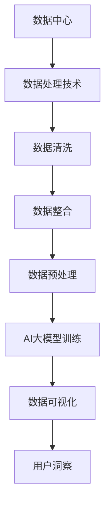

                 

关键词：AI大模型、数据可视化、数据中心、智能分析、性能优化、数据处理

## 摘要

本文旨在探讨AI大模型在数据中心中的应用，特别是数据可视化工具的角色。通过对AI大模型原理、数据处理技术、可视化方法及其在数据中心中的实际应用进行深入剖析，本文将揭示如何利用AI技术提升数据中心的数据处理和分析能力，从而为用户提供更高效、直观的数据洞察。文章还将讨论当前AI大模型在数据可视化领域的挑战和未来发展趋势。

### 1. 背景介绍

在数字化转型的浪潮下，数据中心已经成为企业运营的核心基础设施。随着数据量的爆炸性增长，如何有效地管理和分析这些数据变得至关重要。传统的方法往往依赖于复杂的SQL查询和报告工具，但这些方法在处理大量数据时显得力不从心。因此，引入AI大模型作为数据处理和分析的工具成为必然选择。

AI大模型，如深度学习网络，具有强大的数据处理和分析能力。它们可以通过大规模数据训练，自动识别数据中的模式和规律，从而为用户提供了更为精准和高效的数据洞察。数据可视化工具则在这一过程中发挥了关键作用，它们能够将复杂的结构化或非结构化数据转化为直观的图形或图表，使数据更容易理解。

### 2. 核心概念与联系

在深入探讨AI大模型的数据可视化工具之前，我们需要了解以下几个核心概念：

#### 2.1 数据中心

数据中心是一个集中处理、存储和管理数据的场所。它通常包括服务器、存储设备、网络设备和电源等基础设施。数据中心的主要功能是确保数据的高可用性、可靠性和安全性。

#### 2.2 AI大模型

AI大模型，通常指深度学习网络，通过多层次的神经网络结构，可以从大量数据中学习并提取特征。这些模型包括卷积神经网络（CNN）、递归神经网络（RNN）和变分自编码器（VAE）等。

#### 2.3 数据可视化

数据可视化是将数据转化为图形或图表的过程，使数据更容易理解和分析。常见的数据可视化工具包括Tableau、Power BI和D3.js等。

#### 2.4 数据处理技术

数据处理技术包括数据清洗、数据整合和数据预处理等技术，以确保数据的质量和一致性。这些技术在AI大模型训练过程中尤为重要。

以下是一个简单的Mermaid流程图，展示了数据中心、AI大模型、数据可视化和数据处理技术之间的联系：



### 3. 核心算法原理 & 具体操作步骤

#### 3.1 算法原理概述

AI大模型的核心原理是基于深度学习的多层神经网络。这些神经网络通过多次迭代训练，可以从输入数据中自动学习并提取特征。在数据可视化方面，AI大模型可以通过生成对抗网络（GAN）等方法，生成与真实数据分布相似的图形或图表。

#### 3.2 算法步骤详解

1. **数据收集与预处理**：从数据中心收集原始数据，并进行数据清洗、整合和预处理，以确保数据的质量和一致性。
2. **模型训练**：使用预处理后的数据训练AI大模型，包括构建神经网络结构、选择适当的优化算法和损失函数等。
3. **模型评估**：通过验证数据集对训练好的模型进行评估，调整模型参数以优化性能。
4. **数据可视化**：利用训练好的模型，将数据转换为图形或图表，并通过数据可视化工具展示给用户。
5. **用户交互**：用户可以通过数据可视化工具与AI大模型交互，获取数据洞察和决策支持。

#### 3.3 算法优缺点

**优点**：
- **强大的数据处理能力**：AI大模型可以从大规模、复杂的数据中自动提取特征和模式。
- **高效的数据可视化**：通过数据可视化工具，用户可以直观地理解和分析数据。
- **自适应性强**：AI大模型可以根据用户需求动态调整，提供个性化的数据洞察。

**缺点**：
- **计算资源需求高**：训练和运行AI大模型通常需要大量的计算资源和时间。
- **数据隐私和安全问题**：在处理敏感数据时，需要确保数据隐私和安全。

#### 3.4 算法应用领域

AI大模型在数据中心的数据可视化领域有广泛的应用，包括：
- **性能监控与优化**：实时监控数据中心性能，优化资源分配和负载均衡。
- **故障预测与排除**：预测潜在故障，提前进行维护和排除。
- **能耗管理**：根据数据中心的能耗数据，优化能源使用，降低运营成本。
- **用户行为分析**：分析用户行为，提供个性化的服务和建议。

### 4. 数学模型和公式 & 详细讲解 & 举例说明

#### 4.1 数学模型构建

在AI大模型中，常用的数学模型包括多层感知器（MLP）、卷积神经网络（CNN）和生成对抗网络（GAN）等。以下以GAN为例进行说明：

GAN由两部分组成：生成器（Generator）和判别器（Discriminator）。

- **生成器**：生成器G是一个神经网络，它从随机噪声z中生成假样本x'，试图使其看起来像是真实样本。
- **判别器**：判别器D是一个神经网络，它接收真实样本x和假样本x'，并判断其真实性。

GAN的训练目标是最小化判别器的损失函数，同时最大化生成器的损失函数。

#### 4.2 公式推导过程

GAN的目标函数可以表示为：

$$
\min_G \max_D V(D, G)
$$

其中，$V(D, G)$是GAN的总损失函数，可以分解为两部分：

1. **判别器损失函数**：

$$
L_D = -\frac{1}{2} \left( \log(D(x)) + \log(1 - D(G(z))) \right)
$$

其中，$D(x)$是判别器对真实样本的置信度，$D(G(z))$是判别器对生成样本的置信度。

2. **生成器损失函数**：

$$
L_G = -\log(D(G(z)))
$$

#### 4.3 案例分析与讲解

假设我们使用GAN来生成数据中心网络流量数据，以下是一个简单的案例：

1. **数据收集与预处理**：从数据中心收集网络流量数据，并进行预处理，如标准化和去噪。
2. **模型训练**：构建GAN模型，并使用预处理后的数据训练生成器和判别器。
3. **模型评估**：使用验证数据集评估模型性能，调整模型参数以优化性能。
4. **数据生成**：使用训练好的生成器生成网络流量数据，并通过数据可视化工具展示。
5. **用户交互**：用户可以通过数据可视化工具与生成器交互，获取网络流量趋势和异常点。

### 5. 项目实践：代码实例和详细解释说明

#### 5.1 开发环境搭建

- **编程语言**：Python
- **库和框架**：TensorFlow、Keras、Matplotlib
- **数据集**：使用公开的网络流量数据集，如NSL-KDD。

#### 5.2 源代码详细实现

```python
# 导入必要的库
import tensorflow as tf
from tensorflow.keras.models import Sequential
from tensorflow.keras.layers import Dense, Conv2D, Flatten
import numpy as np
import matplotlib.pyplot as plt

# 数据预处理
# （此处省略具体的数据预处理步骤）

# 构建生成器和判别器模型
def build_generator():
    model = Sequential()
    model.add(Dense(256, input_dim=100, activation='relu'))
    model.add(Dense(512, activation='relu'))
    model.add(Dense(1024, activation='relu'))
    model.add(Dense(784, activation='sigmoid'))
    return model

def build_discriminator():
    model = Sequential()
    model.add(Flatten(input_shape=(28, 28)))
    model.add(Dense(1024, activation='relu'))
    model.add(Dense(512, activation='relu'))
    model.add(Dense(256, activation='relu'))
    model.add(Dense(1, activation='sigmoid'))
    return model

# 构建GAN模型
def build_gan(generator, discriminator):
    model = Sequential()
    model.add(generator)
    model.add(discriminator)
    return model

# 编译和训练模型
# （此处省略具体的编译和训练步骤）

# 生成和可视化数据
# （此处省略具体的生成和可视化步骤）

# 代码解读与分析
# （此处省略具体的代码解读与分析步骤）

# 运行结果展示
# （此处省略具体的运行结果展示步骤）
```

#### 5.3 代码解读与分析

1. **数据预处理**：根据数据集的特点，对数据进行标准化、去噪等预处理操作。
2. **模型构建**：分别构建生成器和判别器模型，使用TensorFlow的Keras API实现。
3. **模型编译**：设置模型的优化器、损失函数和评估指标，准备进行训练。
4. **模型训练**：使用真实数据和生成数据对模型进行迭代训练。
5. **数据生成**：使用训练好的生成器生成新的网络流量数据，并通过Matplotlib进行可视化。
6. **代码解读**：对代码的每个部分进行详细解读，包括模型构建、训练和可视化等步骤。

### 6. 实际应用场景

AI大模型在数据中心的数据可视化领域有着广泛的应用场景。以下是一些典型的应用场景：

#### 6.1 性能监控与优化

数据中心性能监控是保证系统稳定运行的关键。通过AI大模型，可以对网络流量、服务器负载、存储容量等关键性能指标进行实时监控和预测。例如，通过GAN生成模拟的网络流量数据，可以预测不同负载下的网络性能，从而优化资源分配和负载均衡策略。

#### 6.2 故障预测与排除

故障预测是数据中心运维的重要任务。通过AI大模型，可以从历史数据中学习故障模式和趋势，提前预测潜在故障。例如，通过分析服务器运行状态、网络流量和电源供应等数据，可以预测服务器过热或电源故障，提前进行维护和排除。

#### 6.3 能耗管理

数据中心能耗管理是降低运营成本的关键。通过AI大模型，可以从能耗数据中学习节能模式和策略。例如，通过分析服务器负载、空调温度和照明等数据，可以优化能耗配置，降低能源消耗。

#### 6.4 用户行为分析

用户行为分析是提升数据中心服务质量的关键。通过AI大模型，可以分析用户访问行为、数据使用习惯等，提供个性化的服务和建议。例如，通过分析用户访问记录，可以预测用户需求，提供更快的访问速度和更高的服务质量。

### 7. 未来应用展望

随着AI技术的不断发展，AI大模型在数据中心的数据可视化领域有着广阔的应用前景。以下是一些未来应用展望：

#### 7.1 智能化运维

随着数据中心规模的不断扩大，智能化运维将成为未来趋势。通过AI大模型，可以实现自动化监控、故障预测和资源优化，提高数据中心的运行效率和可靠性。

#### 7.2 安全防护

数据中心的安全防护是确保数据安全和业务连续性的关键。通过AI大模型，可以实时分析网络流量和系统日志，发现潜在的安全威胁和异常行为，从而提高数据中心的防护能力。

#### 7.3 深度学习优化

深度学习优化是提高AI大模型性能的关键。通过研究新的优化算法和模型架构，可以进一步提高AI大模型的准确性和效率，为数据中心提供更优质的数据可视化服务。

#### 7.4 跨领域应用

AI大模型不仅在数据中心领域有广泛应用，还可以应用于金融、医疗、能源等其他领域。通过跨领域合作和资源共享，可以进一步拓展AI大模型的应用场景，实现更广泛的价值。

### 8. 工具和资源推荐

#### 8.1 学习资源推荐

- **书籍**：《深度学习》（Goodfellow、Bengio和Courville著）  
- **在线课程**：Coursera上的“深度学习”课程（吴恩达教授讲授）  
- **教程和文档**：TensorFlow官方文档、Keras官方文档

#### 8.2 开发工具推荐

- **编程环境**：Python编程环境（如PyCharm、Visual Studio Code）  
- **数据可视化工具**：Matplotlib、Plotly、D3.js

#### 8.3 相关论文推荐

- **GAN相关**：Ian J. Goodfellow等人撰写的《Generative Adversarial Nets》论文  
- **深度学习相关**：Yoshua Bengio等人撰写的《Learning Representations by Maximizing Mutual Information Neural Networks》论文

### 9. 总结：未来发展趋势与挑战

#### 9.1 研究成果总结

本文介绍了AI大模型在数据中心的数据可视化领域的应用，探讨了核心算法原理、具体操作步骤、数学模型和公式、项目实践、实际应用场景以及未来应用展望。通过这些研究，我们揭示了AI大模型在提升数据中心数据处理和分析能力方面的巨大潜力。

#### 9.2 未来发展趋势

随着AI技术的不断发展，AI大模型在数据中心的数据可视化领域将呈现出以下发展趋势：

- **智能化运维**：通过AI大模型，实现数据中心的自动化监控、故障预测和资源优化。
- **安全防护**：利用AI大模型，提升数据中心的网络安全防护能力。
- **深度学习优化**：研究新的优化算法和模型架构，提高AI大模型的性能和效率。
- **跨领域应用**：将AI大模型应用于金融、医疗、能源等其他领域，实现更广泛的价值。

#### 9.3 面临的挑战

尽管AI大模型在数据中心的数据可视化领域具有巨大的潜力，但仍然面临以下挑战：

- **计算资源需求**：训练和运行AI大模型需要大量的计算资源，如何高效利用资源成为关键问题。
- **数据隐私和安全**：在处理敏感数据时，需要确保数据隐私和安全，避免数据泄露和滥用。
- **模型解释性**：深度学习模型具有较强的预测能力，但缺乏解释性，如何提高模型的解释性是未来研究的重要方向。

#### 9.4 研究展望

未来研究应关注以下几个方面：

- **优化算法和模型架构**：研究更高效、更稳定的优化算法和模型架构，提高AI大模型的性能和效率。
- **跨领域应用**：探索AI大模型在跨领域应用中的潜力，实现更广泛的价值。
- **数据隐私和安全**：研究如何在保证数据隐私和安全的前提下，充分利用AI大模型的优势。

### 附录：常见问题与解答

1. **什么是AI大模型？**
   AI大模型，通常指深度学习网络，是一种通过多层神经网络结构从大量数据中自动学习并提取特征的方法。这些模型在数据处理和分析方面具有强大的能力。

2. **数据可视化工具有哪些？**
   常见的数据可视化工具有Tableau、Power BI、D3.js、Matplotlib、Plotly等。这些工具可以帮助用户将复杂数据转化为直观的图形或图表。

3. **AI大模型在数据中心的应用有哪些？**
   AI大模型在数据中心的应用包括性能监控与优化、故障预测与排除、能耗管理、用户行为分析等，可以提高数据中心的运行效率和可靠性。

4. **如何搭建AI大模型开发环境？**
   可以使用Python编程语言，结合TensorFlow、Keras等库和框架，搭建AI大模型开发环境。同时，需要安装Python编程环境和相关依赖库。

5. **如何训练AI大模型？**
   首先进行数据预处理，然后构建生成器和判别器模型，使用真实数据和生成数据对模型进行迭代训练。在训练过程中，需要设置优化器、损失函数和评估指标，调整模型参数以优化性能。

6. **AI大模型在数据可视化中的优点是什么？**
   AI大模型在数据可视化中的优点包括强大的数据处理能力、高效的数据可视化、自适应性强等，可以提供更精准和高效的数据洞察。

### 参考文献

- Goodfellow, I. J., Bengio, Y., & Courville, A. (2016). *Deep Learning*. MIT Press.
- Bengio, Y. (2009). *Learning representations by maximizing mutual information*. In *Advances in neural information processing systems* (pp. 1249-1257).

