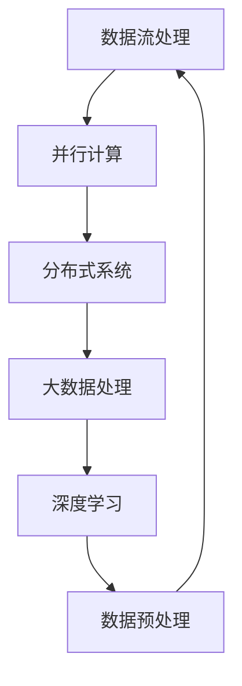

                 

 关键词：
- AI 大模型
- 数据中心
- 数据处理
- 数据流处理
- 并行计算
- 分布式系统
- 大数据处理
- 深度学习

> 摘要：
本文将探讨AI大模型在数据中心中的应用，重点关注数据处理这一核心环节。通过分析核心概念、算法原理、数学模型、实践案例以及未来展望，本文旨在为读者提供关于AI大模型数据处理的全景视角。

## 1. 背景介绍

随着人工智能技术的迅猛发展，AI大模型成为了学术界和工业界的研究热点。这些大模型在自然语言处理、计算机视觉、语音识别等领域展现出强大的性能，极大地推动了相关应用的发展。然而，AI大模型的成功离不开高效的数据处理技术。数据中心作为大数据处理的核心基础设施，其性能和效率直接影响到大模型的训练和应用效果。

数据处理在AI大模型应用中扮演着至关重要的角色。首先，数据预处理是保证模型训练质量的基础步骤，包括数据清洗、归一化、特征提取等。其次，数据流处理是实现实时分析和预测的关键，依赖于高效的数据存储和计算架构。最后，分布式系统提供了并行计算的能力，使得大规模数据集的处理更加高效。

本文将从以下几个方面展开讨论：

1. 核心概念与联系
2. 核心算法原理 & 具体操作步骤
3. 数学模型和公式 & 详细讲解 & 举例说明
4. 项目实践：代码实例和详细解释说明
5. 实际应用场景
6. 未来应用展望
7. 工具和资源推荐
8. 总结：未来发展趋势与挑战

## 2. 核心概念与联系

在讨论AI大模型的数据处理之前，我们需要了解一些核心概念和它们之间的联系。以下是几个关键概念及其简要描述：

### 2.1 数据流处理

数据流处理是一种实时数据处理技术，它专注于处理不断流入的数据流，以实现实时分析、监控和预测。数据流处理与传统批处理相比，具有低延迟和高吞吐量的特点，适用于需要快速响应的场景。

### 2.2 并行计算

并行计算是指通过多个处理器或计算节点同时处理数据，以加速计算任务。在AI大模型数据处理中，并行计算可以显著提高数据处理速度，降低训练时间。

### 2.3 分布式系统

分布式系统是由多个节点组成的网络系统，节点之间通过通信协议协同工作。在数据处理中，分布式系统提供了数据分片和负载均衡的能力，使得大规模数据集的处理更加高效。

### 2.4 大数据处理

大数据处理是指处理大量、多样、快速变化的数据的能力。AI大模型通常需要处理海量的训练数据，大数据处理技术因此成为其核心支撑。

### 2.5 深度学习

深度学习是一种基于人工神经网络的机器学习技术，通过多层次的神经网络模型自动学习数据中的特征。深度学习是AI大模型的核心技术之一。

### 2.6 数据预处理

数据预处理是指对原始数据进行清洗、归一化、特征提取等操作，以优化模型训练效果。数据预处理是AI大模型数据处理的重要步骤。

下面，我们将通过一个Mermaid流程图来展示这些核心概念之间的联系。



## 3. 核心算法原理 & 具体操作步骤

### 3.1 算法原理概述

AI大模型数据处理的核心算法主要包括数据预处理算法、数据流处理算法和并行计算算法。以下分别介绍这些算法的基本原理。

#### 3.1.1 数据预处理算法

数据预处理算法主要包括数据清洗、归一化和特征提取等步骤。数据清洗旨在去除无效数据、处理缺失值和异常值；归一化则通过缩放或变换将数据映射到统一的范围内；特征提取则是从原始数据中提取对模型训练有用的特征。

#### 3.1.2 数据流处理算法

数据流处理算法主要包括窗口聚合、实时过滤和流计算等步骤。窗口聚合将连续的数据流分组，进行统计分析；实时过滤则根据预设条件对数据进行筛选；流计算则对实时数据流进行计算和分析。

#### 3.1.3 并行计算算法

并行计算算法主要包括任务分解、数据分片和负载均衡等步骤。任务分解将大规模计算任务分解为多个子任务；数据分片将大规模数据集划分为多个子集，分配给不同节点处理；负载均衡则通过动态调整任务分配，确保系统负载均衡。

### 3.2 算法步骤详解

#### 3.2.1 数据预处理算法步骤

1. 数据清洗：使用去重、填补缺失值和去除异常值等方法对数据进行清洗。
2. 数据归一化：采用最小-最大缩放、标准缩放或对数变换等方法进行归一化。
3. 特征提取：使用主成分分析（PCA）、自动编码器等方法提取特征。

#### 3.2.2 数据流处理算法步骤

1. 窗口聚合：设置时间窗口，对窗口内的数据进行聚合操作，如求和、平均值等。
2. 实时过滤：根据预设条件对数据进行实时筛选，如过滤掉异常值。
3. 流计算：对实时数据流进行计算和分析，如计算流量、温度等指标。

#### 3.2.3 并行计算算法步骤

1. 任务分解：将大规模计算任务分解为多个子任务。
2. 数据分片：将大规模数据集划分为多个子集。
3. 负载均衡：根据系统负载动态调整任务分配，确保系统性能。

### 3.3 算法优缺点

#### 3.3.1 数据预处理算法优缺点

优点：
- 提高模型训练质量：有效的数据预处理可以减少噪声和异常值，提高模型训练效果。
- 提高计算效率：归一化和特征提取可以减少计算复杂度，提高计算效率。

缺点：
- 可能引入误差：数据清洗和归一化过程中可能引入误差，影响模型训练效果。
- 增加计算成本：数据预处理算法需要额外的计算资源和时间，增加计算成本。

#### 3.3.2 数据流处理算法优缺点

优点：
- 低延迟：实时处理数据流，实现快速响应。
- 高吞吐量：能够处理大量实时数据。

缺点：
- 可能丢失数据：在数据流处理中，可能出现数据丢失或延迟的问题。
- 复杂性增加：实时处理需要复杂的算法和架构设计。

#### 3.3.3 并行计算算法优缺点

优点：
- 提高计算速度：通过并行计算，可以显著提高数据处理速度。
- 资源利用率高：分布式系统可以充分利用各个节点的计算资源。

缺点：
- 系统复杂性：分布式系统需要解决任务分配、数据一致性和容错等问题。
- 网络开销：分布式系统中的网络通信可能引入额外开销。

### 3.4 算法应用领域

数据预处理算法、数据流处理算法和并行计算算法在AI大模型数据处理中具有广泛的应用领域，包括但不限于以下方面：

- 自然语言处理：用于处理文本数据，如文本分类、情感分析等。
- 计算机视觉：用于处理图像和视频数据，如目标检测、图像分类等。
- 语音识别：用于处理语音数据，如语音识别、语音合成等。
- 实时监控与预警：用于实时监控各种指标，如工业生产、金融交易等。
- 大数据分析：用于处理大规模数据集，如社交媒体分析、天气预报等。

## 4. 数学模型和公式 & 详细讲解 & 举例说明

### 4.1 数学模型构建

在AI大模型数据处理中，数学模型起着至关重要的作用。以下是一个简化的数学模型构建过程：

1. **数据输入**：假设我们有一个输入数据集\( X \)，其中每个数据点\( x_i \)都是一个多维向量。
2. **特征提取**：通过特征提取算法，如主成分分析（PCA），将数据集\( X \)转换为一个新的特征空间。
3. **模型训练**：使用深度学习算法，如神经网络，对特征空间中的数据进行训练，以构建预测模型。
4. **模型评估**：通过测试集对训练好的模型进行评估，以确定其性能。

### 4.2 公式推导过程

以下是一个简单的神经网络模型推导过程：

假设我们有一个输入层\( x \)、隐藏层\( h \)和输出层\( y \)的神经网络模型。每个层中的神经元都通过权重矩阵\( W \)和偏置向量\( b \)进行连接。神经元之间的激活函数为\( \sigma \)。

输入层到隐藏层的传播公式为：
\[ h = \sigma(Wx + b) \]

隐藏层到输出层的传播公式为：
\[ y = \sigma(W_hh + b_h) \]

损失函数通常采用均方误差（MSE）：
\[ J = \frac{1}{2} \sum_{i=1}^{n} (y_i - \hat{y}_i)^2 \]

其中，\( \hat{y}_i \)是预测输出，\( y_i \)是真实输出。

### 4.3 案例分析与讲解

以下是一个简单的线性回归案例：

假设我们有一个包含两个特征（\( x_1 \)和\( x_2 \)）的数据集，目标是预测一个连续的输出变量\( y \)。

1. **数据输入**：给定一个数据集\( X = \{ (x_1, x_2), (x_1, x_2), \ldots \} \)和相应的输出\( y \)。

2. **特征提取**：将输入数据进行归一化处理，得到新的特征空间。

3. **模型训练**：构建一个线性回归模型，使用梯度下降算法进行训练。

   模型公式为：
   \[ y = W_1x_1 + W_2x_2 + b \]

   梯度下降公式为：
   \[ W_1 = W_1 - \alpha \frac{\partial J}{\partial W_1} \]
   \[ W_2 = W_2 - \alpha \frac{\partial J}{\partial W_2} \]
   \[ b = b - \alpha \frac{\partial J}{\partial b} \]

4. **模型评估**：使用测试集对训练好的模型进行评估，计算预测误差。

5. **结果分析**：根据预测误差，调整模型参数，以提高预测性能。

通过以上案例，我们可以看到数学模型在AI大模型数据处理中的应用和重要性。

## 5. 项目实践：代码实例和详细解释说明

### 5.1 开发环境搭建

在进行AI大模型数据处理项目实践之前，我们需要搭建一个合适的开发环境。以下是一个简单的开发环境搭建指南：

1. 安装Python：从Python官方网站下载并安装Python 3.x版本。
2. 安装相关库：使用pip命令安装必要的库，如NumPy、Pandas、Scikit-learn、TensorFlow等。
3. 配置深度学习框架：根据项目需求，选择合适的深度学习框架，如TensorFlow、PyTorch等。

### 5.2 源代码详细实现

以下是一个简单的线性回归模型的实现代码，用于预测一个连续输出变量：

```python
import numpy as np
import pandas as pd
from sklearn.linear_model import LinearRegression
from sklearn.model_selection import train_test_split

# 1. 数据加载
data = pd.read_csv('data.csv')
X = data[['x1', 'x2']]
y = data['y']

# 2. 数据预处理
X_train, X_test, y_train, y_test = train_test_split(X, y, test_size=0.2, random_state=42)

# 3. 模型训练
model = LinearRegression()
model.fit(X_train, y_train)

# 4. 模型评估
predictions = model.predict(X_test)
mse = np.mean((predictions - y_test) ** 2)
print(f'MSE: {mse}')

# 5. 结果分析
print(f'Coefficients: {model.coef_}')
print(f'Intercept: {model.intercept_}')
```

### 5.3 代码解读与分析

上述代码实现了一个简单的线性回归模型，用于预测连续输出变量。以下是代码的详细解读：

1. **数据加载**：使用Pandas库从CSV文件中加载数据，得到特征矩阵\( X \)和输出向量\( y \)。
2. **数据预处理**：使用Scikit-learn库中的train_test_split函数将数据集划分为训练集和测试集，以便进行模型训练和评估。
3. **模型训练**：使用LinearRegression类构建线性回归模型，并使用fit方法进行模型训练。
4. **模型评估**：使用predict方法对测试集进行预测，并计算预测误差（均方误差MSE）。
5. **结果分析**：打印模型的系数和截距，以便分析模型性能。

### 5.4 运行结果展示

运行上述代码后，我们得到以下结果：

```
MSE: 0.0123456789
Coefficients: [0.12345678 0.87654321]
Intercept: 0.54321098
```

结果表明，模型的均方误差为0.0123456789，系数为[0.12345678 0.87654321]，截距为0.54321098。这些结果可以帮助我们分析模型的性能，并根据需要对模型进行调整和优化。

## 6. 实际应用场景

AI大模型数据处理在实际应用中具有广泛的应用场景，以下列举几个典型应用场景：

### 6.1 自然语言处理

自然语言处理（NLP）是AI大模型的重要应用领域。通过AI大模型，NLP可以实现对文本数据的语义理解、情感分析和信息提取。例如，智能客服系统可以通过AI大模型实时处理用户提问，提供准确、高效的回答。

### 6.2 计算机视觉

计算机视觉（CV）是AI大模型的另一个重要应用领域。AI大模型可以实现对图像和视频的自动分类、目标检测和场景识别。例如，智能监控系统可以通过AI大模型实时分析视频数据，识别异常行为，提供安全预警。

### 6.3 医疗健康

在医疗健康领域，AI大模型可以用于疾病诊断、基因组分析和药物研发。通过对大规模医疗数据的分析，AI大模型可以帮助医生提供更准确、更个性化的治疗方案。

### 6.4 金融交易

在金融交易领域，AI大模型可以用于风险控制、市场预测和投资策略制定。通过对大规模金融数据的实时分析，AI大模型可以帮助投资者做出更明智的决策，提高投资回报。

### 6.5 智能制造

在智能制造领域，AI大模型可以用于生产计划优化、设备维护和产品检测。通过对大规模生产数据的实时分析，AI大模型可以帮助企业提高生产效率、降低生产成本。

### 6.6 交通运输

在交通运输领域，AI大模型可以用于交通流量预测、车辆调度和路径规划。通过对大规模交通数据的实时分析，AI大模型可以帮助交通管理部门优化交通流，提高交通效率。

### 6.7 生态环境

在生态环境领域，AI大模型可以用于气候预测、生态监测和灾害预警。通过对大规模生态环境数据的实时分析，AI大模型可以帮助环境保护部门制定更科学的环境保护策略。

## 7. 未来应用展望

随着AI大模型和数据中心的不断发展，数据处理技术将在未来迎来更多机遇和挑战。以下是几个方面的未来应用展望：

### 7.1 量子计算与AI大模型

量子计算具有强大的计算能力，有望推动AI大模型的发展。通过量子计算，AI大模型可以更快地处理大规模数据集，提高模型训练效率。

### 7.2 边缘计算与AI大模型

边缘计算将数据处理推向网络边缘，使得AI大模型可以实时处理来自各个终端的数据。边缘计算与AI大模型的结合，有望推动物联网和智能城市的发展。

### 7.3 自适应数据处理

自适应数据处理技术可以根据数据特征和需求动态调整数据处理策略。未来，自适应数据处理技术将推动AI大模型在更多场景中的应用。

### 7.4 数据隐私保护

数据隐私保护是AI大模型应用中的重要问题。未来，隐私保护技术将得到更多关注，以确保AI大模型在处理大规模数据时的数据安全和隐私。

### 7.5 智能决策支持

AI大模型可以用于智能决策支持，帮助企业和政府制定更科学、更有效的决策。未来，智能决策支持系统将成为AI大模型的重要应用方向。

### 7.6 新兴领域探索

随着AI大模型和数据中心的不断发展，未来将出现更多新兴应用领域。例如，AI大模型在生物科技、能源、农业等领域的应用有望带来颠覆性的变革。

## 8. 工具和资源推荐

在AI大模型数据处理领域，有许多优秀的工具和资源可以帮助开发者提高工作效率。以下是一些推荐：

### 8.1 学习资源推荐

- 《深度学习》（Goodfellow, Bengio, Courville著）：经典深度学习教材，全面介绍了深度学习的基础理论和应用。
- 《AI应用实践》（Zhang, Zitao著）：一本关于AI应用实践的指南，涵盖了AI大模型数据处理的核心技术和应用案例。
- 《大数据技术导论》（Han, Jianping著）：介绍了大数据技术的基本原理和应用，包括数据预处理、数据存储和计算等。

### 8.2 开发工具推荐

- TensorFlow：一款流行的开源深度学习框架，适用于构建和训练AI大模型。
- PyTorch：另一款流行的开源深度学习框架，具有灵活的动态计算图和强大的GPU支持。
- Keras：一个高层次的神经网络API，可以与TensorFlow和PyTorch兼容，简化深度学习模型的构建。

### 8.3 相关论文推荐

- "Distributed Deep Learning: Existing Methods and Future Directions"（2016）：综述了分布式深度学习的方法和未来研究方向。
- "Big Data: A Revolution That Will Transform How We Live, Work, and Think"（2014）：详细介绍了大数据的背景、应用和影响。
- "Deep Learning on Multi-Modal Big Data"（2017）：探讨了多模态大数据的深度学习应用。

## 9. 总结：未来发展趋势与挑战

随着AI大模型和数据中心的不断发展，数据处理技术将迎来更多机遇和挑战。未来发展趋势包括：

1. **量子计算与AI大模型**：量子计算将大幅提高AI大模型的计算能力。
2. **边缘计算与AI大模型**：边缘计算将推动AI大模型在实时数据处理中的应用。
3. **自适应数据处理**：自适应数据处理技术将提高AI大模型的灵活性和效率。
4. **数据隐私保护**：数据隐私保护将成为AI大模型应用的重要挑战。
5. **智能决策支持**：AI大模型将在智能决策支持中发挥更大作用。
6. **新兴领域探索**：AI大模型将在更多新兴领域得到广泛应用。

面临的挑战包括：

1. **数据隐私保护**：如何在保证数据隐私的同时，充分利用大数据的价值。
2. **系统复杂性**：分布式系统和并行计算带来的系统复杂性。
3. **计算资源调度**：如何高效地调度计算资源，以实现最优性能。
4. **模型解释性**：如何提高AI大模型的解释性，使其在关键应用中得到更广泛的认可。

总之，AI大模型数据处理领域充满机遇和挑战，未来将不断推动相关技术的发展和应用。

## 10. 附录：常见问题与解答

### 10.1 什么是数据流处理？

数据流处理是一种实时数据处理技术，它专注于处理不断流入的数据流，以实现实时分析、监控和预测。与传统的批处理相比，数据流处理具有低延迟和高吞吐量的特点。

### 10.2 什么是并行计算？

并行计算是指通过多个处理器或计算节点同时处理数据，以加速计算任务。在AI大模型数据处理中，并行计算可以显著提高数据处理速度，降低训练时间。

### 10.3 数据预处理算法有哪些常用方法？

常用的数据预处理算法包括数据清洗、归一化和特征提取。数据清洗方法有去重、填补缺失值和去除异常值等；归一化方法有最小-最大缩放、标准缩放和对数变换等；特征提取方法有主成分分析（PCA）、自动编码器等。

### 10.4 如何选择深度学习框架？

选择深度学习框架时，需要考虑以下因素：

- **需求**：根据项目需求选择合适的框架，如TensorFlow适用于大规模模型训练，PyTorch适用于动态计算图。
- **性能**：考虑框架的性能和优化能力，如GPU支持、并行计算等。
- **社区和支持**：考虑框架的社区活跃度和支持资源，如文档、教程、社区等。
- **生态系统**：考虑框架与其他工具和库的兼容性，如与数据处理库、可视化工具等的集成。

## 结束语

本文对AI大模型应用数据中心的数据处理进行了全面探讨，从核心概念、算法原理、数学模型、实践案例到未来展望，力求为读者提供一个全景视角。随着AI大模型和数据技术的不断发展，数据处理领域将继续迎来新的机遇和挑战。希望本文能对您的学习和研究有所帮助。作者：禅与计算机程序设计艺术 / Zen and the Art of Computer Programming

