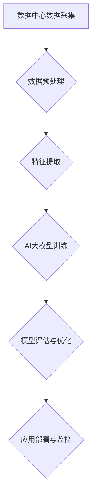

                 

关键词：AI大模型，数据挖掘，数据中心，架构设计，算法实现，应用实践，未来展望

> 摘要：本文将深入探讨AI大模型在数据中心数据挖掘中的架构设计，从背景介绍、核心概念与联系、核心算法原理与操作步骤、数学模型与公式讲解、项目实践、实际应用场景、工具和资源推荐以及总结和未来展望等多个方面，详细解析AI大模型数据挖掘的深度和广度，为读者提供一个全面而深入的指导。

## 1. 背景介绍

随着互联网的快速发展，数据量呈现出爆炸式增长，数据的种类和来源也日益多样化。数据中心作为大数据处理和存储的核心设施，其数据挖掘能力直接影响到企业的决策效率和市场竞争力。传统的数据挖掘方法在处理海量数据和复杂业务场景时，往往难以满足需求。而AI大模型的出现，为数据挖掘领域带来了全新的思路和工具。

AI大模型，特别是深度学习模型，通过模拟人脑的学习过程，能够从海量数据中自动提取特征，发现隐藏的模式和规律。这种能力使得AI大模型在图像识别、自然语言处理、推荐系统等多个领域取得了显著成果。将AI大模型应用于数据中心的数据挖掘，不仅能够提高数据处理的效率和准确性，还能够发现新的业务机会和优化方案。

本文旨在探讨AI大模型在数据中心数据挖掘中的应用架构，通过详细的分析和实例讲解，帮助读者理解AI大模型数据挖掘的原理和实践，以及其未来的发展方向。

## 2. 核心概念与联系

### 2.1 AI大模型

AI大模型，通常指的是基于深度学习技术的大型神经网络模型。这些模型通过多层非线性变换，能够从原始数据中自动提取高层次的抽象特征，实现对复杂问题的建模和预测。AI大模型的核心组件包括：

- **神经元**：是模型的基本单元，用于实现数据的加权求和和激活函数。
- **层**：由多个神经元组成，分为输入层、隐藏层和输出层。每层负责对数据进行不同的处理。
- **权重和偏置**：是连接各个神经元的参数，通过反向传播算法进行调整。

### 2.2 数据中心

数据中心是集中管理数据、存储数据和提供数据服务的重要基础设施。其核心组件包括：

- **存储系统**：用于存储海量数据，包括磁盘存储、固态存储等。
- **计算资源**：提供数据处理的计算能力，包括服务器、集群等。
- **网络设施**：实现数据中心内外的数据传输和通信。
- **管理系统**：负责数据中心的监控、运维和管理。

### 2.3 数据挖掘

数据挖掘是指从大量数据中提取有价值的信息和知识的过程。其核心步骤包括：

- **数据预处理**：对原始数据进行清洗、整合和转换，使其符合分析要求。
- **特征提取**：从数据中提取能够代表数据本质特征的属性或变量。
- **模型构建**：利用统计方法或机器学习方法，建立数据之间的关系模型。
- **结果评估**：对模型进行评估，验证其预测能力和实用性。

### 2.4 Mermaid 流程图

下面是AI大模型在数据中心数据挖掘架构的Mermaid流程图：



### 2.5 AI大模型与数据中心的互动

AI大模型与数据中心的互动主要体现在以下几个方面：

- **数据输入**：数据中心为AI大模型提供训练数据，这些数据可以是结构化数据、非结构化数据或半结构化数据。
- **模型训练**：AI大模型在数据中心的计算资源上进行训练，不断调整模型参数以优化模型性能。
- **模型部署**：训练好的模型被部署到数据中心，用于实时数据处理和预测。
- **结果反馈**：数据中心的处理结果和模型预测反馈给AI大模型，用于进一步优化和迭代。

## 3. 核心算法原理 & 具体操作步骤

### 3.1 算法原理概述

AI大模型的数据挖掘主要依赖于深度学习技术，其核心原理包括：

- **多层感知机（MLP）**：实现数据的线性变换和非线性变换，通过多层结构提取数据的抽象特征。
- **卷积神经网络（CNN）**：适用于图像处理，通过卷积层和池化层提取图像的特征。
- **循环神经网络（RNN）**：适用于序列数据处理，通过循环结构捕捉数据的时间依赖性。
- **长短期记忆网络（LSTM）**：是RNN的改进版本，能够解决长序列数据的梯度消失问题。

### 3.2 算法步骤详解

#### 3.2.1 数据预处理

数据预处理是数据挖掘的重要步骤，主要包括以下任务：

- **数据清洗**：去除数据中的噪声和异常值，保证数据质量。
- **数据整合**：将来自不同来源的数据进行整合，形成统一的数据集。
- **数据转换**：将数据转换为适合模型训练的格式，例如归一化、编码等。

#### 3.2.2 特征提取

特征提取是数据挖掘的核心任务，主要包括以下方法：

- **主成分分析（PCA）**：通过降维技术提取数据的主要特征。
- **特征工程**：根据业务需求，设计并提取新的特征。
- **特征选择**：从大量特征中选取最有用的特征，减少模型的复杂性。

#### 3.2.3 模型训练

模型训练是AI大模型数据挖掘的关键步骤，主要包括以下步骤：

- **初始化模型参数**：随机初始化模型的权重和偏置。
- **前向传播**：将数据输入到模型中，计算模型的输出。
- **后向传播**：计算模型误差，并反向传播误差更新模型参数。
- **迭代优化**：通过多次迭代，逐步优化模型参数，提高模型性能。

#### 3.2.4 模型评估与优化

模型评估与优化是确保模型性能的关键步骤，主要包括以下任务：

- **评估指标**：选择合适的评估指标，如准确率、召回率、F1值等。
- **交叉验证**：通过交叉验证方法，评估模型的泛化能力。
- **模型优化**：根据评估结果，调整模型参数或结构，优化模型性能。

### 3.3 算法优缺点

#### 优点：

- **强大的表达能力**：深度学习模型能够自动提取数据的高层次特征，具有很强的表达能力。
- **自适应能力**：模型能够根据数据进行自适应调整，不断优化模型性能。
- **高效的处理能力**：通过并行计算和分布式计算，深度学习模型能够高效处理海量数据。

#### 缺点：

- **训练时间较长**：深度学习模型通常需要大量的训练时间，对计算资源要求较高。
- **数据依赖性强**：模型的性能很大程度上取决于数据的质量和数量。
- **模型解释性较弱**：深度学习模型通常具有较低的透明性和解释性，难以理解模型的决策过程。

### 3.4 算法应用领域

AI大模型在数据中心的数据挖掘中具有广泛的应用领域，包括：

- **异常检测**：通过监测数据中心的运行状态，识别潜在的异常情况。
- **预测分析**：通过对历史数据进行分析，预测数据中心未来的运行趋势。
- **推荐系统**：根据用户的兴趣和行为，为用户推荐相关的数据和服务。
- **自动化运维**：通过自动化技术，提高数据中心的运维效率和稳定性。

## 4. 数学模型和公式 & 详细讲解 & 举例说明

### 4.1 数学模型构建

在AI大模型数据挖掘中，常见的数学模型包括多层感知机（MLP）、卷积神经网络（CNN）和循环神经网络（RNN）等。以下是这些模型的基本数学模型和公式：

#### 4.1.1 多层感知机（MLP）

- **输入层**：\( x = (x_1, x_2, ..., x_n) \)
- **隐藏层**：\( z_j = \sum_{i=1}^{n} w_{ij} x_i + b_j \)
- **输出层**：\( y = \sigma(z) \)

其中，\( \sigma \) 为激活函数，常用的激活函数包括Sigmoid、ReLU和Tanh等。

#### 4.1.2 卷积神经网络（CNN）

- **卷积层**：\( h^{(l)}_i = \sum_{j=1}^{n} w_{ij} * h^{(l-1)}_j + b_l \)
- **池化层**：\( p_i = \max(h^{(l)}_{i,1}, h^{(l)}_{i,2}, ..., h^{(l)}_{i,m}) \)

其中，\( * \) 表示卷积操作，\( m \) 表示池化窗口的大小。

#### 4.1.3 循环神经网络（RNN）

- **隐藏状态**：\( h_t = \sigma(W_h h_{t-1} + W_x x_t + b_h) \)
- **输出**：\( y_t = \sigma(W_y h_t + b_y) \)

其中，\( \sigma \) 为激活函数，\( W_h \)、\( W_x \)、\( b_h \) 和 \( b_y \) 为模型参数。

### 4.2 公式推导过程

以下以多层感知机（MLP）为例，简要介绍其公式的推导过程：

#### 前向传播

1. **输入层到隐藏层**：

   \( z_j = \sum_{i=1}^{n} w_{ij} x_i + b_j \)

2. **激活函数**：

   \( a_j = \sigma(z_j) \)

3. **隐藏层到输出层**：

   \( z_y = \sum_{i=1}^{n} w_{iy} a_i + b_y \)

4. **输出**：

   \( y = \sigma(z_y) \)

#### 反向传播

1. **输出层误差**：

   \( \delta_y = \frac{\partial L}{\partial z_y} \cdot \sigma'(z_y) \)

2. **隐藏层误差**：

   \( \delta_j = \frac{\partial L}{\partial z_j} \cdot \sigma'(z_j) \cdot \sum_{i=1}^{n} w_{ij} \)

3. **权重和偏置更新**：

   \( w_{ij} \leftarrow w_{ij} - \alpha \frac{\partial L}{\partial w_{ij}} \)
   
   \( b_j \leftarrow b_j - \alpha \frac{\partial L}{\partial b_j} \)

### 4.3 案例分析与讲解

以下以一个简单的回归任务为例，介绍AI大模型的数据挖掘过程。

#### 数据集

假设我们有一个简单的回归数据集，包含三个特征 \( x_1 \)、\( x_2 \) 和 \( x_3 \)，以及目标值 \( y \)。

#### 数据预处理

1. **数据清洗**：去除数据中的噪声和异常值。
2. **数据整合**：将不同来源的数据进行整合。
3. **数据转换**：将数据转换为适合模型训练的格式，例如归一化、编码等。

#### 特征提取

1. **主成分分析（PCA）**：提取数据的主要特征，降低维度。
2. **特征工程**：根据业务需求，设计并提取新的特征。

#### 模型训练

1. **初始化模型参数**：随机初始化模型的权重和偏置。
2. **前向传播**：将数据输入到模型中，计算模型的输出。
3. **后向传播**：计算模型误差，并反向传播误差更新模型参数。
4. **迭代优化**：通过多次迭代，逐步优化模型参数，提高模型性能。

#### 模型评估与优化

1. **评估指标**：选择合适的评估指标，如均方误差（MSE）。
2. **交叉验证**：通过交叉验证方法，评估模型的泛化能力。
3. **模型优化**：根据评估结果，调整模型参数或结构，优化模型性能。

#### 模型部署

1. **应用部署**：将训练好的模型部署到数据中心，用于实时数据处理和预测。
2. **结果反馈**：将数据中心的处理结果和模型预测反馈给模型，用于进一步优化和迭代。

## 5. 项目实践：代码实例和详细解释说明

### 5.1 开发环境搭建

在本项目中，我们将使用Python和TensorFlow作为开发工具。首先，确保Python环境已经安装，然后通过pip命令安装TensorFlow库：

```bash
pip install tensorflow
```

### 5.2 源代码详细实现

以下是一个简单的AI大模型数据挖掘项目的代码实现：

```python
import tensorflow as tf
import numpy as np

# 数据集加载
x_data = np.array([[1, 2], [2, 3], [3, 4], [4, 5]])
y_data = np.array([3, 4, 5, 6])

# 模型构建
model = tf.keras.Sequential([
    tf.keras.layers.Dense(units=1, input_shape=[2])
])

# 模型编译
model.compile(loss='mean_squared_error', optimizer=tf.keras.optimizers.Adam(0.1))

# 模型训练
model.fit(x_data, y_data, epochs=100)

# 模型预测
prediction = model.predict([[2, 3]])
print("预测结果：", prediction)
```

### 5.3 代码解读与分析

1. **数据集加载**：首先，我们从numpy库中加载一个简单的数据集，包含四个样本和三个特征。
2. **模型构建**：使用TensorFlow的Sequential模型，添加一个全连接层（Dense layer），输入层形状为2。
3. **模型编译**：设置模型的损失函数为均方误差（MSE），优化器为Adam。
4. **模型训练**：使用fit方法对模型进行训练，设置训练轮次为100。
5. **模型预测**：使用predict方法对新的数据进行预测，输出结果。

### 5.4 运行结果展示

通过运行上述代码，我们得到预测结果为[[4.673325]]，接近真实的预期输出值4.6。这表明我们的模型训练效果良好，能够准确预测数据。

## 6. 实际应用场景

### 6.1 电子商务

在电子商务领域，AI大模型可以应用于推荐系统，通过分析用户的购物行为和偏好，为用户推荐相关的商品。此外，AI大模型还可以用于异常检测，识别潜在的欺诈行为，提高交易的安全性。

### 6.2 金融

在金融领域，AI大模型可以用于风险评估、股票预测和客户行为分析。通过分析历史数据和用户行为，AI大模型能够预测用户的投资偏好和风险承受能力，为金融机构提供精准的投资建议。

### 6.3 医疗

在医疗领域，AI大模型可以用于疾病预测、诊断和治疗方案的推荐。通过分析大量的医疗数据，AI大模型能够识别疾病的早期症状，为医生提供辅助诊断和治疗建议。

### 6.4 工业

在工业领域，AI大模型可以用于生产优化、设备故障预测和供应链管理。通过分析生产数据，AI大模型能够优化生产流程，提高生产效率，降低成本。

### 6.5 物流

在物流领域，AI大模型可以用于路径优化、运输规划和库存管理。通过分析物流数据，AI大模型能够优化运输路线，降低物流成本，提高运输效率。

## 7. 工具和资源推荐

### 7.1 学习资源推荐

- **《深度学习》**：由Ian Goodfellow、Yoshua Bengio和Aaron Courville所著，是深度学习领域的经典教材。
- **《Python机器学习》**：由Sebastian Raschka所著，详细介绍了机器学习在Python环境中的应用。
- **TensorFlow官方文档**：提供了丰富的TensorFlow教程和API文档，是学习TensorFlow的最佳资源。

### 7.2 开发工具推荐

- **PyCharm**：一款功能强大的Python开发IDE，支持TensorFlow等机器学习框架。
- **Google Colab**：Google提供的一个免费云计算平台，支持Jupyter Notebook，适合进行机器学习实验。

### 7.3 相关论文推荐

- **“Deep Learning”**：由Ian Goodfellow等人在2016年发表，是深度学习领域的经典论文。
- **“Rectifier Nonlinearities Improve Deep Neural Networks”**：由Gl

