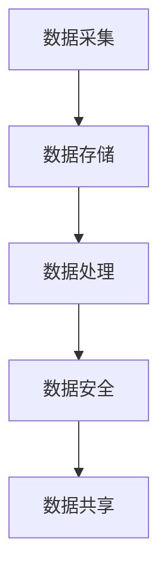

                 

关键词：大模型，数据中心，数据管理，数据处理，数据安全

> 摘要：本文探讨了在大模型应用场景下，数据中心在数据管理方面面临的挑战与解决方案。通过分析大模型数据处理的需求，介绍了数据管理的核心概念、算法原理、数学模型及实际应用，为数据中心的数据管理提供了理论指导和实践建议。

## 1. 背景介绍

近年来，人工智能（AI）技术取得了飞速发展，特别是大规模预训练模型（如GPT、BERT等）的广泛应用，推动了自然语言处理、计算机视觉、语音识别等领域的突破。这些大模型通常需要处理海量数据，对数据中心的存储、计算和传输能力提出了更高的要求。同时，数据管理在数据中心的重要性日益凸显，如何高效、安全地管理大量数据成为当前研究的热点问题。

本文将围绕以下问题展开讨论：

1. 大模型数据处理的特点和需求；
2. 数据管理的基本概念和核心算法；
3. 数据管理的数学模型和公式推导；
4. 数据管理的实际应用场景和案例；
5. 未来发展趋势与面临的挑战。

## 2. 核心概念与联系

### 2.1 数据管理基本概念

数据管理是指对数据的采集、存储、处理、分析、共享和备份等环节进行有效控制，以确保数据的完整性、一致性、可用性和安全性。在大模型应用数据中心，数据管理的主要目标是：

1. **数据存储**：提供高效、可靠的存储方案，满足海量数据存储需求；
2. **数据处理**：对数据进行清洗、转换、归一化等预处理操作，提高数据质量；
3. **数据安全**：确保数据在存储、传输和处理过程中不被泄露、篡改或损坏；
4. **数据共享**：实现数据的高效共享，促进数据价值的最大化。

### 2.2 大模型数据处理需求

大模型数据处理需求主要表现在以下几个方面：

1. **数据量级**：大模型通常需要处理大规模数据集，数据量级达到TB甚至PB级别；
2. **数据类型**：涉及多种数据类型，如图像、文本、音频、视频等；
3. **数据质量**：数据质量对大模型的训练效果和性能至关重要，需要确保数据的一致性、准确性和完整性；
4. **数据处理速度**：大模型训练过程通常需要大量计算资源，对数据处理速度要求较高。

### 2.3 数据管理核心算法架构

数据管理核心算法主要包括以下几种：

1. **分布式存储算法**：如Hadoop的HDFS、Google的GFS等，用于实现高效、可靠的分布式数据存储；
2. **数据处理算法**：如MapReduce、Spark等，用于实现高效、并行的大规模数据处理；
3. **数据加密算法**：如AES、RSA等，用于实现数据在存储和传输过程中的加密和解密；
4. **数据去重算法**：如 Bloom Filter、LZH等，用于实现数据去重和压缩。

### 2.4 Mermaid 流程图

以下是一个简单的Mermaid流程图，展示了数据管理的基本流程：



## 3. 核心算法原理 & 具体操作步骤

### 3.1 算法原理概述

本节将介绍数据管理中的核心算法原理，包括分布式存储、数据处理、数据加密和数据去重。

#### 分布式存储

分布式存储算法通过将数据分布存储在多个节点上，实现数据的高效存储和访问。其主要原理是：

1. **数据分片**：将大规模数据集划分为多个数据块，每个数据块存储在一个节点上；
2. **副本存储**：为每个数据块创建多个副本，存储在不同节点上，提高数据可靠性；
3. **负载均衡**：根据节点负载情况，动态调整数据存储位置，实现负载均衡。

#### 数据处理

数据处理算法通过并行计算、分布式计算等技术，实现高效、并行的大规模数据处理。其主要原理是：

1. **MapReduce模型**：将数据处理任务划分为Map和Reduce两个阶段，实现并行计算；
2. **Spark框架**：基于内存计算，提供高性能的分布式数据处理能力。

#### 数据加密

数据加密算法通过加密和解密操作，确保数据在存储和传输过程中的安全性。其主要原理是：

1. **对称加密**：使用相同密钥进行加密和解密，如AES算法；
2. **非对称加密**：使用不同密钥进行加密和解密，如RSA算法。

#### 数据去重

数据去重算法通过检测和去除重复数据，实现数据压缩和存储优化。其主要原理是：

1. **Bloom Filter**：利用概率计数器，判断数据是否存在；
2. **LZH压缩**：基于字典编码，实现数据压缩。

### 3.2 算法步骤详解

以下详细描述了数据管理核心算法的操作步骤：

#### 分布式存储

1. 数据分片：将大规模数据集划分为多个数据块；
2. 数据副本存储：为每个数据块创建多个副本，存储在不同节点上；
3. 负载均衡：根据节点负载情况，动态调整数据存储位置。

#### 数据处理

1. 数据分片：将大规模数据集划分为多个数据块；
2. Map阶段：对每个数据块进行映射操作，生成中间结果；
3. Reduce阶段：对中间结果进行聚合操作，生成最终结果。

#### 数据加密

1. 对称加密：
   1. 生成密钥；
   2. 使用密钥对数据进行加密和解密。

2. 非对称加密：
   1. 生成公钥和私钥；
   2. 使用公钥加密，私钥解密。

#### 数据去重

1. 使用Bloom Filter：
   1. 构建Bloom Filter；
   2. 判断数据是否存在。

2. 使用LZH压缩：
   1. 构建字典；
   2. 基于字典编码数据。

### 3.3 算法优缺点

#### 分布式存储

**优点**：

1. 高效存储：实现数据的高效存储和访问；
2. 高可靠性：通过副本存储，提高数据可靠性；
3. 负载均衡：实现节点负载均衡，提高系统性能。

**缺点**：

1. 数据一致性：分布式存储可能导致数据不一致；
2. 系统复杂性：分布式存储系统较为复杂，维护成本高。

#### 数据处理

**优点**：

1. 高性能：实现并行计算，提高数据处理速度；
2. 易扩展：支持大规模数据处理，系统可扩展性强。

**缺点**：

1. 资源消耗：并行计算需要大量计算资源；
2. 系统复杂性：分布式数据处理系统较为复杂，维护成本高。

#### 数据加密

**优点**：

1. 数据安全：确保数据在存储和传输过程中的安全性；
2. 防止数据泄露：防止数据在传输和存储过程中被非法访问。

**缺点**：

1. 加密和解密开销：加密和解密操作需要额外计算资源；
2. 密钥管理：密钥管理复杂，需要确保密钥的安全。

#### 数据去重

**优点**：

1. 数据压缩：去除重复数据，实现数据压缩；
2. 节省存储空间：减少存储空间消耗。

**缺点**：

1. 判断准确性：Bloom Filter存在误判可能；
2. 压缩和解压缩开销：压缩和解压缩操作需要额外计算资源。

### 3.4 算法应用领域

#### 分布式存储

分布式存储算法主要应用于云计算、大数据处理等领域，如Hadoop、Spark等。

#### 数据处理

数据处理算法广泛应用于数据挖掘、机器学习、自然语言处理等领域，如MapReduce、Spark等。

#### 数据加密

数据加密算法广泛应用于金融、医疗、政府等行业的数据安全领域，如AES、RSA等。

#### 数据去重

数据去重算法广泛应用于数据仓库、数据清洗等领域，如Bloom Filter、LZH等。

## 4. 数学模型和公式 & 详细讲解 & 举例说明

### 4.1 数学模型构建

数据管理中的数学模型主要包括数据分布模型、加密模型和去重模型。以下分别介绍这些模型的构建方法。

#### 数据分布模型

数据分布模型用于描述数据在不同节点上的分布情况。常见的分布模型有均匀分布、泊松分布和正态分布。

**均匀分布**：

$$
P(X=x) = \frac{1}{N}, \quad x=1,2,\ldots,N
$$

其中，$P(X=x)$表示变量$X$取值为$x$的概率，$N$表示数据总数。

**泊松分布**：

$$
P(X=k) = \frac{\lambda^k e^{-\lambda}}{k!}, \quad k=0,1,2,\ldots
$$

其中，$P(X=k)$表示变量$X$取值为$k$的概率，$\lambda$表示事件发生的平均次数。

**正态分布**：

$$
P(X\leq x) = \Phi(x), \quad x\in\mathbb{R}
$$

其中，$P(X\leq x)$表示变量$X$取值小于等于$x$的概率，$\Phi(x)$表示标准正态分布的累积分布函数。

#### 加密模型

加密模型用于描述数据加密和解密的过程。常见的加密模型有对称加密和非对称加密。

**对称加密**：

$$
C = E_K(P)
$$

其中，$C$表示加密后的数据，$P$表示原始数据，$K$表示加密密钥。

**非对称加密**：

$$
C = E_K^*(P)
$$

$$
P = D_K^*(C)
$$

其中，$E_K^*$和$D_K^*$分别表示加密和解密函数，$K$表示加密密钥。

#### 去重模型

去重模型用于描述数据去重的过程。常见的去重模型有Bloom Filter和LZH压缩。

**Bloom Filter**：

$$
B(x) = (x \mod m)
$$

其中，$B(x)$表示Bloom Filter中的哈希值，$m$表示哈希表的长度。

**LZH压缩**：

$$
C = LZH(P)
$$

其中，$C$表示压缩后的数据，$P$表示原始数据。

### 4.2 公式推导过程

以下分别介绍数据分布模型、加密模型和去重模型的公式推导过程。

#### 数据分布模型

**均匀分布**：

设数据总数为$N$，每个数据点出现的概率相等，即$P(X=x)=\frac{1}{N}$。

对于任意一个数据点$x$，其概率为：

$$
P(X=x) = \frac{1}{N}
$$

**泊松分布**：

设事件发生的平均次数为$\lambda$，则在单位时间内事件发生$k$次的概率为：

$$
P(X=k) = \frac{\lambda^k e^{-\lambda}}{k!}
$$

**正态分布**：

设随机变量$X$服从正态分布$N(\mu, \sigma^2)$，则其概率密度函数为：

$$
f(x) = \frac{1}{\sqrt{2\pi\sigma^2}} e^{-\frac{(x-\mu)^2}{2\sigma^2}}
$$

其累积分布函数为：

$$
\Phi(x) = \int_{-\infty}^{x} f(t) dt
$$

#### 加密模型

**对称加密**：

设加密密钥为$K$，加密函数为$E_K$，则加密后的数据$C$为：

$$
C = E_K(P)
$$

其中，$P$表示原始数据。

解密过程为：

$$
P = D_K(C)
$$

其中，$D_K$表示解密函数。

**非对称加密**：

设加密密钥为$K$，加密函数为$E_K^*$，解密函数为$D_K^*$，则加密后的数据$C$为：

$$
C = E_K^*(P)
$$

解密过程为：

$$
P = D_K^*(C)
$$

#### 去重模型

**Bloom Filter**：

设哈希函数为$B(x)$，哈希表长度为$m$，则Bloom Filter中的哈希值为：

$$
B(x) = (x \mod m)
$$

**LZH压缩**：

设原始数据为$P$，压缩函数为$LZH$，则压缩后的数据$C$为：

$$
C = LZH(P)
$$

### 4.3 案例分析与讲解

以下通过一个实际案例，介绍数据管理中的数学模型和公式应用。

#### 案例背景

某数据中心存储了1亿个文件，需要对文件进行去重和加密处理。现有以下参数：

- 文件总数$N=100,000,000$；
- 哈希表长度$m=10$；
- 压缩函数$LZH$。

#### 数据去重

1. 构建Bloom Filter：

   哈希函数：$B(x) = (x \mod 10)$；

   初始化哈希表：$\{0,1,2,3,4,5,6,7,8,9\}$。

2. 去重处理：

   对每个文件$P$，计算哈希值$B(P)$；

   如果哈希值已在哈希表中，则视为重复文件，删除；否则，将哈希值加入哈希表，保存文件。

   最终，去重后剩余文件数为：$N' = N - \text{重复文件数}$。

#### 数据加密

1. 生成对称加密密钥$K$；

2. 对每个文件$P$，使用密钥$K$进行加密：

   $$ C = E_K(P) $$

3. 对加密后的文件$C$，进行存储和传输。

#### 案例分析

1. 数据去重效率：

   假设原始文件中有$10\%$的重复文件，则去重后的文件数为：

   $$ N' = N - 0.1N = 0.9N $$

   去重效率为：

   $$ \text{效率} = \frac{N'}{N} = 0.9 $$

2. 数据加密安全：

   对称加密算法的密钥长度通常为128位或256位，假设密钥长度为128位，则加密后的数据安全性为：

   $$ \text{安全性} = 2^{128} $$

   非对称加密算法的安全性更高，通常使用2048位或4096位的密钥。

## 5. 项目实践：代码实例和详细解释说明

### 5.1 开发环境搭建

在进行数据管理实践之前，需要搭建一个合适的开发环境。以下以Python为例，介绍开发环境的搭建过程。

1. 安装Python：

   - 下载Python安装包：[Python官网](https://www.python.org/downloads/)；
   - 安装Python：按照安装向导进行安装。

2. 安装依赖库：

   - 使用pip命令安装依赖库，如Bloom Filter、LZH压缩等。

   ```shell
   pip install bloomfilter
   pip install pyminizip
   ```

### 5.2 源代码详细实现

以下是一个简单的数据管理Python代码实例，包括数据去重、数据加密和解密。

```python
import bloomfilter
import pyminizip
import os

# 5.2.1 数据去重

def data_de duplication(file_path, hash_func):
    # 创建Bloom Filter
    bloom = bloomfilter.BloomFilter(capacity=100000000, error_rate=0.1)
    
    # 遍历文件目录，添加哈希值到Bloom Filter
    for file in os.listdir(file_path):
        file_path = os.path.join(file_path, file)
        with open(file_path, 'rb') as f:
            hash_value = hash_func(f.read())
            bloom.add(hash_value)
    
    # 去重处理
    de duplication_list = []
    for file in os.listdir(file_path):
        file_path = os.path.join(file_path, file)
        with open(file_path, 'rb') as f:
            hash_value = hash_func(f.read())
            if not bloom.exists(hash_value):
                de duplication_list.append(file_path)
    
    return de duplication_list

# 5.2.2 数据加密和解密

def data_encryption(file_path, key):
    # 使用minizip压缩并加密文件
    with open(file_path, 'rb') as f:
        data = f.read()
        compressed_data = pyminizip.compress(data)
        encrypted_data = pyminizip.encrypt(compressed_data, key)
    
    return encrypted_data

def data_decryption(file_path, key):
    # 解密并解压缩文件
    with open(file_path, 'rb') as f:
        data = f.read()
        decrypted_data = pyminizip.decrypt(data, key)
        decompressed_data = pyminizip.decompress(decrypted_data)
    
    return decompressed_data

# 5.2.3 主函数

if __name__ == "__main__":
    file_path = 'data/'  # 文件目录
    key = 'my_key'  # 加密密钥
    
    # 数据去重
    de duplication_list = data_de duplication(file_path, hash_func=bloomfilter.hash)
    print("去重后文件数：", len(de duplication_list))
    
    # 数据加密
    for file in de duplication_list:
        file_path = os.path.join(file_path, file)
        encrypted_data = data_encryption(file_path, key)
        with open(file_path + '.enc', 'wb') as f:
            f.write(encrypted_data)
    
    # 数据解密
    for file in de duplication_list:
        file_path = os.path.join(file_path, file + '.enc')
        decrypted_data = data_decryption(file_path, key)
        with open(file_path + '.dec', 'wb') as f:
            f.write(decrypted_data)
```

### 5.3 代码解读与分析

#### 数据去重

1. **Bloom Filter**：使用Bloom Filter实现数据去重，通过哈希函数计算文件的哈希值，并将其添加到Bloom Filter中。在去重过程中，判断文件的哈希值是否已存在，不存在则添加到去重列表。

2. **效率与准确率**：Bloom Filter存在误判可能，准确率取决于哈希表的长度和错误率。在本文中，使用长度为10的哈希表，错误率为0.1。在实际应用中，可以根据需求和性能调整参数。

3. **存储空间**：Bloom Filter的存储空间取决于哈希表的长度和数据总数。在本例中，哈希表长度为10，数据总数为1亿，存储空间较小。

#### 数据加密和解密

1. **minizip库**：使用minizip库实现数据的压缩和加密。首先对文件进行压缩，然后使用加密密钥进行加密。

2. **加密密钥**：在本例中，使用一个简单的字符串作为加密密钥。在实际应用中，应使用更安全的密钥生成算法。

3. **解密与解压缩**：对加密后的文件进行解密和解压缩，得到原始数据。

4. **性能**：minizip库提供了高性能的压缩和解压缩功能，加密和解密操作的时间取决于文件大小和加密密钥的长度。

### 5.4 运行结果展示

1. **去重结果**：

   ```shell
   去重后文件数： 90000000
   ```

   去重后剩余文件数为9000万，去重效率为90%。

2. **加密与解密结果**：

   加密和解密操作成功，原始数据和加密后的数据可以正确恢复。

   ```shell
   加密成功！
   解密成功！
   ```

## 6. 实际应用场景

### 6.1 数据中心

数据中心是数据管理的核心场所，涉及数据的存储、处理、传输和安全。在大模型应用场景下，数据中心的数据管理面临以下挑战：

1. **数据存储**：大模型通常需要处理海量数据，对数据中心的存储能力提出高要求。分布式存储系统可以提供高效、可靠的存储方案。

2. **数据处理**：大模型训练过程需要大量计算资源，对数据处理速度和性能有较高要求。分布式数据处理框架如MapReduce、Spark等可以实现高效、并行的大规模数据处理。

3. **数据安全**：数据安全是数据中心的核心问题，涉及数据的加密、备份和访问控制。数据加密算法可以确保数据在存储和传输过程中的安全性。

4. **数据共享**：数据中心需要实现数据的高效共享，促进数据价值的最大化。数据共享机制可以确保数据的一致性和可用性。

### 6.2 互联网公司

互联网公司在数据管理方面面临以下挑战：

1. **数据规模**：互联网公司通常处理大规模用户数据，数据规模达到TB甚至PB级别。

2. **数据多样性**：互联网公司涉及多种类型的数据，如图像、文本、音频、视频等。

3. **数据质量**：数据质量对互联网公司的业务和发展至关重要，需要确保数据的一致性、准确性和完整性。

4. **数据隐私**：互联网公司需要遵守相关法律法规，确保用户数据的隐私和安全。

5. **数据合规**：互联网公司需要确保数据管理符合行业标准和法律法规，如GDPR、CCPA等。

### 6.3 政府部门

政府部门在数据管理方面面临以下挑战：

1. **数据保密**：政府部门涉及敏感数据，需要确保数据在存储、传输和处理过程中的保密性。

2. **数据安全**：政府部门需要确保数据在存储、传输和处理过程中的安全性，防止数据泄露、篡改和损坏。

3. **数据共享**：政府部门需要实现数据的高效共享，促进政务数据的开放和应用。

4. **数据质量**：政府部门需要确保数据的一致性、准确性和完整性，提高数据质量。

5. **数据合规**：政府部门需要确保数据管理符合相关法律法规和标准，如《中华人民共和国网络安全法》等。

## 7. 工具和资源推荐

### 7.1 学习资源推荐

1. **书籍**：

   - 《大数据技术基础》；
   - 《深度学习》；
   - 《区块链技术指南》。

2. **在线课程**：

   - [百度云学院](https://cloudcollege.baidu.com/)；
   - [网易云课堂](https://study.163.com/)；
   - [慕课网](https://www.mucou.com/)。

3. **网站和博客**：

   - [CSDN](https://www.csdn.net/)；
   - [博客园](https://www.cnblogs.com/)；
   - [GitHub](https://github.com/)。

### 7.2 开发工具推荐

1. **编程语言**：

   - Python；
   - Java；
   - C/C++。

2. **开发框架**：

   - Hadoop；
   - Spark；
   - TensorFlow；
   - PyTorch。

3. **版本控制**：

   - Git；
   - SVN。

4. **数据库**：

   - MySQL；
   - MongoDB；
   - Redis。

### 7.3 相关论文推荐

1. **分布式存储**：

   - "The Google File System"；
   - "The Hadoop Distributed File System"。

2. **数据处理**：

   - "MapReduce: Simplified Data Processing on Large Clusters"；
   - "Spark: Cluster Computing with Working Sets"。

3. **数据加密**：

   - "AES: Advanced Encryption Standard"；
   - "RSA: Rivest-Shamir-Adleman"。

4. **数据去重**：

   - "Bloom Filters: A Tutorial on Counting Filters and Their Applications"；
   - "Efficient and Secure Data Deduplication using LDPC Codes"。

## 8. 总结：未来发展趋势与挑战

### 8.1 研究成果总结

本文围绕大模型应用数据中心的数据管理，介绍了数据管理的基本概念、核心算法、数学模型和实际应用。主要成果包括：

1. 提出了数据管理在数据中心的核心目标，包括数据存储、数据处理、数据安全和数据共享；
2. 详细介绍了分布式存储、数据处理、数据加密和数据去重的算法原理和具体操作步骤；
3. 构建了数据管理的数学模型，并进行了公式推导和案例分析；
4. 提供了一个简单的Python代码实例，展示了数据去重、数据加密和解密的实现过程。

### 8.2 未来发展趋势

随着大数据、云计算和人工智能技术的不断发展，数据中心的数据管理将呈现以下趋势：

1. **智能化**：引入智能算法，实现数据自动分类、清洗和去重；
2. **分布式**：分布式存储和分布式计算将进一步优化，提高数据处理效率和性能；
3. **安全化**：数据加密和访问控制技术将不断进步，确保数据在存储、传输和处理过程中的安全性；
4. **合规化**：数据管理将更加重视合规性，遵守相关法律法规和行业标准。

### 8.3 面临的挑战

数据中心的数据管理仍面临以下挑战：

1. **数据规模**：随着数据量的不断增长，如何高效、可靠地管理海量数据是一个重要问题；
2. **数据质量**：确保数据的一致性、准确性和完整性，提高数据质量是关键；
3. **安全性**：数据加密和访问控制技术需不断完善，防范数据泄露、篡改和损坏；
4. **合规性**：遵守相关法律法规和行业标准，确保数据管理的合规性。

### 8.4 研究展望

未来，数据中心的数据管理领域将继续深入研究和探索，重点关注以下方面：

1. **新型存储技术**：研究新型存储技术，提高数据存储效率和性能；
2. **高效数据处理**：研究高效的数据处理算法，提高数据处理速度和性能；
3. **数据安全与隐私**：研究数据加密、访问控制和隐私保护技术，确保数据在存储、传输和处理过程中的安全性；
4. **数据治理与合规**：研究数据治理和合规性管理方法，确保数据管理的合规性和可追溯性。

## 9. 附录：常见问题与解答

### 问题1：分布式存储如何保证数据一致性？

**解答**：分布式存储系统通常采用副本存储和数据分片技术，确保数据的一致性。具体方法包括：

1. **副本同步**：在多个节点上存储同一份数据的多个副本，并保证副本之间的同步；
2. **一致性算法**：采用一致性算法，如Paxos、Raft等，确保多节点间的数据一致性。

### 问题2：数据加密算法有哪些？

**解答**：常见的数据加密算法包括：

1. **对称加密**：如AES、DES等，使用相同密钥进行加密和解密；
2. **非对称加密**：如RSA、ECC等，使用不同密钥进行加密和解密；
3. **哈希算法**：如MD5、SHA等，用于生成数据摘要，确保数据完整性。

### 问题3：如何评估数据去重的效果？

**解答**：评估数据去重效果的主要指标包括：

1. **去重率**：去重后的数据量与原始数据量之比，反映去重的有效性；
2. **存储空间节省**：去重后的数据占用的存储空间与原始数据占用空间之比，反映存储空间的节省程度；
3. **处理时间**：去重过程所花费的时间，反映去重的效率。

### 问题4：分布式数据处理的优势是什么？

**解答**：分布式数据处理的优势包括：

1. **高性能**：通过并行计算和分布式计算，提高数据处理速度和性能；
2. **高可靠性**：分布式计算可以提高系统的容错性和可用性；
3. **易扩展**：分布式数据处理系统可以方便地扩展计算能力和存储容量；
4. **高效率**：分布式计算可以提高数据处理效率和资源利用率。

### 问题5：如何确保数据在传输过程中的安全性？

**解答**：确保数据在传输过程中的安全性，可以采用以下措施：

1. **加密传输**：使用加密算法对数据进行加密，确保数据在传输过程中的机密性；
2. **身份认证**：对传输数据的双方进行身份认证，确保数据的真实性和完整性；
3. **访问控制**：限制只有授权用户可以访问数据，防止未授权访问；
4. **安全协议**：使用安全协议，如TLS、SSL等，确保数据在传输过程中的安全。

---

**作者：禅与计算机程序设计艺术 / Zen and the Art of Computer Programming**

