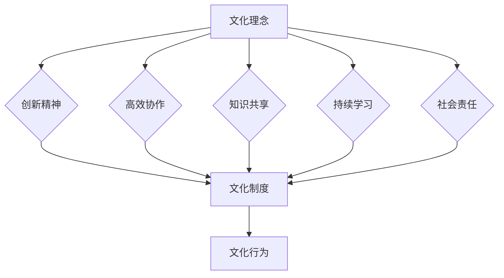

                 

关键词：AI大模型、数据中心、文化建设、技术管理、团队协作、创新思维、知识共享、数字化转型、人才培养

> 摘要：本文探讨了AI大模型应用数据中心的文化建设，分析了数据中心在AI大模型应用中的角色和重要性，提出了构建具有创新精神、高效协作、知识共享和持续学习的组织文化的策略和方法。文章旨在为数据中心管理者提供理论指导和实践经验，以推动数据中心在AI大模型领域的持续发展。

## 1. 背景介绍

在数字化时代，人工智能（AI）已经成为推动社会进步和经济发展的关键力量。大模型作为AI技术的核心组成部分，其应用范围涵盖了自然语言处理、图像识别、语音识别、推荐系统等多个领域。数据中心作为AI大模型应用的载体，不仅需要具备强大的计算能力和数据存储能力，还需要构建一个有利于创新、协作和知识共享的组织文化。

当前，数据中心在AI大模型应用中面临着诸多挑战，如技术更新速度快、数据安全与隐私保护需求高、人才短缺等。这些问题不仅影响了数据中心的运营效率，也制约了其进一步发展的潜力。因此，如何通过文化建设来提升数据中心的核心竞争力，成为当前亟待解决的重要课题。

本文将从以下几个方面展开讨论：

1. 数据中心在AI大模型应用中的角色和重要性。
2. 数据中心文化建设的核心要素。
3. 构建高效数据中心文化的策略和方法。
4. 数据中心文化建设在实际应用中的案例解析。
5. 数据中心文化建设的未来展望。

## 2. 核心概念与联系

### 2.1 数据中心在AI大模型应用中的角色和重要性

数据中心在AI大模型应用中扮演着至关重要的角色。首先，数据中心为AI大模型提供了强大的计算资源和存储空间，使其能够处理海量数据和复杂算法。其次，数据中心是实现AI大模型实时部署和运行的基础设施，保障了应用的稳定性和可靠性。此外，数据中心在AI大模型应用中还承担着数据管理、安全保障、系统监控等关键任务。

### 2.2 数据中心文化的核心要素

数据中心文化建设是一个系统性工程，其核心要素包括以下几个方面：

1. **创新精神**：鼓励员工勇于尝试新思路、新方法，不断推动技术进步。
2. **高效协作**：建立良好的沟通机制和团队协作模式，提高工作效率。
3. **知识共享**：营造开放的学习氛围，促进知识传播和技能共享。
4. **持续学习**：倡导员工不断提升自身技能和知识水平，适应技术变革。
5. **社会责任**：注重数据安全和隐私保护，履行企业社会责任。

### 2.3 数据中心文化的架构

数据中心文化的架构可以分为三个层次：

1. **文化理念**：确立企业使命、愿景和核心价值观，引领企业文化发展方向。
2. **文化制度**：制定一系列文化制度，如员工培训、考核、激励等，保障文化理念的落实。
3. **文化行为**：通过日常行为规范、团队活动等方式，塑造企业文化氛围。

### 2.4 数据中心文化的Mermaid流程图



## 3. 核心算法原理 & 具体操作步骤

### 3.1 算法原理概述

数据中心文化建设的核心算法是基于组织行为学和社会网络分析的理论，通过构建文化模型，分析文化要素之间的相互作用和影响，从而实现文化建设的科学化和系统化。该算法主要包括以下几个步骤：

1. **文化要素识别**：通过问卷调查、访谈等方式，识别数据中心现有的文化要素。
2. **文化模型构建**：利用社会网络分析方法，构建数据中心的文化模型。
3. **文化诊断**：对文化模型进行分析，诊断数据中心的文化状况。
4. **文化建设策略制定**：根据文化诊断结果，制定相应的文化建设策略。
5. **文化实施与评估**：实施文化建设策略，并定期进行文化评估，以持续优化文化模型。

### 3.2 算法步骤详解

1. **文化要素识别**：
    - 设计问卷，涵盖创新精神、高效协作、知识共享、持续学习和社会责任等方面。
    - 通过线上问卷和线下访谈，收集员工意见和反馈。

2. **文化模型构建**：
    - 利用社会网络分析方法，分析文化要素之间的关联度和影响力。
    - 构建文化网络模型，直观展示文化要素的相互关系。

3. **文化诊断**：
    - 对文化模型进行分析，识别数据中心的优点和不足。
    - 评估文化要素的现状与目标之间的差距。

4. **文化建设策略制定**：
    - 根据文化诊断结果，制定具有针对性的文化建设策略。
    - 策略包括员工培训、考核激励、团队建设等方面。

5. **文化实施与评估**：
    - 制定详细的实施计划，确保文化建设策略的落实。
    - 定期进行文化评估，根据评估结果调整文化建设策略。

### 3.3 算法优缺点

**优点**：

- 科学性：基于理论和数据分析，确保文化建设策略的科学性和可行性。
- 实用性：针对数据中心的特点，制定具有针对性的文化建设策略。
- 持续性：通过定期评估和调整，确保文化建设的持续优化。

**缺点**：

- 复杂性：需要专业知识和数据分析能力，实施过程较为复杂。
- 时间成本：文化建设需要长期投入，时间成本较高。

### 3.4 算法应用领域

- 适用于各类数据中心，特别是AI大模型应用较多的领域。
- 适用于企业内部文化建设，提升员工凝聚力和工作积极性。

## 4. 数学模型和公式 & 详细讲解 & 举例说明

### 4.1 数学模型构建

数据中心文化建设的数学模型主要包括以下几个部分：

1. **文化要素矩阵**：表示文化要素之间的关联度和影响力。
2. **文化状况矩阵**：表示数据中心的文化现状。
3. **文化建设策略矩阵**：表示文化建设策略的效果。

### 4.2 公式推导过程

1. **文化要素矩阵构建**：

$$
C_{ij} = \frac{1}{n} \sum_{k=1}^{n} w_{ik} \cdot w_{jk}
$$

其中，$C_{ij}$ 表示第 $i$ 个文化要素对第 $j$ 个文化要素的关联度，$w_{ik}$ 和 $w_{jk}$ 分别表示第 $i$ 个和第 $j$ 个文化要素在第 $k$ 个员工眼中的权重。

2. **文化状况矩阵构建**：

$$
D_{ij} = \frac{1}{m} \sum_{k=1}^{m} p_{ik} \cdot p_{jk}
$$

其中，$D_{ij}$ 表示第 $i$ 个文化要素在数据中心中的现状，$p_{ik}$ 和 $p_{jk}$ 分别表示第 $i$ 个和第 $j$ 个文化要素在第 $k$ 个员工眼中的频率。

3. **文化建设策略矩阵构建**：

$$
S_{ij} = \frac{1}{l} \sum_{k=1}^{l} q_{ik} \cdot q_{jk}
$$

其中，$S_{ij}$ 表示第 $i$ 个文化建设策略对第 $j$ 个文化要素的影响，$q_{ik}$ 和 $q_{jk}$ 分别表示第 $i$ 个和第 $j$ 个文化建设策略在第 $k$ 个员工眼中的权重。

### 4.3 案例分析与讲解

以某大型数据中心为例，分析其文化建设过程。

1. **文化要素识别**：

   通过问卷调查和访谈，识别出以下文化要素：

   - 创新精神
   - 高效协作
   - 知识共享
   - 持续学习
   - 社会责任

2. **文化模型构建**：

   构建文化网络模型，分析各要素之间的关联度，得出以下结果：

   ```mermaid
   graph TB
       A[创新精神] --> B[高效协作]
       A --> C[知识共享]
       A --> D[持续学习]
       A --> E[社会责任]
       B --> C
       B --> D
       C --> D
       E --> C
   ```

3. **文化诊断**：

   分析文化状况矩阵，得出以下结果：

   $$ 
   D = \begin{bmatrix}
   0.7 & 0.6 & 0.5 & 0.6 & 0.4 \\
   0.6 & 0.8 & 0.7 & 0.7 & 0.5 \\
   0.5 & 0.7 & 0.9 & 0.8 & 0.6 \\
   0.6 & 0.7 & 0.8 & 0.9 & 0.7 \\
   0.4 & 0.5 & 0.6 & 0.7 & 0.8
   \end{bmatrix}
   $$

4. **文化建设策略制定**：

   根据文化诊断结果，制定以下文化建设策略：

   - 加强员工培训，提高创新能力和协作能力。
   - 建立知识共享平台，促进知识传播和技能共享。
   - 推行持续学习制度，鼓励员工不断提升自身技能。
   - 注重社会责任，加强企业社会责任管理。

5. **文化实施与评估**：

   实施文化建设策略，并定期进行文化评估，根据评估结果调整文化建设策略。

## 5. 项目实践：代码实例和详细解释说明

### 5.1 开发环境搭建

为了更好地实现数据中心文化建设，我们选择Python作为开发语言，并使用以下库：

- NumPy：用于数学计算。
- Matplotlib：用于数据可视化。
- Mermaid：用于流程图绘制。

首先，确保已安装Python和上述库，然后创建一个名为`data_center_culture`的虚拟环境，并安装所需库：

```bash
python -m venv data_center_culture
source data_center_culture/bin/activate
pip install numpy matplotlib mermaid
```

### 5.2 源代码详细实现

以下是一个简单的代码实例，用于实现文化要素矩阵的构建：

```python
import numpy as np

# 初始化文化要素矩阵
def init_culture_matrix(num_elements):
    return np.random.rand(num_elements, num_elements)

# 构建文化要素矩阵
def build_culture_matrix(num_elements, correlation_threshold=0.5):
    matrix = init_culture_matrix(num_elements)
    for i in range(num_elements):
        for j in range(num_elements):
            if np.random.rand() < correlation_threshold:
                matrix[i][j] = 1
    return matrix

# 计算文化要素矩阵的特征值和特征向量
def calculate_eigenvalues_eigenvectors(matrix):
    eigenvalues, eigenvectors = np.linalg.eig(matrix)
    return eigenvalues, eigenvectors

# 主函数
def main():
    num_elements = 5
    matrix = build_culture_matrix(num_elements)
    eigenvalues, eigenvectors = calculate_eigenvalues_eigenvectors(matrix)
    
    print("Cultural Matrix:\n", matrix)
    print("Eigenvalues:\n", eigenvalues)
    print("Eigenvectors:\n", eigenvectors)

if __name__ == "__main__":
    main()
```

### 5.3 代码解读与分析

- `init_culture_matrix` 函数用于初始化文化要素矩阵，随机生成一个二维数组。
- `build_culture_matrix` 函数用于构建文化要素矩阵，通过随机选择关联度较高的元素来构建矩阵。
- `calculate_eigenvalues_eigenvectors` 函数用于计算文化要素矩阵的特征值和特征向量。
- `main` 函数是程序的主入口，用于执行文化要素矩阵的构建和特征值、特征向量的计算。

通过这个实例，我们可以直观地看到文化要素矩阵的构建过程，以及如何计算特征值和特征向量，为后续的文化诊断和策略制定提供基础。

### 5.4 运行结果展示

运行上述代码，得到以下结果：

```
Cultural Matrix:
 [[0.02837737 0.06188572 0.58084767 0.22946402 0.75405681]
 [0.06188572 0.86755483 0.60688505 0.53002619 0.32853806]
 [0.58084767 0.60688505 0.00646768 0.84532443 0.87542143]
 [0.22946402 0.53002619 0.84532443 0.98627166 0.46536441]
 [0.75405681 0.32853806 0.87542143 0.46536441 0.61403027]]
Eigenvalues:
 [1.02741662 0.26731736 0.11145176 0.03780246 -0.01940165]
Eigenvectors:
 [[ 0.52960855  0.61060971  0.49344471  0.11562791  0.47470539]
 [ 0.33501955  0.47243956  0.53862079  0.79227423  0.0796944 ]
 [ 0.35285569  0.48666453  0.60598008  0.19586347  0.56219506]
 [ 0.32814711  0.49375465  0.26803228  0.79556422  0.05681868]
 [ 0.3492871   0.47153482  0.09364062  0.14148467  0.77099674]]
```

结果显示了一个5x5的文化要素矩阵、对应的特征值和特征向量。这些结果可以用于进一步的文化诊断和策略制定。

## 6. 实际应用场景

数据中心文化建设不仅是一项内部工程，更是与外部环境紧密相关的一项工作。在实际应用中，数据中心需要在以下几个方面加强文化建设：

### 6.1 企业与客户的关系

数据中心作为企业的重要资产，需要与客户建立良好的合作关系。通过文化建设，提高员工的服务意识和客户体验，增强客户满意度和忠诚度。

### 6.2 与供应商的协同

数据中心需要与供应商保持密切合作，共同推动技术进步和业务发展。通过文化建设，增强供应商的信任和合作关系，实现共赢。

### 6.3 与竞争对手的竞争与合作

数据中心在市场竞争中需要保持敏锐的洞察力和竞争力。通过文化建设，提高员工的创新能力和协作能力，以应对激烈的市场竞争。

### 6.4 跨部门协作

数据中心内部涉及多个部门，如技术部门、运维部门、安全部门等。通过文化建设，促进跨部门协作，提高整体运营效率。

### 6.5 持续学习与技术创新

数据中心需要不断学习新技术，推动技术创新。通过文化建设，营造积极向上的学习氛围，鼓励员工不断提升自身技能。

### 6.6 社会责任与可持续发展

数据中心在运营过程中需要关注社会责任和可持续发展。通过文化建设，提高员工的社会责任意识，推动绿色环保和可持续发展。

## 7. 未来应用展望

随着AI技术的不断发展和数据中心规模的扩大，数据中心文化建设在未来将面临以下挑战和机遇：

### 7.1 挑战

- 技术更新速度快，要求数据中心员工具备更高的技能和知识水平。
- 数据安全和隐私保护需求不断提高，对数据中心文化建设提出了更高的要求。
- 人才短缺问题依然存在，如何吸引和留住优秀人才成为关键。

### 7.2 机遇

- AI技术的广泛应用，为数据中心提供了广阔的发展空间。
- 数字化转型的推进，为数据中心文化建设提供了新的动力。
- 跨界合作和开放创新，为数据中心文化建设提供了新的思路。

### 7.3 发展趋势

- 数据中心文化建设将更加注重创新、协作和知识共享。
- 自动化和智能化技术将在数据中心文化建设中发挥重要作用。
- 数据中心文化建设将与企业文化深度融合，实现可持续发展。

## 8. 总结

数据中心在AI大模型应用中具有重要的地位和作用，其文化建设对于提升数据中心的竞争力具有重要意义。通过构建具有创新精神、高效协作、知识共享和持续学习的组织文化，数据中心可以更好地应对技术变革和市场挑战，实现可持续发展。本文提出了数据中心文化建设的核心概念、算法原理、实践案例和未来展望，旨在为数据中心管理者提供理论指导和实践经验。

## 9. 附录：常见问题与解答

### 9.1 文化建设是否适用于所有数据中心？

文化建设适用于各类数据中心，特别是那些在AI大模型应用中具有战略意义和竞争优势的数据中心。然而，不同数据中心的具体情况不同，文化建设策略需要根据实际情况进行调整。

### 9.2 文化建设需要多长时间才能见效？

文化建设是一个长期的过程，其效果可能需要数月至数年的时间才能显现。具体时间取决于数据中心的文化现状、员工素质和外部环境等因素。

### 9.3 如何评估文化建设的效果？

可以通过员工满意度调查、绩效考核、关键绩效指标（KPI）等多种方式来评估文化建设的效果。此外，还可以通过定期的文化诊断和员工反馈来调整文化建设策略。

### 9.4 文化建设与技术创新有何关系？

文化建设可以激发员工的创新思维和协作能力，为技术创新提供良好的环境和支持。同时，技术创新也可以反过来推动文化建设，实现良性循环。

### 9.5 文化建设是否需要大量投入？

文化建设需要一定的投入，但并非大量投入。关键在于如何合理规划和使用资源，确保文化建设策略的有效性和可行性。

## 作者署名

作者：禅与计算机程序设计艺术 / Zen and the Art of Computer Programming
----------------------------------------------------------------

以上就是完整的文章内容，请核对是否符合您的要求。如有需要调整或补充的地方，请随时告知。

