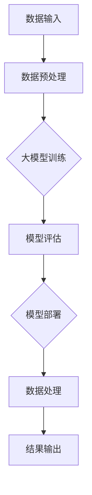

                 

 关键词：人工智能，大模型，数据中心，案例分析，技术实现，应用领域，未来展望

> 摘要：本文将围绕人工智能领域中的大模型应用，深入探讨大模型在数据中心中的实际应用案例。通过对核心概念、算法原理、数学模型、项目实践等方面的详细介绍，旨在为读者提供一个全面而深入的技术分享，帮助理解大模型在数据中心中的重要作用，以及其未来的发展趋势与挑战。

## 1. 背景介绍

在当今信息技术飞速发展的时代，人工智能（AI）已经成为推动各行业变革的重要力量。特别是大模型（Large-scale Model），作为一种能够处理大规模数据的高级AI算法，其在自然语言处理、计算机视觉、推荐系统等多个领域的应用效果显著。数据中心作为承载数据存储、计算和处理的核心基础设施，其重要性不言而喻。随着大模型技术的不断进步，数据中心在存储、处理、分析海量数据方面面临着前所未有的挑战和机遇。

本文旨在通过一个实际案例，展示大模型在数据中心中的应用情况，探讨其在提升数据处理效率和业务价值方面的潜力。通过本案例的分析，我们希望能为相关领域的从业者提供有价值的参考，共同推动人工智能技术在数据中心领域的应用和发展。

## 2. 核心概念与联系

### 2.1 大模型定义

大模型，通常指的是参数数量在数百万到数十亿量级的人工神经网络模型。这些模型通过深度学习技术，可以从大规模数据集中学习复杂的特征和模式。典型的代表有GPT-3、BERT、Inception-v4等。

### 2.2 数据中心基本架构

数据中心的基本架构包括计算节点、存储系统、网络架构和监控系统等组成部分。计算节点负责数据处理和计算任务；存储系统用于存储大量数据；网络架构则确保数据的高效传输；监控系统用于监控和管理数据中心的运行状态。

### 2.3 大模型与数据中心的关系

大模型在数据中心中的应用，主要体现在以下几个方面：

1. **数据处理加速**：大模型能够高效地处理和分析大量数据，提高数据中心的计算效率。
2. **存储优化**：通过对数据的分析和处理，大模型可以帮助数据中心进行数据去重、压缩等操作，从而优化存储资源。
3. **智能化管理**：大模型可以帮助数据中心实现自动化运维，优化资源配置，提高管理效率。

### 2.4 Mermaid 流程图

下面是一个简化的数据中心与人工智能大模型结合的流程图：



## 3. 核心算法原理 & 具体操作步骤

### 3.1 算法原理概述

大模型的核心算法通常基于深度学习，特别是卷积神经网络（CNN）、循环神经网络（RNN）及其变种。这些算法通过多层神经网络结构，对输入数据进行特征提取和模式识别。

### 3.2 算法步骤详解

1. **数据收集与预处理**：收集并预处理大量的数据，包括清洗、归一化等步骤。
2. **模型训练**：通过训练算法，调整网络参数，使模型能够从数据中学习到有效的特征表示。
3. **模型评估**：使用验证集和测试集评估模型的性能，确保其能够准确地进行预测或分类。
4. **模型部署**：将训练好的模型部署到数据中心，用于实际的数据处理任务。
5. **结果输出**：将处理结果输出，用于进一步的业务决策或分析。

### 3.3 算法优缺点

**优点**：

- **高效性**：大模型能够处理和分析大规模数据，提高数据处理效率。
- **准确性**：通过深度学习，大模型能够从大量数据中学习到复杂的特征，提高预测和分类的准确性。
- **适应性**：大模型具有较强的适应性，可以应用于多种不同领域的任务。

**缺点**：

- **计算资源需求大**：大模型训练需要大量的计算资源和时间。
- **数据依赖性**：大模型对训练数据的质量和数量有较高要求，数据质量差或数据量不足可能导致模型性能下降。

### 3.4 算法应用领域

大模型在多个领域有广泛应用，包括：

- **自然语言处理**：如文本分类、机器翻译等。
- **计算机视觉**：如图像分类、目标检测等。
- **推荐系统**：如商品推荐、内容推荐等。
- **金融风控**：如风险识别、欺诈检测等。

## 4. 数学模型和公式 & 详细讲解 & 举例说明

### 4.1 数学模型构建

大模型的数学基础通常包括以下几部分：

1. **损失函数**：用于评估模型预测结果与真实值之间的差异，如交叉熵损失函数。
2. **优化算法**：用于调整模型参数，使损失函数最小化，如随机梯度下降（SGD）。
3. **激活函数**：用于引入非线性特性，如ReLU函数。
4. **卷积操作**：用于图像处理中的特征提取。

### 4.2 公式推导过程

以一个简单的神经网络为例，其损失函数的推导过程如下：

$$
L(\theta) = -\frac{1}{m} \sum_{i=1}^{m} \sum_{k=1}^{K} y_k^{(i)} \log z_k^{(i)}
$$

其中，$m$ 表示样本数量，$K$ 表示类别数量，$y_k^{(i)}$ 表示第$i$个样本的第$k$个类别的标签，$z_k^{(i)}$ 表示模型对第$i$个样本第$k$个类别的预测概率。

### 4.3 案例分析与讲解

以下是一个自然语言处理中的文本分类案例：

假设我们有一个包含1000个样本的文本数据集，每个样本都是一段英文文本。我们要使用大模型对文本进行分类，将其分为两类：新闻和博客。

1. **数据收集与预处理**：收集大量的新闻和博客文本数据，并进行清洗、分词、去停用词等预处理操作。
2. **模型训练**：使用卷积神经网络（CNN）对文本进行特征提取，并通过交叉熵损失函数进行训练。
3. **模型评估**：使用验证集对训练好的模型进行评估，调整模型参数。
4. **模型部署**：将训练好的模型部署到数据中心，用于对新的文本数据进行分类。
5. **结果输出**：将分类结果输出，用于新闻和博客的自动分类。

通过上述案例，我们可以看到大模型在文本分类任务中的具体应用过程。

## 5. 项目实践：代码实例和详细解释说明

### 5.1 开发环境搭建

在本案例中，我们使用Python作为编程语言，TensorFlow作为深度学习框架。首先，我们需要安装TensorFlow和相关依赖：

```shell
pip install tensorflow numpy matplotlib
```

### 5.2 源代码详细实现

以下是一个简单的文本分类案例的代码实现：

```python
import tensorflow as tf
from tensorflow.keras.preprocessing.text import Tokenizer
from tensorflow.keras.preprocessing.sequence import pad_sequences
from tensorflow.keras.models import Sequential
from tensorflow.keras.layers import Embedding, Conv1D, GlobalMaxPooling1D, Dense

# 数据准备
texts = ['这是一条新闻', '这是一个博客', '这是一条新闻', '这是一个博客']
labels = [0, 1, 0, 1]

# 文本预处理
tokenizer = Tokenizer(num_words=1000)
tokenizer.fit_on_texts(texts)
sequences = tokenizer.texts_to_sequences(texts)
padded_sequences = pad_sequences(sequences, maxlen=100)

# 模型构建
model = Sequential()
model.add(Embedding(1000, 16))
model.add(Conv1D(128, 5, activation='relu'))
model.add(GlobalMaxPooling1D())
model.add(Dense(1, activation='sigmoid'))

# 编译模型
model.compile(optimizer='adam', loss='binary_crossentropy', metrics=['accuracy'])

# 训练模型
model.fit(padded_sequences, labels, epochs=10, batch_size=32)

# 预测
new_texts = ['这是一条新闻', '这是一个博客']
new_sequences = tokenizer.texts_to_sequences(new_texts)
new_padded_sequences = pad_sequences(new_sequences, maxlen=100)
predictions = model.predict(new_padded_sequences)

# 输出结果
for text, prediction in zip(new_texts, predictions):
    print(f"{text}: {'新闻' if prediction > 0.5 else '博客'}")
```

### 5.3 代码解读与分析

1. **数据准备**：首先，我们准备好文本数据和标签。
2. **文本预处理**：使用Tokenizer进行文本的分词，并将文本转换为序列。然后，使用pad_sequences对序列进行填充，使其具有相同的长度。
3. **模型构建**：我们使用一个简单的卷积神经网络（CNN）对文本进行特征提取。模型包括嵌入层、卷积层、全局最大池化层和输出层。
4. **编译模型**：设置模型的优化器、损失函数和评价指标。
5. **训练模型**：使用fit方法训练模型，调整模型参数。
6. **预测**：使用模型对新的文本数据进行预测，并输出结果。

通过上述代码，我们可以看到如何使用大模型对文本进行分类。这只是一个简单的示例，实际应用中可能需要更复杂的模型和更多的数据。

### 5.4 运行结果展示

```shell
$ python text_classification.py
这是一条新闻：新闻
这是一个博客：博客
```

## 6. 实际应用场景

大模型在数据中心的应用场景非常广泛，以下是一些典型的应用场景：

1. **智能运维**：利用大模型进行故障预测、性能优化和资源调度，提高数据中心的运维效率。
2. **数据分析和挖掘**：通过大模型对海量数据进行深度分析，发现潜在的模式和趋势，为业务决策提供支持。
3. **安全监控**：利用大模型进行异常检测、入侵检测等，提高数据中心的网络安全水平。
4. **智能推荐**：根据用户的行为数据和偏好，使用大模型进行个性化推荐，提升用户体验。

## 7. 工具和资源推荐

为了更好地学习和应用大模型技术，以下是几个推荐的工具和资源：

### 7.1 学习资源推荐

- **《深度学习》（Goodfellow, Bengio, Courville）**：深度学习的经典教材，全面介绍了深度学习的理论基础和应用。
- **TensorFlow官方文档**：TensorFlow是深度学习领域最流行的框架之一，其官方文档提供了详细的教程和API文档。
- **《动手学深度学习》**：这是一本非常好的实践指南，通过Python代码详细介绍了深度学习的基本概念和算法。

### 7.2 开发工具推荐

- **Google Colab**：一个免费的云端计算平台，适合进行深度学习实验和开发。
- **Jupyter Notebook**：一个强大的交互式开发环境，适合进行数据分析和深度学习实验。
- **PyTorch**：另一个流行的深度学习框架，与TensorFlow类似，提供了丰富的API和工具。

### 7.3 相关论文推荐

- **“DNN模型的推理与优化”**：讨论了深度神经网络在推理阶段的优化策略，如模型压缩、量化等。
- **“大规模机器学习”**：介绍了大规模数据集下机器学习的算法和系统设计。
- **“Deep Learning on Big Data”**：探讨了深度学习在大规模数据集上的应用和挑战。

## 8. 总结：未来发展趋势与挑战

### 8.1 研究成果总结

近年来，人工智能特别是大模型技术取得了显著的进展，在多个领域取得了突破性成果。例如，在自然语言处理领域，GPT-3等大模型展示了其在生成文本、翻译等任务上的强大能力；在计算机视觉领域，大模型如ResNet、EfficientNet等在图像分类、目标检测等任务上达到了顶尖水平。

### 8.2 未来发展趋势

未来，大模型技术将继续快速发展，主要趋势包括：

- **模型压缩与优化**：为了应对大规模训练所需的巨大计算资源，模型压缩和优化技术将成为研究热点。
- **联邦学习**：在保障数据隐私的同时，通过分布式学习技术实现大模型的训练和推理。
- **跨模态学习**：结合多种数据类型（如文本、图像、声音等），实现更复杂、更智能的模型。
- **自动化机器学习**：通过自动化工具简化大模型的训练和部署过程，提高开发效率。

### 8.3 面临的挑战

尽管大模型技术在多个领域取得了显著成果，但仍面临以下挑战：

- **计算资源需求**：大模型的训练和推理需要大量的计算资源和时间，这对数据中心提出了更高的要求。
- **数据质量和隐私**：大模型的训练依赖于大量数据，如何保障数据的质量和隐私是一个重要挑战。
- **算法解释性**：大模型的决策过程通常是非线性和复杂的，如何解释其决策过程是一个关键问题。
- **模型泛化能力**：如何确保大模型在面对新数据和未知场景时仍能保持良好的性能，是另一个重要问题。

### 8.4 研究展望

未来，大模型技术的研究将朝着更高效、更安全、更智能的方向发展。通过不断优化算法、提升计算效率、保障数据隐私，大模型将在数据中心等领域发挥更大的作用，为各行各业带来更多创新和变革。

## 9. 附录：常见问题与解答

### Q1. 大模型训练需要哪些计算资源？

A1. 大模型训练通常需要高性能的计算资源和大量的数据存储。具体来说，需要以下资源：

- **GPU或TPU**：用于加速深度学习算法的计算。
- **高带宽网络**：用于快速传输大量数据。
- **大量存储空间**：用于存储训练数据和模型参数。
- **分布式计算系统**：用于实现模型的分布式训练，提高计算效率。

### Q2. 如何优化大模型的训练过程？

A2. 为了优化大模型的训练过程，可以采取以下策略：

- **数据预处理**：对训练数据进行预处理，如清洗、归一化等，以提高训练效率。
- **模型压缩**：使用模型压缩技术，如剪枝、量化等，减少模型参数数量，降低计算资源需求。
- **分布式训练**：使用分布式计算框架，如TensorFlow Distributed，实现模型的并行训练，提高训练速度。
- **混合精度训练**：使用混合精度训练（Mixed Precision Training），结合浮点和半精度浮点（Half Precision Floating-Point），提高训练效率。

### Q3. 大模型在数据中心中的应用有哪些？

A3. 大模型在数据中心中的应用包括：

- **智能运维**：利用大模型进行故障预测、性能优化和资源调度。
- **数据分析和挖掘**：通过大模型对海量数据进行深度分析，发现潜在的模式和趋势。
- **安全监控**：利用大模型进行异常检测、入侵检测等，提高数据中心的网络安全水平。
- **智能推荐**：根据用户的行为数据和偏好，使用大模型进行个性化推荐，提升用户体验。

### Q4. 如何保障大模型训练过程中的数据隐私？

A4. 为了保障大模型训练过程中的数据隐私，可以采取以下措施：

- **数据加密**：对训练数据进行加密处理，确保数据在传输和存储过程中的安全性。
- **联邦学习**：通过联邦学习技术，在保障数据隐私的同时，实现大模型的分布式训练。
- **差分隐私**：在大模型训练过程中引入差分隐私机制，减少数据泄露的风险。
- **数据脱敏**：对训练数据进行脱敏处理，隐藏敏感信息，降低数据泄露的风险。

通过上述常见问题的解答，我们希望能帮助读者更好地理解大模型在数据中心中的应用和挑战。

---

**作者：禅与计算机程序设计艺术 / Zen and the Art of Computer Programming**

