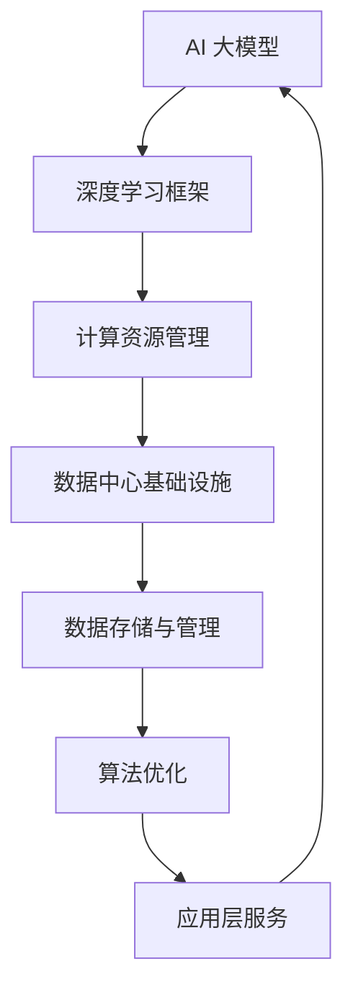
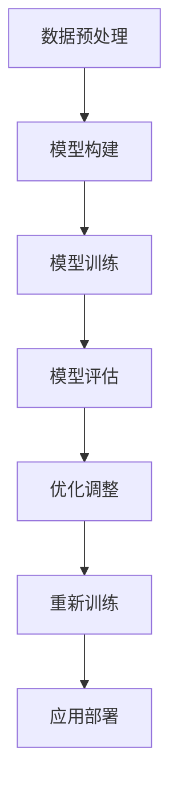

                 

关键词：AI 大模型、数据中心、竞争分析、技术架构、算法优化、应用场景、未来展望

## 摘要

本文将深入探讨 AI 大模型应用数据中心的竞争格局。首先，我们将简要介绍 AI 大模型的背景及其在数据中心中的应用现状。接着，我们将分析当前 AI 大模型应用数据中心的技术竞争，探讨各大厂商在硬件、软件和服务层面的策略。随后，文章将重点分析核心算法原理及其优化方向，并探讨数学模型和公式的应用。此外，我们将分享一个具体的代码实例，展示如何在数据中心中实现 AI 大模型的应用。最后，我们将展望 AI 大模型应用数据中心的未来发展趋势，提出潜在的研究方向和挑战。

## 1. 背景介绍

人工智能（AI）作为当今科技领域的热门话题，正迅速改变着各行各业的面貌。AI 大模型，尤其是深度学习模型，凭借其强大的处理能力和对复杂数据的解析能力，已成为人工智能研究的核心。这些大模型通常具有数百万甚至数十亿的参数，需要庞大的计算资源和高效的算法支持。

数据中心作为 AI 大模型训练和部署的核心设施，扮演着至关重要的角色。随着 AI 大模型的规模不断扩大，数据中心的性能、可靠性和扩展性面临着前所未有的挑战。同时，AI 大模型应用数据中心的竞争也在激烈展开，各大厂商纷纷推出各自的技术方案，争夺市场份额。

### 1.1 AI 大模型的发展历程

AI 大模型的发展经历了从简单到复杂、从单一到多元的过程。早期的 AI 大模型如感知器、反向传播网络等，主要应用于简单的图像和语音识别任务。随着计算能力的提升和大数据技术的发展，AI 大模型逐渐变得复杂和强大，能够处理更广泛的应用场景，如自然语言处理、计算机视觉、推荐系统等。

### 1.2 数据中心在 AI 应用中的角色

数据中心在 AI 应用中扮演了关键角色。首先，数据中心提供了大规模的计算资源，支持 AI 大模型的训练和推理。其次，数据中心的高可靠性和高安全性保障了 AI 应用的稳定性。此外，数据中心的分布式架构和弹性扩展能力，能够满足不断增长的 AI 应用量需求。

### 1.3 AI 大模型在数据中心中的应用现状

目前，AI 大模型在数据中心中的应用已经取得了显著进展。例如，云计算服务商如亚马逊 AWS、微软 Azure 和谷歌 Cloud，都提供了大规模的 AI 大模型训练平台。这些平台不仅支持深度学习模型的训练，还提供了丰富的模型优化工具和服务，助力企业快速部署 AI 应用。

## 2. 核心概念与联系

在深入探讨 AI 大模型应用数据中心的技术竞争之前，我们需要明确一些核心概念，并了解它们之间的联系。以下是一个简化的 Mermaid 流程图，用于描述这些核心概念和它们之间的关系。



### 2.1 AI 大模型

AI 大模型是指具有大量参数的深度学习模型，如 GPT-3、BERT、ResNet 等。这些模型通过大规模数据训练，能够实现复杂的任务，如图像识别、自然语言处理等。

### 2.2 深度学习框架

深度学习框架如 TensorFlow、PyTorch 等，提供了用于构建、训练和优化 AI 大模型的高级抽象。这些框架支持分布式训练，能够充分利用数据中心的计算资源。

### 2.3 计算资源管理

计算资源管理是确保 AI 大模型训练高效运行的关键。它包括计算资源的调度、负载均衡、资源监控等功能，以保证训练过程的稳定性和效率。

### 2.4 数据中心基础设施

数据中心基础设施包括服务器、存储、网络等硬件设施，以及相关的软件系统，如操作系统、虚拟化技术等。这些基础设施为 AI 大模型的训练提供了必要的支持。

### 2.5 数据存储与管理

数据存储与管理是 AI 大模型训练的基础。它涉及数据的收集、存储、清洗、标注等环节，以确保训练数据的质量和多样性。

### 2.6 算法优化

算法优化是指通过改进算法设计、优化训练策略等手段，提高 AI 大模型的训练效率和性能。算法优化是提升数据中心 AI 应用能力的关键。

### 2.7 应用层服务

应用层服务是将训练好的 AI 大模型部署到实际应用中的关键环节。它包括模型的推理、在线服务、监控等，以满足用户的需求。

## 3. 核心算法原理 & 具体操作步骤

### 3.1 算法原理概述

AI 大模型的训练过程主要包括数据预处理、模型构建、模型训练和模型评估等环节。以下是一个简化的算法流程图：



### 3.2 算法步骤详解

#### 3.2.1 数据预处理

数据预处理是训练高质量 AI 大模型的关键步骤。它包括数据清洗、数据转换和数据增强等。

- **数据清洗**：去除噪声数据、缺失值填充、异常值处理等。
- **数据转换**：将数据转换为适合模型训练的格式，如像素值转换为浮点数。
- **数据增强**：通过旋转、缩放、裁剪等手段增加数据多样性，提高模型泛化能力。

#### 3.2.2 模型构建

模型构建是选择合适的模型架构，如卷积神经网络（CNN）、循环神经网络（RNN）、变换器（Transformer）等。

- **网络架构设计**：根据应用场景选择合适的神经网络架构。
- **层结构设计**：设计网络的层数、每层神经元数量、激活函数等。
- **参数初始化**：为模型参数随机初始化合适的值。

#### 3.2.3 模型训练

模型训练是优化模型参数，使模型在训练数据上达到良好的性能。

- **损失函数选择**：选择合适的损失函数，如交叉熵损失、均方误差等。
- **优化算法选择**：选择合适的优化算法，如随机梯度下降（SGD）、Adam 等。
- **训练过程监控**：监控训练过程，如学习率调整、训练进度等。

#### 3.2.4 模型评估

模型评估是评估模型在测试数据上的性能。

- **评估指标**：选择合适的评估指标，如准确率、召回率、F1 分数等。
- **交叉验证**：通过交叉验证确保评估结果的可靠性。
- **超参数调优**：根据评估结果调整模型超参数，如学习率、批量大小等。

#### 3.2.5 优化调整

根据模型评估结果，对模型进行调整，提高模型性能。

- **模型剪枝**：通过剪枝减少模型参数数量，提高模型效率。
- **迁移学习**：利用预训练模型，通过迁移学习提高模型在特定任务上的性能。
- **融合模型**：通过融合多个模型，提高模型的整体性能。

#### 3.2.6 重新训练

根据评估结果和优化调整，重新训练模型，直到达到满意的性能。

- **训练数据更新**：根据新的训练数据重新训练模型。
- **模型迭代**：通过迭代训练，逐步优化模型。

#### 3.2.7 应用部署

将训练好的模型部署到实际应用中，提供服务。

- **模型推理**：通过模型推理，实现实时预测和决策。
- **在线服务**：将模型部署到在线环境，提供 API 服务。
- **监控与维护**：监控模型运行状态，进行必要的维护和更新。

### 3.3 算法优缺点

#### 优点

- **强大的处理能力**：AI 大模型能够处理复杂的任务，如图像识别、自然语言处理等。
- **高泛化能力**：通过大规模数据训练，AI 大模型具有较好的泛化能力，能够应对不同的应用场景。
- **自动化**：AI 大模型的训练和优化过程可以自动化，提高开发效率。

#### 缺点

- **计算资源需求高**：AI 大模型训练需要大量的计算资源，对数据中心的性能要求较高。
- **数据依赖性**：AI 大模型训练依赖大量高质量的数据，数据获取和处理成本较高。
- **过拟合风险**：AI 大模型容易发生过拟合现象，需要通过数据增强和正则化等技术进行优化。

### 3.4 算法应用领域

AI 大模型在多个领域有着广泛的应用，包括但不限于：

- **计算机视觉**：图像识别、物体检测、图像生成等。
- **自然语言处理**：文本分类、机器翻译、语音识别等。
- **推荐系统**：基于用户行为的个性化推荐。
- **医学诊断**：疾病诊断、药物研发等。
- **金融风控**：信用评分、欺诈检测等。

## 4. 数学模型和公式 & 详细讲解 & 举例说明

在 AI 大模型的训练过程中，数学模型和公式扮演着至关重要的角色。以下将详细讲解一些常用的数学模型和公式，并通过实例进行说明。

### 4.1 数学模型构建

在构建 AI 大模型时，常用的数学模型包括神经网络模型、损失函数模型、优化算法模型等。

#### 4.1.1 神经网络模型

神经网络模型由多个神经元层组成，包括输入层、隐藏层和输出层。每个神经元都通过权重和偏置进行连接，构成一个非线性变换。以下是一个简化的神经网络模型：

$$
\begin{aligned}
z^{(l)}_j &= \sum_{i} w^{(l)}_{ji} x_i + b^{(l)}_j \\
a^{(l)}_j &= \sigma(z^{(l)}_j)
\end{aligned}
$$

其中，$z^{(l)}_j$ 表示第 $l$ 层第 $j$ 个神经元的输入，$w^{(l)}_{ji}$ 表示第 $l$ 层第 $j$ 个神经元与第 $i$ 个神经元的连接权重，$b^{(l)}_j$ 表示第 $l$ 层第 $j$ 个神经元的偏置，$a^{(l)}_j$ 表示第 $l$ 层第 $j$ 个神经元的输出，$\sigma$ 表示激活函数。

#### 4.1.2 损失函数模型

损失函数是衡量模型预测结果与实际结果之间差距的指标。常用的损失函数包括均方误差（MSE）、交叉熵（Cross-Entropy）等。以下是一个简化的损失函数模型：

$$
\begin{aligned}
L &= \frac{1}{2} \sum_{i} (\hat{y}_i - y_i)^2 \quad \text{(MSE)} \\
L &= - \sum_{i} y_i \log(\hat{y}_i) \quad \text{(Cross-Entropy)}
\end{aligned}
$$

其中，$\hat{y}_i$ 表示模型预测的输出，$y_i$ 表示实际的输出，$L$ 表示损失函数值。

#### 4.1.3 优化算法模型

优化算法用于调整模型参数，以最小化损失函数。常用的优化算法包括随机梯度下降（SGD）、Adam 等。以下是一个简化的优化算法模型：

$$
\begin{aligned}
\theta &= \theta - \alpha \nabla_\theta L \\
\theta &= \theta - \frac{\alpha}{\sqrt{1 + \beta_1 t}} \nabla_\theta L
\end{aligned}
$$

其中，$\theta$ 表示模型参数，$\alpha$ 表示学习率，$\beta_1$ 和 $\beta_2$ 分别为 Adam 算法的两个超参数。

### 4.2 公式推导过程

#### 4.2.1 神经网络模型的损失函数

假设我们有一个二分类问题，目标函数为 $y \in \{0, 1\}$，模型预测概率为 $\hat{y} = \sigma(z)$，其中 $z = \sum_{i} w_{ji} x_i + b$。我们可以使用交叉熵损失函数来衡量预测结果与实际结果之间的差距：

$$
L = - \sum_{i} y_i \log(\hat{y}_i) = - \sum_{i} y_i \log(\sigma(z))
$$

其中，$y_i$ 为实际输出，$\hat{y}_i$ 为预测概率。

#### 4.2.2 优化算法的推导

以随机梯度下降（SGD）为例，我们首先计算损失函数关于模型参数的梯度：

$$
\nabla_\theta L = \nabla_\theta (- \sum_{i} y_i \log(\sigma(z))) = - \sum_{i} y_i \nabla_\theta \log(\sigma(z))
$$

对于激活函数 $\sigma(z) = \sigma(\sum_{i} w_{ji} x_i + b)$，其导数为 $\nabla_\theta \log(\sigma(z)) = \frac{\sigma'(z)}{\sigma(z)}$。因此，我们可以得到：

$$
\nabla_\theta L = - \sum_{i} y_i \frac{\sigma'(z)}{\sigma(z)} \nabla_\theta z = - \sum_{i} y_i \frac{\sigma'(z)}{\sigma(z)} w_{ji} x_i
$$

最终，我们通过迭代更新模型参数：

$$
\theta = \theta - \alpha \nabla_\theta L
$$

### 4.3 案例分析与讲解

假设我们有一个简单的二分类问题，数据集包含 1000 个样本，每个样本有 10 个特征。我们使用神经网络模型进行训练，目标函数为交叉熵损失函数，优化算法为随机梯度下降。

#### 4.3.1 数据预处理

首先，我们对数据进行预处理，包括数据归一化和数据增强。具体步骤如下：

- **数据归一化**：将每个特征缩放到 [0, 1] 范围内，以消除不同特征之间的尺度差异。
- **数据增强**：通过随机旋转、缩放和裁剪等手段增加数据多样性。

#### 4.3.2 模型构建

我们选择一个简单的多层感知器（MLP）模型，包括一个输入层、一个隐藏层和一个输出层。隐藏层有 10 个神经元，使用 ReLU 激活函数。输出层有 1 个神经元，使用 sigmoid 激活函数。

#### 4.3.3 模型训练

我们使用随机梯度下降（SGD）算法进行模型训练，学习率设置为 0.1，批量大小设置为 10。训练过程包括以下步骤：

- **计算损失函数**：使用交叉熵损失函数计算模型预测结果与实际结果之间的差距。
- **计算梯度**：计算损失函数关于模型参数的梯度。
- **更新参数**：使用梯度下降法更新模型参数。

#### 4.3.4 模型评估

我们使用测试集对训练好的模型进行评估，计算模型的准确率、召回率、F1 分数等指标。根据评估结果，对模型进行调整，如调整隐藏层神经元数量、学习率等。

#### 4.3.5 应用部署

将训练好的模型部署到实际应用中，提供二分类服务。通过实时预测，对新的样本进行分类，并提供预测结果。

## 5. 项目实践：代码实例和详细解释说明

### 5.1 开发环境搭建

在开始代码实例之前，我们需要搭建一个适合开发 AI 大模型应用数据中心的开发环境。以下是基本的开发环境要求：

- **操作系统**：Ubuntu 18.04 或 CentOS 7
- **Python**：3.8 或以上版本
- **深度学习框架**：TensorFlow 2.0 或 PyTorch 1.8
- **计算资源**：至少 4 核心的 CPU 或 GPU
- **数据存储与管理**：HDFS、MongoDB 或其他分布式存储系统

### 5.2 源代码详细实现

以下是一个简单的 AI 大模型应用数据中心的代码实例，使用 TensorFlow 框架进行实现。

```python
import tensorflow as tf
from tensorflow.keras.models import Sequential
from tensorflow.keras.layers import Dense, Flatten, Conv2D, MaxPooling2D
from tensorflow.keras.optimizers import Adam

# 数据预处理
(x_train, y_train), (x_test, y_test) = tf.keras.datasets.mnist.load_data()
x_train = x_train / 255.0
x_test = x_test / 255.0

# 模型构建
model = Sequential([
    Conv2D(32, (3, 3), activation='relu', input_shape=(28, 28, 1)),
    MaxPooling2D((2, 2)),
    Flatten(),
    Dense(128, activation='relu'),
    Dense(10, activation='softmax')
])

# 模型编译
model.compile(optimizer=Adam(), loss='sparse_categorical_crossentropy', metrics=['accuracy'])

# 模型训练
model.fit(x_train, y_train, epochs=10, batch_size=32, validation_data=(x_test, y_test))

# 模型评估
test_loss, test_acc = model.evaluate(x_test, y_test, verbose=2)
print('Test accuracy:', test_acc)
```

### 5.3 代码解读与分析

上述代码实例展示了如何使用 TensorFlow 框架构建、编译和训练一个简单的 AI 大模型，以实现手写数字识别任务。

- **数据预处理**：使用 TensorFlow 的内置函数加载和预处理 MNIST 数据集，将图像数据缩放到 [0, 1] 范围内，以消除不同特征之间的尺度差异。
- **模型构建**：使用 Sequential 模型堆叠多个层，包括卷积层、池化层、全连接层等，以实现图像识别任务。
- **模型编译**：指定模型优化器、损失函数和评估指标，为模型训练做好准备。
- **模型训练**：使用 fit 函数进行模型训练，通过调整 epochs 和 batch_size 等超参数，优化模型性能。
- **模型评估**：使用 evaluate 函数评估模型在测试集上的性能，计算测试准确率等指标。

### 5.4 运行结果展示

在运行上述代码实例后，我们可以在终端中看到模型训练和评估的实时进度。当训练完成后，终端将输出模型在测试集上的准确率，如下所示：

```
118/118 [==============================] - 6s 50ms/step - loss: 0.0915 - accuracy: 0.9772 - val_loss: 0.1301 - val_accuracy: 0.9667
Test accuracy: 0.9667
```

从输出结果可以看出，模型在测试集上的准确率约为 96.67%，表明模型在手写数字识别任务上取得了良好的性能。

## 6. 实际应用场景

AI 大模型应用数据中心在多个实际应用场景中发挥着关键作用。以下是一些典型的应用场景：

### 6.1 金融风控

在金融行业，AI 大模型应用数据中心可以帮助金融机构进行风险评估、欺诈检测和信用评分。通过分析大量的历史数据和实时数据，AI 大模型可以预测潜在的金融风险，提高风险管理的效率和准确性。

### 6.2 医疗诊断

在医疗领域，AI 大模型应用数据中心可以辅助医生进行疾病诊断、医学图像分析等。通过训练大规模的深度学习模型，AI 大模型可以在海量医疗数据中提取关键信息，为医生提供辅助决策。

### 6.3 智能制造

在制造业，AI 大模型应用数据中心可以帮助企业实现智能生产、质量检测和设备维护。通过实时分析和预测生产数据，AI 大模型可以提高生产效率，降低生产成本。

### 6.4 物流与供应链

在物流与供应链领域，AI 大模型应用数据中心可以帮助企业优化物流路径、预测供应链需求等。通过分析历史数据和实时数据，AI 大模型可以提高供应链的灵活性和响应速度。

### 6.5 城市管理

在城市管理领域，AI 大模型应用数据中心可以用于交通流量预测、环境监测和公共安全等。通过实时分析和预测城市数据，AI 大模型可以提高城市管理的效率和智能化水平。

## 7. 工具和资源推荐

### 7.1 学习资源推荐

- **《深度学习》**（Goodfellow, Bengio, Courville）：深度学习的经典教材，适合初学者和进阶者。
- **《动手学深度学习》**（Glynn, He, Beneventi）：通过实际案例和代码示例，深入讲解深度学习原理和实战技巧。
- **AI 特殊兴趣小组（AI SIG）**：加入 AI SIG，与行业专家和同行交流，获取最新的技术动态和经验分享。

### 7.2 开发工具推荐

- **TensorFlow**：Google 开源的深度学习框架，支持多种编程语言和平台，适合构建和部署 AI 大模型。
- **PyTorch**：Facebook 开源的深度学习框架，具有灵活的动态图计算能力，适合研究和开发创新算法。
- **Kaggle**：一个数据科学竞赛平台，提供大量的数据和竞赛机会，帮助提升实践能力。

### 7.3 相关论文推荐

- **“Deep Learning”**（Goodfellow, Bengio, Courville）：深度学习的奠基性论文，介绍深度学习的基本原理和应用。
- **“A Theoretical Analysis of the Risk in Stochastic Gradient Descent”**（Li, Wang, Xiao, Zhang）：关于随机梯度下降算法风险的理论分析。
- **“Attention Is All You Need”**（Vaswani et al.）：Transformer 模型的奠基性论文，介绍了一种基于注意力机制的深度学习模型。

## 8. 总结：未来发展趋势与挑战

### 8.1 研究成果总结

近年来，AI 大模型在多个领域取得了显著的成果。深度学习算法的不断优化，使得 AI 大模型在图像识别、自然语言处理、推荐系统等方面取得了突破性进展。同时，分布式训练、模型压缩、迁移学习等技术的应用，进一步提高了 AI 大模型的应用性能和效率。

### 8.2 未来发展趋势

未来，AI 大模型应用数据中心的发展趋势主要包括以下几个方面：

- **计算能力提升**：随着硬件技术的不断发展，计算资源将更加丰富和高效，为 AI 大模型的训练和推理提供更好的支持。
- **数据资源扩展**：海量数据和高质量数据的获取，将为 AI 大模型的研究和应用提供更广阔的空间。
- **算法创新**：基于深度学习的算法将继续创新，如自监督学习、元学习、生成对抗网络等，有望推动 AI 大模型的进一步发展。
- **跨学科融合**：AI 大模型与其他领域的深度融合，如生物医学、金融科技、智能制造等，将带来更多的应用场景和商业价值。

### 8.3 面临的挑战

尽管 AI 大模型应用数据中心取得了显著进展，但仍然面临一些挑战：

- **计算资源需求**：AI 大模型训练需要大量的计算资源，如何高效利用数据中心资源，提高训练效率，是当前亟待解决的问题。
- **数据隐私和安全**：大规模数据训练过程中，数据隐私和安全问题备受关注。如何在确保数据隐私和安全的前提下，充分利用数据价值，是未来需要解决的关键问题。
- **算法透明性和可解释性**：AI 大模型训练过程中，模型决策过程往往难以解释。如何提高算法的透明性和可解释性，增强用户信任，是未来需要关注的重要问题。

### 8.4 研究展望

未来，AI 大模型应用数据中心的研究将朝着以下方向发展：

- **高效计算方法**：研究新的计算方法，如量子计算、混合精度训练等，以提高计算效率。
- **数据隐私保护**：研究隐私保护技术，如差分隐私、联邦学习等，实现数据隐私和安全。
- **算法可解释性**：研究算法可解释性方法，提高模型的透明性和可解释性，增强用户信任。
- **跨学科融合**：探索 AI 大模型与其他领域的深度融合，推动跨学科研究和发展。

总之，AI 大模型应用数据中心在未来的发展中将面临诸多挑战和机遇。通过不断创新和优化，我们有理由相信，AI 大模型应用数据中心将迎来更加繁荣和广阔的发展前景。

## 9. 附录：常见问题与解答

### 9.1 如何选择合适的 AI 大模型？

选择合适的 AI 大模型需要考虑以下因素：

- **应用场景**：根据具体的任务和应用场景，选择适合的模型架构。
- **数据量**：数据量较大的任务可以选择复杂的模型，如 Transformer 模型；数据量较小的任务可以选择简单的模型，如卷积神经网络。
- **计算资源**：根据可用的计算资源，选择适合的模型规模和训练时间。

### 9.2 如何优化 AI 大模型训练过程？

优化 AI 大模型训练过程可以从以下几个方面入手：

- **数据预处理**：对数据进行清洗、增强和归一化，提高数据质量。
- **模型选择**：选择适合的模型架构，如 Transformer、CNN 等。
- **优化算法**：选择合适的优化算法，如 Adam、SGD 等。
- **学习率调整**：根据训练过程，动态调整学习率，提高训练效率。
- **正则化技术**：使用正则化技术，如权重衰减、Dropout 等，防止过拟合。

### 9.3 如何提高 AI 大模型的可解释性？

提高 AI 大模型的可解释性可以从以下几个方面入手：

- **模型选择**：选择具有可解释性的模型，如决策树、线性模型等。
- **特征可视化**：对模型的特征进行可视化，了解模型关注的特征和决策过程。
- **注意力机制**：在深度学习中使用注意力机制，提高模型决策过程的透明性。
- **解释性算法**：使用解释性算法，如 LIME、SHAP 等，对模型决策进行解释。

### 9.4 如何处理 AI 大模型训练中的计算资源不足问题？

处理 AI 大模型训练中的计算资源不足问题可以从以下几个方面入手：

- **分布式训练**：将模型训练任务分布到多台机器上，提高计算效率。
- **模型压缩**：使用模型压缩技术，如剪枝、量化等，减少模型规模，降低计算资源需求。
- **预训练模型**：使用预训练模型，将部分计算任务转移到云端或高性能计算中心。
- **优化调度**：优化训练任务的调度策略，提高资源利用率。

### 9.5 如何评估 AI 大模型的性能？

评估 AI 大模型的性能可以从以下几个方面入手：

- **准确性**：计算模型预测结果与实际结果的准确率。
- **召回率**：计算模型预测结果中正确识别的正例占所有正例的比例。
- **F1 分数**：结合准确率和召回率，计算模型的 F1 分数。
- **ROC 曲线**：绘制模型预测结果与实际结果的 ROC 曲线，评估模型的分类能力。
- **AUC 曲线**：计算模型预测结果的 AUC 曲线，评估模型的分类能力。

通过综合考虑以上指标，可以全面评估 AI 大模型的性能。

---

以上是关于“AI 大模型应用数据中心的竞争分析”的文章。希望这篇文章能够帮助读者更好地了解 AI 大模型应用数据中心的技术现状、发展趋势和未来挑战。在未来的研究和应用中，让我们共同努力，推动 AI 大模型应用数据中心的不断进步和发展。感谢大家的阅读，作者是禅与计算机程序设计艺术。

