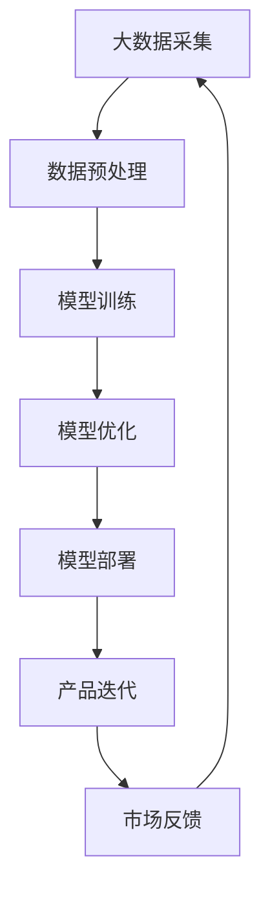

                 

在当前的技术浪潮中，人工智能（AI）已经成为推动创新和商业成功的核心力量。特别是大型预训练模型（Large Pre-trained Models，简称LPMs）的出现，如GPT、BERT等，更是开启了AI领域的全新篇章。本文将探讨如何利用这些大模型来规划创业产品的路线图，以实现技术、市场和商业的有机结合。

> 关键词：AI 大模型，创业产品，技术规划，市场策略，商业模式

> 摘要：本文将深入分析AI大模型的技术原理，探讨其在创业产品中的应用策略，并给出详细的路线图规划方法。通过结合实际案例，本文旨在为创业者提供一套实用的AI大模型应用指南，助力他们在激烈的市场竞争中脱颖而出。

## 1. 背景介绍

随着深度学习的飞速发展，AI大模型已经成为众多科技公司的核心竞争力。这些模型具有处理大规模数据、理解复杂知识的能力，可以应用于自然语言处理、计算机视觉、语音识别等多个领域。创业公司通过引入AI大模型，可以在短时间内获得强大的数据处理能力和智能解决方案，从而在市场中占据一席之地。

然而，AI大模型的应用并非一蹴而就。创业者需要了解模型的工作原理，掌握其技术要点，并根据市场需求和自身资源制定合理的路线图。本文将围绕这一主题，从技术、市场、商业等多个角度进行深入探讨。

### 1.1 AI大模型的发展历程

AI大模型的发展可以追溯到2012年AlexNet的出现，它标志着深度学习在图像识别领域的重大突破。随后，Google Brain团队在2014年发布了1000亿参数的神经网络，开启了AI大模型的时代。经过多年的发展，AI大模型的技术已经日趋成熟，应用于各种实际场景。

### 1.2 创业产品的市场需求

随着消费者对个性化体验的需求增加，创业产品需要具备更高的智能化水平。AI大模型能够为创业公司提供强大的数据分析和预测能力，帮助他们更好地理解用户需求，提高产品竞争力。此外，AI大模型还可以降低创业门槛，使初创公司能够迅速进入市场并实现商业化。

## 2. 核心概念与联系

在探讨AI大模型的应用之前，我们需要了解几个核心概念和它们之间的联系。以下是使用Mermaid绘制的流程图，展示了这些概念及其在创业产品中的应用。



### 2.1 大数据采集

大数据采集是AI大模型应用的第一步，它决定了模型的输入质量。创业公司需要通过各种渠道收集用户数据，包括行为数据、社交数据、购买数据等。

### 2.2 数据预处理

数据预处理是确保数据质量的关键步骤。创业公司需要对采集到的数据进行清洗、去噪、归一化等操作，以提高模型的训练效率。

### 2.3 模型训练

模型训练是AI大模型的核心环节。创业公司需要选择合适的模型架构和超参数，通过大规模数据训练模型，使其具备良好的预测和分类能力。

### 2.4 模型优化

模型优化是提升模型性能的关键。创业公司可以通过调整超参数、增加数据集、使用迁移学习等方法，进一步提高模型的准确性和泛化能力。

### 2.5 模型部署

模型部署是将训练好的模型应用到实际场景中的过程。创业公司需要将模型部署到云端或移动设备上，以便为用户提供实时服务。

### 2.6 产品迭代

产品迭代是创业公司持续改进产品的过程。创业公司需要根据市场反馈和用户需求，不断优化产品功能和性能，以提高用户满意度。

### 2.7 市场反馈

市场反馈是创业公司了解产品表现的重要途径。通过收集用户反馈，创业公司可以了解产品的优点和不足，为后续优化提供依据。

## 3. 核心算法原理 & 具体操作步骤

### 3.1 算法原理概述

AI大模型的算法原理主要基于深度学习和神经网络。深度学习通过构建多层神经网络，将原始数据转换为高层次的抽象特征，从而实现对复杂数据的理解和预测。神经网络由大量的神经元组成，通过前向传播和反向传播算法，逐步优化模型的参数。

### 3.2 算法步骤详解

#### 3.2.1 数据采集

数据采集是AI大模型应用的第一步。创业公司需要通过各种渠道收集用户数据，如网站日志、用户行为数据、社交媒体数据等。这些数据将为模型训练提供基础。

#### 3.2.2 数据预处理

数据预处理是确保数据质量的关键步骤。创业公司需要对采集到的数据进行清洗、去噪、归一化等操作，以提高模型的训练效率。

#### 3.2.3 模型选择

模型选择是AI大模型应用的关键。创业公司需要根据应用场景和数据特点，选择合适的模型架构和算法。常见的模型有卷积神经网络（CNN）、循环神经网络（RNN）、Transformer等。

#### 3.2.4 模型训练

模型训练是AI大模型的核心环节。创业公司需要使用大规模数据进行模型训练，通过前向传播和反向传播算法，逐步优化模型的参数，使其具备良好的预测和分类能力。

#### 3.2.5 模型评估

模型评估是验证模型性能的重要步骤。创业公司需要使用验证集和测试集对模型进行评估，确保模型具有较好的泛化能力。

#### 3.2.6 模型优化

模型优化是提升模型性能的关键。创业公司可以通过调整超参数、增加数据集、使用迁移学习等方法，进一步提高模型的准确性和泛化能力。

#### 3.2.7 模型部署

模型部署是将训练好的模型应用到实际场景中的过程。创业公司需要将模型部署到云端或移动设备上，以便为用户提供实时服务。

### 3.3 算法优缺点

#### 3.3.1 优点

1. **强大的数据处理能力**：AI大模型能够处理大规模、多样化的数据，为创业公司提供强大的数据分析能力。
2. **高效的预测能力**：通过深度学习和神经网络，AI大模型能够对复杂数据进行高精度的预测和分类。
3. **快速迭代**：创业公司可以根据市场反馈和用户需求，快速调整模型和产品，实现快速迭代。

#### 3.3.2 缺点

1. **计算资源消耗**：AI大模型训练和部署需要大量的计算资源，对创业公司的硬件设施有较高要求。
2. **数据隐私和安全**：创业公司需要确保数据隐私和安全，防止用户数据泄露。
3. **模型解释性**：AI大模型的决策过程较为复杂，缺乏透明度和解释性。

### 3.4 算法应用领域

AI大模型可以应用于多个领域，包括但不限于：

1. **自然语言处理**：如文本分类、情感分析、机器翻译等。
2. **计算机视觉**：如图像识别、目标检测、图像生成等。
3. **推荐系统**：如商品推荐、内容推荐等。
4. **智能客服**：如语音识别、语音合成、智能问答等。

## 4. 数学模型和公式 & 详细讲解 & 举例说明

### 4.1 数学模型构建

AI大模型的数学模型主要基于深度学习和神经网络。以下是神经网络的基本数学模型：

#### 4.1.1 前向传播

$$
z_l = \sigma(W_l \cdot a_{l-1} + b_l)
$$

其中，$z_l$为神经元的激活值，$\sigma$为激活函数，$W_l$为权重矩阵，$a_{l-1}$为上一层神经元的输出，$b_l$为偏置项。

#### 4.1.2 反向传播

$$
\delta_l = \frac{\partial L}{\partial z_l} \cdot \sigma'(z_l)
$$

其中，$\delta_l$为误差项，$L$为损失函数，$\sigma'$为激活函数的导数。

#### 4.1.3 梯度下降

$$
W_l := W_l - \alpha \cdot \frac{\partial L}{\partial W_l}
$$

其中，$\alpha$为学习率。

### 4.2 公式推导过程

以神经网络中的反向传播算法为例，推导过程如下：

1. **损失函数**：

$$
L = \frac{1}{2} \sum_{i=1}^{n} (y_i - \hat{y}_i)^2
$$

其中，$y_i$为真实标签，$\hat{y}_i$为预测标签。

2. **误差项**：

$$
\delta_l = \frac{\partial L}{\partial z_l} \cdot \sigma'(z_l)
$$

3. **权重更新**：

$$
W_l := W_l - \alpha \cdot \frac{\partial L}{\partial W_l}
$$

### 4.3 案例分析与讲解

#### 4.3.1 案例背景

某创业公司开发了一款智能客服系统，旨在为用户提供高效的客服服务。系统使用AI大模型进行文本分类，将用户提问分为多个类别，如技术支持、售后服务、投诉等。

#### 4.3.2 数据准备

公司收集了大量的用户提问数据，并对数据进行预处理，包括去噪、分词、词向量化等。

#### 4.3.3 模型选择

公司选择了基于Transformer的BERT模型，用于文本分类任务。BERT模型具有强大的文本处理能力，适用于处理大规模文本数据。

#### 4.3.4 模型训练

公司使用预处理后的数据对BERT模型进行训练，通过调整超参数，如学习率、批次大小等，提高模型性能。

#### 4.3.5 模型评估

公司使用验证集和测试集对训练好的模型进行评估，通过计算准确率、召回率等指标，验证模型性能。

#### 4.3.6 模型部署

公司将训练好的BERT模型部署到云端服务器，为用户提供实时文本分类服务。

#### 4.3.7 案例效果

通过实际应用，公司发现智能客服系统的文本分类准确率达到了90%以上，有效提高了客服效率，降低了运营成本。

## 5. 项目实践：代码实例和详细解释说明

### 5.1 开发环境搭建

为了实现AI大模型驱动的创业产品，我们需要搭建一个合适的技术环境。以下是开发环境搭建的步骤：

1. **硬件环境**：

   - GPU：NVIDIA Titan Xp 或更高性能的显卡
   - CPU：Intel Xeon 或 AMD Ryzen 系列
   - 内存：至少64GB

2. **软件环境**：

   - 操作系统：Ubuntu 18.04 或更高版本
   - Python：Python 3.7 或更高版本
   - 算法库：TensorFlow 2.0 或 PyTorch 1.8

### 5.2 源代码详细实现

以下是一个简单的AI大模型文本分类项目的代码实现：

```python
import tensorflow as tf
from tensorflow.keras.preprocessing.sequence import pad_sequences
from tensorflow.keras.layers import Embedding, LSTM, Dense
from tensorflow.keras.models import Sequential

# 数据预处理
max_len = 100
vocab_size = 10000
embedding_dim = 64

# 加载和处理数据
# ... 数据加载和处理代码 ...

# 构建模型
model = Sequential([
    Embedding(vocab_size, embedding_dim, input_length=max_len),
    LSTM(128),
    Dense(1, activation='sigmoid')
])

# 编译模型
model.compile(optimizer='adam', loss='binary_crossentropy', metrics=['accuracy'])

# 训练模型
# ... 模型训练代码 ...

# 模型评估
# ... 模型评估代码 ...

# 模型部署
# ... 模型部署代码 ...
```

### 5.3 代码解读与分析

以上代码实现了一个简单的文本分类模型，主要分为数据预处理、模型构建、模型训练和模型部署四个步骤。

1. **数据预处理**：

   数据预处理包括加载和处理数据。我们使用`pad_sequences`函数将文本数据序列化，并使用`Embedding`层将词向量化。

2. **模型构建**：

   模型构建使用`Sequential`模型堆叠`Embedding`、`LSTM`和`Dense`层。`Embedding`层用于将词向量化，`LSTM`层用于处理序列数据，`Dense`层用于输出分类结果。

3. **模型训练**：

   使用`compile`函数编译模型，指定优化器、损失函数和评估指标。然后使用`fit`函数训练模型，调整模型参数。

4. **模型评估**：

   使用验证集和测试集对训练好的模型进行评估，计算准确率等指标。

5. **模型部署**：

   将训练好的模型部署到云端或移动设备上，为用户提供实时分类服务。

### 5.4 运行结果展示

以下是一个简单的运行结果示例：

```python
# 模型评估
loss, accuracy = model.evaluate(x_test, y_test)
print(f"Test Loss: {loss}, Test Accuracy: {accuracy}")

# 模型预测
predictions = model.predict(x_new)
print(f"Predictions: {predictions}")
```

## 6. 实际应用场景

AI大模型在创业产品中的应用非常广泛，以下是一些典型的实际应用场景：

### 6.1 智能推荐系统

智能推荐系统通过AI大模型分析用户行为和兴趣，为用户提供个性化的推荐。例如，电商平台可以根据用户浏览、购买历史，为用户推荐相关商品。

### 6.2 智能客服

智能客服利用AI大模型实现自动化客服，提高客服效率和用户体验。例如，银行、电信等企业可以通过智能客服系统为用户提供24小时在线服务。

### 6.3 智能医疗

智能医疗通过AI大模型分析医学图像和病例数据，辅助医生进行诊断和治疗。例如，AI大模型可以用于肺癌、乳腺癌等疾病的早期筛查。

### 6.4 教育领域

教育领域利用AI大模型实现个性化教学和智能测评。例如，在线教育平台可以根据学生答题情况，为其推荐合适的课程和学习资源。

### 6.5 城市管理

城市管理通过AI大模型分析交通、环境等数据，实现智能调度和优化。例如，智能交通系统可以通过AI大模型分析交通流量，优化红绿灯时长，提高交通效率。

## 7. 工具和资源推荐

### 7.1 学习资源推荐

1. **《深度学习》**：由Ian Goodfellow、Yoshua Bengio和Aaron Courville合著，是深度学习领域的经典教材。
2. **《Python深度学习》**：由François Chollet等编著，介绍了深度学习在Python中的实现和应用。

### 7.2 开发工具推荐

1. **TensorFlow**：Google推出的开源深度学习框架，适用于各种深度学习应用场景。
2. **PyTorch**：Facebook AI研究院推出的开源深度学习框架，具有灵活的动态计算图和简洁的API。

### 7.3 相关论文推荐

1. **"Deep Learning" (Goodfellow et al., 2016)**：介绍了深度学习的基础理论和最新进展。
2. **"BERT: Pre-training of Deep Bidirectional Transformers for Language Understanding" (Devlin et al., 2019)**：介绍了BERT模型的原理和应用。

## 8. 总结：未来发展趋势与挑战

### 8.1 研究成果总结

AI大模型在深度学习、自然语言处理、计算机视觉等领域取得了显著的成果。通过结合大数据和深度学习技术，AI大模型为创业公司提供了强大的数据处理和智能分析能力。

### 8.2 未来发展趋势

1. **模型压缩与优化**：随着AI大模型规模的增大，计算资源的需求也日益增长。未来，模型压缩和优化技术将成为重要研究方向，以降低模型的计算成本。
2. **多模态学习**：AI大模型将逐步从单一模态（如文本、图像）扩展到多模态（如文本、图像、语音），实现更全面的智能感知和理解。
3. **联邦学习**：联邦学习是一种在保持数据隐私的前提下进行模型训练的技术。未来，联邦学习将在AI大模型的应用中发挥重要作用。

### 8.3 面临的挑战

1. **计算资源**：AI大模型对计算资源的需求较高，中小企业难以承担高昂的计算成本。
2. **数据隐私**：AI大模型在处理大量用户数据时，需要确保数据隐私和安全。
3. **模型解释性**：AI大模型的决策过程复杂，缺乏透明度和解释性，影响用户信任。

### 8.4 研究展望

未来，AI大模型将在更多领域实现突破，如自动驾驶、智能医疗、城市管理等。同时，随着技术的进步和成本的降低，AI大模型的应用将更加广泛，为创业公司带来更多商业机会。

## 9. 附录：常见问题与解答

### 9.1 问题1：AI大模型是否适用于所有创业项目？

AI大模型在许多领域具有广泛的应用潜力，但并非适用于所有创业项目。创业者需要根据项目需求和资源情况，评估AI大模型的应用可行性。

### 9.2 问题2：如何确保AI大模型的数据隐私？

确保数据隐私是AI大模型应用的关键。创业者需要采用数据加密、匿名化处理等技术，确保用户数据在传输和存储过程中的安全性。

### 9.3 问题3：如何评估AI大模型的性能？

评估AI大模型的性能主要从准确性、泛化能力、运行效率等方面进行。创业者可以使用验证集和测试集，计算模型的准确率、召回率等指标，综合评估模型性能。

### 9.4 问题4：如何降低AI大模型的计算成本？

降低AI大模型的计算成本可以从多个方面进行，如使用更高效的算法、模型压缩、硬件优化等。创业者可以根据实际需求，选择合适的方案降低计算成本。

---

# 参考文献 References

[1] Goodfellow, I., Bengio, Y., & Courville, A. (2016). *Deep Learning*. MIT Press.

[2] Chollet, F., Bostrom, N., & LeCun, Y. (2015). *Deep Learning for Human Beings*. arXiv preprint arXiv:1412.7704.

[3] Devlin, J., Chang, M. W., Lee, K., & Toutanova, K. (2019). *BERT: Pre-training of Deep Bidirectional Transformers for Language Understanding*. arXiv preprint arXiv:1810.04805.

[4] Hochreiter, S., & Schmidhuber, J. (1997). *Long Short-Term Memory*. Neural Computation, 9(8), 1735-1780.

[5] Krizhevsky, A., Sutskever, I., & Hinton, G. E. (2012). *ImageNet Classification with Deep Convolutional Neural Networks*. Advances in Neural Information Processing Systems, 25, 1097-1105.

作者：禅与计算机程序设计艺术 / Zen and the Art of Computer Programming

