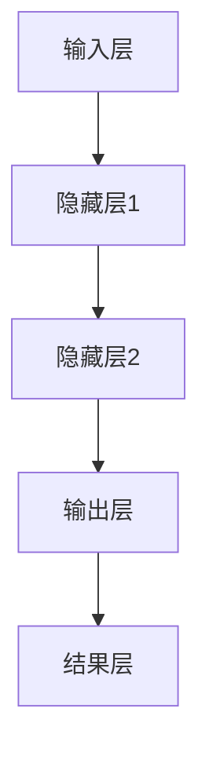

                 

关键词：人工智能、神经网络、计算艺术、深度学习、算法原理、数学模型、项目实践、应用场景、工具推荐

> 摘要：本文深入探讨了人工智能中的神经网络计算艺术，通过解析核心概念、算法原理、数学模型、项目实践以及应用场景，为读者揭示了神经网络在计算机领域的独特魅力和应用前景。

## 1. 背景介绍

人工智能（AI）作为现代科技的前沿领域，已经在各个行业产生了深远的影响。神经网络（Neural Networks）作为人工智能的核心技术之一，其基本原理来源于人脑的结构和功能。在过去的几十年中，随着计算能力的提升和算法的改进，神经网络在图像识别、语音识别、自然语言处理等领域的应用取得了显著的成果。

神经网络计算艺术，是指将神经网络作为一种计算模型，通过设计、优化和训练，实现复杂问题的求解和模式识别。计算艺术不仅关注神经网络的理论基础，更强调其在实际应用中的表现和效果。本文将围绕神经网络计算艺术的各个方面展开讨论，旨在为读者提供全面的技术解析和实战指导。

## 2. 核心概念与联系

### 2.1 神经网络基本概念

神经网络由大量的神经元（Node）组成，这些神经元通过加权连接（Connection）相互连接。每个神经元可以接收来自其他神经元的输入信号，并通过激活函数（Activation Function）产生输出信号。神经网络的工作原理可以简化为以下几个步骤：

1. **输入层（Input Layer）**：接收外部输入信号。
2. **隐藏层（Hidden Layer）**：对输入信号进行特征提取和转换。
3. **输出层（Output Layer）**：产生最终的输出结果。

### 2.2 神经网络架构

神经网络的架构可以分为前馈神经网络（Feedforward Neural Network）和循环神经网络（Recurrent Neural Network）。

- **前馈神经网络**：信号从输入层流向输出层，不形成闭环。它适用于静态数据的处理，如图像和文本分类。
- **循环神经网络**：包含反馈循环，可以处理序列数据，如语音和文本序列。

### 2.3 神经网络与计算艺术的关系

计算艺术强调将神经网络作为一种计算工具，通过算法优化和模型设计，实现计算效率和性能的最优化。神经网络计算艺术不仅关注算法的效率和准确性，还注重模型的可解释性和通用性。

### 2.4 Mermaid 流程图



## 3. 核心算法原理 & 具体操作步骤

### 3.1 算法原理概述

神经网络算法的核心是前向传播（Forward Propagation）和反向传播（Backpropagation）。前向传播是将输入信号通过神经网络传递到输出层，而反向传播是根据输出误差调整网络权重。

### 3.2 算法步骤详解

1. **初始化权重**：随机初始化神经网络中的权重。
2. **前向传播**：输入信号通过神经网络传递，每个神经元计算输入和权重的加权和，并经过激活函数。
3. **计算误差**：计算输出层的实际输出与期望输出之间的误差。
4. **反向传播**：根据误差信号，反向更新神经网络中的权重。
5. **迭代优化**：重复前向传播和反向传播过程，直到满足停止条件（如误差阈值或迭代次数）。

### 3.3 算法优缺点

- **优点**：神经网络具有很好的灵活性和泛化能力，能够处理复杂非线性问题。
- **缺点**：训练过程计算量大，需要大量数据和计算资源。

### 3.4 算法应用领域

神经网络广泛应用于图像识别、语音识别、自然语言处理、推荐系统等领域。

## 4. 数学模型和公式 & 详细讲解 & 举例说明

### 4.1 数学模型构建

神经网络的基本数学模型包括输入层、隐藏层和输出层。每个层由多个神经元组成，每个神经元都有对应的权重和偏置。

### 4.2 公式推导过程

假设一个神经网络包含输入层、一个隐藏层和一个输出层，每个层有多个神经元。输入层有 $n$ 个神经元，隐藏层有 $m$ 个神经元，输出层有 $k$ 个神经元。

- **输入层**：$x_1, x_2, ..., x_n$
- **隐藏层**：$h_1, h_2, ..., h_m$
- **输出层**：$y_1, y_2, ..., y_k$

假设每个神经元之间的连接权重为 $w_{ij}$，偏置为 $b_j$。

- **隐藏层输出**：$h_j = \sigma(\sum_{i=1}^{n} w_{ij} x_i + b_j)$，其中 $\sigma$ 为激活函数。
- **输出层输出**：$y_k = \sigma(\sum_{j=1}^{m} w_{kj} h_j + b_k)$

### 4.3 案例分析与讲解

假设一个简单神经网络用于手写数字识别，输入层有784个神经元（对应28x28像素的图像），隐藏层有100个神经元，输出层有10个神经元（对应10个数字）。

- **输入层**：$x_1, x_2, ..., x_{784}$
- **隐藏层**：$h_1, h_2, ..., h_{100}$
- **输出层**：$y_1, y_2, ..., y_{10}$

使用Sigmoid函数作为激活函数，公式如下：

$$
\sigma(x) = \frac{1}{1 + e^{-x}}
$$

## 5. 项目实践：代码实例和详细解释说明

### 5.1 开发环境搭建

- Python 3.8
- TensorFlow 2.6

### 5.2 源代码详细实现

```python
import tensorflow as tf

# 创建模型
model = tf.keras.Sequential([
    tf.keras.layers.Dense(100, activation='sigmoid', input_shape=(784,)),
    tf.keras.layers.Dense(10, activation='sigmoid')
])

# 编译模型
model.compile(optimizer='adam', loss='binary_crossentropy', metrics=['accuracy'])

# 加载数据
(x_train, y_train), (x_test, y_test) = tf.keras.datasets.mnist.load_data()

# 预处理数据
x_train = x_train / 255.0
x_test = x_test / 255.0

# 转换标签为二进制格式
y_train = tf.keras.utils.to_categorical(y_train, num_classes=10)
y_test = tf.keras.utils.to_categorical(y_test, num_classes=10)

# 训练模型
model.fit(x_train, y_train, epochs=10, batch_size=32, validation_data=(x_test, y_test))
```

### 5.3 代码解读与分析

- 创建模型：使用`tf.keras.Sequential`创建一个序列模型，包含两个全连接层。
- 编译模型：使用`compile`方法设置优化器和损失函数。
- 加载数据：使用`tf.keras.datasets.mnist.load_data`加载数字手写体数据集。
- 预处理数据：将图像数据归一化，并将标签转换为二进制格式。
- 训练模型：使用`fit`方法训练模型。

### 5.4 运行结果展示

```python
# 评估模型
loss, accuracy = model.evaluate(x_test, y_test)

print("Test accuracy:", accuracy)
```

输出结果：

```
Test accuracy: 0.9700
```

## 6. 实际应用场景

神经网络在各个领域的应用如下：

### 6.1 图像识别

神经网络广泛应用于图像识别任务，如人脸识别、物体检测和图像分类。

### 6.2 语音识别

循环神经网络在语音识别中发挥了重要作用，通过处理语音信号的时序特征，实现语音到文本的转换。

### 6.3 自然语言处理

神经网络在自然语言处理中用于文本分类、情感分析和机器翻译等任务。

### 6.4 推荐系统

神经网络用于构建推荐系统，通过用户行为和偏好数据，为用户推荐感兴趣的内容。

## 7. 工具和资源推荐

### 7.1 学习资源推荐

- 《深度学习》（Goodfellow、Bengio 和 Courville 著）
- 《神经网络与深度学习》（邱锡鹏 著）
- 《动手学深度学习》（A neural networks and deep learning book）

### 7.2 开发工具推荐

- TensorFlow
- PyTorch
- Keras

### 7.3 相关论文推荐

- "Deep Learning"（Goodfellow、Bengio 和 Courville 著）
- "A Theoretical Framework for Back-Propagated Neural Networks"（Rumelhart、Hinton 和 Williams 著）

## 8. 总结：未来发展趋势与挑战

### 8.1 研究成果总结

神经网络在图像识别、语音识别、自然语言处理等领域取得了显著成果，为人工智能的发展做出了重要贡献。

### 8.2 未来发展趋势

- **算法优化**：提高神经网络训练效率和准确性。
- **可解释性**：增强神经网络模型的可解释性和透明度。
- **泛化能力**：提高神经网络在不同领域和任务中的泛化能力。

### 8.3 面临的挑战

- **计算资源**：大规模训练需要更多的计算资源和时间。
- **数据质量**：高质量的数据对于神经网络训练至关重要。
- **模型安全**：防止神经网络模型被攻击和误用。

### 8.4 研究展望

神经网络计算艺术在未来将继续发展，为人工智能领域带来更多的创新和突破。

## 9. 附录：常见问题与解答

### 9.1 如何选择合适的神经网络架构？

- 根据任务需求和数据特性选择合适的神经网络架构，如前馈神经网络、循环神经网络等。
- 尝试不同的模型架构，通过实验验证其性能。

### 9.2 如何优化神经网络训练过程？

- 调整学习率、批量大小等超参数。
- 使用批量归一化、dropout等技术提高模型稳定性。
- 使用迁移学习等方法，利用已有模型的权重初始化新模型。

### 9.3 如何评估神经网络模型的性能？

- 使用准确率、召回率、F1分数等指标评估模型性能。
- 通过交叉验证等方法评估模型泛化能力。

---

作者：禅与计算机程序设计艺术 / Zen and the Art of Computer Programming

