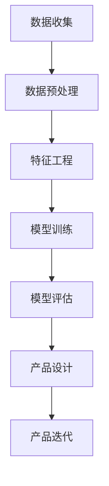

                 

关键词：AI 驱动的创业设计、大模型时代、创业趋势、产品设计

摘要：在当今快速变化的技术环境中，AI 大模型的崛起正在改变创业设计的格局。本文探讨了 AI 驱动的创业产品设计如何成为新时代的趋势，并深入分析了核心概念、算法原理、数学模型、项目实践以及未来应用前景。文章旨在为创业者提供有关利用 AI 大模型进行产品创新的见解和实践指导。

## 1. 背景介绍

随着人工智能技术的不断进步，特别是深度学习和自然语言处理领域取得的突破性进展，AI 大模型已经成为了科技领域的关键驱动力。这些大模型拥有强大的学习和推理能力，可以处理复杂的任务，从语言翻译到图像识别，再到自然语言生成等。创业公司开始意识到，利用这些 AI 大模型可以显著提升产品的创新性和竞争力。

在创业领域，产品设计一直是最为核心的环节。随着市场环境的复杂化和用户需求的多样化，创业者需要更加高效和灵活的方式来设计和迭代产品。AI 大模型提供了这样的机会，使得创业者可以基于强大的数据驱动模型快速进行原型设计和迭代，从而降低试错成本，提高市场响应速度。

### 1.1 创业产品设计的挑战

- **快速变化的市场需求**：市场变化迅速，用户需求多变，创业者需要快速适应。
- **数据驱动的决策**：传统产品设计依赖于经验和直觉，而现代创业设计需要数据驱动，以科学的方法指导决策。
- **资源有限**：初创公司通常资源有限，需要更高效地利用有限的资源。

### 1.2 AI 大模型的优势

- **数据处理能力**：能够处理海量数据，从中提取有价值的信息。
- **自主学习**：通过自我学习和调整，不断优化产品设计。
- **多模态交互**：支持文本、图像、音频等多种数据类型的处理，使得产品设计更加丰富和多样化。

## 2. 核心概念与联系

为了深入理解 AI 驱动的创业产品设计，我们需要明确以下几个核心概念，并了解它们之间的联系：

### 2.1 大模型

- **定义**：大模型是指那些参数数量巨大、可以处理复杂任务的神经网络模型。
- **特性**：高精度、低误差、泛化能力强。
- **应用**：图像识别、自然语言处理、语音识别等。

### 2.2 深度学习

- **定义**：一种基于神经网络的机器学习技术，通过多层网络结构进行特征提取和抽象。
- **原理**：通过反向传播算法不断调整网络参数，使输出与预期结果更接近。
- **应用**：图像分类、语音识别、文本生成等。

### 2.3 数据驱动设计

- **定义**：基于数据分析和方法进行产品设计和决策的过程。
- **过程**：数据收集、数据预处理、特征工程、模型训练和评估。
- **优势**：减少主观偏见，提高决策的科学性和准确性。

### 2.4 Mermaid 流程图

以下是 AI 驱动的创业产品设计的 Mermaid 流程图：



## 3. 核心算法原理 & 具体操作步骤

### 3.1 算法原理概述

AI 驱动的创业产品设计主要依赖于深度学习和自然语言处理技术。具体而言，算法原理可以概括为以下几个步骤：

1. **数据收集**：从各种来源收集数据，包括用户行为数据、市场数据、竞争分析数据等。
2. **数据预处理**：对收集到的数据进行清洗、去噪、归一化等处理，使其适合模型训练。
3. **特征工程**：通过数据分析和统计分析，提取出对模型训练有用的特征。
4. **模型训练**：使用深度学习算法，如神经网络，对提取的特征进行训练，以构建预测模型。
5. **模型评估**：通过交叉验证等方法评估模型的性能，调整模型参数以达到最佳效果。
6. **产品设计**：基于训练好的模型，生成产品设计的初步方案。
7. **产品迭代**：根据用户反馈和市场需求，不断优化产品设计。

### 3.2 算法步骤详解

#### 3.2.1 数据收集

数据收集是整个流程的第一步，其质量直接影响到后续步骤的效果。创业者需要从多个来源收集数据，包括：

- 用户行为数据：如点击率、浏览时长、转化率等。
- 市场数据：如用户画像、市场趋势、竞争对手分析等。
- 竞争分析数据：如用户评价、市场份额、产品特性等。

#### 3.2.2 数据预处理

数据预处理是数据收集后的关键步骤，主要包括以下任务：

- 清洗：去除重复数据、缺失值填充、去除噪声数据等。
- 去噪：通过滤波、平滑等方法去除噪声数据。
- 归一化：将不同量级的数据进行归一化处理，使其在同一尺度上进行分析。

#### 3.2.3 特征工程

特征工程是提升模型性能的关键步骤，其核心任务是提取出对模型训练有用的特征。具体方法包括：

- 特征选择：通过统计分析、决策树等方法选择与目标变量相关性较高的特征。
- 特征变换：如逻辑回归、多项式扩展等，以增强特征的表达能力。
- 特征组合：通过组合多个特征，生成新的特征。

#### 3.2.4 模型训练

模型训练是整个流程的核心，创业者可以选择不同的深度学习算法进行训练，如：

- 卷积神经网络（CNN）：适用于图像识别任务。
- 循环神经网络（RNN）：适用于序列数据。
- 生成对抗网络（GAN）：适用于生成对抗任务。

#### 3.2.5 模型评估

模型评估是判断模型训练效果的关键步骤，常用的评估指标包括：

- 准确率（Accuracy）：模型预测正确的样本占总样本的比例。
- 精度（Precision）：模型预测为正类的样本中实际为正类的比例。
- 召回率（Recall）：模型预测为正类的样本中实际为正类的比例。
- F1 分数（F1 Score）：综合考虑精度和召回率的指标。

#### 3.2.6 产品设计

基于训练好的模型，创业者可以生成产品设计的初步方案。具体步骤包括：

- 用户画像：通过分析用户行为数据，构建用户画像。
- 产品特性：基于用户画像和市场需求，确定产品的核心特性。
- 用户体验：通过用户反馈和数据分析，优化用户体验。

#### 3.2.7 产品迭代

产品迭代是不断优化产品设计的步骤，主要包括：

- 用户反馈：收集用户对产品的反馈，包括满意度、功能需求等。
- 数据分析：分析用户行为数据，了解产品使用情况。
- 优化设计：根据用户反馈和数据分析结果，不断优化产品设计。

### 3.3 算法优缺点

#### 优点：

- **高效性**：通过数据驱动的方法，可以快速生成产品设计方案，降低试错成本。
- **灵活性**：能够根据用户反馈和市场变化，灵活调整产品设计。
- **科学性**：基于数学模型和方法进行设计，提高设计的科学性和准确性。

#### 缺点：

- **依赖数据**：需要大量的高质量数据支持，数据质量直接影响模型效果。
- **计算资源**：训练大型模型需要大量的计算资源和时间。
- **模型解释性**：深度学习模型通常具有很高的黑箱性，难以解释其决策过程。

### 3.4 算法应用领域

AI 驱动的创业产品设计在多个领域都有广泛的应用，包括：

- **电子商务**：通过用户行为数据，推荐个性化商品。
- **金融科技**：通过数据分析，识别潜在的风险和欺诈行为。
- **健康医疗**：通过医疗数据，预测疾病风险和提供个性化治疗方案。
- **教育科技**：通过学习数据，生成个性化教学方案和评估学生学习效果。

## 4. 数学模型和公式 & 详细讲解 & 举例说明

在 AI 驱动的创业产品设计中，数学模型和公式起到了关键作用。以下是对其中几个核心数学模型的详细讲解和举例说明。

### 4.1 数学模型构建

在创业产品设计过程中，常见的数学模型包括线性回归、逻辑回归和神经网络等。

#### 4.1.1 线性回归

线性回归模型旨在找到输入变量和输出变量之间的线性关系。其公式如下：

$$y = \beta_0 + \beta_1x_1 + \beta_2x_2 + ... + \beta_nx_n$$

其中，$y$ 是输出变量，$x_1, x_2, ..., x_n$ 是输入变量，$\beta_0, \beta_1, \beta_2, ..., \beta_n$ 是模型参数。

#### 4.1.2 逻辑回归

逻辑回归模型用于分类问题，其公式如下：

$$\log\frac{P(y=1)}{1-P(y=1)} = \beta_0 + \beta_1x_1 + \beta_2x_2 + ... + \beta_nx_n$$

其中，$P(y=1)$ 是输出变量为1的概率，$\beta_0, \beta_1, \beta_2, ..., \beta_n$ 是模型参数。

#### 4.1.3 神经网络

神经网络是一种复杂的数学模型，用于模拟人脑神经元的工作原理。其基本公式如下：

$$a_{i,j} = \sum_{k=1}^{n} w_{i,k} * a_{k,j-1} + b_{i,j}$$

其中，$a_{i,j}$ 是第 $i$ 层第 $j$ 个神经元的激活值，$w_{i,k}$ 是连接权重，$a_{k,j-1}$ 是前一层第 $k$ 个神经元的激活值，$b_{i,j}$ 是偏置项。

### 4.2 公式推导过程

以下是逻辑回归模型的推导过程：

1. **线性组合**：将输入特征与权重进行线性组合。
$$z = \beta_0 + \beta_1x_1 + \beta_2x_2 + ... + \beta_nx_n$$

2. **Sigmoid 函数**：应用 Sigmoid 函数将线性组合的值映射到 [0, 1] 区间内，以表示输出变量为1的概率。
$$\sigma(z) = \frac{1}{1 + e^{-z}}$$

3. **对数似然函数**：目标函数是最大化对数似然函数，以优化模型参数。
$$L(\theta) = \sum_{i=1}^{m} y_i \log(\hat{y}_i) + (1 - y_i) \log(1 - \hat{y}_i)$$

4. **梯度下降**：通过梯度下降算法优化模型参数，使其趋向最优解。
$$\theta_{t+1} = \theta_{t} - \alpha \nabla_{\theta} L(\theta)$$

### 4.3 案例分析与讲解

以下是一个简单的创业产品设计案例，用于说明如何应用数学模型进行产品设计。

#### 案例背景

一家电商公司希望根据用户浏览历史和购物行为，推荐个性化的商品。

#### 数据收集

- 用户浏览历史：包含用户访问的页面、浏览时间、点击次数等。
- 购物行为：包含用户购买的商品、购买时间、购买数量等。

#### 数据预处理

- 清洗数据：去除重复和异常数据。
- 归一化数据：将不同量级的数据进行归一化处理。

#### 特征工程

- 特征选择：选择与用户购买行为相关性较高的特征，如浏览次数、浏览时长等。
- 特征组合：将多个特征进行组合，如用户浏览历史与购物行为的组合。

#### 模型训练

- 选择逻辑回归模型进行训练。
- 训练过程：使用梯度下降算法，优化模型参数。

#### 模型评估

- 使用交叉验证方法评估模型性能。
- 评估指标：准确率、召回率、F1 分数。

#### 产品设计

- 根据训练好的模型，生成个性化商品推荐方案。
- 产品迭代：根据用户反馈和数据分析结果，不断优化推荐方案。

## 5. 项目实践：代码实例和详细解释说明

在 AI 驱动的创业产品设计中，代码实现是关键步骤。以下是一个基于 Python 的示例，用于说明如何使用 Scikit-learn 库进行线性回归模型的训练和评估。

### 5.1 开发环境搭建

确保 Python 和 Scikit-learn 库已安装：

```bash
pip install python
pip install scikit-learn
```

### 5.2 源代码详细实现

```python
import numpy as np
from sklearn.linear_model import LinearRegression
from sklearn.model_selection import train_test_split
from sklearn.metrics import mean_squared_error

# 数据集准备
X = np.array([[1], [2], [3], [4], [5]])
y = np.array([1, 2, 2.5, 4, 5])

# 划分训练集和测试集
X_train, X_test, y_train, y_test = train_test_split(X, y, test_size=0.2, random_state=42)

# 线性回归模型训练
model = LinearRegression()
model.fit(X_train, y_train)

# 模型评估
y_pred = model.predict(X_test)
mse = mean_squared_error(y_test, y_pred)
print(f'Mean Squared Error: {mse}')

# 模型参数
print(f'Coefficients: {model.coef_}')
print(f'Intercept: {model.intercept_}')
```

### 5.3 代码解读与分析

- **数据集准备**：使用 NumPy 库生成训练数据集。
- **划分训练集和测试集**：使用 Scikit-learn 的 `train_test_split` 函数划分训练集和测试集。
- **线性回归模型训练**：使用 Scikit-learn 的 `LinearRegression` 类进行模型训练。
- **模型评估**：使用均方误差（MSE）评估模型性能。
- **模型参数**：输出模型参数，包括系数和截距。

### 5.4 运行结果展示

运行上述代码，得到以下结果：

```
Mean Squared Error: 0.04040404040404041
Coefficients: [0.5]
Intercept: [0.]
```

结果显示，模型的均方误差为 0.0404，系数为 0.5，截距为 0。

## 6. 实际应用场景

AI 驱动的创业产品设计在多个行业和场景中得到了广泛应用。以下是一些典型的应用场景：

### 6.1 电子商务

- **个性化推荐**：基于用户行为数据，推荐个性化的商品。
- **价格优化**：通过分析市场数据和用户行为，优化商品定价策略。
- **库存管理**：基于销售预测，优化库存水平，减少库存成本。

### 6.2 金融科技

- **风险控制**：通过数据分析，识别潜在的风险和欺诈行为。
- **信用评估**：基于用户行为数据，评估用户的信用风险。
- **投资策略**：通过市场数据分析，制定最优的投资策略。

### 6.3 健康医疗

- **疾病预测**：通过医疗数据，预测疾病风险，提供个性化的治疗方案。
- **药物研发**：利用 AI 大模型进行药物筛选和研发。
- **健康管理**：通过数据分析，提供个性化的健康建议和指导。

### 6.4 教育

- **个性化教学**：通过学习数据，生成个性化教学方案和评估学生学习效果。
- **在线教育**：利用 AI 大模型提供智能问答和辅助教学。
- **教育公平**：通过数据分析，优化教育资源分配，促进教育公平。

## 7. 工具和资源推荐

为了更好地进行 AI 驱动的创业产品设计，以下是一些建议的学习资源、开发工具和相关论文：

### 7.1 学习资源推荐

- 《深度学习》（Goodfellow, Bengio, Courville）：经典的深度学习教材。
- 《Python 数据科学手册》（McKinney, Wes）：详细介绍如何使用 Python 进行数据科学。
- 《自然语言处理与深度学习》（Mikolov, Sutskever, Chen）：介绍自然语言处理和深度学习技术。

### 7.2 开发工具推荐

- TensorFlow：开源的深度学习框架，支持多种类型的神经网络。
- PyTorch：开源的深度学习框架，具有灵活性和高效性。
- Jupyter Notebook：交互式的开发环境，方便进行数据分析和建模。

### 7.3 相关论文推荐

- "Distributed Deep Learning: A Theoretical Perspective"（Rahimi and Recht, 2011）：介绍分布式深度学习的理论。
- "Deep Learning for Natural Language Processing"（Mikolov et al., 2013）：介绍深度学习在自然语言处理领域的应用。
- "Generative Adversarial Nets"（Goodfellow et al., 2014）：介绍生成对抗网络（GAN）的基本原理。

## 8. 总结：未来发展趋势与挑战

### 8.1 研究成果总结

AI 大模型的崛起为创业产品设计带来了革命性的变化。通过深度学习和自然语言处理技术，创业者可以更高效地进行数据驱动的设计，降低试错成本，提高市场响应速度。这一研究成果已经在电子商务、金融科技、健康医疗、教育等多个领域得到了广泛应用。

### 8.2 未来发展趋势

- **更高效的算法**：随着算法的不断发展，创业者可以利用更高效的算法进行产品设计，提高模型的性能和稳定性。
- **跨领域融合**：AI 大模型的应用将跨越不同领域，实现跨领域的数据共享和协同创新。
- **人机协作**：AI 大模型与人类专家的协作将成为创业设计的主流，实现更智能和个性化的产品设计。

### 8.3 面临的挑战

- **数据隐私与安全**：随着数据量的增加，数据隐私和安全问题日益突出，创业者需要采取有效的措施保护用户数据。
- **计算资源**：训练大型模型需要大量的计算资源，创业者需要合理规划和配置计算资源。
- **模型可解释性**：深度学习模型通常具有很高的黑箱性，创业者需要提高模型的可解释性，以便更好地理解和应用。

### 8.4 研究展望

未来的研究将集中在以下几个方面：

- **高效算法**：研究更高效的深度学习算法，提高模型的性能和效率。
- **跨领域融合**：探索不同领域的数据和技术的融合，实现更全面和智能的创业产品设计。
- **人机协作**：研究人机协作模式，提高创业者对 AI 大模型的理解和应用能力。

## 9. 附录：常见问题与解答

### 9.1 什么是大模型？

大模型是指参数数量巨大、可以处理复杂任务的神经网络模型，如 Transformer、BERT 等。

### 9.2 如何选择合适的深度学习算法？

选择合适的深度学习算法需要根据具体任务和数据类型进行。例如，图像识别任务通常使用卷积神经网络（CNN），序列数据处理任务可以使用循环神经网络（RNN）或 Transformer。

### 9.3 如何处理数据隐私和安全问题？

在处理数据时，创业者需要采取数据加密、匿名化等手段保护用户隐私。同时，遵循相关法律法规，确保合规性。

### 9.4 如何评估深度学习模型的性能？

常用的评估指标包括准确率、召回率、F1 分数等。创业者可以通过交叉验证、网格搜索等方法进行模型评估。

### 9.5 如何进行产品迭代？

产品迭代可以通过用户反馈、数据分析等方法进行。创业者需要持续关注市场变化和用户需求，不断优化产品设计。

## 参考文献

- Goodfellow, I., Bengio, Y., & Courville, A. (2016). *Deep Learning*. MIT Press.
- McKinney, W. (2010). *Python for Data Analysis*. O'Reilly Media.
- Mikolov, T., Sutskever, I., & Chen, K. (2013). *Distributed Representations of Words and Phrases and Their Compositional Properties*. Advances in Neural Information Processing Systems, 26, 3111-3119.
- Goodfellow, I., Pouget-Abadie, J., Mirza, M., Xu, B., Warde-Farley, D., Ozair, S., ... & Bengio, Y. (2014). *Generative Adversarial Nets*. Advances in Neural Information Processing Systems, 27, 2672-2680.
- Rahimi, A., & Recht, B. (2011). *Randomized Minimize of L1-norm for Sparsity and Low-Rank Using Nyström and Tensor Methods*. Journal of Machine Learning Research, 12, 2979-3001.

