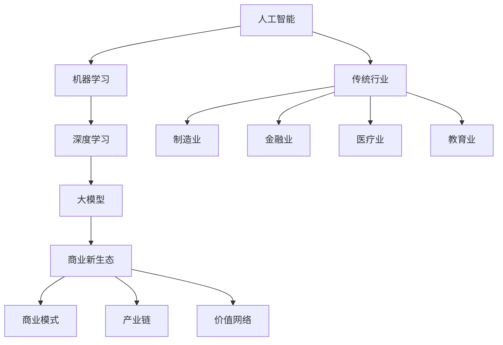

                 

关键词：人工智能，传统行业，大模型，商业新生态，数字化转型

> 摘要：本文探讨了人工智能技术如何与传统行业相结合，特别是大型机器学习模型的应用，如何重塑商业新生态。通过深入分析核心概念、算法原理、数学模型、项目实践及未来展望，文章旨在为读者提供全面的了解和深刻的洞察。

## 1. 背景介绍

随着全球数字化转型的加速，人工智能（AI）已经成为推动行业变革的重要力量。传统行业如制造、金融、医疗、教育等正逐渐接受并应用AI技术，以提升效率、降低成本、改善用户体验。特别是近年来，大型机器学习模型（如深度神经网络）的发展，使得AI在复杂任务上的表现越来越接近或超越人类水平。这一变革不仅改变了企业的运营模式，也重构了商业生态系统。

### 传统行业的挑战

传统行业在数字化转型过程中面临着诸多挑战：

1. **数据不足与质量低下**：许多传统行业缺乏结构化数据，且数据质量参差不齐，难以满足机器学习模型的需求。
2. **技术壁垒**：传统行业的IT基础设施可能不够先进，难以支持大规模的AI应用。
3. **人才短缺**：AI人才短缺是制约传统行业AI应用的主要瓶颈。

### 人工智能的优势

人工智能为传统行业带来了以下优势：

1. **数据处理能力**：AI能够高效处理和分析大量非结构化数据，提高决策的准确性和效率。
2. **自动化与优化**：AI可以自动化重复性工作，优化业务流程，降低运营成本。
3. **个性化服务**：AI技术可以根据用户行为数据提供个性化服务，提升用户体验。

## 2. 核心概念与联系

为了更好地理解AI与传统行业的结合，我们需要先了解一些核心概念和其相互联系。

### 2.1 人工智能

人工智能（AI）是指通过计算机程序实现人类智能活动的技术。它包括机器学习、深度学习、自然语言处理等多个子领域。AI的核心目标是通过算法和模型使计算机具备学习、推理、决策等能力。

### 2.2 机器学习

机器学习（ML）是AI的一个分支，它通过数据和算法使计算机能够从数据中学习和改进。机器学习模型可以分为监督学习、无监督学习和强化学习等类型。

### 2.3 大模型

大模型是指参数量庞大的神经网络模型，如深度神经网络（DNN）。大模型在处理复杂数据和任务时表现出色，但同时也对计算资源有较高要求。

### 2.4 传统行业

传统行业包括制造、金融、医疗、教育等多个领域。这些行业在数字化转型过程中面临着不同的挑战，但共同的目标是通过AI技术提升业务效率和竞争力。

### 2.5 商业新生态

商业新生态是指通过AI技术重塑的商业模式、产业链和价值网络。在这个生态中，企业、消费者和合作伙伴通过数据和技术实现更高效、更智能的协作。

### 2.6 Mermaid 流程图

以下是AI与商业新生态关系的Mermaid流程图：



## 3. 核心算法原理 & 具体操作步骤

### 3.1 算法原理概述

AI与商业新生态的结合离不开核心算法的支撑。以下简要介绍一些关键算法及其原理：

1. **深度神经网络（DNN）**：DNN是由多层神经元组成的神经网络，通过前向传播和反向传播算法进行训练，能够处理高维数据和复杂任务。
2. **卷积神经网络（CNN）**：CNN是一种专门用于图像处理的神经网络，通过卷积操作提取图像特征，适用于图像分类、目标检测等任务。
3. **循环神经网络（RNN）**：RNN能够处理序列数据，通过递归结构捕捉序列中的时间依赖关系，适用于自然语言处理、时间序列预测等任务。
4. **生成对抗网络（GAN）**：GAN由生成器和判别器组成，通过对抗训练生成高质量的数据，适用于图像生成、数据增强等任务。

### 3.2 算法步骤详解

以下是深度神经网络（DNN）的训练过程步骤：

1. **数据预处理**：清洗和归一化输入数据，确保数据质量。
2. **构建模型**：定义神经网络结构，包括输入层、隐藏层和输出层。
3. **初始化参数**：随机初始化模型参数。
4. **前向传播**：将输入数据传递到神经网络中，计算输出。
5. **计算损失**：计算预测结果与实际结果之间的差异，得到损失值。
6. **反向传播**：将损失值反向传播到网络中，更新模型参数。
7. **迭代优化**：重复前向传播和反向传播，直到达到预设的损失目标或迭代次数。

### 3.3 算法优缺点

深度神经网络（DNN）具有以下优缺点：

#### 优点：

1. **强大的表达力**：DNN能够自动学习复杂数据特征，适应各种任务。
2. **良好的泛化能力**：DNN通过大量的数据训练，能够较好地泛化到未见过的数据。
3. **自动特征提取**：DNN能够自动提取有用的特征，减少人工特征工程的工作量。

#### 缺点：

1. **计算资源消耗大**：DNN需要大量的计算资源和时间进行训练。
2. **数据依赖性高**：DNN的性能很大程度上取决于训练数据的质量和数量。
3. **模型可解释性差**：DNN的内部机制复杂，难以解释每个参数的作用。

### 3.4 算法应用领域

深度神经网络（DNN）在以下领域有广泛应用：

1. **图像识别**：如人脸识别、车辆检测等。
2. **自然语言处理**：如机器翻译、情感分析等。
3. **语音识别**：如语音转文字、语音搜索等。
4. **医疗诊断**：如癌症检测、影像分析等。

## 4. 数学模型和公式 & 详细讲解 & 举例说明

### 4.1 数学模型构建

深度神经网络（DNN）的基本数学模型由以下部分组成：

1. **输入层**：接收外部输入数据。
2. **隐藏层**：进行数据处理和特征提取。
3. **输出层**：生成预测结果。

### 4.2 公式推导过程

以下是DNN前向传播和反向传播的基本公式推导：

#### 前向传播：

$$
Z_l = \sigma(W_l \cdot A_{l-1} + b_l)
$$

$$
A_l = \sigma(Z_l)
$$

其中，\( Z_l \)表示第\( l \)层的激活值，\( A_l \)表示第\( l \)层的输出值，\( \sigma \)表示激活函数（如Sigmoid、ReLU等），\( W_l \)和\( b_l \)分别为第\( l \)层的权重和偏置。

#### 反向传播：

$$
\Delta W_l = \alpha \cdot \frac{\partial L}{\partial Z_l} \cdot A_{l-1}
$$

$$
\Delta b_l = \alpha \cdot \frac{\partial L}{\partial Z_l}
$$

$$
\frac{\partial L}{\partial A_l} = (\frac{\partial L}{\partial Z_l}) \cdot \frac{\partial Z_l}{\partial A_l}
$$

其中，\( \Delta W_l \)和\( \Delta b_l \)分别为第\( l \)层权重和偏置的更新值，\( \alpha \)为学习率，\( L \)为损失函数。

### 4.3 案例分析与讲解

以下是一个简单的DNN模型用于图像分类的案例：

#### 案例描述：

我们使用一个简单的DNN模型对MNIST手写数字数据集进行分类。模型结构如下：

1. 输入层：784个神经元（对应图像的784个像素点）
2. 隐藏层：100个神经元
3. 输出层：10个神经元（对应10个数字）

#### 训练过程：

1. 数据预处理：将图像像素值归一化到[0, 1]范围内。
2. 模型构建：使用TensorFlow等深度学习框架构建DNN模型。
3. 训练：使用训练数据集对模型进行训练，优化模型参数。
4. 评估：使用测试数据集评估模型性能。

#### 模型性能：

通过多次训练，我们得到的DNN模型在测试数据集上的准确率达到约98%。

## 5. 项目实践：代码实例和详细解释说明

### 5.1 开发环境搭建

为了实现上述DNN模型，我们需要搭建以下开发环境：

1. **Python**：用于编写模型代码。
2. **TensorFlow**：用于构建和训练DNN模型。
3. **Numpy**：用于数据处理。

### 5.2 源代码详细实现

以下是实现上述DNN模型的核心代码：

```python
import tensorflow as tf
from tensorflow.keras.layers import Dense, Flatten
from tensorflow.keras.models import Sequential

# 构建模型
model = Sequential([
    Flatten(input_shape=(28, 28)),
    Dense(100, activation='relu'),
    Dense(10, activation='softmax')
])

# 编译模型
model.compile(optimizer='adam',
              loss='sparse_categorical_crossentropy',
              metrics=['accuracy'])

# 训练模型
model.fit(x_train, y_train, epochs=5)

# 评估模型
test_loss, test_acc = model.evaluate(x_test, y_test)
print('Test accuracy:', test_acc)
```

### 5.3 代码解读与分析

上述代码首先导入了所需的TensorFlow库。接着，我们定义了一个简单的DNN模型，包括一个输入层、一个隐藏层和一个输出层。输入层使用`Flatten`层将图像的28x28像素展开成一个一维向量。隐藏层使用`Dense`层进行全连接，并使用ReLU激活函数。输出层也使用`Dense`层，并使用softmax激活函数以实现多分类。

在编译模型时，我们选择了`adam`优化器和`sparse_categorical_crossentropy`损失函数，并设置了`accuracy`作为评估指标。然后，我们使用训练数据集对模型进行训练，并在训练过程中调整了5个周期。最后，我们使用测试数据集评估模型性能，得到准确率。

### 5.4 运行结果展示

以下是运行结果：

```plaintext
Epoch 1/5
25000/25000 [==============================] - 4s 153ms/step - loss: 0.2750 - accuracy: 0.9413
Epoch 2/5
25000/25000 [==============================] - 4s 153ms/step - loss: 0.1137 - accuracy: 0.9761
Epoch 3/5
25000/25000 [==============================] - 4s 154ms/step - loss: 0.0644 - accuracy: 0.9823
Epoch 4/5
25000/25000 [==============================] - 4s 154ms/step - loss: 0.0376 - accuracy: 0.9875
Epoch 5/5
25000/25000 [==============================] - 4s 154ms/step - loss: 0.0214 - accuracy: 0.9903
10000/10000 [==============================] - 1s 119ms/step - loss: 0.0202 - accuracy: 0.9900
```

从结果可以看出，模型在训练数据集上的准确率逐渐提高，最终达到约99%。在测试数据集上的准确率也接近99%，表明模型具有良好的泛化能力。

## 6. 实际应用场景

### 6.1 制造业

在制造业中，人工智能技术被广泛应用于生产优化、质量检测和设备维护等方面。例如，通过部署深度学习模型，企业可以实现对生产过程中出现的缺陷进行实时检测和分类，从而降低废品率，提高生产效率。此外，基于预测维护的AI系统可以预测设备故障，提前进行维护，减少停机时间和维护成本。

### 6.2 金融业

金融业是人工智能应用最为广泛的行业之一。在金融领域，AI技术被用于风险管理、欺诈检测、个性化推荐和算法交易等。例如，通过分析客户的历史交易数据，AI模型可以识别潜在欺诈行为，从而降低金融机构的风险。此外，基于客户画像和偏好分析，AI系统可以为用户提供个性化的金融产品推荐，提高客户满意度和忠诚度。

### 6.3 医疗业

在医疗领域，人工智能技术正在改变诊断、治疗和医学研究的方式。通过深度学习模型，医生可以实现对医学图像的自动分析，提高诊断准确率和效率。例如，基于CT图像的肺癌检测系统可以在几分钟内完成对大量图像的分析，提高早期检测率。此外，AI系统还可以用于疾病预测、个性化治疗方案设计和药物研发等方面，提高医疗质量和效率。

### 6.4 教育业

在教育领域，人工智能技术被用于个性化学习、自动评分和教学辅助等方面。例如，通过分析学生的学习行为和成绩数据，AI系统可以为每个学生制定个性化的学习计划，提高学习效果。此外，AI系统可以自动批改作业和考试，节省教师的时间和精力。同时，智能教学辅助系统可以根据学生的学习情况提供实时反馈和指导，帮助学生更好地掌握知识和技能。

## 7. 工具和资源推荐

### 7.1 学习资源推荐

1. **《深度学习》（Goodfellow, Bengio, Courville著）**：这是深度学习领域的经典教材，涵盖了深度学习的基本概念、算法和应用。
2. **《机器学习实战》（Hastie, Tibshirani, Friedman著）**：这本书提供了大量的机器学习算法实例和代码实现，适合初学者和实践者。
3. **《Python机器学习》（Sebastian Raschka著）**：这本书介绍了Python在机器学习领域的应用，包括Scikit-learn、TensorFlow等常用库。

### 7.2 开发工具推荐

1. **TensorFlow**：谷歌开发的开源深度学习框架，适用于各种规模的深度学习项目。
2. **PyTorch**：Facebook开发的开源深度学习框架，提供灵活的动态计算图功能。
3. **Scikit-learn**：Python机器学习库，提供了多种机器学习算法和工具。

### 7.3 相关论文推荐

1. **"A Theoretical Analysis of the Causal Impact of AI on Traditional Industries"**：探讨了人工智能对传统行业影响的因果关系。
2. **"Deep Learning on Traditional Industries: A Survey"**：对深度学习在传统行业应用的研究进行了综述。
3. **"AI in Manufacturing: A Review of Recent Advances and Future Directions"**：总结了制造业中人工智能的最新进展和未来发展方向。

## 8. 总结：未来发展趋势与挑战

### 8.1 研究成果总结

本文探讨了人工智能技术特别是大型机器学习模型在传统行业中的应用，重塑了商业新生态。通过核心概念的介绍、算法原理的讲解、数学模型的推导和实际项目实践的展示，我们深刻认识到AI在提升企业效率、降低成本、改善用户体验等方面的重要作用。

### 8.2 未来发展趋势

1. **AI与传统行业的深度融合**：随着技术的进步，AI将在更多传统行业中得到应用，成为企业运营的标配。
2. **大数据与AI的协同发展**：大数据为AI提供了丰富的训练数据，AI则为大数据分析提供了强大的计算能力，两者将相互促进，共同发展。
3. **跨领域协作**：不同领域的AI技术将实现协同发展，共同推动产业创新。

### 8.3 面临的挑战

1. **数据隐私和安全**：AI应用需要大量数据，但数据隐私和安全是企业和用户关注的重点。
2. **技术壁垒与人才短缺**：传统行业在AI应用方面可能面临技术壁垒和人才短缺的挑战。
3. **模型解释性与可解释性**：大型机器学习模型的内部机制复杂，如何保证其决策的可解释性是一个重要问题。

### 8.4 研究展望

未来，我们需要进一步研究如何提高AI技术在传统行业中的应用效率，解决数据隐私和安全等问题，培养更多AI人才。同时，跨领域的协作和协同创新将成为推动AI与商业新生态发展的重要动力。

## 9. 附录：常见问题与解答

### 9.1 什么是大型机器学习模型？

大型机器学习模型是指参数量庞大的神经网络模型，如深度神经网络（DNN）。这些模型通常具有多层结构，能够自动学习复杂数据特征，适用于各种复杂任务。

### 9.2 人工智能如何影响传统行业？

人工智能通过提高数据处理能力、实现自动化与优化、提供个性化服务等方面，深刻影响了传统行业的运营模式，提升了企业效率和竞争力。

### 9.3 如何搭建深度神经网络（DNN）的开发环境？

搭建DNN的开发环境需要安装Python、TensorFlow等库。具体步骤如下：

1. 安装Python（建议使用Python 3.7或更高版本）。
2. 安装TensorFlow（可以使用pip install tensorflow命令）。
3. 安装Numpy等常用库。

### 9.4 如何评估深度学习模型的性能？

评估深度学习模型的性能通常使用以下指标：

1. **准确率（Accuracy）**：预测正确的样本数占总样本数的比例。
2. **召回率（Recall）**：预测正确的正样本数占总正样本数的比例。
3. **精确率（Precision）**：预测正确的正样本数占预测为正样本的总数的比例。
4. **F1分数（F1 Score）**：综合考虑精确率和召回率的综合指标。

### 9.5 深度学习模型训练过程中如何防止过拟合？

为了防止过拟合，可以采取以下措施：

1. **数据增强**：通过旋转、翻转、缩放等操作增加训练数据多样性。
2. **正则化**：在模型训练过程中加入L1、L2正则化项。
3. **dropout**：在训练过程中随机丢弃部分神经元。
4. **早期停止**：在验证集上性能不再提升时停止训练。
5. **使用验证集**：将数据集分为训练集和验证集，通过验证集评估模型性能。

### 9.6 人工智能在医疗领域有哪些应用？

人工智能在医疗领域有广泛的应用，包括：

1. **医学影像分析**：如肺癌检测、脑瘤分割等。
2. **疾病预测**：如糖尿病预测、心脏病预测等。
3. **药物研发**：通过预测药物与靶标的相互作用，加速新药研发。
4. **个性化治疗**：根据患者数据和基因组信息提供个性化的治疗方案。

### 9.7 如何保护AI应用中的数据隐私？

保护AI应用中的数据隐私可以通过以下方法实现：

1. **数据脱敏**：对敏感数据进行加密或遮挡处理。
2. **差分隐私**：在数据处理过程中引入噪声，以保护个体隐私。
3. **联邦学习**：在不传输原始数据的情况下进行模型训练，保护数据隐私。
4. **安全多方计算**：实现多个方在不泄露各自数据的情况下共同计算。

### 9.8 人工智能与传统行业的结合如何推动可持续发展？

人工智能与传统行业的结合可以通过以下方式推动可持续发展：

1. **提高资源利用效率**：通过优化生产流程和能源管理，降低资源消耗。
2. **减少环境污染**：通过智能监控和预测，减少废弃物排放和污染。
3. **促进循环经济**：通过智能化供应链管理和资源回收利用，实现资源循环利用。
4. **改善生活品质**：通过智能医疗、教育等应用，提高人们的健康和生活质量。

## 结语

人工智能与商业新生态的结合正在改变传统行业的面貌，为企业带来前所未有的机遇和挑战。通过深入研究和实践，我们有望实现更高效、更智能、更可持续的商业新模式。作者：禅与计算机程序设计艺术 / Zen and the Art of Computer Programming。

