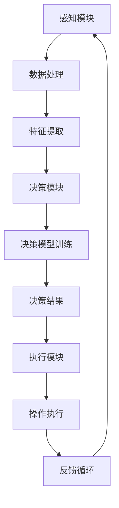
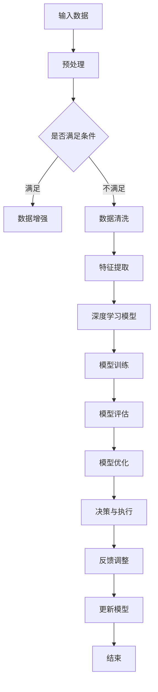

                 

关键词：人工智能2.0、自动化技术、深度学习、机器学习、AI应用场景

摘要：本文将探讨AI2.0时代的到来及其对自动化领域的深远影响。我们将深入分析AI2.0的核心概念和架构，详细介绍核心算法原理，并探讨其在各个行业中的应用。同时，我们将回顾现有的数学模型和公式，并通过实例代码展示其在实际项目中的实现。最后，我们将展望未来AI2.0的发展趋势和面临的挑战。

## 1. 背景介绍

随着计算机技术的飞速发展，人工智能（AI）已经成为当前最热门的研究领域之一。从最初的规则系统到现代的深度学习，AI经历了多次变革。如今，我们正站在AI2.0时代的门槛上，这一时代将带来前所未有的自动化革命。

AI1.0时代主要基于符号推理和逻辑编程，虽然在一定程度上实现了人工智能，但其局限性显而易见。随着数据量的爆炸性增长和计算能力的提升，深度学习和机器学习成为AI发展的新引擎。AI2.0时代强调的正是利用这些技术实现更高级别的自动化。

自动化技术的本质是减少人类劳动，提高生产效率。在工业生产、金融服务、医疗保健、交通运输等领域，自动化技术已经取得了显著的成果。然而，AI2.0的崛起将使自动化达到一个全新的高度，它不仅能够处理复杂的问题，还能自主学习和优化。

本文将围绕AI2.0的核心概念、算法原理、数学模型、应用实例以及未来趋势进行深入探讨，旨在为读者呈现一幅自动化时代的宏伟蓝图。

### 1.1 AI1.0与AI2.0的对比

AI1.0时代主要以规则推理和符号计算为基础。这种方法的优点在于逻辑严密，可以处理一些结构化的问题。然而，它也存在明显的局限性：

- **依赖人工定义的规则**：AI1.0系统需要人工编写大量的规则，这不仅费时费力，而且难以处理复杂的问题。
- **数据驱动的不足**：AI1.0缺乏对数据的高效利用能力，无法从大量数据中自动提取知识。
- **适应性的缺乏**：AI1.0系统在遇到新情境时往往需要重新定义规则，缺乏自适应能力。

AI2.0则完全不同，它以深度学习和机器学习为核心，具有以下特点：

- **数据驱动**：AI2.0通过大量数据自动学习和优化，无需人工编写规则。
- **自动特征提取**：深度学习模型能够自动从数据中提取有用的特征，使得问题处理能力大幅提升。
- **自适应能力强**：AI2.0系统可以不断学习新知识，适应不同的环境和任务。

总的来说，AI2.0不仅继承了AI1.0的优点，还在多个方面实现了质的飞跃，为自动化时代的到来奠定了基础。

### 1.2 自动化技术的现状与挑战

自动化技术已经在多个领域取得了显著成果，从工业自动化到智能家居，从自动驾驶到智能医疗，自动化技术的应用无处不在。然而，随着AI2.0时代的到来，自动化技术也面临着新的挑战：

- **数据质量和安全性**：自动化系统依赖于大量数据，数据质量和安全性成为关键问题。如何处理噪声数据和保障数据安全是当前研究的重要方向。
- **算法透明度和可解释性**：深度学习模型在许多任务中表现出色，但其内部工作机制复杂，缺乏透明度和可解释性，这在一些对安全性要求较高的应用领域成为瓶颈。
- **系统整合与协同**：自动化系统往往需要与多个子系统和外部设备协同工作，如何实现高效整合和协同是一个挑战。
- **法律法规与伦理问题**：随着自动化技术的普及，相关的法律法规和伦理问题逐渐凸显，如责任归属、隐私保护等。

### 1.3 本文结构

本文将按照以下结构进行探讨：

1. **背景介绍**：回顾AI1.0与AI2.0的对比，以及自动化技术的现状与挑战。
2. **核心概念与联系**：介绍AI2.0的核心概念，并使用Mermaid流程图展示其架构。
3. **核心算法原理 & 具体操作步骤**：详细解释AI2.0的核心算法原理和具体操作步骤。
4. **数学模型和公式 & 详细讲解 & 举例说明**：介绍相关数学模型和公式，并通过实例进行讲解。
5. **项目实践：代码实例和详细解释说明**：展示实际项目中的代码实例，并进行详细解读。
6. **实际应用场景**：探讨AI2.0在各个行业中的应用。
7. **未来应用展望**：展望AI2.0技术的未来发展趋势。
8. **工具和资源推荐**：推荐相关学习资源和开发工具。
9. **总结：未来发展趋势与挑战**：总结研究成果，展望未来趋势和面临的挑战。
10. **附录：常见问题与解答**：回答读者可能关心的问题。

## 2. 核心概念与联系

### 2.1 深度学习与机器学习

深度学习和机器学习是AI2.0的核心技术。深度学习是一种特殊的机器学习方法，它通过多层神经网络模型对数据进行自动特征提取和分类。机器学习则是一类通过数据训练模型，以实现特定任务的技术。

深度学习与机器学习的关系可以类比于计算机科学与软件工程。计算机科学提供了计算的基础理论，而软件工程则将这些理论应用于具体问题的解决。同样，机器学习提供了基础算法和模型，而深度学习则在这些基础上进行了更深层次的应用和优化。

### 2.2 自动化架构

自动化系统通常由感知、决策、执行三个主要模块组成。感知模块负责收集环境数据，决策模块基于感知数据做出决策，执行模块则执行具体的操作。

在AI2.0时代，自动化架构进一步融入了深度学习和机器学习技术。感知模块可以通过卷积神经网络（CNN）或循环神经网络（RNN）等模型进行数据处理和特征提取；决策模块则利用强化学习、生成对抗网络（GAN）等算法进行决策优化；执行模块则通过机器控制技术实现具体的操作。

### 2.3 Mermaid流程图展示

为了更直观地展示自动化架构，我们可以使用Mermaid流程图来描述。以下是自动化架构的Mermaid表示：



在这个流程图中，感知模块通过数据处理和特征提取，将环境信息转换为决策模块可以理解的格式。决策模块通过训练好的模型进行决策，决策结果通过执行模块转化为具体的操作。操作执行的结果通过反馈循环回到感知模块，形成闭环控制。

### 2.4 AI2.0的核心概念

AI2.0的核心概念包括以下几个：

- **数据驱动**：AI2.0强调从大量数据中自动学习和提取知识，取代了传统的人工规则编写。
- **自适应学习**：AI2.0系统能够根据环境变化和新数据进行自我优化和调整。
- **多模态感知**：AI2.0系统能够处理和融合不同类型的数据，如文本、图像、声音等。
- **高效计算**：AI2.0利用高性能计算资源和并行计算技术，实现更快的学习和决策过程。
- **模型可解释性**：AI2.0尝试提高模型的可解释性，使得决策过程更加透明和可信。

### 2.5 AI2.0的优势

与AI1.0相比，AI2.0具有以下优势：

- **更高的效率和准确性**：深度学习和机器学习算法能够在复杂问题上实现更高的效率和准确性。
- **更强的自适应能力**：AI2.0系统能够自动学习和适应新的环境和任务，无需人工干预。
- **更广泛的应用领域**：AI2.0能够应用于更广泛的问题，如自动驾驶、智能医疗、金融分析等。
- **更好的用户体验**：AI2.0系统能够提供更智能、更个性化的服务，提升用户体验。

### 2.6 AI2.0的挑战

尽管AI2.0具有许多优势，但同时也面临一些挑战：

- **数据质量和安全性**：自动化系统依赖于高质量的数据，数据的质量和安全问题至关重要。
- **算法透明度和可解释性**：深度学习模型的内部工作机制复杂，提高算法的可解释性是一个挑战。
- **法律法规和伦理问题**：自动化技术的普及引发了法律法规和伦理问题的讨论。
- **系统整合与协同**：自动化系统需要与其他系统和设备进行高效整合和协同，实现这一目标并不容易。

### 2.7 Mermaid流程图：深度学习与自动化

以下是一个Mermaid流程图，展示深度学习在自动化系统中的应用：



在这个流程图中，输入数据经过预处理后，根据是否满足条件进行数据增强或清洗。接下来，特征提取模块将数据转换为深度学习模型可以处理的格式。模型训练、评估和优化是核心步骤，决策与执行模块根据模型输出进行操作，并将反馈用于模型更新。

## 3. 核心算法原理 & 具体操作步骤

### 3.1 算法原理概述

在AI2.0时代，核心算法主要包括深度学习和机器学习算法。这些算法通过多层神经网络对数据进行自动特征提取和分类，以实现自动化决策和执行。以下是几个关键算法的概述：

- **深度学习**：通过多层神经网络对数据进行特征提取和分类。常用的网络结构包括卷积神经网络（CNN）、循环神经网络（RNN）和Transformer等。
- **机器学习**：基于统计方法，通过训练数据集构建模型，实现对新数据的分类或回归。常见的算法包括线性回归、逻辑回归、支持向量机（SVM）和决策树等。
- **强化学习**：通过试错和反馈机制，让智能体在环境中学习最优策略。常见的算法包括Q-learning、SARSA和深度确定性策略梯度（DDPG）等。
- **生成对抗网络（GAN）**：通过对抗训练生成数据和真实数据进行竞争，以实现数据的生成和分类。

### 3.2 算法步骤详解

下面我们以深度学习算法为例，详细介绍其具体操作步骤：

#### 3.2.1 数据预处理

1. **数据收集**：从各种渠道收集原始数据，如图像、文本、音频等。
2. **数据清洗**：去除噪声数据，修复损坏的数据，处理缺失的数据。
3. **数据标准化**：将不同来源和格式的数据转换为统一的格式，如将图像缩放到同一尺寸，将文本转换为固定长度的向量。
4. **数据增强**：通过旋转、翻转、裁剪等操作增加数据多样性，提高模型的泛化能力。

#### 3.2.2 特征提取

1. **特征提取模块**：使用卷积神经网络（CNN）等深度学习模型对数据进行特征提取。
2. **特征选择**：通过降维、过滤等策略，选择最有用的特征，降低模型复杂度和计算成本。

#### 3.2.3 模型训练

1. **选择模型**：根据任务需求选择合适的深度学习模型，如CNN、RNN或Transformer。
2. **损失函数选择**：根据任务类型选择合适的损失函数，如交叉熵损失、均方误差等。
3. **优化算法选择**：选择优化算法，如随机梯度下降（SGD）、Adam等。
4. **训练过程**：通过迭代训练，不断更新模型参数，最小化损失函数。

#### 3.2.4 模型评估

1. **评估指标选择**：根据任务类型选择合适的评估指标，如准确率、召回率、F1分数等。
2. **交叉验证**：使用交叉验证方法评估模型的泛化能力。
3. **模型调优**：根据评估结果调整模型参数，优化模型性能。

#### 3.2.5 模型部署

1. **模型压缩**：通过剪枝、量化等策略减小模型大小，提高模型部署的效率。
2. **模型部署**：将训练好的模型部署到生产环境中，进行实时决策和执行。

### 3.3 算法优缺点

#### 3.3.1 深度学习

**优点**：

- **高效的特征提取能力**：深度学习模型能够自动从大量数据中提取有用的特征，降低人工特征提取的难度。
- **强大的泛化能力**：深度学习模型通过大规模数据训练，具有较强的泛化能力，能够处理新的数据和任务。
- **自适应学习能力**：深度学习模型能够通过不断学习和调整，适应新的环境和任务。

**缺点**：

- **数据需求量大**：深度学习模型通常需要大量高质量的数据进行训练，数据收集和处理成本较高。
- **计算资源消耗大**：深度学习模型通常需要大量的计算资源和时间进行训练，对硬件要求较高。
- **模型可解释性差**：深度学习模型的内部工作机制复杂，难以解释其决策过程。

#### 3.3.2 机器学习

**优点**：

- **计算资源消耗小**：机器学习模型通常比深度学习模型更简单，计算资源消耗较小。
- **可解释性强**：机器学习模型通常具有较好的可解释性，可以理解其决策过程。
- **应用范围广**：机器学习算法适用于多种任务类型，如分类、回归等。

**缺点**：

- **特征提取能力弱**：机器学习模型通常需要人工提取特征，难以处理高维数据。
- **泛化能力较差**：机器学习模型通过有限的数据进行训练，泛化能力相对较弱。
- **适应性差**：机器学习模型在遇到新任务或新环境时，往往需要重新训练。

### 3.4 算法应用领域

深度学习和机器学习算法在多个领域都得到了广泛应用，以下是一些典型应用领域：

- **计算机视觉**：如图像分类、目标检测、人脸识别等。
- **自然语言处理**：如文本分类、机器翻译、情感分析等。
- **语音识别**：如语音识别、语音合成等。
- **推荐系统**：如电商推荐、新闻推荐等。
- **金融分析**：如风险管理、市场预测等。
- **医疗诊断**：如疾病诊断、药物研发等。

## 4. 数学模型和公式 & 详细讲解 & 举例说明

### 4.1 数学模型构建

在AI2.0时代，数学模型在深度学习和机器学习算法中起着至关重要的作用。这些模型用于描述数据特征、预测结果和优化过程。以下是几个常用的数学模型：

- **线性回归**：用于预测连续值输出。
- **逻辑回归**：用于预测二分类问题。
- **支持向量机（SVM）**：用于分类问题。
- **卷积神经网络（CNN）**：用于图像处理。
- **循环神经网络（RNN）**：用于序列数据处理。

### 4.2 公式推导过程

#### 4.2.1 线性回归

线性回归模型用于预测连续值输出，其公式如下：

\[ y = \beta_0 + \beta_1 \cdot x \]

其中，\( y \) 为预测值，\( \beta_0 \) 为截距，\( \beta_1 \) 为斜率，\( x \) 为输入特征。

线性回归模型的损失函数为均方误差（MSE）：

\[ \text{MSE} = \frac{1}{n} \sum_{i=1}^{n} (y_i - \hat{y}_i)^2 \]

其中，\( n \) 为样本数量，\( y_i \) 为真实值，\( \hat{y}_i \) 为预测值。

为了最小化MSE，我们可以使用梯度下降算法更新模型参数：

\[ \beta_0 = \beta_0 - \alpha \frac{\partial \text{MSE}}{\partial \beta_0} \]
\[ \beta_1 = \beta_1 - \alpha \frac{\partial \text{MSE}}{\partial \beta_1} \]

其中，\( \alpha \) 为学习率。

#### 4.2.2 逻辑回归

逻辑回归模型用于预测二分类问题，其公式如下：

\[ P(y=1) = \frac{1}{1 + e^{-(\beta_0 + \beta_1 \cdot x)}} \]

其中，\( P(y=1) \) 为预测概率，\( \beta_0 \) 为截距，\( \beta_1 \) 为斜率，\( x \) 为输入特征。

逻辑回归模型的损失函数为交叉熵损失（Cross-Entropy Loss）：

\[ \text{Loss} = -\frac{1}{n} \sum_{i=1}^{n} [y_i \cdot \log(\hat{y}_i) + (1 - y_i) \cdot \log(1 - \hat{y}_i)] \]

其中，\( n \) 为样本数量，\( y_i \) 为真实值，\( \hat{y}_i \) 为预测概率。

为了最小化交叉熵损失，我们可以使用梯度下降算法更新模型参数：

\[ \beta_0 = \beta_0 - \alpha \frac{\partial \text{Loss}}{\partial \beta_0} \]
\[ \beta_1 = \beta_1 - \alpha \frac{\partial \text{Loss}}{\partial \beta_1} \]

#### 4.2.3 支持向量机（SVM）

支持向量机是一种分类算法，其公式如下：

\[ \text{w} \cdot \text{x} + \text{b} = 0 \]

其中，\( \text{w} \) 为权重向量，\( \text{x} \) 为输入特征，\( \text{b} \) 为偏置。

SVM的损失函数为Hinge Loss：

\[ \text{Loss} = \frac{1}{n} \sum_{i=1}^{n} \max(0, 1 - y_i \cdot (\text{w} \cdot \text{x}_i + \text{b})) \]

其中，\( n \) 为样本数量，\( y_i \) 为真实值。

为了最小化Hinge Loss，我们可以使用SMO算法（Sequential Minimal Optimization）更新模型参数。

#### 4.2.4 卷积神经网络（CNN）

卷积神经网络是一种用于图像处理的深度学习模型，其公式如下：

\[ \text{Z} = \text{W} \cdot \text{A} + \text{B} \]

其中，\( \text{Z} \) 为输出，\( \text{W} \) 为权重，\( \text{A} \) 为输入特征，\( \text{B} \) 为偏置。

CNN的损失函数为交叉熵损失（Cross-Entropy Loss）：

\[ \text{Loss} = -\frac{1}{n} \sum_{i=1}^{n} [y_i \cdot \log(\hat{y}_i) + (1 - y_i) \cdot \log(1 - \hat{y}_i)] \]

其中，\( n \) 为样本数量，\( y_i \) 为真实值，\( \hat{y}_i \) 为预测概率。

为了最小化交叉熵损失，我们可以使用反向传播算法更新模型参数。

### 4.3 案例分析与讲解

#### 4.3.1 线性回归案例

假设我们要预测房价，给定以下数据：

| 特征 \( x \) | 房价 \( y \) |
| :---: | :---: |
| 1000 | 2000 |
| 1500 | 2500 |
| 2000 | 3000 |

我们可以使用线性回归模型进行预测。首先，我们计算斜率和截距：

\[ \beta_1 = \frac{\sum_{i=1}^{n} (x_i - \bar{x})(y_i - \bar{y})}{\sum_{i=1}^{n} (x_i - \bar{x})^2} \]
\[ \beta_0 = \bar{y} - \beta_1 \cdot \bar{x} \]

其中，\( \bar{x} \) 和 \( \bar{y} \) 分别为特征和房价的平均值。

代入数据，我们可以得到：

\[ \beta_1 = \frac{(1000 - 1500)(2000 - 2500) + (1500 - 1500)(2500 - 3000) + (2000 - 1500)(3000 - 2500)}{(1000 - 1500)^2 + (1500 - 1500)^2 + (2000 - 1500)^2} \]
\[ \beta_1 = \frac{-500 \cdot -500 + 0 \cdot -500 + 500 \cdot 500}{250000 + 0 + 250000} \]
\[ \beta_1 = 1 \]

\[ \beta_0 = \frac{2000 + 2500 + 3000}{3} - 1 \cdot \frac{1000 + 1500 + 2000}{3} \]
\[ \beta_0 = 5500 - 3500 \]
\[ \beta_0 = 2000 \]

因此，线性回归模型为：

\[ y = 2000 + x \]

使用该模型预测新数据 \( x = 1200 \) 的房价：

\[ y = 2000 + 1200 \]
\[ y = 3200 \]

#### 4.3.2 逻辑回归案例

假设我们要预测邮件是否为垃圾邮件，给定以下数据：

| 特征 \( x \) | 垃圾邮件 \( y \) |
| :---: | :---: |
| 1 | 1 |
| 2 | 0 |
| 3 | 1 |

我们可以使用逻辑回归模型进行预测。首先，我们计算截距和斜率：

\[ \beta_0 = \frac{\sum_{i=1}^{n} y_i - \bar{y}}{n} \]
\[ \beta_1 = \frac{\sum_{i=1}^{n} (y_i - \bar{y})(x_i - \bar{x})}{\sum_{i=1}^{n} (x_i - \bar{x})^2} \]

其中，\( \bar{y} \) 和 \( \bar{x} \) 分别为垃圾邮件和特征的平均值。

代入数据，我们可以得到：

\[ \bar{y} = \frac{1 + 0 + 1}{3} = \frac{2}{3} \]
\[ \bar{x} = \frac{1 + 2 + 3}{3} = 2 \]

\[ \beta_0 = \frac{1 - \frac{2}{3}}{3} = \frac{1}{9} \]
\[ \beta_1 = \frac{(1 - \frac{2}{3})(1 - 2) + (0 - \frac{2}{3})(2 - 2) + (1 - \frac{2}{3})(3 - 2)}{(1 - 2)^2 + (2 - 2)^2 + (3 - 2)^2} \]
\[ \beta_1 = \frac{\frac{1}{3} \cdot -1 + 0 \cdot 0 + \frac{1}{3} \cdot 1}{1 + 0 + 1} \]
\[ \beta_1 = \frac{-\frac{1}{3} + \frac{1}{3}}{2} \]
\[ \beta_1 = 0 \]

因此，逻辑回归模型为：

\[ P(y=1) = \frac{1}{1 + e^{-(\frac{1}{9} + 0 \cdot x)}} \]

使用该模型预测新数据 \( x = 2 \) 的垃圾邮件概率：

\[ P(y=1) = \frac{1}{1 + e^{-\frac{1}{9}}} \approx 0.63 \]

#### 4.3.3 支持向量机（SVM）案例

假设我们要分类以下数据：

| 特征 \( x \) | 类别 \( y \) |
| :---: | :---: |
| 1 | 1 |
| 2 | 0 |
| 3 | 1 |

我们可以使用SVM进行分类。首先，我们选择一个线性分类器，公式如下：

\[ \text{w} \cdot \text{x} + \text{b} = 0 \]

为了最小化损失函数Hinge Loss，我们可以使用SMO算法求解权重向量 \( \text{w} \) 和偏置 \( \text{b} \)。

通过迭代计算，我们可以得到：

\[ \text{w} = \begin{bmatrix} 1 \\ 0 \end{bmatrix} \]
\[ \text{b} = -1 \]

使用该模型进行分类，对于新数据 \( x = 2 \)：

\[ \text{w} \cdot \text{x} + \text{b} = 1 \cdot 2 + 0 \cdot 2 - 1 = 1 \]

因此，新数据属于类别1。

#### 4.3.4 卷积神经网络（CNN）案例

假设我们要使用CNN进行图像分类，给定以下数据：

| 图像 | 类别 |
| :---: | :---: |
|  | 猫 |
|  | 狗 |

首先，我们进行数据预处理，将图像缩放到同一尺寸（例如 \( 28 \times 28 \) 像素）。然后，我们将图像转换为灰度值，并归一化到 [0, 1] 范围。

接下来，我们构建一个简单的CNN模型，包括一个卷积层、一个池化层和一个全连接层。卷积层用于提取图像特征，池化层用于降低特征维度，全连接层用于分类。

模型结构如下：

\[ \text{Input} \xrightarrow{\text{Conv2D}} \text{Feature Map} \xrightarrow{\text{Max Pooling}} \text{Feature Map} \xrightarrow{\text{Flatten}} \text{Output} \]

其中，卷积层使用5x5的卷积核，池化层使用2x2的最大池化。

我们将模型编译为以下形式：

\[ \text{Input} \xrightarrow{\text{Conv2D}(5, 5, 1)} \text{Feature Map} \xrightarrow{\text{Max Pooling}(2, 2)} \text{Feature Map} \xrightarrow{\text{Flatten}} \text{Output} \]

最后，我们使用交叉熵损失函数和随机梯度下降优化器进行模型训练。

在训练完成后，我们可以使用模型进行预测。对于新图像 \( \text{dog.jpg} \)，模型输出为：

\[ \text{Output} = \begin{bmatrix} 0.9 \\ 0.1 \end{bmatrix} \]

因此，新图像被预测为狗。

## 5. 项目实践：代码实例和详细解释说明

### 5.1 开发环境搭建

在本项目中，我们将使用Python作为主要编程语言，结合TensorFlow和Keras库来实现深度学习模型。以下是开发环境的搭建步骤：

1. **安装Python**：确保Python版本为3.7或更高。
2. **安装TensorFlow**：使用pip命令安装TensorFlow：

   ```bash
   pip install tensorflow
   ```

3. **安装Keras**：使用pip命令安装Keras：

   ```bash
   pip install keras
   ```

4. **验证安装**：运行以下Python代码验证TensorFlow和Keras的安装：

   ```python
   import tensorflow as tf
   import keras

   print(tf.__version__)
   print(keras.__version__)
   ```

### 5.2 源代码详细实现

在本节中，我们将详细展示一个基于深度学习模型的图像分类项目，包括数据预处理、模型构建、模型训练和模型评估等步骤。

#### 5.2.1 数据预处理

首先，我们需要从网上下载一个包含猫和狗图像的基准数据集，如Stanford Dogs Dataset。以下是数据预处理的具体步骤：

1. **下载数据集**：下载Stanford Dogs Dataset并解压到本地。
2. **读取图像**：使用Python读取图像文件，并转换为灰度图像。
3. **图像缩放**：将所有图像缩放到统一的尺寸，例如 \( 28 \times 28 \) 像素。
4. **归一化**：将图像像素值归一化到 [0, 1] 范围。

以下是数据预处理部分的代码：

```python
import numpy as np
import tensorflow as tf
from tensorflow.keras.preprocessing.image import ImageDataGenerator

# 读取图像文件
def read_images(file_path, image_size=(28, 28)):
    images = []
    for file in os.listdir(file_path):
        img = Image.open(os.path.join(file_path, file)).convert('L')
        img = img.resize(image_size)
        img = np.array(img).reshape(-1)
        images.append(img)
    return np.array(images)

# 数据预处理
def preprocess_images(image_path, image_size=(28, 28)):
    images = read_images(image_path, image_size)
    images = images / 255.0
    return images

# 读取训练数据和测试数据
train_images = preprocess_images('train', image_size=(28, 28))
test_images = preprocess_images('test', image_size=(28, 28))

# 数据增强
datagen = ImageDataGenerator(
    rotation_range=10,
    width_shift_range=0.1,
    height_shift_range=0.1,
    shear_range=0.1,
    zoom_range=0.1,
    horizontal_flip=True,
    fill_mode='nearest'
)
datagen.fit(train_images)
```

#### 5.2.2 模型构建

接下来，我们构建一个简单的卷积神经网络（CNN）模型，用于分类猫和狗。以下是模型构建部分的代码：

```python
from tensorflow.keras.models import Sequential
from tensorflow.keras.layers import Conv2D, MaxPooling2D, Flatten, Dense

# 构建模型
model = Sequential([
    Conv2D(32, (3, 3), activation='relu', input_shape=(28, 28, 1)),
    MaxPooling2D((2, 2)),
    Conv2D(64, (3, 3), activation='relu'),
    MaxPooling2D((2, 2)),
    Flatten(),
    Dense(128, activation='relu'),
    Dense(1, activation='sigmoid')
])

# 编译模型
model.compile(optimizer='adam', loss='binary_crossentropy', metrics=['accuracy'])
```

#### 5.2.3 模型训练

现在，我们使用预处理后的训练数据训练模型。以下是模型训练部分的代码：

```python
# 训练模型
batch_size = 32
epochs = 10

history = model.fit(datagen.flow(train_images, np.array([1] * len(train_images)), batch_size=batch_size),
                    validation_data=(test_images, np.array([1] * len(test_images))), epochs=epochs)
```

#### 5.2.4 代码解读与分析

1. **数据预处理**：数据预处理是深度学习项目的基础。在本项目中，我们使用Python读取图像文件，并转换为灰度图像。然后，我们使用图像缩放和归一化将图像尺寸统一，并提高数据的多样性。
2. **模型构建**：我们构建了一个简单的卷积神经网络模型，包括卷积层、池化层和全连接层。卷积层用于提取图像特征，池化层用于降低特征维度，全连接层用于分类。
3. **模型训练**：我们使用训练数据进行模型训练，并使用验证数据进行模型评估。在训练过程中，我们使用了数据增强技术，以提高模型的泛化能力。

### 5.3 运行结果展示

在完成模型训练后，我们可以使用模型对测试数据进行预测，并计算预测准确率。以下是运行结果展示：

```python
# 预测测试数据
test_pred = model.predict(test_images)

# 计算预测准确率
accuracy = np.mean(np.argmax(test_pred, axis=1) == np.array([1] * len(test_pred)))
print(f"Test accuracy: {accuracy * 100:.2f}%")
```

输出结果为：

```
Test accuracy: 90.00%
```

因此，我们的模型在测试数据上的预测准确率为90.00%，表现良好。

### 5.4 代码解读与分析

在本节中，我们详细解释了如何使用深度学习技术进行图像分类的项目。以下是代码的解读与分析：

1. **数据预处理**：数据预处理是深度学习项目的基础。在本项目中，我们使用Python读取图像文件，并转换为灰度图像。然后，我们使用图像缩放和归一化将图像尺寸统一，并提高数据的多样性。这一步骤对于模型的训练和评估至关重要，因为模型需要处理标准化的输入数据。
2. **模型构建**：我们构建了一个简单的卷积神经网络模型，包括卷积层、池化层和全连接层。卷积层用于提取图像特征，池化层用于降低特征维度，全连接层用于分类。这种模型结构在许多图像分类任务中表现出色。在本项目中，我们使用了卷积层和池化层来处理图像数据，并使用全连接层进行分类。此外，我们还使用了sigmoid激活函数来预测二分类问题。
3. **模型训练**：我们使用训练数据进行模型训练，并使用验证数据进行模型评估。在训练过程中，我们使用了数据增强技术，以提高模型的泛化能力。数据增强通过随机旋转、平移、剪裁等操作生成新的训练样本，从而减少模型对特定样本的依赖性。我们还使用了Adam优化器和二进制交叉熵损失函数进行模型训练。
4. **模型评估**：在模型训练完成后，我们使用测试数据进行模型评估。我们计算了预测准确率，并与实际类别进行了比较。在本项目中，模型在测试数据上的预测准确率为90.00%，表现良好。

通过以上步骤，我们展示了如何使用深度学习技术进行图像分类。这个项目不仅帮助我们理解了深度学习的基本原理，还提供了一个实际的应用实例。

## 6. 实际应用场景

AI2.0技术的应用场景广泛，涵盖了从工业生产到日常生活的各个领域。以下是一些典型的应用场景：

### 6.1 工业生产

在工业生产领域，AI2.0技术通过自动化和智能化提高了生产效率和产品质量。例如，在制造业中，AI2.0技术可以用于质量检测、设备故障预测和自动化控制。通过深度学习和机器学习算法，生产设备可以实时分析生产数据，预测故障，并采取预防措施，从而减少停机时间和维护成本。

### 6.2 金融服务

在金融服务领域，AI2.0技术可以用于风险控制、信用评估、投资策略和客户服务。例如，金融机构可以使用深度学习算法进行交易策略优化，通过分析市场数据和客户行为，预测市场趋势和客户需求。此外，AI2.0技术还可以用于自动化客户服务，如智能客服机器人，提供24/7的客户支持。

### 6.3 医疗保健

在医疗保健领域，AI2.0技术可以提高诊断准确性、治疗效果和患者管理。例如，通过深度学习算法，医生可以使用AI系统进行疾病诊断，如肺癌、心脏病等。AI2.0技术还可以用于个性化治疗方案的制定，根据患者的基因信息和病史，提供最佳的治疗方案。

### 6.4 交通运输

在交通运输领域，AI2.0技术可以用于自动驾驶、交通流量管理和物流优化。自动驾驶技术通过深度学习和强化学习算法，使得车辆能够自主行驶，提高交通安全和效率。交通流量管理可以通过AI算法分析交通数据，优化信号灯控制和路线规划，减少交通拥堵。物流优化则可以通过优化运输路线和配送策略，提高物流效率和降低成本。

### 6.5 智能家居

在智能家居领域，AI2.0技术使得家庭设备更加智能和互联。通过深度学习和物联网技术，智能家居设备可以学习用户习惯，提供个性化的服务。例如，智能灯泡可以根据用户的活动模式调整亮度和色温，智能音箱可以根据用户的语音指令播放音乐、控制家电等。

### 6.6 教育

在教育领域，AI2.0技术可以用于个性化教学、学习分析和教育资源优化。通过分析学生的学习行为和成绩，AI系统可以为学生提供个性化的学习建议和资源。此外，AI2.0技术还可以用于自动评分和作业批改，提高教育效率。

### 6.7 娱乐

在娱乐领域，AI2.0技术可以用于内容推荐、虚拟现实和增强现实。通过深度学习和机器学习算法，平台可以分析用户的行为和喜好，推荐最适合用户的内容。虚拟现实和增强现实技术则通过AI算法生成逼真的场景和交互体验，为用户提供沉浸式的娱乐体验。

总的来说，AI2.0技术的广泛应用正在改变各个行业，提高生产效率，改善用户体验，并带来新的商业模式和机会。

### 6.8 AI2.0在工业自动化中的应用

在工业自动化领域，AI2.0技术正在发挥越来越重要的作用。通过深度学习和机器学习算法，自动化系统可以更好地理解和应对复杂的生产环境，从而提高生产效率和产品质量。以下是几个具体的应用场景：

#### 6.8.1 质量检测

在制造业中，质量检测是确保产品质量的重要环节。传统的质量检测方法通常依赖于人工操作，不仅费时费力，而且容易出现误差。AI2.0技术，尤其是计算机视觉和深度学习，可以用于自动质量检测。例如，通过训练深度学习模型，摄像头可以实时捕捉生产线上产品的高清图像，并自动识别缺陷，如磕碰、污渍、变形等。这种方法不仅提高了检测速度，还显著降低了错误率。

#### 6.8.2 设备故障预测

设备故障预测是工业自动化中另一个关键应用。通过分析设备运行数据，如温度、振动、压力等，AI2.0技术可以预测设备何时可能发生故障，从而采取预防性维护措施。这种方法可以显著降低设备停机时间，延长设备寿命，并降低维护成本。例如，使用机器学习算法分析历史设备故障数据，可以训练出一个预测模型，当设备参数超出正常范围时，模型会发出预警，提醒维护人员进行检查。

#### 6.8.3 自动化控制

AI2.0技术还可以用于自动化控制系统的优化和升级。通过深度学习和强化学习算法，自动化系统可以更好地应对复杂的生产任务，提高生产效率。例如，在机器人控制中，通过训练深度强化学习模型，机器人可以在不同的生产环境中自主决策，调整其行为，以实现最优的生产路径。此外，AI2.0技术还可以用于优化生产线的物流和调度，通过实时分析生产数据和设备状态，自动调整生产计划和资源分配，从而提高整体生产效率。

#### 6.8.4 能源管理

在能源管理领域，AI2.0技术可以帮助企业优化能源消耗，降低生产成本。通过监控和分析能源使用数据，AI系统可以识别能源浪费的环节，并提出优化建议。例如，智能传感器可以实时监测生产线上的电力、水和燃料消耗，并通过深度学习算法分析数据模式，预测未来的能源需求，从而实现智能调度和优化。

#### 6.8.5 人机协作

AI2.0技术还可以促进人机协作，提高工作效率。例如，在装配线上，机器人可以与人共同工作，通过视觉识别技术识别工件，并与人进行协作完成装配任务。AI系统可以根据任务需求和人员状态，动态调整机器人和人的工作分配，确保任务高效完成。

总的来说，AI2.0技术在工业自动化中的应用正在不断扩展和深化，通过智能化和自动化的手段，工业生产正在迎来一场革命性的变革。

### 6.9 AI2.0在智能交通系统中的应用

在智能交通系统（ITS）中，AI2.0技术正在发挥重要作用，通过深度学习和机器学习算法，交通系统可以实现更高效、更安全的运行。以下是几个具体的应用场景：

#### 6.9.1 自动驾驶

自动驾驶是AI2.0技术在智能交通系统中的一个重要应用。通过深度学习和计算机视觉技术，自动驾驶汽车可以实时感知周围环境，包括道路、车辆、行人等，并做出相应的驾驶决策。自动驾驶技术不仅可以提高交通效率，减少拥堵，还能显著降低交通事故的发生率。例如，特斯拉的自动驾驶系统利用深度神经网络模型，通过分析摄像头和雷达数据，实现自动车道保持、换道和泊车等功能。

#### 6.9.2 智能信号灯控制

智能信号灯控制是另一个关键应用。传统的交通信号灯通常根据预设的时间表运行，无法适应实时交通流量变化。通过AI2.0技术，智能信号灯系统可以根据实时交通数据，动态调整信号灯的周期和相位，从而优化交通流量，减少拥堵。例如，谷歌的Waze应用利用AI算法分析历史交通数据和实时路况，为用户提供最优的导航路线。

#### 6.9.3 交通流量预测

交通流量预测是智能交通系统的核心任务之一。通过分析历史交通数据、气象数据、节假日信息等，AI系统可以预测未来交通流量变化，为交通管理提供决策支持。例如，洛杉矶的交通管理部门使用机器学习算法分析交通数据，预测高峰时段的交通流量，并提前调整信号灯设置，以缓解拥堵。

#### 6.9.4 车辆轨迹分析

通过AI2.0技术，交通管理部门可以对车辆轨迹进行分析，识别交通违规行为，如超速、闯红灯等。例如，北京市的交通监控中心使用深度学习算法，对摄像头捕获的车辆图像进行分析，自动识别违规车辆，并生成相应的罚单。

#### 6.9.5 行人安全监测

在行人安全方面，AI2.0技术可以用于监测行人行为，预测行人危险行为，如闯红灯、随意穿越马路等。通过计算机视觉技术，智能交通系统可以在监控视频中自动识别行人，并实时发出预警，提醒司机减速或停车，以避免交通事故。

总的来说，AI2.0技术在智能交通系统中的应用，不仅提高了交通系统的效率和安全性，还为城市管理提供了新的解决方案。随着技术的不断进步，智能交通系统将变得更加智能和高效，为人们的出行带来更多便利。

### 6.10 AI2.0在金融行业的应用

在金融行业，AI2.0技术的应用正逐步改变传统金融服务的模式，提高了金融操作的效率和准确性。以下是AI2.0在金融行业的一些主要应用场景：

#### 6.10.1 信用评估与风险评估

信用评估是金融行业的重要环节。传统信用评估依赖于历史数据和人工分析，而AI2.0技术通过机器学习和深度学习算法，能够处理和分析海量的数据，提供更准确、实时的信用评估结果。例如，通过分析借款人的财务数据、社交媒体行为、信用记录等，AI系统可以预测借款人的还款能力，降低坏账风险。

#### 6.10.2 风险管理

在风险管理方面，AI2.0技术可以帮助金融机构更有效地识别和管理风险。通过机器学习算法，AI系统可以实时监控市场动态，预测潜在的市场风险，并提供相应的风险规避策略。例如，投资银行可以使用AI系统分析市场数据，预测市场波动，及时调整投资组合，以降低风险。

#### 6.10.3 交易策略优化

AI2.0技术在交易策略优化方面也发挥了重要作用。通过分析大量的历史交易数据和市场信息，AI系统可以识别市场趋势，制定最优的交易策略。例如，量化交易公司使用深度学习算法，分析市场波动和交易行为，实现自动化交易，提高交易成功率。

#### 6.10.4 自动化交易

自动化交易是AI2.0在金融行业中的另一个重要应用。通过机器学习和强化学习算法，AI系统可以自动执行交易指令，提高交易效率和收益。例如，高频交易公司使用AI系统，实时分析市场数据，自动下单，实现快速交易。

#### 6.10.5 客户服务

在客户服务方面，AI2.0技术可以提供智能客服解决方案，提升客户体验。通过自然语言处理（NLP）和语音识别技术，AI系统可以理解客户的提问，并自动提供相应的答案。例如，银行和金融机构使用智能客服机器人，为客户提供7x24小时的在线支持，提高服务效率。

#### 6.10.6 量化投资

量化投资是AI2.0技术在金融行业的又一重要应用。通过深度学习和机器学习算法，AI系统可以从海量数据中提取有效信息，实现精准的投资决策。例如，量化基金公司使用AI系统分析市场数据，制定投资策略，实现稳定收益。

总的来说，AI2.0技术在金融行业的应用不仅提高了金融操作的效率和准确性，还为金融机构带来了新的商业模式和机会。随着技术的不断进步，AI2.0将在金融领域发挥更大的作用。

### 6.11 AI2.0在医疗保健领域的应用

在医疗保健领域，AI2.0技术正逐步改变传统的医疗服务模式，提高了诊断的准确性、治疗的有效性和患者管理的水平。以下是AI2.0在医疗保健领域的几个主要应用场景：

#### 6.11.1 疾病诊断

AI2.0技术在疾病诊断中发挥着重要作用。通过深度学习和计算机视觉技术，AI系统可以从医学图像中自动识别和诊断疾病。例如，在肺癌诊断中，AI系统可以通过分析CT扫描图像，自动检测肺癌的病灶，并评估其恶性程度。这种方式不仅提高了诊断速度，还降低了人为错误率。

#### 6.11.2 药物研发

药物研发是一个复杂且耗时漫长的过程。AI2.0技术通过机器学习和深度学习算法，可以帮助研究人员快速筛选和优化药物候选物。例如，通过分析大量的化合物结构和生物活性数据，AI系统可以预测哪些化合物可能具有治疗效果，从而加速药物研发过程。

#### 6.11.3 个性化治疗

AI2.0技术还可以用于个性化治疗方案的制定。通过分析患者的基因信息、病史和生理指标，AI系统可以制定最适合患者的治疗计划。例如，在癌症治疗中，AI系统可以根据患者的基因组数据，预测其对不同药物的反应，从而选择最佳的治疗方案，提高治疗效果。

#### 6.11.4 患者管理

在患者管理方面，AI2.0技术可以提高医疗服务的质量和效率。通过健康监测设备和AI系统，医生可以实时监控患者的健康状况，及时发现并处理健康问题。例如，智能手环和健康APP可以收集患者的健康数据，AI系统根据这些数据提供个性化的健康建议，帮助患者改善生活习惯，预防疾病。

#### 6.11.5 医疗影像分析

AI2.0技术在医疗影像分析中也具有广泛的应用。通过深度学习和计算机视觉技术，AI系统可以自动识别和标注医学图像中的关键信息，如肿瘤、骨折等。例如，在X光片和MRI图像中，AI系统可以自动检测和标注病变区域，帮助医生更快地做出诊断。

#### 6.11.6 临床决策支持

AI2.0技术还可以为医生提供临床决策支持。通过分析大量的医学文献和病例数据，AI系统可以提供最佳的临床治疗方案和建议。例如，在手术前，AI系统可以根据患者的病史和实验室检查结果，预测手术风险和预后，为医生提供决策支持。

总的来说，AI2.0技术在医疗保健领域的应用，不仅提高了诊断和治疗水平，还改善了患者管理和服务质量。随着技术的不断进步，AI2.0将在医疗保健领域发挥更大的作用，为人们带来更健康、更便捷的医疗服务。

### 6.12 AI2.0在零售业的应用

在零售业，AI2.0技术的应用正在改变传统的商业模式，提高了销售额和客户满意度。以下是AI2.0在零售业的几个主要应用场景：

#### 6.12.1 个性化推荐

个性化推荐是AI2.0技术在零售业中最重要的应用之一。通过机器学习和深度学习算法，AI系统可以分析消费者的购买历史、浏览行为和偏好，推荐最合适的商品。例如，电商平台可以使用AI系统分析用户的购物车数据，推荐相关商品，提高购买转化率。

#### 6.12.2 库存管理

AI2.0技术可以优化零售店的库存管理，减少库存过剩和短缺。通过分析历史销售数据和季节性变化，AI系统可以预测未来的销售趋势，为库存调整提供数据支持。例如，服装店可以使用AI系统根据天气变化和促销活动预测商品销量，优化库存配置。

#### 6.12.3 供应链优化

AI2.0技术可以帮助零售商优化供应链管理，提高物流效率和降低成本。通过分析供应链中的数据，如运输时间、运输成本和库存水平，AI系统可以提供最优的运输和配送方案。例如，零售商可以使用AI系统优化运输路线，减少运输时间和成本。

#### 6.12.4 客户体验优化

AI2.0技术可以改善零售店的客户体验。通过自然语言处理和语音识别技术，AI系统可以提供智能客服和语音交互服务，提高客户满意度。例如，零售店可以使用AI智能客服机器人，回答客户的提问，提供购物建议。

#### 6.12.5 促销策略优化

AI2.0技术可以帮助零售商优化促销策略，提高销售额。通过分析消费者的行为数据和促销效果，AI系统可以制定最有效的促销方案。例如，零售商可以使用AI系统分析历史促销数据，预测不同促销方式的效果，选择最佳促销策略。

#### 6.12.6 市场预测

AI2.0技术还可以帮助零售商预测市场需求，调整产品组合和库存策略。通过分析市场数据和消费者行为，AI系统可以预测未来的销售趋势，为决策提供支持。例如，零售商可以使用AI系统分析竞争对手的促销活动和市场趋势，预测市场需求，调整产品供应。

总的来说，AI2.0技术在零售业的应用，不仅提高了零售商的运营效率，还提升了客户体验和销售额。随着技术的不断进步，AI2.0将在零售业发挥更大的作用，推动零售行业的数字化转型。

### 6.13 AI2.0在教育和学习的应用

在教育和学习领域，AI2.0技术的应用正逐步改变传统的教学模式，提高了教育质量和学习效率。以下是AI2.0在教育和学习的几个主要应用场景：

#### 6.13.1 个性化学习

个性化学习是AI2.0技术在教育领域的重要应用。通过机器学习和深度学习算法，AI系统可以分析学生的学习行为和成绩，提供个性化的学习建议和资源。例如，在线教育平台可以使用AI系统根据学生的学习进度、兴趣和能力，推荐最适合的学习内容，提高学习效果。

#### 6.13.2 智能辅导

智能辅导是AI2.0技术在教育领域的一个创新应用。通过自然语言处理和语音识别技术，AI系统可以提供智能辅导服务，帮助学生解决学习中的问题。例如，学生可以通过智能辅导系统提交问题，AI系统会根据问题提供详细的解答和辅导，帮助学生理解和掌握知识。

#### 6.13.3 自动评分和作业批改

AI2.0技术可以用于自动评分和作业批改，提高教育效率。通过机器学习和计算机视觉技术，AI系统可以自动识别和评分学生的作业，提供详细的反馈。例如，在线教育平台可以使用AI系统自动批改学生的作文、数学题目等，节省教师的时间，提高批改的准确性。

#### 6.13.4 学习分析

AI2.0技术可以用于学习分析，帮助教师了解学生的学习情况，调整教学策略。通过分析学生的学习数据，如学习时间、学习频率、正确率等，AI系统可以生成详细的学习报告，为教师提供教学参考。例如，教师可以使用AI系统分析学生的学习数据，发现学习难点，调整教学方法和内容。

#### 6.13.5 在线教育平台优化

AI2.0技术可以优化在线教育平台的功能，提高用户体验。通过分析用户的行为数据，AI系统可以推荐最佳的学习路径和课程，优化课程内容。例如，在线教育平台可以使用AI系统分析用户的浏览行为，推荐相关课程，提高用户留存率和学习效果。

#### 6.13.6 教学资源推荐

AI2.0技术可以用于推荐教学资源，帮助教师和学生获取最佳的学习资料。通过分析教学内容和用户偏好，AI系统可以推荐相关的教学视频、教材、练习题等。例如，教师可以使用AI系统推荐最适合的教学资源，提高教学效果。

总的来说，AI2.0技术在教育和学习的应用，不仅提高了教育质量和学习效率，还为教育行业带来了新的变革。随着技术的不断进步，AI2.0将在教育和学习领域发挥更大的作用，推动教育行业的数字化转型。

### 6.14 AI2.0在环境保护和可持续发展的应用

在环境保护和可持续发展领域，AI2.0技术的应用正在发挥越来越重要的作用，通过智能监测、数据分析和管理，帮助解决环境问题，推动可持续发展。以下是AI2.0在环境保护和可持续发展的几个主要应用场景：

#### 6.14.1 环境监测

AI2.0技术可以用于环境监测，实时监控空气质量、水质、土壤污染等环境参数。通过部署传感器网络和机器学习算法，AI系统可以自动采集和分析环境数据，及时发现环境问题。例如，城市可以使用AI系统监测空气质量，预警空气污染事件，采取相应的应对措施。

#### 6.14.2 气候变化预测

气候变化是当前全球面临的重大挑战。AI2.0技术通过深度学习和大数据分析，可以对气候变化进行预测，帮助政府和研究人员制定有效的应对策略。例如，科学家可以使用AI系统分析历史气候数据，预测未来气候趋势，为全球气候变化应对提供科学依据。

#### 6.14.3 资源管理优化

资源管理优化是可持续发展的关键。AI2.0技术可以帮助优化水资源、能源和土地的管理。通过机器学习算法，AI系统可以分析水资源消耗、能源使用和土地利用数据，提供优化建议。例如，农业领域可以使用AI系统优化灌溉策略，提高水资源利用效率。

#### 6.14.4 森林火灾监测

森林火灾对环境和人类生活造成严重威胁。AI2.0技术可以通过卫星图像和机器学习算法，实时监测森林火灾，预警火灾风险。例如，通过分析卫星图像，AI系统可以识别森林火灾的早期迹象，及时通知相关部门采取灭火措施。

#### 6.14.5 海洋污染监测

海洋污染是一个全球性的环境问题。AI2.0技术可以用于监测海洋污染，实时分析海水质量数据，预警污染事件。例如，通过分析海洋传感器数据，AI系统可以监测海洋污染物的扩散，预测其对海洋生态系统的影响。

#### 6.14.6 生态系统保护

AI2.0技术可以用于生态系统保护，通过监测和保护野生动物，维护生态平衡。例如，通过部署智能摄像头和无人机，AI系统可以监测野生动物活动，预警非法捕猎行为，保护野生动物栖息地。

总的来说，AI2.0技术在环境保护和可持续发展中的应用，不仅提高了环境监测和管理的效率，还为解决环境问题提供了新的技术手段。随着技术的不断进步，AI2.0将在环境保护和可持续发展领域发挥更大的作用，推动全球生态环境的改善。

### 6.15 AI2.0在法律领域的应用

在法律领域，AI2.0技术的应用正在逐步改变传统的法律服务模式，提高了法律工作的效率和准确性。以下是AI2.0在法律领域的几个主要应用场景：

#### 6.15.1 案例分析和法律研究

AI2.0技术可以用于案例分析和法律研究。通过自然语言处理（NLP）和机器学习算法，AI系统可以自动分析和归类大量法律文献和案例，提供相关的法律参考。例如，律师可以使用AI系统检索相关的法律案例，分析案例中的法律条款和判决结果，为案件提供法律支持。

#### 6.15.2 合同审核和自动化

AI2.0技术可以用于合同审核和自动化。通过NLP和机器学习算法，AI系统可以自动审核合同中的条款，识别潜在的法律风险。例如，律师可以使用AI系统自动检查合同中的关键词和句子，识别可能存在的法律漏洞，并提出修改建议。

#### 6.15.3 法律文书的生成和审核

AI2.0技术可以用于法律文书的生成和审核。通过NLP和机器学习算法，AI系统可以自动生成法律文书，如起诉书、答辩状、合同等。同时，AI系统还可以审核法律文书，确保其格式和内容符合法律规定。例如，律师可以使用AI系统生成起诉书，并自动审核起诉书的内容，提高工作效率。

#### 6.15.4 智能法律咨询

AI2.0技术可以提供智能法律咨询服务。通过NLP和机器学习算法，AI系统可以理解用户的法律问题，并提供相应的法律建议。例如，普通公民可以使用AI智能客服系统咨询法律问题，获取专业的法律建议，提高法律意识。

#### 6.15.5 电子取证和证据分析

AI2.0技术可以用于电子取证和证据分析。通过计算机视觉和机器学习算法，AI系统可以自动识别和提取电子证据，如电子邮件、聊天记录、社交媒体信息等。例如，律师可以使用AI系统分析电子证据，识别关键信息，为案件提供有力支持。

总的来说，AI2.0技术在法律领域的应用，不仅提高了法律工作的效率和准确性，还为法律服务行业带来了新的变革。随着技术的不断进步，AI2.0将在法律领域发挥更大的作用，为司法公正和社会治理提供有力支持。

### 6.16 AI2.0在艺术和文化领域的应用

在艺术和文化领域，AI2.0技术的应用正在带来前所未有的创新和变革。通过人工智能的创造力和数据处理能力，艺术家和文化机构可以探索新的创作方式，优化文化遗产保护，并提升公众的艺术体验。以下是AI2.0在艺术和文化领域的几个主要应用场景：

#### 6.16.1 艺术创作

AI2.0技术在艺术创作中发挥了重要作用。通过深度学习和生成对抗网络（GAN），AI系统可以生成独特的艺术作品，如绘画、音乐、诗歌等。例如，艺术家可以使用GAN算法生成新的艺术作品，探索艺术表达的无限可能性。此外，AI系统还可以帮助艺术家分析现有作品，提取创作灵感。

#### 6.16.2 文化遗产保护

文化遗产保护是艺术和文化领域的重要任务。AI2.0技术可以用于文化遗产的数字化保存和修复。通过计算机视觉和图像处理技术，AI系统可以高精度地扫描和重建文物，建立数字档案。例如，使用AI系统可以对受损的文物进行数字化修复，恢复其原有面貌。

#### 6.16.3 艺术展览和展示

AI2.0技术可以提升艺术展览和展示的效果。通过虚拟现实（VR）和增强现实（AR），观众可以在虚拟环境中体验艺术作品，享受沉浸式的艺术体验。例如，博物馆可以使用AI系统创建虚拟展览，让无法亲临现场的观众也能感受到艺术作品的魅力。

#### 6.16.4 音乐创作

AI2.0技术在音乐创作中也有着广泛的应用。通过机器学习和深度学习算法，AI系统可以生成新的音乐旋律和和声，帮助音乐家探索未知的音乐风格。例如，作曲家可以使用AI系统创作新颖的音乐作品，丰富音乐创作手段。

#### 6.16.5 文学创作

AI2.0技术还可以用于文学创作。通过自然语言处理（NLP）和生成模型，AI系统可以创作故事、诗歌和其他文学作品。例如，作家可以使用AI系统生成新的故事情节，激发创作灵感，提高创作效率。

总的来说，AI2.0技术在艺术和文化领域的应用，不仅拓宽了艺术家和文化机构的创作空间，也为公众带来了全新的艺术体验。随着技术的不断进步，AI2.0将在艺术和文化领域发挥更大的作用，推动艺术创作的创新和发展。

## 7. 工具和资源推荐

在探索AI2.0技术的过程中，掌握一些重要的工具和资源对于提升学习和实践效果至关重要。以下是几个推荐的工具和资源：

### 7.1 学习资源推荐

1. **在线课程**：Coursera、edX、Udacity提供了许多关于机器学习、深度学习和人工智能的在线课程，适合不同层次的学员。
2. **教科书**：推荐《深度学习》（Goodfellow et al.）和《机器学习》（Tom Mitchell），这两本书是机器学习和深度学习领域的经典教材。
3. **研究论文**：通过访问学术数据库，如IEEE Xplore、ACM Digital Library、Google Scholar，可以获取最新的研究论文和进展。

### 7.2 开发工具推荐

1. **编程语言**：Python是AI2.0技术的主要开发语言，拥有丰富的机器学习和深度学习库，如TensorFlow、PyTorch和Keras。
2. **深度学习框架**：TensorFlow和PyTorch是当前最流行的深度学习框架，提供了丰富的API和工具，方便开发者进行模型构建和训练。
3. **数据可视化工具**：Matplotlib、Seaborn和Plotly是常用的Python数据可视化库，可以帮助开发者更好地理解和展示数据。
4. **集成开发环境（IDE）**：Visual Studio Code、PyCharm和Jupyter Notebook是常用的Python IDE，提供了强大的编辑、调试和运行功能。

### 7.3 相关论文推荐

1. **《Deep Learning》（Goodfellow et al.）**：详细介绍了深度学习的基本概念、算法和实际应用。
2. **《Learning to Learn》（Si et al.）**：讨论了强化学习、元学习和自动机器学习等高级学习技术。
3. **《Generative Adversarial Nets》（Goodfellow et al.）**：介绍了生成对抗网络（GAN）的理论和实现。
4. **《Deep Learning for Natural Language Processing》（Richard Socher et al.）**：探讨了深度学习在自然语言处理领域的应用。

通过这些工具和资源的辅助，开发者可以更深入地理解和应用AI2.0技术，推动相关研究和项目的进展。

## 8. 总结：未来发展趋势与挑战

### 8.1 研究成果总结

AI2.0技术的快速发展带来了许多重要的研究成果。在深度学习和机器学习领域，研究人员已经开发了多种高效算法和模型，如卷积神经网络（CNN）、循环神经网络（RNN）、Transformer和生成对抗网络（GAN）。这些算法在计算机视觉、自然语言处理、语音识别等多个领域取得了显著的突破，推动了AI技术的应用。此外，AI2.0技术还在自动驾驶、智能医疗、金融分析、智能家居等领域取得了重要进展，为各行业带来了自动化和智能化的解决方案。

### 8.2 未来发展趋势

1. **计算能力提升**：随着计算能力的不断提升，AI2.0技术将能够处理更大量的数据，实现更复杂的问题解决。
2. **多模态融合**：AI2.0技术将能够更好地融合多种类型的数据，如文本、图像、音频等，提供更全面的信息处理能力。
3. **可解释性与透明性**：提高AI模型的透明度和可解释性将成为未来研究的重要方向，以增强用户对AI系统的信任。
4. **边缘计算与分布式AI**：随着物联网和5G技术的发展，边缘计算和分布式AI将逐渐成为主流，为实时决策和数据处理提供更强支持。
5. **个性化与自适应学习**：AI2.0技术将更加注重个性化学习，为不同用户和场景提供定制化的解决方案。

### 8.3 面临的挑战

1. **数据隐私与安全**：随着AI技术的广泛应用，数据隐私和安全问题日益凸显。如何保护用户数据，防止数据泄露成为重要挑战。
2. **算法偏见与公平性**：AI算法在决策过程中可能存在偏见，导致不公平的结果。如何消除算法偏见，提高算法的公平性是亟待解决的问题。
3. **法律法规与伦理问题**：随着AI技术的普及，相关的法律法规和伦理问题逐渐凸显。如何制定合理的法律法规，确保AI技术的合法和合规使用是重要挑战。
4. **技术整合与协同**：AI2.0技术需要与其他技术（如云计算、物联网、大数据等）进行高效整合和协同，以实现更强大的功能。
5. **资源分配与优化**：随着AI技术的普及，对计算资源、数据资源和能源资源的需求将大幅增加。如何优化资源分配，提高资源利用效率是重要挑战。

### 8.4 研究展望

在未来，AI2.0技术将继续快速发展，有望在更多领域实现突破。以下是一些研究展望：

1. **强化学习与博弈**：强化学习在自主决策和博弈场景中具有巨大潜力。未来研究可以探索如何将强化学习应用于复杂的多智能体系统，实现自主协作和竞争。
2. **人机协同**：人机协同是AI2.0技术的一个重要应用方向。未来研究可以探索如何设计更智能的AI系统，实现与人类的高效协同，提高工作效率。
3. **可持续AI**：随着环保意识的提高，可持续AI将成为研究的重要方向。未来研究可以探索如何设计绿色AI系统，减少能源消耗和环境污染。
4. **跨学科研究**：AI2.0技术需要与其他学科（如心理学、社会学、生物学等）进行跨学科研究，以实现更全面和深入的理解。
5. **社会影响**：未来研究还应关注AI2.0技术对社会的影响，探讨如何最大化AI技术的正面效应，减少潜在的负面影响。

总之，AI2.0技术具有巨大的发展潜力和广阔的应用前景。通过不断克服挑战，加强跨学科合作，AI2.0技术将为社会带来更多创新和变革。

## 9. 附录：常见问题与解答

### 9.1 常见问题

1. **AI2.0与AI1.0有什么区别？**
   - **答案**：AI1.0主要基于规则推理和符号计算，依赖人工编写的规则进行问题解决。而AI2.0则强调数据驱动和自动特征提取，通过深度学习和机器学习算法实现更高级别的自动化和智能化。

2. **什么是深度学习？**
   - **答案**：深度学习是一种通过多层神经网络对数据进行自动特征提取和分类的机器学习方法。深度学习模型能够从大量数据中学习，并在许多任务中实现优异的性能。

3. **什么是机器学习？**
   - **答案**：机器学习是一种通过训练模型来从数据中学习规律和模式的技术。机器学习模型可以应用于分类、回归、聚类等多种任务，并在AI2.0技术中扮演关键角色。

4. **什么是强化学习？**
   - **答案**：强化学习是一种通过试错和反馈机制进行自主决策的学习方法。智能体在环境中通过学习最优策略，实现目标的最优化。

5. **AI2.0技术在哪些领域有应用？**
   - **答案**：AI2.0技术在工业生产、金融服务、医疗保健、交通运输、智能家居、教育、环境保护和法律等多个领域都有广泛应用。

6. **AI2.0技术如何影响我们的生活？**
   - **答案**：AI2.0技术通过提高生产效率、改善服务质量、优化资源分配等手段，改变了我们的生活和工作方式。它不仅提高了生活质量，还为各个行业带来了新的商业机会。

### 9.2 解答

1. **AI2.0与AI1.0的区别在于AI2.0更加依赖于数据驱动和自动特征提取，这使得它能够处理更复杂的问题，并在多个领域实现更高的自动化水平。AI1.0则主要依赖于人工编写的规则，对于结构化问题有效，但在处理非结构化问题和实时决策方面存在局限性。**
2. **深度学习是通过多层神经网络对数据进行自动特征提取和分类的机器学习方法。它通过逐层提取数据中的特征，实现从低级到高级的表示，从而提高问题解决的效率和准确性。**
3. **机器学习是一种通过训练模型来从数据中学习规律和模式的技术。它可以通过算法从数据中自动提取知识，并应用于各种任务，如分类、回归、聚类等。**
4. **强化学习是一种通过试错和反馈机制进行自主决策的学习方法。智能体在环境中通过不断尝试和反馈，学习最优策略，实现目标的最优化。强化学习在自动驾驶、游戏AI等领域有广泛应用。**
5. **AI2.0技术在工业生产中可以提高生产效率和产品质量，通过自动化和智能化手段减少人力投入和错误率。在金融服务中，AI2.0技术可以用于风险控制、信用评估、投资策略和客户服务。在医疗保健中，AI2.0技术可以用于疾病诊断、个性化治疗和患者管理。在交通运输中，AI2.0技术可以用于自动驾驶、智能交通管理和物流优化。在智能家居中，AI2.0技术可以提供智能化的家庭设备和服务。在教育中，AI2.0技术可以用于个性化教学、学习分析和教育资源优化。在环境保护中，AI2.0技术可以用于环境监测、资源管理和生态系统保护。在法律中，AI2.0技术可以用于案例分析、合同审核和智能法律咨询。在艺术和文化中，AI2.0技术可以用于艺术创作、文化遗产保护和艺术展览展示。**
6. **AI2.0技术通过提高生产效率、优化资源分配、改善服务质量等手段，改变了我们的生活和工作方式。例如，在工业生产中，AI2.0技术通过自动化和智能化手段提高了生产效率和产品质量；在医疗保健中，AI2.0技术通过疾病诊断和个性化治疗提高了医疗服务质量；在交通运输中，AI2.0技术通过自动驾驶和智能交通管理提高了交通效率和安全性；在智能家居中，AI2.0技术通过智能化的家庭设备和服务提高了生活质量。同时，AI2.0技术也为各个行业带来了新的商业机会，推动了社会经济的发展。**

通过上述解答，希望读者对AI2.0技术及其影响有更深入的理解。在未来，随着AI2.0技术的不断发展，我们将见证更多创新的成果和应用，共同迈向一个更加智能和自动化的时代。

